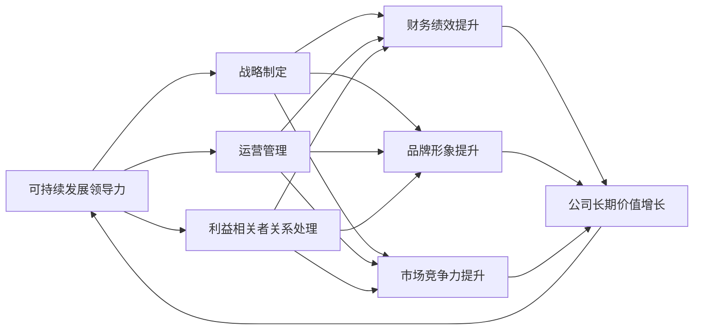

# 可持续发展领导力对公司长期价值的影响

> 关键词：可持续发展领导力、公司长期价值、企业社会责任、战略规划、利益相关者管理、环境管理、社会影响

> 摘要：本文深入探讨了可持续发展领导力对公司长期价值的影响。首先介绍了研究的背景、目的、预期读者、文档结构和相关术语。接着阐述了可持续发展领导力和公司长期价值的核心概念及其联系，通过文本示意图和 Mermaid 流程图进行清晰展示。详细讲解了与之相关的核心算法原理，并给出具体操作步骤及 Python 源代码示例。运用数学模型和公式对两者关系进行量化分析，结合实际案例说明。在项目实战部分，搭建开发环境，实现并解读相关代码。分析了可持续发展领导力在不同实际应用场景中的作用，推荐了学习资源、开发工具框架和相关论文著作。最后总结了未来发展趋势与挑战，解答常见问题并提供扩展阅读和参考资料，旨在为企业理解和应用可持续发展领导力提升长期价值提供全面的指导。

## 1. 背景介绍 
### 1.1 目的和范围
随着全球经济的发展和社会环境的变化，可持续发展已成为企业关注的焦点。可持续发展领导力作为一种新兴的领导理念，强调在追求经济利益的同时，兼顾环境和社会的可持续性。本研究的目的是深入分析可持续发展领导力对公司长期价值的影响，探讨如何通过有效的可持续发展领导力提升公司的长期竞争力和价值创造能力。

研究范围涵盖了不同行业、不同规模的企业，分析了可持续发展领导力在战略制定、运营管理、利益相关者关系处理等方面的作用，以及对公司财务绩效、品牌形象、市场竞争力等长期价值指标的影响。

### 1.2 预期读者
本文的预期读者包括企业管理者、投资者、学者以及对可持续发展和企业管理感兴趣的人士。企业管理者可以从中获取提升可持续发展领导力的方法和策略，以增强公司的长期价值；投资者可以了解可持续发展领导力对企业投资价值的影响，做出更明智的投资决策；学者可以通过本文的研究为进一步的学术探讨提供参考；对可持续发展和企业管理感兴趣的人士可以加深对这一领域的理解。

### 1.3 文档结构概述
本文共分为十个部分。第一部分为背景介绍，阐述了研究的目的、范围、预期读者和文档结构；第二部分介绍了可持续发展领导力和公司长期价值的核心概念及其联系，通过文本示意图和 Mermaid 流程图进行展示；第三部分讲解了核心算法原理和具体操作步骤，并给出 Python 源代码示例；第四部分运用数学模型和公式对两者关系进行量化分析，结合实际案例说明；第五部分是项目实战，包括开发环境搭建、源代码实现和代码解读；第六部分分析了可持续发展领导力的实际应用场景；第七部分推荐了学习资源、开发工具框架和相关论文著作；第八部分总结了未来发展趋势与挑战；第九部分解答常见问题；第十部分提供扩展阅读和参考资料。

### 1.4 术语表
#### 1.4.1 核心术语定义
- **可持续发展领导力**：指领导者在企业中推动可持续发展战略实施的能力，包括制定可持续发展目标、整合资源、激励员工、与利益相关者合作等方面的能力。
- **公司长期价值**：指公司在长期内为股东、员工、客户、社会等利益相关者创造的价值总和，包括财务价值、品牌价值、社会价值等多个方面。
- **企业社会责任**：指企业在经济、法律、道德等方面应承担的责任，包括环境保护、员工权益保护、社区发展等方面的责任。

#### 1.4.2 相关概念解释
- **利益相关者**：指与企业有利益关系的个人或组织，包括股东、员工、客户、供应商、政府、社区等。
- **战略规划**：指企业为实现长期目标而制定的总体计划，包括目标设定、策略选择、资源配置等方面的内容。
- **环境管理**：指企业为减少对环境的影响而采取的一系列管理措施，包括节能减排、资源回收利用、环境友好产品开发等方面的内容。

#### 1.4.3 缩略词列表
- **CSR**：Corporate Social Responsibility（企业社会责任）
- **ESG**：Environmental, Social and Governance（环境、社会和治理）

## 2. 核心概念与联系 
### 核心概念原理
#### 可持续发展领导力
可持续发展领导力的核心原理在于领导者能够认识到可持续发展的重要性，并将其融入到企业的战略和运营中。领导者需要具备前瞻性的视野，能够预见社会和环境变化对企业的影响，制定相应的可持续发展战略。同时，领导者还需要具备沟通和协调能力，能够与利益相关者进行有效的沟通和合作，共同推动可持续发展目标的实现。

#### 公司长期价值
公司长期价值的核心原理在于企业通过持续的价值创造活动，为利益相关者提供长期的回报。公司长期价值不仅包括财务价值，还包括品牌价值、社会价值等多个方面。企业需要通过优化资源配置、提高运营效率、创新产品和服务等方式，提升自身的竞争力和价值创造能力，从而实现长期价值的增长。

### 两者联系
可持续发展领导力与公司长期价值之间存在着密切的联系。可持续发展领导力能够引导企业制定符合社会和环境发展趋势的战略，从而提升企业的长期竞争力。通过推动可持续发展战略的实施，企业可以降低环境风险、提高资源利用效率、增强员工的归属感和忠诚度，从而为公司长期价值的增长奠定基础。同时，公司长期价值的增长也为可持续发展领导力的发挥提供了更多的资源和空间，形成了良性循环。

### 文本示意图
可持续发展领导力通过战略制定、运营管理和利益相关者关系处理等途径，影响公司的财务绩效、品牌形象和市场竞争力，进而提升公司长期价值。公司长期价值的提升又为可持续发展领导力的进一步发挥提供支持，促进企业的可持续发展。

### Mermaid 流程图


## 3. 核心算法原理 & 具体操作步骤 
### 核心算法原理
为了量化可持续发展领导力对公司长期价值的影响，我们可以采用回归分析的方法。回归分析是一种统计方法，用于研究自变量和因变量之间的关系。在本研究中，自变量为可持续发展领导力的相关指标，如可持续发展战略的制定情况、环境管理的绩效等；因变量为公司长期价值的相关指标，如财务绩效、品牌价值等。

### 具体操作步骤
1. **数据收集**：收集企业的可持续发展领导力和公司长期价值的相关数据，包括财务报表、环境报告、社会责任报告等。
2. **变量定义**：确定自变量和因变量的具体指标，并进行量化处理。
3. **模型建立**：根据数据的特点和研究目的，选择合适的回归模型，如线性回归模型、多元回归模型等。
4. **模型估计**：使用统计软件对回归模型进行估计，得到回归系数和相关统计量。
5. **模型检验**：对回归模型进行检验，包括拟合优度检验、显著性检验等，以评估模型的可靠性和有效性。
6. **结果分析**：根据回归系数和相关统计量，分析可持续发展领导力对公司长期价值的影响程度和方向。

### Python 源代码示例
```python
import pandas as pd
import statsmodels.api as sm

# 读取数据
data = pd.read_csv('sustainable_leadership_data.csv')

# 定义自变量和因变量
X = data[['sustainable_strategy', 'environmental_management']]
y = data['long_term_value']

# 添加常数项
X = sm.add_constant(X)

# 建立线性回归模型
model = sm.OLS(y, X)

# 模型估计
results = model.fit()

# 输出回归结果
print(results.summary())
```

## 4. 数学模型和公式 & 详细讲解 & 举例说明 
### 数学模型和公式
我们采用多元线性回归模型来分析可持续发展领导力对公司长期价值的影响，模型公式如下：

$$
Y = \beta_0 + \beta_1X_1 + \beta_2X_2 + \cdots + \beta_nX_n + \epsilon
$$

其中，$Y$ 表示公司长期价值，$X_1, X_2, \cdots, X_n$ 表示可持续发展领导力的相关指标，$\beta_0$ 为截距项，$\beta_1, \beta_2, \cdots, \beta_n$ 为回归系数，$\epsilon$ 为误差项。

### 详细讲解
回归系数 $\beta_i$ 表示在其他自变量不变的情况下，自变量 $X_i$ 每增加一个单位，因变量 $Y$ 的平均变化量。如果 $\beta_i$ 为正数，则说明自变量 $X_i$ 与因变量 $Y$ 呈正相关关系；如果 $\beta_i$ 为负数，则说明自变量 $X_i$ 与因变量 $Y$ 呈负相关关系。

### 举例说明
假设我们收集了 100 家企业的数据，自变量 $X_1$ 表示可持续发展战略的制定情况（用 0 - 10 分表示），自变量 $X_2$ 表示环境管理的绩效（用 0 - 10 分表示），因变量 $Y$ 表示公司的财务绩效（用净利润表示）。通过回归分析得到如下结果：

$$
Y = 100 + 20X_1 + 15X_2 + \epsilon
$$

这意味着在其他条件不变的情况下，可持续发展战略的制定情况每提高 1 分，公司的净利润平均增加 20 万元；环境管理的绩效每提高 1 分，公司的净利润平均增加 15 万元。

## 5. 项目实战：代码实际案例和详细解释说明 
### 5.1  开发环境搭建
为了实现上述回归分析的代码，我们需要搭建以下开发环境：
1. **Python 环境**：安装 Python 3.x 版本，可以从 Python 官方网站下载安装包进行安装。
2. **必要的库**：安装 pandas 和 statsmodels 库，可以使用以下命令进行安装：
```sh
pip install pandas statsmodels
```

### 5.2  源代码详细实现和代码解读
```python
import pandas as pd
import statsmodels.api as sm

# 读取数据
data = pd.read_csv('sustainable_leadership_data.csv')

# 定义自变量和因变量
X = data[['sustainable_strategy', 'environmental_management']]
y = data['long_term_value']

# 添加常数项
X = sm.add_constant(X)

# 建立线性回归模型
model = sm.OLS(y, X)

# 模型估计
results = model.fit()

# 输出回归结果
print(results.summary())
```

#### 代码解读
1. **导入必要的库**：导入 pandas 和 statsmodels 库，pandas 用于数据处理，statsmodels 用于回归分析。
2. **读取数据**：使用 `pd.read_csv` 函数读取存储在 `sustainable_leadership_data.csv` 文件中的数据。
3. **定义自变量和因变量**：从数据中提取自变量 `sustainable_strategy` 和 `environmental_management`，以及因变量 `long_term_value`。
4. **添加常数项**：使用 `sm.add_constant` 函数为自变量添加常数项，以满足线性回归模型的要求。
5. **建立线性回归模型**：使用 `sm.OLS` 函数建立线性回归模型，其中 `y` 为因变量，`X` 为自变量。
6. **模型估计**：使用 `model.fit()` 方法对模型进行估计，得到回归结果。
7. **输出回归结果**：使用 `results.summary()` 方法输出回归结果的详细信息，包括回归系数、标准误差、t 值、p 值等。

### 5.3  代码解读与分析
通过回归结果的输出，我们可以得到以下信息：
1. **回归系数**：回归系数表示自变量对因变量的影响程度。如果回归系数为正数，则说明自变量与因变量呈正相关关系；如果回归系数为负数，则说明自变量与因变量呈负相关关系。
2. **标准误差**：标准误差表示回归系数的估计误差。标准误差越小，说明回归系数的估计越准确。
3. **t 值**：t 值用于检验回归系数的显著性。t 值越大，说明回归系数越显著。
4. **p 值**：p 值用于判断回归系数是否显著。如果 p 值小于 0.05，则说明回归系数在 95% 的置信水平下显著。

通过对回归结果的分析，我们可以判断可持续发展领导力的相关指标对公司长期价值的影响是否显著，以及影响的程度和方向。

## 6. 实际应用场景 
### 战略制定
在战略制定方面，可持续发展领导力可以引导企业制定符合社会和环境发展趋势的战略。例如，企业可以将可持续发展目标纳入战略规划中，如减少碳排放、提高资源利用效率、推动社会公平等。通过制定可持续发展战略，企业可以降低环境风险、提高资源利用效率、增强品牌形象，从而提升公司的长期竞争力和价值。

### 运营管理
在运营管理方面，可持续发展领导力可以促进企业采用环保、节能的生产方式和管理模式。例如，企业可以实施绿色供应链管理，选择环保的供应商和原材料；推广节能减排技术，降低能源消耗和环境污染；加强员工培训，提高员工的环保意识和责任感。通过优化运营管理，企业可以降低成本、提高效率、增强社会责任感，从而提升公司的长期价值。

### 利益相关者关系处理
在利益相关者关系处理方面，可持续发展领导力可以帮助企业与利益相关者建立良好的合作关系。例如，企业可以加强与股东的沟通，向股东传达可持续发展战略和目标，提高股东的满意度和忠诚度；加强与员工的沟通，关注员工的需求和发展，提高员工的归属感和忠诚度；加强与客户的沟通，了解客户的需求和期望，提供符合环保要求的产品和服务，提高客户的满意度和忠诚度。通过处理好利益相关者关系，企业可以获得更多的支持和资源，从而提升公司的长期价值。

### 品牌建设
在品牌建设方面，可持续发展领导力可以帮助企业塑造良好的品牌形象。例如，企业可以通过积极参与社会公益活动、推动环保事业发展等方式，提高企业的社会知名度和美誉度；通过发布可持续发展报告、公开企业的环境和社会绩效等方式，增强企业的透明度和公信力。通过塑造良好的品牌形象，企业可以吸引更多的客户和投资者，从而提升公司的长期价值。

## 7. 工具和资源推荐
### 7.1 学习资源推荐
#### 7.1.1 书籍推荐
- 《可持续发展领导力》：本书系统地介绍了可持续发展领导力的概念、理论和实践，提供了许多实际案例和操作方法，对企业管理者和学者具有很高的参考价值。
- 《企业社会责任：理论与实践》：本书深入探讨了企业社会责任的内涵、理论基础和实践经验，对企业如何履行社会责任、提升企业价值具有重要的指导意义。
- 《绿色供应链管理》：本书介绍了绿色供应链管理的概念、方法和实践，对企业如何实施绿色供应链管理、降低环境风险具有重要的参考价值。

#### 7.1.2 在线课程
- Coursera 平台上的“可持续发展领导力”课程：该课程由知名教授授课，内容涵盖可持续发展领导力的各个方面，包括战略制定、运营管理、利益相关者关系处理等。
- edX 平台上的“企业社会责任与可持续发展”课程：该课程介绍了企业社会责任的理论和实践，以及如何将可持续发展理念融入企业战略和运营中。

#### 7.1.3 技术博客和网站
- 世界可持续发展工商理事会（WBCSD）官网：该网站提供了大量关于可持续发展的最新资讯、研究报告和案例分析，是了解可持续发展领域动态的重要渠道。
- 可持续发展会计准则委员会（SASB）官网：该网站提供了可持续发展会计准则和报告框架，对企业进行可持续发展报告具有重要的指导作用。

### 7.2 开发工具框架推荐
#### 7.2.1 IDE和编辑器
- PyCharm：一款功能强大的 Python 集成开发环境，提供了代码编辑、调试、版本控制等功能，适合开发 Python 代码。
- Jupyter Notebook：一种交互式的编程环境，支持 Python、R 等多种编程语言，适合进行数据探索和分析。

#### 7.2.2 调试和性能分析工具
- PDB：Python 自带的调试工具，可以帮助开发者定位和解决代码中的问题。
- cProfile：Python 自带的性能分析工具，可以分析代码的运行时间和内存使用情况，帮助开发者优化代码性能。

#### 7.2.3 相关框架和库
- Pandas：一个强大的数据处理和分析库，提供了数据结构和数据分析工具，适合处理和分析大规模数据。
- Statsmodels：一个用于统计建模和计量经济学分析的 Python 库，提供了多种统计模型和方法，适合进行回归分析和时间序列分析。

### 7.3 相关论文著作推荐
#### 7.3.1 经典论文
- “The Stakeholder Theory of the Corporation: Concepts, Evidence, and Implications”：该论文提出了利益相关者理论，强调企业应该考虑所有利益相关者的利益，对企业社会责任和可持续发展的研究产生了深远的影响。
- “Corporate Social Responsibility: A Theory of the Firm Perspective”：该论文从企业理论的角度出发，探讨了企业社会责任的本质和动机，为企业社会责任的研究提供了理论基础。

#### 7.3.2 最新研究成果
- “Sustainable Leadership and Corporate Performance: A Meta - analysis”：该研究通过元分析的方法，综合了多个实证研究的结果，分析了可持续发展领导力与企业绩效之间的关系。
- “The Impact of Environmental, Social, and Governance (ESG) Factors on Corporate Financial Performance: A Literature Review”：该文献综述总结了近年来关于 ESG 因素对企业财务绩效影响的研究成果，为企业的可持续发展决策提供了参考。

#### 7.3.3 应用案例分析
- “Unilever's Sustainable Living Plan: A Case Study in Sustainable Leadership”：该案例分析了联合利华的可持续发展战略和实践，展示了可持续发展领导力在大型企业中的应用和成效。
- “Patagonia's Environmental and Social Responsibility: A Case Study in Sustainable Business”：该案例分析了巴塔哥尼亚公司在环境和社会责任方面的实践，为企业如何实现可持续发展提供了借鉴。

## 8. 总结：未来发展趋势与挑战
### 未来发展趋势
1. **更加注重全面可持续发展**：未来，企业将更加注重经济、环境和社会的全面可持续发展，将可持续发展目标融入到企业的战略和运营的各个环节中。
2. **数字化转型与可持续发展的融合**：随着数字化技术的发展，企业将利用大数据、人工智能等技术手段，实现可持续发展管理的数字化和智能化，提高可持续发展管理的效率和效果。
3. **加强利益相关者合作**：企业将加强与利益相关者的合作，共同推动可持续发展目标的实现。例如，企业将与供应商、客户、政府等合作，共同开展节能减排、环保项目等。
4. **可持续发展报告的标准化和规范化**：未来，可持续发展报告将更加标准化和规范化，企业将按照统一的标准和框架进行可持续发展报告的编制和披露，提高报告的可比性和可信度。

### 挑战
1. **短期利益与长期价值的平衡**：企业在追求可持续发展的过程中，往往面临着短期利益与长期价值的平衡问题。例如，企业在实施环保项目时，可能需要投入大量的资金和资源，短期内会影响企业的财务绩效。因此，企业需要找到一种平衡短期利益和长期价值的方法。
2. **可持续发展指标的量化和评估**：可持续发展涉及到经济、环境和社会等多个方面的指标，如何对这些指标进行量化和评估是一个挑战。目前，虽然已经有一些可持续发展指标体系和评估方法，但还存在一些不足之处，需要进一步完善。
3. **人才短缺**：可持续发展领导力需要具备跨学科的知识和技能，包括管理学、环境科学、社会学等。目前，具备这些知识和技能的人才相对短缺，企业需要加强人才培养和引进。
4. **政策和法规的不确定性**：可持续发展受到政策和法规的影响较大，政策和法规的不确定性会给企业的可持续发展带来一定的风险。企业需要密切关注政策和法规的变化，及时调整战略和运营。

## 9. 附录：常见问题与解答
### 1. 什么是可持续发展领导力？
可持续发展领导力是指领导者在企业中推动可持续发展战略实施的能力，包括制定可持续发展目标、整合资源、激励员工、与利益相关者合作等方面的能力。

### 2. 可持续发展领导力对公司长期价值有哪些影响？
可持续发展领导力可以引导企业制定符合社会和环境发展趋势的战略，提升企业的长期竞争力；促进企业采用环保、节能的生产方式和管理模式，降低成本、提高效率；帮助企业与利益相关者建立良好的合作关系，获得更多的支持和资源；塑造良好的品牌形象，吸引更多的客户和投资者，从而提升公司的长期价值。

### 3. 如何衡量可持续发展领导力？
可以从可持续发展战略的制定情况、环境管理的绩效、社会责任感的体现等方面来衡量可持续发展领导力。例如，可以通过评估企业的可持续发展报告、环境绩效指标、社会公益活动参与情况等方式来衡量。

### 4. 企业如何提升可持续发展领导力？
企业可以通过以下方式提升可持续发展领导力：加强领导者的培训和教育，提高领导者对可持续发展的认识和理解；建立可持续发展管理体系，明确各部门和人员的职责和权限；加强与利益相关者的沟通和合作，共同推动可持续发展目标的实现；鼓励员工参与可持续发展活动，提高员工的环保意识和责任感。

### 5. 可持续发展领导力与企业社会责任有什么关系？
可持续发展领导力是推动企业履行社会责任的重要力量。具备可持续发展领导力的领导者能够将企业社会责任纳入企业的战略和运营中，引导企业在经济、环境和社会等方面实现可持续发展。同时，企业履行社会责任的实践也可以提升企业的可持续发展领导力。

## 10. 扩展阅读 & 参考资料
### 扩展阅读
- 《可持续发展的商业模式创新》：本书介绍了可持续发展商业模式的概念、类型和创新方法，对企业如何实现可持续发展提供了新的思路。
- 《循环经济：理论与实践》：本书探讨了循环经济的理论基础和实践经验，对企业如何实现资源的循环利用和可持续发展具有重要的参考价值。

### 参考资料
- 相关企业的可持续发展报告和年度报告
- 学术期刊上发表的关于可持续发展领导力和公司长期价值的研究论文
- 国际组织发布的可持续发展相关报告和指南，如联合国可持续发展目标报告、世界银行的可持续发展报告等。