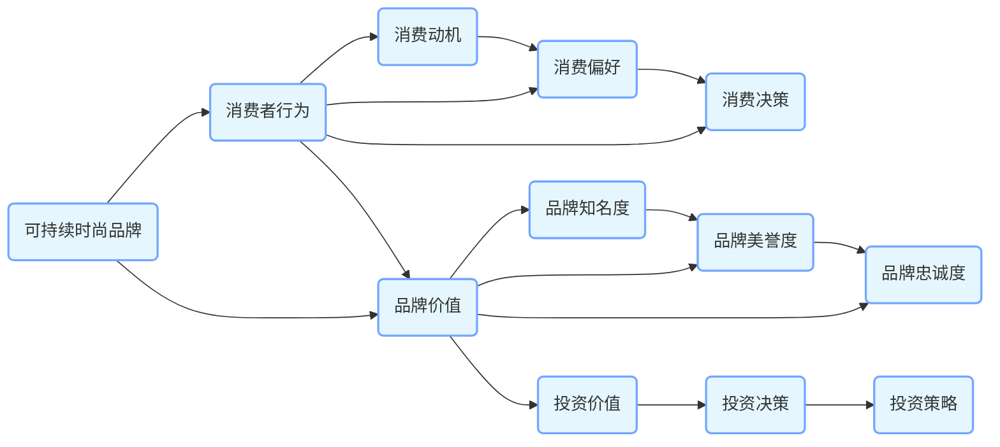

# 可持续时尚品牌的消费者行为分析与投资

> 关键词：可持续时尚品牌、消费者行为、投资策略、市场趋势、环保意识、消费心理、品牌价值

> 摘要：本文聚焦于可持续时尚品牌，深入分析消费者行为，并探讨与之相关的投资机会。首先阐述可持续时尚品牌的背景，包括其目的、目标读者等内容。接着剖析核心概念，明确其与传统时尚品牌的联系与区别。通过核心算法原理和数学模型，进一步揭示消费者行为背后的规律。结合项目实战案例，详细解释如何对可持续时尚品牌进行研究和评估。探讨该领域的实际应用场景，为品牌发展和投资决策提供参考。推荐相关的学习资源、开发工具和论文著作，助力读者深入了解。最后总结可持续时尚品牌的未来发展趋势与挑战，同时解答常见问题并提供扩展阅读资料，旨在为关注可持续时尚品牌的从业者、投资者等提供全面且有价值的信息。

## 1. 背景介绍 
### 1.1 目的和范围
随着全球环保意识的不断提高，可持续发展理念逐渐渗透到各个行业，时尚产业也不例外。可持续时尚品牌应运而生，旨在平衡时尚产业的经济利益与环境保护、社会责任之间的关系。本文的目的在于深入分析可持续时尚品牌的消费者行为，揭示其消费动机、偏好和决策过程，为品牌的市场推广、产品设计和投资决策提供科学依据。

研究范围涵盖了国内外主要的可持续时尚品牌，包括快时尚、高端时尚和小众设计师品牌等不同类型。同时，考虑到消费者行为受到文化、社会、经济等多方面因素的影响，研究将综合分析不同地区、不同年龄、不同收入水平的消费者群体的行为特征。

### 1.2 预期读者
本文的预期读者包括但不限于以下几类人群：
- 可持续时尚品牌的从业者，如品牌管理者、市场营销人员、产品设计师等，他们可以从本文中了解消费者需求，优化品牌策略和产品设计。
- 投资者，包括风险投资家、私募基金经理、个人投资者等，通过对消费者行为的分析，评估可持续时尚品牌的投资价值和潜力。
- 学术研究人员，对可持续时尚、消费者行为、市场营销等领域感兴趣的学者和研究人员，可以将本文作为研究参考和理论依据。
- 普通消费者，了解可持续时尚品牌的发展和消费者行为，有助于他们做出更明智的消费决策，推动可持续时尚的普及和发展。

### 1.3 文档结构概述
本文将按照以下结构进行阐述：
- 核心概念与联系：介绍可持续时尚品牌的定义、特点和发展历程，分析其与传统时尚品牌的区别和联系，构建相关概念的逻辑框架。
- 核心算法原理 & 具体操作步骤：运用数据分析和机器学习算法，深入分析消费者行为数据，包括消费者的购买频率、偏好、忠诚度等，详细阐述算法原理和操作步骤。
- 数学模型和公式 & 详细讲解 & 举例说明：建立数学模型，量化消费者行为与品牌价值、市场趋势等因素之间的关系，通过具体案例进行详细讲解和说明。
- 项目实战：代码实际案例和详细解释说明：结合实际项目案例，展示如何运用上述理论和方法进行可持续时尚品牌的消费者行为分析和投资评估，包括开发环境搭建、源代码实现和代码解读。
- 实际应用场景：探讨可持续时尚品牌在不同领域的实际应用场景，如品牌营销、产品设计、供应链管理等，为品牌的实践提供参考。
- 工具和资源推荐：推荐相关的学习资源、开发工具和论文著作，帮助读者进一步深入学习和研究可持续时尚品牌的消费者行为和投资。
- 总结：未来发展趋势与挑战：总结可持续时尚品牌的发展现状，分析其未来发展趋势和面临的挑战，为从业者和投资者提供前瞻性的思考。
- 附录：常见问题与解答：解答读者在阅读过程中可能遇到的常见问题，提供清晰的解释和指导。
- 扩展阅读 & 参考资料：提供相关的扩展阅读资料和参考文献，方便读者进一步深入研究。

### 1.4 术语表
#### 1.4.1 核心术语定义
- 可持续时尚品牌：指在设计、生产、销售等各个环节中，充分考虑环境保护、社会责任和经济可持续性的时尚品牌。这些品牌通常采用环保材料、可持续生产工艺，关注员工福利和社会公平。
- 消费者行为：指消费者在购买、使用和处置产品或服务过程中所表现出的心理和行为特征，包括需求、动机、决策过程、购买行为等。
- 投资：指投资者为了获取预期收益，将资金投入到可持续时尚品牌或相关项目中的行为。投资方式包括股权融资、债权融资、风险投资等。
- 品牌价值：指品牌在消费者心目中的形象和声誉，以及由此带来的市场竞争力和商业价值。品牌价值可以通过品牌知名度、美誉度、忠诚度等指标来衡量。

#### 1.4.2 相关概念解释
- 环保意识：指消费者对环境保护问题的认知和关注程度，以及由此产生的环保行为和消费偏好。环保意识的提高促使消费者更倾向于选择可持续时尚品牌。
- 社会责任：指企业在创造经济价值的同时，对社会和环境所承担的责任和义务。可持续时尚品牌通过采取环保措施、关注员工福利、支持社会公益等方式履行社会责任。
- 循环经济：指一种以资源的高效利用和循环利用为核心，以“减量化、再利用、资源化”为原则，以低消耗、低排放、高效率为基本特征的经济发展模式。可持续时尚品牌在生产和销售过程中遵循循环经济原则，减少资源浪费和环境污染。

#### 1.4.3 缩略词列表
- CSR：Corporate Social Responsibility，企业社会责任
- ESG：Environmental, Social and Governance，环境、社会和治理
- ROI：Return on Investment，投资回报率

## 2. 核心概念与联系 
### 2.1 可持续时尚品牌的定义与特点
可持续时尚品牌是一种新兴的时尚商业模式，它将可持续发展理念贯穿于品牌的整个生命周期。从原材料的选择到产品的设计、生产、销售和售后服务，都充分考虑了环境保护、社会责任和经济可持续性。

可持续时尚品牌的特点主要包括以下几个方面：
- **环保材料的使用**：优先选择可再生、可回收、可降解的材料，如有机棉、麻、竹子等天然纤维，以及再生聚酯、尼龙等合成材料。这些材料不仅对环境友好，而且具有良好的性能和品质。
- **可持续生产工艺**：采用节能、节水、低污染的生产工艺，减少能源消耗和废弃物排放。例如，一些品牌采用数字化印刷技术代替传统的印染工艺，降低了水资源的消耗和化学物质的排放。
- **社会责任的履行**：关注员工福利和社会公平，确保生产过程中的劳动权益得到保障。同时，积极参与社会公益活动，支持环境保护、教育、扶贫等项目。
- **产品的耐久性和可修复性**：设计和生产具有较长使用寿命的产品，鼓励消费者进行修复和再利用，减少产品的废弃和浪费。一些品牌提供产品维修服务，延长产品的使用寿命。

### 2.2 可持续时尚品牌与传统时尚品牌的联系与区别
可持续时尚品牌与传统时尚品牌既有联系又有区别。

联系方面：
- **时尚属性**：两者都属于时尚产业，都追求时尚潮流和审美价值，满足消费者对美的需求。
- **市场竞争**：在同一市场环境中竞争，争夺消费者的关注和市场份额。

区别方面：
- **价值观**：传统时尚品牌更注重短期的经济利益和时尚潮流的追逐，而可持续时尚品牌将可持续发展作为核心价值观，强调环境保护、社会责任和经济可持续性的平衡。
- **生产方式**：传统时尚品牌往往采用大规模、标准化的生产方式，注重生产效率和成本控制；而可持续时尚品牌更倾向于采用小规模、定制化的生产方式，注重产品的质量和可持续性。
- **消费者群体**：传统时尚品牌的消费者更关注时尚潮流和品牌形象，而可持续时尚品牌的消费者更注重环保意识和社会责任，对产品的可持续性有较高的要求。

### 2.3 核心概念的逻辑框架
为了更好地理解可持续时尚品牌的消费者行为和投资，我们构建了以下逻辑框架：



在这个逻辑框架中，可持续时尚品牌是核心，它影响着消费者行为和品牌价值。消费者行为包括消费动机、消费偏好和消费决策，这些行为又反过来影响品牌价值。品牌价值通过品牌知名度、美誉度和忠诚度来体现，而品牌价值又决定了品牌的投资价值。投资决策和投资策略则基于品牌的投资价值制定。

## 3. 核心算法原理 & 具体操作步骤 
### 3.1 消费者行为数据分析算法
为了深入分析可持续时尚品牌的消费者行为，我们可以运用多种数据分析算法，如聚类分析、关联规则挖掘、预测模型等。

#### 3.1.1 聚类分析
聚类分析是一种无监督学习算法，用于将消费者数据按照相似性进行分组。通过聚类分析，我们可以发现不同类型的消费者群体，了解他们的消费特征和需求。

以下是一个使用Python的`scikit-learn`库进行聚类分析的示例代码：

```python
import pandas as pd
from sklearn.cluster import KMeans
import matplotlib.pyplot as plt

# 读取消费者数据
data = pd.read_csv('consumer_data.csv')

# 选择需要分析的特征
features = data[['age', 'income', 'purchase_frequency', 'sustainability_score']]

# 标准化数据
from sklearn.preprocessing import StandardScaler
scaler = StandardScaler()
scaled_features = scaler.fit_transform(features)

# 确定聚类的数量
wcss = []
for i in range(1, 11):
    kmeans = KMeans(n_clusters=i, init='k-means++', max_iter=300, n_init=10, random_state=0)
    kmeans.fit(scaled_features)
    wcss.append(kmeans.inertia_)

# 绘制手肘图
plt.plot(range(1, 11), wcss)
plt.title('Elbow Method')
plt.xlabel('Number of clusters')
plt.ylabel('WCSS')
plt.show()

# 根据手肘图选择合适的聚类数量
kmeans = KMeans(n_clusters=3, init='k-means++', max_iter=300, n_init=10, random_state=0)
pred_y = kmeans.fit_predict(scaled_features)

# 将聚类结果添加到原始数据中
data['cluster'] = pred_y

# 分析不同聚类的特征
cluster_analysis = data.groupby('cluster').mean()
print(cluster_analysis)
```

#### 3.1.2 关联规则挖掘
关联规则挖掘是一种数据挖掘算法，用于发现消费者行为之间的关联关系。通过关联规则挖掘，我们可以了解消费者在购买可持续时尚产品时的搭配偏好和购买习惯。

以下是一个使用Python的`mlxtend`库进行关联规则挖掘的示例代码：

```python
from mlxtend.preprocessing import TransactionEncoder
from mlxtend.frequent_patterns import apriori, association_rules
import pandas as pd

# 读取购物篮数据
basket_data = [['t-shirt', 'jeans', 'sneakers'],
               ['dress', 'sandals', 'handbag'],
               ['t-shirt', 'skirt', 'heels'],
               ['jeans', 'sweater', 'boots']]

# 数据预处理
te = TransactionEncoder()
te_ary = te.fit(basket_data).transform(basket_data)
df = pd.DataFrame(te_ary, columns=te.columns_)

# 挖掘频繁项集
frequent_itemsets = apriori(df, min_support=0.2, use_colnames=True)

# 生成关联规则
rules = association_rules(frequent_itemsets, metric="confidence", min_threshold=0.7)

# 打印关联规则
print(rules)
```

### 3.2 具体操作步骤
#### 3.2.1 数据收集
收集可持续时尚品牌的消费者数据，包括消费者的基本信息（如年龄、性别、收入等）、购买行为数据（如购买频率、购买金额、购买产品类型等）、偏好数据（如品牌偏好、产品款式偏好等）和环保意识数据（如对可持续时尚的认知程度、环保行为等）。

数据来源可以包括品牌的官方网站、电商平台、社交媒体、线下门店等。

#### 3.2.2 数据预处理
对收集到的数据进行清洗、转换和标准化处理，去除缺失值、异常值和重复数据，将数据转换为适合分析的格式。

#### 3.2.3 算法选择和模型训练
根据分析目的选择合适的数据分析算法，如聚类分析、关联规则挖掘、预测模型等。使用训练数据对模型进行训练和优化，调整模型的参数，提高模型的准确性和性能。

#### 3.2.4 结果分析和解释
对模型的输出结果进行分析和解释，发现消费者行为的规律和特征，如不同类型的消费者群体、消费者的购买偏好和关联关系等。根据分析结果为可持续时尚品牌的市场推广、产品设计和投资决策提供建议。

## 4. 数学模型和公式 & 详细讲解 & 举例说明 
### 4.1 消费者行为预测模型
为了预测消费者的购买行为，我们可以建立一个基于逻辑回归的预测模型。逻辑回归是一种常用的分类算法，用于预测二元变量（如购买或不购买）的概率。

#### 4.1.1 数学模型
逻辑回归模型的基本形式为：

$$P(Y = 1|X) = \frac{1}{1 + e^{-z}}$$

其中，$P(Y = 1|X)$ 表示在给定特征向量 $X$ 的条件下，事件 $Y = 1$（购买）发生的概率，$z$ 是线性组合：

$$z = \beta_0 + \beta_1X_1 + \beta_2X_2 + \cdots + \beta_nX_n$$

$\beta_0$ 是截距项，$\beta_1, \beta_2, \cdots, \beta_n$ 是回归系数，$X_1, X_2, \cdots, X_n$ 是特征变量。

#### 4.1.2 详细讲解
逻辑回归模型的目标是通过最大化似然函数来估计回归系数 $\beta_0, \beta_1, \cdots, \beta_n$。似然函数的表达式为：

$$L(\beta) = \prod_{i = 1}^{N}P(Y_i = 1|X_i)^{y_i}(1 - P(Y_i = 1|X_i))^{1 - y_i}$$

其中，$N$ 是样本数量，$y_i$ 是第 $i$ 个样本的真实标签（0 或 1）。

为了方便计算，通常对似然函数取对数，得到对数似然函数：

$$\log L(\beta) = \sum_{i = 1}^{N}[y_i\log P(Y_i = 1|X_i) + (1 - y_i)\log(1 - P(Y_i = 1|X_i))]$$

通过最大化对数似然函数，可以得到最优的回归系数估计值。

#### 4.1.3 举例说明
假设我们有一个可持续时尚品牌的消费者数据集，包含消费者的年龄、收入、环保意识得分和购买行为（0 表示未购买，1 表示购买）。我们可以使用Python的`scikit-learn`库来建立逻辑回归模型。

```python
import pandas as pd
from sklearn.model_selection import train_test_split
from sklearn.linear_model import LogisticRegression
from sklearn.metrics import accuracy_score

# 读取数据
data = pd.read_csv('consumer_data.csv')

# 选择特征和目标变量
X = data[['age', 'income', 'sustainability_score']]
y = data['purchase']

# 划分训练集和测试集
X_train, X_test, y_train, y_test = train_test_split(X, y, test_size=0.2, random_state=0)

# 建立逻辑回归模型
model = LogisticRegression()
model.fit(X_train, y_train)

# 预测
y_pred = model.predict(X_test)

# 评估模型
accuracy = accuracy_score(y_test, y_pred)
print('Accuracy:', accuracy)
```

### 4.2 品牌价值评估模型
品牌价值是衡量可持续时尚品牌市场竞争力和商业价值的重要指标。我们可以建立一个基于多因素的品牌价值评估模型。

#### 4.2.1 数学模型
品牌价值 $V$ 可以表示为多个因素的函数：

$$V = f(A, R, L, S)$$

其中，$A$ 表示品牌知名度，$R$ 表示品牌美誉度，$L$ 表示品牌忠诚度，$S$ 表示品牌的可持续性得分。

假设这些因素之间存在线性关系，则品牌价值可以表示为：

$$V = \alpha_0 + \alpha_1A + \alpha_2R + \alpha_3L + \alpha_4S$$

其中，$\alpha_0$ 是截距项，$\alpha_1, \alpha_2, \alpha_3, \alpha_4$ 是回归系数。

#### 4.2.2 详细讲解
品牌知名度可以通过品牌的媒体曝光度、搜索引擎搜索量等指标来衡量；品牌美誉度可以通过消费者的满意度、口碑评价等指标来衡量；品牌忠诚度可以通过消费者的重复购买率、推荐率等指标来衡量；品牌的可持续性得分可以通过品牌的环保措施、社会责任履行情况等指标来衡量。

通过收集相关数据，使用多元线性回归方法可以估计回归系数 $\alpha_0, \alpha_1, \alpha_2, \alpha_3, \alpha_4$，从而得到品牌价值的评估模型。

#### 4.2.3 举例说明
假设我们有一个可持续时尚品牌的数据集，包含品牌知名度、美誉度、忠诚度和可持续性得分以及品牌价值的观测值。我们可以使用Python的`statsmodels`库来建立多元线性回归模型。

```python
import pandas as pd
import statsmodels.api as sm

# 读取数据
data = pd.read_csv('brand_value_data.csv')

# 选择特征和目标变量
X = data[['awareness', 'reputation', 'loyalty', 'sustainability']]
y = data['brand_value']

# 添加常数项
X = sm.add_constant(X)

# 建立多元线性回归模型
model = sm.OLS(y, X).fit()

# 打印模型结果
print(model.summary())
```

## 5. 项目实战：代码实际案例和详细解释说明 
### 5.1  开发环境搭建
#### 5.1.1 安装Python
首先，需要安装Python开发环境。可以从Python官方网站（https://www.python.org/downloads/） 下载适合自己操作系统的Python版本。建议安装Python 3.7及以上版本。

#### 5.1.2 安装必要的库
使用`pip`包管理工具安装以下必要的库：
- `pandas`：用于数据处理和分析。
- `numpy`：用于数值计算。
- `scikit-learn`：用于机器学习算法的实现。
- `matplotlib`：用于数据可视化。
- `mlxtend`：用于关联规则挖掘。
- `statsmodels`：用于统计建模。

可以使用以下命令进行安装：

```sh
pip install pandas numpy scikit-learn matplotlib mlxtend statsmodels
```

### 5.2  源代码详细实现和代码解读
#### 5.2.1 消费者行为聚类分析
以下是一个完整的消费者行为聚类分析的代码示例：

```python
import pandas as pd
from sklearn.cluster import KMeans
from sklearn.preprocessing import StandardScaler
import matplotlib.pyplot as plt

# 读取消费者数据
data = pd.read_csv('consumer_data.csv')

# 选择需要分析的特征
features = data[['age', 'income', 'purchase_frequency', 'sustainability_score']]

# 标准化数据
scaler = StandardScaler()
scaled_features = scaler.fit_transform(features)

# 确定聚类的数量
wcss = []
for i in range(1, 11):
    kmeans = KMeans(n_clusters=i, init='k-means++', max_iter=300, n_init=10, random_state=0)
    kmeans.fit(scaled_features)
    wcss.append(kmeans.inertia_)

# 绘制手肘图
plt.plot(range(1, 11), wcss)
plt.title('Elbow Method')
plt.xlabel('Number of clusters')
plt.ylabel('WCSS')
plt.show()

# 根据手肘图选择合适的聚类数量
kmeans = KMeans(n_clusters=3, init='k-means++', max_iter=300, n_init=10, random_state=0)
pred_y = kmeans.fit_predict(scaled_features)

# 将聚类结果添加到原始数据中
data['cluster'] = pred_y

# 分析不同聚类的特征
cluster_analysis = data.groupby('cluster').mean()
print(cluster_analysis)
```

代码解读：
1. **数据读取**：使用`pandas`库的`read_csv`函数读取消费者数据文件。
2. **特征选择**：选择需要分析的特征，如年龄、收入、购买频率和环保意识得分。
3. **数据标准化**：使用`StandardScaler`对特征数据进行标准化处理，使不同特征具有相同的尺度。
4. **确定聚类数量**：使用手肘法确定最优的聚类数量。手肘法通过绘制不同聚类数量下的簇内误差平方和（WCSS）曲线，选择曲线斜率变化最大的点作为最优聚类数量。
5. **聚类分析**：使用`KMeans`算法进行聚类分析，得到每个样本的聚类标签。
6. **结果分析**：将聚类结果添加到原始数据中，并分析不同聚类的特征，如平均年龄、平均收入等。

#### 5.2.2 消费者行为关联规则挖掘
以下是一个完整的消费者行为关联规则挖掘的代码示例：

```python
from mlxtend.preprocessing import TransactionEncoder
from mlxtend.frequent_patterns import apriori, association_rules
import pandas as pd

# 读取购物篮数据
basket_data = [['t-shirt', 'jeans', 'sneakers'],
               ['dress', 'sandals', 'handbag'],
               ['t-shirt', 'skirt', 'heels'],
               ['jeans', 'sweater', 'boots']]

# 数据预处理
te = TransactionEncoder()
te_ary = te.fit(basket_data).transform(basket_data)
df = pd.DataFrame(te_ary, columns=te.columns_)

# 挖掘频繁项集
frequent_itemsets = apriori(df, min_support=0.2, use_colnames=True)

# 生成关联规则
rules = association_rules(frequent_itemsets, metric="confidence", min_threshold=0.7)

# 打印关联规则
print(rules)
```

代码解读：
1. **数据读取**：定义一个购物篮数据列表。
2. **数据预处理**：使用`TransactionEncoder`将购物篮数据转换为适合关联规则挖掘的布尔矩阵。
3. **频繁项集挖掘**：使用`apriori`算法挖掘频繁项集，设置最小支持度为 0.2。
4. **关联规则生成**：使用`association_rules`函数生成关联规则，设置最小置信度为 0.7。
5. **结果输出**：打印生成的关联规则。

### 5.3  代码解读与分析
#### 5.3.1 聚类分析结果分析
通过聚类分析，我们可以得到不同类型的消费者群体。例如，在上述聚类分析代码中，我们得到了 3 个聚类。通过分析不同聚类的特征，我们可以了解每个聚类的消费者特点。

假设聚类 0 的消费者年龄较小、收入较低、购买频率较高，但环保意识得分较低；聚类 1 的消费者年龄较大、收入较高、购买频率较低，但环保意识得分较高；聚类 2 的消费者各项指标处于中等水平。

根据这些结果，可持续时尚品牌可以针对不同的消费者群体制定不同的营销策略。例如，对于聚类 0 的消费者，可以推出价格较低、时尚感较强的产品；对于聚类 1 的消费者，可以强调产品的环保和品质；对于聚类 2 的消费者，可以提供多样化的产品选择。

#### 5.3.2 关联规则挖掘结果分析
通过关联规则挖掘，我们可以发现消费者在购买可持续时尚产品时的搭配偏好和购买习惯。例如，在上述关联规则挖掘代码中，我们得到了一些关联规则，如“t-shirt -> jeans”，置信度为 0.8。这意味着购买 t 恤的消费者有 80% 的概率会同时购买牛仔裤。

根据这些关联规则，可持续时尚品牌可以进行产品组合推荐，提高消费者的购买意愿和购买金额。例如，在消费者购买 t 恤时，可以推荐搭配的牛仔裤，或者推出 t 恤和牛仔裤的组合套餐。

## 6. 实际应用场景 
### 6.1 品牌营销
- **精准定位目标客户**：通过对消费者行为的分析，可持续时尚品牌可以了解不同消费者群体的需求和偏好，从而精准定位目标客户。例如，对于环保意识较高的消费者群体，可以强调品牌的可持续发展理念和环保措施；对于注重时尚潮流的消费者群体，可以突出产品的设计和款式。
- **个性化营销**：根据消费者的购买历史和偏好，为消费者提供个性化的产品推荐和营销信息。例如，通过电子邮件、短信等方式向消费者推荐他们可能感兴趣的产品，提高营销效果。
- **品牌故事传播**：可持续时尚品牌可以通过讲述品牌的故事，传达品牌的价值观和可持续发展理念，引起消费者的情感共鸣。例如，通过社交媒体、品牌官网等渠道分享品牌的环保行动、社会责任项目等内容，提高品牌的知名度和美誉度。

### 6.2 产品设计
- **环保材料的选择**：根据消费者对环保材料的偏好，选择合适的原材料进行产品设计。例如，消费者对有机棉、麻等天然纤维的认可度较高，品牌可以增加这些材料的使用比例。
- **产品功能和款式设计**：结合消费者的需求和市场趋势，设计具有实用性和时尚感的产品。例如，消费者对可持续时尚产品的功能性和舒适性有较高的要求，品牌可以在产品设计中注重这些方面的考虑。
- **产品可持续性设计**：在产品设计过程中，考虑产品的耐久性、可修复性和可回收性。例如，设计易于拆卸和维修的产品，方便消费者进行修复和再利用；使用可回收材料制作产品包装，减少包装废弃物的产生。

### 6.3 供应链管理
- **可持续供应商选择**：选择具有良好环保记录和社会责任意识的供应商，确保原材料和零部件的可持续性。例如，要求供应商采用环保生产工艺，减少能源消耗和废弃物排放。
- **供应链透明度**：提高供应链的透明度，向消费者公开产品的生产过程和来源信息。例如，通过区块链技术记录产品的生产、运输和销售信息，让消费者可以追溯产品的整个生命周期。
- **供应链协同创新**：与供应商、合作伙伴等共同开展可持续发展创新项目，推动整个供应链的可持续发展。例如，合作研发新的环保材料和生产工艺，提高供应链的效率和可持续性。

### 6.4 投资决策
- **品牌价值评估**：通过对可持续时尚品牌的消费者行为和品牌价值的分析，评估品牌的投资价值。例如，品牌的知名度、美誉度和忠诚度较高，且具有良好的可持续发展前景，其投资价值也相对较高。
- **市场趋势分析**：关注可持续时尚市场的发展趋势，预测市场需求和竞争态势，为投资决策提供依据。例如，随着消费者环保意识的不断提高，可持续时尚市场的需求有望持续增长，投资者可以关注相关领域的投资机会。
- **风险评估**：评估投资可持续时尚品牌可能面临的风险，如市场风险、技术风险、政策风险等，并制定相应的风险应对措施。例如，市场竞争激烈可能导致品牌市场份额下降，投资者可以关注品牌的竞争优势和市场策略，降低投资风险。

## 7. 工具和资源推荐
### 7.1 学习资源推荐
#### 7.1.1 书籍推荐
- 《可持续时尚：从理念到实践》：全面介绍了可持续时尚的概念、发展历程、实践案例和未来趋势，为读者提供了深入了解可持续时尚的知识体系。
- 《消费者行为学》：系统阐述了消费者行为的理论和方法，帮助读者理解消费者的心理和行为特征，为分析可持续时尚品牌的消费者行为提供理论支持。
- 《投资学》：介绍了投资的基本原理、方法和策略，为投资者提供了评估可持续时尚品牌投资价值和制定投资决策的理论指导。

#### 7.1.2 在线课程
- Coursera平台上的“可持续发展与时尚产业”课程：由知名大学的教授授课，讲解可持续时尚的相关知识和实践案例，帮助学习者掌握可持续时尚的核心概念和发展趋势。
- edX平台上的“消费者行为分析”课程：通过理论讲解和案例分析，介绍消费者行为的分析方法和工具，提高学习者的数据分析能力和决策水平。
- Udemy平台上的“时尚投资与创业”课程：针对时尚产业的投资和创业进行深入讲解，包括市场分析、商业模式设计、投资策略等内容，为有志于从事时尚投资和创业的学习者提供实用的指导。

#### 7.1.3 技术博客和网站
- 可持续时尚论坛（Sustainable Fashion Forum）：提供可持续时尚领域的最新资讯、研究报告、案例分享等内容，是了解可持续时尚发展动态的重要平台。
- 消费者行为研究网（Consumer Behavior Research Network）：专注于消费者行为的研究和分析，分享消费者行为的最新理论和实践成果，为分析可持续时尚品牌的消费者行为提供参考。
- 时尚投资观察（Fashion Investment Observer）：关注时尚产业的投资动态和市场趋势，提供时尚品牌的投资分析和评估报告，为投资者提供有价值的信息。

### 7.2 开发工具框架推荐
#### 7.2.1 IDE和编辑器
- PyCharm：一款专业的Python集成开发环境，提供代码编辑、调试、版本控制等功能，方便开发者进行Python代码的开发和管理。
- Jupyter Notebook：一个交互式的开发环境，支持多种编程语言，如Python、R等。它可以将代码、文本、图表等内容整合在一个文档中，方便进行数据分析和可视化展示。
- Visual Studio Code：一款轻量级的代码编辑器，支持多种编程语言和插件扩展。它具有丰富的功能和良好的用户体验，适合初学者和有经验的开发者使用。

#### 7.2.2 调试和性能分析工具
- PySnooper：一个简单易用的Python调试工具，可以自动记录函数的调用过程和变量的值，帮助开发者快速定位问题。
- cProfile：Python内置的性能分析工具，可以分析代码的执行时间和函数调用次数，帮助开发者优化代码性能。
- Memory Profiler：一个Python内存分析工具，可以分析代码的内存使用情况，帮助开发者发现内存泄漏和优化内存使用。

#### 7.2.3 相关框架和库
- scikit-learn：一个强大的Python机器学习库，提供了丰富的机器学习算法和工具，如分类、回归、聚类、降维等，方便开发者进行数据分析和模型训练。
- pandas：一个用于数据处理和分析的Python库，提供了高效的数据结构和数据操作方法，如数据读取、清洗、转换、分析等，是数据分析的必备工具。
- matplotlib：一个用于数据可视化的Python库，提供了丰富的绘图函数和工具，如折线图、柱状图、散点图、饼图等，方便开发者将数据以直观的图表形式展示出来。

### 7.3 相关论文著作推荐
#### 7.3.1 经典论文
- “The Triple Bottom Line of Sustainability in the Fashion Industry”：探讨了时尚产业可持续发展的三重底线理论，即经济、环境和社会三个方面的可持续性，为可持续时尚品牌的发展提供了理论基础。
- “Consumer Behavior towards Sustainable Fashion: A Review”：对消费者对可持续时尚的行为和态度进行了全面的综述，分析了影响消费者购买可持续时尚产品的因素，为分析可持续时尚品牌的消费者行为提供了重要的参考。
- “Investment Strategies in the Sustainable Fashion Sector”：研究了可持续时尚领域的投资策略，分析了可持续时尚品牌的投资价值和风险，为投资者提供了决策依据。

#### 7.3.2 最新研究成果
- 国际知名学术期刊如《Journal of Cleaner Production》、《Sustainable Development》等上发表的关于可持续时尚的最新研究论文，涵盖了可持续时尚的各个方面，如可持续生产、消费行为、供应链管理等。
- 行业研究机构发布的研究报告，如麦肯锡、波士顿咨询等公司发布的关于时尚产业可持续发展的报告，提供了行业的最新动态和发展趋势。

#### 7.3.3 应用案例分析
- 知名可持续时尚品牌的案例研究，如Patagonia、Eileen Fisher等品牌的可持续发展实践和成功经验，为其他品牌提供了借鉴和参考。
- 投资机构对可持续时尚品牌的投资案例分析，如红杉资本、IDG资本等投资机构对可持续时尚品牌的投资决策和投资回报分析，为投资者提供了实际案例和操作经验。

## 8. 总结：未来发展趋势与挑战
### 8.1 未来发展趋势
- **消费者环保意识不断提高**：随着全球环保意识的普及和教育的加强，消费者对可持续时尚的认知和需求将不断提高。消费者将更加关注产品的环保性能、社会责任和可持续发展理念，愿意为可持续时尚产品支付更高的价格。
- **技术创新推动可持续发展**：新材料、新技术的不断涌现将为可持续时尚品牌的发展提供更多的可能性。例如，生物可降解材料、3D打印技术、智能纺织技术等的应用将有助于减少资源消耗和环境污染，提高产品的可持续性和性能。
- **数字化营销和电商渠道的发展**：数字化营销和电商渠道的发展将为可持续时尚品牌提供更广阔的市场空间和营销渠道。品牌可以通过社交媒体、直播带货等方式直接与消费者互动，提高品牌知名度和影响力；通过电商平台扩大销售范围，降低销售成本。
- **行业标准和认证体系的完善**：随着可持续时尚行业的发展，行业标准和认证体系将不断完善。例如，全球有机纺织品标准（GOTS）、森林管理委员会认证（FSC）等认证体系将为消费者提供更加可靠的产品质量和可持续性保障，促进可持续时尚市场的健康发展。
- **跨界合作与融合**：可持续时尚品牌将与其他行业进行更多的跨界合作与融合，如与科技、艺术、文化等领域的合作。通过跨界合作，品牌可以拓展创新思路，提升品牌的文化内涵和艺术价值，满足消费者多样化的需求。

### 8.2 挑战
- **成本压力**：可持续时尚品牌在原材料选择、生产工艺、社会责任等方面的要求较高，导致产品成本相对较高。如何在保证产品可持续性的前提下，降低成本，提高产品的性价比，是可持续时尚品牌面临的一大挑战。
- **消费者教育**：虽然消费者的环保意识在不断提高，但仍有一部分消费者对可持续时尚的认知和理解不足。如何加强消费者教育，提高消费者对可持续时尚的认知度和认同感，引导消费者形成可持续的消费习惯，是可持续时尚品牌需要解决的问题。
- **供应链管理**：可持续时尚品牌的供应链涉及多个环节，如原材料采购、生产加工、物流配送等。如何确保供应链的可持续性，加强对供应商的管理和监督，是可持续时尚品牌面临的挑战之一。
- **市场竞争**：随着可持续时尚市场的发展，越来越多的品牌进入该领域，市场竞争日益激烈。可持续时尚品牌如何在激烈的市场竞争中脱颖而出，树立独特的品牌形象，提高品牌的市场竞争力，是需要面对的挑战。
- **政策法规变化**：政策法规的变化可能会对可持续时尚品牌的发展产生影响。例如，环保政策的加强、税收政策的调整等都可能增加品牌的运营成本和合规风险。可持续时尚品牌需要密切关注政策法规的变化，及时调整发展策略，以适应政策法规的要求。

## 9. 附录：常见问题与解答
### 9.1 什么是可持续时尚品牌？
可持续时尚品牌是指在设计、生产、销售等各个环节中，充分考虑环境保护、社会责任和经济可持续性的时尚品牌。这些品牌通常采用环保材料、可持续生产工艺，关注员工福利和社会公平。

### 9.2 消费者为什么会选择可持续时尚品牌？
消费者选择可持续时尚品牌的原因主要包括以下几个方面：
- **环保意识**：消费者对环境保护问题的关注促使他们更倾向于选择可持续时尚品牌，以减少对环境的负面影响。
- **社会责任**：消费者希望通过购买可持续时尚产品，支持企业履行社会责任，关注员工福利和社会公平。
- **品质和设计**：可持续时尚品牌注重产品的品质和设计，提供具有时尚感和实用性的产品，满足消费者对美的需求。
- **品牌价值观**：消费者认同可持续时尚品牌的价值观，愿意与品牌建立情感联系，成为品牌的忠实用户。

### 9.3 如何评估可持续时尚品牌的投资价值？
评估可持续时尚品牌的投资价值可以从以下几个方面入手：
- **品牌价值**：包括品牌知名度、美誉度、忠诚度等指标，品牌价值越高，投资价值也相对越高。
- **市场趋势**：关注可持续时尚市场的发展趋势，预测市场需求和竞争态势，市场前景好的品牌投资价值更高。
- **财务状况**：分析品牌的财务报表，了解其盈利能力、偿债能力、运营能力等财务指标，财务状况良好的品牌投资风险相对较低。
- **可持续发展能力**：评估品牌在环境保护、社会责任、经济可持续性等方面的表现，可持续发展能力强的品牌具有更大的发展潜力。

### 9.4 可持续时尚品牌面临哪些挑战？
可持续时尚品牌面临的挑战主要包括成本压力、消费者教育、供应链管理、市场竞争和政策法规变化等方面。具体内容可参考本文“总结：未来发展趋势与挑战”部分。

### 9.5 如何提高可持续时尚品牌的市场竞争力？
提高可持续时尚品牌的市场竞争力可以从以下几个方面入手：
- **产品创新**：不断推出具有创新性和可持续性的产品，满足消费者的需求和市场趋势。
- **品牌建设**：加强品牌建设，树立独特的品牌形象和价值观，提高品牌的知名度和美誉度。
- **营销策略**：制定有效的营销策略，通过数字化营销、社交媒体等渠道扩大品牌影响力，提高品牌的市场占有率。
- **供应链优化**：优化供应链管理，确保供应链的可持续性，降低成本，提高效率。
- **消费者教育**：加强消费者教育，提高消费者对可持续时尚的认知度和认同感，引导消费者形成可持续的消费习惯。

## 10. 扩展阅读 & 参考资料
### 10.1 扩展阅读
- 《时尚产业的可持续转型》：深入探讨了时尚产业向可持续发展转型的路径和策略，为可持续时尚品牌的发展提供了更全面的视角。
- 《消费者心理与行为研究前沿》：介绍了消费者心理和行为研究的最新成果和方法，有助于进一步深入分析可持续时尚品牌的消费者行为。
- 《投资组合管理与策略》：详细讲解了投资组合的构建和管理策略，为投资者在可持续时尚领域的投资决策提供了更深入的指导。

### 10.2 参考资料
- 相关行业报告，如《全球时尚产业可持续发展报告》、《中国可持续时尚市场研究报告》等，提供了行业的最新数据和发展趋势。
- 学术期刊上发表的关于可持续时尚、消费者行为、投资等领域的研究论文，为本文的理论分析和研究提供了学术依据。
- 可持续时尚品牌的官方网站和年报，获取品牌的最新信息和发展动态。