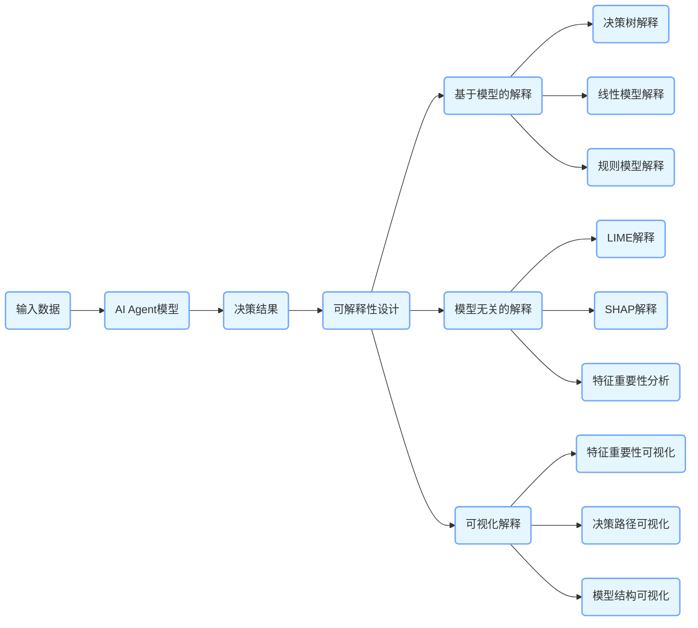

# 可解释性设计：理解AI Agent的决策过程

> 关键词：可解释性设计、AI Agent、决策过程、模型解释、机器学习

> 摘要：本文围绕可解释性设计在理解AI Agent决策过程中的应用展开。首先介绍了可解释性设计的背景，包括其目的、预期读者、文档结构和相关术语。接着阐述了核心概念及联系，通过文本示意图和Mermaid流程图进行说明。详细讲解了核心算法原理及具体操作步骤，并结合Python源代码进行阐述。深入探讨了数学模型和公式，辅以举例说明。通过项目实战展示了代码的实际应用和详细解读。分析了可解释性设计在不同场景中的实际应用。推荐了学习、开发工具和相关论文著作。最后总结了未来发展趋势与挑战，解答常见问题，并提供扩展阅读和参考资料，旨在帮助读者全面理解可解释性设计对理解AI Agent决策过程的重要性。

## 1. 背景介绍 
### 1.1 目的和范围
在当今人工智能飞速发展的时代，AI Agent已经广泛应用于各个领域，如医疗诊断、金融风险评估、自动驾驶等。然而，这些AI Agent的决策过程往往像一个“黑匣子”，缺乏可解释性。可解释性设计的目的就是打破这个“黑匣子”，让人们能够理解AI Agent是如何做出决策的。本文的范围涵盖了可解释性设计的基本概念、核心算法、数学模型、实际应用案例等方面，旨在为读者提供一个全面的可解释性设计的知识体系，帮助他们更好地理解AI Agent的决策过程。

### 1.2 预期读者
本文预期读者包括人工智能领域的研究人员、开发者、数据科学家，以及对可解释性AI感兴趣的相关行业从业者。对于研究人员来说，本文可以为他们的研究提供理论基础和新的思路；对于开发者和数据科学家，本文可以帮助他们在实际项目中应用可解释性设计方法；对于相关行业从业者，本文可以让他们更好地理解AI Agent的决策过程，从而更合理地应用AI技术。

### 1.3 文档结构概述
本文首先介绍可解释性设计的背景，包括目的、预期读者和文档结构等。接着阐述核心概念与联系，通过文本示意图和Mermaid流程图展示可解释性设计与AI Agent决策过程的关系。然后详细讲解核心算法原理及具体操作步骤，结合Python源代码进行说明。之后介绍数学模型和公式，并举例说明。通过项目实战展示代码的实际应用和详细解读。分析可解释性设计在不同场景中的实际应用。推荐学习、开发工具和相关论文著作。最后总结未来发展趋势与挑战，解答常见问题，并提供扩展阅读和参考资料。

### 1.4 术语表
#### 1.4.1 核心术语定义
- **可解释性设计**：一种设计理念和方法，旨在使AI系统的决策过程能够被人类理解和解释。
- **AI Agent**：具有自主决策能力的人工智能实体，能够感知环境并根据一定的规则做出决策。
- **决策过程**：AI Agent在面对特定任务和环境时，从输入信息到输出决策的一系列步骤和计算。
- **模型解释**：对AI模型的内部结构、参数和决策逻辑进行解释的过程。

#### 1.4.2 相关概念解释
- **局部解释**：针对单个输入样本或局部数据的解释，解释该样本或局部数据下模型的决策原因。
- **全局解释**：对整个模型的决策逻辑进行解释，说明模型在整体上是如何做出决策的。
- **特征重要性**：衡量每个输入特征对模型决策的影响程度。

#### 1.4.3 缩略词列表
- **AI**：Artificial Intelligence，人工智能
- **ML**：Machine Learning，机器学习
- **DL**：Deep Learning，深度学习

## 2. 核心概念与联系 

### 核心概念原理
可解释性设计的核心原理是通过各种方法将AI Agent的决策过程转化为人类能够理解的形式。这涉及到多个方面的知识和技术，包括机器学习、统计学、信息论等。从机器学习的角度来看，可解释性设计可以分为基于模型的解释和模型无关的解释。基于模型的解释是指利用模型本身的结构和参数进行解释，例如决策树模型可以直接通过树的结构和节点信息进行解释；模型无关的解释则不依赖于具体的模型，而是通过对模型的输入输出进行分析来解释决策过程，例如局部可解释模型无关解释（LIME）。

### 架构的文本示意图
```plaintext
可解释性设计
├── 基于模型的解释
│   ├── 决策树解释
│   ├── 线性模型解释
│   └── 规则模型解释
├── 模型无关的解释
│   ├── LIME解释
│   ├── SHAP解释
│   └── 特征重要性分析
└── 可视化解释
    ├── 特征重要性可视化
    ├── 决策路径可视化
    └── 模型结构可视化
```

### Mermaid流程图


## 3. 核心算法原理 & 具体操作步骤 

### 基于LIME的可解释性算法原理
局部可解释模型无关解释（LIME）的核心思想是在局部范围内用一个简单的可解释模型来近似复杂的AI模型。具体来说，对于一个给定的输入样本，LIME会在该样本的局部邻域内生成一些扰动样本，并使用复杂模型对这些扰动样本进行预测。然后，LIME会使用一个简单的线性模型来拟合这些扰动样本的输入和预测结果，通过线性模型的系数来解释复杂模型在该样本上的决策。

### Python源代码实现
```python
import numpy as np
import sklearn
from sklearn.datasets import load_iris
from sklearn.model_selection import train_test_split
from sklearn.ensemble import RandomForestClassifier
from lime.lime_tabular import LimeTabularExplainer

# 加载数据集
iris = load_iris()
X = iris.data
y = iris.target

# 划分训练集和测试集
X_train, X_test, y_train, y_test = train_test_split(X, y, test_size=0.2, random_state=42)

# 训练随机森林分类器
rf = RandomForestClassifier(n_estimators=100, random_state=42)
rf.fit(X_train, y_train)

# 创建LIME解释器
explainer = LimeTabularExplainer(X_train, feature_names=iris.feature_names, class_names=iris.target_names, discretize_continuous=True)

# 选择一个测试样本进行解释
test_instance = X_test[0]

# 生成解释
exp = explainer.explain_instance(test_instance, rf.predict_proba, num_features=4)

# 打印解释结果
print(exp.as_list())
```

### 具体操作步骤
1. **数据准备**：加载数据集并进行划分，将数据集分为训练集和测试集。
2. **模型训练**：选择一个合适的AI模型（如随机森林分类器），并使用训练集进行训练。
3. **创建解释器**：使用LIME库创建一个解释器，指定训练数据、特征名称和类别名称等信息。
4. **选择测试样本**：从测试集中选择一个样本进行解释。
5. **生成解释**：使用解释器对测试样本进行解释，生成解释结果。
6. **查看解释结果**：将解释结果以列表的形式打印出来，查看每个特征对模型决策的影响。

## 4. 数学模型和公式 & 详细讲解 & 举例说明 

### LIME的数学模型
LIME的目标是找到一个简单的可解释模型 $g \in G$，使得在局部邻域内 $g$ 能够尽可能地近似复杂模型 $f$。具体来说，LIME通过最小化以下损失函数来实现这一目标：

$$\xi(f, g, \pi_x) = \sum_{z, z' \in Z} \pi_x(z) (f(z) - g(z))^2 + \Omega(g)$$

其中，$f$ 是复杂模型，$g$ 是可解释模型，$\pi_x(z)$ 是样本 $z$ 相对于输入样本 $x$ 的局部相似度权重，$\Omega(g)$ 是可解释模型 $g$ 的复杂度惩罚项。

### 详细讲解
- **局部相似度权重 $\pi_x(z)$**：用于衡量样本 $z$ 与输入样本 $x$ 的相似度，通常使用核函数来计算。在LIME中，常用的核函数是高斯核函数：

$$\pi_x(z) = \exp\left(-\frac{||x - z||^2}{\sigma^2}\right)$$

其中，$||x - z||$ 是样本 $x$ 和 $z$ 之间的距离，$\sigma$ 是核带宽参数。

- **复杂度惩罚项 $\Omega(g)$**：用于控制可解释模型 $g$ 的复杂度，避免过拟合。在LIME中，对于线性模型，复杂度惩罚项通常是模型的非零系数的数量。

### 举例说明
假设我们有一个简单的二分类问题，输入特征为 $x_1$ 和 $x_2$，复杂模型 $f$ 是一个神经网络。我们选择一个输入样本 $x = [1, 2]$，并使用LIME在该样本的局部邻域内生成一些扰动样本。然后，我们使用一个线性模型 $g(z) = w_0 + w_1 z_1 + w_2 z_2$ 来拟合这些扰动样本的输入和预测结果。通过最小化损失函数 $\xi(f, g, \pi_x)$，我们可以得到线性模型的系数 $w_0, w_1, w_2$。这些系数就可以解释复杂模型 $f$ 在样本 $x$ 上的决策，例如，如果 $w_1$ 很大且为正，说明特征 $x_1$ 对模型预测为正类的贡献很大。

## 5. 项目实战：代码实际案例和详细解释说明 

### 5.1  开发环境搭建
- **安装Python**：建议使用Python 3.7及以上版本。
- **安装必要的库**：使用以下命令安装所需的库：
```sh
pip install numpy scikit-learn lime
```

### 5.2  源代码详细实现和代码解读
```python
import numpy as np
import sklearn
from sklearn.datasets import load_iris
from sklearn.model_selection import train_test_split
from sklearn.ensemble import RandomForestClassifier
from lime.lime_tabular import LimeTabularExplainer

# 加载数据集
iris = load_iris()
X = iris.data
y = iris.target

# 划分训练集和测试集
X_train, X_test, y_train, y_test = train_test_split(X, y, test_size=0.2, random_state=42)

# 训练随机森林分类器
rf = RandomForestClassifier(n_estimators=100, random_state=42)
rf.fit(X_train, y_train)

# 创建LIME解释器
explainer = LimeTabularExplainer(X_train, feature_names=iris.feature_names, class_names=iris.target_names, discretize_continuous=True)

# 选择一个测试样本进行解释
test_instance = X_test[0]

# 生成解释
exp = explainer.explain_instance(test_instance, rf.predict_proba, num_features=4)

# 打印解释结果
print(exp.as_list())
```

### 代码解读与分析
1. **数据加载和预处理**：使用 `sklearn.datasets.load_iris` 加载鸢尾花数据集，并将其分为特征矩阵 $X$ 和标签向量 $y$。然后使用 `train_test_split` 函数将数据集划分为训练集和测试集。
2. **模型训练**：使用 `RandomForestClassifier` 训练一个随机森林分类器，并使用训练集进行拟合。
3. **创建解释器**：使用 `LimeTabularExplainer` 创建一个LIME解释器，指定训练数据、特征名称和类别名称等信息。
4. **选择测试样本**：从测试集中选择一个样本进行解释。
5. **生成解释**：使用解释器的 `explain_instance` 方法对测试样本进行解释，指定复杂模型的预测概率函数和要解释的特征数量。
6. **查看解释结果**：使用 `exp.as_list()` 方法将解释结果以列表的形式打印出来，每个元素是一个特征及其对模型决策的影响。

## 6. 实际应用场景 
### 医疗诊断
在医疗诊断中，AI Agent可以根据患者的症状、检查结果等信息进行疾病诊断。然而，医生和患者需要了解AI Agent是如何做出诊断决策的，以便更好地信任和应用诊断结果。可解释性设计可以帮助医生理解AI Agent的决策过程，例如通过解释每个症状和检查指标对诊断结果的影响，从而提高诊断的准确性和可靠性。

### 金融风险评估
在金融领域，AI Agent可以用于评估客户的信用风险、投资风险等。金融机构需要了解AI Agent的决策依据，以便合理地分配资源和管理风险。可解释性设计可以帮助金融机构解释AI Agent的决策过程，例如通过解释每个特征（如收入、负债等）对风险评估结果的影响，从而做出更明智的决策。

### 自动驾驶
在自动驾驶中，AI Agent需要根据传感器数据做出驾驶决策，如加速、减速、转向等。为了确保自动驾驶的安全性和可靠性，需要让人类能够理解AI Agent的决策过程。可解释性设计可以帮助工程师和监管机构解释AI Agent的决策，例如通过解释每个传感器数据对驾驶决策的影响，从而提高自动驾驶系统的可信赖性。

## 7. 工具和资源推荐
### 7.1 学习资源推荐
#### 7.1.1 书籍推荐
- 《可解释的机器学习》：详细介绍了可解释性机器学习的基本概念、方法和应用，是学习可解释性设计的经典书籍。
- 《Python机器学习》：介绍了Python在机器学习中的应用，包括各种机器学习算法和模型的实现，对于理解可解释性设计的代码实现有很大帮助。

#### 7.1.2 在线课程
- Coursera上的“机器学习”课程：由斯坦福大学教授Andrew Ng主讲，是机器学习领域的经典课程，涵盖了机器学习的基本概念、算法和应用。
- edX上的“可解释的人工智能”课程：专门介绍可解释性人工智能的原理、方法和应用，对于深入学习可解释性设计有很大帮助。

#### 7.1.3 技术博客和网站
- Towards Data Science：一个专注于数据科学和机器学习的技术博客，上面有很多关于可解释性设计的文章和案例。
- Distill：一个致力于用可视化和交互式方式解释机器学习模型的网站，对于理解复杂的机器学习模型和可解释性设计有很大帮助。

### 7.2 开发工具框架推荐
#### 7.2.1 IDE和编辑器
- PyCharm：一个专业的Python集成开发环境，提供了丰富的代码编辑、调试和分析功能，适合开发可解释性设计相关的Python代码。
- Jupyter Notebook：一个交互式的开发环境，适合进行数据探索、模型训练和可视化，对于可解释性设计的实验和演示非常有用。

#### 7.2.2 调试和性能分析工具
- TensorBoard：一个用于可视化和分析TensorFlow模型的工具，可以帮助开发者调试和优化模型，对于可解释性设计中的模型训练和评估有很大帮助。
- Scikit-learn的模型评估工具：Scikit-learn提供了丰富的模型评估工具，如交叉验证、混淆矩阵等，可以帮助开发者评估可解释性设计模型的性能。

#### 7.2.3 相关框架和库
- LIME：一个用于局部可解释模型无关解释的Python库，提供了简单易用的接口，可以帮助开发者快速实现可解释性设计。
- SHAP：一个用于解释机器学习模型的Python库，提供了多种解释方法，如SHAP值、SHAP交互值等，可以帮助开发者深入理解模型的决策过程。

### 7.3 相关论文著作推荐
#### 7.3.1 经典论文
- “Why Should I Trust You?” Explaining the Predictions of Any Classifier：提出了LIME方法，是可解释性设计领域的经典论文。
- A Unified Approach to Interpreting Model Predictions：提出了SHAP方法，为可解释性设计提供了一种统一的框架。

#### 7.3.2 最新研究成果
- 关注顶级机器学习会议（如NeurIPS、ICML、CVPR等）和期刊（如Journal of Artificial Intelligence Research、Artificial Intelligence等）上的最新研究成果，了解可解释性设计的最新发展动态。

#### 7.3.3 应用案例分析
- 一些实际应用案例的论文和报告，如医疗诊断、金融风险评估、自动驾驶等领域的可解释性设计应用案例，可以帮助读者了解可解释性设计在实际场景中的应用方法和效果。

## 8. 总结：未来发展趋势与挑战
### 未来发展趋势
- **多模态可解释性**：随着人工智能技术的发展，多模态数据（如图像、文本、音频等）的应用越来越广泛。未来的可解释性设计将需要考虑多模态数据的特点，实现多模态可解释性。
- **实时可解释性**：在一些实时应用场景中，如自动驾驶、工业控制等，需要AI Agent能够实时做出决策并提供解释。未来的可解释性设计将需要提高解释的实时性。
- **可解释性与隐私保护的结合**：在一些敏感数据应用场景中，如医疗、金融等，需要在保护数据隐私的前提下实现可解释性设计。未来的可解释性设计将需要与隐私保护技术相结合。

### 挑战
- **复杂模型的解释**：随着AI模型的复杂度不断提高，如深度神经网络等，对这些复杂模型的解释变得越来越困难。如何有效地解释复杂模型的决策过程是可解释性设计面临的一个重要挑战。
- **解释的一致性和可靠性**：不同的解释方法可能会得到不同的解释结果，如何保证解释的一致性和可靠性是可解释性设计需要解决的问题。
- **用户理解和接受度**：即使提供了可解释性结果，用户是否能够理解和接受这些解释也是一个挑战。如何设计出易于用户理解和接受的解释方式是可解释性设计需要考虑的问题。

## 9. 附录：常见问题与解答
### 问题1：可解释性设计是否会降低AI模型的性能？
解答：可解释性设计并不一定会降低AI模型的性能。在某些情况下，可解释性设计可以帮助我们更好地理解模型，从而对模型进行优化和改进，提高模型的性能。例如，通过解释模型的特征重要性，我们可以选择更有价值的特征进行训练，从而提高模型的准确性。

### 问题2：可解释性设计适用于所有类型的AI模型吗？
解答：可解释性设计适用于大多数类型的AI模型，但不同的模型可能需要不同的解释方法。对于一些简单的模型，如决策树、线性模型等，解释相对容易；对于一些复杂的模型，如深度神经网络等，解释则相对困难，需要使用更高级的解释方法。

### 问题3：如何评估可解释性设计的效果？
解答：评估可解释性设计的效果可以从多个方面进行，如解释的准确性、一致性、可理解性等。可以通过人工评估、对比不同解释方法的结果等方式来评估可解释性设计的效果。

## 10. 扩展阅读 & 参考资料
### 扩展阅读
- 《深度学习》：深入介绍了深度学习的原理、算法和应用，对于理解复杂AI模型的决策过程有很大帮助。
- 《数据挖掘：概念与技术》：介绍了数据挖掘的基本概念、算法和应用，对于理解可解释性设计中的数据处理和特征工程有很大帮助。

### 参考资料
- Molnar, Christoph. Interpretable machine learning. Lulu. com, 2019.
- Ribeiro, Marco Tulio, Sameer Singh, and Carlos Guestrin. "Why should i trust you?: Explaining the predictions of any classifier." Proceedings of the 22nd ACM SIGKDD international conference on knowledge discovery and data mining. 2016.
- Lundberg, Scott M., and Su-In Lee. "A unified approach to interpreting model predictions." Advances in neural information processing systems. 2017.