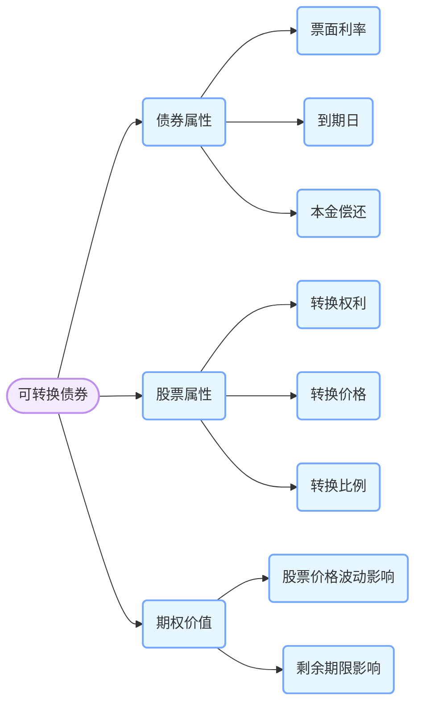

# 可转换债券策略：兼具股债特性的灵活工具

> 关键词：可转换债券、股债特性、投资策略、金融工具、风险管理

> 摘要：本文深入探讨了可转换债券这一兼具股债特性的灵活金融工具。首先介绍了可转换债券的背景知识，包括其目的、适用读者、文档结构及相关术语。接着阐述了可转换债券的核心概念与联系，通过文本示意图和 Mermaid 流程图清晰展示其原理和架构。详细讲解了核心算法原理，并给出 Python 源代码示例。同时，介绍了相关数学模型和公式，并举例说明。通过项目实战，展示了可转换债券策略在实际中的应用，包括开发环境搭建、源代码实现与解读。分析了可转换债券的实际应用场景，推荐了相关的学习资源、开发工具框架以及论文著作。最后总结了可转换债券的未来发展趋势与挑战，并对常见问题进行了解答，还提供了扩展阅读和参考资料，旨在为投资者和金融从业者全面了解可转换债券策略提供有价值的参考。

## 1. 背景介绍 
### 1.1 目的和范围
可转换债券作为一种独特的金融工具，在金融市场中扮演着重要角色。本文的目的在于全面深入地介绍可转换债券策略，包括其基本概念、投资策略、风险管理等方面的内容。范围涵盖了可转换债券的理论基础、实际应用案例以及相关的数学模型和算法。通过本文的阐述，读者将能够系统地了解可转换债券的特点和优势，掌握相关的投资技巧和风险管理方法，为在金融市场中运用可转换债券进行投资决策提供有力的支持。

### 1.2 预期读者
本文预期读者主要包括金融投资者、金融分析师、投资顾问、金融专业学生以及对金融市场和投资策略感兴趣的人士。对于投资者来说，本文可以帮助他们更好地理解可转换债券的特性和投资价值，制定更合理的投资策略；对于金融分析师和投资顾问，本文提供了深入分析可转换债券的理论和方法，有助于他们为客户提供更专业的投资建议；对于金融专业学生，本文可以作为学习金融衍生品和投资策略的参考资料，加深对相关知识的理解和掌握；对于对金融市场感兴趣的人士，本文可以让他们了解可转换债券这一独特的金融工具，拓宽金融知识视野。

### 1.3 文档结构概述
本文将按照以下结构进行组织：首先介绍可转换债券的背景知识，包括目的、预期读者、文档结构和术语表；接着阐述可转换债券的核心概念与联系，通过文本示意图和 Mermaid 流程图展示其原理和架构；然后详细讲解核心算法原理，并给出 Python 源代码示例；介绍相关数学模型和公式，并举例说明；通过项目实战展示可转换债券策略在实际中的应用，包括开发环境搭建、源代码实现与解读；分析可转换债券的实际应用场景；推荐相关的学习资源、开发工具框架以及论文著作；最后总结可转换债券的未来发展趋势与挑战，解答常见问题，并提供扩展阅读和参考资料。

### 1.4 术语表
#### 1.4.1 核心术语定义
- **可转换债券**：简称可转债，是一种混合型金融工具，它赋予债券持有人在一定期限内按约定的转换价格将债券转换为公司普通股股票的选择权。
- **转换价格**：是指可转换债券转换为每股普通股股票所支付的价格，是确定可转换债券转换比例的重要参数。
- **转换比例**：指每份可转换债券可转换为普通股股票的股数，计算公式为转换比例 = 可转换债券面值 / 转换价格。
- **纯债价值**：是指可转换债券在不考虑其转换期权的情况下，仅作为普通债券的价值，主要取决于债券的票面利率、期限、市场利率等因素。
- **转换价值**：是指可转换债券按当前市场股价转换为普通股股票后的价值，计算公式为转换价值 = 转换比例 × 当前股票市场价格。

#### 1.4.2 相关概念解释
- **期权价值**：可转换债券包含了一个看涨期权，即持有人有权在一定期限内按约定价格将债券转换为股票。期权价值是可转换债券价值高于纯债价值的部分，它反映了股票价格上涨可能给持有人带来的潜在收益。
- **赎回条款**：是指发行人在一定条件下有权按照约定价格赎回可转换债券的条款。赎回条款通常会对持有人的转换决策产生影响，促使持有人在合适的时机进行转换。
- **回售条款**：是指在一定条件下，债券持有人有权按照约定价格将可转换债券回售给发行人的条款。回售条款为持有人提供了一种保护机制，当股票价格下跌到一定程度时，持有人可以通过回售债券避免损失。

#### 1.4.3 缩略词列表
- **CB**：Convertible Bond，可转换债券
- **PV**：Present Value，现值
- **NPV**：Net Present Value，净现值

## 2. 核心概念与联系 
可转换债券的核心概念主要围绕其股债双重特性展开。从债券属性来看，可转换债券具有固定的票面利率和到期日，投资者在持有期间可以获得稳定的利息收入，到期时可以收回本金，这与普通债券相似。从股票属性来看，可转换债券赋予投资者在一定条件下将债券转换为公司普通股股票的权利，从而可以分享公司股票价格上涨带来的收益。

### 文本示意图
可转换债券的核心概念联系可以用以下文本示意图表示：

可转换债券
|-- 债券属性
|   |-- 票面利率
|   |-- 到期日
|   |-- 本金偿还
|-- 股票属性
|   |-- 转换权利
|   |-- 转换价格
|   |-- 转换比例
|-- 期权价值
|   |-- 股票价格波动影响
|   |-- 剩余期限影响

### Mermaid 流程图


从流程图中可以清晰地看到，可转换债券的价值由债券属性、股票属性和期权价值三部分共同决定。债券属性提供了稳定的收益和本金保障，股票属性赋予了投资者分享公司成长的机会，而期权价值则反映了股票价格波动和剩余期限对可转换债券价值的影响。

## 3. 核心算法原理 & 具体操作步骤 
### 核心算法原理
可转换债券的价值评估是其投资策略的核心。常用的方法是将可转换债券的价值分解为纯债价值和期权价值两部分，然后将它们相加得到可转换债券的总价值。

纯债价值的计算可以采用现金流贴现法，即将可转换债券未来的利息和本金按照市场利率进行贴现，得到其现值。具体公式为：

$$PV = \sum_{t=1}^{n} \frac{C}{(1 + r)^t} + \frac{F}{(1 + r)^n}$$

其中，$PV$ 表示纯债价值，$C$ 表示每年的利息支付，$r$ 表示市场利率，$t$ 表示付息期数，$n$ 表示债券的剩余期限，$F$ 表示债券的面值。

期权价值的计算可以采用二叉树模型或 Black-Scholes 模型等。这里以 Black-Scholes 模型为例，其公式为：

$$C = S \times N(d_1) - K \times e^{-rT} \times N(d_2)$$

其中，$C$ 表示期权价值，$S$ 表示股票当前价格，$K$ 表示转换价格，$r$ 表示无风险利率，$T$ 表示剩余期限，$N(d_1)$ 和 $N(d_2)$ 分别是标准正态分布的累积分布函数，$d_1$ 和 $d_2$ 的计算公式为：

$$d_1 = \frac{\ln(\frac{S}{K}) + (r + \frac{\sigma^2}{2})T}{\sigma \sqrt{T}}$$

$$d_2 = d_1 - \sigma \sqrt{T}$$

其中，$\sigma$ 表示股票价格的波动率。

### Python 源代码实现
```python
import numpy as np
from scipy.stats import norm

def pure_bond_value(coupon, face_value, market_rate, years_to_maturity):
    """
    计算纯债价值
    :param coupon: 每年利息支付
    :param face_value: 债券面值
    :param market_rate: 市场利率
    :param years_to_maturity: 剩余期限
    :return: 纯债价值
    """
    pv = 0
    for t in range(1, years_to_maturity + 1):
        pv += coupon / (1 + market_rate) ** t
    pv += face_value / (1 + market_rate) ** years_to_maturity
    return pv

def black_scholes_call_value(stock_price, strike_price, risk_free_rate, volatility, time_to_maturity):
    """
    计算期权价值（Black-Scholes 模型）
    :param stock_price: 股票当前价格
    :param strike_price: 转换价格
    :param risk_free_rate: 无风险利率
    :param volatility: 股票价格波动率
    :param time_to_maturity: 剩余期限
    :return: 期权价值
    """
    d1 = (np.log(stock_price / strike_price) + (risk_free_rate + 0.5 * volatility ** 2) * time_to_maturity) / (
            volatility * np.sqrt(time_to_maturity))
    d2 = d1 - volatility * np.sqrt(time_to_maturity)
    call_value = stock_price * norm.cdf(d1) - strike_price * np.exp(-risk_free_rate * time_to_maturity) * norm.cdf(d2)
    return call_value

def convertible_bond_value(coupon, face_value, market_rate, years_to_maturity, stock_price, strike_price, risk_free_rate,
                           volatility):
    """
    计算可转换债券价值
    :param coupon: 每年利息支付
    :param face_value: 债券面值
    :param market_rate: 市场利率
    :param years_to_maturity: 剩余期限
    :param stock_price: 股票当前价格
    :param strike_price: 转换价格
    :param risk_free_rate: 无风险利率
    :param volatility: 股票价格波动率
    :return: 可转换债券价值
    """
    pure_bond = pure_bond_value(coupon, face_value, market_rate, years_to_maturity)
    option_value = black_scholes_call_value(stock_price, strike_price, risk_free_rate, volatility, years_to_maturity)
    return pure_bond + option_value

# 示例参数
coupon = 50  # 每年利息支付
face_value = 1000  # 债券面值
market_rate = 0.05  # 市场利率
years_to_maturity = 5  # 剩余期限
stock_price = 100  # 股票当前价格
strike_price = 120  # 转换价格
risk_free_rate = 0.03  # 无风险利率
volatility = 0.2  # 股票价格波动率

# 计算可转换债券价值
cb_value = convertible_bond_value(coupon, face_value, market_rate, years_to_maturity, stock_price, strike_price,
                                  risk_free_rate, volatility)
print(f"可转换债券价值: {cb_value}")
```

### 具体操作步骤
1. **数据收集**：收集可转换债券的基本信息，包括票面利率、面值、剩余期限、转换价格等，以及相关的市场数据，如市场利率、股票价格、无风险利率、股票价格波动率等。
2. **纯债价值计算**：根据收集到的数据，使用现金流贴现法计算可转换债券的纯债价值。
3. **期权价值计算**：选择合适的期权定价模型（如 Black-Scholes 模型），根据收集到的数据计算可转换债券的期权价值。
4. **可转换债券价值计算**：将纯债价值和期权价值相加，得到可转换债券的总价值。
5. **投资决策**：根据可转换债券的价值评估结果，结合投资者的风险偏好和投资目标，制定合理的投资策略。

## 4. 数学模型和公式 & 详细讲解 & 举例说明 
### 纯债价值模型
纯债价值的计算基于现金流贴现原理，其公式为：

$$PV = \sum_{t=1}^{n} \frac{C}{(1 + r)^t} + \frac{F}{(1 + r)^n}$$

其中，$PV$ 表示纯债价值，$C$ 表示每年的利息支付，$r$ 表示市场利率，$t$ 表示付息期数，$n$ 表示债券的剩余期限，$F$ 表示债券的面值。

详细讲解：该公式的原理是将可转换债券未来的利息和本金按照市场利率进行贴现，得到其现值。每年的利息支付 $C$ 是固定的，市场利率 $r$ 反映了当前市场的资金成本，剩余期限 $n$ 决定了现金流的时间分布。通过将未来的现金流贴现到当前时刻，可以得到可转换债券作为普通债券的价值。

举例说明：假设可转换债券的面值为 1000 元，票面利率为 5%，每年付息一次，剩余期限为 5 年，市场利率为 6%。则每年的利息支付 $C = 1000 \times 5\% = 50$ 元。根据公式计算纯债价值：

$$PV = \sum_{t=1}^{5} \frac{50}{(1 + 0.06)^t} + \frac{1000}{(1 + 0.06)^5}$$

$$PV = 50 \times \frac{1 - (1 + 0.06)^{-5}}{0.06} + \frac{1000}{(1 + 0.06)^5} \approx 957.88$$（元）

### 期权价值模型（Black-Scholes 模型）
Black-Scholes 模型的公式为：

$$C = S \times N(d_1) - K \times e^{-rT} \times N(d_2)$$

其中，$C$ 表示期权价值，$S$ 表示股票当前价格，$K$ 表示转换价格，$r$ 表示无风险利率，$T$ 表示剩余期限，$N(d_1)$ 和 $N(d_2)$ 分别是标准正态分布的累积分布函数，$d_1$ 和 $d_2$ 的计算公式为：

$$d_1 = \frac{\ln(\frac{S}{K}) + (r + \frac{\sigma^2}{2})T}{\sigma \sqrt{T}}$$

$$d_2 = d_1 - \sigma \sqrt{T}$$

其中，$\sigma$ 表示股票价格的波动率。

详细讲解：Black-Scholes 模型是一种基于无套利原理的期权定价模型，它假设股票价格遵循几何布朗运动。$S$ 是股票当前价格，$K$ 是转换价格，$r$ 是无风险利率，$T$ 是剩余期限，$\sigma$ 是股票价格的波动率。$N(d_1)$ 和 $N(d_2)$ 是标准正态分布的累积分布函数，用于计算期权在不同状态下的概率。通过这些参数的组合，可以计算出可转换债券中包含的期权价值。

举例说明：假设股票当前价格 $S = 100$ 元，转换价格 $K = 120$ 元，无风险利率 $r = 0.03$，剩余期限 $T = 5$ 年，股票价格波动率 $\sigma = 0.2$。首先计算 $d_1$ 和 $d_2$：

$$d_1 = \frac{\ln(\frac{100}{120}) + (0.03 + \frac{0.2^2}{2}) \times 5}{0.2 \times \sqrt{5}} \approx -0.23$$

$$d_2 = d_1 - 0.2 \times \sqrt{5} \approx -0.68$$

然后计算 $N(d_1)$ 和 $N(d_2)$：

$N(d_1) = norm.cdf(-0.23) \approx 0.409$

$N(d_2) = norm.cdf(-0.68) \approx 0.248$

最后计算期权价值：

$$C = 100 \times 0.409 - 120 \times e^{-0.03 \times 5} \times 0.248 \approx 17.57$$（元）

### 可转换债券价值模型
可转换债券价值等于纯债价值和期权价值之和，即：

$$V_{CB} = PV + C$$

其中，$V_{CB}$ 表示可转换债券价值，$PV$ 表示纯债价值，$C$ 表示期权价值。

详细讲解：可转换债券的价值由其债券属性和股票属性共同决定。纯债价值反映了可转换债券作为普通债券的价值，期权价值反映了可转换债券中包含的转换权利的价值。将两者相加，可以得到可转换债券的总价值。

举例说明：根据前面计算的纯债价值 $PV = 957.88$ 元，期权价值 $C = 17.57$ 元，可得可转换债券价值：

$$V_{CB} = 957.88 + 17.57 = 975.45$$（元）

## 5. 项目实战：代码实际案例和详细解释说明 
### 5.1  开发环境搭建
#### 安装 Python
首先需要安装 Python 开发环境，建议使用 Python 3.7 及以上版本。可以从 Python 官方网站（https://www.python.org/downloads/） 下载适合自己操作系统的安装包，按照安装向导进行安装。

#### 安装必要的库
本项目需要使用 `numpy` 和 `scipy` 库，可使用以下命令进行安装：
```sh
pip install numpy scipy
```

### 5.2  源代码详细实现和代码解读
以下是完整的可转换债券价值计算的 Python 代码：
```python
import numpy as np
from scipy.stats import norm

def pure_bond_value(coupon, face_value, market_rate, years_to_maturity):
    """
    计算纯债价值
    :param coupon: 每年利息支付
    :param face_value: 债券面值
    :param market_rate: 市场利率
    :param years_to_maturity: 剩余期限
    :return: 纯债价值
    """
    pv = 0
    for t in range(1, years_to_maturity + 1):
        pv += coupon / (1 + market_rate) ** t
    pv += face_value / (1 + market_rate) ** years_to_maturity
    return pv

def black_scholes_call_value(stock_price, strike_price, risk_free_rate, volatility, time_to_maturity):
    """
    计算期权价值（Black-Scholes 模型）
    :param stock_price: 股票当前价格
    :param strike_price: 转换价格
    :param risk_free_rate: 无风险利率
    :param volatility: 股票价格波动率
    :param time_to_maturity: 剩余期限
    :return: 期权价值
    """
    d1 = (np.log(stock_price / strike_price) + (risk_free_rate + 0.5 * volatility ** 2) * time_to_maturity) / (
            volatility * np.sqrt(time_to_maturity))
    d2 = d1 - volatility * np.sqrt(time_to_maturity)
    call_value = stock_price * norm.cdf(d1) - strike_price * np.exp(-risk_free_rate * time_to_maturity) * norm.cdf(d2)
    return call_value

def convertible_bond_value(coupon, face_value, market_rate, years_to_maturity, stock_price, strike_price, risk_free_rate,
                           volatility):
    """
    计算可转换债券价值
    :param coupon: 每年利息支付
    :param face_value: 债券面值
    :param market_rate: 市场利率
    :param years_to_maturity: 剩余期限
    :param stock_price: 股票当前价格
    :param strike_price: 转换价格
    :param risk_free_rate: 无风险利率
    :param volatility: 股票价格波动率
    :return: 可转换债券价值
    """
    pure_bond = pure_bond_value(coupon, face_value, market_rate, years_to_maturity)
    option_value = black_scholes_call_value(stock_price, strike_price, risk_free_rate, volatility, years_to_maturity)
    return pure_bond + option_value

# 示例参数
coupon = 50  # 每年利息支付
face_value = 1000  # 债券面值
market_rate = 0.05  # 市场利率
years_to_maturity = 5  # 剩余期限
stock_price = 100  # 股票当前价格
strike_price = 120  # 转换价格
risk_free_rate = 0.03  # 无风险利率
volatility = 0.2  # 股票价格波动率

# 计算可转换债券价值
cb_value = convertible_bond_value(coupon, face_value, market_rate, years_to_maturity, stock_price, strike_price,
                                  risk_free_rate, volatility)
print(f"可转换债券价值: {cb_value}")
```

### 5.3  代码解读与分析
#### `pure_bond_value` 函数
该函数用于计算可转换债券的纯债价值。通过循环计算每年利息的现值，并将最后一年的本金现值相加，得到纯债价值。具体步骤如下：
1. 初始化纯债价值 `pv` 为 0。
2. 使用 `for` 循环遍历每年的付息期，将每年的利息支付按照市场利率进行贴现，并累加到 `pv` 中。
3. 将最后一年的本金按照市场利率进行贴现，并累加到 `pv` 中。
4. 返回纯债价值 `pv`。

#### `black_scholes_call_value` 函数
该函数用于计算可转换债券中包含的期权价值，使用 Black-Scholes 模型。具体步骤如下：
1. 计算 $d_1$ 和 $d_2$ 的值，根据 Black-Scholes 模型的公式进行计算。
2. 使用 `norm.cdf` 函数计算标准正态分布的累积分布函数 $N(d_1)$ 和 $N(d_2)$ 的值。
3. 根据 Black-Scholes 模型的公式计算期权价值 `call_value`。
4. 返回期权价值 `call_value`。

#### `convertible_bond_value` 函数
该函数用于计算可转换债券的总价值。具体步骤如下：
1. 调用 `pure_bond_value` 函数计算纯债价值。
2. 调用 `black_scholes_call_value` 函数计算期权价值。
3. 将纯债价值和期权价值相加，得到可转换债券的总价值。
4. 返回可转换债券的总价值。

#### 主程序
在主程序中，定义了可转换债券的相关参数，包括每年利息支付、债券面值、市场利率、剩余期限、股票当前价格、转换价格、无风险利率和股票价格波动率。然后调用 `convertible_bond_value` 函数计算可转换债券的价值，并将结果打印输出。

## 6. 实际应用场景 
### 投资组合管理
可转换债券可以作为一种重要的投资工具，用于优化投资组合的风险收益特征。由于可转换债券兼具股债特性，当股票市场表现良好时，可转换债券可以通过转换为股票分享股票价格上涨带来的收益；当股票市场表现不佳时，可转换债券可以作为普通债券获得稳定的利息收入和本金保障。因此，在投资组合中适当配置可转换债券，可以降低组合的整体风险，提高组合的收益稳定性。

### 风险管理
对于企业来说，可转换债券可以作为一种风险管理工具。企业发行可转换债券可以在一定程度上降低融资成本，同时通过设置赎回条款和回售条款等，可以对债券的转换和赎回进行有效的管理，降低企业的财务风险。对于投资者来说，可转换债券的期权价值可以在一定程度上对冲股票价格下跌的风险，起到风险管理的作用。

### 并购重组
在并购重组中，可转换债券可以作为一种支付工具。收购方可以发行可转换债券来支付收购对价，被收购方可以选择持有债券获得固定收益，也可以在合适的时机将债券转换为收购方的股票，分享收购方未来的发展成果。这种方式可以在一定程度上降低收购方的现金压力，同时为被收购方提供更多的选择。

### 私募股权投资
在私募股权投资中，可转换债券可以作为一种投资工具。投资者可以先以债券的形式投资于企业，获得稳定的利息收入，同时在企业发展到一定阶段后，根据企业的业绩和市场情况，选择将债券转换为企业的股权，分享企业成长带来的收益。这种方式可以在一定程度上降低投资风险，提高投资回报。

## 7. 工具和资源推荐
### 7.1 学习资源推荐
#### 7.1.1 书籍推荐
- 《期权、期货及其他衍生品》（Options, Futures, and Other Derivatives）：作者 John C. Hull，这本书是金融衍生品领域的经典教材，详细介绍了期权、期货、可转换债券等各种金融衍生品的定价和风险管理方法。
- 《可转换债券市场：结构、估值与投资策略》（The Convertible Bond Market: Structure, Valuation, and Investment Strategies）：作者 Frank J. Fabozzi，这本书专门针对可转换债券市场进行了深入的研究，包括可转换债券的结构、估值方法、投资策略等方面的内容。
- 《投资学》（Investments）：作者 Zvi Bodie、Alex Kane 和 Alan J. Marcus，这本书是投资学领域的权威教材，涵盖了投资组合管理、金融衍生品、风险管理等多个方面的内容，对可转换债券的介绍也非常全面。

#### 7.1.2 在线课程
- Coursera 平台上的“Financial Markets”课程：由耶鲁大学教授 Robert Shiller 授课，该课程介绍了金融市场的基本原理和各种金融工具，包括可转换债券。
- edX 平台上的“Derivatives Markets”课程：由哥伦比亚大学教授 Donald Goldfarb 授课，该课程深入讲解了金融衍生品的定价和风险管理，对可转换债券的期权定价模型有详细的介绍。

#### 7.1.3 技术博客和网站
- 雪球网（https://xueqiu.com/）：是一个财经社交平台，有很多关于可转换债券的讨论和分析文章，投资者可以在这里了解市场动态和其他投资者的观点。
- 集思录（https://www.jisilu.cn/）：是一个专注于低风险投资的网站，提供可转换债券的实时数据、分析工具和投资策略，对可转换债券投资者非常有帮助。

### 7.2 开发工具框架推荐
#### 7.2.1 IDE和编辑器
- PyCharm：是一款专业的 Python 集成开发环境，提供了丰富的代码编辑、调试和分析功能，适合开发可转换债券相关的 Python 程序。
- Jupyter Notebook：是一个交互式的开发环境，适合进行数据分析和模型验证，在可转换债券的价值评估和策略研究中非常有用。

#### 7.2.2 调试和性能分析工具
- PySnooper：是一个简单易用的 Python 调试工具，可以自动记录函数的调用过程和变量的值，帮助开发者快速定位问题。
- cProfile：是 Python 自带的性能分析工具，可以分析程序的运行时间和函数调用次数，帮助开发者优化代码性能。

#### 7.2.3 相关框架和库
- `numpy`：是 Python 中用于科学计算的基础库，提供了高效的数组操作和数学函数，在可转换债券的价值计算中经常使用。
- `scipy`：是 Python 中用于科学计算和数据分析的库，提供了丰富的数学模型和算法，如 Black-Scholes 模型的实现。

### 7.3 相关论文著作推荐
#### 7.3.1 经典论文
- “The Pricing of Options and Corporate Liabilities”（期权和公司债务的定价）：作者 Fischer Black 和 Myron Scholes，这篇论文提出了著名的 Black-Scholes 期权定价模型，为可转换债券的期权价值计算提供了理论基础。
- “On the Pricing of Corporate Debt: The Risk Structure of Interest Rates”（关于公司债务定价：利率的风险结构）：作者 Robert C. Merton，这篇论文提出了 Merton 模型，用于分析公司债务的信用风险，对可转换债券的信用风险评估有重要的参考价值。

#### 7.3.2 最新研究成果
- 可以通过 Google Scholar、IEEE Xplore、ACM Digital Library 等学术数据库搜索关于可转换债券的最新研究论文，了解该领域的最新发展动态和研究成果。

#### 7.3.3 应用案例分析
- 可以参考一些金融机构的研究报告和案例分析，了解可转换债券在实际投资和风险管理中的应用案例，学习其他投资者和机构的成功经验。

## 8. 总结：未来发展趋势与挑战
### 未来发展趋势
#### 市场规模扩大
随着金融市场的不断发展和投资者对多元化投资工具的需求增加，可转换债券市场有望继续扩大。越来越多的企业将选择发行可转换债券来融资，投资者也将更加关注可转换债券的投资机会。

#### 产品创新
为了满足不同投资者的需求，可转换债券的产品创新将不断涌现。例如，可能会出现更多具有特殊条款和结构的可转换债券，如可交换债券、附认股权证可转换债券等。

#### 数字化和智能化
随着金融科技的发展，可转换债券的交易和投资将更加数字化和智能化。投资者可以通过在线平台更加便捷地进行可转换债券的交易和管理，同时，人工智能和大数据技术也将在可转换债券的价值评估和投资策略制定中发挥重要作用。

### 挑战
#### 市场波动风险
可转换债券的价值受到股票市场和债券市场波动的影响较大。当股票市场或债券市场出现大幅波动时，可转换债券的价格也会随之波动，投资者面临着较大的市场风险。

#### 信用风险
可转换债券的发行主体可能存在信用风险，如企业经营不善、财务状况恶化等，可能导致债券违约，投资者面临本金和利息损失的风险。

#### 定价复杂性
可转换债券的定价涉及到多个因素，如股票价格、市场利率、波动率等，其定价模型也较为复杂。准确评估可转换债券的价值需要具备较高的专业知识和技能，这对投资者和金融机构提出了较高的要求。

## 9. 附录：常见问题与解答
### 可转换债券的转换条件是什么？
可转换债券的转换条件通常在债券发行文件中明确规定，一般包括转换价格、转换期限、转换比例等。转换价格是指可转换债券转换为每股普通股股票所支付的价格，转换期限是指债券持有人可以行使转换权利的时间段，转换比例是指每份可转换债券可转换为普通股股票的股数。

### 可转换债券的赎回条款和回售条款有什么作用？
赎回条款是指发行人在一定条件下有权按照约定价格赎回可转换债券的条款。赎回条款的作用主要是促使债券持有人在合适的时机进行转换，避免发行人承担过高的利息成本。回售条款是指在一定条件下，债券持有人有权按照约定价格将可转换债券回售给发行人的条款。回售条款的作用主要是为债券持有人提供一种保护机制，当股票价格下跌到一定程度时，持有人可以通过回售债券避免损失。

### 如何评估可转换债券的投资价值？
评估可转换债券的投资价值可以从多个方面进行，包括纯债价值、转换价值、期权价值等。纯债价值可以通过现金流贴现法计算，转换价值可以根据当前股票市场价格和转换比例计算，期权价值可以使用二叉树模型或 Black-Scholes 模型等进行计算。同时，还需要考虑债券的信用风险、市场波动风险等因素。

### 可转换债券与普通债券和股票有什么区别？
可转换债券兼具普通债券和股票的特性。与普通债券相比，可转换债券具有转换为股票的权利，当股票市场表现良好时，可转换债券可以通过转换为股票分享股票价格上涨带来的收益；与股票相比，可转换债券具有固定的票面利率和到期日，投资者在持有期间可以获得稳定的利息收入，到期时可以收回本金，具有一定的安全性。

## 10. 扩展阅读 & 参考资料
### 扩展阅读
- 《金融工程学》：深入介绍金融工程的基本原理和方法，包括金融衍生品的设计和定价，对理解可转换债券的本质和定价机制有很大帮助。
- 《行为金融学》：探讨投资者的行为和心理对金融市场的影响，有助于理解可转换债券市场中的投资者行为和市场波动。

### 参考资料
- John C. Hull. Options, Futures, and Other Derivatives. Pearson Education, 2018.
- Frank J. Fabozzi. The Convertible Bond Market: Structure, Valuation, and Investment Strategies. John Wiley & Sons, 2012.
- Zvi Bodie, Alex Kane, Alan J. Marcus. Investments. McGraw-Hill Education, 2018.
- Fischer Black, Myron Scholes. The Pricing of Options and Corporate Liabilities. Journal of Political Economy, 1973.
- Robert C. Merton. On the Pricing of Corporate Debt: The Risk Structure of Interest Rates. Journal of Finance, 1974.