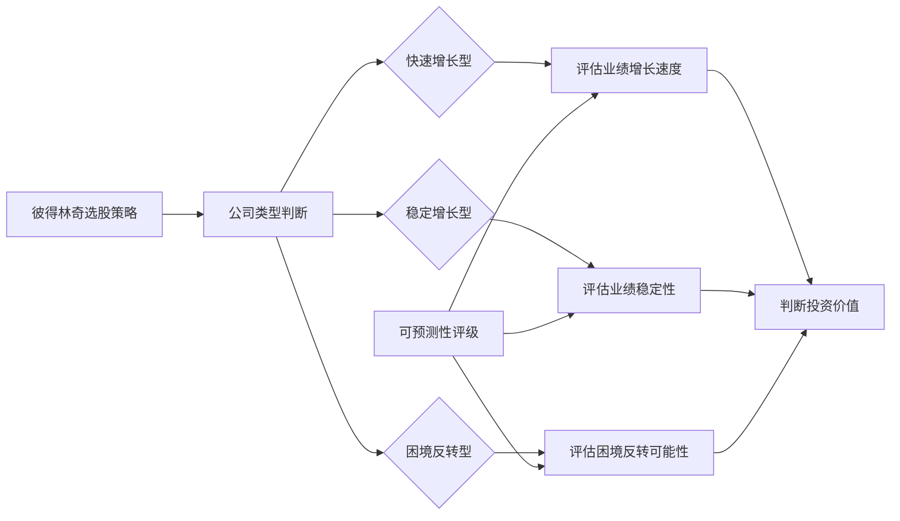

# 可预测性评级在彼得林奇选股中的作用

> 关键词：可预测性评级、彼得林奇、选股、股票投资、财务分析、投资策略

> 摘要：本文深入探讨了可预测性评级在彼得林奇选股方法中的关键作用。首先介绍了彼得林奇选股策略的背景和基本理念，接着详细阐述了可预测性评级的核心概念及其与彼得林奇选股的内在联系。通过对核心算法原理的分析和数学模型的讲解，揭示了可预测性评级在选股过程中的决策依据。结合项目实战案例，展示了如何在实际中运用可预测性评级进行股票筛选和分析。同时，探讨了可预测性评级在不同实际应用场景中的价值，推荐了相关的学习资源、开发工具和研究论文。最后，总结了可预测性评级在未来股票投资领域的发展趋势与面临的挑战，并对常见问题进行了解答，为投资者和相关研究人员提供了全面而深入的参考。

## 1. 背景介绍 
### 1.1 目的和范围
本文章的主要目的是全面剖析可预测性评级在彼得林奇选股方法中的作用。旨在帮助投资者深入理解可预测性评级这一概念，并掌握如何将其有效地应用于股票投资决策中。研究范围涵盖了可预测性评级的基本原理、与彼得林奇选股策略的关联、实际应用场景以及相关的技术和理论支持。通过对这些方面的研究，为投资者提供一个系统的、科学的选股参考框架。

### 1.2 预期读者
本文预期读者包括股票投资者，无论是专业的投资机构人员还是个人投资者，都能从本文中获取关于选股方法的深入知识和实用技巧。同时，金融专业的学生和研究人员也可以将本文作为研究股票投资理论和实践的参考资料。对于对投资领域感兴趣的一般读者，本文也能帮助他们初步了解股票投资和可预测性评级的相关知识。

### 1.3 文档结构概述
本文首先介绍了研究的背景和相关概念，包括彼得林奇选股策略的基本情况和可预测性评级的定义。接着详细阐述了可预测性评级的核心概念与彼得林奇选股的联系，并给出了相应的原理和架构示意图。然后通过Python源代码详细讲解了核心算法原理和具体操作步骤，同时运用数学模型和公式进行深入分析。在项目实战部分，展示了如何搭建开发环境、实现源代码并进行代码解读。之后探讨了可预测性评级的实际应用场景，推荐了相关的工具和资源。最后总结了未来发展趋势与挑战，解答了常见问题，并提供了扩展阅读和参考资料。

### 1.4 术语表
#### 1.4.1 核心术语定义
- **可预测性评级**：是一种对公司未来业绩和发展趋势进行评估和量化的指标体系，通过对公司的财务数据、行业环境、竞争态势等多方面因素的分析，预测公司未来盈利的可能性和稳定性。
- **彼得林奇选股策略**：是由著名投资大师彼得林奇提出的一套选股方法，强调从日常生活和实地调研中发现具有投资价值的股票，注重公司的基本面分析，包括公司的盈利增长、资产负债状况、行业前景等因素。
- **股票投资**：指投资者购买股票以获取股息、红利和资本增值的投资行为。

#### 1.4.2 相关概念解释
- **基本面分析**：是一种通过分析公司的财务报表、行业地位、管理团队等基本情况来评估股票投资价值的方法。它关注的是公司的内在价值和长期发展潜力。
- **财务数据**：包括公司的资产负债表、利润表、现金流量表等数据，反映了公司的财务状况和经营成果。
- **行业前景**：指某个行业在未来一段时间内的发展趋势和市场潜力，对公司的发展具有重要影响。

#### 1.4.3 缩略词列表
- **EPS**：Earnings Per Share，每股收益，是指普通股股东每持有一股所能享有的企业净利润或需承担的企业净亏损。
- **PE**：Price Earnings Ratio，市盈率，是指股票价格除以每股收益的比率，反映了市场对公司盈利的预期。

## 2. 核心概念与联系 
### 2.1 彼得林奇选股策略概述
彼得林奇是华尔街极具传奇色彩的投资大师，他的选股策略具有独特的魅力。林奇主张投资者要关注日常生活，从身边的消费体验和观察中发现潜在的投资机会。例如，如果发现身边的人都热衷于购买某家公司的产品，那么这家公司很可能具有良好的发展前景。

他非常注重公司的基本面分析，将公司分为六种类型：缓慢增长型、稳定增长型、快速增长型、周期型、困境反转型和资产富余型。不同类型的公司具有不同的特点和投资价值。对于快速增长型公司，林奇认为只要其增长率能够持续保持较高水平，就值得投资；而对于困境反转型公司，他则关注公司是否有能力摆脱困境，实现业绩的反转。

### 2.2 可预测性评级的核心概念
可预测性评级是一种综合评估公司未来业绩可预测程度的方法。它基于公司的历史财务数据、行业竞争格局、宏观经济环境等多方面因素进行分析。

公司的历史财务数据是可预测性评级的重要依据。例如，稳定增长的营业收入和净利润往往表明公司具有较强的盈利能力和稳定性，其未来业绩的可预测性相对较高。行业竞争格局也会影响可预测性评级。在竞争激烈的行业中，公司的市场份额和盈利能力可能会受到较大的波动，导致其未来业绩的可预测性降低；而在垄断或寡头垄断的行业中，公司的业绩相对较为稳定，可预测性较高。

### 2.3 可预测性评级与彼得林奇选股的联系
可预测性评级与彼得林奇选股策略有着密切的联系。彼得林奇在选股时，非常注重公司未来业绩的可预测性。可预测性评级可以帮助投资者更好地理解公司的基本面，筛选出具有较高投资价值的股票。

对于彼得林奇所划分的不同类型的公司，可预测性评级的侧重点也有所不同。对于稳定增长型公司，可预测性评级主要关注其业绩增长的稳定性和持续性；对于困境反转型公司，可预测性评级则侧重于评估公司摆脱困境的可能性和未来业绩的恢复程度。

### 2.4 核心概念原理和架构的文本示意图
彼得林奇选股策略以公司基本面分析为核心，可预测性评级作为辅助工具，对公司的未来业绩进行评估。具体架构如下：

| 彼得林奇选股策略 | 可预测性评级 |
| --- | --- |
| 公司类型划分 | 基于多因素分析 |
| 基本面分析 | 历史财务数据 |
|  | 行业竞争格局 |
|  | 宏观经济环境 |

### 2.5 Mermaid 流程图


## 3. 核心算法原理 & 具体操作步骤 
### 3.1 核心算法原理
可预测性评级的核心算法主要基于多因素分析和统计模型。通过对公司的财务数据、行业数据等进行量化分析，计算出公司的可预测性得分。

以下是一个简化的可预测性评级算法的Python实现示例：

```python
import pandas as pd
import numpy as np

# 定义财务数据类
class FinancialData:
    def __init__(self, revenue, profit, assets, liabilities):
        self.revenue = revenue
        self.profit = profit
        self.assets = assets
        self.liabilities = liabilities

# 定义可预测性评级类
class PredictabilityRating:
    def __init__(self, financial_data, industry_data):
        self.financial_data = financial_data
        self.industry_data = industry_data

    def calculate_score(self):
        # 计算财务指标得分
        revenue_growth = np.mean(np.diff(self.financial_data.revenue) / self.financial_data.revenue[:-1])
        profit_growth = np.mean(np.diff(self.financial_data.profit) / self.financial_data.profit[:-1])
        debt_ratio = self.financial_data.liabilities / self.financial_data.assets

        # 计算行业指标得分
        industry_growth = np.mean(self.industry_data['growth_rate'])
        industry_competition = self.industry_data['competition_index'].iloc[-1]

        # 综合得分计算
        score = (revenue_growth * 0.3 + profit_growth * 0.3 + (1 - debt_ratio) * 0.2 + 
                 (1 - industry_competition) * 0.1 + industry_growth * 0.1) * 100

        return score

# 示例数据
revenue = np.array([100, 120, 130, 150])
profit = np.array([20, 25, 30, 35])
assets = 500
liabilities = 200
industry_data = pd.DataFrame({
    'growth_rate': [0.05, 0.06, 0.07, 0.08],
    'competition_index': [0.3, 0.25, 0.2, 0.15]
})

# 创建财务数据对象
financial_data = FinancialData(revenue, profit, assets, liabilities)

# 创建可预测性评级对象
predictability_rating = PredictabilityRating(financial_data, industry_data)

# 计算可预测性得分
score = predictability_rating.calculate_score()
print(f"可预测性得分: {score}")
```

### 3.2 具体操作步骤
1. **数据收集**：收集公司的财务数据，包括营业收入、净利润、资产、负债等；同时收集行业数据，如行业增长率、竞争指数等。
2. **数据预处理**：对收集到的数据进行清洗和整理，去除异常值和缺失值。
3. **指标计算**：根据上述算法，计算公司的财务指标和行业指标得分。
4. **综合得分计算**：将财务指标得分和行业指标得分进行加权平均，得到公司的可预测性得分。
5. **评级判断**：根据可预测性得分，对公司进行评级。例如，得分在80分以上为高可预测性，60 - 80分为中等可预测性，60分以下为低可预测性。

## 4. 数学模型和公式 & 详细讲解 & 举例说明 
### 4.1 数学模型和公式
可预测性评级的数学模型可以表示为：

$$S = w_1R_g + w_2P_g + w_3(1 - D_r) + w_4(1 - C_i) + w_5I_g$$

其中：
- $S$ 表示可预测性得分；
- $R_g$ 表示营业收入增长率；
- $P_g$ 表示净利润增长率；
- $D_r$ 表示资产负债率；
- $C_i$ 表示行业竞争指数；
- $I_g$ 表示行业增长率；
- $w_1, w_2, w_3, w_4, w_5$ 分别为各指标的权重，且 $w_1 + w_2 + w_3 + w_4 + w_5 = 1$。

### 4.2 详细讲解
- **营业收入增长率 $R_g$**：反映了公司业务的扩张速度。营业收入持续增长的公司，其未来业绩的可预测性相对较高。
- **净利润增长率 $P_g$**：体现了公司盈利能力的变化趋势。净利润稳定增长的公司，说明其经营状况良好，未来业绩更具可预测性。
- **资产负债率 $D_r$**：衡量了公司的财务风险。资产负债率过高的公司，面临的财务压力较大，其未来业绩的不确定性增加。
- **行业竞争指数 $C_i$**：反映了行业的竞争激烈程度。竞争激烈的行业中，公司的市场份额和盈利能力容易受到影响，可预测性降低。
- **行业增长率 $I_g$**：表示整个行业的发展趋势。处于快速增长行业中的公司，其业绩增长的可能性更大，可预测性也相对较高。

### 4.3 举例说明
假设某公司的营业收入增长率 $R_g = 0.1$，净利润增长率 $P_g = 0.15$，资产负债率 $D_r = 0.4$，行业竞争指数 $C_i = 0.3$，行业增长率 $I_g = 0.08$，各指标权重分别为 $w_1 = 0.3$，$w_2 = 0.3$，$w_3 = 0.2$，$w_4 = 0.1$，$w_5 = 0.1$。

则可预测性得分 $S$ 为：

$$
\begin{align*}
S&= 0.3\times0.1 + 0.3\times0.15 + 0.2\times(1 - 0.4) + 0.1\times(1 - 0.3) + 0.1\times0.08\\
&= 0.03 + 0.045 + 0.12 + 0.07 + 0.008\\
&= 0.273
\end{align*}
$$

将得分乘以100，得到最终的可预测性得分 $S = 27.3$ 分，根据前面的评级标准，该公司的可预测性较低。

## 5. 项目实战：代码实际案例和详细解释说明 
### 5.1  开发环境搭建
1. **安装Python**：可以从Python官方网站（https://www.python.org/downloads/）下载并安装Python 3.x版本。
2. **安装必要的库**：使用以下命令安装所需的库：
```sh
pip install pandas numpy
```
3. **选择开发工具**：可以使用PyCharm、Jupyter Notebook等开发工具进行代码编写和调试。

### 5.2  源代码详细实现和代码解读
以下是一个完整的项目实战代码示例，用于计算公司的可预测性得分并进行评级：

```python
import pandas as pd
import numpy as np

# 定义财务数据类
class FinancialData:
    def __init__(self, revenue, profit, assets, liabilities):
        """
        初始化财务数据类
        :param revenue: 营业收入数组
        :param profit: 净利润数组
        :param assets: 资产总额
        :param liabilities: 负债总额
        """
        self.revenue = revenue
        self.profit = profit
        self.assets = assets
        self.liabilities = liabilities

# 定义可预测性评级类
class PredictabilityRating:
    def __init__(self, financial_data, industry_data):
        """
        初始化可预测性评级类
        :param financial_data: 财务数据对象
        :param industry_data: 行业数据DataFrame
        """
        self.financial_data = financial_data
        self.industry_data = industry_data

    def calculate_score(self):
        """
        计算可预测性得分
        :return: 可预测性得分
        """
        # 计算财务指标得分
        revenue_growth = np.mean(np.diff(self.financial_data.revenue) / self.financial_data.revenue[:-1])
        profit_growth = np.mean(np.diff(self.financial_data.profit) / self.financial_data.profit[:-1])
        debt_ratio = self.financial_data.liabilities / self.financial_data.assets

        # 计算行业指标得分
        industry_growth = np.mean(self.industry_data['growth_rate'])
        industry_competition = self.industry_data['competition_index'].iloc[-1]

        # 综合得分计算
        score = (revenue_growth * 0.3 + profit_growth * 0.3 + (1 - debt_ratio) * 0.2 + 
                 (1 - industry_competition) * 0.1 + industry_growth * 0.1) * 100

        return score

    def get_rating(self, score):
        """
        根据可预测性得分进行评级
        :param score: 可预测性得分
        :return: 评级结果
        """
        if score >= 80:
            return "高可预测性"
        elif score >= 60:
            return "中等可预测性"
        else:
            return "低可预测性"

# 示例数据
revenue = np.array([100, 120, 130, 150])
profit = np.array([20, 25, 30, 35])
assets = 500
liabilities = 200
industry_data = pd.DataFrame({
    'growth_rate': [0.05, 0.06, 0.07, 0.08],
    'competition_index': [0.3, 0.25, 0.2, 0.15]
})

# 创建财务数据对象
financial_data = FinancialData(revenue, profit, assets, liabilities)

# 创建可预测性评级对象
predictability_rating = PredictabilityRating(financial_data, industry_data)

# 计算可预测性得分
score = predictability_rating.calculate_score()

# 获取评级结果
rating = predictability_rating.get_rating(score)

print(f"可预测性得分: {score}")
print(f"评级结果: {rating}")
```

### 5.3  代码解读与分析
1. **FinancialData类**：用于存储公司的财务数据，包括营业收入、净利润、资产和负债。
2. **PredictabilityRating类**：
    - `calculate_score` 方法：计算公司的可预测性得分，通过对财务指标和行业指标的计算和加权平均得到。
    - `get_rating` 方法：根据可预测性得分进行评级，将公司分为高可预测性、中等可预测性和低可预测性三类。
3. **示例数据**：定义了公司的财务数据和行业数据，用于演示可预测性得分的计算和评级过程。
4. **主程序**：创建财务数据对象和可预测性评级对象，调用 `calculate_score` 方法计算得分，调用 `get_rating` 方法获取评级结果，并输出结果。

## 6. 实际应用场景 
### 6.1 个人投资者选股
对于个人投资者来说，可预测性评级可以帮助他们筛选出具有较高投资价值的股票。个人投资者往往缺乏专业的投资知识和分析工具，可预测性评级提供了一个简单而有效的选股参考。通过计算股票的可预测性得分，投资者可以快速了解公司的基本面和未来业绩的可预测程度，从而做出更明智的投资决策。

例如，一位个人投资者想要投资股票，但不知道如何选择。他可以使用可预测性评级方法，对自己感兴趣的股票进行评估。如果某只股票的可预测性得分较高，说明该公司的业绩相对稳定，未来盈利的可能性较大，投资者可以考虑将其纳入投资组合。

### 6.2 投资机构决策
投资机构在进行投资决策时，需要对大量的股票进行分析和评估。可预测性评级可以作为投资机构的重要决策依据之一。投资机构可以利用可预测性评级系统，对股票进行批量筛选和排序，找出具有较高投资价值的股票。

同时，可预测性评级还可以帮助投资机构评估投资组合的风险。如果投资组合中大部分股票的可预测性得分较低，说明该投资组合的风险较高，投资机构需要进行调整和优化。

### 6.3 公司估值与并购
在公司估值和并购过程中，可预测性评级也具有重要的作用。对于被估值的公司，可预测性评级可以帮助评估其未来的盈利能力和发展潜力，从而确定合理的估值。在并购决策中，收购方可以通过可预测性评级了解目标公司的基本面和风险状况，判断并购的可行性和价值。

例如，一家公司想要收购另一家公司。在进行尽职调查时，收购方可以使用可预测性评级方法对目标公司进行评估。如果目标公司的可预测性得分较高，说明其未来业绩相对稳定，收购风险较低，收购方可以更有信心地进行并购。

## 7. 工具和资源推荐
### 7.1 学习资源推荐
#### 7.1.1 书籍推荐
- 《彼得林奇的成功投资》：彼得林奇的经典著作，详细介绍了他的选股策略和投资经验，是学习股票投资的必读之书。
- 《聪明的投资者》：本杰明·格雷厄姆的代表作，阐述了价值投资的基本原理和方法，对投资者具有重要的指导意义。
- 《财务报表分析》：帮助读者深入理解公司的财务报表，掌握财务分析的方法和技巧，为可预测性评级提供数据支持。

#### 7.1.2 在线课程
- Coursera上的“投资学原理”课程：由知名教授授课，系统讲解投资学的基本理论和方法，包括股票投资、债券投资等内容。
- 网易云课堂上的“财务分析实战”课程：通过实际案例，介绍财务分析的方法和技巧，帮助学员提高财务分析能力。

#### 7.1.3 技术博客和网站
- 雪球网：国内知名的投资社区，提供股票行情、公司资讯、投资分析等内容，投资者可以在上面交流投资经验和观点。
- 东方财富网：提供全面的金融信息和数据服务，包括股票、基金、债券等市场的行情和分析。

### 7.2 开发工具框架推荐
#### 7.2.1 IDE和编辑器
- PyCharm：功能强大的Python集成开发环境，提供代码编辑、调试、版本控制等功能，适合专业的Python开发者使用。
- Jupyter Notebook：交互式的开发环境，支持Python、R等多种编程语言，方便进行数据分析和可视化。

#### 7.2.2 调试和性能分析工具
- PDB：Python自带的调试工具，可以帮助开发者定位代码中的错误和问题。
- cProfile：Python的性能分析工具，可以分析代码的执行时间和性能瓶颈，帮助开发者优化代码。

#### 7.2.3 相关框架和库
- Pandas：强大的数据分析库，提供了数据结构和数据处理工具，方便进行数据清洗、整理和分析。
- Numpy：用于科学计算的库，提供了高效的数组和矩阵运算功能，在可预测性评级的算法实现中经常使用。

### 7.3 相关论文著作推荐
#### 7.3.1 经典论文
- Fama, E. F., & French, K. R. (1992). The cross-section of expected stock returns. Journal of Finance, 47(2), 427-465. 该论文提出了著名的Fama-French三因子模型，对股票收益率的影响因素进行了深入研究。
- Sharpe, W. F. (1964). Capital asset prices: A theory of market equilibrium under conditions of risk. The Journal of Finance, 19(3), 425-442. 该论文提出了资本资产定价模型（CAPM），为投资组合理论和资产定价提供了重要的理论基础。

#### 7.3.2 最新研究成果
- 关注金融领域的顶级学术期刊，如The Journal of Financial Economics、Review of Financial Studies等，这些期刊上经常发表关于股票投资和公司估值的最新研究成果。

#### 7.3.3 应用案例分析
- 可以参考一些投资机构的研究报告和案例分析，了解他们在实际投资中如何运用可预测性评级等方法进行选股和投资决策。

## 8. 总结：未来发展趋势与挑战
### 8.1 未来发展趋势
- **智能化和自动化**：随着人工智能和机器学习技术的发展，可预测性评级系统将越来越智能化和自动化。通过对大量数据的分析和学习，系统可以更准确地预测公司的未来业绩，提高评级的准确性和效率。
- **多维度分析**：未来的可预测性评级将不仅仅局限于财务数据和行业数据，还将考虑更多的维度，如公司的创新能力、社会责任、管理团队等。通过多维度分析，可以更全面地评估公司的价值和潜力。
- **与其他投资策略的融合**：可预测性评级将与其他投资策略，如价值投资、成长投资等进行融合，形成更加完善的投资体系。投资者可以根据自己的投资目标和风险偏好，选择合适的投资策略和方法。

### 8.2 挑战
- **数据质量和准确性**：可预测性评级依赖于大量的数据，数据的质量和准确性直接影响评级的结果。然而，在实际应用中，数据可能存在缺失、错误、滞后等问题，需要投资者和分析师进行严格的数据清洗和验证。
- **市场不确定性**：股票市场是复杂多变的，受到宏观经济环境、政策变化、行业竞争等多种因素的影响。即使公司的可预测性评级较高，也不能完全排除市场不确定性带来的风险。
- **模型的局限性**：目前的可预测性评级模型还存在一定的局限性，不能完全准确地预测公司的未来业绩。模型的参数和假设可能与实际情况存在偏差，需要不断地进行优化和改进。

## 9. 附录：常见问题与解答
### 9.1 可预测性评级的准确性如何保证？
可预测性评级的准确性受到多种因素的影响，包括数据质量、模型的合理性和参数的选择等。为了保证评级的准确性，需要采取以下措施：
- 确保数据的准确性和完整性，对数据进行严格的清洗和验证。
- 选择合适的模型和参数，根据不同的行业和公司特点进行调整。
- 不断对模型进行优化和改进，结合实际情况进行验证和调整。

### 9.2 可预测性评级是否适用于所有类型的股票？
可预测性评级适用于大多数类型的股票，但对于一些新兴行业或特殊类型的公司，可能存在一定的局限性。例如，对于初创公司或高科技公司，由于其业务模式和发展前景具有较大的不确定性，可预测性评级的准确性可能会受到影响。在这种情况下，需要结合其他方法和信息进行综合分析。

### 9.3 可预测性评级与其他选股方法有什么区别？
可预测性评级主要关注公司未来业绩的可预测程度，通过对公司的财务数据、行业数据等进行分析，评估公司的稳定性和发展潜力。而其他选股方法，如技术分析主要关注股票价格的走势和成交量等技术指标，价值投资主要关注公司的内在价值和估值水平。可预测性评级可以作为其他选股方法的补充，帮助投资者更全面地了解公司的基本面和风险状况。

## 10. 扩展阅读 & 参考资料
### 10.1 扩展阅读
- 《金融炼金术》：乔治·索罗斯的著作，介绍了他的投资哲学和交易策略，对投资者的思维方式有很大的启发。
- 《漫步华尔街》：伯顿·马尔基尔的经典著作，阐述了有效市场假说和随机漫步理论，对股票市场的运行机制进行了深入分析。

### 10.2 参考资料
- 彼得林奇相关的演讲和访谈记录，了解他的选股思路和投资经验。
- 金融机构和研究机构发布的关于股票投资和公司估值的研究报告。
- 相关的学术论文和书籍，为本文的研究提供理论支持和参考依据。