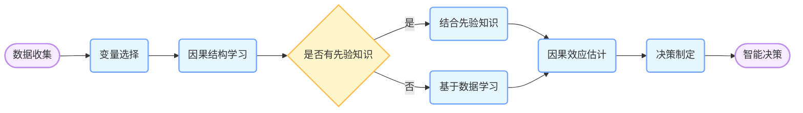

# 因果推理在智能决策系统中的实现与应用

> 关键词：因果推理、智能决策系统、因果模型、决策优化、不确定性处理

> 摘要：本文聚焦于因果推理在智能决策系统中的实现与应用。首先介绍了相关背景，包括目的范围、预期读者等内容。接着深入阐述因果推理的核心概念、联系及架构，通过Mermaid流程图清晰呈现其原理。详细讲解了核心算法原理，并用Python代码进行阐述，同时给出数学模型和公式并举例说明。在项目实战部分，通过实际案例展示代码实现与解读。探讨了因果推理在智能决策系统中的实际应用场景，推荐了相关的学习资源、开发工具框架及论文著作。最后总结了未来发展趋势与挑战，提供常见问题解答及扩展阅读参考资料，旨在全面剖析因果推理在智能决策系统中的重要性及实现路径。

## 1. 背景介绍 
### 1.1 目的和范围
智能决策系统在众多领域，如金融、医疗、交通等发挥着关键作用，然而传统决策系统往往基于相关性进行决策，这可能导致决策的局限性和不可靠性。因果推理作为一种能够揭示事物之间因果关系的技术，为智能决策系统带来了新的发展机遇。本文的目的在于深入探讨因果推理在智能决策系统中的实现原理、方法及应用，旨在为相关领域的研究人员和开发者提供全面且深入的技术指导。范围涵盖因果推理的基本概念、核心算法、数学模型，以及如何在实际项目中运用因果推理来优化智能决策系统。

### 1.2 预期读者
本文预期读者包括计算机科学、人工智能、决策科学等领域的研究人员、学者，他们希望深入了解因果推理与智能决策系统的前沿技术和研究进展；也包括从事智能决策系统开发的工程师、程序员，期望通过学习因果推理技术来提升决策系统的性能和可靠性；同时，对数据分析、决策优化感兴趣的专业人士也能从本文中获取有价值的信息。

### 1.3 文档结构概述
本文首先介绍背景知识，让读者了解研究的目的、范围、预期读者和文档结构。接着阐述因果推理的核心概念与联系，通过文本示意图和Mermaid流程图清晰展示其原理和架构。然后详细讲解核心算法原理，并使用Python代码进行说明，同时给出数学模型和公式并举例。在项目实战部分，通过实际案例展示开发环境搭建、源代码实现及代码解读。之后探讨因果推理在智能决策系统中的实际应用场景。推荐相关的学习资源、开发工具框架及论文著作。最后总结未来发展趋势与挑战，提供常见问题解答及扩展阅读参考资料。

### 1.4 术语表
#### 1.4.1 核心术语定义
- **因果推理**：是一种从数据中发现变量之间因果关系的技术，它不仅仅关注变量之间的相关性，更重要的是确定变量之间的因果方向和因果效应。
- **智能决策系统**：利用人工智能技术，对各种信息进行分析和处理，为决策者提供科学、合理的决策建议的系统。
- **因果模型**：用于描述变量之间因果关系的数学模型，常见的有结构因果模型（SCM）、因果贝叶斯网络（CBN）等。
- **因果效应**：指一个变量的变化对另一个变量产生的影响程度，通常用因果效应估计值来衡量。

#### 1.4.2 相关概念解释
- **相关性与因果性**：相关性是指两个变量之间的统计关联，而因果性则强调一个变量的变化是另一个变量变化的原因。例如，冰淇淋销量和溺水事故数量存在相关性，但它们之间并没有因果关系，而是都受到气温这个共同因素的影响。
- **混杂因素**：是指同时影响原因变量和结果变量的因素，它会导致因果关系的估计出现偏差。例如，在研究吸烟与肺癌的关系时，年龄可能是一个混杂因素，因为年龄既影响吸烟行为，又影响患肺癌的风险。

#### 1.4.3 缩略词列表
- **SCM**：Structural Causal Model，结构因果模型
- **CBN**：Causal Bayesian Network，因果贝叶斯网络
- **ATE**：Average Treatment Effect，平均处理效应

## 2. 核心概念与联系 

### 因果推理的基本原理
因果推理的核心目标是从数据中识别出变量之间的因果关系。传统的统计分析主要关注变量之间的相关性，而因果推理则试图回答“如果改变某个变量，会对其他变量产生什么影响”的问题。其基本原理基于因果模型，通过对因果模型的结构和参数进行估计，来推断变量之间的因果关系。

### 因果模型的架构
因果模型主要包括结构因果模型（SCM）和因果贝叶斯网络（CBN）。结构因果模型是一种基于图论和结构方程的模型，它用有向无环图（DAG）来表示变量之间的因果结构，用结构方程来描述变量之间的函数关系。因果贝叶斯网络则是一种概率图模型，它用有向无环图表示变量之间的因果关系，用条件概率分布来描述变量之间的概率依赖关系。

### 文本示意图
以下是一个简单的结构因果模型的文本示意图：

假设有三个变量 $X$、$Y$ 和 $Z$，其中 $X$ 是原因变量，$Y$ 是结果变量，$Z$ 是混杂因素。它们之间的因果关系可以表示为：

$Z \rightarrow X$，$Z \rightarrow Y$，$X \rightarrow Y$

这意味着 $Z$ 同时影响 $X$ 和 $Y$，而 $X$ 也直接影响 $Y$。

### Mermaid 流程图


该流程图展示了因果推理在智能决策系统中的基本流程。首先进行数据收集，然后选择相关变量。接着进行因果结构学习，根据是否有先验知识选择不同的学习方法。最后进行因果效应估计，并基于估计结果进行决策制定，最终实现智能决策。

## 3. 核心算法原理 & 具体操作步骤 

### 因果结构学习算法
因果结构学习的目标是从数据中学习变量之间的因果结构。常见的算法有基于约束的算法和基于评分的算法。

#### 基于约束的算法
基于约束的算法通过检验变量之间的条件独立性来推断因果结构。其中最著名的算法是 PC 算法（Peter-Clark 算法）。PC 算法的基本步骤如下：

1. 初始化一个完全无向图，图中的节点表示变量。
2. 进行条件独立性检验，删除图中不满足条件独立性的边。
3. 根据边的方向约束，确定部分边的方向。

以下是使用 Python 实现的简单 PC 算法示例：

```python
import numpy as np
from itertools import combinations

def is_independent(X, Y, Z, data):
    # 简单的条件独立性检验，这里可以使用更复杂的检验方法
    if len(Z) == 0:
        cov = np.cov(data[:, X], data[:, Y])
        corr = cov[0, 1] / np.sqrt(cov[0, 0] * cov[1, 1])
        return np.abs(corr) < 0.1
    else:
        # 条件独立性检验的实现
        pass

def pc_algorithm(data, alpha=0.05):
    num_vars = data.shape[1]
    graph = np.ones((num_vars, num_vars), dtype=bool)
    np.fill_diagonal(graph, False)

    l = 0
    while True:
        no_edges_to_remove = True
        for i in range(num_vars):
            for j in range(i + 1, num_vars):
                if graph[i, j]:
                    neighbors_i = np.nonzero(graph[i])[0]
                    neighbors_i = neighbors_i[neighbors_i != j]
                    if len(neighbors_i) >= l:
                        for S in combinations(neighbors_i, l):
                            if is_independent(i, j, S, data):
                                graph[i, j] = graph[j, i] = False
                                no_edges_to_remove = False
        if no_edges_to_remove:
            break
        l += 1

    return graph
```

#### 基于评分的算法
基于评分的算法通过定义一个评分函数来评估不同的因果结构，然后搜索最优的因果结构。常见的评分函数有贝叶斯信息准则（BIC）等。

### 因果效应估计算法
因果效应估计的目标是估计原因变量对结果变量的因果影响。常见的算法有倾向得分匹配（PSM）、工具变量法（IV）等。

#### 倾向得分匹配
倾向得分匹配的基本思想是通过找到与处理组和对照组在协变量上相似的样本，来估计因果效应。以下是使用 Python 实现的简单倾向得分匹配示例：

```python
import numpy as np
from sklearn.linear_model import LogisticRegression

def propensity_score_matching(X, treatment, outcome):
    # 计算倾向得分
    lr = LogisticRegression()
    lr.fit(X, treatment)
    propensity_scores = lr.predict_proba(X)[:, 1]

    treated_indices = np.where(treatment == 1)[0]
    control_indices = np.where(treatment == 0)[0]

    treated_outcomes = []
    control_outcomes = []

    for i in treated_indices:
        treated_score = propensity_scores[i]
        nearest_control_index = np.argmin(np.abs(propensity_scores[control_indices] - treated_score))
        treated_outcomes.append(outcome[i])
        control_outcomes.append(outcome[control_indices[nearest_control_index]])

    ate = np.mean(treated_outcomes) - np.mean(control_outcomes)
    return ate
```

### 具体操作步骤
1. **数据收集**：收集与决策相关的变量数据。
2. **数据预处理**：对数据进行清洗、缺失值处理、标准化等操作。
3. **因果结构学习**：使用上述因果结构学习算法，从数据中学习变量之间的因果结构。
4. **因果效应估计**：根据学习到的因果结构，使用因果效应估计算法，估计原因变量对结果变量的因果效应。
5. **决策制定**：根据因果效应估计结果，制定最优决策。

## 4. 数学模型和公式 & 详细讲解 & 举例说明 

### 结构因果模型（SCM）
结构因果模型（SCM）用有向无环图（DAG） $G = (V, E)$ 表示变量之间的因果结构，其中 $V$ 是变量集合，$E$ 是有向边集合。每个变量 $X_i$ 可以用一个结构方程表示：

$$X_i = f_i(PA_i, U_i)$$

其中 $PA_i$ 是 $X_i$ 的父节点集合，$U_i$ 是外生变量，表示未被模型考虑的因素。

### 因果效应估计公式
#### 平均处理效应（ATE）
平均处理效应（ATE）是最常用的因果效应度量指标，它表示在总体中，处理变量对结果变量的平均因果影响。其定义为：

$$ATE = E[Y(1) - Y(0)]$$

其中 $Y(1)$ 表示处理组的潜在结果，$Y(0)$ 表示对照组的潜在结果。

#### 倾向得分匹配估计 ATE
倾向得分匹配通过匹配处理组和对照组的样本，来估计 ATE。设 $p(X)$ 是倾向得分，即给定协变量 $X$ 时，个体接受处理的概率。倾向得分匹配估计的 ATE 公式为：

$$\hat{ATE}_{PSM} = \frac{1}{n_1} \sum_{i: T_i = 1} Y_i - \frac{1}{n_0} \sum_{j: T_j = 0} Y_j^{match}$$

其中 $n_1$ 和 $n_0$ 分别是处理组和对照组的样本数量，$Y_i$ 是处理组个体的结果，$Y_j^{match}$ 是与处理组个体匹配的对照组个体的结果。

### 举例说明
假设我们要研究某种药物对患者康复时间的影响。我们收集了患者的年龄、性别、病情严重程度等协变量数据，以及患者是否接受药物治疗和康复时间的数据。

首先，我们使用结构因果模型来表示变量之间的因果关系。假设年龄和病情严重程度是混杂因素，它们同时影响药物治疗和康复时间，而药物治疗直接影响康复时间。

然后，我们使用倾向得分匹配来估计药物治疗对康复时间的因果效应。具体步骤如下：

1. 计算倾向得分：使用逻辑回归模型，根据协变量数据计算每个患者接受药物治疗的概率。
2. 匹配样本：对于每个接受药物治疗的患者，找到一个在倾向得分上最接近的未接受药物治疗的患者进行匹配。
3. 计算 ATE：计算处理组和匹配后的对照组的平均康复时间之差，得到药物治疗对康复时间的平均因果效应。

## 5. 项目实战：代码实际案例和详细解释说明 

### 5.1  开发环境搭建
本项目使用 Python 语言进行开发，所需的主要库包括：

- `numpy`：用于数值计算。
- `pandas`：用于数据处理和分析。
- `scikit-learn`：用于机器学习算法的实现。
- `networkx`：用于图的表示和操作。

可以使用以下命令安装这些库：

```sh
pip install numpy pandas scikit-learn networkx
```

### 5.2  源代码详细实现和代码解读
以下是一个完整的项目实战示例，用于研究广告投放对产品销量的影响。

```python
import numpy as np
import pandas as pd
from sklearn.linear_model import LogisticRegression
import networkx as nx

# 生成模拟数据
np.random.seed(42)
n_samples = 1000

# 混杂因素：市场需求
market_demand = np.random.normal(0, 1, n_samples)

# 广告投放（处理变量）
ad_prob = 1 / (1 + np.exp(-(market_demand)))
ad = np.random.binomial(1, ad_prob, n_samples)

# 产品销量（结果变量）
sales = 2 * ad + 3 * market_demand + np.random.normal(0, 1, n_samples)

# 构建数据集
data = pd.DataFrame({
    'market_demand': market_demand,
    'ad': ad,
    'sales': sales
})

# 因果结构学习：PC 算法
def is_independent(X, Y, Z, data):
    if len(Z) == 0:
        cov = np.cov(data.iloc[:, X], data.iloc[:, Y])
        corr = cov[0, 1] / np.sqrt(cov[0, 0] * cov[1, 1])
        return np.abs(corr) < 0.1
    else:
        pass

def pc_algorithm(data, alpha=0.05):
    num_vars = data.shape[1]
    graph = np.ones((num_vars, num_vars), dtype=bool)
    np.fill_diagonal(graph, False)

    l = 0
    while True:
        no_edges_to_remove = True
        for i in range(num_vars):
            for j in range(i + 1, num_vars):
                if graph[i, j]:
                    neighbors_i = np.nonzero(graph[i])[0]
                    neighbors_i = neighbors_i[neighbors_i != j]
                    if len(neighbors_i) >= l:
                        for S in combinations(neighbors_i, l):
                            if is_independent(i, j, S, data):
                                graph[i, j] = graph[j, i] = False
                                no_edges_to_remove = False
        if no_edges_to_remove:
            break
        l += 1

    return graph

# 因果效应估计：倾向得分匹配
def propensity_score_matching(X, treatment, outcome):
    lr = LogisticRegression()
    lr.fit(X, treatment)
    propensity_scores = lr.predict_proba(X)[:, 1]

    treated_indices = np.where(treatment == 1)[0]
    control_indices = np.where(treatment == 0)[0]

    treated_outcomes = []
    control_outcomes = []

    for i in treated_indices:
        treated_score = propensity_scores[i]
        nearest_control_index = np.argmin(np.abs(propensity_scores[control_indices] - treated_score))
        treated_outcomes.append(outcome[i])
        control_outcomes.append(outcome[control_indices[nearest_control_index]])

    ate = np.mean(treated_outcomes) - np.mean(control_outcomes)
    return ate

# 提取特征和标签
X = data[['market_demand']]
treatment = data['ad']
outcome = data['sales']

# 因果结构学习
graph = pc_algorithm(data)

# 因果效应估计
ate = propensity_score_matching(X, treatment, outcome)

print("估计的平均处理效应 (ATE):", ate)
```

### 5.3  代码解读与分析
1. **数据生成**：使用 `numpy` 生成模拟数据，包括混杂因素（市场需求）、处理变量（广告投放）和结果变量（产品销量）。
2. **因果结构学习**：实现了简单的 PC 算法，通过条件独立性检验来学习变量之间的因果结构。
3. **因果效应估计**：使用倾向得分匹配算法，根据协变量数据计算倾向得分，然后匹配处理组和对照组的样本，最后计算平均处理效应（ATE）。
4. **结果输出**：输出估计的平均处理效应（ATE），表示广告投放对产品销量的平均因果影响。

## 6. 实际应用场景 

### 金融领域
在金融领域，因果推理可以用于风险评估、投资决策等方面。例如，通过分析宏观经济因素、公司财务指标等变量之间的因果关系，评估企业的信用风险。在投资决策中，因果推理可以帮助投资者识别影响股票价格的关键因素，从而做出更明智的投资决策。

### 医疗领域
在医疗领域，因果推理可以用于疾病诊断、治疗方案选择等方面。例如，通过分析患者的基因数据、临床症状等变量之间的因果关系，帮助医生更准确地诊断疾病。在治疗方案选择中，因果推理可以评估不同治疗方法对患者康复的因果效应，从而选择最优的治疗方案。

### 交通领域
在交通领域，因果推理可以用于交通流量预测、交通拥堵治理等方面。例如，通过分析天气、时间、道路状况等变量之间的因果关系，预测交通流量。在交通拥堵治理中，因果推理可以帮助交通管理部门识别导致拥堵的关键因素，从而采取有效的治理措施。

### 营销领域
在营销领域，因果推理可以用于广告投放优化、客户细分等方面。例如，通过分析广告投放、用户行为等变量之间的因果关系，优化广告投放策略，提高广告效果。在客户细分中，因果推理可以帮助企业识别影响客户购买行为的关键因素，从而进行精准的客户细分。

## 7. 工具和资源推荐
### 7.1 学习资源推荐
#### 7.1.1 书籍推荐
- 《因果推理导论》（Introduction to Causal Inference）：这本书系统地介绍了因果推理的基本概念、方法和应用，是学习因果推理的经典教材。
- 《为什么：关于因果关系的新科学》（The Book of Why: The New Science of Cause and Effect）：作者是因果推理领域的权威专家朱迪亚·珀尔（Judea Pearl），这本书以通俗易懂的语言介绍了因果推理的发展历程和核心思想。

#### 7.1.2 在线课程
- Coursera 上的“Causal Inference for Data Science”：该课程由知名学者授课，详细介绍了因果推理在数据科学中的应用。
- edX 上的“Probability-The Science of Uncertainty and Data”：虽然不是专门的因果推理课程，但其中包含了很多与因果推理相关的概率知识。

#### 7.1.3 技术博客和网站
- Medium 上的“Towards Data Science”：该博客上有很多关于因果推理的技术文章，涵盖了因果推理的最新研究成果和应用案例。
- 因果推理社区（Causal Inference Community）：这是一个专门讨论因果推理的社区，提供了丰富的学习资源和交流平台。

### 7.2 开发工具框架推荐
#### 7.2.1 IDE和编辑器
- PyCharm：是一款功能强大的 Python 集成开发环境，提供了代码编辑、调试、版本控制等功能，适合开发因果推理相关的 Python 项目。
- Jupyter Notebook：是一个交互式的开发环境，适合进行数据探索和模型验证，非常适合学习和实践因果推理算法。

#### 7.2.2 调试和性能分析工具
- `pdb`：是 Python 内置的调试器，可以帮助开发者定位代码中的问题。
- `cProfile`：是 Python 内置的性能分析工具，可以分析代码的运行时间和函数调用次数，帮助开发者优化代码性能。

#### 7.2.3 相关框架和库
- `DoWhy`：是一个用于因果推理的 Python 库，提供了丰富的因果推理算法和工具，支持多种因果模型和因果效应估计方法。
- `EconML`：是一个用于经济机器学习的 Python 库，其中包含了很多因果推理相关的算法和工具，适用于处理复杂的因果推断问题。

### 7.3 相关论文著作推荐
#### 7.3.1 经典论文
- “Causal Diagrams for Empirical Research”（Judea Pearl）：这篇论文介绍了因果图模型的基本概念和方法，是因果推理领域的经典之作。
- “The Central Role of the Propensity Score in Observational Studies for Causal Effects”（Paul Rosenbaum and Donald Rubin）：这篇论文提出了倾向得分匹配的方法，是因果效应估计领域的重要文献。

#### 7.3.2 最新研究成果
- 每年在人工智能、机器学习等领域的顶级会议（如 NeurIPS、ICML、KDD 等）上都会有很多关于因果推理的最新研究成果发表，可以关注这些会议的论文集。
- 一些知名的学术期刊（如 Journal of Machine Learning Research、Artificial Intelligence 等）也会发表因果推理相关的研究论文。

#### 7.3.3 应用案例分析
- 可以关注一些实际应用案例的研究报告，例如金融机构、医疗企业等发布的关于因果推理在实际业务中应用的案例分析，从中学习因果推理的实际应用方法和经验。

## 8. 总结：未来发展趋势与挑战
### 未来发展趋势
- **与深度学习的融合**：因果推理与深度学习的结合将是未来的一个重要发展方向。深度学习可以用于处理大规模、高维度的数据，而因果推理可以为深度学习模型提供因果解释，提高模型的可解释性和可靠性。
- **多领域应用拓展**：因果推理将在更多领域得到应用，如教育、环境科学、社会科学等。通过揭示变量之间的因果关系，可以为这些领域的决策提供更科学的依据。
- **因果强化学习**：因果强化学习将因果推理与强化学习相结合，能够更好地处理复杂的决策问题。在强化学习中引入因果推理可以帮助智能体更好地理解环境的因果结构，从而做出更优的决策。

### 挑战
- **数据质量和数量**：因果推理需要大量高质量的数据来学习因果结构和估计因果效应。然而，在实际应用中，数据往往存在缺失值、噪声等问题，并且数据量可能有限，这给因果推理带来了挑战。
- **因果结构的复杂性**：现实世界中的因果关系往往非常复杂，可能存在多个混杂因素、中介变量等。如何准确地识别和处理这些复杂的因果结构是因果推理面临的一个重要挑战。
- **可解释性与计算效率的平衡**：虽然因果推理可以提供因果解释，但一些复杂的因果推理算法计算效率较低。如何在保证可解释性的前提下，提高计算效率是需要解决的问题。

## 9. 附录：常见问题与解答
### 1. 因果推理与相关性分析有什么区别？
因果推理关注变量之间的因果关系，即一个变量的变化是否导致另一个变量的变化；而相关性分析只关注变量之间的统计关联，不考虑因果方向。例如，冰淇淋销量和溺水事故数量存在相关性，但它们之间并没有因果关系。

### 2. 因果推理需要满足哪些假设？
常见的假设包括因果充分性假设（所有混杂因素都被观测到）、一致性假设（处理变量的取值是明确的）、可交换性假设（处理组和对照组在未处理时的潜在结果是可交换的）等。

### 3. 如何选择合适的因果推理算法？
选择合适的因果推理算法需要考虑数据的特点、研究问题的性质等因素。例如，如果数据量较小，可以选择基于约束的算法；如果需要考虑复杂的因果结构，可以选择基于评分的算法。同时，还可以根据是否有先验知识来选择合适的算法。

### 4. 因果推理在实际应用中可能会遇到哪些问题？
在实际应用中，因果推理可能会遇到数据质量问题、因果结构的复杂性问题、混杂因素的处理问题等。此外，因果推理的结果也可能受到模型假设的影响，需要进行敏感性分析和稳健性检验。

## 10. 扩展阅读 & 参考资料
### 扩展阅读
- Pearl, J., Glymour, M., & Jewell, N. P. (2016). Causal inference in statistics: A primer. Wiley.
- Peters, J., Janzing, D., & Schölkopf, B. (2017). Elements of causal inference: Foundations and learning algorithms. MIT press.

### 参考资料
- Pearl, J. (2009). Causality: Models, reasoning, and inference. Cambridge university press.
- Rubin, D. B. (1974). Estimating causal effects of treatments in randomized and nonrandomized studies. Journal of educational Psychology, 66(5), 688.