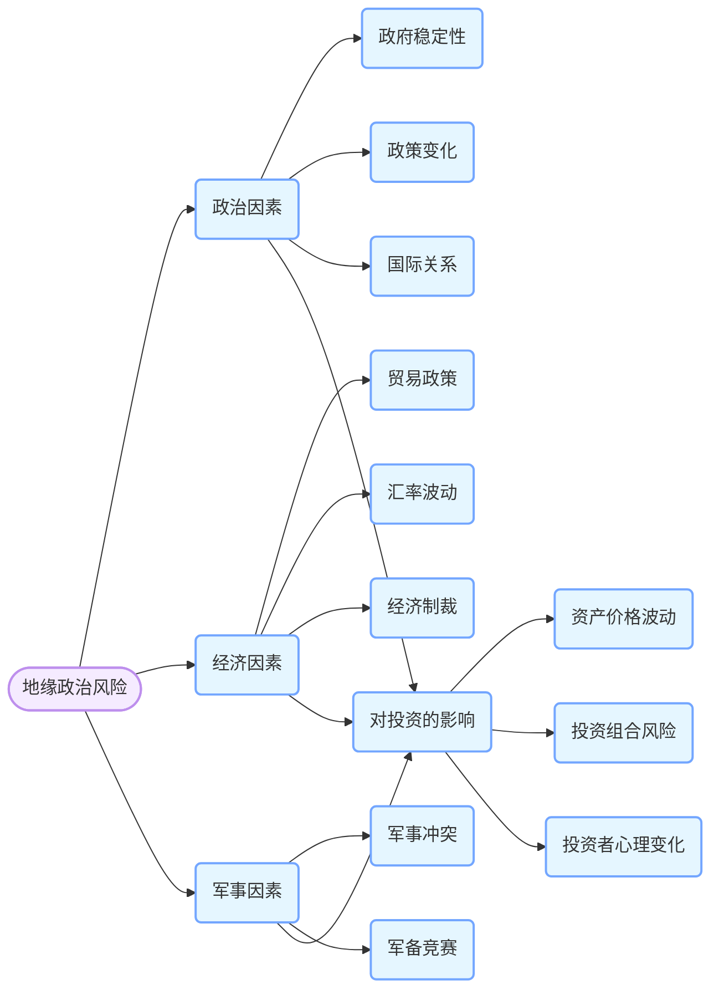

# 地缘政治风险：如何在投资中考虑全球局势

> 关键词：地缘政治风险、投资决策、全球局势、风险评估、资产配置

> 摘要：本文聚焦于地缘政治风险对投资的影响，详细阐述了在投资过程中如何考虑全球局势。通过介绍地缘政治风险的相关背景知识，分析核心概念及联系，探讨核心算法原理与操作步骤，给出数学模型和公式进行说明，结合项目实战案例深入解读，阐述实际应用场景，推荐相关工具和资源，最后总结未来发展趋势与挑战，并提供常见问题解答及扩展阅读参考资料，旨在帮助投资者更全面、深入地理解地缘政治风险，从而做出更合理的投资决策。

## 1. 背景介绍 
### 1.1 目的和范围
在当今全球化的经济格局下，地缘政治风险对投资市场的影响日益显著。本文的目的在于为投资者提供全面且实用的指导，帮助他们在投资决策过程中充分考虑全球局势所带来的地缘政治风险。范围涵盖了从地缘政治风险的基本概念到具体的投资策略应用，涉及不同类型的投资资产和多种国际政治经济场景。

### 1.2 预期读者
本文的预期读者包括各类投资者，无论是个人投资者、机构投资者，还是金融从业者和对投资领域感兴趣的研究人员。对于那些希望在投资中更好地应对地缘政治风险的人士，本文将提供有价值的见解和操作方法。

### 1.3 文档结构概述
本文将首先介绍地缘政治风险的相关背景知识，包括术语定义和相关概念解释。接着分析核心概念与联系，通过文本示意图和 Mermaid 流程图展示其原理和架构。然后阐述核心算法原理和具体操作步骤，并给出相应的 Python 代码示例。之后介绍数学模型和公式，结合实际例子进行详细讲解。通过项目实战案例，说明如何在实际投资中应用这些理论和方法。接着探讨地缘政治风险在不同投资场景中的实际应用。再推荐相关的学习资源、开发工具框架和论文著作。最后总结未来发展趋势与挑战，提供常见问题解答和扩展阅读参考资料。

### 1.4 术语表
#### 1.4.1 核心术语定义
- **地缘政治风险**：指由于国家之间的政治、经济、军事等关系以及地理因素所导致的对投资市场产生不利影响的不确定性。
- **投资组合**：投资者将不同的资产（如股票、债券、黄金等）组合在一起，以达到分散风险和实现特定投资目标的资产集合。
- **风险评估**：对地缘政治风险的可能性和影响程度进行分析和判断的过程。
- **资产配置**：根据投资者的风险承受能力、投资目标和市场情况，将资金分配到不同资产类别的过程。

#### 1.4.2 相关概念解释
- **政治稳定性**：一个国家或地区政治环境的稳定程度，包括政府的合法性、政治制度的健全性和社会秩序的良好程度。政治稳定性越高，地缘政治风险相对越低。
- **贸易摩擦**：国家之间在贸易领域产生的冲突和矛盾，如关税壁垒、贸易限制措施等。贸易摩擦会对相关企业的经营和市场的发展产生负面影响。
- **军事冲突**：国家之间或国内不同势力之间发生的武装冲突。军事冲突会导致市场的剧烈波动，影响投资者的信心。

#### 1.4.3 缩略词列表
- **GDP**：国内生产总值（Gross Domestic Product），是衡量一个国家或地区经济活动总量的指标。
- **CPI**：消费者物价指数（Consumer Price Index），反映居民家庭购买消费商品及服务的价格水平的变动情况。
- **ETF**：交易型开放式指数基金（Exchange Traded Fund），一种在交易所上市交易的、基金份额可变的开放式基金。

## 2. 核心概念与联系 
### 核心概念原理
地缘政治风险对投资的影响是一个复杂的过程，涉及多个方面的因素。从宏观层面来看，地缘政治事件会影响国家的经济政策、国际贸易和金融市场的稳定性。例如，贸易战会导致关税上升，影响企业的进出口业务，进而影响企业的盈利和股票价格。军事冲突会破坏基础设施，影响生产和供应链，导致市场恐慌，资金流向避险资产。

从微观层面来看，地缘政治风险会影响投资者的心理预期和风险偏好。当投资者感受到地缘政治风险增加时，他们会更倾向于选择安全性较高的资产，如黄金、国债等，而减少对风险资产的投资。

### 架构的文本示意图
```plaintext
地缘政治风险
|
|-- 政治因素
|   |-- 政府稳定性
|   |-- 政策变化
|   |-- 国际关系
|
|-- 经济因素
|   |-- 贸易政策
|   |-- 汇率波动
|   |-- 经济制裁
|
|-- 军事因素
|   |-- 军事冲突
|   |-- 军备竞赛
|
|-- 对投资的影响
|   |-- 资产价格波动
|   |-- 投资组合风险
|   |-- 投资者心理变化
```

### Mermaid 流程图


## 3. 核心算法原理 & 具体操作步骤 
### 核心算法原理
在考虑地缘政治风险对投资的影响时，我们可以采用风险评估和资产配置优化的方法。风险评估的核心是通过收集和分析相关数据，评估地缘政治风险的可能性和影响程度。常用的方法包括历史数据分析法、专家评估法和机器学习算法。

资产配置优化的目标是在给定的风险水平下，最大化投资组合的预期收益。可以使用现代投资组合理论（MPT），通过计算资产之间的相关性和预期收益率，确定最优的资产配置比例。

### 具体操作步骤
#### 步骤 1：数据收集
收集与地缘政治风险相关的数据，包括政治事件、经济数据、军事动态等。可以从新闻媒体、政府报告、国际组织发布的数据等渠道获取。

#### 步骤 2：风险评估
使用历史数据分析法或机器学习算法，对地缘政治风险进行评估。例如，可以使用逻辑回归模型预测地缘政治事件发生的概率，使用线性回归模型评估地缘政治事件对资产价格的影响。

#### 步骤 3：资产配置优化
根据风险评估的结果，使用现代投资组合理论进行资产配置优化。可以使用 Python 中的 `scipy.optimize` 库来求解最优资产配置比例。

### Python 代码示例
```python
import numpy as np
from scipy.optimize import minimize

# 假设我们有三种资产：股票、债券和黄金
# 预期收益率
expected_returns = np.array([0.1, 0.05, 0.08])
# 协方差矩阵
cov_matrix = np.array([[0.2, 0.05, 0.03],
                       [0.05, 0.1, 0.02],
                       [0.03, 0.02, 0.15]])

# 目标函数：最小化风险（方差）
def portfolio_variance(weights, cov_matrix):
    return np.dot(weights.T, np.dot(cov_matrix, weights))

# 约束条件：权重之和为 1
def weight_constraint(weights):
    return np.sum(weights) - 1

# 初始权重
initial_weights = np.array([1/3, 1/3, 1/3])

# 边界条件：权重在 0 到 1 之间
bounds = [(0, 1) for _ in range(len(expected_returns))]

# 约束条件列表
constraints = [{'type': 'eq', 'fun': weight_constraint}]

# 求解最优权重
result = minimize(portfolio_variance, initial_weights, args=(cov_matrix,),
                  method='SLSQP', bounds=bounds, constraints=constraints)

optimal_weights = result.x
print("最优资产配置权重：", optimal_weights)
```

## 4. 数学模型和公式 & 详细讲解 & 举例说明 
### 风险评估模型
#### 逻辑回归模型
逻辑回归模型用于预测地缘政治事件发生的概率。假设我们有一组特征变量 $X = [x_1, x_2, ..., x_n]$ 表示地缘政治风险的相关因素，事件发生的概率 $p$ 可以通过以下公式计算：

$$p = \frac{1}{1 + e^{-(\beta_0 + \beta_1x_1 + \beta_2x_2 + ... + \beta_nx_n)}}$$

其中，$\beta_0, \beta_1, ..., \beta_n$ 是模型的参数，可以通过最大似然估计法进行估计。

#### 线性回归模型
线性回归模型用于评估地缘政治事件对资产价格的影响。假设资产价格 $y$ 与地缘政治风险因素 $X$ 之间存在线性关系，可以表示为：

$$y = \alpha + \beta_1x_1 + \beta_2x_2 + ... + \beta_nx_n + \epsilon$$

其中，$\alpha$ 是截距，$\beta_1, \beta_2, ..., \beta_n$ 是回归系数，$\epsilon$ 是误差项。回归系数可以通过最小二乘法进行估计。

### 资产配置模型
#### 现代投资组合理论（MPT）
现代投资组合理论的核心是通过分散投资来降低风险。假设我们有 $n$ 种资产，其预期收益率为 $R = [r_1, r_2, ..., r_n]$，协方差矩阵为 $\Sigma$，资产配置权重为 $w = [w_1, w_2, ..., w_n]$，则投资组合的预期收益率 $E(R_p)$ 和方差 $\sigma_p^2$ 可以通过以下公式计算：

$$E(R_p) = \sum_{i=1}^{n} w_ir_i$$

$$\sigma_p^2 = \sum_{i=1}^{n} \sum_{j=1}^{n} w_iw_j\sigma_{ij}$$

其中，$\sigma_{ij}$ 是资产 $i$ 和资产 $j$ 的协方差。

### 举例说明
假设我们要评估贸易战对某公司股票价格的影响。我们可以收集贸易战相关的指标，如关税税率、贸易规模等作为特征变量，使用线性回归模型进行分析。假设我们得到的回归方程为：

$$y = 10 + 2x_1 - 3x_2$$

其中，$y$ 是股票价格，$x_1$ 是关税税率，$x_2$ 是贸易规模。如果关税税率上升 1%，贸易规模下降 2%，则股票价格的变化为：

$$\Delta y = 2\times1 - 3\times(-2) = 8$$

即股票价格预计上涨 8 个单位。

## 5. 项目实战：代码实际案例和详细解释说明 
### 5.1  开发环境搭建
#### 安装 Python
首先，需要安装 Python 环境。可以从 Python 官方网站（https://www.python.org/downloads/）下载适合自己操作系统的 Python 版本，并按照安装向导进行安装。

#### 安装必要的库
使用以下命令安装必要的 Python 库：
```sh
pip install numpy scipy pandas matplotlib
```

### 5.2  源代码详细实现和代码解读
```python
import numpy as np
import pandas as pd
import matplotlib.pyplot as plt
from scipy.optimize import minimize

# 读取资产收益率数据
data = pd.read_csv('asset_returns.csv')
returns = data.values

# 计算预期收益率和协方差矩阵
expected_returns = np.mean(returns, axis=0)
cov_matrix = np.cov(returns, rowvar=False)

# 目标函数：最小化风险（方差）
def portfolio_variance(weights, cov_matrix):
    return np.dot(weights.T, np.dot(cov_matrix, weights))

# 约束条件：权重之和为 1
def weight_constraint(weights):
    return np.sum(weights) - 1

# 初始权重
num_assets = len(expected_returns)
initial_weights = np.array([1/num_assets] * num_assets)

# 边界条件：权重在 0 到 1 之间
bounds = [(0, 1) for _ in range(num_assets)]

# 约束条件列表
constraints = [{'type': 'eq', 'fun': weight_constraint}]

# 求解最优权重
result = minimize(portfolio_variance, initial_weights, args=(cov_matrix,),
                  method='SLSQP', bounds=bounds, constraints=constraints)

optimal_weights = result.x
print("最优资产配置权重：", optimal_weights)

# 计算最优投资组合的预期收益率和标准差
optimal_return = np.dot(optimal_weights, expected_returns)
optimal_std = np.sqrt(portfolio_variance(optimal_weights, cov_matrix))
print("最优投资组合预期收益率：", optimal_return)
print("最优投资组合标准差：", optimal_std)

# 绘制有效前沿
num_portfolios = 1000
portfolio_returns = []
portfolio_stds = []

for _ in range(num_portfolios):
    weights = np.random.random(num_assets)
    weights /= np.sum(weights)
    portfolio_return = np.dot(weights, expected_returns)
    portfolio_std = np.sqrt(portfolio_variance(weights, cov_matrix))
    portfolio_returns.append(portfolio_return)
    portfolio_stds.append(portfolio_std)

plt.scatter(portfolio_stds, portfolio_returns, c='b', alpha=0.5)
plt.scatter(optimal_std, optimal_return, c='r', marker='*', s=200)
plt.xlabel('标准差')
plt.ylabel('预期收益率')
plt.title('有效前沿')
plt.show()
```

### 代码解读与分析
1. **数据读取**：使用 `pandas` 库读取资产收益率数据。
2. **计算预期收益率和协方差矩阵**：使用 `numpy` 库计算资产的预期收益率和协方差矩阵。
3. **定义目标函数和约束条件**：目标函数是最小化投资组合的方差，约束条件是权重之和为 1。
4. **求解最优权重**：使用 `scipy.optimize` 库的 `minimize` 函数求解最优资产配置权重。
5. **计算最优投资组合的预期收益率和标准差**：根据最优权重计算最优投资组合的预期收益率和标准差。
6. **绘制有效前沿**：随机生成多个投资组合，计算它们的预期收益率和标准差，并绘制散点图。同时，将最优投资组合用红色星号标记出来。

## 6. 实际应用场景 
### 股票投资
在地缘政治风险上升时，股票市场通常会受到较大影响。投资者可以通过分析地缘政治事件对不同行业和公司的影响，调整股票投资组合。例如，在贸易战期间，出口型企业可能会受到负面影响，而内需型企业相对较为稳定。投资者可以减少对出口型企业股票的投资，增加对内需型企业股票的投资。

### 债券投资
债券通常被视为避险资产，当地缘政治风险增加时，投资者会更倾向于购买债券。不同类型的债券受到地缘政治风险的影响程度也不同。例如，国债的安全性较高，受到地缘政治风险的影响相对较小；而企业债券的风险相对较高，当地缘政治风险上升时，企业的信用风险可能会增加，导致企业债券价格下跌。

### 大宗商品投资
大宗商品如黄金、石油等也受到地缘政治风险的影响。黄金通常被视为避险资产，当地缘政治风险增加时，黄金价格往往会上涨。石油价格则受到地缘政治事件对石油生产和供应的影响。例如，中东地区的军事冲突可能会导致石油供应中断，从而推动石油价格上涨。

### 外汇投资
地缘政治风险会影响汇率的波动。例如，一个国家的政治不稳定可能会导致该国货币贬值。投资者可以通过分析地缘政治事件对不同国家货币的影响，进行外汇投资。例如，在英国脱欧期间，英镑汇率大幅下跌，投资者可以通过做空英镑获利。

## 7. 工具和资源推荐
### 7.1 学习资源推荐
#### 7.1.1 书籍推荐
- 《金融市场与金融机构基础》：全面介绍了金融市场和金融机构的基本知识，包括地缘政治风险对金融市场的影响。
- 《聪明的投资者》：价值投资的经典著作，其中也涉及到如何在投资中考虑各种风险因素，包括地缘政治风险。
- 《黑天鹅：如何应对不可预知的未来》：探讨了极端事件（包括地缘政治事件）对投资和经济的影响，以及如何应对这些不确定性。

#### 7.1.2 在线课程
- Coursera 上的“投资学原理”：由知名大学教授授课，系统讲解投资学的基本原理和方法，包括风险评估和资产配置。
- edX 上的“金融风险管理”：介绍了金融风险管理的理论和实践，包括地缘政治风险的管理。
- Udemy 上的“量化投资实战课程”：结合实际案例，讲解量化投资的方法和技术，帮助投资者更好地应对地缘政治风险。

#### 7.1.3 技术博客和网站
- 金融界（https://www.jrj.com.cn/）：提供金融市场的实时行情、分析评论和投资策略，其中包括地缘政治风险对市场的影响分析。
- 新浪财经（https://finance.sina.com.cn/）：综合财经媒体，涵盖股票、债券、基金等多个投资领域，有大量关于地缘政治风险的报道和分析。
- Seeking Alpha（https://seekingalpha.com/）：全球知名的投资研究平台，有许多专业投资者和分析师分享对地缘政治风险的看法和投资建议。

### 7.2 开发工具框架推荐
#### 7.2.1 IDE和编辑器
- PyCharm：功能强大的 Python 集成开发环境，支持代码调试、版本控制等功能，适合进行投资分析和量化交易的代码开发。
- Jupyter Notebook：交互式的开发环境，方便进行数据探索、模型构建和可视化展示，非常适合进行投资研究和实验。
- Visual Studio Code：轻量级的代码编辑器，支持多种编程语言和插件扩展，可用于快速编写和调试投资分析代码。

#### 7.2.2 调试和性能分析工具
- pdb：Python 内置的调试器，可以帮助开发者逐步调试代码，查找问题所在。
- cProfile：Python 标准库中的性能分析工具，可以分析代码的运行时间和函数调用次数，帮助优化代码性能。
- Py-Spy：用于分析 Python 程序性能的工具，可以实时监控代码的运行情况，找出性能瓶颈。

#### 7.2.3 相关框架和库
- pandas：强大的数据处理和分析库，提供了丰富的数据结构和函数，方便进行金融数据的处理和分析。
- numpy：Python 的数值计算库，提供了高效的数组操作和数学函数，是进行投资分析和量化交易的基础库。
- scikit-learn：机器学习库，提供了多种机器学习算法和工具，可用于风险评估和投资预测。

### 7.3 相关论文著作推荐
#### 7.3.1 经典论文
- Markowitz, H. M. (1952). Portfolio Selection. The Journal of Finance, 7(1), 77-91. 这篇论文提出了现代投资组合理论，为资产配置提供了理论基础。
- Sharpe, W. F. (1964). Capital Asset Prices: A Theory of Market Equilibrium under Conditions of Risk. The Journal of Finance, 19(3), 425-442. 该论文提出了资本资产定价模型（CAPM），用于评估资产的风险和预期收益率。

#### 7.3.2 最新研究成果
- 可以关注顶级金融学术期刊，如 The Journal of Finance、The Review of Financial Studies 等，这些期刊会发表关于地缘政治风险和投资的最新研究成果。

#### 7.3.3 应用案例分析
- 一些金融研究机构和咨询公司会发布关于地缘政治风险对投资影响的应用案例分析报告，如麦肯锡、波士顿咨询集团等。这些报告可以帮助投资者更好地理解如何在实际投资中应对地缘政治风险。

## 8. 总结：未来发展趋势与挑战
### 未来发展趋势
#### 地缘政治风险的复杂性增加
随着全球化的深入和国际政治经济格局的变化，地缘政治风险的来源和表现形式越来越复杂。例如，网络安全、气候变化等非传统安全问题也开始成为影响地缘政治和投资的重要因素。

#### 科技对投资决策的影响增大
人工智能、大数据、区块链等技术的发展将为投资者提供更强大的工具和方法来分析地缘政治风险。例如，通过大数据分析可以实时监测地缘政治事件的动态，人工智能算法可以更准确地预测地缘政治风险对投资的影响。

#### 投资者对风险管理的重视程度提高
经历了多次地缘政治事件对投资市场的冲击后，投资者将更加重视风险管理。他们会更加注重资产的分散化配置，增加对避险资产的投资，同时采用更先进的风险管理技术来应对地缘政治风险。

### 挑战
#### 数据获取和分析的难度
地缘政治风险涉及大量的政治、经济、军事等方面的数据，这些数据的获取和整合存在一定的难度。同时，地缘政治事件具有不确定性和复杂性，如何从海量数据中提取有价值的信息并进行准确的分析是一个挑战。

#### 模型的准确性和可靠性
目前用于评估地缘政治风险和进行资产配置的模型大多基于历史数据和假设，而地缘政治事件往往具有独特性和不可重复性，模型的准确性和可靠性面临考验。如何改进模型，使其更好地适应不断变化的地缘政治环境是一个重要的挑战。

#### 投资者情绪的影响
地缘政治事件容易引发投资者的情绪波动，导致市场的非理性行为。投资者的恐慌和贪婪情绪会影响投资决策，增加市场的不确定性。如何在投资决策中理性对待投资者情绪，避免盲目跟风是投资者面临的挑战之一。

## 9. 附录：常见问题与解答
### 问题 1：如何判断地缘政治风险对投资的影响程度？
解答：可以从多个方面进行判断。首先，分析地缘政治事件的性质和规模，如战争、贸易战等重大事件通常会对投资市场产生较大影响。其次，关注事件涉及的国家和地区的经济实力和国际地位，以及相关行业的敏感度。此外，还可以通过观察市场的反应，如股票价格、汇率、债券收益率等的变化来判断影响程度。

### 问题 2：在投资中如何分散地缘政治风险？
解答：可以通过资产配置来分散地缘政治风险。将资金分配到不同类型的资产，如股票、债券、黄金、房地产等，因为不同资产对地缘政治风险的敏感度不同。同时，也可以投资于不同国家和地区的市场，避免过度集中于某个地区。

### 问题 3：地缘政治风险对不同行业的影响有何差异？
解答：不同行业受到地缘政治风险的影响程度不同。出口型行业如制造业、农业等通常对贸易政策和汇率波动较为敏感，当地缘政治风险导致贸易摩擦加剧或汇率大幅波动时，这些行业的企业可能会面临订单减少、成本上升等问题。而内需型行业如医疗、教育等相对较为稳定，受到地缘政治风险的影响较小。此外，能源行业如石油、天然气等会受到地缘政治事件对能源供应和价格的影响。

### 问题 4：如何利用技术手段应对地缘政治风险？
解答：可以利用大数据技术收集和分析与地缘政治风险相关的信息，包括新闻报道、社交媒体数据等，及时了解事件的动态和市场的反应。人工智能算法可以用于风险评估和预测，帮助投资者做出更准确的决策。此外，量化交易系统可以根据预设的规则自动调整投资组合，降低地缘政治风险对投资的影响。

## 10. 扩展阅读 & 参考资料
### 扩展阅读
- 《地缘政治的世界》：深入探讨了地缘政治的理论和实践，帮助读者更好地理解地缘政治事件的背景和影响。
- 《投资中的心理学》：介绍了投资者在投资决策过程中的心理因素，包括地缘政治事件对投资者情绪的影响，以及如何克服心理偏差做出理性决策。
- 《金融科技前沿》：关注金融科技的最新发展和应用，包括如何利用科技手段应对地缘政治风险等问题。

### 参考资料
- 国际货币基金组织（IMF）发布的《世界经济展望》报告，提供了全球经济形势和地缘政治风险的分析。
- 世界银行发布的相关报告，包含了各国经济数据和地缘政治风险评估。
- 各大金融机构和研究机构发布的研究报告和分析文章，如高盛、摩根大通等的报告，对地缘政治风险和投资策略有深入的研究。