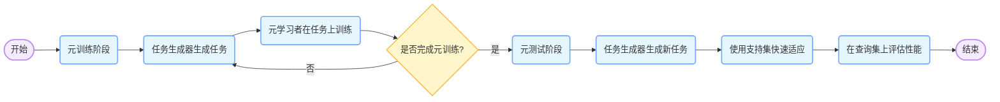

# 基于元学习的AI快速适应新任务的方法探索

> 关键词：元学习、AI、快速适应、新任务、学习策略

> 摘要：本文旨在深入探索基于元学习的AI快速适应新任务的方法。首先介绍了研究的背景、目的、预期读者和文档结构，明确相关术语。接着阐述元学习的核心概念与联系，包括其原理和架构，并通过Mermaid流程图展示。详细讲解了核心算法原理，结合Python源代码进行说明，同时给出数学模型和公式并举例。通过项目实战，展示了开发环境搭建、源代码实现与解读。探讨了实际应用场景，推荐了相关工具和资源，最后总结了未来发展趋势与挑战，提供常见问题解答和扩展阅读参考资料。

## 1. 背景介绍 
### 1.1 目的和范围
传统的机器学习方法通常需要大量的数据和长时间的训练来适应新的任务。然而，在现实世界中，新任务不断涌现，数据获取也可能受到限制。元学习（Meta-learning）作为一种新兴的机器学习范式，旨在让AI系统能够快速学习和适应新任务，减少对大量数据和长时间训练的依赖。本文的目的是探索基于元学习的AI快速适应新任务的方法，涵盖元学习的基本概念、算法原理、实际应用以及未来发展趋势等方面。

### 1.2 预期读者
本文预期读者包括对机器学习、人工智能领域感兴趣的研究人员、工程师、学生等。对于有一定机器学习基础，希望深入了解元学习技术的读者，本文将提供系统的知识和实践指导；对于初学者，也可以通过本文初步了解元学习的核心思想和应用价值。

### 1.3 文档结构概述
本文将按照以下结构进行阐述：首先介绍元学习的核心概念与联系，包括其原理和架构；接着详细讲解核心算法原理，并给出Python源代码示例；然后介绍元学习的数学模型和公式，并举例说明；通过项目实战展示如何在实际中应用元学习来快速适应新任务；探讨元学习的实际应用场景；推荐相关的工具和资源；最后总结元学习的未来发展趋势与挑战，并提供常见问题解答和扩展阅读参考资料。

### 1.4 术语表
#### 1.4.1 核心术语定义
- **元学习（Meta-learning）**：也称为“学习如何学习”，是一种让模型在多个任务上进行训练，从而学会如何快速适应新任务的机器学习范式。
- **元训练（Meta-training）**：在元学习中，模型在一系列任务上进行训练，以学习通用的学习策略。
- **元测试（Meta-testing）**：在元训练完成后，模型在新的、未见过的任务上进行测试，以评估其快速适应新任务的能力。
- **支持集（Support set）**：在元学习中，用于快速适应新任务的少量标注数据。
- **查询集（Query set）**：用于评估模型在新任务上性能的标注数据。

#### 1.4.2 相关概念解释
- **迁移学习（Transfer learning）**：与元学习有一定关联，迁移学习是将在一个任务上学习到的知识迁移到另一个相关任务上，但通常需要更多的数据和手动调整。元学习则更侧重于学习通用的学习策略，能够更快速地适应新任务。
- **少样本学习（Few-shot learning）**：是元学习的一个重要应用场景，指在只有少量标注样本的情况下进行学习和预测。

#### 1.4.3 缩略词列表
- **MAML**：Model-Agnostic Meta-Learning（模型无关元学习）
- **FOMAML**：First-Order Model-Agnostic Meta-Learning（一阶模型无关元学习）

## 2. 核心概念与联系 
### 核心概念原理
元学习的核心思想是“学习如何学习”。传统的机器学习方法通常是在单个任务上进行训练，而元学习则是在多个任务上进行训练，让模型学会一种通用的学习策略，以便在遇到新任务时能够快速适应。

元学习的训练过程通常分为两个阶段：元训练和元测试。在元训练阶段，模型在一系列任务上进行训练，通过优化元目标函数来学习通用的学习策略。在元测试阶段，模型在新的、未见过的任务上进行测试，使用少量的标注数据（支持集）进行快速适应，然后在查询集上评估性能。

### 架构的文本示意图
元学习的架构可以分为三个主要部分：元学习者、任务生成器和任务评估器。

- **元学习者**：是元学习的核心，负责学习通用的学习策略。它可以是一个神经网络，通过在多个任务上进行训练来调整其参数。
- **任务生成器**：负责生成一系列的任务，这些任务可以是不同的分类任务、回归任务等。任务生成器可以根据不同的分布生成任务，以模拟现实世界中的各种情况。
- **任务评估器**：负责评估元学习者在新任务上的性能。在元测试阶段，任务评估器使用支持集和查询集来评估模型的适应能力。

### Mermaid 流程图


## 3. 核心算法原理 & 具体操作步骤 
### 模型无关元学习（MAML）算法原理
模型无关元学习（MAML）是一种经典的元学习算法，它的核心思想是找到一组初始参数，使得模型在经过少量的梯度更新后，能够在新任务上取得较好的性能。

MAML的算法步骤如下：
1. **初始化参数**：随机初始化模型的参数 $\theta$。
2. **元训练循环**：
    - 从任务分布 $p(\mathcal{T})$ 中采样一个任务 $\mathcal{T}$。
    - 在任务 $\mathcal{T}$ 上进行内部更新：
        - 从任务 $\mathcal{T}$ 的支持集 $S$ 中采样一批数据 $(x, y)$。
        - 计算损失函数 $L(\theta; x, y)$。
        - 使用梯度下降法更新参数：$\theta' = \theta - \alpha \nabla_{\theta} L(\theta; x, y)$，其中 $\alpha$ 是内部学习率。
    - 在任务 $\mathcal{T}$ 上进行外部更新：
        - 从任务 $\mathcal{T}$ 的查询集 $Q$ 中采样一批数据 $(x', y')$。
        - 计算损失函数 $L(\theta'; x', y')$。
        - 使用梯度下降法更新元参数 $\theta$：$\theta = \theta - \beta \nabla_{\theta} L(\theta'; x', y')$，其中 $\beta$ 是元学习率。
3. **元测试**：
    - 在新任务上，使用支持集进行少量的梯度更新，得到适应后的参数 $\theta'$。
    - 在查询集上评估模型的性能。

### Python源代码实现
```python
import torch
import torch.nn as nn
import torch.optim as optim

# 定义一个简单的神经网络模型
class SimpleNet(nn.Module):
    def __init__(self, input_size, hidden_size, output_size):
        super(SimpleNet, self).__init__()
        self.fc1 = nn.Linear(input_size, hidden_size)
        self.relu = nn.ReLU()
        self.fc2 = nn.Linear(hidden_size, output_size)

    def forward(self, x):
        out = self.fc1(x)
        out = self.relu(out)
        out = self.fc2(out)
        return out

# 定义MAML算法
def maml(model, tasks, inner_lr, meta_lr, num_meta_steps, num_inner_steps):
    meta_optimizer = optim.Adam(model.parameters(), lr=meta_lr)

    for meta_step in range(num_meta_steps):
        meta_loss = 0
        for task in tasks:
            # 复制模型参数
            fast_weights = dict(model.named_parameters())

            # 内部更新
            for inner_step in range(num_inner_steps):
                support_x, support_y = task.sample_support_set()
                output = model(support_x)
                loss = nn.CrossEntropyLoss()(output, support_y)
                grads = torch.autograd.grad(loss, fast_weights.values(), create_graph=True)
                fast_weights = {name: param - inner_lr * grad for name, param, grad in zip(fast_weights.keys(), fast_weights.values(), grads)}

            # 外部更新
            query_x, query_y = task.sample_query_set()
            output = model.forward_with_weights(query_x, fast_weights)
            task_loss = nn.CrossEntropyLoss()(output, query_y)
            meta_loss += task_loss

        # 元更新
        meta_optimizer.zero_grad()
        meta_loss.backward()
        meta_optimizer.step()

    return model

# 示例使用
input_size = 10
hidden_size = 20
output_size = 5
model = SimpleNet(input_size, hidden_size, output_size)

# 假设tasks是一个任务列表
tasks = []
inner_lr = 0.01
meta_lr = 0.001
num_meta_steps = 100
num_inner_steps = 5

trained_model = maml(model, tasks, inner_lr, meta_lr, num_meta_steps, num_inner_steps)
```

### 代码解释
- `SimpleNet` 类定义了一个简单的两层神经网络模型。
- `maml` 函数实现了MAML算法的核心逻辑，包括内部更新和外部更新。
- 在内部更新中，使用支持集对模型参数进行少量的梯度更新。
- 在外部更新中，使用查询集计算损失，并更新元参数。

## 4. 数学模型和公式 & 详细讲解 & 举例说明 
### 数学模型
在元学习中，我们的目标是找到一组元参数 $\theta$，使得模型在经过少量的梯度更新后，能够在新任务上取得较好的性能。

假设我们有一个任务分布 $p(\mathcal{T})$，其中每个任务 $\mathcal{T}$ 包含一个支持集 $S$ 和一个查询集 $Q$。我们的元目标函数可以表示为：

$$\min_{\theta} \mathbb{E}_{\mathcal{T} \sim p(\mathcal{T})} [L(\theta'_{\mathcal{T}}; Q)]$$

其中 $\theta'_{\mathcal{T}}$ 是在任务 $\mathcal{T}$ 上经过内部更新后的参数，$L(\theta'_{\mathcal{T}}; Q)$ 是在查询集 $Q$ 上的损失函数。

### 内部更新公式
在任务 $\mathcal{T}$ 上进行内部更新时，我们使用梯度下降法更新参数：

$$\theta'_{\mathcal{T}} = \theta - \alpha \nabla_{\theta} L(\theta; S)$$

其中 $\alpha$ 是内部学习率，$L(\theta; S)$ 是在支持集 $S$ 上的损失函数。

### 外部更新公式
在元训练中，我们使用梯度下降法更新元参数 $\theta$：

$$\theta = \theta - \beta \nabla_{\theta} \mathbb{E}_{\mathcal{T} \sim p(\mathcal{T})} [L(\theta'_{\mathcal{T}}; Q)]$$

其中 $\beta$ 是元学习率。

### 举例说明
假设我们有一个分类任务，输入是一个二维向量，输出是一个三分类的标签。我们有一个简单的神经网络模型 $f_{\theta}(x)$，其中 $\theta$ 是模型的参数。

在元训练阶段，我们从任务分布中采样一个任务 $\mathcal{T}$，该任务的支持集 $S$ 包含10个样本，查询集 $Q$ 包含5个样本。

- **内部更新**：
    - 计算支持集上的损失函数 $L(\theta; S)$，例如使用交叉熵损失。
    - 计算梯度 $\nabla_{\theta} L(\theta; S)$。
    - 使用内部学习率 $\alpha = 0.01$ 更新参数：$\theta' = \theta - 0.01 \nabla_{\theta} L(\theta; S)$。

- **外部更新**：
    - 计算查询集上的损失函数 $L(\theta'; Q)$。
    - 计算梯度 $\nabla_{\theta} L(\theta'; Q)$。
    - 使用元学习率 $\beta = 0.001$ 更新元参数：$\theta = \theta - 0.001 \nabla_{\theta} L(\theta'; Q)$。

通过多次迭代元训练，我们可以找到一组元参数 $\theta$，使得模型在新任务上能够快速适应。

## 5. 项目实战：代码实际案例和详细解释说明 
### 5.1  开发环境搭建
#### 操作系统
建议使用Linux或macOS系统，因为它们对Python和深度学习框架的支持更好。如果使用Windows系统，需要确保安装了必要的依赖库。

#### Python环境
使用Python 3.7及以上版本。可以使用Anaconda或Miniconda来管理Python环境，创建一个新的虚拟环境：

```bash
conda create -n meta_learning python=3.8
conda activate meta_learning
```

#### 深度学习框架
安装PyTorch深度学习框架，根据自己的CUDA版本选择合适的安装命令：

```bash
# 对于CPU版本
pip install torch torchvision

# 对于CUDA 11.3版本
pip install torch torchvision torchaudio --extra-index-url https://download.pytorch.org/whl/cu113
```

#### 其他依赖库
安装其他必要的依赖库，如NumPy、Matplotlib等：

```bash
pip install numpy matplotlib
```

### 5.2  源代码详细实现和代码解读
#### 数据集准备
我们使用Omniglot数据集进行少样本学习的实验。Omniglot数据集包含1623个不同的手写字符，每个字符有20个样本。

```python
import torchvision.transforms as transforms
from torchvision.datasets import Omniglot
from torch.utils.data import DataLoader, Subset

# 定义数据预处理
transform = transforms.Compose([
    transforms.Resize((28, 28)),
    transforms.ToTensor()
])

# 加载Omniglot数据集
train_dataset = Omniglot(root='./data', background=True, transform=transform, download=True)
test_dataset = Omniglot(root='./data', background=False, transform=transform, download=True)

# 划分支持集和查询集
train_support_dataset = Subset(train_dataset, range(0, len(train_dataset), 2))
train_query_dataset = Subset(train_dataset, range(1, len(train_dataset), 2))
test_support_dataset = Subset(test_dataset, range(0, len(test_dataset), 2))
test_query_dataset = Subset(test_dataset, range(1, len(test_dataset), 2))

# 创建数据加载器
train_support_loader = DataLoader(train_support_dataset, batch_size=32, shuffle=True)
train_query_loader = DataLoader(train_query_dataset, batch_size=32, shuffle=True)
test_support_loader = DataLoader(test_support_dataset, batch_size=32, shuffle=True)
test_query_loader = DataLoader(test_query_dataset, batch_size=32, shuffle=True)
```

#### 模型定义
我们定义一个简单的卷积神经网络模型：

```python
import torch.nn as nn

class ConvNet(nn.Module):
    def __init__(self, num_classes):
        super(ConvNet, self).__init__()
        self.conv1 = nn.Conv2d(1, 64, kernel_size=3, padding=1)
        self.bn1 = nn.BatchNorm2d(64)
        self.relu1 = nn.ReLU()
        self.pool1 = nn.MaxPool2d(2)
        self.conv2 = nn.Conv2d(64, 64, kernel_size=3, padding=1)
        self.bn2 = nn.BatchNorm2d(64)
        self.relu2 = nn.ReLU()
        self.pool2 = nn.MaxPool2d(2)
        self.conv3 = nn.Conv2d(64, 64, kernel_size=3, padding=1)
        self.bn3 = nn.BatchNorm2d(64)
        self.relu3 = nn.ReLU()
        self.pool3 = nn.MaxPool2d(2)
        self.fc = nn.Linear(64 * 3 * 3, num_classes)

    def forward(self, x):
        x = self.pool1(self.relu1(self.bn1(self.conv1(x))))
        x = self.pool2(self.relu2(self.bn2(self.conv2(x))))
        x = self.pool3(self.relu3(self.bn3(self.conv3(x))))
        x = x.view(-1, 64 * 3 * 3)
        x = self.fc(x)
        return x
```

#### MAML算法实现
```python
import torch.optim as optim

def maml(model, train_support_loader, train_query_loader, inner_lr, meta_lr, num_meta_steps, num_inner_steps):
    meta_optimizer = optim.Adam(model.parameters(), lr=meta_lr)

    for meta_step in range(num_meta_steps):
        meta_loss = 0
        for (support_x, support_y), (query_x, query_y) in zip(train_support_loader, train_query_loader):
            # 复制模型参数
            fast_weights = dict(model.named_parameters())

            # 内部更新
            for inner_step in range(num_inner_steps):
                output = model(support_x)
                loss = nn.CrossEntropyLoss()(output, support_y)
                grads = torch.autograd.grad(loss, fast_weights.values(), create_graph=True)
                fast_weights = {name: param - inner_lr * grad for name, param, grad in zip(fast_weights.keys(), fast_weights.values(), grads)}

            # 外部更新
            output = model.forward_with_weights(query_x, fast_weights)
            task_loss = nn.CrossEntropyLoss()(output, query_y)
            meta_loss += task_loss

        # 元更新
        meta_optimizer.zero_grad()
        meta_loss.backward()
        meta_optimizer.step()

    return model

# 初始化模型
model = ConvNet(num_classes=10)

# 训练模型
inner_lr = 0.01
meta_lr = 0.001
num_meta_steps = 100
num_inner_steps = 5

trained_model = maml(model, train_support_loader, train_query_loader, inner_lr, meta_lr, num_meta_steps, num_inner_steps)
```

### 5.3  代码解读与分析
- **数据集准备**：使用 `torchvision` 库加载Omniglot数据集，并进行数据预处理。将数据集划分为支持集和查询集，创建数据加载器。
- **模型定义**：定义一个简单的卷积神经网络模型 `ConvNet`，包含三个卷积层和一个全连接层。
- **MAML算法实现**：在 `maml` 函数中，实现了MAML算法的核心逻辑，包括内部更新和外部更新。在内部更新中，使用支持集对模型参数进行少量的梯度更新；在外部更新中，使用查询集计算损失，并更新元参数。

通过这个项目实战，我们可以看到如何使用MAML算法在少样本学习任务上进行训练，使模型能够快速适应新任务。

## 6. 实际应用场景 
### 少样本学习
少样本学习是元学习最常见的应用场景之一。在实际应用中，获取大量标注数据往往是困难和昂贵的，例如在医疗图像诊断、生物识别等领域。元学习可以让模型在只有少量标注样本的情况下进行学习和预测，从而提高模型的实用性。

### 快速适应新环境
在机器人领域，机器人需要在不同的环境中执行任务。元学习可以让机器人快速适应新的环境，例如在不同的地形、光照条件下进行导航和操作。通过在多个环境中进行元训练，机器人可以学习到通用的学习策略，从而在新环境中快速调整自己的行为。

### 个性化推荐
在推荐系统中，用户的兴趣和偏好是不断变化的。元学习可以让推荐系统快速适应新用户的偏好，提供个性化的推荐。通过在多个用户数据上进行元训练，推荐系统可以学习到如何快速调整推荐策略，以满足不同用户的需求。

### 自动机器学习（AutoML）
在自动机器学习中，需要在不同的数据集和任务上选择合适的模型和超参数。元学习可以帮助自动机器学习系统快速找到最优的模型和超参数配置。通过在多个数据集和任务上进行元训练，自动机器学习系统可以学习到如何根据新的数据集和任务特征选择合适的模型和超参数。

## 7. 工具和资源推荐
### 7.1 学习资源推荐
#### 7.1.1 书籍推荐
- 《Deep Learning》（深度学习）：由Ian Goodfellow、Yoshua Bengio和Aaron Courville所著，是深度学习领域的经典教材，涵盖了深度学习的基本概念、算法和应用。
- 《Meta-Learning: Foundations and Trends® in Machine Learning》：全面介绍了元学习的理论和方法，适合深入学习元学习的读者。

#### 7.1.2 在线课程
- Coursera上的“Deep Learning Specialization”（深度学习专项课程）：由Andrew Ng教授授课，包括深度学习的基础、卷积神经网络、循环神经网络等内容，对理解元学习的基础有很大帮助。
- edX上的“Meta-Learning: Learning to Learn”：专门介绍元学习的在线课程，涵盖了元学习的核心概念、算法和应用。

#### 7.1.3 技术博客和网站
- arXiv.org：是一个预印本服务器，包含了大量的机器学习和人工智能领域的最新研究论文，包括元学习相关的论文。
- Medium上的机器学习和人工智能相关博客：有很多作者分享元学习的最新进展和实践经验。

### 7.2 开发工具框架推荐
#### 7.2.1 IDE和编辑器
- PyCharm：是一款专业的Python集成开发环境，提供了丰富的代码编辑、调试和项目管理功能，适合开发深度学习项目。
- Jupyter Notebook：是一个交互式的开发环境，适合进行数据探索、模型实验和代码演示。

#### 7.2.2 调试和性能分析工具
- TensorBoard：是TensorFlow提供的一个可视化工具，可以用于可视化训练过程中的损失函数、准确率等指标，帮助调试和优化模型。
- PyTorch Profiler：是PyTorch提供的性能分析工具，可以帮助分析模型的性能瓶颈，优化代码性能。

#### 7.2.3 相关框架和库
- PyTorch：是一个开源的深度学习框架，提供了丰富的深度学习模型和工具，支持元学习的实现。
- Learn2Learn：是一个专门用于元学习的Python库，提供了多种元学习算法的实现，方便快速开发和实验。

### 7.3 相关论文著作推荐
#### 7.3.1 经典论文
- "Model-Agnostic Meta-Learning for Fast Adaptation of Deep Networks"：提出了模型无关元学习（MAML）算法，是元学习领域的经典论文。
- "Matching Networks for One Shot Learning"：提出了匹配网络（Matching Networks）算法，用于少样本学习任务。

#### 7.3.2 最新研究成果
- 关注arXiv.org上最新的元学习相关论文，了解元学习领域的最新研究进展。

#### 7.3.3 应用案例分析
- 一些学术会议和期刊上会发表元学习在不同领域的应用案例，如NeurIPS、ICML等会议上的相关论文。

## 8. 总结：未来发展趋势与挑战
### 未来发展趋势
- **与其他技术的融合**：元学习将与强化学习、迁移学习等技术进一步融合，以提高模型的学习能力和适应能力。例如，将元学习应用于强化学习中，可以让智能体更快地学习到最优策略。
- **大规模应用**：随着计算资源的不断提升和算法的不断优化，元学习将在更多的领域得到大规模应用，如医疗、金融、交通等。
- **理论研究的深入**：对元学习的理论研究将不断深入，如元学习的收敛性分析、泛化能力分析等，为元学习的应用提供更坚实的理论基础。

### 挑战
- **计算资源需求**：元学习通常需要在多个任务上进行训练，计算资源需求较大。如何在有限的计算资源下提高元学习的效率是一个挑战。
- **数据分布的影响**：元学习的性能受到任务数据分布的影响。如果任务数据分布差异较大，模型的适应能力可能会受到影响。如何处理不同数据分布下的元学习是一个需要解决的问题。
- **可解释性**：元学习模型的可解释性较差，难以理解模型是如何学习到通用的学习策略的。提高元学习模型的可解释性是未来研究的一个重要方向。

## 9. 附录：常见问题与解答
### 元学习和传统机器学习有什么区别？
传统机器学习通常是在单个任务上进行训练，需要大量的数据和长时间的训练来适应新任务。元学习则是在多个任务上进行训练，学习通用的学习策略，能够在遇到新任务时快速适应，减少对大量数据和长时间训练的依赖。

### 元学习适用于哪些场景？
元学习适用于少样本学习、快速适应新环境、个性化推荐、自动机器学习等场景，这些场景通常需要模型能够在少量数据或新环境下快速学习和适应。

### 如何选择合适的元学习算法？
选择合适的元学习算法需要考虑任务的特点、数据的分布、计算资源等因素。例如，对于少样本分类任务，MAML算法是一个不错的选择；对于序列数据，基于RNN的元学习算法可能更合适。

### 元学习的训练过程中需要注意什么？
在元学习的训练过程中，需要注意内部学习率和元学习率的选择，以及任务的采样方式。内部学习率和元学习率的选择会影响模型的收敛速度和性能，任务的采样方式会影响模型的泛化能力。

## 10. 扩展阅读 & 参考资料
- Finn, C., Abbeel, P., & Levine, S. (2017). Model-Agnostic Meta-Learning for Fast Adaptation of Deep Networks. arXiv preprint arXiv:1703.03400.
- Vinyals, O., Blundell, C., Lillicrap, T., Wierstra, D., & others. (2016). Matching Networks for One Shot Learning. Advances in neural information processing systems.
- 李航. (2012). 统计学习方法. 清华大学出版社.
- Goodfellow, I., Bengio, Y., & Courville, A. (2016). Deep Learning. MIT press.

通过以上的内容，我们对基于元学习的AI快速适应新任务的方法进行了全面的探索，希望能够为读者提供有价值的参考和指导。