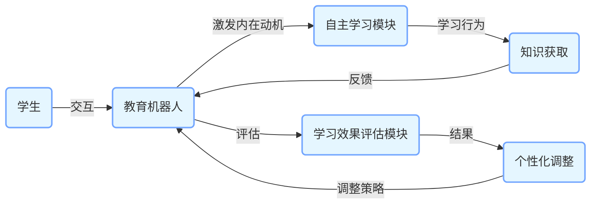

# 基于内在动机的自主学习在教育机器人中的应用

> 关键词：内在动机；自主学习；教育机器人；应用；人工智能教育

> 摘要：本文深入探讨了基于内在动机的自主学习在教育机器人中的应用。首先介绍了相关背景，包括研究目的、预期读者、文档结构和术语表。接着阐述了内在动机和自主学习的核心概念及其联系，通过示意图和流程图进行直观展示。详细讲解了相关核心算法原理及具体操作步骤，结合Python源代码进行说明。还给出了数学模型和公式，并举例阐释。通过项目实战，展示了代码实际案例并进行详细解释。分析了该应用在实际场景中的应用情况，推荐了相关的学习资源、开发工具框架和论文著作。最后总结了未来发展趋势与挑战，提供了常见问题解答和扩展阅读参考资料，旨在为推动基于内在动机的自主学习在教育机器人领域的进一步发展提供全面的技术指导和理论支持。

## 1. 背景介绍 
### 1.1 目的和范围
本研究的目的在于探索如何将基于内在动机的自主学习理念有效应用于教育机器人中，以提升教育机器人的教学效果和学生的学习体验。随着人工智能技术的不断发展，教育机器人在教育领域的应用越来越广泛，但目前大多数教育机器人仍采用传统的教学模式，缺乏对学生内在动机的激发和自主学习能力的培养。因此，本研究旨在打破传统模式的局限，通过引入内在动机和自主学习机制，使教育机器人能够更好地适应学生的个性化需求，提高学生的学习积极性和主动性。

本研究的范围主要涵盖了内在动机和自主学习的基本概念、相关算法原理、数学模型以及在教育机器人中的具体应用案例。同时，还将探讨该应用在不同教育场景中的可行性和有效性，为教育机器人的研发和应用提供理论和实践指导。

### 1.2 预期读者
本文的预期读者包括教育技术领域的研究人员、教育机器人的开发者、教师以及对人工智能教育感兴趣的人士。对于研究人员来说，本文可以为他们提供新的研究思路和方法；对于开发者而言，有助于他们将基于内在动机的自主学习理念融入到教育机器人的设计中；教师可以从中了解如何利用教育机器人更好地激发学生的学习兴趣和培养学生的自主学习能力；而对人工智能教育感兴趣的人士则可以通过本文深入了解这一前沿领域的发展动态。

### 1.3 文档结构概述
本文共分为十个部分。第一部分为背景介绍，阐述了研究的目的、范围、预期读者和文档结构。第二部分介绍核心概念与联系，通过文本示意图和Mermaid流程图展示内在动机和自主学习的原理和架构。第三部分详细讲解核心算法原理和具体操作步骤，并使用Python源代码进行说明。第四部分给出数学模型和公式，并进行详细讲解和举例说明。第五部分通过项目实战，展示代码实际案例并进行详细解释。第六部分分析该应用在实际场景中的应用情况。第七部分推荐相关的学习资源、开发工具框架和论文著作。第八部分总结未来发展趋势与挑战。第九部分提供常见问题解答。第十部分为扩展阅读和参考资料。

### 1.4 术语表
#### 1.4.1 核心术语定义
- **内在动机**：指个体因对活动本身感兴趣，而不是为了获得外部奖励或避免惩罚而产生的参与活动的动力。在教育领域，内在动机表现为学生对学习内容本身的好奇心、求知欲和探索欲。
- **自主学习**：是一种以学生为中心的学习方式，学生在学习过程中能够自主确定学习目标、选择学习方法、监控学习过程和评估学习结果。自主学习强调学生的主动性和独立性，培养学生的自我管理和自我发展能力。
- **教育机器人**：是一种结合了人工智能技术和教育理念的智能设备，能够与学生进行互动，提供个性化的学习服务和支持。教育机器人可以通过语音、图像、动作等多种方式与学生进行交流，帮助学生更好地理解和掌握知识。

#### 1.4.2 相关概念解释
- **强化学习**：是一种机器学习方法，通过智能体与环境进行交互，根据环境反馈的奖励信号来调整自己的行为策略，以最大化累积奖励。在教育机器人中，强化学习可以用于激励学生的学习行为，根据学生的学习表现给予相应的奖励，从而激发学生的内在动机。
- **深度学习**：是一种基于人工神经网络的机器学习技术，通过构建多层神经网络模型，自动从大量数据中学习特征和模式。在教育机器人中，深度学习可以用于实现自然语言处理、图像识别等功能，提高教育机器人的交互能力和智能水平。

#### 1.4.3 缩略词列表
- **RL**：Reinforcement Learning，强化学习
- **DL**：Deep Learning，深度学习

## 2. 核心概念与联系 

### 核心概念原理
#### 内在动机原理
内在动机的产生主要基于人类的基本心理需求，如自主需求、胜任需求和关联需求。自主需求指个体希望能够自主控制自己的行为和决策；胜任需求指个体希望能够在活动中展现出自己的能力和技能；关联需求指个体希望能够与他人建立良好的关系和互动。当这些需求得到满足时，个体就会产生内在动机，积极主动地参与活动。

在教育场景中，当学生能够自主选择学习内容和学习方式，感受到自己在学习过程中的能力提升，并且与教师和同学建立良好的互动关系时，他们的内在动机就会得到激发。例如，学生在自主探索一个科学实验的过程中，通过自己的努力解决了问题，获得了成就感，从而对科学学习产生了更浓厚的兴趣。

#### 自主学习原理
自主学习的核心在于学生的自我管理和自我调节。学生需要明确自己的学习目标，制定合理的学习计划，选择适合自己的学习方法，并在学习过程中不断监控和调整自己的学习行为。自主学习强调学生的主动性和独立性，学生不再是被动地接受知识，而是主动地去探索和发现知识。

例如，学生在学习一门外语时，首先确定自己的学习目标是能够进行日常交流，然后制定学习计划，选择适合自己的学习资源，如教材、在线课程等。在学习过程中，学生通过自我测试、反思等方式监控自己的学习进度和效果，及时调整学习方法和策略。

### 架构示意图
下面是基于内在动机的自主学习在教育机器人中的架构示意图：



该架构图展示了学生与教育机器人之间的交互过程。教育机器人通过激发学生的内在动机，促使学生进入自主学习模块进行学习。学生在自主学习过程中获取知识，并将学习行为反馈给教育机器人。教育机器人对学生的学习效果进行评估，根据评估结果进行个性化调整，以更好地满足学生的学习需求。

## 3. 核心算法原理 & 具体操作步骤 

### 核心算法原理
在基于内在动机的自主学习应用于教育机器人中，强化学习是一个重要的核心算法。强化学习的基本思想是智能体（在本场景中为教育机器人）通过与环境（学生）进行交互，根据环境反馈的奖励信号来调整自己的行为策略，以最大化累积奖励。

在教育机器人中，奖励信号可以根据学生的学习表现来设定。例如，如果学生在学习过程中积极参与、取得了良好的学习成绩，教育机器人可以给予正奖励；如果学生出现学习倦怠、学习效果不佳等情况，教育机器人可以给予负奖励。教育机器人根据这些奖励信号，不断调整自己的教学策略，以激发学生的内在动机，提高学生的学习积极性和主动性。

### Python源代码实现
以下是一个简单的强化学习示例代码，用于模拟教育机器人根据学生的学习表现调整教学策略：

```python
import numpy as np

# 定义状态空间和动作空间
states = ['积极参与', '学习倦怠']
actions = ['鼓励学习', '调整难度']

# 初始化Q表
Q = np.zeros((len(states), len(actions)))

# 定义学习率和折扣因子
alpha = 0.1
gamma = 0.9

# 定义奖励函数
def get_reward(state, action):
    if state == '积极参与':
        if action == '鼓励学习':
            return 1
        else:
            return 0
    else:
        if action == '调整难度':
            return 1
        else:
            return -1

# 强化学习训练过程
num_episodes = 100
for episode in range(num_episodes):
    # 随机选择初始状态
    state_index = np.random.randint(0, len(states))
    state = states[state_index]

    for _ in range(10):
        # 选择动作
        action_index = np.argmax(Q[state_index, :])
        action = actions[action_index]

        # 获取奖励
        reward = get_reward(state, action)

        # 模拟下一个状态
        if state == '积极参与' and action == '鼓励学习':
            next_state = '积极参与'
        elif state == '积极参与' and action == '调整难度':
            next_state = '积极参与'
        elif state == '学习倦怠' and action == '鼓励学习':
            next_state = '学习倦怠'
        else:
            next_state = '积极参与'

        next_state_index = states.index(next_state)

        # 更新Q表
        Q[state_index, action_index] = (1 - alpha) * Q[state_index, action_index] + alpha * (reward + gamma * np.max(Q[next_state_index, :]))

        state = next_state
        state_index = next_state_index

# 输出最终的Q表
print("最终的Q表：")
print(Q)
```

### 具体操作步骤
1. **定义状态空间和动作空间**：根据学生的学习表现定义状态空间，如“积极参与”、“学习倦怠”等；根据教育机器人的教学策略定义动作空间，如“鼓励学习”、“调整难度”等。
2. **初始化Q表**：Q表是强化学习中的一个重要数据结构，用于存储每个状态下每个动作的价值。初始时，Q表的所有元素都设为0。
3. **定义学习率和折扣因子**：学习率控制Q表更新的速度，折扣因子用于权衡当前奖励和未来奖励的重要性。
4. **定义奖励函数**：根据学生的学习表现和教育机器人的动作，定义奖励函数，用于评估每个动作的好坏。
5. **进行强化学习训练**：在每个训练回合中，随机选择初始状态，根据Q表选择动作，获取奖励，模拟下一个状态，并更新Q表。
6. **输出最终的Q表**：训练结束后，输出最终的Q表，教育机器人可以根据Q表选择最优的教学策略。

## 4. 数学模型和公式 & 详细讲解 & 举例说明 

### 数学模型和公式
在强化学习中，最常用的数学模型是马尔可夫决策过程（Markov Decision Process，MDP）。MDP可以用一个五元组 $(S, A, P, R, \gamma)$ 来表示，其中：
- $S$ 是状态空间，即所有可能的状态集合；
- $A$ 是动作空间，即所有可能的动作集合；
- $P(s'|s, a)$ 是状态转移概率，表示在状态 $s$ 下执行动作 $a$ 后转移到状态 $s'$ 的概率；
- $R(s, a)$ 是奖励函数，表示在状态 $s$ 下执行动作 $a$ 所获得的即时奖励；
- $\gamma$ 是折扣因子，取值范围为 $[0, 1]$，用于权衡当前奖励和未来奖励的重要性。

Q学习算法是强化学习中一种常用的算法，用于求解MDP的最优策略。Q学习算法的核心是更新Q表，其更新公式为：

$$Q(s, a) \leftarrow (1 - \alpha)Q(s, a) + \alpha [R(s, a) + \gamma \max_{a'} Q(s', a')]$$

其中：
- $Q(s, a)$ 表示在状态 $s$ 下执行动作 $a$ 的Q值；
- $\alpha$ 是学习率，控制Q表更新的速度；
- $R(s, a)$ 是在状态 $s$ 下执行动作 $a$ 所获得的即时奖励；
- $\gamma$ 是折扣因子；
- $s'$ 是执行动作 $a$ 后转移到的下一个状态；
- $\max_{a'} Q(s', a')$ 表示在下一个状态 $s'$ 下选择最优动作所对应的Q值。

### 详细讲解
Q学习算法的基本思想是通过不断地与环境进行交互，更新Q表，使得Q表中的Q值逐渐逼近最优Q值。在每个时间步，智能体根据当前的Q表选择一个动作执行，然后获取环境反馈的奖励和下一个状态，根据Q学习更新公式更新Q表。

学习率 $\alpha$ 控制了Q表更新的速度。如果 $\alpha$ 较大，Q表更新较快，但可能会导致更新不稳定；如果 $\alpha$ 较小，Q表更新较慢，但更新会更加稳定。折扣因子 $\gamma$ 用于权衡当前奖励和未来奖励的重要性。如果 $\gamma$ 接近1，智能体更注重未来奖励；如果 $\gamma$ 接近0，智能体更注重当前奖励。

### 举例说明
假设教育机器人面临两个状态：“积极参与”和“学习倦怠”，有两个动作：“鼓励学习”和“调整难度”。初始时，Q表如下：

| 状态 | 鼓励学习 | 调整难度 |
| ---- | ---- | ---- |
| 积极参与 | 0 | 0 |
| 学习倦怠 | 0 | 0 |

假设当前状态为“积极参与”，选择动作“鼓励学习”，获得奖励1，转移到下一个状态“积极参与”。设学习率 $\alpha = 0.1$，折扣因子 $\gamma = 0.9$。根据Q学习更新公式：

$$Q(积极参与, 鼓励学习) \leftarrow (1 - 0.1) \times 0 + 0.1 \times (1 + 0.9 \times \max(0, 0)) = 0.1$$

更新后的Q表如下：

| 状态 | 鼓励学习 | 调整难度 |
| ---- | ---- | ---- |
| 积极参与 | 0.1 | 0 |
| 学习倦怠 | 0 | 0 |

通过不断地进行交互和更新，Q表中的Q值会逐渐收敛到最优值，教育机器人可以根据最优Q值选择最优的教学策略。

## 5. 项目实战：代码实际案例和详细解释说明 

### 5.1  开发环境搭建
为了实现基于内在动机的自主学习在教育机器人中的应用，我们需要搭建相应的开发环境。以下是具体的搭建步骤：

#### 安装Python
Python是一种广泛使用的编程语言，我们可以从Python官方网站（https://www.python.org/downloads/）下载并安装适合自己操作系统的Python版本。建议安装Python 3.6及以上版本。

#### 安装必要的库
我们需要安装一些必要的Python库，如NumPy、Pandas等。可以使用以下命令进行安装：

```bash
pip install numpy pandas
```

#### 选择开发工具
可以选择使用集成开发环境（IDE），如PyCharm、VS Code等，也可以使用文本编辑器，如Sublime Text、Notepad++等。

### 5.2  源代码详细实现和代码解读
以下是一个完整的基于强化学习的教育机器人项目代码示例：

```python
import numpy as np
import pandas as pd

# 定义状态空间和动作空间
states = ['积极参与', '学习倦怠']
actions = ['鼓励学习', '调整难度']

# 初始化Q表
Q = pd.DataFrame(np.zeros((len(states), len(actions))), index=states, columns=actions)

# 定义学习率和折扣因子
alpha = 0.1
gamma = 0.9

# 定义奖励函数
def get_reward(state, action):
    if state == '积极参与':
        if action == '鼓励学习':
            return 1
        else:
            return 0
    else:
        if action == '调整难度':
            return 1
        else:
            return -1

# 定义状态转移函数
def get_next_state(state, action):
    if state == '积极参与' and action == '鼓励学习':
        return '积极参与'
    elif state == '积极参与' and action == '调整难度':
        return '积极参与'
    elif state == '学习倦怠' and action == '鼓励学习':
        return '学习倦怠'
    else:
        return '积极参与'

# 强化学习训练过程
num_episodes = 100
for episode in range(num_episodes):
    # 随机选择初始状态
    state = np.random.choice(states)

    for _ in range(10):
        # 选择动作
        action = Q.loc[state].idxmax()

        # 获取奖励
        reward = get_reward(state, action)

        # 获取下一个状态
        next_state = get_next_state(state, action)

        # 更新Q表
        Q.loc[state, action] = (1 - alpha) * Q.loc[state, action] + alpha * (reward + gamma * Q.loc[next_state].max())

        state = next_state

# 输出最终的Q表
print("最终的Q表：")
print(Q)
```

### 代码解读与分析
1. **状态空间和动作空间定义**：通过 `states` 和 `actions` 列表定义了教育机器人面临的状态空间和动作空间。
2. **Q表初始化**：使用 `pandas` 库创建了一个DataFrame来表示Q表，初始值都设为0。
3. **学习率和折扣因子定义**：定义了学习率 `alpha` 和折扣因子 `gamma`，用于控制Q表的更新。
4. **奖励函数和状态转移函数**：`get_reward` 函数根据当前状态和动作返回相应的奖励，`get_next_state` 函数根据当前状态和动作返回下一个状态。
5. **强化学习训练过程**：在每个训练回合中，随机选择初始状态，根据Q表选择动作，获取奖励和下一个状态，然后更新Q表。
6. **输出最终的Q表**：训练结束后，输出最终的Q表，教育机器人可以根据Q表选择最优的教学策略。

通过这个项目实战，我们可以看到如何使用强化学习算法实现教育机器人根据学生的学习表现调整教学策略，激发学生的内在动机，促进学生的自主学习。

## 6. 实际应用场景 
### 个性化学习辅导
在个性化学习辅导场景中，教育机器人可以根据学生的学习状态和内在动机水平，为学生提供个性化的学习建议和辅导。例如，当学生对某个知识点表现出浓厚的兴趣时，教育机器人可以提供更多相关的拓展内容，鼓励学生深入探索；当学生出现学习困难和倦怠时，教育机器人可以调整教学难度，提供更多的辅助材料和指导，帮助学生克服困难。

### 小组协作学习
在小组协作学习场景中，教育机器人可以作为小组的引导者和监督者，激发学生的团队合作精神和内在动机。教育机器人可以根据小组的学习进展和成员的表现，分配不同的任务和角色，鼓励学生相互协作、共同解决问题。同时，教育机器人可以及时给予小组反馈和评价，增强小组的凝聚力和学习动力。

### 远程学习支持
在远程学习场景中，教育机器人可以为学生提供实时的学习支持和陪伴。教育机器人可以通过视频通话、语音交互等方式与学生进行沟通，了解学生的学习情况和需求，提供个性化的学习计划和建议。此外，教育机器人还可以模拟教师的角色，进行知识讲解、答疑解惑等，提高学生的学习效果和积极性。

## 7. 工具和资源推荐
### 7.1 学习资源推荐
#### 7.1.1 书籍推荐
- 《强化学习：原理与Python实现》：本书详细介绍了强化学习的基本原理和算法，并通过Python代码进行了实现和讲解，适合初学者学习强化学习。
- 《深度学习》：这本书是深度学习领域的经典著作，全面介绍了深度学习的基本概念、算法和应用，对于深入理解人工智能技术有很大帮助。
- 《教育中的人工智能》：本书探讨了人工智能在教育领域的应用和发展趋势，对于了解教育机器人的相关知识有重要参考价值。

#### 7.1.2 在线课程
- Coursera上的“强化学习专项课程”：由知名教授授课，系统地介绍了强化学习的理论和实践，通过在线编程作业和项目实践，帮助学习者掌握强化学习的应用。
- edX上的“深度学习基础”：该课程由深度学习领域的专家讲解，涵盖了深度学习的基本概念、神经网络架构和训练方法等内容，适合初学者入门。
- 中国大学MOOC上的“人工智能教育应用”：课程介绍了人工智能在教育领域的各种应用案例和技术原理，对于了解教育机器人的应用场景有很大帮助。

#### 7.1.3 技术博客和网站
- Medium：是一个知名的技术博客平台，上面有很多关于人工智能、强化学习和教育机器人的优秀文章和案例分享。
- arXiv：是一个预印本论文平台，提供了大量最新的人工智能研究论文，对于了解该领域的前沿动态有很大帮助。
- AI研习社：是一个专注于人工智能技术的社区，提供了丰富的学习资源、技术文章和案例分析，适合人工智能爱好者学习和交流。

### 7.2 开发工具框架推荐
#### 7.2.1 IDE和编辑器
- PyCharm：是一款专门为Python开发设计的集成开发环境，具有代码自动补全、调试、版本控制等功能，适合开发基于Python的教育机器人项目。
- VS Code：是一款轻量级的代码编辑器，支持多种编程语言和插件扩展，具有丰富的功能和良好的用户体验，可用于开发教育机器人的各种组件和模块。
- Jupyter Notebook：是一个交互式的开发环境，适合进行数据探索、模型训练和实验验证等工作，可用于教育机器人的算法研究和开发。

#### 7.2.2 调试和性能分析工具
- PDB：是Python自带的调试工具，可以帮助开发者在代码中设置断点、查看变量值和执行流程，方便进行代码调试。
- TensorBoard：是TensorFlow提供的可视化工具，可以用于可视化模型训练过程中的各种指标和参数，帮助开发者分析模型的性能和优化方向。
- cProfile：是Python的性能分析工具，可以分析代码的运行时间和函数调用情况，帮助开发者找出代码中的性能瓶颈。

#### 7.2.3 相关框架和库
- OpenAI Gym：是一个开源的强化学习环境库，提供了多种模拟环境和任务，可用于强化学习算法的开发和测试，在教育机器人的开发中可以用于模拟学生的学习环境和行为。
- PyTorch：是一个流行的深度学习框架，具有动态图、易于使用等特点，可用于构建教育机器人的深度学习模型，如自然语言处理模型、图像识别模型等。
- NLTK：是一个自然语言处理工具包，提供了丰富的文本处理功能和语料库，可用于教育机器人的自然语言交互功能开发。

### 7.3 相关论文著作推荐
#### 7.3.1 经典论文
- "Reinforcement Learning: An Introduction"：由Richard S. Sutton和Andrew G. Barto所著，是强化学习领域的经典教材，系统地介绍了强化学习的基本概念、算法和应用。
- "Learning Representations by Back-propagating Errors"：由David E. Rumelhart、Geoffrey E. Hinton和Ronald J. Williams所著，这篇论文首次提出了反向传播算法，为深度学习的发展奠定了基础。
- "Human Motivation: The Classical Theories"：该论文对人类动机的经典理论进行了综述，对于理解内在动机的产生机制有重要参考价值。

#### 7.3.2 最新研究成果
- "Autonomous Learning in Educational Robotics: A Review"：该论文对教育机器人中的自主学习研究进行了综述，分析了当前的研究现状和发展趋势。
- "Intrinsic Motivation in Reinforcement Learning: A Survey"：这篇论文对强化学习中的内在动机研究进行了总结和分析，介绍了各种内在动机机制和算法。
- "Using Educational Robots to Promote Self-Regulated Learning"：该研究探讨了如何利用教育机器人促进学生的自我调节学习能力，为教育机器人的应用提供了新的思路。

#### 7.3.3 应用案例分析
- "Case Studies of Educational Robots in Primary Schools"：该案例分析了教育机器人在小学教育中的应用情况，介绍了具体的应用场景和取得的效果。
- "Implementing Educational Robotics in Higher Education: A Case Study"：这篇案例研究了教育机器人在高等教育中的应用，分析了其优势和挑战。
- "The Impact of Educational Robots on Student Motivation and Learning Outcomes"：该研究通过实验分析了教育机器人对学生学习动机和学习效果的影响，为教育机器人的应用提供了实证支持。

## 8. 总结：未来发展趋势与挑战
### 未来发展趋势
#### 更加个性化的学习体验
未来的教育机器人将能够更加精准地了解每个学生的学习需求、兴趣爱好和学习风格，提供更加个性化的学习内容和教学策略。通过不断收集和分析学生的学习数据，教育机器人可以实时调整教学方法和难度，满足学生的个性化需求，提高学习效果。

#### 与多种技术的融合
教育机器人将与虚拟现实（VR）、增强现实（AR）、物联网（IoT）等技术深度融合，创造更加沉浸式和互动式的学习环境。例如，学生可以通过VR设备身临其境地学习历史事件、探索科学奥秘；教育机器人可以通过物联网设备获取学生的学习环境信息，提供更加贴心的学习建议。

#### 社交互动能力的提升
未来的教育机器人将具备更强的社交互动能力，能够像人类教师一样与学生进行情感交流和互动。教育机器人可以识别学生的情绪状态，给予及时的鼓励和支持，增强学生的学习动力和自信心。同时，教育机器人还可以促进学生之间的社交互动，培养学生的团队合作精神和沟通能力。

### 挑战
#### 数据隐私和安全问题
教育机器人在收集和处理学生的学习数据时，面临着数据隐私和安全的挑战。学生的学习数据包含了大量的个人信息，如学习成绩、兴趣爱好、行为习惯等，如果这些数据被泄露或滥用，将对学生的权益造成严重影响。因此，需要建立完善的数据隐私保护机制和安全管理制度，确保学生数据的安全。

#### 技术成本和普及难度
目前，教育机器人的研发和生产成本较高，导致其价格昂贵，限制了其在教育领域的普及应用。此外，教育机器人的技术复杂度较高，教师和学生需要一定的时间和精力来学习和掌握其使用方法。因此，需要降低教育机器人的技术成本，提高其易用性和普及性。

#### 伦理和法律问题
随着教育机器人在教育领域的广泛应用，也带来了一系列伦理和法律问题。例如，教育机器人的决策和行为是否符合伦理道德标准？如果教育机器人的错误决策导致学生受到伤害，责任应该由谁承担？这些问题需要制定相应的伦理准则和法律法规来加以规范和解决。

## 9. 附录：常见问题与解答
### 1. 什么是内在动机？
内在动机是指个体因对活动本身感兴趣，而不是为了获得外部奖励或避免惩罚而产生的参与活动的动力。在教育领域，内在动机表现为学生对学习内容本身的好奇心、求知欲和探索欲。

### 2. 为什么要在教育机器人中应用基于内在动机的自主学习？
在教育机器人中应用基于内在动机的自主学习可以提高学生的学习积极性和主动性，培养学生的自主学习能力和创新精神。传统的教育机器人往往采用灌输式的教学方式，容易让学生感到枯燥和乏味。而基于内在动机的自主学习可以让学生根据自己的兴趣和需求选择学习内容和方式，激发学生的学习兴趣和潜能。

### 3. 强化学习在教育机器人中的应用原理是什么？
强化学习在教育机器人中的应用原理是通过智能体（教育机器人）与环境（学生）进行交互，根据环境反馈的奖励信号来调整自己的行为策略，以最大化累积奖励。教育机器人根据学生的学习表现给予相应的奖励，如正奖励表示学生学习表现良好，负奖励表示学生学习表现不佳。教育机器人根据这些奖励信号不断调整自己的教学策略，以激发学生的内在动机，提高学生的学习效果。

### 4. 如何评估教育机器人的教学效果？
可以从多个方面评估教育机器人的教学效果，如学生的学习成绩、学习兴趣、学习态度、自主学习能力等。可以通过定期的测试、问卷调查、学生反馈等方式收集相关数据，然后进行分析和评估。此外，还可以与传统教学方式进行对比实验，评估教育机器人的优势和不足。

### 5. 教育机器人会取代教师吗？
教育机器人不会取代教师。虽然教育机器人可以提供个性化的学习服务和支持，但教师在教育过程中具有不可替代的作用。教师不仅可以传授知识，还可以与学生进行情感交流、引导学生树立正确的价值观和人生观。教育机器人可以作为教师的辅助工具，帮助教师更好地开展教学工作，提高教学效率和质量。

## 10. 扩展阅读 & 参考资料
### 扩展阅读
- 《智能教育：从理念到实践》：本书深入探讨了智能教育的理念、技术和实践应用，对于了解教育机器人在智能教育中的地位和作用有很大帮助。
- 《机器人教育：原理、方法与实践》：该书系统介绍了机器人教育的基本原理、教学方法和实践案例，为教育机器人的开发和应用提供了理论和实践指导。
- 《人工智能时代的教育变革》：本书分析了人工智能时代教育面临的挑战和机遇，探讨了如何利用人工智能技术推动教育变革，对于思考教育机器人的未来发展有重要启示。

### 参考资料
- Sutton, R. S., & Barto, A. G. (2018). Reinforcement Learning: An Introduction. MIT Press.
- Goodfellow, I. J., Bengio, Y., & Courville, A. (2016). Deep Learning. MIT Press.
- Ryan, R. M., & Deci, E. L. (2000). Self-determination theory and the facilitation of intrinsic motivation, social development, and well-being. American Psychologist, 55(1), 68-78.
- OpenAI Gym Documentation. https://gym.openai.com/docs/
- PyTorch Documentation. https://pytorch.org/docs/stable/index.html
- NLTK Documentation. https://www.nltk.org/