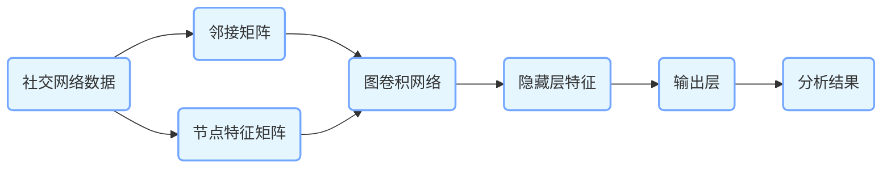

# 基于图卷积网络的社交网络分析AI系统

> 关键词：图卷积网络、社交网络分析、AI系统、图数据、深度学习

> 摘要：本文深入探讨了基于图卷积网络（GCN）的社交网络分析AI系统。首先介绍了该研究的背景，包括目的、预期读者、文档结构和相关术语。接着阐述了图卷积网络和社交网络分析的核心概念及其联系，并给出了原理和架构的文本示意图与Mermaid流程图。详细讲解了图卷积网络的核心算法原理，结合Python代码进行说明，同时给出了相关的数学模型和公式并举例。通过项目实战，展示了开发环境搭建、源代码实现和代码解读。分析了该系统在实际中的应用场景，推荐了学习资源、开发工具框架和相关论文著作。最后总结了未来发展趋势与挑战，并提供了常见问题解答和扩展阅读参考资料，旨在为相关领域的研究和实践提供全面且深入的指导。

## 1. 背景介绍 

### 1.1 目的和范围
社交网络在当今社会中扮演着至关重要的角色，它不仅改变了人们的沟通和交流方式，还蕴含着丰富的信息和潜在的价值。基于图卷积网络的社交网络分析AI系统的主要目的是对社交网络中的复杂关系和信息进行有效挖掘和分析。通过图卷积网络强大的特征提取和学习能力，能够深入理解社交网络中节点（用户）之间的连接关系以及节点的属性特征，从而实现诸如用户行为预测、社区发现、信息传播分析等多种社交网络分析任务。

本系统的范围涵盖了从社交网络数据的收集、预处理，到图卷积网络模型的构建、训练和优化，再到最终的分析结果展示和应用。我们将重点关注如何利用图卷积网络对社交网络数据进行建模和分析，同时也会考虑系统的可扩展性和实用性，以便在不同规模和类型的社交网络中应用。

### 1.2 预期读者
本文预期读者包括但不限于计算机科学、人工智能、数据挖掘等领域的研究人员和学者，他们可以从本文中获取关于图卷积网络在社交网络分析中的最新研究成果和技术方法，为自己的研究提供参考和启发。同时，软件开发人员和工程师也可以从中学习到如何构建基于图卷积网络的社交网络分析AI系统的具体实现步骤和技术细节，以便在实际项目中应用。此外，对社交网络分析和人工智能感兴趣的爱好者也可以通过本文了解相关的基本概念和技术原理。

### 1.3 文档结构概述
本文将按照以下结构进行组织：
1. **背景介绍**：介绍基于图卷积网络的社交网络分析AI系统的目的、范围、预期读者和文档结构，同时给出相关术语的定义和解释。
2. **核心概念与联系**：阐述图卷积网络和社交网络分析的核心概念，以及它们之间的联系，通过文本示意图和Mermaid流程图进行直观展示。
3. **核心算法原理 & 具体操作步骤**：详细讲解图卷积网络的核心算法原理，结合Python代码给出具体的操作步骤。
4. **数学模型和公式 & 详细讲解 & 举例说明**：给出图卷积网络的数学模型和公式，并进行详细讲解，通过具体例子加深理解。
5. **项目实战：代码实际案例和详细解释说明**：通过一个实际的项目案例，展示基于图卷积网络的社交网络分析AI系统的开发过程，包括开发环境搭建、源代码实现和代码解读。
6. **实际应用场景**：分析基于图卷积网络的社交网络分析AI系统在实际中的应用场景，如用户行为预测、社区发现、信息传播分析等。
7. **工具和资源推荐**：推荐学习图卷积网络和社交网络分析的相关资源，包括书籍、在线课程、技术博客和网站，以及开发工具框架和相关论文著作。
8. **总结：未来发展趋势与挑战**：总结基于图卷积网络的社交网络分析AI系统的未来发展趋势和面临的挑战。
9. **附录：常见问题与解答**：解答读者在学习和实践过程中可能遇到的常见问题。
10. **扩展阅读 & 参考资料**：提供扩展阅读的建议和相关的参考资料。

### 1.4 术语表

#### 1.4.1 核心术语定义
- **图卷积网络（Graph Convolutional Network，GCN）**：一种专门用于处理图结构数据的深度学习模型，通过在图上进行卷积操作，能够有效提取图中节点和边的特征信息。
- **社交网络（Social Network）**：由节点（用户）和边（用户之间的关系）组成的图结构，用于表示人与人之间的社交关系，如朋友关系、关注关系等。
- **节点（Node）**：在社交网络中，节点表示用户或实体，每个节点可以有自己的属性，如年龄、性别、兴趣爱好等。
- **边（Edge）**：表示节点之间的关系，边可以是有向的或无向的，并且可以有不同的权重，用于表示关系的强度。
- **邻接矩阵（Adjacency Matrix）**：用于表示图中节点之间连接关系的矩阵，矩阵的元素表示节点之间是否存在边以及边的权重。
- **特征矩阵（Feature Matrix）**：用于表示图中节点属性特征的矩阵，矩阵的每一行表示一个节点的特征向量。

#### 1.4.2 相关概念解释
- **图数据**：图数据是一种非欧几里得数据，与传统的欧几里得数据（如图像、文本等）不同，图数据中的节点和边之间存在复杂的拓扑结构和关系。社交网络就是一种典型的图数据。
- **卷积操作**：在传统的卷积神经网络（CNN）中，卷积操作是在欧几里得空间中进行的，通过卷积核在图像上滑动来提取特征。而在图卷积网络中，卷积操作是在图结构上进行的，通过聚合节点的邻居信息来更新节点的特征。
- **深度学习**：一种基于人工神经网络的机器学习方法，通过多层神经网络的堆叠和训练，能够自动学习数据中的复杂特征和模式。图卷积网络是深度学习在图数据领域的应用。

#### 1.4.3 缩略词列表
- **GCN**：Graph Convolutional Network（图卷积网络）
- **CNN**：Convolutional Neural Network（卷积神经网络）
- **MLP**：Multi - Layer Perceptron（多层感知机）

## 2. 核心概念与联系 

### 2.1 图卷积网络核心概念
图卷积网络（GCN）是一种专门为处理图结构数据而设计的深度学习模型。传统的深度学习模型，如卷积神经网络（CNN）主要用于处理欧几里得结构的数据，如图像和音频。而社交网络数据是一种典型的图结构数据，节点代表用户，边代表用户之间的关系。GCN通过在图上进行卷积操作，能够有效地提取图中节点和边的特征信息。

GCN的核心思想是通过聚合节点的邻居信息来更新节点的特征。具体来说，每个节点的新特征是由其自身特征和邻居节点的特征加权求和得到的。这种聚合操作可以看作是一种信息传播过程，通过多次迭代，可以让节点的特征逐渐包含其邻域的信息。

### 2.2 社交网络分析核心概念
社交网络分析是对社交网络中节点（用户）和边（关系）进行研究和分析的领域。其主要目标包括发现社交网络中的社区结构、预测用户的行为、分析信息的传播路径等。社交网络分析可以帮助我们理解社交网络的结构和动态，从而为市场营销、推荐系统、舆情监测等应用提供支持。

### 2.3 核心概念联系
图卷积网络为社交网络分析提供了一种强大的工具。社交网络的图结构数据可以自然地作为GCN的输入，GCN可以自动学习社交网络中节点和边的特征表示。通过对这些特征表示的分析，可以实现社交网络分析的各种任务。例如，通过对节点特征的聚类分析，可以发现社交网络中的社区结构；通过对节点特征的分类预测，可以预测用户的行为。

### 2.4 原理和架构的文本示意图
图卷积网络的基本架构可以分为输入层、隐藏层和输出层。输入层接收社交网络的邻接矩阵和节点特征矩阵作为输入。隐藏层包含多个图卷积层，每个图卷积层通过聚合邻居信息更新节点的特征。输出层根据具体的任务输出相应的结果，如节点分类结果、社区划分结果等。

### 2.5 Mermaid流程图


## 3. 核心算法原理 & 具体操作步骤 

### 3.1 图卷积网络核心算法原理
图卷积网络的核心是图卷积层，其主要作用是聚合节点的邻居信息来更新节点的特征。下面我们详细介绍图卷积层的算法原理。

设 $X$ 是节点的特征矩阵，形状为 $N \times D$，其中 $N$ 是节点的数量，$D$ 是每个节点的特征维度。$A$ 是图的邻接矩阵，形状为 $N \times N$。图卷积层的输出 $H^{(l+1)}$ 可以通过以下公式计算：

$$
H^{(l+1)} = \sigma\left(\tilde{D}^{-\frac{1}{2}}\tilde{A}\tilde{D}^{-\frac{1}{2}}H^{(l)}W^{(l)}\right)
$$

其中：
- $\tilde{A} = A + I$，$I$ 是单位矩阵，这一步是为了将节点自身的信息也考虑到聚合过程中。
- $\tilde{D}$ 是 $\tilde{A}$ 的度矩阵，即 $\tilde{D}_{ii}=\sum_{j}\tilde{A}_{ij}$。
- $H^{(l)}$ 是第 $l$ 层的节点特征矩阵。
- $W^{(l)}$ 是第 $l$ 层的可学习权重矩阵，形状为 $D^{(l)} \times D^{(l+1)}$，其中 $D^{(l)}$ 和 $D^{(l+1)}$ 分别是第 $l$ 层和第 $l+1$ 层的特征维度。
- $\sigma$ 是激活函数，如ReLU函数。

### 3.2 具体操作步骤及Python代码实现
下面我们使用Python和PyTorch库来实现一个简单的图卷积层。

```python
import torch
import torch.nn as nn
import torch.nn.functional as F

class GraphConvolution(nn.Module):
    def __init__(self, in_features, out_features):
        super(GraphConvolution, self).__init__()
        self.weight = nn.Parameter(torch.FloatTensor(in_features, out_features))
        self.reset_parameters()

    def reset_parameters(self):
        nn.init.xavier_uniform_(self.weight)

    def forward(self, input, adj):
        support = torch.mm(input, self.weight)
        output = torch.spmm(adj, support)
        return output

class GCN(nn.Module):
    def __init__(self, nfeat, nhid, nclass):
        super(GCN, self).__init__()
        self.gc1 = GraphConvolution(nfeat, nhid)
        self.gc2 = GraphConvolution(nhid, nclass)

    def forward(self, x, adj):
        x = F.relu(self.gc1(x, adj))
        x = self.gc2(x, adj)
        return F.log_softmax(x, dim=1)
```

### 3.3 代码解释
- `GraphConvolution` 类实现了一个图卷积层。在 `__init__` 方法中，我们定义了可学习的权重矩阵 `self.weight`，并使用 `reset_parameters` 方法对其进行初始化。在 `forward` 方法中，我们首先计算 `input` 与 `self.weight` 的矩阵乘法，然后计算邻接矩阵 `adj` 与结果的稀疏矩阵乘法。
- `GCN` 类实现了一个简单的两层图卷积网络。在 `__init__` 方法中，我们定义了两个图卷积层 `gc1` 和 `gc2`。在 `forward` 方法中，我们首先将输入通过 `gc1` 层并应用ReLU激活函数，然后将结果通过 `gc2` 层，最后应用 `log_softmax` 函数进行分类。

## 4. 数学模型和公式 & 详细讲解 & 举例说明 

### 4.1 图卷积网络数学模型和公式
图卷积网络的核心公式为：

$$
H^{(l+1)} = \sigma\left(\tilde{D}^{-\frac{1}{2}}\tilde{A}\tilde{D}^{-\frac{1}{2}}H^{(l)}W^{(l)}\right)
$$

下面我们详细讲解这个公式的各个部分：

- **$\tilde{A} = A + I$**：邻接矩阵 $A$ 表示图中节点之间的连接关系，$I$ 是单位矩阵。将 $A$ 加上 $I$ 是为了将节点自身的信息也考虑到聚合过程中。例如，如果一个节点没有邻居，那么在聚合过程中，它的特征更新就只依赖于自身的特征。

- **$\tilde{D}$ 是 $\tilde{A}$ 的度矩阵**：度矩阵 $\tilde{D}$ 是一个对角矩阵，其对角元素 $\tilde{D}_{ii}$ 表示节点 $i$ 的度，即与节点 $i$ 相连的边的数量。$\tilde{D}^{-\frac{1}{2}}$ 是 $\tilde{D}$ 的逆平方根矩阵，它的作用是对邻居节点的特征进行归一化，避免在聚合过程中某些节点的特征因为度大而占据主导地位。

- **$H^{(l)}$ 是第 $l$ 层的节点特征矩阵**：$H^{(l)}$ 的每一行表示一个节点在第 $l$ 层的特征向量。

- **$W^{(l)}$ 是第 $l$ 层的可学习权重矩阵**：$W^{(l)}$ 的作用是对输入的特征进行线性变换，使得图卷积网络能够学习到不同特征之间的关系。

- **$\sigma$ 是激活函数**：激活函数的作用是引入非线性因素，使得图卷积网络能够学习到更复杂的特征表示。常用的激活函数有ReLU函数、Sigmoid函数等。

### 4.2 详细讲解
图卷积网络的核心思想是通过聚合节点的邻居信息来更新节点的特征。在公式中，$\tilde{D}^{-\frac{1}{2}}\tilde{A}\tilde{D}^{-\frac{1}{2}}$ 表示对邻居节点的特征进行归一化和聚合的操作，$H^{(l)}W^{(l)}$ 表示对输入的特征进行线性变换，$\sigma$ 函数引入非线性因素。

通过多次迭代图卷积层，可以让节点的特征逐渐包含其邻域的信息，从而实现对图结构数据的特征提取和学习。

### 4.3 举例说明
假设我们有一个简单的图，包含3个节点，节点的特征矩阵 $X$ 为：

$$
X = \begin{bmatrix}
1 & 2 \\
3 & 4 \\
5 & 6
\end{bmatrix}
$$

邻接矩阵 $A$ 为：

$$
A = \begin{bmatrix}
0 & 1 & 0 \\
1 & 0 & 1 \\
0 & 1 & 0
\end{bmatrix}
$$

首先，我们计算 $\tilde{A} = A + I$：

$$
\tilde{A} = \begin{bmatrix}
1 & 1 & 0 \\
1 & 1 & 1 \\
0 & 1 & 1
\end{bmatrix}
$$

然后，计算 $\tilde{D}$：

$$
\tilde{D} = \begin{bmatrix}
2 & 0 & 0 \\
0 & 3 & 0 \\
0 & 0 & 2
\end{bmatrix}
$$

$\tilde{D}^{-\frac{1}{2}}$ 为：

$$
\tilde{D}^{-\frac{1}{2}} = \begin{bmatrix}
\frac{1}{\sqrt{2}} & 0 & 0 \\
0 & \frac{1}{\sqrt{3}} & 0 \\
0 & 0 & \frac{1}{\sqrt{2}}
\end{bmatrix}
$$

假设我们有一个可学习的权重矩阵 $W$ 为：

$$
W = \begin{bmatrix}
0.1 & 0.2 \\
0.3 & 0.4
\end{bmatrix}
$$

首先计算 $H^{(0)}W$：

$$
H^{(0)}W = \begin{bmatrix}
1 & 2 \\
3 & 4 \\
5 & 6
\end{bmatrix}
\begin{bmatrix}
0.1 & 0.2 \\
0.3 & 0.4
\end{bmatrix}
= \begin{bmatrix}
0.7 & 1 \\
1.5 & 2.2 \\
2.3 & 3.4
\end{bmatrix}
$$

然后计算 $\tilde{D}^{-\frac{1}{2}}\tilde{A}\tilde{D}^{-\frac{1}{2}}$：

$$
\tilde{D}^{-\frac{1}{2}}\tilde{A}\tilde{D}^{-\frac{1}{2}} = \begin{bmatrix}
\frac{1}{\sqrt{2}} & 0 & 0 \\
0 & \frac{1}{\sqrt{3}} & 0 \\
0 & 0 & \frac{1}{\sqrt{2}}
\end{bmatrix}
\begin{bmatrix}
1 & 1 & 0 \\
1 & 1 & 1 \\
0 & 1 & 1
\end{bmatrix}
\begin{bmatrix}
\frac{1}{\sqrt{2}} & 0 & 0 \\
0 & \frac{1}{\sqrt{3}} & 0 \\
0 & 0 & \frac{1}{\sqrt{2}}
\end{bmatrix}
= \begin{bmatrix}
\frac{1}{2} & \frac{1}{\sqrt{6}} & 0 \\
\frac{1}{\sqrt{6}} & \frac{1}{3} & \frac{1}{\sqrt{6}} \\
0 & \frac{1}{\sqrt{6}} & \frac{1}{2}
\end{bmatrix}
$$

最后计算 $H^{(1)} = \tilde{D}^{-\frac{1}{2}}\tilde{A}\tilde{D}^{-\frac{1}{2}}H^{(0)}W$：

$$
H^{(1)} = \begin{bmatrix}
\frac{1}{2} & \frac{1}{\sqrt{6}} & 0 \\
\frac{1}{\sqrt{6}} & \frac{1}{3} & \frac{1}{\sqrt{6}} \\
0 & \frac{1}{\sqrt{6}} & \frac{1}{2}
\end{bmatrix}
\begin{bmatrix}
0.7 & 1 \\
1.5 & 2.2 \\
2.3 & 3.4
\end{bmatrix}
$$

通过以上计算，我们得到了节点在第一层图卷积层后的特征矩阵 $H^{(1)}$。

## 5. 项目实战：代码实际案例和详细解释说明 

### 5.1 开发环境搭建
在进行基于图卷积网络的社交网络分析AI系统的开发之前，我们需要搭建相应的开发环境。以下是具体的步骤：

#### 5.1.1 安装Python
首先，我们需要安装Python。建议使用Python 3.6及以上版本。可以从Python官方网站（https://www.python.org/downloads/）下载并安装Python。

#### 5.1.2 安装深度学习框架
我们选择使用PyTorch作为深度学习框架。可以通过以下命令安装PyTorch：

```bash
pip install torch torchvision
```

#### 5.1.3 安装其他依赖库
除了PyTorch，我们还需要安装一些其他的依赖库，如`numpy`、`scipy`、`networkx`等。可以通过以下命令安装：

```bash
pip install numpy scipy networkx
```

### 5.2 源代码详细实现和代码解读
以下是一个完整的基于图卷积网络的社交网络节点分类项目的代码实现：

```python
import torch
import torch.nn as nn
import torch.nn.functional as F
import numpy as np
import scipy.sparse as sp
import networkx as nx

# 数据预处理函数
def normalize_adj(adj):
    """对称归一化邻接矩阵"""
    adj = sp.coo_matrix(adj)
    rowsum = np.array(adj.sum(1))
    d_inv_sqrt = np.power(rowsum, -0.5).flatten()
    d_inv_sqrt[np.isinf(d_inv_sqrt)] = 0.
    d_mat_inv_sqrt = sp.diags(d_inv_sqrt)
    return adj.dot(d_mat_inv_sqrt).transpose().dot(d_mat_inv_sqrt).tocoo()

def sparse_mx_to_torch_sparse_tensor(sparse_mx):
    """将稀疏矩阵转换为PyTorch稀疏张量"""
    sparse_mx = sparse_mx.tocoo().astype(np.float32)
    indices = torch.from_numpy(
        np.vstack((sparse_mx.row, sparse_mx.col)).astype(np.int64))
    values = torch.from_numpy(sparse_mx.data)
    shape = torch.Size(sparse_mx.shape)
    return torch.sparse.FloatTensor(indices, values, shape)

# 图卷积层
class GraphConvolution(nn.Module):
    def __init__(self, in_features, out_features):
        super(GraphConvolution, self).__init__()
        self.weight = nn.Parameter(torch.FloatTensor(in_features, out_features))
        self.reset_parameters()

    def reset_parameters(self):
        nn.init.xavier_uniform_(self.weight)

    def forward(self, input, adj):
        support = torch.mm(input, self.weight)
        output = torch.spmm(adj, support)
        return output

# 图卷积网络模型
class GCN(nn.Module):
    def __init__(self, nfeat, nhid, nclass):
        super(GCN, self).__init__()
        self.gc1 = GraphConvolution(nfeat, nhid)
        self.gc2 = GraphConvolution(nhid, nclass)

    def forward(self, x, adj):
        x = F.relu(self.gc1(x, adj))
        x = self.gc2(x, adj)
        return F.log_softmax(x, dim=1)

# 加载数据
def load_data():
    # 创建一个简单的社交网络图
    G = nx.karate_club_graph()
    adj = nx.adjacency_matrix(G)
    features = np.eye(G.number_of_nodes())  # 节点特征矩阵，初始化为单位矩阵
    labels = np.array([0 if data['club'] == 'Mr. Hi' else 1 for _, data in G.nodes(data=True)])

    # 数据预处理
    adj = normalize_adj(adj + sp.eye(adj.shape[0]))
    features = torch.FloatTensor(features)
    labels = torch.LongTensor(labels)
    adj = sparse_mx_to_torch_sparse_tensor(adj)

    # 划分训练集和测试集
    idx_train = range(20)
    idx_test = range(20, 34)
    idx_train = torch.LongTensor(idx_train)
    idx_test = torch.LongTensor(idx_test)

    return features, adj, labels, idx_train, idx_test

# 训练模型
def train(model, features, adj, labels, idx_train, idx_test, epochs=200, lr=0.01, weight_decay=5e-4):
    optimizer = torch.optim.Adam(model.parameters(), lr=lr, weight_decay=weight_decay)

    for epoch in range(epochs):
        model.train()
        optimizer.zero_grad()
        output = model(features, adj)
        loss_train = F.nll_loss(output[idx_train], labels[idx_train])
        loss_train.backward()
        optimizer.step()

        model.eval()
        output = model(features, adj)
        loss_test = F.nll_loss(output[idx_test], labels[idx_test])
        acc_test = accuracy(output[idx_test], labels[idx_test])
        print(f'Epoch: {epoch+1}, Train Loss: {loss_train.item()}, Test Loss: {loss_test.item()}, Test Acc: {acc_test.item()}')

# 计算准确率
def accuracy(output, labels):
    preds = output.max(1)[1].type_as(labels)
    correct = preds.eq(labels).double()
    correct = correct.sum()
    return correct / len(labels)

# 主函数
if __name__ == "__main__":
    features, adj, labels, idx_train, idx_test = load_data()
    model = GCN(nfeat=features.shape[1], nhid=16, nclass=2)
    train(model, features, adj, labels, idx_train, idx_test)
```

### 5.3 代码解读与分析
#### 5.3.1 数据预处理部分
- `normalize_adj` 函数：对邻接矩阵进行对称归一化处理，使得邻居节点的特征在聚合过程中具有相同的重要性。
- `sparse_mx_to_torch_sparse_tensor` 函数：将稀疏矩阵转换为PyTorch的稀疏张量，以便在PyTorch中进行计算。

#### 5.3.2 图卷积层和图卷积网络模型
- `GraphConvolution` 类：实现了一个图卷积层，通过矩阵乘法和稀疏矩阵乘法实现邻居信息的聚合。
- `GCN` 类：实现了一个简单的两层图卷积网络，包含两个图卷积层和ReLU激活函数。

#### 5.3.3 数据加载部分
- `load_data` 函数：加载社交网络数据，使用 `networkx` 库创建一个简单的社交网络图（Zachary空手道俱乐部图），并进行数据预处理和训练集、测试集的划分。

#### 5.3.4 训练部分
- `train` 函数：使用Adam优化器对图卷积网络模型进行训练，计算训练损失和测试损失，并输出测试准确率。

#### 5.3.5 准确率计算部分
- `accuracy` 函数：计算模型的准确率，通过比较预测结果和真实标签来计算正确预测的比例。

## 6. 实际应用场景 
### 6.1 用户行为预测
基于图卷积网络的社交网络分析AI系统可以用于预测用户的行为。例如，在社交媒体平台上，可以通过分析用户的社交关系和历史行为数据，预测用户是否会点赞、评论或分享某条内容。通过图卷积网络学习到的节点特征可以表示用户的兴趣和偏好，结合用户的社交网络结构，可以更准确地预测用户的行为。

### 6.2 社区发现
社区发现是社交网络分析的一个重要任务，它可以帮助我们发现社交网络中具有紧密联系的用户群体。图卷积网络可以通过学习节点的特征和图的结构信息，将节点划分为不同的社区。例如，在一个在线社交网络中，可以发现不同的兴趣小组、行业圈子等。

### 6.3 信息传播分析
在社交网络中，信息的传播是一个重要的现象。图卷积网络可以用于分析信息在社交网络中的传播路径和传播速度。通过对节点特征和图结构的学习，可以预测信息在哪些节点之间更容易传播，以及信息的传播范围和影响力。

### 6.4 推荐系统
基于图卷积网络的社交网络分析AI系统可以为推荐系统提供支持。例如，在电商平台上，可以通过分析用户的社交关系和购买历史，为用户推荐符合其兴趣的商品。图卷积网络可以学习到用户之间的相似性和商品之间的相关性，从而提高推荐系统的准确性和个性化程度。

### 6.5 舆情监测
在社交媒体和新闻平台上，舆情监测是一个重要的任务。图卷积网络可以用于分析社交网络中用户的言论和情绪，监测舆情的发展趋势。通过对节点特征和图结构的学习，可以发现舆情的热点话题和传播路径，及时采取措施进行应对。

## 7. 工具和资源推荐

### 7.1 学习资源推荐

#### 7.1.1 书籍推荐
- 《深度学习》（Deep Learning）：由Ian Goodfellow、Yoshua Bengio和Aaron Courville所著，是深度学习领域的经典教材，涵盖了深度学习的基本概念、算法和应用。
- 《图神经网络：基础、前沿与应用》：系统介绍了图神经网络的基本原理、算法和应用，对于学习图卷积网络在社交网络分析中的应用有很大的帮助。
- 《社交网络分析：方法与应用》：详细介绍了社交网络分析的方法和技术，包括图论、统计学等方面的知识。

#### 7.1.2 在线课程
- Coursera上的“Deep Learning Specialization”：由Andrew Ng教授授课，涵盖了深度学习的各个方面，包括卷积神经网络、循环神经网络等。
- edX上的“Graph Neural Networks”：专门介绍图神经网络的原理和应用，适合对图卷积网络感兴趣的学习者。
- 哔哩哔哩上有很多关于深度学习和社交网络分析的教程视频，可以根据自己的需求进行选择。

#### 7.1.3 技术博客和网站
- Medium：上面有很多关于深度学习和图卷积网络的技术博客文章，作者来自不同的领域和公司，分享了他们的研究成果和实践经验。
- arXiv：一个预印本论文库，上面有很多关于图卷积网络和社交网络分析的最新研究论文。
- 开源中国、CSDN等国内技术博客网站也有很多关于深度学习和社交网络分析的文章，可以作为学习的参考。

### 7.2 开发工具框架推荐

#### 7.2.1 IDE和编辑器
- PyCharm：一款专业的Python集成开发环境，具有代码编辑、调试、版本控制等功能，适合开发基于Python的深度学习项目。
- Jupyter Notebook：一个交互式的开发环境，可以方便地进行代码编写、运行和可视化，适合进行数据探索和模型实验。
- Visual Studio Code：一款轻量级的代码编辑器，支持多种编程语言和插件，具有丰富的扩展功能。

#### 7.2.2 调试和性能分析工具
- PyTorch Profiler：PyTorch自带的性能分析工具，可以帮助我们分析模型的运行时间和内存使用情况，找出性能瓶颈。
- TensorBoard：一个可视化工具，可以用于可视化模型的训练过程、损失曲线、准确率等信息，方便我们进行模型调优。
- NVIDIA Nsight Systems：一款用于GPU性能分析的工具，可以帮助我们优化模型在GPU上的运行效率。

#### 7.2.3 相关框架和库
- PyTorch Geometric：一个基于PyTorch的图神经网络库，提供了丰富的图神经网络模型和工具，方便我们进行图卷积网络的开发。
- DGL（Deep Graph Library）：一个用于图神经网络的深度学习框架，支持多种深度学习框架（如PyTorch、TensorFlow等），具有高效的图计算能力。
- NetworkX：一个用于创建、操作和研究复杂网络的Python库，可以用于社交网络数据的处理和分析。

### 7.3 相关论文著作推荐

#### 7.3.1 经典论文
- “Semi-Supervised Classification with Graph Convolutional Networks”：由Thomas N. Kipf和Max Welling发表，是图卷积网络领域的经典论文，提出了一种简单而有效的图卷积网络模型。
- “Graph Attention Networks”：提出了图注意力网络（GAT），通过引入注意力机制，提高了图卷积网络的性能。
- “Inductive Representation Learning on Large Graphs”：提出了GraphSAGE模型，解决了图卷积网络在大规模图数据上的归纳学习问题。

#### 7.3.2 最新研究成果
可以通过arXiv、ACM Digital Library、IEEE Xplore等学术数据库搜索关于图卷积网络和社交网络分析的最新研究成果。关注一些顶级学术会议，如NeurIPS、ICML、KDD等，这些会议上会有很多关于图卷积网络和社交网络分析的最新研究论文。

#### 7.3.3 应用案例分析
可以在ACM SIGKDD、IEEE ICDM等数据挖掘领域的会议和期刊上找到很多关于图卷积网络在社交网络分析中的应用案例分析。这些案例分析可以帮助我们了解图卷积网络在实际应用中的问题和解决方案。

## 8. 总结：未来发展趋势与挑战

### 8.1 未来发展趋势

#### 8.1.1 模型的改进和创新
未来，图卷积网络的模型将不断改进和创新。例如，引入更复杂的注意力机制、结合其他深度学习模型（如循环神经网络、生成对抗网络等），以提高模型的性能和表达能力。同时，研究人员也会探索新的图卷积操作和网络架构，以更好地处理不同类型的图数据。

#### 8.1.2 大规模图数据处理
随着社交网络的不断发展，图数据的规模越来越大。未来的图卷积网络需要能够高效地处理大规模图数据，解决内存和计算资源的瓶颈问题。例如，研究分布式图卷积网络、图采样技术等，以提高模型的可扩展性和训练效率。

#### 8.1.3 跨领域应用
图卷积网络在社交网络分析中的应用将不断拓展到其他领域，如生物信息学、交通网络分析、金融风险管理等。通过将图卷积网络与不同领域的知识和数据相结合，可以挖掘出更多有价值的信息和模式。

#### 8.1.4 与其他技术的融合
图卷积网络将与其他技术（如自然语言处理、计算机视觉等）进行更深入的融合。例如，在社交网络分析中，可以结合自然语言处理技术对用户的文本信息进行分析，结合计算机视觉技术对用户的图像信息进行处理，以提高分析的准确性和全面性。

### 8.2 挑战

#### 8.2.1 数据质量和隐私问题
社交网络数据往往存在噪声、缺失值和不一致性等问题，这些问题会影响图卷积网络的性能。同时，社交网络数据涉及用户的隐私信息，如何在保护用户隐私的前提下进行有效的数据分析是一个重要的挑战。

#### 8.2.2 模型解释性问题
图卷积网络是一种深度学习模型，其内部的决策过程往往是复杂和难以解释的。在一些应用场景中，如金融风险评估、医疗诊断等，模型的解释性是非常重要的。如何提高图卷积网络的解释性是未来需要解决的一个问题。

#### 8.2.3 计算资源和时间成本
图卷积网络的训练和推理过程往往需要大量的计算资源和时间。对于大规模图数据，训练一个复杂的图卷积网络模型可能需要很长的时间和昂贵的计算设备。如何降低计算资源和时间成本是一个亟待解决的问题。

#### 8.2.4 对抗攻击问题
图卷积网络容易受到对抗攻击的影响，即攻击者可以通过对图数据进行微小的扰动来误导模型的预测结果。如何提高图卷积网络的鲁棒性，抵御对抗攻击是未来研究的一个重要方向。

## 9. 附录：常见问题与解答

### 9.1 图卷积网络与传统卷积神经网络有什么区别？
传统卷积神经网络（CNN）主要用于处理欧几里得结构的数据，如图像和音频。在CNN中，卷积操作是在规则的网格结构上进行的，卷积核在图像上滑动来提取特征。而图卷积网络（GCN）用于处理图结构数据，图数据中的节点和边之间存在复杂的拓扑结构和关系。在GCN中，卷积操作是在图上进行的，通过聚合节点的邻居信息来更新节点的特征。

### 9.2 如何选择合适的图卷积网络模型？
选择合适的图卷积网络模型需要考虑多个因素，如数据的规模、图的结构、任务的类型等。对于小规模图数据，可以选择简单的图卷积网络模型，如两层的GCN。对于大规模图数据，可以选择具有更好可扩展性的模型，如GraphSAGE。对于需要考虑节点之间重要性差异的任务，可以选择引入注意力机制的模型，如图注意力网络（GAT）。

### 9.3 图卷积网络的训练过程中需要注意什么？
在图卷积网络的训练过程中，需要注意以下几点：
- **数据预处理**：对图数据进行预处理，如邻接矩阵的归一化、特征矩阵的标准化等，以提高模型的训练效果。
- **超参数调整**：选择合适的超参数，如学习率、权重衰减、隐藏层维度等，可以通过网格搜索、随机搜索等方法进行超参数调优。
- **防止过拟合**：可以使用正则化方法（如L2正则化）、Dropout等技术来防止模型过拟合。
- **训练时间和计算资源**：图卷积网络的训练过程可能需要较长的时间和大量的计算资源，需要合理安排训练时间和使用合适的计算设备。

### 9.4 图卷积网络可以处理有向图和加权图吗？
可以。图卷积网络可以处理有向图和加权图。对于有向图，邻接矩阵不再是对称矩阵，在进行邻接矩阵归一化时需要考虑有向边的方向。对于加权图，邻接矩阵的元素可以表示边的权重，在聚合邻居信息时可以根据边的权重进行加权求和。

### 9.5 如何评估图卷积网络的性能？
评估图卷积网络的性能需要根据具体的任务选择合适的评估指标。对于节点分类任务，可以使用准确率、召回率、F1值等指标；对于图分类任务，可以使用准确率、AUC值等指标；对于链接预测任务，可以使用ROC曲线下面积（AUC）、平均精度均值（MAP）等指标。同时，还可以使用交叉验证等方法来评估模型的泛化能力。

## 10. 扩展阅读 & 参考资料

### 10.1 扩展阅读
- 《图论及其应用》：深入学习图论的基础知识，对于理解图卷积网络的原理和应用有很大的帮助。
- 《深度学习进阶：算法与应用》：介绍了深度学习的一些高级算法和应用，包括图神经网络的相关内容。
- 《社交网络挖掘：模型与算法》：详细介绍了社交网络挖掘的方法和技术，包括图卷积网络在社交网络挖掘中的应用。

### 10.2 参考资料
- Kipf, T. N., & Welling, M. (2016). Semi-Supervised Classification with Graph Convolutional Networks. arXiv preprint arXiv:1609.02907.
- Veličković, P., Cucurull, G., Casanova, A., Romero, A., Lio, P., & Bengio, Y. (2017). Graph Attention Networks. arXiv preprint arXiv:1710.10903.
- Hamilton, W. L., Ying, Z., & Leskovec, J. (2017). Inductive Representation Learning on Large Graphs. Advances in Neural Information Processing Systems.

通过以上的文章，我们全面深入地探讨了基于图卷积网络的社交网络分析AI系统，从核心概念、算法原理到实际应用和未来发展趋势，希望能够为相关领域的研究和实践提供有价值的参考。