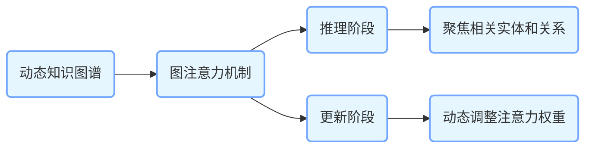

# 基于图注意力的动态知识图谱推理更新机制研究

> 关键词：图注意力机制；动态知识图谱；推理更新机制；知识表示；深度学习

> 摘要：本文聚焦于基于图注意力的动态知识图谱推理更新机制。随着知识图谱在信息检索、智能问答等领域的广泛应用，其动态性特征愈发重要。传统知识图谱难以适应实时变化的信息，而基于图注意力的推理更新机制能够有效捕捉知识图谱中实体和关系的动态变化，实现高效准确的知识推理与更新。文章首先介绍了研究的背景和相关概念，接着详细阐述了核心算法原理、数学模型，通过项目实战展示了具体的代码实现与分析，探讨了实际应用场景，推荐了相关工具和资源，最后对未来发展趋势与挑战进行了总结，并提供了常见问题解答和扩展阅读参考资料。

## 1. 背景介绍 
### 1.1 目的和范围
知识图谱作为一种强大的知识表示和管理工具，在众多领域发挥着重要作用。然而，现实世界中的知识是不断变化和发展的，传统的静态知识图谱无法及时反映这些动态变化。本研究的目的在于构建一种基于图注意力的动态知识图谱推理更新机制，以实现对知识图谱的实时更新和高效推理。研究范围涵盖了图注意力机制在动态知识图谱中的应用、推理算法的设计、更新策略的制定以及相关技术的实现。

### 1.2 预期读者
本文预期读者包括人工智能、计算机科学等领域的研究人员、开发者，以及对知识图谱技术感兴趣的从业者。对于正在从事知识图谱相关项目的人员，本文提供了具体的技术实现方案和实践经验；对于研究人员，本文则为进一步探索动态知识图谱的理论和方法提供了参考。

### 1.3 文档结构概述
本文将按照以下结构进行组织：首先介绍相关核心概念及其联系，包括图注意力机制、动态知识图谱等；接着详细阐述核心算法原理和具体操作步骤，并结合Python代码进行说明；然后介绍数学模型和公式，并通过举例进行详细讲解；之后通过项目实战展示代码实际案例和详细解释；再探讨实际应用场景；推荐相关的工具和资源；最后总结未来发展趋势与挑战，提供常见问题解答和扩展阅读参考资料。

### 1.4 术语表
#### 1.4.1 核心术语定义
- **知识图谱**：一种用图结构来表示知识和语义关系的技术，由实体、关系和属性组成。
- **动态知识图谱**：能够实时反映知识的动态变化，不断更新和扩展的知识图谱。
- **图注意力机制**：一种用于图数据的注意力机制，能够自动学习节点之间的重要性权重。
- **知识推理**：根据已有的知识图谱信息，推断出新的知识和关系。
- **知识更新**：对知识图谱中的实体、关系和属性进行实时更新和修正。

#### 1.4.2 相关概念解释
- **注意力机制**：在深度学习中，注意力机制用于模拟人类的注意力分配，能够自动聚焦于重要的信息。
- **图神经网络**：一种专门处理图数据的神经网络，能够学习图的结构和特征。
- **知识表示学习**：将知识图谱中的实体和关系表示为低维向量，以便于计算机处理。

#### 1.4.3 缩略词列表
- **GAT**：Graph Attention Network（图注意力网络）
- **KG**：Knowledge Graph（知识图谱）
- **DKG**：Dynamic Knowledge Graph（动态知识图谱）

## 2. 核心概念与联系 

### 2.1 动态知识图谱
动态知识图谱是传统知识图谱的扩展，它能够随着时间的推移和新信息的出现，实时更新和扩展知识。动态知识图谱中的实体和关系具有时间属性，能够反映知识的动态变化过程。例如，在一个新闻事件的知识图谱中，事件的发展、相关人物的状态变化等都可以通过动态知识图谱进行实时跟踪和表示。

### 2.2 图注意力机制
图注意力机制是一种用于图数据的注意力机制，它能够自动学习节点之间的重要性权重。在图注意力网络（GAT）中，每个节点会根据其邻居节点的特征和连接关系，计算出一个注意力权重，用于表示邻居节点对该节点的重要性。通过这种方式，图注意力机制能够有效地捕捉图的局部和全局结构信息。

### 2.3 图注意力机制与动态知识图谱的联系
图注意力机制可以应用于动态知识图谱的推理和更新过程中。在推理阶段，图注意力机制可以帮助模型聚焦于与推理任务相关的实体和关系，提高推理的准确性。在更新阶段，图注意力机制可以根据新出现的信息，动态调整节点之间的注意力权重，实现知识图谱的实时更新。

### 2.4 核心概念原理和架构的文本示意图
```plaintext
动态知识图谱
├── 实体（具有时间属性）
├── 关系（具有时间属性）
└── 属性（具有时间属性）

图注意力机制
├── 节点特征
├── 邻居节点特征
└── 注意力权重计算

图注意力机制在动态知识图谱中的应用
├── 推理阶段
│   └── 聚焦相关实体和关系
└── 更新阶段
    └── 动态调整注意力权重
```

### 2.5 Mermaid流程图


## 3. 核心算法原理 & 具体操作步骤 

### 3.1 图注意力网络（GAT）原理
图注意力网络（GAT）是一种基于图注意力机制的图神经网络。其核心思想是通过注意力机制为每个节点的邻居节点分配不同的权重，从而聚合邻居节点的特征。

#### 3.1.1 注意力权重计算
对于图中的节点 $i$ 和其邻居节点 $j$，注意力权重 $e_{ij}$ 可以通过以下公式计算：
$$e_{ij} = \text{LeakyReLU}(\mathbf{a}^T [\mathbf{W} \mathbf{h}_i || \mathbf{W} \mathbf{h}_j])$$
其中，$\mathbf{h}_i$ 和 $\mathbf{h}_j$ 分别是节点 $i$ 和节点 $j$ 的特征向量，$\mathbf{W}$ 是一个可学习的权重矩阵，$\mathbf{a}$ 是一个可学习的注意力向量，$||$ 表示拼接操作，$\text{LeakyReLU}$ 是一个激活函数。

为了使注意力权重具有可比性，我们对其进行归一化处理：
$$\alpha_{ij} = \frac{\exp(e_{ij})}{\sum_{k \in \mathcal{N}(i)} \exp(e_{ik})}$$
其中，$\mathcal{N}(i)$ 是节点 $i$ 的邻居节点集合。

#### 3.1.2 节点特征聚合
通过注意力权重，我们可以对节点 $i$ 的邻居节点的特征进行聚合，得到节点 $i$ 的更新后的特征 $\mathbf{h}_i'$：
$$\mathbf{h}_i' = \sigma\left(\sum_{j \in \mathcal{N}(i)} \alpha_{ij} \mathbf{W} \mathbf{h}_j\right)$$
其中，$\sigma$ 是一个激活函数，如 $\text{ReLU}$ 或 $\text{Softmax}$。

### 3.2 基于图注意力的动态知识图谱推理更新算法
#### 3.2.1 推理阶段
在推理阶段，我们的目标是根据已有的知识图谱信息，推断出新的知识和关系。具体步骤如下：
1. **输入知识图谱**：将动态知识图谱表示为图结构，每个节点表示一个实体，每条边表示一个关系。
2. **节点特征初始化**：为每个节点初始化一个特征向量，可以使用预训练的词向量或随机初始化。
3. **图注意力网络计算**：使用图注意力网络计算每个节点的更新后的特征向量。
4. **推理任务**：根据节点的特征向量，进行推理任务，如实体分类、关系预测等。

#### 3.2.2 更新阶段
在更新阶段，我们的目标是根据新出现的信息，实时更新知识图谱。具体步骤如下：
1. **新信息获取**：获取新出现的实体、关系和属性信息。
2. **节点和边更新**：将新的实体和关系添加到知识图谱中，并更新相关节点的特征向量。
3. **图注意力网络重新计算**：使用图注意力网络重新计算每个节点的更新后的特征向量。
4. **知识图谱更新**：根据更新后的特征向量，更新知识图谱中的实体和关系。

### 3.3 Python源代码实现
```python
import torch
import torch.nn as nn
import torch.nn.functional as F

# 定义图注意力层
class GraphAttentionLayer(nn.Module):
    def __init__(self, in_features, out_features, dropout, alpha, concat=True):
        super(GraphAttentionLayer, self).__init__()
        self.dropout = dropout
        self.in_features = in_features
        self.out_features = out_features
        self.alpha = alpha
        self.concat = concat

        self.W = nn.Parameter(torch.zeros(size=(in_features, out_features)))
        nn.init.xavier_uniform_(self.W.data, gain=1.414)
        self.a = nn.Parameter(torch.zeros(size=(2*out_features, 1)))
        nn.init.xavier_uniform_(self.a.data, gain=1.414)

        self.leakyrelu = nn.LeakyReLU(self.alpha)

    def forward(self, input, adj):
        h = torch.mm(input, self.W)
        N = h.size()[0]

        a_input = torch.cat([h.repeat(1, N).view(N * N, -1), h.repeat(N, 1)], dim=1).view(N, -1, 2 * self.out_features)
        e = self.leakyrelu(torch.matmul(a_input, self.a).squeeze(2))

        zero_vec = -9e15*torch.ones_like(e)
        attention = torch.where(adj > 0, e, zero_vec)
        attention = F.softmax(attention, dim=1)
        attention = F.dropout(attention, self.dropout, training=self.training)
        h_prime = torch.matmul(attention, h)

        if self.concat:
            return F.elu(h_prime)
        else:
            return h_prime

    def __repr__(self):
        return self.__class__.__name__ + ' (' + str(self.in_features) + ' -> ' + str(self.out_features) + ')'

# 定义图注意力网络
class GAT(nn.Module):
    def __init__(self, nfeat, nhid, nclass, dropout, alpha, nheads):
        super(GAT, self).__init__()
        self.dropout = dropout

        self.attentions = [GraphAttentionLayer(nfeat, nhid, dropout=dropout, alpha=alpha, concat=True) for _ in range(nheads)]
        for i, attention in enumerate(self.attentions):
            self.add_module('attention_{}'.format(i), attention)

        self.out_att = GraphAttentionLayer(nhid * nheads, nclass, dropout=dropout, alpha=alpha, concat=False)

    def forward(self, x, adj):
        x = F.dropout(x, self.dropout, training=self.training)
        x = torch.cat([att(x, adj) for att in self.attentions], dim=1)
        x = F.dropout(x, self.dropout, training=self.training)
        x = F.elu(self.out_att(x, adj))
        return F.log_softmax(x, dim=1)

# 示例使用
nfeat = 1433
nhid = 8
nclass = 7
dropout = 0.6
alpha = 0.2
nheads = 8

model = GAT(nfeat, nhid, nclass, dropout, alpha, nheads)
x = torch.randn(2708, nfeat)
adj = torch.randn(2708, 2708)
adj = (adj > 0).float()

output = model(x, adj)
print(output.shape)
```

## 4. 数学模型和公式 & 详细讲解 & 举例说明 

### 4.1 图注意力机制的数学模型
#### 4.1.1 注意力权重计算
在图注意力机制中，注意力权重的计算是核心步骤。如前面所述，对于节点 $i$ 和其邻居节点 $j$，注意力权重 $e_{ij}$ 的计算公式为：
$$e_{ij} = \text{LeakyReLU}(\mathbf{a}^T [\mathbf{W} \mathbf{h}_i || \mathbf{W} \mathbf{h}_j])$$
这里，$\mathbf{W}$ 是一个可学习的权重矩阵，用于将节点的特征向量 $\mathbf{h}_i$ 和 $\mathbf{h}_j$ 映射到一个新的特征空间。$\mathbf{a}$ 是一个可学习的注意力向量，用于计算节点之间的注意力分数。$\text{LeakyReLU}$ 是一个激活函数，用于引入非线性。

归一化后的注意力权重 $\alpha_{ij}$ 的计算公式为：
$$\alpha_{ij} = \frac{\exp(e_{ij})}{\sum_{k \in \mathcal{N}(i)} \exp(e_{ik})}$$
这个公式使用了 $\text{Softmax}$ 函数，将注意力分数 $e_{ij}$ 转化为概率分布，使得所有邻居节点的注意力权重之和为 1。

#### 4.1.2 节点特征聚合
节点 $i$ 的更新后的特征 $\mathbf{h}_i'$ 的计算公式为：
$$\mathbf{h}_i' = \sigma\left(\sum_{j \in \mathcal{N}(i)} \alpha_{ij} \mathbf{W} \mathbf{h}_j\right)$$
这里，$\sigma$ 是一个激活函数，如 $\text{ReLU}$ 或 $\text{Softmax}$，用于引入非线性。通过聚合邻居节点的特征，节点 $i$ 可以获取到其周围环境的信息。

### 4.2 动态知识图谱推理更新的数学模型
#### 4.2.1 推理阶段
在推理阶段，我们可以使用一个分类器来进行实体分类或关系预测。假设我们有一个输入特征向量 $\mathbf{x}$，分类器的输出 $\mathbf{y}$ 可以通过以下公式计算：
$$\mathbf{y} = \text{Softmax}(\mathbf{W}_{cls} \mathbf{h} + \mathbf{b}_{cls})$$
其中，$\mathbf{W}_{cls}$ 是分类器的权重矩阵，$\mathbf{b}_{cls}$ 是偏置向量，$\mathbf{h}$ 是节点的特征向量。

#### 4.2.2 更新阶段
在更新阶段，我们需要根据新出现的信息更新知识图谱。假设我们有一个新的实体 $\mathbf{e}_{new}$ 和一个新的关系 $\mathbf{r}_{new}$，我们可以将它们添加到知识图谱中，并更新相关节点的特征向量。具体来说，我们可以使用以下公式更新节点的特征向量：
$$\mathbf{h}_{new} = \text{Update}(\mathbf{h}, \mathbf{e}_{new}, \mathbf{r}_{new})$$
其中，$\text{Update}$ 是一个更新函数，可以根据具体的更新策略进行定义。

### 4.3 举例说明
假设我们有一个简单的知识图谱，包含三个实体 $A$、$B$ 和 $C$，以及两个关系 $R_1$ 和 $R_2$。实体 $A$ 和 $B$ 之间存在关系 $R_1$，实体 $B$ 和 $C$ 之间存在关系 $R_2$。

#### 4.3.1 节点特征初始化
我们为每个实体初始化一个特征向量，假设 $\mathbf{h}_A = [0.1, 0.2]$，$\mathbf{h}_B = [0.3, 0.4]$，$\mathbf{h}_C = [0.5, 0.6]$。

#### 4.3.2 注意力权重计算
假设我们已经学习到了权重矩阵 $\mathbf{W}$ 和注意力向量 $\mathbf{a}$，我们可以计算节点 $A$ 和其邻居节点 $B$ 的注意力权重 $e_{AB}$：
$$e_{AB} = \text{LeakyReLU}(\mathbf{a}^T [\mathbf{W} \mathbf{h}_A || \mathbf{W} \mathbf{h}_B])$$

#### 4.3.3 节点特征聚合
通过注意力权重，我们可以聚合节点 $A$ 的邻居节点 $B$ 的特征，得到节点 $A$ 的更新后的特征 $\mathbf{h}_A'$：
$$\mathbf{h}_A' = \sigma\left(\alpha_{AB} \mathbf{W} \mathbf{h}_B\right)$$

#### 4.3.4 推理任务
假设我们要进行实体分类任务，我们可以使用一个分类器来预测节点 $A$ 的类别。假设分类器的输出 $\mathbf{y}_A$ 为：
$$\mathbf{y}_A = \text{Softmax}(\mathbf{W}_{cls} \mathbf{h}_A' + \mathbf{b}_{cls})$$

#### 4.3.5 更新阶段
假设我们有一个新的实体 $D$ 和一个新的关系 $R_3$，实体 $A$ 和 $D$ 之间存在关系 $R_3$。我们可以将实体 $D$ 和关系 $R_3$ 添加到知识图谱中，并更新节点 $A$ 的特征向量：
$$\mathbf{h}_A'' = \text{Update}(\mathbf{h}_A', \mathbf{e}_D, \mathbf{r}_3)$$

## 5. 项目实战：代码实际案例和详细解释说明 

### 5.1  开发环境搭建
#### 5.1.1 操作系统
本项目可以在多种操作系统上运行，如 Windows、Linux 或 macOS。建议使用 Linux 系统，因为它在深度学习开发中具有更好的稳定性和性能。

#### 5.1.2 Python 环境
我们使用 Python 作为开发语言，建议使用 Python 3.7 或更高版本。可以使用 Anaconda 来管理 Python 环境，创建一个新的虚拟环境：
```bash
conda create -n dkg python=3.8
conda activate dkg
```

#### 5.1.3 依赖库安装
我们需要安装一些必要的依赖库，如 PyTorch、NumPy、Scikit-learn 等。可以使用以下命令进行安装：
```bash
pip install torch numpy scikit-learn
```

### 5.2  源代码详细实现和代码解读
#### 5.2.1 数据加载和预处理
```python
import torch
import numpy as np
from sklearn.preprocessing import StandardScaler

# 加载数据
def load_data():
    # 这里假设我们有一个简单的知识图谱数据集，包含节点特征和邻接矩阵
    node_features = np.random.randn(100, 10)  # 100 个节点，每个节点 10 维特征
    adj_matrix = np.random.randn(100, 100)
    adj_matrix = (adj_matrix > 0).astype(np.float32)  # 邻接矩阵

    # 数据标准化
    scaler = StandardScaler()
    node_features = scaler.fit_transform(node_features)

    node_features = torch.FloatTensor(node_features)
    adj_matrix = torch.FloatTensor(adj_matrix)

    return node_features, adj_matrix

# 加载数据
node_features, adj_matrix = load_data()
```
这段代码实现了数据的加载和预处理。首先，我们生成了一个简单的知识图谱数据集，包含节点特征和邻接矩阵。然后，我们使用 `StandardScaler` 对节点特征进行标准化处理，最后将数据转换为 PyTorch 张量。

#### 5.2.2 模型定义
```python
import torch.nn as nn
import torch.nn.functional as F

# 定义图注意力层
class GraphAttentionLayer(nn.Module):
    def __init__(self, in_features, out_features, dropout, alpha, concat=True):
        super(GraphAttentionLayer, self).__init__()
        self.dropout = dropout
        self.in_features = in_features
        self.out_features = out_features
        self.alpha = alpha
        self.concat = concat

        self.W = nn.Parameter(torch.zeros(size=(in_features, out_features)))
        nn.init.xavier_uniform_(self.W.data, gain=1.414)
        self.a = nn.Parameter(torch.zeros(size=(2*out_features, 1)))
        nn.init.xavier_uniform_(self.a.data, gain=1.414)

        self.leakyrelu = nn.LeakyReLU(self.alpha)

    def forward(self, input, adj):
        h = torch.mm(input, self.W)
        N = h.size()[0]

        a_input = torch.cat([h.repeat(1, N).view(N * N, -1), h.repeat(N, 1)], dim=1).view(N, -1, 2 * self.out_features)
        e = self.leakyrelu(torch.matmul(a_input, self.a).squeeze(2))

        zero_vec = -9e15*torch.ones_like(e)
        attention = torch.where(adj > 0, e, zero_vec)
        attention = F.softmax(attention, dim=1)
        attention = F.dropout(attention, self.dropout, training=self.training)
        h_prime = torch.matmul(attention, h)

        if self.concat:
            return F.elu(h_prime)
        else:
            return h_prime

    def __repr__(self):
        return self.__class__.__name__ + ' (' + str(self.in_features) + ' -> ' + str(self.out_features) + ')'

# 定义图注意力网络
class GAT(nn.Module):
    def __init__(self, nfeat, nhid, nclass, dropout, alpha, nheads):
        super(GAT, self).__init__()
        self.dropout = dropout

        self.attentions = [GraphAttentionLayer(nfeat, nhid, dropout=dropout, alpha=alpha, concat=True) for _ in range(nheads)]
        for i, attention in enumerate(self.attentions):
            self.add_module('attention_{}'.format(i), attention)

        self.out_att = GraphAttentionLayer(nhid * nheads, nclass, dropout=dropout, alpha=alpha, concat=False)

    def forward(self, x, adj):
        x = F.dropout(x, self.dropout, training=self.training)
        x = torch.cat([att(x, adj) for att in self.attentions], dim=1)
        x = F.dropout(x, self.dropout, training=self.training)
        x = F.elu(self.out_att(x, adj))
        return F.log_softmax(x, dim=1)

# 初始化模型
nfeat = node_features.shape[1]
nhid = 8
nclass = 2  # 假设我们有 2 个类别
dropout = 0.6
alpha = 0.2
nheads = 8

model = GAT(nfeat, nhid, nclass, dropout, alpha, nheads)
```
这段代码定义了图注意力层和图注意力网络。图注意力层实现了注意力权重的计算和节点特征的聚合，图注意力网络则由多个图注意力层组成。

#### 5.2.3 模型训练
```python
import torch.optim as optim

# 定义损失函数和优化器
criterion = nn.NLLLoss()
optimizer = optim.Adam(model.parameters(), lr=0.005, weight_decay=5e-4)

# 训练模型
epochs = 100
for epoch in range(epochs):
    optimizer.zero_grad()
    output = model(node_features, adj_matrix)
    # 假设我们有一些标签数据
    labels = torch.randint(0, nclass, (node_features.shape[0],))
    loss = criterion(output, labels)
    loss.backward()
    optimizer.step()

    if epoch % 10 == 0:
        print(f'Epoch {epoch}: Loss = {loss.item()}')
```
这段代码实现了模型的训练过程。我们使用负对数似然损失函数（`NLLLoss`）和 Adam 优化器进行训练。在每个 epoch 中，我们计算模型的输出，计算损失，然后进行反向传播和参数更新。

### 5.3  代码解读与分析
#### 5.3.1 数据加载和预处理
数据加载和预处理是模型训练的第一步。我们使用 `StandardScaler` 对节点特征进行标准化处理，这有助于提高模型的训练效果。

#### 5.3.2 图注意力层和图注意力网络
图注意力层是图注意力网络的核心组件，它通过注意力机制自动学习节点之间的重要性权重。图注意力网络由多个图注意力层组成，通过堆叠多个图注意力层，模型可以学习到更复杂的图结构信息。

#### 5.3.3 模型训练
在模型训练过程中，我们使用负对数似然损失函数和 Adam 优化器进行训练。负对数似然损失函数适用于多分类问题，Adam 优化器是一种常用的优化算法，具有较好的收敛性能。

## 6. 实际应用场景 
### 6.1 智能问答系统
在智能问答系统中，动态知识图谱可以实时更新和扩展知识，图注意力机制可以帮助系统聚焦于与问题相关的知识，提高问答的准确性和效率。例如，当用户询问一个关于实时新闻事件的问题时，系统可以通过动态知识图谱获取最新的事件信息，并使用图注意力机制进行推理和回答。

### 6.2 推荐系统
在推荐系统中，动态知识图谱可以表示用户的兴趣和物品的属性，图注意力机制可以根据用户的历史行为和当前状态，动态调整推荐的权重。例如，在电商推荐系统中，系统可以根据用户的浏览历史和购买记录，实时更新用户的兴趣模型，并使用图注意力机制推荐相关的商品。

### 6.3 金融风险评估
在金融风险评估中，动态知识图谱可以表示企业的财务状况、市场环境等信息，图注意力机制可以帮助系统识别潜在的风险因素。例如，通过分析企业之间的关联关系和市场动态，系统可以使用图注意力机制预测企业的违约风险。

### 6.4 医疗诊断
在医疗诊断中，动态知识图谱可以表示疾病的症状、治疗方法等信息，图注意力机制可以帮助医生聚焦于与患者病情相关的知识，提高诊断的准确性。例如，当医生面对一个复杂的病例时，系统可以通过动态知识图谱提供相关的诊断建议和治疗方案。

## 7. 工具和资源推荐
### 7.1 学习资源推荐
#### 7.1.1 书籍推荐
- 《深度学习》（Deep Learning）：由 Ian Goodfellow、Yoshua Bengio 和 Aaron Courville 所著，是深度学习领域的经典教材，涵盖了深度学习的基本概念、算法和应用。
- 《图神经网络：基础、前沿与应用》：介绍了图神经网络的基本原理、算法和应用，对理解图注意力机制和动态知识图谱有很大帮助。
- 《知识图谱：方法、实践与应用》：详细介绍了知识图谱的构建、推理和应用，是学习知识图谱的重要参考书籍。

#### 7.1.2 在线课程
- Coursera 上的“深度学习专项课程”（Deep Learning Specialization）：由 Andrew Ng 教授授课，涵盖了深度学习的各个方面，包括神经网络、卷积神经网络、循环神经网络等。
- edX 上的“图神经网络”（Graph Neural Networks）：介绍了图神经网络的基本原理和应用，对学习图注意力机制有很大帮助。
- 中国大学 MOOC 上的“知识图谱”课程：由国内知名高校的教授授课，详细介绍了知识图谱的构建、推理和应用。

#### 7.1.3 技术博客和网站
- Medium：上面有很多关于深度学习、图神经网络和知识图谱的技术博客文章，可以及时了解最新的研究成果和应用案例。
- arXiv：是一个预印本服务器，上面有很多关于深度学习、图神经网络和知识图谱的最新研究论文。
- 机器之心：是一个专注于人工智能领域的媒体平台，上面有很多关于深度学习、图神经网络和知识图谱的技术文章和案例分析。

### 7.2 开发工具框架推荐
#### 7.2.1 IDE和编辑器
- PyCharm：是一款专门为 Python 开发设计的集成开发环境，具有代码编辑、调试、版本控制等功能，非常适合深度学习项目的开发。
- Jupyter Notebook：是一个交互式的开发环境，可以方便地进行代码编写、实验和可视化，非常适合深度学习模型的调试和验证。
- Visual Studio Code：是一款轻量级的代码编辑器，具有丰富的插件和扩展功能，支持 Python 开发和深度学习项目的开发。

#### 7.2.2 调试和性能分析工具
- PyTorch Profiler：是 PyTorch 提供的一个性能分析工具，可以帮助开发者分析模型的性能瓶颈，优化代码性能。
- TensorBoard：是 TensorFlow 提供的一个可视化工具，可以帮助开发者可视化模型的训练过程、损失函数、准确率等指标，方便调试和优化模型。
- NVIDIA Nsight Systems：是 NVIDIA 提供的一个性能分析工具，可以帮助开发者分析 GPU 程序的性能瓶颈，优化代码性能。

#### 7.2.3 相关框架和库
- PyTorch：是一个开源的深度学习框架，具有动态图计算、自动求导等功能，非常适合深度学习模型的开发和训练。
- DGL（Deep Graph Library）：是一个专门为图神经网络设计的深度学习框架，提供了丰富的图神经网络模型和工具，方便开发者进行图神经网络的开发和研究。
- Neo4j：是一个开源的图数据库，支持知识图谱的存储和查询，提供了丰富的图算法和工具，方便开发者进行知识图谱的构建和应用。

### 7.3 相关论文著作推荐
#### 7.3.1 经典论文
- “Graph Attention Networks”：提出了图注意力网络（GAT），是图注意力机制的经典论文。
- “Dynamic Knowledge Graph Embedding for Link Prediction”：研究了动态知识图谱的嵌入方法，用于链接预测任务。
- “Knowledge Graph Completion via Complex Temporal Action Modeling”：提出了一种基于复杂时间动作建模的知识图谱补全方法。

#### 7.3.2 最新研究成果
- 近年来，关于图注意力机制和动态知识图谱的研究非常活跃，很多顶级会议（如 NeurIPS、ICML、ACL 等）上都有相关的研究论文。可以关注这些会议的论文集，了解最新的研究成果。

#### 7.3.3 应用案例分析
- 一些实际应用案例的分析论文可以帮助我们更好地理解图注意力机制和动态知识图谱在实际场景中的应用。例如，一些关于智能问答系统、推荐系统、金融风险评估等方面的应用案例分析论文。

## 8. 总结：未来发展趋势与挑战
### 8.1 未来发展趋势
#### 8.1.1 多模态融合
未来的动态知识图谱将融合多种模态的数据，如图像、文本、语音等，以更全面地表示知识。图注意力机制可以在多模态数据中自动学习不同模态之间的关联，提高知识推理和更新的准确性。

#### 8.1.2 强化学习与知识图谱的结合
强化学习可以用于动态知识图谱的推理和更新过程中，通过智能体与环境的交互，不断优化知识图谱的结构和内容。图注意力机制可以帮助强化学习智能体更好地理解环境和知识图谱的结构，提高决策的准确性。

#### 8.1.3 知识图谱的可解释性
随着知识图谱在各个领域的广泛应用，其可解释性变得越来越重要。未来的研究将致力于提高图注意力机制和动态知识图谱的可解释性，使模型的决策过程更加透明和可信。

### 8.2 挑战
#### 8.2.1 数据质量和实时性
动态知识图谱需要处理大量的实时数据，数据的质量和实时性对模型的性能有很大影响。如何保证数据的准确性、完整性和实时性是一个挑战。

#### 8.2.2 计算资源和效率
图注意力机制和动态知识图谱的计算复杂度较高，需要大量的计算资源。如何优化算法和模型结构，提高计算效率是一个挑战。

#### 8.2.3 知识的不确定性和冲突处理
现实世界中的知识存在不确定性和冲突，如何在动态知识图谱中处理这些不确定性和冲突是一个挑战。图注意力机制需要能够自适应地处理这些问题，提高知识推理和更新的准确性。

## 9. 附录：常见问题与解答
### 9.1 图注意力机制和传统注意力机制有什么区别？
图注意力机制是专门为图数据设计的注意力机制，它考虑了图的结构信息，能够自动学习节点之间的重要性权重。传统注意力机制主要用于序列数据，如自然语言处理中的文本序列，它通过计算序列中不同位置的重要性权重来聚焦于重要的信息。

### 9.2 动态知识图谱和静态知识图谱有什么区别？
静态知识图谱是固定不变的，它表示的是某一时刻的知识状态。动态知识图谱能够实时反映知识的动态变化，不断更新和扩展知识。动态知识图谱中的实体和关系具有时间属性，能够反映知识的发展过程。

### 9.3 如何评估基于图注意力的动态知识图谱推理更新机制的性能？
可以使用一些常见的评估指标来评估模型的性能，如准确率、召回率、F1 值等。对于推理任务，可以使用实体分类、关系预测等任务的准确率来评估；对于更新任务，可以使用更新前后知识图谱的一致性和完整性来评估。

### 9.4 图注意力机制在处理大规模知识图谱时会遇到什么问题？
图注意力机制在处理大规模知识图谱时会遇到计算复杂度高、内存占用大等问题。为了解决这些问题，可以采用一些优化方法，如采样技术、分层注意力机制等。

## 10. 扩展阅读 & 参考资料
### 10.1 扩展阅读
- 《人工智能：一种现代方法》（Artificial Intelligence: A Modern Approach）：是人工智能领域的经典教材，涵盖了人工智能的各个方面，包括知识表示、推理、学习等。
- 《图论及其应用》：介绍了图论的基本概念、算法和应用，对理解图注意力机制和知识图谱的图结构有很大帮助。
- 《深度学习实战》（Deep Learning in Practice）：通过实际案例介绍了深度学习的应用，包括图像识别、自然语言处理、推荐系统等。

### 10.2 参考资料
- 相关的学术论文和研究报告，可以通过学术数据库（如 IEEE Xplore、ACM Digital Library、Google Scholar 等）进行查找。
- 开源项目和代码库，如 GitHub 上的相关项目，可以参考其实现代码和文档。
- 官方文档和教程，如 PyTorch、DGL、Neo4j 等框架和工具的官方文档和教程。