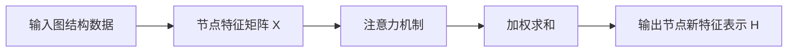

# 基于图注意力网络的关系推理能力增强

> 关键词：图注意力网络、关系推理、图神经网络、注意力机制、知识图谱

> 摘要：本文聚焦于基于图注意力网络的关系推理能力增强这一核心主题。首先介绍了研究的背景，包括目的、预期读者、文档结构和相关术语。接着阐述了图注意力网络和关系推理的核心概念及其联系，通过文本示意图和 Mermaid 流程图进行直观展示。详细讲解了核心算法原理，并给出 Python 源代码实现。深入探讨了相关数学模型和公式，结合具体例子进行说明。通过项目实战，展示了如何搭建开发环境、实现源代码并进行代码解读。分析了基于图注意力网络增强关系推理能力的实际应用场景，推荐了相关的学习资源、开发工具框架和论文著作。最后总结了未来发展趋势与挑战，提供了常见问题解答和扩展阅读参考资料，旨在为相关领域的研究和实践提供全面且深入的指导。

## 1. 背景介绍 

### 1.1 目的和范围
在当今信息爆炸的时代，大量的数据以图结构的形式存在，如社交网络、知识图谱等。这些图结构数据中蕴含着丰富的关系信息，如何从这些数据中准确地进行关系推理是一个重要的研究课题。图注意力网络（Graph Attention Network，GAT）作为一种强大的图神经网络模型，能够自动学习节点之间的重要性权重，在图数据处理方面取得了显著的成果。本研究的目的在于探索如何利用图注意力网络来增强关系推理能力，通过对图结构数据的深入分析和处理，提高关系推理的准确性和效率。

本研究的范围主要涵盖图注意力网络的原理、关系推理的基本概念和方法、基于图注意力网络的关系推理算法的实现，以及在实际应用场景中的验证和评估。

### 1.2 预期读者
本文预期读者包括计算机科学、人工智能、数据挖掘等领域的研究人员和学生，以及对图神经网络和关系推理感兴趣的技术爱好者。对于希望深入了解图注意力网络和关系推理技术的专业人士，本文提供了详细的理论分析和实践指导；对于初学者，本文也会从基本概念入手，逐步引导读者理解和掌握相关技术。

### 1.3 文档结构概述
本文将按照以下结构进行组织：
- 核心概念与联系：介绍图注意力网络和关系推理的基本概念，以及它们之间的联系，通过文本示意图和 Mermaid 流程图进行直观展示。
- 核心算法原理 & 具体操作步骤：详细讲解基于图注意力网络的关系推理算法原理，并给出 Python 源代码实现。
- 数学模型和公式 & 详细讲解 & 举例说明：深入探讨相关数学模型和公式，结合具体例子进行说明。
- 项目实战：代码实际案例和详细解释说明：通过实际项目案例，展示如何搭建开发环境、实现源代码并进行代码解读。
- 实际应用场景：分析基于图注意力网络的关系推理技术在不同领域的实际应用场景。
- 工具和资源推荐：推荐相关的学习资源、开发工具框架和论文著作。
- 总结：未来发展趋势与挑战：总结基于图注意力网络的关系推理技术的未来发展趋势和面临的挑战。
- 附录：常见问题与解答：提供常见问题的解答，帮助读者更好地理解和应用相关技术。
- 扩展阅读 & 参考资料：提供扩展阅读的建议和相关参考资料。

### 1.4 术语表

#### 1.4.1 核心术语定义
- **图注意力网络（Graph Attention Network，GAT）**：一种基于注意力机制的图神经网络模型，通过学习节点之间的注意力权重，能够自适应地捕获图结构中节点之间的重要关系。
- **关系推理**：从已知的关系信息中推断出未知关系的过程，在图结构数据中，关系推理通常是根据节点之间的连接和属性信息来推断新的关系。
- **图神经网络（Graph Neural Network，GNN）**：一类专门用于处理图结构数据的神经网络模型，能够对图中的节点和边进行特征学习和表示。
- **注意力机制**：一种模仿人类注意力的机制，通过计算不同元素之间的重要性权重，将注意力集中在关键元素上，提高模型的性能。

#### 1.4.2 相关概念解释
- **图结构数据**：由节点和边组成的数据结构，节点表示实体，边表示实体之间的关系。常见的图结构数据包括社交网络、知识图谱、分子结构等。
- **节点特征**：描述图中节点属性的向量，节点特征可以是节点的固有属性，也可以是通过学习得到的特征表示。
- **边特征**：描述图中边属性的向量，边特征可以表示边的类型、权重等信息。

#### 1.4.3 缩略词列表
- **GAT**：Graph Attention Network（图注意力网络）
- **GNN**：Graph Neural Network（图神经网络）

## 2. 核心概念与联系 

### 2.1 图注意力网络（GAT）原理
图注意力网络是一种基于注意力机制的图神经网络模型，其核心思想是通过学习节点之间的注意力权重，自适应地捕获图结构中节点之间的重要关系。在 GAT 中，每个节点会根据其邻居节点的特征和自身特征，计算出与每个邻居节点的注意力权重，然后根据这些权重对邻居节点的特征进行加权求和，得到该节点的新特征表示。

#### 文本示意图
```plaintext
输入图结构数据：包含节点集合 V 和边集合 E
|
V
节点特征矩阵 X（每个节点对应一个特征向量）
|
V
注意力机制：计算每个节点与其邻居节点之间的注意力权重
|
V
加权求和：根据注意力权重对邻居节点的特征进行加权求和
|
V
输出节点的新特征表示 H
```

#### Mermaid 流程图


### 2.2 关系推理概念
关系推理是从已知的关系信息中推断出未知关系的过程。在图结构数据中，关系推理通常是根据节点之间的连接和属性信息来推断新的关系。例如，在知识图谱中，已知“张三是李四的父亲”和“李四是王五的父亲”，可以推断出“张三是王五的祖父”。

### 2.3 图注意力网络与关系推理的联系
图注意力网络可以为关系推理提供强大的特征学习能力。通过学习节点之间的注意力权重，GAT 能够自动捕获图结构中与关系推理相关的重要信息，从而提高关系推理的准确性和效率。具体来说，GAT 可以学习到不同节点在关系推理中的重要性，将注意力集中在关键节点上，避免无关信息的干扰。同时，GAT 可以对节点的特征进行更新和表示学习，使得节点的特征更能反映其在关系推理中的作用。

## 3. 核心算法原理 & 具体操作步骤 

### 3.1 图注意力网络的核心算法原理
图注意力网络的核心算法主要包括注意力机制的计算和节点特征的更新。下面我们将详细介绍这两个步骤。

#### 注意力机制的计算
在 GAT 中，对于节点 $i$ 和其邻居节点 $j$，注意力系数 $e_{ij}$ 可以通过以下公式计算：
$$e_{ij} = \text{LeakyReLU}(\mathbf{a}^T [\mathbf{W} \mathbf{h}_i || \mathbf{W} \mathbf{h}_j])$$
其中，$\mathbf{h}_i$ 和 $\mathbf{h}_j$ 分别是节点 $i$ 和节点 $j$ 的特征向量，$\mathbf{W}$ 是一个可学习的权重矩阵，用于将节点特征映射到一个新的特征空间，$\mathbf{a}$ 是一个可学习的注意力向量，$||$ 表示向量的拼接操作，$\text{LeakyReLU}$ 是一种激活函数。

为了使得注意力系数在邻居节点之间具有可比性，我们需要对其进行归一化处理，通常使用 softmax 函数：
$$\alpha_{ij} = \frac{\exp(e_{ij})}{\sum_{k \in \mathcal{N}(i)} \exp(e_{ik})}$$
其中，$\mathcal{N}(i)$ 表示节点 $i$ 的邻居节点集合，$\alpha_{ij}$ 是归一化后的注意力权重。

#### 节点特征的更新
在计算得到注意力权重后，我们可以根据这些权重对邻居节点的特征进行加权求和，得到节点 $i$ 的新特征表示 $\mathbf{h}_i'$：
$$\mathbf{h}_i' = \sigma\left(\sum_{j \in \mathcal{N}(i)} \alpha_{ij} \mathbf{W} \mathbf{h}_j\right)$$
其中，$\sigma$ 是一个激活函数，通常使用 ReLU 函数。

### 3.2 Python 源代码实现
下面是一个使用 PyTorch 实现的简单图注意力网络的代码示例：

```python
import torch
import torch.nn as nn
import torch.nn.functional as F

class GraphAttentionLayer(nn.Module):
    def __init__(self, in_features, out_features, dropout, alpha, concat=True):
        super(GraphAttentionLayer, self).__init__()
        self.dropout = dropout
        self.in_features = in_features
        self.out_features = out_features
        self.alpha = alpha
        self.concat = concat

        self.W = nn.Parameter(torch.empty(size=(in_features, out_features)))
        nn.init.xavier_uniform_(self.W.data, gain=1.414)
        self.a = nn.Parameter(torch.empty(size=(2*out_features, 1)))
        nn.init.xavier_uniform_(self.a.data, gain=1.414)

        self.leakyrelu = nn.LeakyReLU(self.alpha)

    def forward(self, h, adj):
        Wh = torch.mm(h, self.W)  # h.shape: (N, in_features), Wh.shape: (N, out_features)
        e = self._prepare_attentional_mechanism_input(Wh)

        zero_vec = -9e15*torch.ones_like(e)
        attention = torch.where(adj > 0, e, zero_vec)
        attention = F.softmax(attention, dim=1)
        attention = F.dropout(attention, self.dropout, training=self.training)
        h_prime = torch.matmul(attention, Wh)

        if self.concat:
            return F.elu(h_prime)
        else:
            return h_prime

    def _prepare_attentional_mechanism_input(self, Wh):
        # Wh.shape (N, out_feature)
        # self.a.shape (2 * out_feature, 1)
        # Wh1&2.shape (N, 1)
        # e.shape (N, N)
        Wh1 = torch.matmul(Wh, self.a[:self.out_features, :])
        Wh2 = torch.matmul(Wh, self.a[self.out_features:, :])
        # broadcast add
        e = Wh1 + Wh2.T
        return self.leakyrelu(e)
```

### 3.3 具体操作步骤
1. **数据准备**：将图结构数据转换为适合图注意力网络输入的格式，包括节点特征矩阵和邻接矩阵。
2. **模型定义**：定义图注意力网络模型，包括图注意力层的堆叠和输出层的定义。
3. **模型训练**：使用训练数据对模型进行训练，通过优化损失函数来更新模型的参数。
4. **关系推理**：使用训练好的模型对未知关系进行推理，根据节点的新特征表示和图结构信息推断出新的关系。

## 4. 数学模型和公式 & 详细讲解 & 举例说明 

### 4.1 注意力机制的数学模型
注意力机制是图注意力网络的核心，其数学模型主要包括注意力系数的计算和归一化处理。

#### 注意力系数的计算
注意力系数 $e_{ij}$ 的计算公式为：
$$e_{ij} = \text{LeakyReLU}(\mathbf{a}^T [\mathbf{W} \mathbf{h}_i || \mathbf{W} \mathbf{h}_j])$$
这个公式的含义是，首先将节点 $i$ 和节点 $j$ 的特征向量 $\mathbf{h}_i$ 和 $\mathbf{h}_j$ 通过权重矩阵 $\mathbf{W}$ 映射到一个新的特征空间，然后将映射后的特征向量拼接起来，再与注意力向量 $\mathbf{a}$ 进行点积运算，最后通过 $\text{LeakyReLU}$ 激活函数得到注意力系数 $e_{ij}$。

#### 归一化处理
为了使得注意力系数在邻居节点之间具有可比性，我们使用 softmax 函数对其进行归一化处理，得到注意力权重 $\alpha_{ij}$：
$$\alpha_{ij} = \frac{\exp(e_{ij})}{\sum_{k \in \mathcal{N}(i)} \exp(e_{ik})}$$
这个公式的含义是，对于节点 $i$ 的每个邻居节点 $j$，其注意力权重 $\alpha_{ij}$ 是其注意力系数 $e_{ij}$ 的指数值除以所有邻居节点注意力系数的指数值之和。

### 4.2 节点特征更新的数学模型
节点特征更新的数学模型是根据注意力权重对邻居节点的特征进行加权求和，得到节点的新特征表示 $\mathbf{h}_i'$：
$$\mathbf{h}_i' = \sigma\left(\sum_{j \in \mathcal{N}(i)} \alpha_{ij} \mathbf{W} \mathbf{h}_j\right)$$
这个公式的含义是，对于节点 $i$，其新特征表示 $\mathbf{h}_i'$ 是其邻居节点的特征向量 $\mathbf{h}_j$ 经过权重矩阵 $\mathbf{W}$ 映射后，再根据注意力权重 $\alpha_{ij}$ 进行加权求和，最后通过激活函数 $\sigma$ 得到的。

### 4.3 举例说明
假设我们有一个简单的图，包含 3 个节点 $A$、$B$、$C$，节点的特征向量分别为 $\mathbf{h}_A = [1, 2]$、$\mathbf{h}_B = [3, 4]$、$\mathbf{h}_C = [5, 6]$，邻接矩阵为：
$$
\mathbf{adj} = \begin{bmatrix}
0 & 1 & 1 \\
1 & 0 & 1 \\
1 & 1 & 0
\end{bmatrix}
$$
表示节点 $A$ 与节点 $B$ 和节点 $C$ 相连，节点 $B$ 与节点 $A$ 和节点 $C$ 相连，节点 $C$ 与节点 $A$ 和节点 $B$ 相连。

#### 注意力系数的计算
假设权重矩阵 $\mathbf{W} = \begin{bmatrix}
0.1 & 0.2 \\
0.3 & 0.4
\end{bmatrix}$，注意力向量 $\mathbf{a} = [0.1, 0.2, 0.3, 0.4]^T$。

对于节点 $A$ 和节点 $B$，首先计算 $\mathbf{W} \mathbf{h}_A$ 和 $\mathbf{W} \mathbf{h}_B$：
$$
\mathbf{W} \mathbf{h}_A = \begin{bmatrix}
0.1 & 0.2 \\
0.3 & 0.4
\end{bmatrix}
\begin{bmatrix}
1 \\
2
\end{bmatrix}
= \begin{bmatrix}
0.5 \\
1.1
\end{bmatrix}
$$
$$
\mathbf{W} \mathbf{h}_B = \begin{bmatrix}
0.1 & 0.2 \\
0.3 & 0.4
\end{bmatrix}
\begin{bmatrix}
3 \\
4
\end{bmatrix}
= \begin{bmatrix}
1.1 \\
2.5
\end{bmatrix}
$$
然后将它们拼接起来：
$$
[\mathbf{W} \mathbf{h}_A || \mathbf{W} \mathbf{h}_B] = \begin{bmatrix}
0.5 \\
1.1 \\
1.1 \\
2.5
\end{bmatrix}
$$
接着计算注意力系数 $e_{AB}$：
$$
e_{AB} = \text{LeakyReLU}(\mathbf{a}^T [\mathbf{W} \mathbf{h}_A || \mathbf{W} \mathbf{h}_B]) = \text{LeakyReLU}(0.1\times0.5 + 0.2\times1.1 + 0.3\times1.1 + 0.4\times2.5) = \text{LeakyReLU}(1.7) = 1.7
$$
同理，可以计算出 $e_{AC}$。

#### 归一化处理
假设 $e_{AB} = 1.7$，$e_{AC} = 2.0$，则节点 $A$ 对节点 $B$ 和节点 $C$ 的注意力权重分别为：
$$
\alpha_{AB} = \frac{\exp(1.7)}{\exp(1.7) + \exp(2.0)} \approx 0.33
$$
$$
\alpha_{AC} = \frac{\exp(2.0)}{\exp(1.7) + \exp(2.0)} \approx 0.67
$$

#### 节点特征更新
假设激活函数 $\sigma$ 为 ReLU 函数，则节点 $A$ 的新特征表示为：
$$
\mathbf{h}_A' = \text{ReLU}(\alpha_{AB} \mathbf{W} \mathbf{h}_B + \alpha_{AC} \mathbf{W} \mathbf{h}_C)
$$
通过上述计算，我们可以看到如何使用图注意力网络的数学模型进行节点特征的更新和关系推理。

## 5. 项目实战：代码实际案例和详细解释说明 

### 5.1 开发环境搭建
为了实现基于图注意力网络的关系推理项目，我们需要搭建相应的开发环境。以下是具体的搭建步骤：

#### 安装 Python
首先，确保你已经安装了 Python 3.6 或更高版本。可以从 Python 官方网站（https://www.python.org/downloads/）下载并安装适合你操作系统的 Python 版本。

#### 安装 PyTorch
PyTorch 是一个流行的深度学习框架，我们可以使用它来实现图注意力网络。可以根据你的 CUDA 版本和操作系统选择合适的安装命令，例如：
```bash
pip install torch torchvision torchaudio
```

#### 安装 DGL
DGL（Deep Graph Library）是一个用于图神经网络的开源库，它提供了丰富的图数据处理和模型实现工具。可以使用以下命令安装 DGL：
```bash
pip install dgl
```

### 5.2 源代码详细实现和代码解读
下面是一个使用 DGL 和 PyTorch 实现的基于图注意力网络的关系推理项目的代码示例：

```python
import dgl
import torch
import torch.nn as nn
import torch.nn.functional as F
from dgl.nn.pytorch import GATConv

# 定义图注意力网络模型
class GATModel(nn.Module):
    def __init__(self, in_feats, hidden_size, num_classes, num_heads):
        super(GATModel, self).__init__()
        self.gat1 = GATConv(in_feats, hidden_size, num_heads)
        self.gat2 = GATConv(hidden_size * num_heads, num_classes, 1)

    def forward(self, g, inputs):
        h = self.gat1(g, inputs)
        h = h.flatten(1)
        h = F.elu(h)
        h = self.gat2(g, h)
        h = h.squeeze()
        return h

# 生成示例图数据
g = dgl.graph(([0, 1, 2, 3], [1, 2, 3, 0]))
node_features = torch.randn(g.num_nodes(), 10)
labels = torch.randint(0, 2, (g.num_nodes(),))

# 初始化模型
model = GATModel(in_feats=10, hidden_size=8, num_classes=2, num_heads=2)

# 定义损失函数和优化器
criterion = nn.CrossEntropyLoss()
optimizer = torch.optim.Adam(model.parameters(), lr=0.01)

# 训练模型
for epoch in range(100):
    logits = model(g, node_features)
    loss = criterion(logits, labels)
    optimizer.zero_grad()
    loss.backward()
    optimizer.step()
    print(f'Epoch {epoch}: Loss = {loss.item()}')
```

### 5.3 代码解读与分析
#### 模型定义
在 `GATModel` 类中，我们定义了一个包含两个图注意力层的图注意力网络模型。第一个图注意力层 `gat1` 将输入特征映射到隐藏特征空间，第二个图注意力层 `gat2` 将隐藏特征映射到输出类别空间。

#### 数据准备
我们使用 DGL 生成了一个简单的图数据 `g`，并随机生成了节点特征 `node_features` 和标签 `labels`。

#### 模型训练
在训练过程中，我们使用交叉熵损失函数 `criterion` 来计算模型的损失，并使用 Adam 优化器 `optimizer` 来更新模型的参数。通过多次迭代训练，模型的损失逐渐降低，说明模型在不断学习和优化。

## 6. 实际应用场景 
基于图注意力网络的关系推理技术在许多领域都有广泛的应用，以下是一些常见的应用场景：

### 知识图谱补全
知识图谱是一种以图结构形式表示知识的数据库，其中节点表示实体，边表示实体之间的关系。由于知识图谱往往是不完整的，存在大量的缺失关系，因此需要进行知识图谱补全。图注意力网络可以学习知识图谱中节点和边的特征表示，通过关系推理来预测缺失的关系，从而补全知识图谱。

### 社交网络分析
在社交网络中，用户之间的关系可以用图结构来表示。图注意力网络可以分析社交网络中用户之间的关系，例如预测用户之间的好友关系、发现社交圈子等。通过增强关系推理能力，图注意力网络可以更准确地捕捉社交网络中的复杂关系，为社交网络的推荐系统、信息传播分析等提供支持。

### 推荐系统
推荐系统的核心任务是根据用户的历史行为和偏好，为用户推荐感兴趣的物品。图注意力网络可以将用户、物品和它们之间的交互关系表示为图结构，通过关系推理来学习用户和物品的特征表示，从而提高推荐系统的准确性和个性化程度。例如，在电商推荐系统中，图注意力网络可以分析用户的购买历史、浏览记录等信息，预测用户可能感兴趣的商品。

### 生物信息学
在生物信息学中，蛋白质相互作用网络、基因调控网络等都可以用图结构来表示。图注意力网络可以分析这些生物网络中的关系，例如预测蛋白质之间的相互作用、发现基因调控的关键节点等。通过增强关系推理能力，图注意力网络可以帮助生物学家更好地理解生物系统的复杂机制，为药物研发、疾病诊断等提供支持。

## 7. 工具和资源推荐

### 7.1 学习资源推荐

#### 7.1.1 书籍推荐
- 《图神经网络：基础、前沿与应用》：全面介绍了图神经网络的基本概念、算法和应用，是学习图神经网络的经典教材。
- 《深度学习》：深度学习领域的权威著作，涵盖了深度学习的基本原理、算法和应用，对于理解图注意力网络的理论基础有很大帮助。

#### 7.1.2 在线课程
- Coursera 上的“图神经网络”课程：由知名学者授课，详细介绍了图神经网络的原理和应用，提供了丰富的实践案例。
- 哔哩哔哩上的“图神经网络入门教程”：适合初学者，通过通俗易懂的讲解和代码示例，帮助学习者快速入门图神经网络。

#### 7.1.3 技术博客和网站
- Medium 上的图神经网络相关博客：许多研究人员和开发者会在 Medium 上分享图神经网络的最新研究成果和实践经验。
- 图神经网络官方网站：如 DGL、PyTorch Geometric 等框架的官方网站，提供了详细的文档和教程。

### 7.2 开发工具框架推荐

#### 7.2.1 IDE和编辑器
- PyCharm：一款功能强大的 Python 集成开发环境，提供了代码编辑、调试、版本控制等功能，适合开发基于图注意力网络的项目。
- Jupyter Notebook：一种交互式的开发环境，适合进行数据探索和模型实验，方便展示代码和结果。

#### 7.2.2 调试和性能分析工具
- TensorBoard：TensorFlow 提供的可视化工具，可以用于监控模型的训练过程、分析模型的性能指标等。
- PyTorch Profiler：PyTorch 提供的性能分析工具，可以帮助开发者找出代码中的性能瓶颈，优化代码性能。

#### 7.2.3 相关框架和库
- DGL（Deep Graph Library）：一个用于图神经网络的开源库，提供了丰富的图数据处理和模型实现工具，支持多种深度学习框架。
- PyTorch Geometric：基于 PyTorch 的图神经网络库，提供了高效的图数据处理和模型训练功能。

### 7.3 相关论文著作推荐

#### 7.3.1 经典论文
- “Graph Attention Networks”：图注意力网络的开山之作，详细介绍了图注意力网络的原理和算法。
- “Inductive Representation Learning on Large Graphs”：提出了图神经网络的归纳式学习方法，为图神经网络的大规模应用提供了理论基础。

#### 7.3.2 最新研究成果
- 每年的顶级机器学习会议（如 NeurIPS、ICML、CVPR 等）上都会有关于图神经网络和关系推理的最新研究成果发表，可以关注这些会议的论文。

#### 7.3.3 应用案例分析
- 许多研究机构和企业会发布基于图注意力网络的应用案例分析，例如知识图谱补全、社交网络分析等领域的应用案例，可以从中学习到实际应用中的经验和技巧。

## 8. 总结：未来发展趋势与挑战
### 8.1 未来发展趋势
- **多模态融合**：将图注意力网络与其他模态的数据（如图像、文本、音频等）进行融合，能够更全面地表示和处理复杂的信息，提高关系推理的准确性和泛化能力。例如，在智能医疗领域，可以将医学图像、病历文本和基因数据等多模态信息融合，通过图注意力网络进行疾病诊断和预测。
- **可解释性研究**：随着图注意力网络在各个领域的广泛应用，其可解释性变得越来越重要。未来的研究将致力于提高图注意力网络的可解释性，使得模型的决策过程更加透明，便于用户理解和信任。例如，通过可视化注意力权重和节点特征，解释模型是如何进行关系推理的。
- **大规模图处理**：现实世界中的图数据往往非常庞大，如社交网络、互联网拓扑结构等。未来的图注意力网络将需要处理更大规模的图数据，提高模型的计算效率和可扩展性。例如，采用分布式计算、图采样等技术来加速模型的训练和推理过程。
- **与强化学习结合**：将图注意力网络与强化学习相结合，可以用于解决复杂的决策问题。例如，在自动驾驶、机器人控制等领域，通过图注意力网络学习环境的图结构信息，再结合强化学习算法进行决策优化。

### 8.2 挑战
- **数据质量和标注**：图数据的质量和标注对于关系推理的性能至关重要。然而，现实世界中的图数据往往存在噪声、缺失值等问题，并且标注数据的成本较高。如何处理低质量的数据和减少标注成本是一个挑战。
- **计算资源需求**：图注意力网络的训练和推理过程通常需要大量的计算资源，特别是在处理大规模图数据时。如何在有限的计算资源下提高模型的性能是一个亟待解决的问题。
- **模型泛化能力**：图注意力网络在某些特定数据集上可能表现良好，但在其他数据集上的泛化能力可能较差。如何提高模型的泛化能力，使其能够适应不同的图结构和数据分布，是未来研究的一个重点。
- **伦理和安全问题**：随着图注意力网络在敏感领域（如金融、医疗等）的应用，伦理和安全问题变得越来越突出。例如，模型的决策可能会对个人隐私和社会公平产生影响，如何确保模型的安全性和公正性是一个重要的挑战。

## 9. 附录：常见问题与解答

### 9.1 图注意力网络与传统图神经网络有什么区别？
图注意力网络与传统图神经网络的主要区别在于引入了注意力机制。传统图神经网络通常采用固定的邻域聚合方式，对所有邻居节点进行同等对待；而图注意力网络通过学习节点之间的注意力权重，能够自适应地捕获图结构中节点之间的重要关系，将注意力集中在关键节点上，从而提高模型的性能。

### 9.2 如何选择图注意力网络的超参数？
图注意力网络的超参数包括隐藏层大小、注意力头数、学习率等。可以通过网格搜索、随机搜索等方法来选择合适的超参数。具体来说，可以在验证集上对不同的超参数组合进行评估，选择性能最优的超参数组合。

### 9.3 图注意力网络在处理有向图和无向图时有什么不同？
图注意力网络在处理有向图和无向图时的主要区别在于邻接矩阵的表示。对于无向图，邻接矩阵是对称的；而对于有向图，邻接矩阵是非对称的。在实现图注意力网络时，需要根据图的类型正确设置邻接矩阵。

### 9.4 如何提高图注意力网络的训练效率？
可以通过以下方法提高图注意力网络的训练效率：
- 使用 GPU 加速：将模型和数据移动到 GPU 上进行计算，可以显著提高训练速度。
- 采用图采样技术：对于大规模图数据，可以采用图采样技术减少训练过程中的计算量。
- 优化模型结构：减少模型的参数数量，选择合适的激活函数等。

## 10. 扩展阅读 & 参考资料
### 扩展阅读
- 《图论及其应用》：深入介绍了图论的基本概念和算法，对于理解图结构数据和图神经网络有很大帮助。
- 《注意力机制：原理与应用》：详细介绍了注意力机制的原理和在各个领域的应用，有助于深入理解图注意力网络中的注意力机制。

### 参考资料
- Veličković, P., Cucurull, G., Casanova, A., Romero, A., Lio, P., & Bengio, Y. (2017). Graph attention networks. arXiv preprint arXiv:1710.10903.
- Hamilton, W. L., Ying, Z., & Leskovec, J. (2017). Inductive representation learning on large graphs. In Advances in neural information processing systems (pp. 1024-1034).
- DGL 官方文档：https://docs.dgl.ai/
- PyTorch 官方文档：https://pytorch.org/docs/stable/