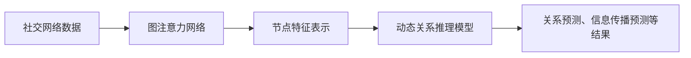

# 基于图注意力网络的动态关系推理在社交网络分析中的应用

> 关键词：图注意力网络、动态关系推理、社交网络分析、深度学习、图神经网络

> 摘要：本文聚焦于基于图注意力网络的动态关系推理在社交网络分析中的应用。首先介绍了相关研究的背景、目的和预期读者等内容。详细阐述了图注意力网络和动态关系推理的核心概念及其联系，给出了原理和架构的示意图与流程图。深入讲解了核心算法原理，并使用Python代码进行具体实现。通过数学模型和公式对算法进行了理论分析，并举例说明。结合实际项目，进行了开发环境搭建、源代码实现与解读。探讨了该技术在社交网络分析中的实际应用场景，推荐了学习资源、开发工具框架以及相关论文著作。最后总结了未来发展趋势与挑战，并提供了常见问题解答和扩展阅读参考资料。

## 1. 背景介绍 
### 1.1 目的和范围
社交网络已经成为人们日常生活中不可或缺的一部分，其中蕴含着丰富的用户信息和复杂的人际关系。对社交网络进行分析可以帮助我们了解用户行为、发现社交模式、预测信息传播等。传统的社交网络分析方法往往难以处理网络中的动态变化和复杂关系。基于图注意力网络的动态关系推理技术为解决这些问题提供了新的思路。本文的目的是深入探讨该技术在社交网络分析中的应用，包括其原理、算法实现、实际应用场景等。范围涵盖了从理论基础到实际项目的各个方面，旨在为相关领域的研究人员和开发者提供全面的参考。

### 1.2 预期读者
本文预期读者包括计算机科学、数据科学、人工智能等领域的研究人员和学生，以及从事社交网络分析、推荐系统、信息传播等应用开发的工程师。对于对图神经网络和社交网络分析感兴趣的初学者，本文也提供了详细的基础知识讲解和案例分析，帮助他们快速入门。

### 1.3 文档结构概述
本文将按照以下结构进行组织：
- 核心概念与联系：介绍图注意力网络和动态关系推理的基本概念，以及它们在社交网络分析中的联系，并给出相应的示意图和流程图。
- 核心算法原理 & 具体操作步骤：详细讲解图注意力网络的核心算法原理，并使用Python代码进行实现。
- 数学模型和公式 & 详细讲解 & 举例说明：通过数学模型和公式对图注意力网络进行理论分析，并举例说明其在社交网络分析中的应用。
- 项目实战：代码实际案例和详细解释说明：结合实际项目，介绍开发环境搭建、源代码实现和代码解读。
- 实际应用场景：探讨基于图注意力网络的动态关系推理在社交网络分析中的实际应用场景。
- 工具和资源推荐：推荐学习资源、开发工具框架以及相关论文著作。
- 总结：未来发展趋势与挑战：总结该技术的未来发展趋势和面临的挑战。
- 附录：常见问题与解答：提供常见问题的解答。
- 扩展阅读 & 参考资料：提供扩展阅读的资料和参考文献。

### 1.4 术语表
#### 1.4.1 核心术语定义
- **图注意力网络（Graph Attention Network，GAT）**：一种基于图结构的神经网络，通过注意力机制来学习节点之间的关系权重。
- **动态关系推理**：在社交网络中，随着时间的推移，节点之间的关系会发生变化，动态关系推理旨在对这些变化的关系进行推理和预测。
- **社交网络分析**：对社交网络中的节点（用户）和边（关系）进行分析，以发现社交模式、用户行为等信息。
- **图神经网络（Graph Neural Network，GNN）**：一类用于处理图结构数据的神经网络，图注意力网络是其中的一种。
- **注意力机制**：一种在神经网络中用于自动分配权重的机制，能够让模型更加关注重要的信息。

#### 1.4.2 相关概念解释
- **图结构数据**：由节点和边组成的数据结构，节点表示实体，边表示实体之间的关系。在社交网络中，节点可以表示用户，边可以表示用户之间的好友关系、关注关系等。
- **特征表示**：将节点和边的信息转换为向量表示，以便神经网络进行处理。在社交网络中，节点的特征可以包括用户的年龄、性别、兴趣爱好等，边的特征可以包括关系的强度、时间等。
- **消息传递机制**：图神经网络中用于节点信息传播的机制，通过邻居节点的信息更新当前节点的表示。

#### 1.4.3 缩略词列表
- GAT：Graph Attention Network（图注意力网络）
- GNN：Graph Neural Network（图神经网络）
- SNA：Social Network Analysis（社交网络分析）

## 2. 核心概念与联系 
### 2.1 图注意力网络（GAT）原理
图注意力网络是一种基于图结构的神经网络，它通过注意力机制来学习节点之间的关系权重。传统的图神经网络在处理节点之间的关系时，通常使用固定的权重，而图注意力网络可以根据节点的特征自动调整权重，从而更好地捕捉节点之间的重要关系。

图注意力网络的核心思想是为每个节点的邻居节点分配不同的注意力权重，这些权重表示邻居节点对当前节点的重要程度。具体来说，对于图中的每个节点 $i$，其邻居节点集合为 $\mathcal{N}_i$，图注意力网络通过以下步骤计算注意力权重：

1. 首先，将节点 $i$ 和其邻居节点 $j$ 的特征向量 $h_i$ 和 $h_j$ 进行线性变换，得到新的特征向量 $\vec{W}h_i$ 和 $\vec{W}h_j$，其中 $\vec{W}$ 是可学习的权重矩阵。
2. 然后，将变换后的特征向量拼接起来，并通过一个非线性函数 $\text{LeakyReLU}$ 计算注意力系数 $e_{ij}$：
   $$e_{ij} = \text{LeakyReLU}(\vec{a}^T [\vec{W}h_i || \vec{W}h_j])$$
   其中 $\vec{a}$ 是可学习的注意力向量，$||$ 表示拼接操作。
3. 最后，对注意力系数进行归一化处理，得到注意力权重 $\alpha_{ij}$：
   $$\alpha_{ij} = \frac{\exp(e_{ij})}{\sum_{k \in \mathcal{N}_i} \exp(e_{ik})}$$

通过注意力权重，节点 $i$ 的新特征表示 $h_i'$ 可以通过邻居节点的特征加权求和得到：
$$h_i' = \sigma\left(\sum_{j \in \mathcal{N}_i} \alpha_{ij} \vec{W}h_j\right)$$
其中 $\sigma$ 是激活函数，通常使用 $\text{ReLU}$ 或 $\text{ELU}$。

### 2.2 动态关系推理原理
在社交网络中，节点之间的关系是动态变化的，例如用户可能会添加或删除好友、改变关注对象等。动态关系推理旨在对这些变化的关系进行推理和预测。

动态关系推理通常基于时间序列数据，考虑节点和边的特征随时间的变化。一种常见的方法是使用循环神经网络（RNN）或长短期记忆网络（LSTM）来处理时间序列信息。具体来说，对于每个时间步 $t$，可以将图注意力网络应用于当前时间步的图结构数据，得到节点的特征表示 $h_{i,t}$。然后，将这些特征表示输入到 RNN 或 LSTM 中，学习节点特征的时间动态变化。最后，根据学习到的动态特征进行关系推理和预测。

### 2.3 核心概念联系
图注意力网络和动态关系推理在社交网络分析中有着密切的联系。图注意力网络可以用于学习社交网络中节点之间的静态关系，通过注意力机制捕捉重要的邻居节点信息。而动态关系推理则可以利用图注意力网络得到的节点特征，结合时间序列信息，对节点之间的动态关系进行推理和预测。

具体来说，在社交网络分析中，可以首先使用图注意力网络对每个时间步的图结构数据进行处理，得到节点的特征表示。然后，将这些特征表示输入到动态关系推理模型中，学习节点特征的时间动态变化。最后，根据学习到的动态特征进行社交网络中的关系预测、信息传播预测等任务。

### 2.4 文本示意图和 Mermaid 流程图

#### 文本示意图
图注意力网络和动态关系推理在社交网络分析中的应用可以用以下示意图表示：

社交网络数据（节点特征、边信息、时间信息） -> 图注意力网络（学习节点静态关系） -> 节点特征表示 -> 动态关系推理模型（学习节点特征时间动态） -> 关系预测、信息传播预测等结果

#### Mermaid 流程图


## 3. 核心算法原理 & 具体操作步骤 

### 3.1 图注意力网络核心算法原理
图注意力网络的核心算法可以分为以下几个步骤：

1. **输入数据**：输入图结构数据，包括节点特征矩阵 $X \in \mathbb{R}^{N \times F}$，其中 $N$ 是节点数量，$F$ 是节点特征维度；邻接矩阵 $A \in \mathbb{R}^{N \times N}$，表示节点之间的连接关系。
2. **线性变换**：对节点特征矩阵 $X$ 进行线性变换，得到新的特征矩阵 $\tilde{X} = \vec{W}X$，其中 $\vec{W} \in \mathbb{R}^{F' \times F}$ 是可学习的权重矩阵，$F'$ 是变换后的特征维度。
3. **计算注意力系数**：对于每个节点 $i$ 和其邻居节点 $j$，计算注意力系数 $e_{ij}$：
   $$e_{ij} = \text{LeakyReLU}(\vec{a}^T [\tilde{X}_i || \tilde{X}_j])$$
   其中 $\vec{a} \in \mathbb{R}^{2F'}$ 是可学习的注意力向量，$\tilde{X}_i$ 和 $\tilde{X}_j$ 分别是节点 $i$ 和 $j$ 的变换后的特征向量。
4. **归一化注意力系数**：对注意力系数进行归一化处理，得到注意力权重 $\alpha_{ij}$：
   $$\alpha_{ij} = \frac{\exp(e_{ij})}{\sum_{k \in \mathcal{N}_i} \exp(e_{ik})}$$
5. **更新节点特征**：根据注意力权重，更新节点的特征表示 $h_i'$：
   $$h_i' = \sigma\left(\sum_{j \in \mathcal{N}_i} \alpha_{ij} \tilde{X}_j\right)$$

### 3.2 Python 代码实现

```python
import torch
import torch.nn as nn
import torch.nn.functional as F

class GraphAttentionLayer(nn.Module):
    def __init__(self, in_features, out_features, dropout, alpha, concat=True):
        super(GraphAttentionLayer, self).__init__()
        self.dropout = dropout
        self.in_features = in_features
        self.out_features = out_features
        self.alpha = alpha
        self.concat = concat

        self.W = nn.Parameter(torch.zeros(size=(in_features, out_features)))
        nn.init.xavier_uniform_(self.W.data, gain=1.414)
        self.a = nn.Parameter(torch.zeros(size=(2*out_features, 1)))
        nn.init.xavier_uniform_(self.a.data, gain=1.414)

        self.leakyrelu = nn.LeakyReLU(self.alpha)

    def forward(self, input, adj):
        h = torch.mm(input, self.W)
        N = h.size()[0]

        a_input = torch.cat([h.repeat(1, N).view(N * N, -1), h.repeat(N, 1)], dim=1).view(N, -1, 2 * self.out_features)
        e = self.leakyrelu(torch.matmul(a_input, self.a).squeeze(2))

        zero_vec = -9e15*torch.ones_like(e)
        attention = torch.where(adj > 0, e, zero_vec)
        attention = F.softmax(attention, dim=1)
        attention = F.dropout(attention, self.dropout, training=self.training)
        h_prime = torch.matmul(attention, h)

        if self.concat:
            return F.elu(h_prime)
        else:
            return h_prime
```

### 3.3 具体操作步骤解释
1. **初始化参数**：在 `__init__` 方法中，初始化可学习的权重矩阵 $\vec{W}$ 和注意力向量 $\vec{a}$，并使用 Xavier 初始化方法对其进行初始化。同时，定义 LeakyReLU 激活函数。
2. **线性变换**：在 `forward` 方法中，首先对输入的节点特征矩阵 `input` 进行线性变换，得到新的特征矩阵 `h`。
3. **计算注意力系数**：通过拼接操作和矩阵乘法计算注意力系数 `e`。
4. **归一化注意力系数**：使用 `softmax` 函数对注意力系数进行归一化处理，得到注意力权重 `attention`。
5. **更新节点特征**：根据注意力权重，对邻居节点的特征进行加权求和，得到更新后的节点特征 `h_prime`。最后，根据 `concat` 参数决定是否使用 ELU 激活函数。

## 4. 数学模型和公式 & 详细讲解 & 举例说明 

### 4.1 图注意力网络数学模型
图注意力网络的数学模型可以用以下公式表示：

#### 线性变换
$$\tilde{X} = \vec{W}X$$
其中 $X \in \mathbb{R}^{N \times F}$ 是输入的节点特征矩阵，$\vec{W} \in \mathbb{R}^{F' \times F}$ 是可学习的权重矩阵，$\tilde{X} \in \mathbb{R}^{N \times F'}$ 是变换后的特征矩阵。

#### 注意力系数计算
$$e_{ij} = \text{LeakyReLU}(\vec{a}^T [\tilde{X}_i || \tilde{X}_j])$$
其中 $\vec{a} \in \mathbb{R}^{2F'}$ 是可学习的注意力向量，$\tilde{X}_i$ 和 $\tilde{X}_j$ 分别是节点 $i$ 和 $j$ 的变换后的特征向量。

#### 注意力权重归一化
$$\alpha_{ij} = \frac{\exp(e_{ij})}{\sum_{k \in \mathcal{N}_i} \exp(e_{ik})}$$

#### 节点特征更新
$$h_i' = \sigma\left(\sum_{j \in \mathcal{N}_i} \alpha_{ij} \tilde{X}_j\right)$$
其中 $\sigma$ 是激活函数，通常使用 $\text{ELU}$ 或 $\text{ReLU}$。

### 4.2 详细讲解
- **线性变换**：通过线性变换将输入的节点特征映射到一个新的特征空间，增加模型的表达能力。
- **注意力系数计算**：使用注意力向量 $\vec{a}$ 计算节点 $i$ 和其邻居节点 $j$ 之间的注意力系数 $e_{ij}$。LeakyReLU 激活函数用于引入非线性，避免梯度消失问题。
- **注意力权重归一化**：使用 softmax 函数对注意力系数进行归一化处理，确保注意力权重之和为 1。
- **节点特征更新**：根据注意力权重，对邻居节点的特征进行加权求和，得到更新后的节点特征 $h_i'$。激活函数 $\sigma$ 用于引入非线性，使模型能够学习更复杂的模式。

### 4.3 举例说明
假设我们有一个简单的社交网络，包含 3 个节点，每个节点的特征维度为 2。输入的节点特征矩阵 $X$ 为：
$$X = \begin{bmatrix}
1 & 2 \\
3 & 4 \\
5 & 6
\end{bmatrix}$$
邻接矩阵 $A$ 为：
$$A = \begin{bmatrix}
0 & 1 & 1 \\
1 & 0 & 1 \\
1 & 1 & 0
\end{bmatrix}$$
表示节点之间的连接关系。

假设可学习的权重矩阵 $\vec{W}$ 为：
$$\vec{W} = \begin{bmatrix}
0.1 & 0.2 \\
0.3 & 0.4
\end{bmatrix}$$
注意力向量 $\vec{a}$ 为：
$$\vec{a} = \begin{bmatrix}
0.5 \\
0.6 \\
0.7 \\
0.8
\end{bmatrix}$$

1. **线性变换**：
   $$\tilde{X} = \vec{W}X = \begin{bmatrix}
   0.1 & 0.2 \\
   0.3 & 0.4
   \end{bmatrix} \begin{bmatrix}
   1 & 2 \\
   3 & 4
   \end{bmatrix} = \begin{bmatrix}
   0.7 & 1 \\
   1.5 & 2.2
   \end{bmatrix}$$

2. **计算注意力系数**：
   以节点 0 为例，其邻居节点为节点 1 和节点 2。
   对于节点 0 和节点 1：
   $$\tilde{X}_0 = \begin{bmatrix}
   0.7 \\
   1
   \end{bmatrix}, \tilde{X}_1 = \begin{bmatrix}
   1.5 \\
   2.2
   \end{bmatrix}$$
   $$[\tilde{X}_0 || \tilde{X}_1] = \begin{bmatrix}
   0.7 \\
   1 \\
   1.5 \\
   2.2
   \end{bmatrix}$$
   $$e_{01} = \text{LeakyReLU}(\vec{a}^T [\tilde{X}_0 || \tilde{X}_1]) = \text{LeakyReLU}(0.5 \times 0.7 + 0.6 \times 1 + 0.7 \times 1.5 + 0.8 \times 2.2)$$

   同理，计算 $e_{02}$。

3. **归一化注意力系数**：
   计算节点 0 对其邻居节点的注意力权重 $\alpha_{01}$ 和 $\alpha_{02}$：
   $$\alpha_{01} = \frac{\exp(e_{01})}{\exp(e_{01}) + \exp(e_{02})}$$
   $$\alpha_{02} = \frac{\exp(e_{02})}{\exp(e_{01}) + \exp(e_{02})}$$

4. **更新节点特征**：
   节点 0 的更新后的特征表示 $h_0'$ 为：
   $$h_0' = \sigma(\alpha_{01} \tilde{X}_1 + \alpha_{02} \tilde{X}_2)$$

## 5. 项目实战：代码实际案例和详细解释说明 

### 5.1 开发环境搭建
#### 5.1.1 安装 Python
首先，确保你已经安装了 Python 3.6 或更高版本。可以从 Python 官方网站（https://www.python.org/downloads/）下载并安装。

#### 5.1.2 安装依赖库
使用以下命令安装项目所需的依赖库：
```sh
pip install torch torchvision numpy scikit-learn networkx matplotlib
```
- `torch`：PyTorch 深度学习框架。
- `torchvision`：用于计算机视觉任务的 PyTorch 扩展库。
- `numpy`：用于数值计算的 Python 库。
- `scikit-learn`：用于机器学习任务的 Python 库。
- `networkx`：用于图分析和操作的 Python 库。
- `matplotlib`：用于数据可视化的 Python 库。

### 5.2 源代码详细实现和代码解读
#### 5.2.1 定义图注意力网络模型
```python
import torch
import torch.nn as nn
import torch.nn.functional as F

class GraphAttentionLayer(nn.Module):
    def __init__(self, in_features, out_features, dropout, alpha, concat=True):
        super(GraphAttentionLayer, self).__init__()
        self.dropout = dropout
        self.in_features = in_features
        self.out_features = out_features
        self.alpha = alpha
        self.concat = concat

        self.W = nn.Parameter(torch.zeros(size=(in_features, out_features)))
        nn.init.xavier_uniform_(self.W.data, gain=1.414)
        self.a = nn.Parameter(torch.zeros(size=(2*out_features, 1)))
        nn.init.xavier_uniform_(self.a.data, gain=1.414)

        self.leakyrelu = nn.LeakyReLU(self.alpha)

    def forward(self, input, adj):
        h = torch.mm(input, self.W)
        N = h.size()[0]

        a_input = torch.cat([h.repeat(1, N).view(N * N, -1), h.repeat(N, 1)], dim=1).view(N, -1, 2 * self.out_features)
        e = self.leakyrelu(torch.matmul(a_input, self.a).squeeze(2))

        zero_vec = -9e15*torch.ones_like(e)
        attention = torch.where(adj > 0, e, zero_vec)
        attention = F.softmax(attention, dim=1)
        attention = F.dropout(attention, self.dropout, training=self.training)
        h_prime = torch.matmul(attention, h)

        if self.concat:
            return F.elu(h_prime)
        else:
            return h_prime


class GAT(nn.Module):
    def __init__(self, nfeat, nhid, nclass, dropout, alpha, nheads):
        super(GAT, self).__init__()
        self.dropout = dropout

        self.attentions = [GraphAttentionLayer(nfeat, nhid, dropout=dropout, alpha=alpha, concat=True) for _ in range(nheads)]
        for i, attention in enumerate(self.attentions):
            self.add_module('attention_{}'.format(i), attention)

        self.out_att = GraphAttentionLayer(nhid * nheads, nclass, dropout=dropout, alpha=alpha, concat=False)

    def forward(self, x, adj):
        x = F.dropout(x, self.dropout, training=self.training)
        x = torch.cat([att(x, adj) for att in self.attentions], dim=1)
        x = F.dropout(x, self.dropout, training=self.training)
        x = F.elu(self.out_att(x, adj))
        return F.log_softmax(x, dim=1)
```
#### 代码解读
- `GraphAttentionLayer` 类实现了图注意力网络的一个注意力层，包括线性变换、注意力系数计算、归一化和节点特征更新等步骤。
- `GAT` 类实现了一个多层的图注意力网络，包含多个注意力头和一个输出层。

#### 5.2.2 数据加载和预处理
```python
import numpy as np
import scipy.sparse as sp
import torch

def encode_onehot(labels):
    classes = set(labels)
    classes_dict = {c: np.identity(len(classes))[i, :] for i, c in enumerate(classes)}
    labels_onehot = np.array(list(map(classes_dict.get, labels)), dtype=np.int32)
    return labels_onehot


def load_data(path="../data/cora/", dataset="cora"):
    """Load citation network dataset (cora only for now)"""
    print('Loading {} dataset...'.format(dataset))

    idx_features_labels = np.genfromtxt("{}{}.content".format(path, dataset), dtype=np.dtype(str))
    features = sp.csr_matrix(idx_features_labels[:, 1:-1], dtype=np.float32)
    labels = encode_onehot(idx_features_labels[:, -1])

    # build graph
    idx = np.array(idx_features_labels[:, 0], dtype=np.int32)
    idx_map = {j: i for i, j in enumerate(idx)}
    edges_unordered = np.genfromtxt("{}{}.cites".format(path, dataset), dtype=np.int32)
    edges = np.array(list(map(idx_map.get, edges_unordered.flatten())),
                     dtype=np.int32).reshape(edges_unordered.shape)
    adj = sp.coo_matrix((np.ones(edges.shape[0]), (edges[:, 0], edges[:, 1])),
                        shape=(labels.shape[0], labels.shape[0]), dtype=np.float32)

    # build symmetric adjacency matrix
    adj = adj + adj.T.multiply(adj.T > adj) - adj.multiply(adj.T > adj)

    features = normalize_features(features)
    adj = normalize_adj(adj + sp.eye(adj.shape[0]))

    idx_train = range(140)
    idx_val = range(200, 500)
    idx_test = range(500, 1500)

    features = torch.FloatTensor(np.array(features.todense()))
    labels = torch.LongTensor(np.where(labels)[1])
    adj = sparse_mx_to_torch_sparse_tensor(adj)

    idx_train = torch.LongTensor(idx_train)
    idx_val = torch.LongTensor(idx_val)
    idx_test = torch.LongTensor(idx_test)

    return adj, features, labels, idx_train, idx_val, idx_test


def normalize_adj(mx):
    """Row-normalize sparse matrix"""
    rowsum = np.array(mx.sum(1))
    r_inv_sqrt = np.power(rowsum, -0.5).flatten()
    r_inv_sqrt[np.isinf(r_inv_sqrt)] = 0.
    r_mat_inv_sqrt = sp.diags(r_inv_sqrt)
    return mx.dot(r_mat_inv_sqrt).transpose().dot(r_mat_inv_sqrt)


def normalize_features(mx):
    """Row-normalize sparse matrix"""
    rowsum = np.array(mx.sum(1))
    r_inv = np.power(rowsum, -1).flatten()
    r_inv[np.isinf(r_inv)] = 0.
    r_mat_inv = sp.diags(r_inv)
    mx = r_mat_inv.dot(mx)
    return mx


def sparse_mx_to_torch_sparse_tensor(sparse_mx):
    """Convert a scipy sparse matrix to a torch sparse tensor."""
    sparse_mx = sparse_mx.tocoo().astype(np.float32)
    indices = torch.from_numpy(
        np.vstack((sparse_mx.row, sparse_mx.col)).astype(np.int64))
    values = torch.from_numpy(sparse_mx.data)
    shape = torch.Size(sparse_mx.shape)
    return torch.sparse.FloatTensor(indices, values, shape)
```
#### 代码解读
- `encode_onehot` 函数将标签进行 one-hot 编码。
- `load_data` 函数加载 Cora 数据集，包括节点特征、标签和邻接矩阵，并进行预处理。
- `normalize_adj` 和 `normalize_features` 函数分别对邻接矩阵和节点特征进行归一化处理。
- `sparse_mx_to_torch_sparse_tensor` 函数将稀疏矩阵转换为 PyTorch 稀疏张量。

#### 5.2.3 训练和测试模型
```python
import torch.optim as optim
import time
import random

# Hyperparameters
nfeat = features.shape[1]
nhid = 8
nclass = labels.max().item() + 1
dropout = 0.6
alpha = 0.2
nheads = 8

model = GAT(nfeat, nhid, nclass, dropout, alpha, nheads)
optimizer = optim.Adam(model.parameters(), lr=0.005, weight_decay=5e-4)


def train(epoch):
    t = time.time()
    model.train()
    optimizer.zero_grad()
    output = model(features, adj)
    loss_train = F.nll_loss(output[idx_train], labels[idx_train])
    acc_train = accuracy(output[idx_train], labels[idx_train])
    loss_train.backward()
    optimizer.step()

    model.eval()
    output = model(features, adj)

    loss_val = F.nll_loss(output[idx_val], labels[idx_val])
    acc_val = accuracy(output[idx_val], labels[idx_val])
    print('Epoch: {:04d}'.format(epoch+1),
          'loss_train: {:.4f}'.format(loss_train.item()),
          'acc_train: {:.4f}'.format(acc_train.item()),
          'loss_val: {:.4f}'.format(loss_val.item()),
          'acc_val: {:.4f}'.format(acc_val.item()),
          'time: {:.4f}s'.format(time.time() - t))


def test():
    model.eval()
    output = model(features, adj)
    loss_test = F.nll_loss(output[idx_test], labels[idx_test])
    acc_test = accuracy(output[idx_test], labels[idx_test])
    print("Test set results:",
          "loss= {:.4f}".format(loss_test.item()),
          "accuracy= {:.4f}".format(acc_test.item()))


def accuracy(output, labels):
    preds = output.max(1)[1].type_as(labels)
    correct = preds.eq(labels).double()
    correct = correct.sum()
    return correct / len(labels)


# Train model
t_total = time.time()
for epoch in range(200):
    train(epoch)
print("Optimization Finished!")
print("Total time elapsed: {:.4f}s".format(time.time() - t_total))

# Testing
test()
```
#### 代码解读
- `train` 函数用于训练模型，包括前向传播、计算损失、反向传播和参数更新等步骤。
- `test` 函数用于测试模型，计算测试集上的损失和准确率。
- `accuracy` 函数用于计算准确率。

### 5.3 代码解读与分析
#### 5.3.1 模型结构分析
- `GraphAttentionLayer` 类实现了图注意力网络的核心层，通过注意力机制学习节点之间的关系权重。
- `GAT` 类将多个注意力头的输出进行拼接，增加模型的表达能力。

#### 5.3.2 数据处理分析
- 数据加载和预处理部分将 Cora 数据集加载到内存中，并进行归一化处理，以提高模型的训练效果。
- 训练集、验证集和测试集的划分确保了模型的泛化能力。

#### 5.3.3 训练和测试分析
- 训练过程中使用 Adam 优化器进行参数更新，通过最小化负对数似然损失来训练模型。
- 测试过程中，计算测试集上的损失和准确率，评估模型的性能。

## 6. 实际应用场景 
### 6.1 用户关系预测
在社交网络中，基于图注意力网络的动态关系推理可以用于预测用户之间的关系变化。例如，预测用户是否会添加新的好友、是否会取消关注等。通过学习用户的历史行为和社交网络结构，模型可以捕捉到用户之间潜在的关系变化趋势，为社交平台提供个性化的推荐服务。

### 6.2 信息传播预测
社交网络是信息传播的重要平台，图注意力网络可以用于预测信息在社交网络中的传播路径和范围。通过分析用户之间的关系和信息的特征，模型可以预测哪些用户更有可能传播信息，以及信息在多长时间内会传播到哪些节点。这对于舆情监测、广告推广等应用具有重要意义。

### 6.3 社区发现
社区发现是社交网络分析中的一个重要任务，旨在发现社交网络中具有紧密联系的节点群体。图注意力网络可以学习节点之间的关系权重，通过聚类算法将节点划分为不同的社区。动态关系推理可以考虑节点关系的时间变化，实时更新社区结构，提高社区发现的准确性。

### 6.4 异常行为检测
在社交网络中，异常行为可能会对网络的正常运行和用户体验造成影响。图注意力网络可以学习正常的社交网络模式，通过比较当前节点的行为和正常模式，检测出异常行为。例如，检测虚假账号、恶意攻击等行为，保障社交网络的安全和稳定。

## 7. 工具和资源推荐
### 7.1 学习资源推荐
#### 7.1.1 书籍推荐
- 《图神经网络：基础、前沿与应用》：全面介绍了图神经网络的基本概念、算法和应用，适合初学者和研究人员阅读。
- 《深度学习》：经典的深度学习教材，涵盖了神经网络的基本原理和常见算法，为学习图注意力网络提供了理论基础。
- 《社交网络分析：方法与应用》：详细介绍了社交网络分析的方法和技术，包括图论、网络模型等，有助于理解社交网络的结构和特征。

#### 7.1.2 在线课程
- Coursera 上的“图神经网络”课程：由知名学者授课，系统介绍了图神经网络的理论和实践。
- edX 上的“深度学习基础”课程：提供了深度学习的基础知识，为学习图注意力网络打下坚实的基础。
- B 站上的一些图神经网络相关视频：有很多博主分享了图神经网络的学习经验和代码实现，适合初学者快速入门。

#### 7.1.3 技术博客和网站
- Medium 上的图神经网络相关博客：有很多专业人士分享了图神经网络的最新研究成果和应用案例。
- 图灵社区：提供了丰富的技术文章和书籍资源，包括图神经网络和社交网络分析方面的内容。
- 开源中国：有很多开发者分享了图神经网络的代码实现和项目经验。

### 7.2 开发工具框架推荐
#### 7.2.1 IDE和编辑器
- PyCharm：功能强大的 Python 集成开发环境，支持代码调试、代码分析等功能，适合开发图神经网络项目。
- Jupyter Notebook：交互式的开发环境，方便进行代码测试和数据分析，适合学习和实验图神经网络。
- Visual Studio Code：轻量级的代码编辑器，支持多种编程语言和插件，可用于快速开发和调试图神经网络代码。

#### 7.2.2 调试和性能分析工具
- PyTorch Profiler：PyTorch 提供的性能分析工具，可以帮助开发者分析模型的运行时间和内存使用情况，优化模型性能。
- TensorBoard：用于可视化模型训练过程和结果的工具，可以查看损失曲线、准确率曲线等信息，帮助开发者调试模型。
- NVIDIA Nsight Systems：用于 GPU 性能分析的工具，可以分析 GPU 的使用情况和性能瓶颈，提高模型的训练速度。

#### 7.2.3 相关框架和库
- PyTorch Geometric：基于 PyTorch 的图神经网络框架，提供了丰富的图数据处理和模型构建工具，方便开发者实现图注意力网络。
- DGL（Deep Graph Library）：另一个流行的图神经网络框架，支持多种深度学习框架，具有高效的图计算能力。
- NetworkX：用于图分析和操作的 Python 库，可以方便地创建、操作和分析图结构数据。

### 7.3 相关论文著作推荐
#### 7.3.1 经典论文
- “Graph Attention Networks”：图注意力网络的开山之作，详细介绍了图注意力网络的原理和算法。
- “Semi-Supervised Classification with Graph Convolutional Networks”：图卷积网络的经典论文，为图神经网络的发展奠定了基础。
- “DeepWalk: Online Learning of Social Representations”：提出了一种基于随机游走的图嵌入方法，用于学习图中节点的表示。

#### 7.3.2 最新研究成果
- 关注 arXiv 上的图神经网络相关论文，了解最新的研究进展和技术创新。
- 参加国际会议如 NeurIPS、ICML、KDD 等，获取图神经网络和社交网络分析领域的最新研究成果。

#### 7.3.3 应用案例分析
- 阅读一些关于图注意力网络在社交网络分析中的应用案例，了解如何将理论模型应用到实际问题中。例如，一些关于用户关系预测、信息传播预测的研究论文。

## 8. 总结：未来发展趋势与挑战
### 8.1 未来发展趋势
#### 8.1.1 模型复杂度提升
随着计算能力的不断提升和数据量的不断增加，图注意力网络模型将变得更加复杂。例如，引入更多的注意力头、更深的网络结构等，以提高模型的表达能力和性能。

#### 8.1.2 多模态融合
未来的研究可能会将图注意力网络与其他模态的数据（如文本、图像、视频等）进行融合，以更全面地理解社交网络中的信息。例如，结合用户的文本评论和社交关系，进行更精准的用户行为预测。

#### 8.1.3 实时动态处理
随着社交网络的实时性要求越来越高，图注意力网络需要能够实时处理动态变化的图结构数据。未来的研究将致力于开发更高效的动态图神经网络算法，以满足实时性需求。

#### 8.1.4 跨领域应用拓展
图注意力网络在社交网络分析中的成功应用将启发其在其他领域的拓展，如生物信息学、交通网络分析、金融网络分析等。通过将图注意力网络应用到不同领域，解决更多实际问题。

### 8.2 挑战
#### 8.2.1 数据稀疏性
社交网络数据往往存在大量的稀疏性，即大部分节点之间没有直接的连接关系。这会导致图注意力网络在学习节点之间的关系时面临困难，需要开发更有效的方法来处理数据稀疏性问题。

#### 8.2.2 计算资源需求
图注意力网络的训练和推理过程通常需要大量的计算资源，特别是在处理大规模社交网络数据时。如何在有限的计算资源下提高模型的训练效率和推理速度是一个亟待解决的问题。

#### 8.2.3 可解释性
图注意力网络是一种黑盒模型，其决策过程往往难以解释。在一些对可解释性要求较高的应用场景中，如金融风险评估、医疗诊断等，需要开发可解释的图注意力网络模型，以提高模型的可信度和实用性。

#### 8.2.4 隐私保护
社交网络中包含大量的用户隐私信息，在使用图注意力网络进行分析时，需要确保用户隐私不被泄露。如何在保护用户隐私的前提下，有效地利用社交网络数据进行分析是一个重要的挑战。

## 9. 附录：常见问题与解答
### 9.1 图注意力网络和传统图神经网络有什么区别？
传统图神经网络通常使用固定的权重来处理节点之间的关系，而图注意力网络通过注意力机制可以自动学习节点之间的关系权重，能够更好地捕捉节点之间的重要关系，提高模型的表达能力。

### 9.2 如何处理社交网络中的动态变化？
可以使用循环神经网络（RNN）或长短期记忆网络（LSTM）等时间序列模型，结合图注意力网络得到的节点特征，学习节点特征的时间动态变化，从而对社交网络中的动态关系进行推理和预测。

### 9.3 图注意力网络的训练过程中容易出现哪些问题？
图注意力网络的训练过程中容易出现梯度消失、过拟合等问题。可以通过使用合适的激活函数（如 ELU）、正则化方法（如 Dropout）等技术来解决这些问题。

### 9.4 如何选择图注意力网络的超参数？
可以使用网格搜索、随机搜索等方法进行超参数调优。同时，也可以参考相关的研究论文和实验结果，选择合适的超参数范围。

### 9.5 图注意力网络在实际应用中需要注意什么？
在实际应用中，需要注意数据的质量和预处理，确保数据的准确性和一致性。同时，要根据具体的应用场景选择合适的模型结构和超参数，以提高模型的性能和实用性。

## 10. 扩展阅读 & 参考资料
### 10.1 扩展阅读
- 《图论及其应用》：深入介绍了图论的基本概念和算法，为理解图结构数据提供了理论基础。
- 《神经网络与深度学习》：详细介绍了神经网络的原理和应用，包括深度学习的最新进展。
- 《数据挖掘：概念与技术》：介绍了数据挖掘的基本概念和常见算法，有助于更好地理解社交网络分析中的数据处理和建模方法。

### 10.2 参考资料
- “Graph Attention Networks” 论文原文：https://arxiv.org/abs/1710.10903
- PyTorch 官方文档：https://pytorch.org/docs/stable/index.html
- PyTorch Geometric 官方文档：https://pytorch-geometric.readthedocs.io/en/latest/
- DGL 官方文档：https://docs.dgl.ai/