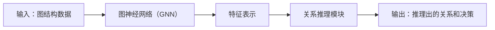

# 基于图神经网络的AI Agent关系推理

> 关键词：图神经网络、AI Agent、关系推理、深度学习、知识图谱

> 摘要：本文围绕基于图神经网络的AI Agent关系推理展开深入探讨。首先介绍了该研究的背景，包括目的、预期读者等信息。接着详细阐述了核心概念，给出了原理和架构的文本示意图及Mermaid流程图。深入讲解了核心算法原理，通过Python代码进行具体说明，并介绍了相关的数学模型和公式。通过项目实战展示了代码的实际案例和详细解释。分析了该技术的实际应用场景，推荐了相关的工具和资源。最后总结了未来发展趋势与挑战，还提供了常见问题解答和扩展阅读参考资料，旨在为读者全面呈现基于图神经网络的AI Agent关系推理的技术全貌。

## 1. 背景介绍 
### 1.1 目的和范围
随着人工智能技术的不断发展，AI Agent在各个领域得到了广泛应用。AI Agent需要具备理解和处理复杂关系的能力，以更好地完成任务和与环境交互。图神经网络（Graph Neural Networks，GNN）作为一种强大的处理图结构数据的工具，为AI Agent的关系推理提供了有效的解决方案。

本文的目的在于深入探讨基于图神经网络的AI Agent关系推理技术，包括核心概念、算法原理、数学模型、实际应用等方面。范围涵盖了从理论基础到实际项目的全流程，旨在为读者提供一个全面且深入的技术视角。

### 1.2 预期读者
本文预期读者包括人工智能领域的研究人员、开发者、学生以及对图神经网络和AI Agent关系推理感兴趣的技术爱好者。对于有一定深度学习基础的读者，能够进一步加深对该领域的理解和应用；对于初学者，也可以通过本文逐步建立起相关的知识体系。

### 1.3 文档结构概述
本文将按照以下结构进行组织：首先介绍核心概念与联系，包括图神经网络和AI Agent关系推理的基本原理和架构；接着详细讲解核心算法原理和具体操作步骤，使用Python代码进行说明；然后介绍相关的数学模型和公式，并举例说明；通过项目实战展示代码的实际应用和详细解释；分析该技术的实际应用场景；推荐相关的工具和资源；最后总结未来发展趋势与挑战，提供常见问题解答和扩展阅读参考资料。

### 1.4 术语表
#### 1.4.1 核心术语定义
- **图神经网络（Graph Neural Networks，GNN）**：是一类专门处理图结构数据的神经网络，它可以对图中的节点和边进行特征学习和表示。
- **AI Agent**：是一种能够感知环境、做出决策并采取行动的智能实体，它可以根据环境的变化动态调整自己的行为。
- **关系推理**：是指从已知的信息中推断出实体之间的关系，在AI Agent中，关系推理可以帮助Agent更好地理解环境和做出决策。

#### 1.4.2 相关概念解释
- **图结构数据**：是一种由节点和边组成的数据结构，节点表示实体，边表示实体之间的关系。例如，社交网络可以表示为一个图，用户是节点，用户之间的好友关系是边。
- **节点特征**：是指每个节点所具有的属性，例如在社交网络中，用户的年龄、性别等可以作为节点特征。
- **边特征**：是指每条边所具有的属性，例如在社交网络中，好友关系的亲密度可以作为边特征。

#### 1.4.3 缩略词列表
- **GNN**：Graph Neural Networks（图神经网络）
- **AI**：Artificial Intelligence（人工智能）

## 2. 核心概念与联系 

### 核心概念原理
#### 图神经网络（GNN）
图神经网络是一种基于图结构数据的深度学习模型，它的核心思想是通过节点之间的信息传递来学习节点的特征表示。在GNN中，每个节点会根据其邻居节点的信息更新自己的特征，经过多次迭代，节点的特征会逐渐融合周围节点的信息，从而更好地表示节点在图中的上下文信息。

常见的GNN模型包括图卷积网络（Graph Convolutional Network，GCN）、图注意力网络（Graph Attention Network，GAT）等。以GCN为例，它的基本公式为：

$$H^{(l+1)} = \sigma(\tilde{D}^{-\frac{1}{2}}\tilde{A}\tilde{D}^{-\frac{1}{2}}H^{(l)}W^{(l)})$$

其中，$H^{(l)}$ 是第 $l$ 层的节点特征矩阵，$\tilde{A} = A + I$ 是邻接矩阵加上自环，$\tilde{D}$ 是 $\tilde{A}$ 的度矩阵，$W^{(l)}$ 是第 $l$ 层的可学习权重矩阵，$\sigma$ 是激活函数。

#### AI Agent关系推理
AI Agent关系推理是指AI Agent根据已知的信息和知识，推断出实体之间的关系。在图结构数据中，AI Agent可以利用图神经网络学习到的节点和边的特征，进行关系推理。例如，在一个知识图谱中，AI Agent可以根据实体之间的语义关系和图结构信息，推断出未知的关系。

### 架构的文本示意图
```plaintext
输入：图结构数据（节点特征、边特征、邻接矩阵）
|
V
图神经网络（GNN）：
    - 节点信息传递
    - 特征更新
|
V
特征表示：节点和边的特征向量
|
V
关系推理模块：
    - 基于特征的推理算法
    - 决策生成
|
V
输出：推理出的关系和决策
```

### Mermaid流程图


## 3. 核心算法原理 & 具体操作步骤 

### 核心算法原理
本文以图卷积网络（GCN）为例，详细介绍基于图神经网络的AI Agent关系推理的核心算法原理。

GCN的核心思想是通过节点之间的信息传递来更新节点的特征。具体来说，每个节点会聚合其邻居节点的特征，并进行线性变换和非线性激活，从而得到更新后的节点特征。

### 具体操作步骤
#### 步骤1：图数据准备
首先，需要将图结构数据转换为适合GCN处理的格式。这包括节点特征矩阵 $X$、邻接矩阵 $A$ 和边特征矩阵（如果有）。

#### 步骤2：初始化权重矩阵
随机初始化GCN的权重矩阵 $W^{(l)}$，其中 $l$ 表示层数。

#### 步骤3：信息传递和特征更新
根据GCN的公式，进行多次信息传递和特征更新，直到达到预设的迭代次数。

#### 步骤4：关系推理
使用更新后的节点和边的特征，进行关系推理。可以使用分类器或回归模型来预测实体之间的关系。

### Python源代码实现
```python
import torch
import torch.nn as nn
import torch.nn.functional as F

# 定义GCN层
class GCNLayer(nn.Module):
    def __init__(self, in_features, out_features):
        super(GCNLayer, self).__init__()
        self.weight = nn.Parameter(torch.FloatTensor(in_features, out_features))
        self.reset_parameters()

    def reset_parameters(self):
        nn.init.xavier_uniform_(self.weight)

    def forward(self, x, adj):
        support = torch.mm(x, self.weight)
        output = torch.spmm(adj, support)
        return output

# 定义GCN模型
class GCN(nn.Module):
    def __init__(self, nfeat, nhid, nclass):
        super(GCN, self).__init__()
        self.gc1 = GCNLayer(nfeat, nhid)
        self.gc2 = GCNLayer(nhid, nclass)

    def forward(self, x, adj):
        x = F.relu(self.gc1(x, adj))
        x = self.gc2(x, adj)
        return F.log_softmax(x, dim=1)

# 示例数据
nfeat = 10  # 输入特征维度
nhid = 20   # 隐藏层维度
nclass = 3  # 输出类别数
x = torch.randn(100, nfeat)  # 节点特征矩阵
adj = torch.eye(100)  # 邻接矩阵

# 初始化模型
model = GCN(nfeat, nhid, nclass)

# 前向传播
output = model(x, adj)
print(output.shape)
```

### 代码解释
- `GCNLayer` 类定义了一个GCN层，包含一个可学习的权重矩阵 `weight`，并实现了信息传递和特征更新的功能。
- `GCN` 类定义了一个两层的GCN模型，通过堆叠两个GCN层实现节点特征的学习。
- 在示例代码中，我们生成了随机的节点特征矩阵和邻接矩阵，并初始化了GCN模型。最后进行前向传播，得到输出结果。

## 4. 数学模型和公式 & 详细讲解 & 举例说明 

### 图卷积网络（GCN）的数学模型
#### 基本公式
GCN的基本公式为：

$$H^{(l+1)} = \sigma(\tilde{D}^{-\frac{1}{2}}\tilde{A}\tilde{D}^{-\frac{1}{2}}H^{(l)}W^{(l)})$$

其中：
- $H^{(l)}$ 是第 $l$ 层的节点特征矩阵，形状为 $N \times F^{(l)}$，$N$ 是节点数量，$F^{(l)}$ 是第 $l$ 层的特征维度。
- $\tilde{A} = A + I$ 是邻接矩阵加上自环，$A$ 是原始邻接矩阵，$I$ 是单位矩阵。
- $\tilde{D}$ 是 $\tilde{A}$ 的度矩阵，即 $\tilde{D}_{ii} = \sum_{j} \tilde{A}_{ij}$。
- $W^{(l)}$ 是第 $l$ 层的可学习权重矩阵，形状为 $F^{(l)} \times F^{(l+1)}$。
- $\sigma$ 是激活函数，常用的激活函数有ReLU、Sigmoid等。

#### 详细讲解
- **邻接矩阵加上自环**：在邻接矩阵 $A$ 中加上自环 $I$，可以确保每个节点在信息传递过程中考虑自身的特征。
- **度矩阵归一化**：$\tilde{D}^{-\frac{1}{2}}\tilde{A}\tilde{D}^{-\frac{1}{2}}$ 是对邻接矩阵进行归一化处理，目的是平衡不同节点的度对信息传递的影响。
- **线性变换**：$H^{(l)}W^{(l)}$ 是对节点特征进行线性变换，通过可学习的权重矩阵 $W^{(l)}$ 学习节点特征的表示。
- **非线性激活**：$\sigma$ 函数引入了非线性，增加了模型的表达能力。

### 举例说明
假设我们有一个简单的图，包含3个节点，节点特征矩阵 $X$ 为：

$$X = \begin{bmatrix}
1 & 2 \\
3 & 4 \\
5 & 6
\end{bmatrix}$$

邻接矩阵 $A$ 为：

$$A = \begin{bmatrix}
0 & 1 & 1 \\
1 & 0 & 1 \\
1 & 1 & 0
\end{bmatrix}$$

加上自环后，$\tilde{A}$ 为：

$$\tilde{A} = \begin{bmatrix}
1 & 1 & 1 \\
1 & 1 & 1 \\
1 & 1 & 1
\end{bmatrix}$$

$\tilde{D}$ 为：

$$\tilde{D} = \begin{bmatrix}
3 & 0 & 0 \\
0 & 3 & 0 \\
0 & 0 & 3
\end{bmatrix}$$

$\tilde{D}^{-\frac{1}{2}}$ 为：

$$\tilde{D}^{-\frac{1}{2}} = \begin{bmatrix}
\frac{1}{\sqrt{3}} & 0 & 0 \\
0 & \frac{1}{\sqrt{3}} & 0 \\
0 & 0 & \frac{1}{\sqrt{3}}
\end{bmatrix}$$

则 $\tilde{D}^{-\frac{1}{2}}\tilde{A}\tilde{D}^{-\frac{1}{2}}$ 为：

$$\tilde{D}^{-\frac{1}{2}}\tilde{A}\tilde{D}^{-\frac{1}{2}} = \begin{bmatrix}
\frac{1}{3} & \frac{1}{3} & \frac{1}{3} \\
\frac{1}{3} & \frac{1}{3} & \frac{1}{3} \\
\frac{1}{3} & \frac{1}{3} & \frac{1}{3}
\end{bmatrix}$$

假设第一层的权重矩阵 $W^{(0)}$ 为：

$$W^{(0)} = \begin{bmatrix}
1 & 0 \\
0 & 1
\end{bmatrix}$$

则第一层的输出 $H^{(1)}$ 为：

$$H^{(1)} = \sigma(\tilde{D}^{-\frac{1}{2}}\tilde{A}\tilde{D}^{-\frac{1}{2}}XW^{(0)})$$

先计算 $\tilde{D}^{-\frac{1}{2}}\tilde{A}\tilde{D}^{-\frac{1}{2}}X$：

$$\tilde{D}^{-\frac{1}{2}}\tilde{A}\tilde{D}^{-\frac{1}{2}}X = \begin{bmatrix}
\frac{1}{3} & \frac{1}{3} & \frac{1}{3} \\
\frac{1}{3} & \frac{1}{3} & \frac{1}{3} \\
\frac{1}{3} & \frac{1}{3} & \frac{1}{3}
\end{bmatrix} \begin{bmatrix}
1 & 2 \\
3 & 4 \\
5 & 6
\end{bmatrix} = \begin{bmatrix}
3 & 4 \\
3 & 4 \\
3 & 4
\end{bmatrix}$$

再计算 $\tilde{D}^{-\frac{1}{2}}\tilde{A}\tilde{D}^{-\frac{1}{2}}XW^{(0)}$：

$$\tilde{D}^{-\frac{1}{2}}\tilde{A}\tilde{D}^{-\frac{1}{2}}XW^{(0)} = \begin{bmatrix}
3 & 4 \\
3 & 4 \\
3 & 4
\end{bmatrix} \begin{bmatrix}
1 & 0 \\
0 & 1
\end{bmatrix} = \begin{bmatrix}
3 & 4 \\
3 & 4 \\
3 & 4
\end{bmatrix}$$

假设激活函数 $\sigma$ 为ReLU，则 $H^{(1)}$ 为：

$$H^{(1)} = \begin{bmatrix}
3 & 4 \\
3 & 4 \\
3 & 4
\end{bmatrix}$$

通过这个例子，我们可以看到GCN是如何通过信息传递和特征更新来学习节点的特征表示的。

## 5. 项目实战：代码实际案例和详细解释说明 

### 5.1  开发环境搭建
#### 安装Python
首先，需要安装Python环境，建议使用Python 3.7及以上版本。可以从Python官方网站（https://www.python.org/downloads/）下载并安装。

#### 安装深度学习框架
本文使用PyTorch作为深度学习框架，可以根据自己的系统和CUDA版本选择合适的安装方式。可以参考PyTorch官方网站（https://pytorch.org/get-started/locally/）进行安装。

#### 安装其他依赖库
还需要安装一些其他的依赖库，如 `numpy`、`scipy` 等。可以使用以下命令进行安装：

```sh
pip install numpy scipy
```

### 5.2  源代码详细实现和代码解读
#### 数据集准备
我们使用Cora数据集作为示例，Cora数据集是一个常用的图数据分类数据集，包含2708篇科学出版物，分为7个类别。可以使用 `torch_geometric` 库来加载Cora数据集。

```python
from torch_geometric.datasets import Planetoid
import torch_geometric.transforms as T

# 加载Cora数据集
dataset = Planetoid(root='data/Cora', name='Cora', transform=T.NormalizeFeatures())
data = dataset[0]
```

#### 定义GCN模型
```python
import torch
import torch.nn as nn
import torch.nn.functional as F
from torch_geometric.nn import GCNConv

class GCN(nn.Module):
    def __init__(self, in_channels, hidden_channels, out_channels):
        super(GCN, self).__init__()
        self.conv1 = GCNConv(in_channels, hidden_channels)
        self.conv2 = GCNConv(hidden_channels, out_channels)

    def forward(self, x, edge_index):
        x = self.conv1(x, edge_index)
        x = F.relu(x)
        x = F.dropout(x, training=self.training)
        x = self.conv2(x, edge_index)
        return F.log_softmax(x, dim=1)
```

#### 模型训练和评估
```python
import torch.optim as optim

# 初始化模型
model = GCN(dataset.num_node_features, 16, dataset.num_classes)
optimizer = optim.Adam(model.parameters(), lr=0.01, weight_decay=5e-4)

def train():
    model.train()
    optimizer.zero_grad()
    out = model(data.x, data.edge_index)
    loss = F.nll_loss(out[data.train_mask], data.y[data.train_mask])
    loss.backward()
    optimizer.step()
    return loss.item()

def test():
    model.eval()
    out = model(data.x, data.edge_index)
    pred = out.argmax(dim=1)
    test_correct = pred[data.test_mask] == data.y[data.test_mask]
    test_acc = int(test_correct.sum()) / int(data.test_mask.sum())
    return test_acc

for epoch in range(200):
    loss = train()
    if (epoch + 1) % 10 == 0:
        test_acc = test()
        print(f'Epoch: {epoch+1}, Loss: {loss:.4f}, Test Acc: {test_acc:.4f}')
```

### 5.3  代码解读与分析
- **数据集准备**：使用 `torch_geometric` 库加载Cora数据集，并进行特征归一化处理。
- **模型定义**：定义了一个两层的GCN模型，使用 `GCNConv` 层进行信息传递和特征更新。
- **模型训练**：使用Adam优化器进行模型训练，损失函数为负对数似然损失（NLL Loss）。
- **模型评估**：在测试集上评估模型的准确率。

通过训练和评估，我们可以看到模型在Cora数据集上的性能表现。

## 6. 实际应用场景 
### 社交网络分析
在社交网络中，用户之间的关系可以用图来表示，节点表示用户，边表示用户之间的好友关系。基于图神经网络的AI Agent可以通过关系推理，发现用户之间的潜在关系，如推荐好友、预测用户的兴趣等。

### 知识图谱补全
知识图谱是一种大规模的语义网络，包含了大量的实体和关系。基于图神经网络的AI Agent可以利用图结构和节点特征，进行关系推理，补全知识图谱中缺失的关系，提高知识图谱的完整性和准确性。

### 药物发现
在药物发现领域，分子可以用图来表示，节点表示原子，边表示原子之间的化学键。基于图神经网络的AI Agent可以通过关系推理，预测分子之间的相互作用和药物的疗效，加速药物研发的过程。

### 交通流量预测
在交通网络中，路口和路段可以用图来表示，节点表示路口，边表示路段。基于图神经网络的AI Agent可以通过关系推理，预测交通流量的变化，优化交通信号控制，缓解交通拥堵。

## 7. 工具和资源推荐
### 7.1 学习资源推荐
#### 7.1.1 书籍推荐
- 《深度学习》（Deep Learning）：由Ian Goodfellow、Yoshua Bengio和Aaron Courville所著，是深度学习领域的经典教材，涵盖了神经网络、深度学习模型等方面的知识。
- 《图神经网络：基础、前沿与应用》：全面介绍了图神经网络的基本原理、算法和应用，适合对图神经网络感兴趣的读者。

#### 7.1.2 在线课程
- Coursera上的“Deep Learning Specialization”：由Andrew Ng教授主讲，是深度学习领域的经典在线课程，涵盖了神经网络、卷积神经网络、循环神经网络等方面的知识。
- edX上的“Graph Neural Networks”：专门介绍图神经网络的原理和应用，适合对图神经网络感兴趣的学习者。

#### 7.1.3 技术博客和网站
- Medium上的“Towards Data Science”：是一个数据科学和机器学习领域的技术博客，经常发布图神经网络和AI Agent相关的文章。
- arXiv.org：是一个预印本平台，提供了大量的最新研究论文，包括图神经网络和AI Agent领域的研究成果。

### 7.2 开发工具框架推荐
#### 7.2.1 IDE和编辑器
- PyCharm：是一款专业的Python集成开发环境，提供了丰富的代码编辑、调试和项目管理功能，适合Python开发。
- Jupyter Notebook：是一个交互式的开发环境，适合进行数据分析、模型训练和可视化等工作。

#### 7.2.2 调试和性能分析工具
- PyTorch Profiler：是PyTorch自带的性能分析工具，可以帮助开发者分析模型的运行时间、内存使用等情况，优化模型性能。
- TensorBoard：是TensorFlow的可视化工具，也可以与PyTorch结合使用，用于可视化模型的训练过程和性能指标。

#### 7.2.3 相关框架和库
- PyTorch Geometric：是一个基于PyTorch的图神经网络库，提供了丰富的图数据处理和图神经网络模型的实现，方便开发者进行图神经网络的开发和研究。
- DGL（Deep Graph Library）：是一个用于图神经网络的深度学习框架，支持多种深度学习后端，如PyTorch、TensorFlow等。

### 7.3 相关论文著作推荐
#### 7.3.1 经典论文
- “Semi-Supervised Classification with Graph Convolutional Networks”：提出了图卷积网络（GCN）的基本思想和算法，是图神经网络领域的经典论文。
- “Graph Attention Networks”：提出了图注意力网络（GAT），通过引入注意力机制，提高了图神经网络的性能。

#### 7.3.2 最新研究成果
- 可以关注ICML、NeurIPS、AAAI等顶级人工智能会议的论文，了解图神经网络和AI Agent关系推理领域的最新研究成果。

#### 7.3.3 应用案例分析
- 一些实际应用案例的论文可以帮助我们了解基于图神经网络的AI Agent关系推理在不同领域的应用情况，如社交网络分析、知识图谱补全等。

## 8. 总结：未来发展趋势与挑战
### 未来发展趋势
#### 模型性能提升
未来，图神经网络模型将不断改进和优化，提高模型的性能和表达能力。例如，引入更复杂的注意力机制、结合其他深度学习模型等。

#### 多模态融合
将图神经网络与其他模态的数据（如图像、文本、音频等）进行融合，实现多模态的关系推理，拓展AI Agent的应用场景。

#### 可解释性增强
随着AI技术的广泛应用，模型的可解释性变得越来越重要。未来，将研究如何提高基于图神经网络的AI Agent关系推理模型的可解释性，使模型的决策过程更加透明和可理解。

### 挑战
#### 数据质量和规模
图结构数据的质量和规模对模型的性能有很大影响。如何获取高质量、大规模的图数据，并进行有效的数据预处理，是一个挑战。

#### 计算资源需求
图神经网络模型的训练和推理需要大量的计算资源，特别是在处理大规模图数据时。如何优化模型的计算效率，降低计算资源需求，是一个亟待解决的问题。

#### 模型可扩展性
随着图数据的规模不断增大，模型的可扩展性变得越来越重要。如何设计可扩展的图神经网络模型，以适应大规模图数据的处理，是一个挑战。

## 9. 附录：常见问题与解答
### 问题1：图神经网络和传统神经网络有什么区别？
图神经网络专门处理图结构数据，考虑了节点之间的关系和图的拓扑结构；而传统神经网络主要处理欧几里得空间的数据，如向量、矩阵等，不考虑数据之间的关系。

### 问题2：如何选择合适的图神经网络模型？
选择合适的图神经网络模型需要考虑数据的特点、任务的需求和计算资源等因素。例如，如果数据具有较强的局部结构，可以选择图卷积网络（GCN）；如果需要考虑节点之间的重要性差异，可以选择图注意力网络（GAT）。

### 问题3：图神经网络的训练时间较长怎么办？
可以采取以下措施来缩短图神经网络的训练时间：
- 优化模型结构，减少模型的参数数量。
- 使用更高效的计算设备，如GPU。
- 采用分布式训练的方法，并行计算。

### 问题4：如何评估基于图神经网络的AI Agent关系推理模型的性能？
可以使用准确率、召回率、F1值等指标来评估模型的分类性能；对于回归任务，可以使用均方误差（MSE）、平均绝对误差（MAE）等指标来评估模型的性能。

## 10. 扩展阅读 & 参考资料
### 扩展阅读
- 可以阅读更多关于图神经网络和AI Agent的研究论文和技术博客，深入了解该领域的最新进展。
- 尝试使用不同的图神经网络模型和数据集进行实验，提高自己的实践能力。

### 参考资料
- Goodfellow, I., Bengio, Y., & Courville, A. (2016). Deep Learning. MIT Press.
- Kipf, T. N., & Welling, M. (2016). Semi-Supervised Classification with Graph Convolutional Networks. arXiv preprint arXiv:1609.02907.
- Veličković, P., Cucurull, G., Casanova, A., Romero, A., Lio, P., & Bengio, Y. (2017). Graph Attention Networks. arXiv preprint arXiv:1710.10903.