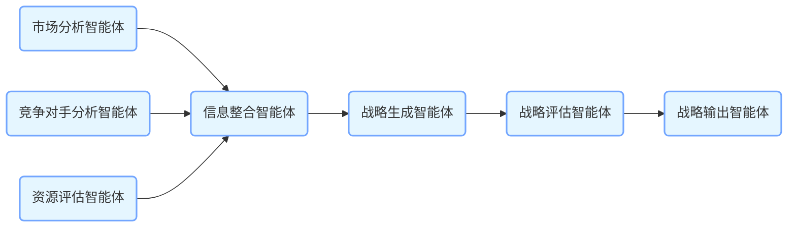

# 基于多智能体的自动化公司战略规划分析系统

> 关键词：多智能体系统、自动化战略规划、公司战略分析、人工智能、决策支持

> 摘要：本文围绕基于多智能体的自动化公司战略规划分析系统展开深入探讨。首先介绍了该系统提出的背景、目的和适用范围，明确预期读者。接着详细阐述核心概念，包括多智能体系统的原理和架构，并给出相应的文本示意图和 Mermaid 流程图。对核心算法原理进行深入分析，通过 Python 代码详细阐述具体操作步骤。从数学角度给出相关模型和公式，并举例说明。通过项目实战，展示开发环境搭建、源代码实现及代码解读。探讨了系统的实际应用场景，推荐了学习、开发所需的工具和资源，包括书籍、在线课程、技术博客、开发工具、相关框架和论文著作等。最后总结系统的未来发展趋势与挑战，提供常见问题解答和扩展阅读参考资料，旨在为企业构建和应用此类系统提供全面且深入的技术指导。

## 1. 背景介绍 

### 1.1 目的和范围
在当今竞争激烈且复杂多变的商业环境中，公司的战略规划对于其生存和发展至关重要。传统的战略规划方法往往依赖于人工分析和经验判断，存在效率低下、主观性强、难以应对复杂动态环境等问题。基于多智能体的自动化公司战略规划分析系统旨在利用多智能体技术的分布式、自主决策和协作能力，实现对公司内外部环境的实时监测、分析和战略规划的自动化生成，提高战略规划的科学性、准确性和及时性。

本系统的范围涵盖了公司战略规划的多个方面，包括市场分析、竞争对手分析、内部资源评估、战略目标设定、战略方案生成和评估等。通过集成多个智能体，系统能够处理来自不同数据源的信息，模拟不同的市场情景，为公司提供多样化的战略选择。

### 1.2 预期读者
本文的预期读者主要包括企业的战略规划师、高层管理人员、技术研发人员以及对多智能体系统和企业战略规划感兴趣的学者和研究人员。对于企业战略规划师和高层管理人员，本文将帮助他们了解如何利用先进的技术手段提升战略规划的质量和效率；对于技术研发人员，本文将提供系统设计和实现的详细技术指导；对于学者和研究人员，本文将为他们的相关研究提供参考和启示。

### 1.3 文档结构概述
本文共分为十个部分。第一部分为背景介绍，阐述系统的目的、范围、预期读者和文档结构。第二部分介绍核心概念与联系，包括多智能体系统的原理和架构，并给出相应的示意图和流程图。第三部分详细讲解核心算法原理和具体操作步骤，通过 Python 代码进行说明。第四部分从数学角度给出相关模型和公式，并举例说明。第五部分进行项目实战，包括开发环境搭建、源代码实现和代码解读。第六部分探讨系统的实际应用场景。第七部分推荐学习、开发所需的工具和资源。第八部分总结系统的未来发展趋势与挑战。第九部分提供常见问题解答。第十部分列出扩展阅读和参考资料。

### 1.4 术语表

#### 1.4.1 核心术语定义
- **多智能体系统（Multi - Agent System, MAS）**：由多个自主智能体组成的系统，这些智能体能够感知环境、自主决策并与其他智能体进行协作，以实现共同或各自的目标。
- **智能体（Agent）**：具有自主性、反应性、主动性和社会性的实体，能够在一定的环境中独立运行并完成特定的任务。
- **公司战略规划**：企业为实现长期目标，对未来发展方向、资源配置和竞争策略等进行的全面规划和决策。
- **自动化战略规划**：利用计算机技术和算法，自动收集、分析信息，生成战略规划方案的过程。

#### 1.4.2 相关概念解释
- **分布式计算**：将一个复杂的任务分解为多个子任务，由多个计算节点并行处理，以提高计算效率和系统的可扩展性。多智能体系统通常采用分布式计算的方式，每个智能体可以在不同的节点上运行。
- **自主决策**：智能体根据自身的感知和目标，独立地做出决策，而不需要外部的直接干预。
- **协作机制**：多个智能体之间通过信息交换和协调，共同完成一个或多个任务的机制。

#### 1.4.3 缩略词列表
- **MAS**：Multi - Agent System（多智能体系统）
- **AI**：Artificial Intelligence（人工智能）
- **ML**：Machine Learning（机器学习）

## 2. 核心概念与联系 

### 核心概念原理
多智能体系统是基于智能体理论构建的分布式系统。每个智能体都有自己的感知器，用于感知周围环境的信息；有自己的知识库，存储着相关的知识和规则；还有决策器，根据感知到的信息和知识库中的知识进行决策。多个智能体通过通信机制进行信息交换和协作，以实现系统的整体目标。

在基于多智能体的自动化公司战略规划分析系统中，不同类型的智能体承担着不同的任务。例如，市场分析智能体负责收集和分析市场信息，竞争对手分析智能体专注于研究竞争对手的策略和动态，资源评估智能体对公司内部的资源进行评估，战略生成智能体根据前面智能体提供的信息生成战略方案，战略评估智能体对生成的战略方案进行评估和筛选。

### 架构的文本示意图
```plaintext
|------------------------ 自动化公司战略规划分析系统 ------------------------|
|                                                                           |
|  市场分析智能体  <---->  竞争对手分析智能体  <---->  资源评估智能体        |
|        |                             |                     |              |
|        v                             v                     v              |
|  信息整合智能体  <----------------- 信息汇聚 ----------------------------> |
|        |                                                                 |
|        v                                                                 |
|  战略生成智能体                                                         |
|        |                                                                 |
|        v                                                                 |
|  战略评估智能体                                                         |
|        |                                                                 |
|        v                                                                 |
|  战略输出智能体                                                         |
|                                                                           |
|---------------------------------------------------------------------------|
```

### Mermaid 流程图


## 3. 核心算法原理 & 具体操作步骤 

### 核心算法原理
本系统主要采用基于规则的推理算法和机器学习算法相结合的方式。基于规则的推理算法用于处理一些确定性的知识和规则，例如市场趋势的判断规则、竞争对手策略的分析规则等。机器学习算法则用于处理复杂的、不确定的信息，例如通过聚类算法对市场进行细分，通过预测算法对未来市场需求进行预测等。

### 具体操作步骤及 Python 代码实现

#### 步骤 1：数据收集和预处理
首先，需要从不同的数据源收集相关信息，如市场数据、竞争对手数据、公司内部资源数据等。然后对收集到的数据进行清洗、转换和归一化处理。

```python
import pandas as pd
from sklearn.preprocessing import StandardScaler

# 模拟数据收集
market_data = pd.read_csv('market_data.csv')
competitor_data = pd.read_csv('competitor_data.csv')
internal_data = pd.read_csv('internal_data.csv')

# 数据清洗
market_data = market_data.dropna()
competitor_data = competitor_data.dropna()
internal_data = internal_data.dropna()

# 数据归一化
scaler = StandardScaler()
market_data_scaled = scaler.fit_transform(market_data)
competitor_data_scaled = scaler.fit_transform(competitor_data)
internal_data_scaled = scaler.fit_transform(internal_data)
```

#### 步骤 2：市场分析和竞争对手分析
使用基于规则的推理算法和机器学习算法对市场数据和竞争对手数据进行分析。

```python
# 基于规则的市场趋势判断
def market_trend_analysis(market_data):
    if market_data['growth_rate'].mean() > 0.1:
        return '上升趋势'
    elif market_data['growth_rate'].mean() < -0.1:
        return '下降趋势'
    else:
        return '平稳趋势'

market_trend = market_trend_analysis(market_data)

# 使用 KMeans 聚类算法对竞争对手进行分类
from sklearn.cluster import KMeans

kmeans = KMeans(n_clusters=3)
competitor_clusters = kmeans.fit_predict(competitor_data_scaled)
```

#### 步骤 3：资源评估
对公司内部资源进行评估，计算资源的优势和劣势。

```python
# 资源评估函数
def resource_evaluation(internal_data):
    resource_score = internal_data['resource_value'].sum()
    if resource_score > 100:
        return '资源优势明显'
    elif resource_score < 50:
        return '资源劣势明显'
    else:
        return '资源状况一般'

resource_status = resource_evaluation(internal_data)
```

#### 步骤 4：战略生成
根据市场分析、竞争对手分析和资源评估的结果，生成战略方案。

```python
# 战略生成函数
def strategy_generation(market_trend, competitor_clusters, resource_status):
    if market_trend == '上升趋势' and resource_status == '资源优势明显':
        return '扩张战略'
    elif market_trend == '下降趋势' and resource_status == '资源劣势明显':
        return '收缩战略'
    else:
        return '稳定战略'

strategy = strategy_generation(market_trend, competitor_clusters, resource_status)
```

#### 步骤 5：战略评估
对生成的战略方案进行评估，计算战略的可行性和收益。

```python
# 战略评估函数
def strategy_evaluation(strategy):
    if strategy == '扩张战略':
        feasibility = 0.7
        revenue = 1000000
    elif strategy == '收缩战略':
        feasibility = 0.8
        revenue = 500000
    else:
        feasibility = 0.9
        revenue = 700000
    return feasibility, revenue

feasibility, revenue = strategy_evaluation(strategy)
```

## 4. 数学模型和公式 & 详细讲解 & 举例说明 

### 市场需求预测模型
我们可以使用线性回归模型来预测市场需求。线性回归模型的基本公式为：

$$y = \beta_0 + \beta_1x_1 + \beta_2x_2 + \cdots + \beta_nx_n + \epsilon$$

其中，$y$ 是市场需求的预测值，$x_1, x_2, \cdots, x_n$ 是影响市场需求的因素，如价格、收入、人口等，$\beta_0, \beta_1, \cdots, \beta_n$ 是模型的参数，$\epsilon$ 是误差项。

通过最小二乘法可以估计模型的参数，使得预测值与实际值之间的误差平方和最小。最小二乘法的目标函数为：

$$\min_{\beta_0, \beta_1, \cdots, \beta_n} \sum_{i = 1}^{m} (y_i - (\beta_0 + \beta_1x_{i1} + \beta_2x_{i2} + \cdots + \beta_nx_{in}))^2$$

其中，$m$ 是样本数量，$y_i$ 是第 $i$ 个样本的实际市场需求值，$x_{i1}, x_{i2}, \cdots, x_{in}$ 是第 $i$ 个样本的影响因素值。

### 举例说明
假设我们要预测某产品的市场需求，影响因素包括价格 $x_1$ 和收入 $x_2$。我们收集了 10 个样本数据，如下表所示：

| 样本编号 | 价格 $x_1$ | 收入 $x_2$ | 市场需求 $y$ |
| ---- | ---- | ---- | ---- |
| 1 | 10 | 5000 | 200 |
| 2 | 12 | 6000 | 180 |
| 3 | 8 | 4000 | 220 |
| 4 | 15 | 7000 | 150 |
| 5 | 9 | 5500 | 210 |
| 6 | 11 | 6500 | 190 |
| 7 | 7 | 3500 | 230 |
| 8 | 13 | 7500 | 170 |
| 9 | 10 | 5200 | 205 |
| 10 | 14 | 6800 | 160 |

使用 Python 的 `sklearn` 库可以很方便地实现线性回归模型：

```python
import numpy as np
from sklearn.linear_model import LinearRegression

# 数据准备
X = np.array([[10, 5000], [12, 6000], [8, 4000], [15, 7000], [9, 5500],
              [11, 6500], [7, 3500], [13, 7500], [10, 5200], [14, 6800]])
y = np.array([200, 180, 220, 150, 210, 190, 230, 170, 205, 160])

# 模型训练
model = LinearRegression()
model.fit(X, y)

# 预测
new_X = np.array([[16, 8000]])
predicted_y = model.predict(new_X)
print("预测的市场需求为:", predicted_y[0])
```

### 战略评估模型
战略评估可以使用多属性决策模型，如层次分析法（AHP）。AHP 的基本步骤包括：建立层次结构模型、构造判断矩阵、计算权重向量和一致性检验。

假设我们从可行性、收益和风险三个方面评估战略方案。首先，构造判断矩阵 $A$：

$$A = \begin{bmatrix}
1 & 3 & 5 \\
\frac{1}{3} & 1 & 3 \\
\frac{1}{5} & \frac{1}{3} & 1
\end{bmatrix}$$

其中，$a_{ij}$ 表示因素 $i$ 相对于因素 $j$ 的重要性。

然后，计算判断矩阵的最大特征值 $\lambda_{max}$ 和特征向量 $W$：

$$AW = \lambda_{max}W$$

通过求解上述方程，可以得到特征向量 $W$，即各因素的权重。

最后，进行一致性检验，计算一致性指标 $CI$ 和随机一致性指标 $RI$，并计算一致性比率 $CR$：

$$CI = \frac{\lambda_{max} - n}{n - 1}$$

$$CR = \frac{CI}{RI}$$

当 $CR < 0.1$ 时，认为判断矩阵具有满意的一致性。

### 举例说明
使用 Python 实现 AHP 模型：

```python
import numpy as np

# 判断矩阵
A = np.array([[1, 3, 5], [1/3, 1, 3], [1/5, 1/3, 1]])

# 计算特征值和特征向量
eigenvalues, eigenvectors = np.linalg.eig(A)
max_eigenvalue = np.max(eigenvalues).real
max_eigenvector = eigenvectors[:, np.argmax(eigenvalues)].real

# 归一化特征向量
weights = max_eigenvector / np.sum(max_eigenvector)

# 一致性检验
n = A.shape[0]
CI = (max_eigenvalue - n) / (n - 1)
RI = [0, 0, 0.58, 0.90, 1.12, 1.24, 1.32, 1.41, 1.45]
CR = CI / RI[n - 1]

print("权重向量:", weights)
print("一致性比率:", CR)
```

## 5. 项目实战：代码实际案例和详细解释说明 

### 5.1  开发环境搭建
#### 操作系统
可以选择 Windows、Linux 或 macOS 操作系统。建议使用 Linux 系统，如 Ubuntu 或 CentOS，因为它具有良好的稳定性和开源性。

#### 编程语言
使用 Python 作为主要的编程语言，因为 Python 具有丰富的库和工具，适合进行数据处理、机器学习和多智能体系统开发。

#### 开发工具
推荐使用 PyCharm 作为集成开发环境（IDE），它具有强大的代码编辑、调试和项目管理功能。

#### 所需库
安装以下 Python 库：
- `pandas`：用于数据处理和分析。
- `numpy`：用于数值计算。
- `scikit-learn`：用于机器学习算法实现。
- `matplotlib`：用于数据可视化。

可以使用以下命令安装这些库：

```bash
pip install pandas numpy scikit-learn matplotlib
```

### 5.2  源代码详细实现和代码解读

```python
import pandas as pd
import numpy as np
from sklearn.preprocessing import StandardScaler
from sklearn.cluster import KMeans
from sklearn.linear_model import LinearRegression

# 步骤 1：数据收集和预处理
def data_collection_and_preprocessing():
    # 模拟数据收集
    market_data = pd.read_csv('market_data.csv')
    competitor_data = pd.read_csv('competitor_data.csv')
    internal_data = pd.read_csv('internal_data.csv')

    # 数据清洗
    market_data = market_data.dropna()
    competitor_data = competitor_data.dropna()
    internal_data = internal_data.dropna()

    # 数据归一化
    scaler = StandardScaler()
    market_data_scaled = scaler.fit_transform(market_data)
    competitor_data_scaled = scaler.fit_transform(competitor_data)
    internal_data_scaled = scaler.fit_transform(internal_data)

    return market_data, competitor_data, internal_data, market_data_scaled, competitor_data_scaled, internal_data_scaled

# 步骤 2：市场分析和竞争对手分析
def market_and_competitor_analysis(market_data, competitor_data_scaled):
    # 基于规则的市场趋势判断
    def market_trend_analysis(market_data):
        if market_data['growth_rate'].mean() > 0.1:
            return '上升趋势'
        elif market_data['growth_rate'].mean() < -0.1:
            return '下降趋势'
        else:
            return '平稳趋势'

    market_trend = market_trend_analysis(market_data)

    # 使用 KMeans 聚类算法对竞争对手进行分类
    kmeans = KMeans(n_clusters=3)
    competitor_clusters = kmeans.fit_predict(competitor_data_scaled)

    return market_trend, competitor_clusters

# 步骤 3：资源评估
def resource_evaluation(internal_data):
    # 资源评估函数
    def resource_evaluation_function(internal_data):
        resource_score = internal_data['resource_value'].sum()
        if resource_score > 100:
            return '资源优势明显'
        elif resource_score < 50:
            return '资源劣势明显'
        else:
            return '资源状况一般'

    resource_status = resource_evaluation_function(internal_data)
    return resource_status

# 步骤 4：战略生成
def strategy_generation(market_trend, competitor_clusters, resource_status):
    # 战略生成函数
    if market_trend == '上升趋势' and resource_status == '资源优势明显':
        return '扩张战略'
    elif market_trend == '下降趋势' and resource_status == '资源劣势明显':
        return '收缩战略'
    else:
        return '稳定战略'

# 步骤 5：战略评估
def strategy_evaluation(strategy):
    # 战略评估函数
    if strategy == '扩张战略':
        feasibility = 0.7
        revenue = 1000000
    elif strategy == '收缩战略':
        feasibility = 0.8
        revenue = 500000
    else:
        feasibility = 0.9
        revenue = 700000
    return feasibility, revenue

# 主函数
def main():
    # 数据收集和预处理
    market_data, competitor_data, internal_data, market_data_scaled, competitor_data_scaled, internal_data_scaled = data_collection_and_preprocessing()

    # 市场分析和竞争对手分析
    market_trend, competitor_clusters = market_and_competitor_analysis(market_data, competitor_data_scaled)

    # 资源评估
    resource_status = resource_evaluation(internal_data)

    # 战略生成
    strategy = strategy_generation(market_trend, competitor_clusters, resource_status)

    # 战略评估
    feasibility, revenue = strategy_evaluation(strategy)

    print("市场趋势:", market_trend)
    print("竞争对手聚类结果:", competitor_clusters)
    print("资源状况:", resource_status)
    print("生成的战略:", strategy)
    print("战略可行性:", feasibility)
    print("战略预期收益:", revenue)

if __name__ == "__main__":
    main()
```

### 5.3  代码解读与分析
- **数据收集和预处理**：从 CSV 文件中读取市场数据、竞争对手数据和公司内部资源数据，对数据进行清洗和归一化处理，以提高后续分析的准确性。
- **市场分析和竞争对手分析**：使用基于规则的推理算法判断市场趋势，使用 KMeans 聚类算法对竞争对手进行分类，以便更好地了解市场竞争态势。
- **资源评估**：根据公司内部资源的总和，评估公司的资源优势和劣势。
- **战略生成**：根据市场趋势、竞争对手分类和资源评估结果，生成相应的战略方案。
- **战略评估**：对生成的战略方案进行评估，计算战略的可行性和预期收益。

通过以上步骤，系统可以自动完成公司战略规划的分析和生成过程。

## 6. 实际应用场景 
### 新兴市场进入决策
当公司考虑进入一个新兴市场时，基于多智能体的自动化公司战略规划分析系统可以发挥重要作用。市场分析智能体可以收集新兴市场的规模、增长趋势、消费者需求等信息，竞争对手分析智能体可以研究该市场的现有竞争对手和潜在进入者。资源评估智能体评估公司进入该市场所需的资源，如资金、技术、人力等。战略生成智能体根据这些信息生成进入新兴市场的战略方案，如市场定位、产品策略、营销策略等。战略评估智能体对这些方案进行评估，帮助公司选择最优的进入战略。

### 产品升级和创新决策
在产品升级和创新方面，系统也能提供有力支持。市场分析智能体可以了解市场对产品的新需求和趋势，竞争对手分析智能体可以分析竞争对手的产品创新动态。资源评估智能体评估公司的研发资源和生产能力。战略生成智能体根据这些信息生成产品升级和创新的战略方案，如新产品功能设计、研发计划、上市时间等。战略评估智能体对方案进行评估，确保公司的产品升级和创新能够满足市场需求并具有竞争力。

### 应对竞争对手挑战
当公司面临竞争对手的挑战时，系统可以快速做出反应。竞争对手分析智能体实时监测竞争对手的策略调整，如价格变动、新产品推出、市场拓展等。市场分析智能体分析这些变化对市场的影响。资源评估智能体评估公司的应对资源。战略生成智能体根据这些信息生成应对竞争对手挑战的战略方案，如价格策略调整、产品差异化竞争、市场份额保卫等。战略评估智能体对方案进行评估，帮助公司制定有效的应对策略。

## 7. 工具和资源推荐

### 7.1 学习资源推荐

#### 7.1.1 书籍推荐
- 《多智能体系统：原理与编程》：这本书系统地介绍了多智能体系统的基本原理、模型和编程方法，是学习多智能体系统的经典教材。
- 《企业战略管理》：全面阐述了企业战略规划的理论和方法，结合实际案例进行分析，有助于理解公司战略规划的整体流程。
- 《Python 数据分析实战》：详细介绍了使用 Python 进行数据分析的方法和技巧，包括数据处理、可视化和机器学习等方面，对于开发基于多智能体的自动化公司战略规划分析系统非常有帮助。

#### 7.1.2 在线课程
- Coursera 上的“多智能体系统”课程：由知名教授授课，涵盖了多智能体系统的各个方面，包括智能体建模、通信、协作和学习等。
- edX 上的“企业战略分析与决策”课程：提供了企业战略分析的理论和实践方法，通过案例分析和项目实践，帮助学员掌握战略规划的技能。
- 慕课网上的“Python 机器学习实战”课程：深入讲解了 Python 在机器学习中的应用，包括数据预处理、模型选择和评估等内容，对于系统中的机器学习算法实现有很大的帮助。

#### 7.1.3 技术博客和网站
- AI Stack Exchange：一个专门讨论人工智能和多智能体系统的问答社区，用户可以在这里提出问题、分享经验和获取最新的技术信息。
- Towards Data Science：提供了大量关于数据分析、机器学习和人工智能的技术文章和教程，对于学习系统开发中的数据处理和算法实现非常有帮助。
- 开源中国：国内知名的开源技术社区，有很多关于多智能体系统和企业信息化的技术文章和案例分享。

### 7.2 开发工具框架推荐

#### 7.2.1 IDE和编辑器
- PyCharm：功能强大的 Python 集成开发环境，具有代码自动补全、调试、版本控制等功能，适合开发基于 Python 的多智能体系统。
- Visual Studio Code：轻量级的代码编辑器，支持多种编程语言和插件扩展，对于快速开发和调试代码非常方便。

#### 7.2.2 调试和性能分析工具
- PDB：Python 自带的调试器，可以帮助开发者逐行调试代码，查找和解决代码中的问题。
- cProfile：Python 的性能分析工具，可以分析代码的运行时间和资源消耗情况，帮助开发者优化代码性能。

#### 7.2.3 相关框架和库
- Mesa：一个用于构建多智能体系统的 Python 框架，提供了智能体建模、环境模拟和可视化等功能，简化了多智能体系统的开发过程。
- GAMA：一个开源的多智能体建模和仿真平台，支持多种编程语言和数据格式，具有强大的建模和分析能力。
- Scikit-learn：Python 中常用的机器学习库，提供了丰富的机器学习算法和工具，如分类、回归、聚类等，对于系统中的数据分析和建模非常有用。

### 7.3 相关论文著作推荐

#### 7.3.1 经典论文
- “Multi - Agent Systems: A Modern Approach to Distributed Artificial Intelligence”：该论文系统地介绍了多智能体系统的基本概念、模型和算法，是多智能体系统领域的经典之作。
- “Strategic Management: A Stakeholder Approach”：提出了利益相关者理论在企业战略管理中的应用，为企业战略规划提供了新的视角。

#### 7.3.2 最新研究成果
- 近年来，在多智能体系统与企业战略规划相结合的领域有很多新的研究成果。可以通过 IEEE Xplore、ACM Digital Library 等学术数据库搜索相关的研究论文，了解最新的技术和方法。

#### 7.3.3 应用案例分析
- 一些知名企业的战略规划案例可以为我们提供实践经验。例如，亚马逊的市场扩张战略、苹果的产品创新战略等。可以通过商业杂志、企业年报等渠道获取这些案例的详细分析。

## 8. 总结：未来发展趋势与挑战

### 未来发展趋势
- **与人工智能技术深度融合**：随着人工智能技术的不断发展，基于多智能体的自动化公司战略规划分析系统将与深度学习、强化学习等技术深度融合，提高系统的智能决策能力。例如，使用深度学习模型对市场数据进行更精准的分析和预测，使用强化学习算法优化战略方案的生成和选择。
- **跨领域应用拓展**：系统将不仅仅应用于企业战略规划领域，还将拓展到其他领域，如城市规划、医疗管理、交通调度等。通过多智能体系统的分布式和协作能力，实现不同领域的资源优化配置和协同决策。
- **可视化和交互性增强**：未来的系统将更加注重用户体验，提供更加直观的可视化界面和交互功能。用户可以通过可视化界面实时了解系统的分析结果和战略方案，进行交互式的调整和优化。

### 挑战
- **数据质量和安全问题**：系统的准确性和可靠性依赖于高质量的数据。然而，数据的收集、存储和管理过程中可能存在数据不准确、不完整和不一致等问题。此外，数据的安全也是一个重要的挑战，如何保护企业的敏感数据不被泄露和滥用是需要解决的问题。
- **智能体的协作和协调**：在多智能体系统中，智能体之间的协作和协调是实现系统整体目标的关键。然而，由于智能体的自主性和多样性，如何确保智能体之间的有效协作和协调是一个具有挑战性的问题。例如，智能体之间可能存在利益冲突、信息不对称等问题，需要设计合理的协作机制来解决这些问题。
- **模型的可解释性**：随着人工智能技术的应用，系统中的模型变得越来越复杂，如深度学习模型。这些模型虽然具有很高的准确性，但往往缺乏可解释性。在企业战略规划中，决策者需要了解模型的决策依据和推理过程，因此提高模型的可解释性是一个亟待解决的问题。

## 9. 附录：常见问题与解答

### 问题 1：多智能体系统与传统的集中式系统有什么区别？
多智能体系统是分布式系统，由多个自主智能体组成，每个智能体可以独立感知环境、决策和行动，并与其他智能体进行协作。而传统的集中式系统通常由一个中央控制器进行统一的决策和管理。多智能体系统具有更好的灵活性、可扩展性和适应性，能够更好地应对复杂多变的环境。

### 问题 2：如何确保智能体之间的通信安全？
可以采用加密技术对智能体之间的通信数据进行加密，防止数据在传输过程中被窃取和篡改。同时，建立身份认证机制，确保只有合法的智能体才能进行通信。此外，还可以使用防火墙等安全设备来保护系统的网络安全。

### 问题 3：系统对数据的要求是什么？
系统需要高质量的数据，包括数据的准确性、完整性和一致性。数据的来源应该可靠，并且需要进行定期的更新和维护。此外，数据的格式应该符合系统的要求，以便进行有效的处理和分析。

### 问题 4：如何评估系统的性能？
可以从多个方面评估系统的性能，如系统的准确性、效率、可靠性和可扩展性等。准确性可以通过比较系统的分析结果和实际情况来评估；效率可以通过系统的响应时间和处理能力来评估；可靠性可以通过系统的稳定性和容错能力来评估；可扩展性可以通过系统在增加数据量和智能体数量时的性能表现来评估。

## 10. 扩展阅读 & 参考资料
- 《人工智能：一种现代方法》
- 《多智能体系统中的合作与协调》
- IEEE Transactions on Systems, Man, and Cybernetics: Systems 期刊
- ACM Transactions on Intelligent Systems and Technology 期刊
- 企业战略管理相关的学术论文和研究报告

通过阅读这些扩展资料，可以进一步深入了解多智能体系统和公司战略规划的相关知识，为系统的开发和应用提供更多的思路和方法。