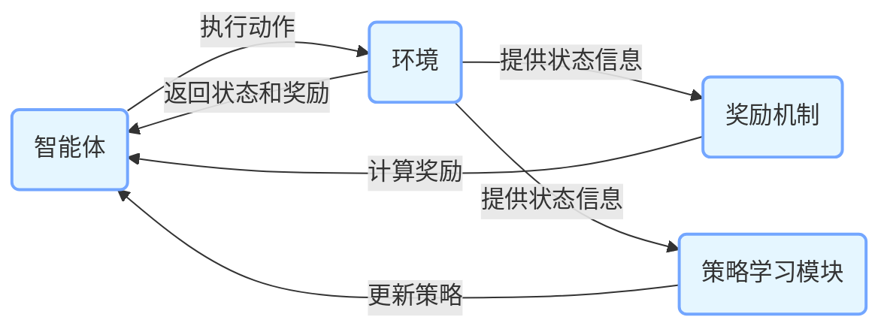

# 基于奖励的AI训练方法的创新与挑战

> 关键词：基于奖励的AI训练、创新、挑战、强化学习、奖励机制

> 摘要：本文深入探讨了基于奖励的AI训练方法，详细分析了其核心概念、算法原理、数学模型等内容。通过项目实战展示了该方法在实际中的应用，介绍了其实际应用场景，并推荐了相关的工具和资源。同时，对基于奖励的AI训练方法的未来发展趋势与挑战进行了总结，旨在为相关领域的研究和实践提供全面而深入的参考。

## 1. 背景介绍 
### 1.1 目的和范围
基于奖励的AI训练方法是人工智能领域的重要研究方向之一。其目的在于通过设计合理的奖励机制，引导AI模型学习到最优的行为策略。本文的范围将涵盖基于奖励的AI训练方法的各个方面，包括核心概念、算法原理、数学模型、实际应用案例以及未来的发展趋势和面临的挑战等。通过对这些内容的详细探讨，帮助读者全面深入地了解基于奖励的AI训练方法。

### 1.2 预期读者
本文预期读者包括人工智能领域的研究人员、开发者、学生以及对AI技术感兴趣的爱好者。对于研究人员，本文可以提供最新的研究思路和方向；对于开发者，有助于他们在实际项目中应用基于奖励的AI训练方法；对于学生，可以作为学习人工智能相关课程的参考资料；对于爱好者，则可以帮助他们了解该领域的前沿知识。

### 1.3 文档结构概述
本文将按照以下结构进行阐述：首先介绍基于奖励的AI训练方法的核心概念与联系，包括相关原理和架构；接着详细讲解核心算法原理和具体操作步骤，并使用Python代码进行示例；然后介绍该方法的数学模型和公式，并举例说明；通过项目实战展示代码的实际应用和详细解释；探讨该方法的实际应用场景；推荐相关的工具和资源；最后总结未来发展趋势与挑战，并提供常见问题与解答以及扩展阅读和参考资料。

### 1.4 术语表
#### 1.4.1 核心术语定义
- **基于奖励的AI训练**：一种通过给予AI模型奖励信号来引导其学习和优化行为策略的训练方法。
- **奖励机制**：用于定义在不同状态和行为下给予AI模型的奖励值的规则和策略。
- **强化学习**：一种机器学习范式，是基于奖励的AI训练的重要实现方式，智能体通过与环境交互，根据环境反馈的奖励来学习最优策略。
- **智能体**：在强化学习中，代表执行决策和行动的主体，通过与环境交互来学习。
- **环境**：智能体所处的外部世界，智能体的行动会对环境产生影响，环境会反馈给智能体状态和奖励信息。

#### 1.4.2 相关概念解释
- **策略**：智能体在不同状态下选择行动的规则。一个好的策略能够使智能体在长期内获得最大的累积奖励。
- **状态**：描述环境和智能体当前情况的信息集合。智能体根据当前状态来选择合适的行动。
- **动作**：智能体在某个状态下可以执行的操作。不同的动作会导致环境状态的不同变化，并可能获得不同的奖励。

#### 1.4.3 缩略词列表
- **RL**：Reinforcement Learning，强化学习
- **Q - learning**：一种基于价值的强化学习算法

## 2. 核心概念与联系 

### 核心概念原理
基于奖励的AI训练方法的核心思想是通过给予AI模型奖励来激励其学习到期望的行为。在强化学习中，智能体与环境进行交互，环境会根据智能体的行为给出相应的奖励信号。智能体的目标是在与环境的长期交互中，学习到一个最优的策略，使得累积奖励最大化。

例如，在一个机器人导航任务中，机器人（智能体）在一个迷宫环境中移动。如果机器人成功到达目标位置，环境会给予一个正奖励；如果机器人撞到墙壁，环境会给予一个负奖励。机器人通过不断尝试不同的移动策略，根据获得的奖励来调整自己的行为，最终学习到从起点到目标位置的最优路径。

### 架构的文本示意图
基于奖励的AI训练方法的基本架构可以描述为：智能体、环境、奖励机制和策略学习模块。智能体在环境中执行动作，环境根据智能体的动作更新状态并返回奖励。奖励机制根据环境的状态和智能体的动作计算奖励值。策略学习模块根据奖励值和环境状态来更新智能体的策略。

### Mermaid流程图


## 3. 核心算法原理 & 具体操作步骤 

### 核心算法原理：Q - learning
Q - learning是一种基于价值的强化学习算法，用于学习最优策略。其核心思想是通过估计每个状态 - 动作对的Q值，来选择最优的动作。Q值表示在某个状态下执行某个动作后，在未来能够获得的累积奖励的期望。

Q - learning的更新公式为：

$$Q(s_t, a_t) \leftarrow Q(s_t, a_t) + \alpha [r_{t+1} + \gamma \max_{a} Q(s_{t+1}, a) - Q(s_t, a_t)]$$

其中：
- $s_t$ 表示当前状态
- $a_t$ 表示当前动作
- $r_{t+1}$ 表示执行动作 $a_t$ 后获得的即时奖励
- $s_{t+1}$ 表示执行动作 $a_t$ 后转移到的下一个状态
- $\alpha$ 是学习率，控制每次更新的步长
- $\gamma$ 是折扣因子，用于权衡即时奖励和未来奖励

### 具体操作步骤

#### 步骤1：初始化
- 初始化Q表，将所有状态 - 动作对的Q值初始化为0。
- 初始化环境，设置初始状态 $s_0$。

#### 步骤2：选择动作
根据当前状态 $s_t$，使用某种策略（如 $\epsilon$-贪心策略）选择一个动作 $a_t$。

#### 步骤3：执行动作
智能体在环境中执行动作 $a_t$，环境返回下一个状态 $s_{t+1}$ 和即时奖励 $r_{t+1}$。

#### 步骤4：更新Q表
根据Q - learning的更新公式更新当前状态 - 动作对的Q值。

#### 步骤5：判断是否结束
如果达到终止条件（如达到最大步数或到达目标状态），则结束训练；否则，将 $s_{t+1}$ 作为新的当前状态，返回步骤2继续训练。

### Python源代码实现
```python
import numpy as np

# 定义环境参数
num_states = 10
num_actions = 4
alpha = 0.1
gamma = 0.9
epsilon = 0.1
max_steps = 100

# 初始化Q表
Q = np.zeros((num_states, num_actions))

# 定义环境（简单示例）
def get_next_state(state, action):
    # 这里简单假设状态转移规则
    new_state = (state + action) % num_states
    return new_state

def get_reward(state):
    # 假设到达状态5有奖励
    if state == 5:
        return 1
    else:
        return 0

# 定义epsilon - 贪心策略
def choose_action(state):
    if np.random.uniform(0, 1) < epsilon:
        # 探索：随机选择动作
        action = np.random.choice(num_actions)
    else:
        # 利用：选择Q值最大的动作
        action = np.argmax(Q[state, :])
    return action

# 训练过程
for episode in range(1000):
    state = np.random.randint(0, num_states)
    for step in range(max_steps):
        action = choose_action(state)
        next_state = get_next_state(state, action)
        reward = get_reward(next_state)
        
        # 更新Q表
        Q[state, action] = Q[state, action] + alpha * (reward + gamma * np.max(Q[next_state, :]) - Q[state, action])
        
        state = next_state
        
        if reward == 1:
            break

print("训练完成后的Q表：")
print(Q)
```

## 4. 数学模型和公式 & 详细讲解 & 举例说明 

### 数学模型
基于奖励的AI训练方法在强化学习中主要基于马尔可夫决策过程（MDP）。MDP可以用一个五元组 $(S, A, P, R, \gamma)$ 来表示，其中：
- $S$ 是状态集合
- $A$ 是动作集合
- $P(s'|s, a)$ 是状态转移概率，表示在状态 $s$ 执行动作 $a$ 后转移到状态 $s'$ 的概率
- $R(s, a)$ 是奖励函数，表示在状态 $s$ 执行动作 $a$ 后获得的即时奖励
- $\gamma$ 是折扣因子，用于权衡即时奖励和未来奖励

### 公式详细讲解
#### 价值函数
价值函数用于评估一个状态或状态 - 动作对的好坏。

- **状态价值函数 $V^{\pi}(s)$**：表示在策略 $\pi$ 下，从状态 $s$ 开始的期望累积奖励。其定义为：

$$V^{\pi}(s) = \mathbb{E}_{\pi} \left[ \sum_{t=0}^{\infty} \gamma^t r_{t+1} \big| s_0 = s \right]$$

- **动作价值函数 $Q^{\pi}(s, a)$**：表示在策略 $\pi$ 下，从状态 $s$ 执行动作 $a$ 后，后续的期望累积奖励。其定义为：

$$Q^{\pi}(s, a) = \mathbb{E}_{\pi} \left[ \sum_{t=0}^{\infty} \gamma^t r_{t+1} \big| s_0 = s, a_0 = a \right]$$

#### 贝尔曼方程
贝尔曼方程描述了价值函数的递归关系。

- **状态价值函数的贝尔曼方程**：

$$V^{\pi}(s) = \sum_{a \in A} \pi(a|s) \left[ R(s, a) + \gamma \sum_{s' \in S} P(s'|s, a) V^{\pi}(s') \right]$$

- **动作价值函数的贝尔曼方程**：

$$Q^{\pi}(s, a) = R(s, a) + \gamma \sum_{s' \in S} P(s'|s, a) \sum_{a' \in A} \pi(a'|s') Q^{\pi}(s', a')$$

### 举例说明
假设有一个简单的网格世界环境，智能体可以在一个 $3 \times 3$ 的网格中移动，目标是从左上角移动到右下角。状态 $s$ 可以用智能体在网格中的位置 $(x, y)$ 表示，动作 $a$ 可以是上下左右四个方向。

- 状态集合 $S$ 包含 $9$ 个状态，即 $(0, 0), (0, 1), \cdots, (2, 2)$。
- 动作集合 $A$ 包含 $4$ 个动作，即上、下、左、右。
- 状态转移概率 $P(s'|s, a)$：如果智能体执行一个动作，在没有障碍物的情况下，有一定概率成功移动到目标位置；如果遇到边界或障碍物，则保持当前状态。例如，在状态 $(0, 0)$ 执行向右的动作，有 $0.8$ 的概率转移到状态 $(0, 1)$，有 $0.2$ 的概率保持在状态 $(0, 0)$。
- 奖励函数 $R(s, a)$：如果智能体到达右下角的目标状态，获得奖励 $1$；否则，获得奖励 $0$。

通过求解贝尔曼方程，可以得到最优的状态价值函数和动作价值函数，从而确定最优策略。

## 5. 项目实战：代码实际案例和详细解释说明 

### 5.1  开发环境搭建
- **操作系统**：推荐使用Linux或Windows系统。
- **Python版本**：Python 3.6及以上。
- **安装依赖库**：使用以下命令安装必要的库：
```bash
pip install numpy
```

### 5.2  源代码详细实现和代码解读
以下是一个基于OpenAI Gym库的CartPole环境的Q - learning实现案例。

```python
import gym
import numpy as np

# 初始化环境
env = gym.make('CartPole-v1')

# 离散化状态空间
def discretize_state(state):
    # 简单的离散化方法，将连续状态空间划分为离散的区间
    num_bins = 10
    state_bins = []
    for i in range(len(state)):
        state_min = env.observation_space.low[i]
        state_max = env.observation_space.high[i]
        bins = np.linspace(state_min, state_max, num_bins)
        state_bins.append(np.digitize(state[i], bins))
    return tuple(state_bins)

# 初始化Q表
num_actions = env.action_space.n
state_bins = [10] * len(env.observation_space.low)
Q = np.zeros(state_bins + [num_actions])

# 定义超参数
alpha = 0.1
gamma = 0.9
epsilon = 0.1
num_episodes = 1000
max_steps_per_episode = 200

# 定义epsilon - 贪心策略
def choose_action(state):
    if np.random.uniform(0, 1) < epsilon:
        action = env.action_space.sample()
    else:
        action = np.argmax(Q[state])
    return action

# 训练过程
for episode in range(num_episodes):
    state = env.reset()
    state = discretize_state(state)
    for step in range(max_steps_per_episode):
        action = choose_action(state)
        next_state, reward, done, _ = env.step(action)
        next_state = discretize_state(next_state)
        
        # 更新Q表
        Q[state][action] = Q[state][action] + alpha * (reward + gamma * np.max(Q[next_state]) - Q[state][action])
        
        state = next_state
        
        if done:
            break

# 测试过程
state = env.reset()
state = discretize_state(state)
total_reward = 0
for step in range(max_steps_per_episode):
    action = np.argmax(Q[state])
    next_state, reward, done, _ = env.step(action)
    next_state = discretize_state(next_state)
    total_reward += reward
    state = next_state
    if done:
        break

print(f"测试总奖励: {total_reward}")
env.close()
```

### 5.3  代码解读与分析
- **环境初始化**：使用 `gym.make('CartPole-v1')` 初始化CartPole环境。
- **离散化状态空间**：由于CartPole环境的状态空间是连续的，而Q - learning通常适用于离散状态空间，因此需要将连续状态空间离散化。`discretize_state` 函数将连续状态划分为离散的区间。
- **Q表初始化**：根据离散化后的状态空间和动作空间初始化Q表。
- **超参数设置**：设置学习率 `alpha`、折扣因子 `gamma`、探索率 `epsilon` 等超参数。
- **训练过程**：在每个回合中，智能体根据 `epsilon` - 贪心策略选择动作，与环境交互，更新Q表。
- **测试过程**：使用训练好的Q表，智能体在环境中执行动作，计算总奖励。

## 6. 实际应用场景 
### 游戏领域
基于奖励的AI训练方法在游戏领域有广泛的应用。例如，在棋类游戏中，智能体可以通过与对手博弈，根据游戏的胜负结果获得奖励，从而学习到最优的下棋策略。在电子竞技游戏中，智能体可以根据游戏中的得分、击杀数等指标获得奖励，学习到如何在游戏中取得胜利。

### 机器人控制
在机器人控制领域，基于奖励的AI训练方法可以用于训练机器人完成各种任务。例如，训练机器人进行导航、抓取物体等任务。机器人根据完成任务的情况获得奖励，通过不断学习优化自己的动作策略。

### 自动驾驶
自动驾驶领域也可以应用基于奖励的AI训练方法。自动驾驶车辆可以根据行驶的安全性、效率等指标获得奖励，学习到最优的驾驶策略。例如，避免碰撞、遵守交通规则、快速到达目的地等。

### 资源管理
在资源管理领域，如数据中心的能源管理、供应链管理等，基于奖励的AI训练方法可以用于优化资源分配策略。智能体根据资源的使用效率、成本等指标获得奖励，学习到如何合理分配资源。

## 7. 工具和资源推荐
### 7.1 学习资源推荐
#### 7.1.1 书籍推荐
- 《Reinforcement Learning: An Introduction》：由Richard S. Sutton和Andrew G. Barto所著，是强化学习领域的经典教材，详细介绍了基于奖励的AI训练方法的理论和算法。
- 《Deep Reinforcement Learning Hands-On》：这本书结合了深度学习和强化学习的知识，通过实际案例介绍了如何使用深度学习技术实现基于奖励的AI训练。

#### 7.1.2 在线课程
- Coursera上的“Reinforcement Learning Specialization”：由UC Berkeley的教授授课，系统地介绍了强化学习的理论和实践。
- edX上的“Introduction to Reinforcement Learning”：提供了强化学习的基础知识和算法实现。

#### 7.1.3 技术博客和网站
- OpenAI博客：OpenAI团队会分享最新的研究成果和技术进展，包括基于奖励的AI训练方法的相关内容。
- Medium上的AI相关博客：有很多作者会分享基于奖励的AI训练方法的实践经验和研究心得。

### 7.2 开发工具框架推荐
#### 7.2.1 IDE和编辑器
- PyCharm：一款功能强大的Python集成开发环境，适合开发基于Python的AI项目。
- Jupyter Notebook：交互式的开发环境，方便进行代码调试和实验。

#### 7.2.2 调试和性能分析工具
- TensorBoard：用于可视化深度学习模型的训练过程和性能指标。
- cProfile：Python内置的性能分析工具，可以分析代码的运行时间和函数调用次数。

#### 7.2.3 相关框架和库
- OpenAI Gym：提供了一系列的强化学习环境，方便进行算法测试和验证。
- Stable Baselines：基于OpenAI Gym的强化学习算法库，提供了多种预训练的模型和易于使用的API。

### 7.3 相关论文著作推荐
#### 7.3.1 经典论文
- “Q - learning”：由Christopher J. C. H. Watkins和Peter Dayan发表，首次提出了Q - learning算法。
- “Playing Atari with Deep Reinforcement Learning”：由DeepMind团队发表，介绍了如何使用深度神经网络和强化学习技术玩Atari游戏。

#### 7.3.2 最新研究成果
- 关注顶级AI会议如NeurIPS、ICML、AAAI等的论文，了解基于奖励的AI训练方法的最新研究进展。

#### 7.3.3 应用案例分析
- 一些工业界的技术博客会分享基于奖励的AI训练方法在实际项目中的应用案例，如Google、Facebook等公司的技术博客。

## 8. 总结：未来发展趋势与挑战
### 未来发展趋势
- **与深度学习的深度融合**：将基于奖励的AI训练方法与深度学习技术相结合，如深度强化学习，可以处理更复杂的任务和环境。例如，在图像识别、自然语言处理等领域的应用。
- **多智能体强化学习**：研究多个智能体之间的协作和竞争关系，实现更复杂的任务。例如，在机器人协作、自动驾驶车队等场景中的应用。
- **无模型强化学习的发展**：无模型强化学习不需要对环境进行建模，更适用于复杂和未知的环境。未来无模型强化学习算法将得到进一步的发展和应用。

### 挑战
- **奖励设计困难**：设计合理的奖励机制是基于奖励的AI训练方法的关键。然而，在一些复杂的任务中，很难定义合适的奖励函数，可能导致智能体学习到不理想的策略。
- **样本效率低**：基于奖励的AI训练方法通常需要大量的样本进行学习，样本效率较低。这限制了其在实际应用中的推广，特别是在一些资源受限的场景中。
- **可解释性差**：深度强化学习模型通常是黑盒模型，其决策过程难以解释。在一些对安全性和可靠性要求较高的领域，如自动驾驶、医疗诊断等，可解释性是一个重要的挑战。

## 9. 附录：常见问题与解答
### 问题1：基于奖励的AI训练方法和传统的监督学习有什么区别？
答：传统的监督学习需要大量的标注数据，模型通过学习输入和输出之间的映射关系进行训练。而基于奖励的AI训练方法通过智能体与环境交互，根据环境反馈的奖励来学习最优策略，不需要标注数据。

### 问题2：如何选择合适的学习率和折扣因子？
答：学习率 $\alpha$ 控制每次更新的步长，折扣因子 $\gamma$ 权衡即时奖励和未来奖励。通常可以通过实验来选择合适的值。一般来说，学习率可以设置在 $0.1$ 到 $0.01$ 之间，折扣因子可以设置在 $0.9$ 到 $0.99$ 之间。

### 问题3：基于奖励的AI训练方法是否适用于所有类型的任务？
答：不是。基于奖励的AI训练方法更适用于具有序列决策过程的任务，如游戏、机器人控制等。对于一些静态的分类和回归任务，传统的监督学习方法可能更合适。

## 10. 扩展阅读 & 参考资料
- Sutton, R. S., & Barto, A. G. (2018). Reinforcement Learning: An Introduction. MIT Press.
- Lapan, M. (2018). Deep Reinforcement Learning Hands-On. Packt Publishing.
- Watkins, C. J. C. H., & Dayan, P. (1992). Q - learning. Machine learning, 8(3 - 4), 279 - 292.
- Mnih, V., et al. (2013). Playing Atari with Deep Reinforcement Learning. arXiv preprint arXiv:1312.5602.
- OpenAI Gym官方文档：https://gym.openai.com/
- Stable Baselines官方文档：https://stable - baselines.readthedocs.io/