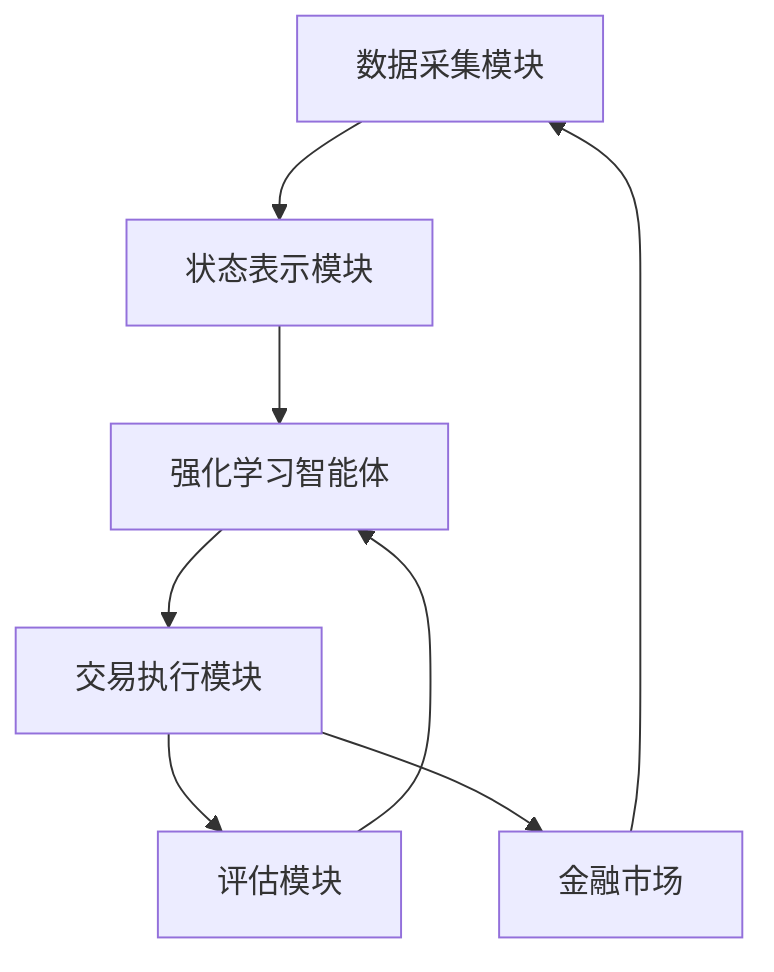

# 基于强化学习的AI交易系统设计与实现

> 关键词：强化学习、AI交易系统、设计实现、金融交易、智能决策

> 摘要：本文聚焦于基于强化学习的AI交易系统的设计与实现。首先介绍了该研究的背景，明确了目的、范围以及预期读者，阐述了文档结构并对相关术语进行解释。接着详细讲解了强化学习与AI交易系统的核心概念及其联系，给出原理和架构的文本示意图与Mermaid流程图。深入探讨了核心算法原理，通过Python源代码进行详细阐述，同时给出数学模型和公式并举例说明。以项目实战的方式，介绍开发环境搭建、源代码实现与解读。分析了该系统的实际应用场景，推荐了相关的学习资源、开发工具框架以及论文著作。最后总结了未来发展趋势与挑战，提供了常见问题解答和扩展阅读参考资料，旨在为开发者和研究者提供全面且深入的技术指导。

## 1. 背景介绍 
### 1.1 目的和范围
在金融市场中，交易决策的准确性和及时性至关重要。传统的交易策略往往依赖于固定的规则和经验，难以适应市场的动态变化。强化学习作为一种强大的机器学习方法，能够让智能体在与环境的交互中不断学习，以最大化累积奖励。本研究的目的是设计并实现一个基于强化学习的AI交易系统，该系统能够自动学习市场规律，做出最优的交易决策，提高交易的收益率和稳定性。

本研究的范围涵盖了从强化学习的基本原理到AI交易系统的具体实现，包括核心算法的设计、数学模型的建立、项目实战中的代码开发以及系统在实际金融市场中的应用等方面。

### 1.2 预期读者
本文预期读者包括金融科技领域的开发者、研究人员，对强化学习和金融交易感兴趣的学生，以及希望利用AI技术改进交易策略的金融从业者。通过阅读本文，读者能够深入了解基于强化学习的AI交易系统的设计思路、实现方法和应用场景，为其在相关领域的研究和实践提供参考。

### 1.3 文档结构概述
本文将按照以下结构进行组织：首先介绍核心概念与联系，帮助读者理解强化学习和AI交易系统的基本原理和架构；接着详细阐述核心算法原理和具体操作步骤，通过Python代码进行说明；然后给出数学模型和公式，并结合实际例子进行讲解；通过项目实战部分，介绍开发环境搭建、源代码实现和代码解读；分析该系统的实际应用场景；推荐相关的学习资源、开发工具框架和论文著作；最后总结未来发展趋势与挑战，提供常见问题解答和扩展阅读参考资料。

### 1.4 术语表
#### 1.4.1 核心术语定义
- **强化学习（Reinforcement Learning）**：一种机器学习范式，智能体通过与环境进行交互，根据环境反馈的奖励信号来学习最优行为策略。
- **智能体（Agent）**：在强化学习中，执行动作并与环境进行交互的实体，在AI交易系统中可以理解为交易决策的执行者。
- **环境（Environment）**：智能体所处的外部世界，它接收智能体的动作并返回状态和奖励。在金融交易场景中，环境可以是金融市场。
- **状态（State）**：环境在某一时刻的特征描述，在交易系统中可以包括股票价格、成交量、技术指标等信息。
- **动作（Action）**：智能体在某一状态下可以执行的操作，在交易系统中可以是买入、卖出或持有等操作。
- **奖励（Reward）**：环境根据智能体的动作返回的即时反馈，用于指导智能体学习最优策略。在交易系统中，奖励可以是交易的收益。

#### 1.4.2 相关概念解释
- **策略（Policy）**：智能体在不同状态下选择动作的规则，通常表示为 $\pi(s,a)$，即状态 $s$ 下选择动作 $a$ 的概率。
- **价值函数（Value Function）**：用于评估状态或状态 - 动作对的价值，分为状态价值函数 $V(s)$ 和动作价值函数 $Q(s,a)$。状态价值函数表示从状态 $s$ 开始，遵循策略 $\pi$ 所能获得的期望累积奖励；动作价值函数表示在状态 $s$ 下执行动作 $a$，然后遵循策略 $\pi$ 所能获得的期望累积奖励。
- **探索与利用（Exploration and Exploitation）**：在强化学习中，智能体需要在探索新的动作以发现更好的策略和利用已有的经验之间进行平衡。探索是指尝试不同的动作，以发现潜在的更好策略；利用是指选择当前认为最优的动作。

#### 1.4.3 缩略词列表
- **DQN（Deep Q - Network）**：深度Q网络，一种基于深度学习的强化学习算法。
- **A2C（Advantage Actor - Critic）**：优势演员 - 评论家算法，结合了策略梯度和价值函数的强化学习算法。
- **PPO（Proximal Policy Optimization）**：近端策略优化算法，一种高效的策略梯度算法。

## 2. 核心概念与联系 
### 核心概念原理
#### 强化学习原理
强化学习的基本原理是智能体在环境中不断地进行交互。在每个时间步 $t$，智能体观察环境的状态 $s_t$，根据当前的策略 $\pi$ 选择一个动作 $a_t$ 执行。环境接收到动作后，会转移到新的状态 $s_{t + 1}$，并返回一个奖励 $r_{t+1}$ 给智能体。智能体的目标是学习一个最优策略 $\pi^*$，使得从任意初始状态开始，所能获得的累积奖励最大化。累积奖励通常表示为折扣累积奖励：

$$G_t=\sum_{k = 0}^{\infty}\gamma^k r_{t + k + 1}$$

其中，$\gamma$ 是折扣因子，取值范围为 $[0,1]$，用于平衡即时奖励和未来奖励的重要性。

#### AI交易系统原理
AI交易系统的核心是利用强化学习算法，根据金融市场的历史数据和实时数据，学习最优的交易策略。系统将市场的状态（如股票价格、成交量等）作为输入，通过强化学习智能体选择合适的交易动作（买入、卖出或持有），并根据交易的收益作为奖励信号来更新策略。

### 架构的文本示意图
基于强化学习的AI交易系统主要由以下几个部分组成：
1. **数据采集模块**：负责收集金融市场的历史数据和实时数据，包括股票价格、成交量、财务报表等信息。
2. **状态表示模块**：将采集到的数据进行处理和特征提取，转化为适合强化学习智能体处理的状态表示。
3. **强化学习智能体**：根据当前的状态选择合适的交易动作，并根据环境反馈的奖励信号更新策略。
4. **交易执行模块**：根据智能体选择的动作，在金融市场上执行实际的交易操作。
5. **评估模块**：对交易系统的性能进行评估，包括收益率、夏普比率、最大回撤等指标。

### Mermaid流程图


## 3. 核心算法原理 & 具体操作步骤 
### 核心算法原理 - DQN
DQN（Deep Q - Network）是一种基于深度学习的强化学习算法，它通过一个深度神经网络来近似动作价值函数 $Q(s,a)$。DQN的核心思想是使用经验回放和目标网络来提高学习的稳定性。

#### 经验回放
经验回放是指将智能体与环境的交互经验 $(s_t,a_t,r_{t+1},s_{t + 1})$ 存储在一个经验回放缓冲区中，在训练时从缓冲区中随机采样一批经验进行学习。这样可以打破数据之间的相关性，提高学习的效率和稳定性。

#### 目标网络
目标网络是一个与主网络结构相同的神经网络，用于计算目标 $Q$ 值。目标网络的参数定期从主网络中复制，这样可以减少目标值的波动，提高学习的稳定性。

### Python源代码实现
```python
import numpy as np
import torch
import torch.nn as nn
import torch.optim as optim
import random

# 定义DQN网络
class DQN(nn.Module):
    def __init__(self, input_dim, output_dim):
        super(DQN, self).__init__()
        self.fc1 = nn.Linear(input_dim, 64)
        self.fc2 = nn.Linear(64, 64)
        self.fc3 = nn.Linear(64, output_dim)

    def forward(self, x):
        x = torch.relu(self.fc1(x))
        x = torch.relu(self.fc2(x))
        return self.fc3(x)

# 定义DQN智能体
class DQNAgent:
    def __init__(self, input_dim, output_dim, learning_rate=0.001, gamma=0.99, epsilon=1.0, epsilon_decay=0.995, epsilon_min=0.01, batch_size=32, memory_size=10000):
        self.input_dim = input_dim
        self.output_dim = output_dim
        self.learning_rate = learning_rate
        self.gamma = gamma
        self.epsilon = epsilon
        self.epsilon_decay = epsilon_decay
        self.epsilon_min = epsilon_min
        self.batch_size = batch_size
        self.memory = []
        self.memory_size = memory_size

        self.model = DQN(input_dim, output_dim)
        self.target_model = DQN(input_dim, output_dim)
        self.target_model.load_state_dict(self.model.state_dict())
        self.optimizer = optim.Adam(self.model.parameters(), lr=learning_rate)
        self.criterion = nn.MSELoss()

    def remember(self, state, action, reward, next_state, done):
        self.memory.append((state, action, reward, next_state, done))
        if len(self.memory) > self.memory_size:
            self.memory.pop(0)

    def act(self, state):
        if np.random.rand() <= self.epsilon:
            return random.randrange(self.output_dim)
        state = torch.FloatTensor(state).unsqueeze(0)
        q_values = self.model(state)
        action = torch.argmax(q_values).item()
        return action

    def replay(self):
        if len(self.memory) < self.batch_size:
            return
        minibatch = random.sample(self.memory, self.batch_size)
        states, actions, rewards, next_states, dones = zip(*minibatch)

        states = torch.FloatTensor(states)
        actions = torch.LongTensor(actions)
        rewards = torch.FloatTensor(rewards)
        next_states = torch.FloatTensor(next_states)
        dones = torch.FloatTensor(dones)

        q_values = self.model(states)
        q_values = q_values.gather(1, actions.unsqueeze(1)).squeeze(1)

        next_q_values = self.target_model(next_states)
        next_q_values = next_q_values.max(1)[0]
        target_q_values = rewards + (1 - dones) * self.gamma * next_q_values

        loss = self.criterion(q_values, target_q_values)
        self.optimizer.zero_grad()
        loss.backward()
        self.optimizer.step()

        if self.epsilon > self.epsilon_min:
            self.epsilon *= self.epsilon_decay

    def update_target_model(self):
        self.target_model.load_state_dict(self.model.state_dict())
```

### 具体操作步骤
1. **初始化**：初始化DQN智能体，包括网络结构、学习率、折扣因子、探索率等参数。
2. **数据采集与状态表示**：采集金融市场的数据，并将其转化为适合智能体处理的状态表示。
3. **训练过程**：
    - 智能体根据当前状态选择动作（使用探索率进行探索或利用）。
    - 执行动作，获取环境反馈的奖励和新的状态。
    - 将经验 $(s_t,a_t,r_{t+1},s_{t + 1})$ 存储到经验回放缓冲区中。
    - 从经验回放缓冲区中随机采样一批经验进行学习，更新主网络的参数。
    - 定期更新目标网络的参数。
4. **测试过程**：在训练完成后，关闭探索机制，使用训练好的策略进行交易。

## 4. 数学模型和公式 & 详细讲解 & 举例说明 
### 动作价值函数更新公式
在DQN中，动作价值函数 $Q(s,a)$ 的更新是基于贝尔曼方程：

$$Q(s,a) \leftarrow Q(s,a)+\alpha\left[r+\gamma\max_{a'}Q(s',a') - Q(s,a)\right]$$

其中，$\alpha$ 是学习率，$r$ 是即时奖励，$\gamma$ 是折扣因子，$s'$ 是下一个状态。

### 详细讲解
贝尔曼方程的核心思想是将当前状态 - 动作对的价值 $Q(s,a)$ 与下一个状态的最优价值 $\max_{a'}Q(s',a')$ 联系起来。在DQN中，我们使用神经网络来近似 $Q$ 值，通过最小化预测 $Q$ 值和目标 $Q$ 值之间的均方误差来更新网络参数。

目标 $Q$ 值的计算如下：

$$y = r+\gamma\max_{a'}Q_{\text{target}}(s',a')$$

其中，$Q_{\text{target}}$ 是目标网络的 $Q$ 值。

### 举例说明
假设我们有一个简单的交易环境，状态 $s$ 是股票的当前价格，动作 $a$ 有两个：买入（$a = 0$）和卖出（$a = 1$）。智能体在状态 $s_t$ 选择动作 $a_t$，执行动作后获得奖励 $r_{t+1}$，并转移到新的状态 $s_{t + 1}$。

设当前状态 $s_t = 100$，智能体选择动作 $a_t = 0$（买入），执行动作后获得奖励 $r_{t+1} = 5$，新的状态 $s_{t + 1}=105$。

我们使用DQN网络来近似 $Q$ 值，假设当前 $Q(s_t,a_t)$ 的预测值为 $Q_{\text{pred}} = 3$，目标网络在状态 $s_{t + 1}$ 下的最大 $Q$ 值为 $\max_{a'}Q_{\text{target}}(s_{t + 1},a') = 7$，学习率 $\alpha = 0.1$，折扣因子 $\gamma = 0.9$。

则目标 $Q$ 值为：

$$y = r_{t+1}+\gamma\max_{a'}Q_{\text{target}}(s_{t + 1},a')=5 + 0.9\times7=5 + 6.3 = 11.3$$

更新后的 $Q$ 值为：

$$Q(s_t,a_t) \leftarrow Q(s_t,a_t)+\alpha\left[y - Q(s_t,a_t)\right]=3+0.1\times(11.3 - 3)=3 + 0.83 = 3.83$$

## 5. 项目实战：代码实际案例和详细解释说明 
### 5.1  开发环境搭建
#### 安装Python
首先，确保你已经安装了Python 3.6或以上版本。可以从Python官方网站（https://www.python.org/downloads/） 下载并安装。

#### 安装必要的库
使用以下命令安装必要的Python库：
```sh
pip install torch numpy pandas matplotlib
```

### 5.2  源代码详细实现和代码解读
```python
import numpy as np
import pandas as pd
import matplotlib.pyplot as plt
from collections import deque

# 定义交易环境
class TradingEnv:
    def __init__(self, data, initial_balance=10000):
        self.data = data
        self.initial_balance = initial_balance
        self.reset()

    def reset(self):
        self.balance = self.initial_balance
        self.position = 0
        self.current_step = 0
        return self._get_state()

    def _get_state(self):
        return self.data[self.current_step]

    def step(self, action):
        current_price = self.data[self.current_step][0]
        next_price = self.data[self.current_step + 1][0]

        if action == 0:  # 买入
            if self.balance > 0:
                self.position = self.balance / current_price
                self.balance = 0
        elif action == 1:  # 卖出
            if self.position > 0:
                self.balance = self.position * current_price
                self.position = 0

        reward = (self.position * (next_price - current_price))
        self.current_step += 1
        done = self.current_step == len(self.data) - 1
        next_state = self._get_state()

        return next_state, reward, done

# 主函数
def main():
    # 加载数据
    data = pd.read_csv('stock_prices.csv')
    data = data[['Close']].values
    data = np.diff(data, axis=0)
    data = np.insert(data, 0, 0, axis=0)
    data = np.reshape(data, (data.shape[0], 1))

    env = TradingEnv(data)
    input_dim = env.reset().shape[0]
    output_dim = 2  # 买入和卖出

    agent = DQNAgent(input_dim, output_dim)

    episodes = 100
    total_rewards = []

    for episode in range(episodes):
        state = env.reset()
        total_reward = 0
        done = False

        while not done:
            action = agent.act(state)
            next_state, reward, done = env.step(action)
            agent.remember(state, action, reward, next_state, done)
            agent.replay()
            state = next_state
            total_reward += reward

        agent.update_target_model()
        total_rewards.append(total_reward)
        print(f'Episode {episode + 1}/{episodes}, Total Reward: {total_reward}')

    plt.plot(total_rewards)
    plt.xlabel('Episode')
    plt.ylabel('Total Reward')
    plt.show()

if __name__ == "__main__":
    main()
```

### 5.3  代码解读与分析
#### 交易环境类 `TradingEnv`
- `__init__` 方法：初始化交易环境，包括加载数据和初始资金。
- `reset` 方法：重置环境，将资金和持仓归零，并返回初始状态。
- `_get_state` 方法：获取当前状态，即当前的市场数据。
- `step` 方法：执行动作，根据动作更新资金和持仓，并返回下一个状态、奖励和是否结束的标志。

#### 主函数 `main`
- 加载股票价格数据，并进行预处理。
- 初始化交易环境和DQN智能体。
- 进行多轮训练，每一轮训练中智能体与环境进行交互，选择动作、获取奖励，并更新经验回放缓冲区和网络参数。
- 记录每一轮的总奖励，并绘制奖励曲线。

## 6. 实际应用场景 
### 股票交易
在股票市场中，基于强化学习的AI交易系统可以根据股票的历史价格、成交量、财务指标等信息，学习最优的交易策略。系统可以实时监测市场变化，自动做出买入、卖出或持有的决策，以提高交易的收益率和稳定性。

### 期货交易
期货市场具有高杠杆、高风险的特点，需要更精确的交易决策。强化学习AI交易系统可以处理期货市场的复杂数据，包括合约价格、基差、持仓量等，通过学习市场规律，制定合理的交易策略，降低交易风险。

### 外汇交易
外汇市场是全球最大的金融市场之一，交易时间长、流动性高。强化学习AI交易系统可以分析外汇汇率的变化趋势、宏观经济数据等信息，在不同的货币对之间进行交易，实现资产的增值。

### 加密货币交易
加密货币市场具有高度的波动性和不确定性。强化学习AI交易系统可以通过学习加密货币的价格走势、交易量、市场情绪等信息，制定适应市场变化的交易策略，在加密货币交易中获取利润。

## 7. 工具和资源推荐
### 7.1 学习资源推荐
#### 7.1.1 书籍推荐
- 《强化学习：原理与Python实现》：本书详细介绍了强化学习的基本原理和常见算法，并通过Python代码进行实现，适合初学者入门。
- 《深度学习》：虽然主要介绍深度学习的内容，但其中也包含了强化学习与深度学习结合的相关知识，对于理解DQN等算法有很大帮助。
- 《金融市场技术分析》：了解金融市场的基本原理和技术分析方法，对于设计AI交易系统的状态表示和策略评估有重要意义。

#### 7.1.2 在线课程
- Coursera上的“Reinforcement Learning Specialization”：由顶尖大学的教授授课，系统地介绍了强化学习的理论和实践。
- edX上的“Deep Reinforcement Learning”：重点讲解深度强化学习的算法和应用，适合有一定基础的学习者。
- 哔哩哔哩上有很多关于强化学习和金融交易的教程，适合自学。

#### 7.1.3 技术博客和网站
- OpenAI博客：发布了很多关于强化学习的最新研究成果和应用案例。
- Towards Data Science：有大量关于机器学习和强化学习的技术文章，包括算法讲解、项目实战等内容。
- 知乎：有很多关于强化学习和金融交易的讨论和分享，可以获取不同的观点和经验。

### 7.2 开发工具框架推荐
#### 7.2.1 IDE和编辑器
- PyCharm：功能强大的Python集成开发环境，提供代码编辑、调试、版本控制等功能，适合开发复杂的AI交易系统。
- Jupyter Notebook：交互式的开发环境，适合进行数据探索、模型实验和代码演示，方便与团队成员分享和交流。

#### 7.2.2 调试和性能分析工具
- TensorBoard：用于可视化深度学习模型的训练过程和性能指标，帮助开发者监控模型的训练进度和发现问题。
- PyTorch Profiler：可以分析PyTorch代码的性能瓶颈，优化代码的运行效率。

#### 7.2.3 相关框架和库
- PyTorch：开源的深度学习框架，提供了丰富的神经网络模块和优化算法，方便实现强化学习算法。
- Stable Baselines3：基于PyTorch的强化学习库，提供了多种预训练的强化学习算法，可用于快速开发和测试AI交易系统。
- Pandas：用于数据处理和分析的Python库，在处理金融市场数据时非常有用。

### 7.3 相关论文著作推荐
#### 7.3.1 经典论文
- “Playing Atari with Deep Reinforcement Learning”：提出了DQN算法，开启了深度强化学习的新时代。
- “Asynchronous Methods for Deep Reinforcement Learning”：介绍了A3C算法，提高了强化学习的训练效率。
- “Proximal Policy Optimization Algorithms”：提出了PPO算法，是一种高效的策略梯度算法。

#### 7.3.2 最新研究成果
- 关注NeurIPS、ICML、AAAI等顶级机器学习会议的论文，了解强化学习在金融交易领域的最新研究进展。
- arXiv上有很多关于强化学习和金融科技的预印本论文，可以及时获取最新的研究成果。

#### 7.3.3 应用案例分析
- 一些金融科技公司的研究报告和博客文章，会分享他们在AI交易系统方面的应用案例和实践经验，可以从中学习到实际应用中的技巧和方法。

## 8. 总结：未来发展趋势与挑战
### 未来发展趋势
- **多智能体强化学习**：在金融市场中，多个交易智能体之间的交互和竞争将变得更加复杂。多智能体强化学习可以模拟这种复杂的市场环境，让智能体学习如何与其他智能体合作或竞争，提高交易系统的性能。
- **结合其他技术**：将强化学习与自然语言处理、计算机视觉等技术相结合，可以从更多的数据源中获取信息，如新闻舆情、公司财报图片等，为交易决策提供更全面的支持。
- **自动化交易生态系统**：未来的AI交易系统将不仅仅是一个独立的程序，而是与金融市场的各个环节紧密结合，形成一个自动化的交易生态系统，实现交易的全流程自动化。

### 挑战
- **数据质量和安全性**：金融市场的数据质量和安全性至关重要。数据中可能存在噪声、缺失值等问题，需要进行有效的处理和清洗。同时，数据的安全性也是一个挑战，需要采取措施防止数据泄露和恶意攻击。
- **模型可解释性**：强化学习模型通常是黑盒模型，难以解释其决策过程。在金融交易中，监管机构和投资者往往需要了解模型的决策依据，因此提高模型的可解释性是一个重要的挑战。
- **市场适应性**：金融市场是动态变化的，新的市场事件和规律不断出现。AI交易系统需要具备良好的市场适应性，能够快速学习和适应新的市场环境，否则可能会导致交易策略失效。

## 9. 附录：常见问题与解答
### 问题1：强化学习在金融交易中的优势是什么？
强化学习在金融交易中的优势在于它能够自动学习市场规律，根据市场的动态变化实时调整交易策略。与传统的交易策略相比，强化学习不需要人为设定固定的规则，能够发现一些隐藏的市场模式，提高交易的收益率和稳定性。

### 问题2：如何选择合适的强化学习算法？
选择合适的强化学习算法需要考虑多个因素，如问题的复杂度、数据的规模、计算资源等。对于简单的交易问题，可以选择DQN等基于价值函数的算法；对于复杂的连续动作空间问题，可以选择A2C、PPO等基于策略梯度的算法。

### 问题3：如何评估AI交易系统的性能？
可以使用多个指标来评估AI交易系统的性能，如收益率、夏普比率、最大回撤等。收益率反映了系统的盈利能力，夏普比率衡量了系统在承担单位风险下的收益，最大回撤表示系统在一段时间内的最大亏损幅度。

### 问题4：AI交易系统在实际应用中会遇到哪些风险？
AI交易系统在实际应用中可能会遇到市场风险、模型风险和操作风险等。市场风险是指由于市场的不确定性导致的交易损失；模型风险是指由于模型的局限性或错误导致的决策失误；操作风险是指由于系统故障、人为错误等原因导致的交易问题。

## 10. 扩展阅读 & 参考资料
- Sutton, R. S., & Barto, A. G. (2018). Reinforcement learning: An introduction. MIT press.
- Goodfellow, I., Bengio, Y., & Courville, A. (2016). Deep learning. MIT press.
- Murphy, K. P. (2012). Machine learning: A probabilistic perspective. MIT press.
- OpenAI Gym官方文档：https://gym.openai.com/docs/
- PyTorch官方文档：https://pytorch.org/docs/stable/index.html
- Stable Baselines3官方文档：https://stable-baselines3.readthedocs.io/en/master/