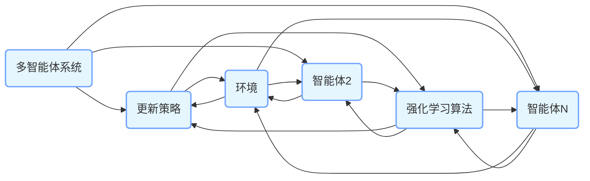

# 基于强化学习的多智能体协同推理策略优化

> 关键词：强化学习、多智能体、协同推理、策略优化、马尔可夫决策过程

> 摘要：本文聚焦于基于强化学习的多智能体协同推理策略优化这一前沿课题。首先介绍了该研究的背景，包括目的、预期读者、文档结构和相关术语。接着阐述了核心概念，如多智能体系统、强化学习以及它们之间的联系，并给出了相应的原理和架构示意图与流程图。详细讲解了核心算法原理，使用 Python 代码进行了具体实现。探讨了相关的数学模型和公式，并举例说明。通过项目实战，展示了代码的实际应用和详细解释。分析了该技术在不同场景下的实际应用，推荐了相关的学习资源、开发工具框架和论文著作。最后总结了未来的发展趋势与挑战，并提供了常见问题解答和扩展阅读参考资料。旨在为读者全面深入地理解和应用基于强化学习的多智能体协同推理策略优化技术提供有价值的指导。

## 1. 背景介绍 

### 1.1 目的和范围
随着人工智能技术的不断发展，多智能体系统在许多领域得到了广泛应用，如自动驾驶、智能机器人、网络通信等。在多智能体系统中，多个智能体需要协同工作以完成复杂的任务。然而，如何让这些智能体有效地协同推理并优化其策略是一个具有挑战性的问题。本文的目的是深入研究基于强化学习的多智能体协同推理策略优化方法，探讨其原理、算法和实际应用。范围涵盖了从理论基础到实际项目的各个方面，包括核心概念的介绍、算法的实现、数学模型的分析、项目实战以及应用场景的探讨。

### 1.2 预期读者
本文预期读者包括对人工智能、强化学习、多智能体系统等领域感兴趣的研究人员、工程师和学生。对于正在从事相关领域研究和开发的专业人士，本文可以提供深入的技术分析和实践指导；对于初学者，本文可以作为一个系统的学习资料，帮助他们了解基于强化学习的多智能体协同推理策略优化的基本概念和方法。

### 1.3 文档结构概述
本文将按照以下结构进行组织：
1. **背景介绍**：介绍研究的目的、范围、预期读者和文档结构，以及相关术语的定义。
2. **核心概念与联系**：阐述多智能体系统、强化学习等核心概念，以及它们之间的联系，并给出相应的原理和架构示意图与流程图。
3. **核心算法原理 & 具体操作步骤**：详细讲解基于强化学习的多智能体协同推理策略优化的核心算法原理，并使用 Python 代码进行具体实现。
4. **数学模型和公式 & 详细讲解 & 举例说明**：介绍相关的数学模型和公式，如马尔可夫决策过程、Q - 学习算法等，并进行详细讲解和举例说明。
5. **项目实战：代码实际案例和详细解释说明**：通过一个具体的项目实例，展示代码的实际应用和详细解释。
6. **实际应用场景**：分析该技术在不同领域的实际应用场景。
7. **工具和资源推荐**：推荐相关的学习资源、开发工具框架和论文著作。
8. **总结：未来发展趋势与挑战**：总结该领域的未来发展趋势和面临的挑战。
9. **附录：常见问题与解答**：提供常见问题的解答。
10. **扩展阅读 & 参考资料**：列出相关的扩展阅读材料和参考资料。

### 1.4 术语表
#### 1.4.1 核心术语定义
- **多智能体系统（Multi - Agent System，MAS）**：由多个智能体组成的系统，这些智能体可以感知环境、进行决策并采取行动，通过相互协作来完成共同的任务。
- **强化学习（Reinforcement Learning，RL）**：一种机器学习方法，智能体通过与环境进行交互，根据环境反馈的奖励信号来学习最优的行为策略。
- **协同推理（Collaborative Reasoning）**：多个智能体在完成任务的过程中，通过信息共享和交互，共同进行推理和决策。
- **策略优化（Policy Optimization）**：通过调整智能体的行为策略，使其在给定的环境中获得最大的累积奖励。

#### 1.4.2 相关概念解释
- **智能体（Agent）**：具有自主决策能力的实体，可以是软件程序、机器人等。智能体能够感知环境状态，根据一定的策略选择行动，并从环境中获得奖励反馈。
- **环境（Environment）**：智能体所处的外部世界，它提供了智能体可以感知的状态信息，并根据智能体的行动给出相应的奖励。
- **状态（State）**：描述环境在某一时刻的特征向量，智能体根据当前状态来选择行动。
- **行动（Action）**：智能体在某一状态下可以采取的操作，不同的行动会导致环境状态的改变和不同的奖励。
- **奖励（Reward）**：环境对智能体行动的反馈信号，用于指导智能体学习最优策略。正奖励表示该行动是有益的，负奖励表示该行动是不利的。

#### 1.4.3 缩略词列表
- **MAS**：Multi - Agent System
- **RL**：Reinforcement Learning
- **MDP**：Markov Decision Process
- **Q - learning**：Q - 学习算法

## 2. 核心概念与联系 

### 核心概念原理
#### 多智能体系统
多智能体系统是由多个智能体组成的分布式系统。每个智能体都有自己的目标和能力，并且可以与其他智能体进行通信和协作。智能体之间的协作方式可以分为合作、竞争和混合等多种形式。在多智能体协同推理中，智能体需要共享信息，共同分析和解决问题。例如，在一个智能交通系统中，多个交通信号灯智能体可以通过协同推理来优化交通流量。

#### 强化学习
强化学习是一种基于试错的学习方法。智能体在环境中不断地采取行动，并根据环境反馈的奖励信号来调整自己的策略。强化学习的目标是找到一个最优策略，使得智能体在长期内获得最大的累积奖励。常见的强化学习算法包括 Q - 学习、策略梯度算法等。

### 架构示意图

该示意图展示了多智能体系统、智能体、环境和强化学习算法之间的关系。多个智能体在环境中进行交互，根据环境的奖励反馈，通过强化学习算法更新自己的策略。

### 核心概念联系
多智能体系统和强化学习之间存在着紧密的联系。在多智能体系统中，每个智能体可以使用强化学习算法来学习自己的最优策略。同时，智能体之间的协同推理可以通过共享奖励信息、状态信息等方式来实现。例如，一个智能体可以根据其他智能体的奖励情况来调整自己的行动，从而实现协同优化。

## 3. 核心算法原理 & 具体操作步骤 

### 核心算法原理
在基于强化学习的多智能体协同推理策略优化中，常用的算法是 Q - 学习算法。Q - 学习算法是一种无模型的强化学习算法，它通过估计状态 - 行动对的价值（Q 值）来学习最优策略。

Q - 学习的核心思想是更新 Q 值，使得智能体在每个状态下选择具有最大 Q 值的行动。Q 值的更新公式如下：

$$Q(s_t, a_t) \leftarrow Q(s_t, a_t) + \alpha [r_{t+1} + \gamma \max_{a} Q(s_{t+1}, a) - Q(s_t, a_t)]$$

其中，$s_t$ 是当前状态，$a_t$ 是当前行动，$r_{t+1}$ 是执行行动 $a_t$ 后获得的奖励，$s_{t+1}$ 是下一个状态，$\alpha$ 是学习率，$\gamma$ 是折扣因子。

### 具体操作步骤
1. **初始化**：初始化所有状态 - 行动对的 Q 值为 0。
2. **选择行动**：在每个时间步 $t$，智能体根据当前状态 $s_t$，使用某种策略（如 $\epsilon$ - 贪心策略）选择一个行动 $a_t$。
3. **执行行动**：智能体执行行动 $a_t$，环境返回下一个状态 $s_{t+1}$ 和奖励 $r_{t+1}$。
4. **更新 Q 值**：根据 Q - 学习更新公式更新 $Q(s_t, a_t)$。
5. **重复步骤 2 - 4**：直到达到终止条件（如达到最大时间步数或达到目标状态）。

### Python 代码实现
```python
import numpy as np

# 定义环境参数
num_states = 10
num_actions = 4
learning_rate = 0.1
discount_factor = 0.9
epsilon = 0.1
max_steps = 100

# 初始化 Q 表
Q = np.zeros((num_states, num_actions))

def choose_action(state):
    if np.random.uniform(0, 1) < epsilon:
        # 探索：随机选择一个行动
        action = np.random.choice(num_actions)
    else:
        # 利用：选择具有最大 Q 值的行动
        action = np.argmax(Q[state, :])
    return action

def update_Q(state, action, reward, next_state):
    max_Q_next = np.max(Q[next_state, :])
    Q[state, action] = Q[state, action] + learning_rate * (reward + discount_factor * max_Q_next - Q[state, action])

# 训练过程
for episode in range(1000):
    state = np.random.randint(0, num_states)
    for step in range(max_steps):
        action = choose_action(state)
        # 模拟环境反馈
        next_state = np.random.randint(0, num_states)
        reward = np.random.randint(-1, 2)
        update_Q(state, action, reward, next_state)
        state = next_state
        if state == 9:  # 假设状态 9 是目标状态
            break

print("训练完成，最终 Q 表：")
print(Q)
```
在上述代码中，我们首先定义了环境的参数，包括状态数、行动数、学习率、折扣因子等。然后初始化了 Q 表，实现了选择行动和更新 Q 值的函数。在训练过程中，智能体根据 $\epsilon$ - 贪心策略选择行动，与环境进行交互，并更新 Q 表。最后输出训练完成后的 Q 表。

## 4. 数学模型和公式 & 详细讲解 & 举例说明 

### 马尔可夫决策过程（MDP）
马尔可夫决策过程是强化学习的基础数学模型，它可以用一个五元组 $(S, A, P, R, \gamma)$ 来表示：
- $S$：状态集合，表示环境可能处于的所有状态。
- $A$：行动集合，表示智能体可以采取的所有行动。
- $P$：状态转移概率函数，$P(s_{t+1}|s_t, a_t)$ 表示在状态 $s_t$ 下采取行动 $a_t$ 后转移到状态 $s_{t+1}$ 的概率。
- $R$：奖励函数，$R(s_t, a_t, s_{t+1})$ 表示在状态 $s_t$ 下采取行动 $a_t$ 转移到状态 $s_{t+1}$ 时获得的奖励。
- $\gamma$：折扣因子，用于衡量未来奖励的重要性，取值范围为 $[0, 1]$。

### 价值函数
在强化学习中，有两种重要的价值函数：状态价值函数 $V(s)$ 和状态 - 行动价值函数 $Q(s, a)$。

#### 状态价值函数
状态价值函数 $V(s)$ 表示从状态 $s$ 开始，遵循策略 $\pi$ 时的期望累积折扣奖励：

$$V^{\pi}(s) = \mathbb{E}_{\pi} \left[ \sum_{k = 0}^{\infty} \gamma^k r_{t + k + 1} | s_t = s \right]$$

#### 状态 - 行动价值函数
状态 - 行动价值函数 $Q(s, a)$ 表示在状态 $s$ 下采取行动 $a$，然后遵循策略 $\pi$ 时的期望累积折扣奖励：

$$Q^{\pi}(s, a) = \mathbb{E}_{\pi} \left[ \sum_{k = 0}^{\infty} \gamma^k r_{t + k + 1} | s_t = s, a_t = a \right]$$

### Q - 学习公式详细讲解
Q - 学习的更新公式为：

$$Q(s_t, a_t) \leftarrow Q(s_t, a_t) + \alpha [r_{t+1} + \gamma \max_{a} Q(s_{t+1}, a) - Q(s_t, a_t)]$$

- $Q(s_t, a_t)$：当前状态 - 行动对的 Q 值。
- $\alpha$：学习率，控制每次更新的步长。如果 $\alpha$ 太大，可能会导致学习不稳定；如果 $\alpha$ 太小，学习速度会很慢。
- $r_{t+1}$：执行行动 $a_t$ 后获得的即时奖励。
- $\gamma$：折扣因子，用于权衡即时奖励和未来奖励。$\gamma$ 越接近 1，智能体越注重未来奖励；$\gamma$ 越接近 0，智能体越注重即时奖励。
- $\max_{a} Q(s_{t+1}, a)$：下一个状态 $s_{t+1}$ 下所有行动的最大 Q 值。

### 举例说明
假设一个简单的环境，有 3 个状态 $S = \{s_1, s_2, s_3\}$ 和 2 个行动 $A = \{a_1, a_2\}$。初始时，Q 表如下：

| 状态 | $a_1$ | $a_2$ |
| ---- | ---- | ---- |
| $s_1$ | 0 | 0 |
| $s_2$ | 0 | 0 |
| $s_3$ | 0 | 0 |

在状态 $s_1$ 下，智能体选择行动 $a_1$，执行该行动后转移到状态 $s_2$，并获得奖励 $r = 1$。假设学习率 $\alpha = 0.1$，折扣因子 $\gamma = 0.9$。

首先，计算 $\max_{a} Q(s_2, a)$，由于初始时 $Q(s_2, a_1) = Q(s_2, a_2) = 0$，所以 $\max_{a} Q(s_2, a) = 0$。

然后，根据 Q - 学习更新公式：

$$Q(s_1, a_1) = Q(s_1, a_1) + \alpha [r + \gamma \max_{a} Q(s_2, a) - Q(s_1, a_1)]$$

$$Q(s_1, a_1) = 0 + 0.1 \times [1 + 0.9 \times 0 - 0] = 0.1$$

更新后的 Q 表如下：

| 状态 | $a_1$ | $a_2$ |
| ---- | ---- | ---- |
| $s_1$ | 0.1 | 0 |
| $s_2$ | 0 | 0 |
| $s_3$ | 0 | 0 |

## 5. 项目实战：代码实际案例和详细解释说明 

### 5.1 开发环境搭建
#### 安装 Python
首先，确保你已经安装了 Python 3.x 版本。可以从 Python 官方网站（https://www.python.org/downloads/）下载并安装。

#### 安装必要的库
在本项目中，我们需要使用 `numpy` 库来进行数值计算。可以使用以下命令安装：
```sh
pip install numpy
```

### 5.2 源代码详细实现和代码解读
我们将实现一个简单的多智能体协同推理项目，模拟两个智能体在一个网格世界中协同寻找目标的过程。

```python
import numpy as np
import random

# 定义环境参数
grid_size = 5
num_agents = 2
num_actions = 4  # 上、下、左、右
learning_rate = 0.1
discount_factor = 0.9
epsilon = 0.1
max_steps = 100
num_episodes = 1000

# 初始化 Q 表
Q_tables = [np.zeros((grid_size * grid_size, num_actions)) for _ in range(num_agents)]

# 定义行动函数
def move_agent(state, action):
    x, y = state // grid_size, state % grid_size
    if action == 0:  # 上
        x = max(0, x - 1)
    elif action == 1:  # 下
        x = min(grid_size - 1, x + 1)
    elif action == 2:  # 左
        y = max(0, y - 1)
    elif action == 3:  # 右
        y = min(grid_size - 1, y + 1)
    return x * grid_size + y

# 定义选择行动函数
def choose_action(agent_id, state):
    if random.uniform(0, 1) < epsilon:
        # 探索：随机选择一个行动
        action = random.randint(0, num_actions - 1)
    else:
        # 利用：选择具有最大 Q 值的行动
        action = np.argmax(Q_tables[agent_id][state, :])
    return action

# 定义更新 Q 表函数
def update_Q(agent_id, state, action, reward, next_state):
    max_Q_next = np.max(Q_tables[agent_id][next_state, :])
    Q_tables[agent_id][state, action] = Q_tables[agent_id][state, action] + learning_rate * (reward + discount_factor * max_Q_next - Q_tables[agent_id][state, action])

# 训练过程
for episode in range(num_episodes):
    # 初始化智能体状态
    states = [random.randint(0, grid_size * grid_size - 1) for _ in range(num_agents)]
    # 目标状态
    goal_state = random.randint(0, grid_size * grid_size - 1)
    for step in range(max_steps):
        actions = [choose_action(agent_id, states[agent_id]) for agent_id in range(num_agents)]
        next_states = [move_agent(states[agent_id], actions[agent_id]) for agent_id in range(num_agents)]
        # 计算奖励
        rewards = []
        for agent_id in range(num_agents):
            if next_states[agent_id] == goal_state:
                reward = 10
            else:
                reward = -1
            rewards.append(reward)
        # 更新 Q 表
        for agent_id in range(num_agents):
            update_Q(agent_id, states[agent_id], actions[agent_id], rewards[agent_id], next_states[agent_id])
        states = next_states
        if all([state == goal_state for state in states]):
            break

# 输出最终 Q 表
for agent_id in range(num_agents):
    print(f"Agent {agent_id} 最终 Q 表：")
    print(Q_tables[agent_id])
```

### 5.3 代码解读与分析
#### 初始化部分
- `grid_size`：定义了网格世界的大小。
- `num_agents`：智能体的数量。
- `num_actions`：每个智能体可以采取的行动数量。
- `Q_tables`：为每个智能体初始化一个 Q 表。

#### 行动函数 `move_agent`
该函数根据当前状态和选择的行动，计算智能体的下一个状态。根据行动的不同，更新智能体在网格世界中的位置。

#### 选择行动函数 `choose_action`
使用 $\epsilon$ - 贪心策略选择行动。以 $\epsilon$ 的概率随机选择一个行动进行探索，以 $1 - \epsilon$ 的概率选择具有最大 Q 值的行动进行利用。

#### 更新 Q 表函数 `update_Q`
根据 Q - 学习更新公式更新智能体的 Q 表。

#### 训练过程
在每个训练回合中，随机初始化智能体的状态和目标状态。在每个时间步，每个智能体选择一个行动，计算下一个状态和奖励，并更新 Q 表。如果所有智能体都到达了目标状态，则结束该回合。

通过这个项目实战，我们可以看到如何使用强化学习算法实现多智能体的协同推理和策略优化。

## 6. 实际应用场景 

### 自动驾驶
在自动驾驶领域，多辆自动驾驶汽车可以看作是多个智能体。这些智能体需要协同推理，以实现安全、高效的交通流量。例如，车辆之间可以通过通信共享位置、速度等信息，根据这些信息和强化学习算法来优化自己的行驶策略，避免碰撞、减少拥堵。

### 智能机器人
在机器人团队协作中，多个机器人可以协同完成复杂的任务，如搬运货物、搜索救援等。每个机器人可以使用强化学习算法来学习如何与其他机器人协作，根据环境和任务的变化调整自己的行动策略。

### 网络通信
在网络通信中，多个网络节点可以看作是智能体。这些智能体需要协同工作，以优化网络资源的分配和流量的调度。例如，通过强化学习算法，网络节点可以根据实时的网络状态和流量需求，动态调整自己的传输策略，提高网络的性能和可靠性。

### 电力系统
在电力系统中，多个发电单元、储能设备和用户可以看作是智能体。这些智能体需要协同推理，以实现电力的优化分配和调度。例如，发电单元可以根据实时的电力需求和电价信息，调整自己的发电功率；储能设备可以根据电力的供需情况，进行充电和放电操作。

## 7. 工具和资源推荐

### 7.1 学习资源推荐
#### 7.1.1 书籍推荐
- 《强化学习：原理与Python实现》：这本书详细介绍了强化学习的基本原理和算法，并提供了丰富的 Python 代码示例，适合初学者入门。
- 《多智能体系统：算法、博弈论与应用》：深入探讨了多智能体系统的理论和应用，包括智能体的决策、协作和博弈等方面。
- 《人工智能：一种现代的方法》：这是一本经典的人工智能教材，涵盖了强化学习、多智能体系统等多个领域的知识。

#### 7.1.2 在线课程
- Coursera 上的“强化学习专项课程”：由知名教授授课，系统地介绍了强化学习的理论和实践。
- edX 上的“多智能体系统”：该课程深入讲解了多智能体系统的原理、算法和应用。
- B 站等平台上有许多关于强化学习和多智能体系统的视频教程，适合自学。

#### 7.1.3 技术博客和网站
- OpenAI 博客：OpenAI 是人工智能领域的领先研究机构，其博客上发布了许多关于强化学习和多智能体系统的最新研究成果和技术文章。
- Medium 上的“Towards Data Science”：该网站上有大量关于机器学习、强化学习等领域的优质文章。
- arXiv 是一个预印本数据库，上面可以找到许多关于强化学习和多智能体系统的最新研究论文。

### 7.2 开发工具框架推荐
#### 7.2.1 IDE和编辑器
- PyCharm：是一款专门为 Python 开发设计的集成开发环境，具有强大的代码编辑、调试和分析功能。
- Jupyter Notebook：是一个交互式的开发环境，适合进行数据分析和代码演示，非常适合学习和实验强化学习算法。

#### 7.2.2 调试和性能分析工具
- TensorBoard：是 TensorFlow 提供的可视化工具，可以用于监控训练过程中的各种指标，如损失函数、奖励曲线等。
- cProfile：是 Python 自带的性能分析工具，可以用于分析代码的运行时间和内存使用情况。

#### 7.2.3 相关框架和库
- OpenAI Gym：是一个开源的强化学习环境库，提供了许多经典的强化学习环境，方便开发者进行算法测试和实验。
- Stable Baselines：是一个基于 TensorFlow 和 PyTorch 的强化学习库，提供了多种预训练的强化学习算法，方便快速开发和应用。
- PettingZoo：是一个用于多智能体强化学习的环境库，提供了多种多智能体环境，如多人游戏、机器人协作等。

### 7.3 相关论文著作推荐
#### 7.3.1 经典论文
- “Q - learning”：Watkins 和 Dayan 发表的经典论文，首次提出了 Q - 学习算法。
- “Policy Gradient Methods for Reinforcement Learning with Function Approximation”：Sutton 等人发表的论文，提出了策略梯度算法，为强化学习的发展做出了重要贡献。
- “Multi - Agent Reinforcement Learning: A Selective Overview of Theories and Algorithms”：该论文对多智能体强化学习的理论和算法进行了全面的综述。

#### 7.3.2 最新研究成果
可以通过 arXiv、IEEE Xplore、ACM Digital Library 等学术数据库搜索关于基于强化学习的多智能体协同推理策略优化的最新研究论文。

#### 7.3.3 应用案例分析
- 可以在相关的学术会议和期刊上找到许多关于多智能体强化学习在自动驾驶、智能机器人等领域的应用案例分析，如 IEEE Intelligent Vehicles Symposium、Journal of Artificial Intelligence Research 等。

## 8. 总结：未来发展趋势与挑战

### 未来发展趋势
- **更复杂的环境和任务**：未来的多智能体系统将面临更加复杂的环境和任务，如复杂的动态环境、多目标优化等。强化学习算法需要不断改进和扩展，以适应这些挑战。
- **深度强化学习与多智能体的结合**：深度强化学习在单智能体领域取得了巨大的成功，未来将更多地应用于多智能体系统中。通过深度神经网络，可以处理更复杂的状态和行动空间，提高智能体的学习能力和决策能力。
- **多智能体的分布式学习**：随着智能体数量的增加，集中式的学习方法可能会面临通信和计算瓶颈。分布式学习方法将成为未来的发展趋势，智能体可以在本地进行学习和决策，通过通信进行信息共享和协作。
- **与其他技术的融合**：多智能体强化学习将与其他技术，如计算机视觉、自然语言处理等进行融合，实现更加智能和复杂的应用。例如，在智能交通系统中，智能体可以通过计算机视觉技术感知周围环境，通过自然语言处理技术进行通信和协作。

### 挑战
- **通信和协调问题**：在多智能体系统中，智能体之间的通信和协调是一个关键问题。如何设计高效的通信协议和协调机制，以确保智能体之间能够有效地共享信息和协作，是一个具有挑战性的问题。
- **环境不确定性**：实际环境中存在许多不确定性因素，如传感器噪声、外部干扰等。这些不确定性因素会影响智能体的感知和决策，如何使智能体在不确定环境中稳定地学习和工作是一个亟待解决的问题。
- **可解释性和安全性**：强化学习算法通常是基于黑盒模型，其决策过程难以解释。在一些关键应用领域，如自动驾驶、医疗等，需要算法具有可解释性和安全性。如何提高强化学习算法的可解释性和安全性是一个重要的研究方向。
- **训练效率和收敛性**：在多智能体系统中，由于智能体之间的相互影响，强化学习算法的训练效率和收敛性可能会受到影响。如何设计高效的训练算法，提高算法的收敛速度和稳定性，是一个需要解决的问题。

## 9. 附录：常见问题与解答

### Q1：多智能体系统和单智能体系统有什么区别？
A1：单智能体系统只有一个智能体，其决策和行动主要考虑自身与环境的交互。而多智能体系统由多个智能体组成，智能体之间需要进行通信和协作，共同完成任务。多智能体系统的复杂性更高，需要考虑智能体之间的协调和冲突解决等问题。

### Q2：强化学习中的折扣因子 $\gamma$ 有什么作用？
A2：折扣因子 $\gamma$ 用于权衡即时奖励和未来奖励。$\gamma$ 越接近 1，智能体越注重未来奖励，会更倾向于采取长期利益最大化的行动；$\gamma$ 越接近 0，智能体越注重即时奖励，会更倾向于采取短期利益最大化的行动。

### Q3：如何选择合适的学习率 $\alpha$？
A3：学习率 $\alpha$ 控制每次更新 Q 值的步长。如果 $\alpha$ 太大，可能会导致学习不稳定，Q 值在训练过程中波动较大；如果 $\alpha$ 太小，学习速度会很慢，智能体需要更长的时间来收敛到最优策略。通常可以通过实验来选择合适的学习率，也可以采用自适应学习率的方法，在训练过程中动态调整学习率。

### Q4：多智能体强化学习中智能体之间的通信方式有哪些？
A4：常见的通信方式包括直接通信、间接通信和广播通信。直接通信是指智能体之间一对一地进行信息交换；间接通信是指智能体通过环境中的某种信号或媒介来传递信息；广播通信是指一个智能体向所有其他智能体发送信息。选择哪种通信方式取决于具体的应用场景和系统需求。

### Q5：如何评估多智能体强化学习算法的性能？
A5：可以从多个方面评估多智能体强化学习算法的性能，如任务完成率、平均奖励、收敛速度等。任务完成率表示智能体在一定时间内完成任务的比例；平均奖励表示智能体在训练过程中获得的平均奖励值；收敛速度表示算法达到稳定状态所需的时间。

## 10. 扩展阅读 & 参考资料

### 扩展阅读
- 《深度强化学习实战》：进一步深入介绍了深度强化学习的算法和应用，适合有一定强化学习基础的读者。
- 《博弈论与经济行为》：博弈论与多智能体系统密切相关，这本书是博弈论领域的经典著作，有助于理解智能体之间的策略交互。

### 参考资料
- Sutton, R. S., & Barto, A. G. (2018). Reinforcement learning: An introduction. MIT press.
- Shoham, Y., & Leyton - Brown, K. (2008). Multiagent systems: Algorithmic, game - theoretic, and logical foundations. Cambridge University Press.
- Watkins, C. J., & Dayan, P. (1992). Q - learning. Machine learning, 8(3 - 4), 279 - 292.