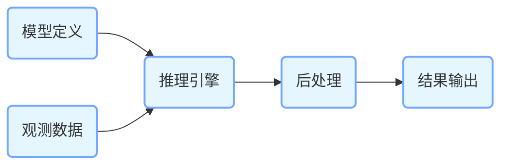

# 基于概率编程的不确定性推理模型设计

> 关键词：概率编程、不确定性推理、贝叶斯网络、马尔可夫链蒙特卡罗、模型设计

> 摘要：本文围绕基于概率编程的不确定性推理模型设计展开。首先介绍了概率编程和不确定性推理的背景知识，阐述了相关核心概念及其联系。接着详细讲解了核心算法原理，包括如何使用 Python 代码实现。深入探讨了其数学模型和公式，并通过具体例子进行说明。在项目实战部分，给出了开发环境搭建的步骤、源代码实现及详细解读。还分析了该模型的实际应用场景，推荐了学习、开发工具和相关论文著作。最后总结了未来发展趋势与挑战，并提供常见问题解答和参考资料，旨在为相关领域的研究者和开发者提供全面且深入的技术指导。

## 1. 背景介绍 
### 1.1 目的和范围
不确定性在现实世界中无处不在，无论是在自然科学、工程技术还是社会科学领域，都面临着各种不确定性因素。概率编程作为一种新兴的编程范式，为处理不确定性提供了强大的工具。本文章的目的在于深入探讨基于概率编程的不确定性推理模型的设计，涵盖从理论基础到实际应用的各个方面，包括核心概念的阐述、算法原理的讲解、数学模型的推导、项目实战的演示以及应用场景的分析等，旨在为读者提供一个全面而深入的关于基于概率编程的不确定性推理模型的知识体系。

### 1.2 预期读者
本文预期读者包括但不限于计算机科学、统计学、人工智能等相关领域的研究者、开发者、学生以及对不确定性推理和概率编程感兴趣的技术爱好者。希望读者具备一定的编程基础（如 Python 语言）和概率论、统计学的基础知识，以便更好地理解文中的内容。

### 1.3 文档结构概述
本文将按照以下结构展开：首先介绍相关的背景知识，包括目的、预期读者和文档结构概述以及术语表。接着阐述核心概念及其联系，通过文本示意图和 Mermaid 流程图进行说明。然后详细讲解核心算法原理，并使用 Python 源代码进行阐述，同时介绍相关的数学模型和公式并举例说明。在项目实战部分，将介绍开发环境搭建、源代码实现和代码解读。之后分析实际应用场景，推荐相关的学习资源、开发工具和论文著作。最后总结未来发展趋势与挑战，提供常见问题解答和参考资料。

### 1.4 术语表
#### 1.4.1 核心术语定义
- **概率编程**：一种将概率模型和编程结合的编程范式，允许用户以编程的方式表达概率模型，并利用自动化的推理算法进行概率推断。
- **不确定性推理**：在信息不完整、不确定的情况下，通过推理方法得出合理结论的过程。
- **贝叶斯网络**：一种基于概率推理的图形化网络模型，用于表示变量之间的概率依赖关系。
- **马尔可夫链蒙特卡罗（MCMC）**：一种用于从概率分布中采样的数值计算方法，在概率编程中常用于进行后验概率的估计。

#### 1.4.2 相关概念解释
- **先验概率**：在进行观测之前对事件发生概率的初始估计。
- **后验概率**：在考虑了观测数据之后对事件发生概率的更新估计。
- **似然函数**：描述在给定模型参数的情况下，观测数据出现的概率。

#### 1.4.3 缩略词列表
- **MCMC**：马尔可夫链蒙特卡罗（Markov Chain Monte Carlo）
- **BN**：贝叶斯网络（Bayesian Network）

## 2. 核心概念与联系 
### 核心概念原理
#### 概率编程
概率编程将概率模型的表达和推理过程集成到编程语言中。传统的编程主要处理确定性的计算，而概率编程引入了随机变量和概率分布的概念。用户可以使用编程语言来定义概率模型，例如定义变量的先验分布、变量之间的依赖关系等。概率编程系统会根据用户定义的模型和观测数据，自动进行推理，计算出后验概率分布。

#### 不确定性推理
不确定性推理是在不确定性环境下进行决策和推断的过程。由于现实世界中存在大量的不确定性因素，如测量误差、数据缺失、模型不确定性等，传统的确定性推理方法往往无法适用。不确定性推理通过概率的方式来表示和处理这些不确定性，利用概率模型和推理算法来得出合理的结论。

#### 贝叶斯网络
贝叶斯网络是一种有向无环图（DAG），由节点和有向边组成。节点表示随机变量，有向边表示变量之间的概率依赖关系。每个节点都有一个条件概率表（CPT），用于描述该节点在其父节点取值的条件下的概率分布。贝叶斯网络可以有效地表示变量之间的联合概率分布，通过条件独立性假设，可以大大简化概率计算。

#### 马尔可夫链蒙特卡罗（MCMC）
MCMC 是一种用于从复杂概率分布中采样的数值计算方法。在概率编程中，当后验概率分布无法通过解析方法计算时，可以使用 MCMC 方法来近似计算后验概率。MCMC 方法通过构建一个马尔可夫链，使得该链的平稳分布就是目标后验概率分布。通过在马尔可夫链上进行迭代采样，可以得到后验概率分布的样本，从而进行统计推断。

### 架构的文本示意图
概率编程的架构可以分为三个主要部分：模型定义、推理引擎和后处理。

- **模型定义**：用户使用概率编程语言来定义概率模型，包括变量的先验分布、变量之间的依赖关系等。
- **推理引擎**：根据用户定义的模型和观测数据，使用推理算法（如 MCMC、变分推断等）来计算后验概率分布。
- **后处理**：对推理结果进行后处理，如可视化、统计分析等，以便用户更好地理解和使用推理结果。

### Mermaid 流程图


## 3. 核心算法原理 & 具体操作步骤 
### 核心算法原理
#### 贝叶斯定理
贝叶斯定理是概率编程和不确定性推理的核心理论基础，其公式为：

$$P(\theta|D)=\frac{P(D|\theta)P(\theta)}{P(D)}$$

其中，$P(\theta|D)$ 是后验概率，即给定观测数据 $D$ 后参数 $\theta$ 的概率分布；$P(D|\theta)$ 是似然函数，描述在给定参数 $\theta$ 的情况下观测数据 $D$ 出现的概率；$P(\theta)$ 是先验概率，即观测数据之前对参数 $\theta$ 的概率估计；$P(D)$ 是边缘似然，用于归一化后验概率。

#### 马尔可夫链蒙特卡罗（MCMC）算法
MCMC 算法的基本思想是构建一个马尔可夫链，使得该链的平稳分布就是目标后验概率分布。常见的 MCMC 算法有 Metropolis-Hastings 算法和 Gibbs 采样算法。

##### Metropolis-Hastings 算法步骤
1. 初始化参数 $\theta_0$。
2. 对于 $t = 1, 2, \cdots, T$：
    - 从提议分布 $q(\theta'|\theta_t)$ 中采样一个候选参数 $\theta'$。
    - 计算接受概率：

$$\alpha=\min\left(1,\frac{P(D|\theta')P(\theta')q(\theta_t|\theta')}{P(D|\theta_t)P(\theta_t)q(\theta'|\theta_t)}\right)$$

    - 以概率 $\alpha$ 接受候选参数 $\theta'$，即 $\theta_{t + 1} = \theta'$；否则，$\theta_{t + 1} = \theta_t$。

### 具体操作步骤及 Python 源代码实现
以下是一个使用 PyMC3 库实现简单的贝叶斯线性回归的示例代码：

```python
import numpy as np
import pymc3 as pm
import matplotlib.pyplot as plt

# 生成模拟数据
np.random.seed(123)
n = 100
true_slope = 2
true_intercept = 1
x = np.linspace(0, 1, n)
y_true = true_intercept + true_slope * x
y_noisy = y_true + np.random.normal(0, 0.5, n)

# 构建概率模型
with pm.Model() as model:
    # 定义先验分布
    intercept = pm.Normal('intercept', mu=0, sd=10)
    slope = pm.Normal('slope', mu=0, sd=10)
    sigma = pm.HalfNormal('sigma', sd=1)

    # 定义似然函数
    mu = intercept + slope * x
    y_obs = pm.Normal('y_obs', mu=mu, sd=sigma, observed=y_noisy)

    # 进行采样
    trace = pm.sample(2000, tune=1000, cores=2)

# 可视化结果
pm.plot_trace(trace)
plt.show()
```

### 代码解释
1. **数据生成**：生成模拟的线性回归数据，包括真实的斜率、截距和带有噪声的观测数据。
2. **模型定义**：使用 PyMC3 库定义概率模型，包括截距、斜率和噪声标准差的先验分布，以及观测数据的似然函数。
3. **采样**：使用 MCMC 算法进行采样，得到后验概率分布的样本。
4. **可视化**：使用 `pm.plot_trace` 函数可视化后验概率分布的样本。

## 4. 数学模型和公式 & 详细讲解 & 举例说明 
### 贝叶斯定理的详细讲解
贝叶斯定理是基于条件概率的定义推导出来的。条件概率的定义为：

$$P(A|B)=\frac{P(A\cap B)}{P(B)}$$

其中，$P(A|B)$ 表示在事件 $B$ 发生的条件下事件 $A$ 发生的概率，$P(A\cap B)$ 表示事件 $A$ 和事件 $B$ 同时发生的概率，$P(B)$ 表示事件 $B$ 发生的概率。

将条件概率的定义应用到 $P(B|A)$ 上，得到：

$$P(B|A)=\frac{P(A\cap B)}{P(A)}$$

由于 $P(A\cap B)=P(B\cap A)$，可以得到：

$$P(A|B)P(B)=P(B|A)P(A)$$

整理后得到贝叶斯定理：

$$P(A|B)=\frac{P(B|A)P(A)}{P(B)}$$

在概率编程和不确定性推理中，通常将 $A$ 表示为模型参数 $\theta$，$B$ 表示为观测数据 $D$，则贝叶斯定理可以表示为：

$$P(\theta|D)=\frac{P(D|\theta)P(\theta)}{P(D)}$$

### 边缘似然的计算
边缘似然 $P(D)$ 可以通过对参数 $\theta$ 进行积分得到：

$$P(D)=\int P(D|\theta)P(\theta)d\theta$$

在实际应用中，边缘似然的计算往往非常困难，因为积分可能无法通过解析方法计算。因此，在 MCMC 算法中，通常不需要直接计算边缘似然，而是通过接受概率的比值来进行采样。

### 举例说明
假设我们有一个硬币，我们想要估计硬币正面朝上的概率 $\theta$。我们进行了 $n$ 次独立的抛硬币实验，得到了 $k$ 次正面朝上的结果。

- **先验分布**：假设我们对硬币正面朝上的概率 $\theta$ 没有先验信息，我们可以使用均匀分布作为先验分布，即 $P(\theta)\sim U(0, 1)$。
- **似然函数**：在给定 $\theta$ 的情况下，$k$ 次正面朝上的概率可以用二项分布来表示，即 $P(D|\theta)=\binom{n}{k}\theta^k(1 - \theta)^{n - k}$。
- **后验概率**：根据贝叶斯定理，后验概率为：

$$P(\theta|D)=\frac{P(D|\theta)P(\theta)}{P(D)}=\frac{\binom{n}{k}\theta^k(1 - \theta)^{n - k}\times 1}{P(D)}$$

由于 $P(D)$ 是一个常数，不影响后验概率的形状，我们可以忽略它，得到后验概率的形式为：

$$P(\theta|D)\propto\theta^k(1 - \theta)^{n - k}$$

这是一个 Beta 分布，即 $P(\theta|D)\sim Beta(k + 1, n - k + 1)$。

## 5. 项目实战：代码实际案例和详细解释说明 
### 5.1  开发环境搭建
#### 安装 Python
首先需要安装 Python 环境，建议使用 Python 3.6 及以上版本。可以从 Python 官方网站（https://www.python.org/downloads/） 下载并安装 Python。

#### 安装相关库
本项目需要使用以下库：
- **NumPy**：用于数值计算。
- **PyMC3**：用于概率编程和不确定性推理。
- **Matplotlib**：用于数据可视化。

可以使用以下命令来安装这些库：

```sh
pip install numpy pymc3 matplotlib
```

### 5.2  源代码详细实现和代码解读
以下是一个更复杂的项目实战示例，使用概率编程来解决一个简单的分类问题：

```python
import numpy as np
import pymc3 as pm
import matplotlib.pyplot as plt
from sklearn.datasets import make_classification
from sklearn.model_selection import train_test_split

# 生成模拟数据
X, y = make_classification(n_samples=200, n_features=2, n_informative=2, n_redundant=0, random_state=42)
X_train, X_test, y_train, y_test = train_test_split(X, y, test_size=0.2, random_state=42)

# 构建概率模型
with pm.Model() as logistic_model:
    # 定义先验分布
    beta = pm.Normal('beta', mu=0, sd=10, shape=X_train.shape[1])
    intercept = pm.Normal('intercept', mu=0, sd=10)

    # 计算线性组合
    mu = pm.math.dot(X_train, beta) + intercept

    # 定义似然函数
    p = pm.math.sigmoid(mu)
    y_obs = pm.Bernoulli('y_obs', p=p, observed=y_train)

    # 进行采样
    trace = pm.sample(2000, tune=1000, cores=2)

# 进行预测
with logistic_model:
    mu_test = pm.math.dot(X_test, beta) + intercept
    p_test = pm.math.sigmoid(mu_test)
    y_pred = pm.Bernoulli('y_pred', p=p_test).random(size=len(X_test))

# 计算准确率
accuracy = np.mean(y_pred == y_test)
print(f"Accuracy: {accuracy}")

# 可视化结果
pm.plot_trace(trace)
plt.show()
```

### 5.3  代码解读与分析
1. **数据生成**：使用 `sklearn.datasets.make_classification` 函数生成模拟的分类数据，并将其分为训练集和测试集。
2. **模型定义**：使用 PyMC3 库定义逻辑回归模型，包括权重参数 $\beta$ 和截距参数的先验分布，以及观测数据的似然函数。
3. **采样**：使用 MCMC 算法进行采样，得到后验概率分布的样本。
4. **预测**：在测试集上进行预测，计算预测结果的准确率。
5. **可视化**：使用 `pm.plot_trace` 函数可视化后验概率分布的样本。

## 6. 实际应用场景 
### 医学诊断
在医学诊断中，存在大量的不确定性因素，如症状的不确定性、疾病的多样性等。概率编程和不确定性推理可以用于构建医学诊断模型，根据患者的症状、病史等信息，推断患者患有某种疾病的概率。例如，使用贝叶斯网络来表示疾病和症状之间的概率依赖关系，通过观测患者的症状来更新疾病的后验概率，从而辅助医生进行诊断。

### 金融风险评估
在金融领域，风险评估是一个重要的问题。由于金融市场的不确定性，传统的风险评估方法往往无法准确地评估风险。概率编程和不确定性推理可以用于构建金融风险评估模型，考虑各种不确定性因素，如市场波动、利率变化等，对投资组合的风险进行评估。例如，使用蒙特卡罗模拟方法来模拟市场的不确定性，计算投资组合的风险指标，如风险价值（VaR）和条件风险价值（CVaR）。

### 自然语言处理
在自然语言处理中，语言的歧义性和不确定性是一个挑战。概率编程和不确定性推理可以用于处理自然语言的不确定性，如词义消歧、文本分类等。例如，使用隐马尔可夫模型（HMM）来处理序列数据，通过概率推理来确定文本的语义。

### 机器人导航
在机器人导航中，机器人需要在不确定的环境中进行决策和行动。概率编程和不确定性推理可以用于构建机器人导航模型，考虑环境的不确定性，如障碍物的位置、传感器的误差等，规划机器人的路径。例如，使用概率地图来表示环境的不确定性，通过概率推理来选择最优的路径。

## 7. 工具和资源推荐
### 7.1 学习资源推荐
#### 7.1.1 书籍推荐
- **《Probabilistic Programming & Bayesian Methods for Hackers》**：这本书以一种通俗易懂的方式介绍了概率编程和贝叶斯方法，通过大量的示例代码和实际案例来帮助读者理解和应用这些方法。
- **《Bayesian Data Analysis》**：这是一本经典的贝叶斯数据分析教材，全面介绍了贝叶斯统计的理论和方法，包括贝叶斯定理、先验分布、后验分布、MCMC 算法等。

#### 7.1.2 在线课程
- **Coursera 上的《Probabilistic Graphical Models》**：该课程由斯坦福大学的 Daphne Koller 教授讲授，全面介绍了概率图模型的理论和应用，包括贝叶斯网络、马尔可夫网络等。
- **edX 上的《Probability-The Science of Uncertainty and Data》**：该课程由哈佛大学的 Joe Blitzstein 教授讲授，系统地介绍了概率论的基础知识和应用。

#### 7.1.3 技术博客和网站
- **Probabilistic Programming and Bayesian Methods in Python**：这是一个专门介绍概率编程和贝叶斯方法的博客，提供了大量的示例代码和教程。
- **ArXiv.org**：这是一个预印本服务器，提供了大量的关于概率编程、不确定性推理等领域的最新研究成果。

### 7.2 开发工具框架推荐
#### 7.2.1 IDE和编辑器
- **PyCharm**：这是一个功能强大的 Python 集成开发环境，提供了代码编辑、调试、版本控制等功能，非常适合概率编程的开发。
- **Jupyter Notebook**：这是一个交互式的开发环境，支持 Python、R 等多种编程语言，非常适合进行数据探索和模型开发。

#### 7.2.2 调试和性能分析工具
- **PyMC3 自带的调试工具**：PyMC3 提供了一些调试工具，如 `pm.traceplot` 函数可以用于可视化采样结果，帮助用户检查采样的收敛性。
- **cProfile**：这是 Python 自带的性能分析工具，可以用于分析代码的性能瓶颈，帮助用户优化代码。

#### 7.2.3 相关框架和库
- **PyMC3**：这是一个流行的 Python 概率编程库，提供了丰富的概率分布和推理算法，支持贝叶斯网络、马尔可夫链蒙特卡罗等方法。
- **TensorFlow Probability**：这是一个基于 TensorFlow 的概率编程库，提供了高效的数值计算和自动微分功能，支持深度学习和概率推理的结合。

### 7.3 相关论文著作推荐
#### 7.3.1 经典论文
- **《Bayesian Networks and Decision Graphs》**：这篇论文是贝叶斯网络领域的经典论文，全面介绍了贝叶斯网络的理论和应用。
- **《Markov Chain Monte Carlo in Practice》**：这篇论文是马尔可夫链蒙特卡罗算法领域的经典论文，详细介绍了 MCMC 算法的原理和应用。

#### 7.3.2 最新研究成果
- **《Probabilistic Programming for Deep Learning》**：这篇论文探讨了概率编程和深度学习的结合，提出了一些新的概率编程模型和算法。
- **《Scalable Inference in Probabilistic Programming》**：这篇论文研究了概率编程中的可扩展推理问题，提出了一些新的推理算法和技术。

#### 7.3.3 应用案例分析
- **《Probabilistic Programming for Medical Diagnosis》**：这篇论文介绍了概率编程在医学诊断中的应用，通过实际案例展示了概率编程的优势和效果。
- **《Probabilistic Programming for Financial Risk Assessment》**：这篇论文介绍了概率编程在金融风险评估中的应用，通过实际案例展示了概率编程的应用场景和方法。

## 8. 总结：未来发展趋势与挑战
### 未来发展趋势
#### 与深度学习的融合
概率编程和深度学习的融合是未来的一个重要发展趋势。深度学习在处理大规模数据和复杂模型方面具有强大的能力，而概率编程可以处理不确定性和进行概率推理。将两者结合起来，可以构建更加强大和灵活的模型，如概率神经网络、变分自编码器等。

#### 可扩展推理算法
随着数据量的不断增加和模型复杂度的不断提高，可扩展推理算法将成为未来的研究热点。研究人员将致力于开发更加高效和可扩展的推理算法，如分布式 MCMC 算法、变分推断算法等，以满足大规模数据和复杂模型的推理需求。

#### 应用领域的拓展
概率编程和不确定性推理将在更多的应用领域得到广泛应用，如自动驾驶、智能医疗、金融科技等。随着技术的不断发展和应用场景的不断拓展，概率编程将为这些领域带来更加准确和可靠的决策支持。

### 挑战
#### 计算效率
概率编程中的推理算法通常需要进行大量的数值计算，计算效率是一个重要的挑战。特别是在处理大规模数据和复杂模型时，推理算法的计算复杂度会急剧增加，导致计算时间过长。因此，如何提高推理算法的计算效率是一个亟待解决的问题。

#### 模型可解释性
概率编程模型通常比较复杂，模型的可解释性是一个挑战。在实际应用中，用户往往需要了解模型的决策过程和依据，以便进行合理的决策。因此，如何提高概率编程模型的可解释性是一个重要的研究方向。

#### 数据质量和不确定性
概率编程依赖于大量的数据来进行推理，数据的质量和不确定性会影响推理结果的准确性。在实际应用中，数据往往存在噪声、缺失值等问题，如何处理这些数据质量和不确定性问题是一个挑战。

## 9. 附录：常见问题与解答
### 1. 概率编程和传统编程有什么区别？
传统编程主要处理确定性的计算，而概率编程引入了随机变量和概率分布的概念，允许用户以编程的方式表达概率模型，并利用自动化的推理算法进行概率推断。概率编程可以处理不确定性，而传统编程通常无法处理不确定性。

### 2. 如何选择合适的先验分布？
选择合适的先验分布需要考虑问题的具体情况和领域知识。如果没有先验信息，可以选择无信息先验分布，如均匀分布、正态分布等。如果有先验信息，可以选择有信息先验分布，如共轭先验分布等。

### 3. MCMC 算法的收敛性如何判断？
可以使用一些诊断工具来判断 MCMC 算法的收敛性，如迹图、自相关图、有效样本量等。迹图可以用于观察采样过程是否收敛到平稳分布，自相关图可以用于观察样本之间的相关性，有效样本量可以用于评估采样的效率。

### 4. 概率编程在实际应用中存在哪些局限性？
概率编程在实际应用中存在一些局限性，如计算效率低、模型可解释性差、数据质量和不确定性等问题。此外，概率编程模型的构建需要一定的领域知识和专业技能，对于非专业人士来说可能比较困难。

## 10. 扩展阅读 & 参考资料
### 扩展阅读
- **《Probabilistic Robotics》**：这本书介绍了概率方法在机器人领域的应用，包括机器人定位、建图、导航等方面。
- **《Machine Learning: A Probabilistic Perspective》**：这本书从概率的角度介绍了机器学习的理论和方法，包括贝叶斯学习、高斯过程、隐马尔可夫模型等。

### 参考资料
- **PyMC3 官方文档**：https://docs.pymc.io/
- **TensorFlow Probability 官方文档**：https://www.tensorflow.org/probability
- **Coursera 课程《Probabilistic Graphical Models》**：https://www.coursera.org/learn/probabilistic-graphical-models
- **edX 课程《Probability-The Science of Uncertainty and Data》**：https://www.edx.org/course/probability-the-science-of-uncertainty-and-data