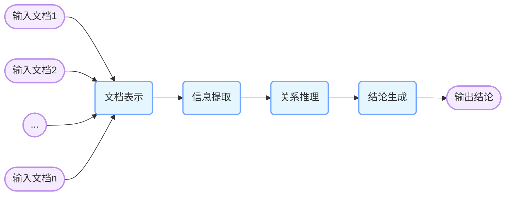

# 基于注意力机制的跨文档推理能力在情报分析中的应用

> 关键词：注意力机制、跨文档推理、情报分析、自然语言处理、深度学习

> 摘要：本文深入探讨了基于注意力机制的跨文档推理能力在情报分析领域的应用。首先介绍了研究的背景、目的、预期读者等信息，接着阐述了注意力机制和跨文档推理的核心概念及其联系，详细讲解了相关核心算法原理并给出Python代码示例，分析了数学模型和公式。通过项目实战展示了具体代码实现和解读，探讨了在情报分析中的实际应用场景。推荐了学习资源、开发工具框架以及相关论文著作，最后总结了未来发展趋势与挑战，并提供常见问题解答和扩展阅读参考资料，旨在为该领域的研究和实践提供全面而深入的指导。

## 1. 背景介绍 
### 1.1 目的和范围
在当今信息爆炸的时代，情报分析面临着海量、多源、异构文档信息的挑战。基于注意力机制的跨文档推理能力旨在从多个相关文档中提取关键信息，发现隐藏的关联和模式，从而为情报分析提供更全面、准确的决策支持。本文的范围涵盖了注意力机制和跨文档推理的基本原理、算法实现、在情报分析中的实际应用，以及相关的工具和资源推荐。

### 1.2 预期读者
本文预期读者包括从事情报分析、自然语言处理、机器学习等领域的研究人员、工程师，以及对基于注意力机制的跨文档推理技术在情报分析中应用感兴趣的专业人士。

### 1.3 文档结构概述
本文首先介绍背景信息，包括目的、预期读者和文档结构。接着阐述核心概念与联系，详细讲解核心算法原理和具体操作步骤，并给出数学模型和公式。通过项目实战展示代码实现和解读，探讨实际应用场景。推荐相关的学习资源、开发工具框架和论文著作。最后总结未来发展趋势与挑战，提供常见问题解答和扩展阅读参考资料。

### 1.4 术语表
#### 1.4.1 核心术语定义
- **注意力机制（Attention Mechanism）**：一种模拟人类注意力分配的机制，能够自动关注输入序列中的重要部分，动态地分配权重。
- **跨文档推理（Cross - Document Reasoning）**：从多个相关文档中提取信息，进行逻辑推理和整合，以获取更全面的知识和结论。
- **情报分析（Intelligence Analysis）**：对各种信息进行收集、整理、分析和评估，以支持决策制定和风险评估。

#### 1.4.2 相关概念解释
- **自然语言处理（Natural Language Processing，NLP）**：研究如何让计算机理解和处理人类语言的技术领域，是实现跨文档推理的基础。
- **深度学习（Deep Learning）**：一类基于人工神经网络的机器学习方法，能够自动学习数据中的复杂模式，广泛应用于注意力机制和跨文档推理。

#### 1.4.3 缩略词列表
- **NLP**：Natural Language Processing
- **RNN**：Recurrent Neural Network
- **LSTM**：Long Short - Term Memory
- **GRU**：Gated Recurrent Unit
- **Transformer**：一种基于注意力机制的深度学习模型

## 2. 核心概念与联系 
### 注意力机制原理
注意力机制的核心思想是在处理输入序列时，为序列中的每个元素分配一个权重，使得模型能够聚焦于重要的元素。在自然语言处理中，输入序列通常是一个词向量序列。

假设输入序列为 $X = [x_1, x_2, \cdots, x_n]$，其中 $x_i$ 是第 $i$ 个元素的向量表示。注意力机制通过计算注意力分数 $e_{ij}$ 来衡量元素 $x_i$ 和 $x_j$ 之间的相关性，通常使用点积、加法等方式计算：

$$e_{ij} = f(x_i, x_j)$$

其中 $f$ 是一个评分函数。然后，通过 softmax 函数将注意力分数转换为注意力权重 $\alpha_{ij}$：

$$\alpha_{ij}=\frac{\exp(e_{ij})}{\sum_{k = 1}^{n}\exp(e_{ik})}$$

最后，根据注意力权重对输入序列进行加权求和，得到上下文向量 $c_i$：

$$c_i=\sum_{j = 1}^{n}\alpha_{ij}x_j$$

### 跨文档推理原理
跨文档推理旨在从多个相关文档中提取信息，进行逻辑推理和整合。其基本步骤包括文档表示、信息提取、关系推理和结论生成。

- **文档表示**：将每个文档转换为向量表示，常用的方法有词袋模型、词嵌入模型（如 Word2Vec、GloVe）和预训练语言模型（如 BERT）。
- **信息提取**：从文档中提取关键信息，如实体、事件、关系等。
- **关系推理**：分析不同文档中信息之间的关系，如因果关系、时间关系、层次关系等。
- **结论生成**：根据推理结果生成最终的结论。

### 核心概念联系
注意力机制在跨文档推理中起着重要作用。在文档表示阶段，注意力机制可以帮助模型聚焦于文档中的重要部分，提高文档表示的质量。在关系推理阶段，注意力机制可以用于衡量不同文档中信息之间的相关性，从而更好地进行推理。

### 文本示意图
```plaintext
输入文档1 --> 文档表示（注意力机制） --> 信息提取 -->
输入文档2 --> 文档表示（注意力机制） --> 信息提取 --> 关系推理（注意力机制） --> 结论生成
...
输入文档n --> 文档表示（注意力机制） --> 信息提取 -->
```

### Mermaid 流程图


## 3. 核心算法原理 & 具体操作步骤 
### 注意力机制算法原理
在深度学习中，最常用的注意力机制是多头注意力机制（Multi - Head Attention），它将注意力机制并行应用多次，以捕捉不同方面的信息。

多头注意力机制的输入包括查询（Query）、键（Key）和值（Value）三个矩阵 $Q$, $K$, $V$。首先，将输入矩阵分别进行线性变换：

$$Q = W_QX$$
$$K = W_KX$$
$$V = W_VX$$

其中 $W_Q$, $W_K$, $W_V$ 是可学习的权重矩阵。然后，计算注意力分数：

$$e_{ij}=\frac{Q_iK_j^T}{\sqrt{d_k}}$$

其中 $d_k$ 是键向量的维度。接着，通过 softmax 函数计算注意力权重：

$$\alpha_{ij}=\frac{\exp(e_{ij})}{\sum_{k = 1}^{n}\exp(e_{ik})}$$

最后，计算上下文向量：

$$c_i=\sum_{j = 1}^{n}\alpha_{ij}V_j$$

多头注意力机制将多个注意力头的输出拼接起来，并进行线性变换：

$$MultiHead(Q, K, V)=W_O[head_1; head_2; \cdots; head_h]$$

其中 $head_i$ 是第 $i$ 个注意力头的输出，$W_O$ 是可学习的权重矩阵。

### Python 代码实现
```python
import torch
import torch.nn as nn

class MultiHeadAttention(nn.Module):
    def __init__(self, d_model, num_heads):
        super(MultiHeadAttention, self).__init__()
        self.d_model = d_model
        self.num_heads = num_heads
        self.d_k = d_model // num_heads

        self.W_Q = nn.Linear(d_model, d_model)
        self.W_K = nn.Linear(d_model, d_model)
        self.W_V = nn.Linear(d_model, d_model)
        self.W_O = nn.Linear(d_model, d_model)

    def scaled_dot_product_attention(self, Q, K, V, mask=None):
        attn_scores = torch.matmul(Q, K.transpose(-2, -1)) / torch.sqrt(torch.tensor(self.d_k, dtype=torch.float32))
        if mask is not None:
            attn_scores = attn_scores.masked_fill(mask == 0, -1e9)
        attn_weights = torch.softmax(attn_scores, dim=-1)
        output = torch.matmul(attn_weights, V)
        return output

    def split_heads(self, x):
        batch_size, seq_length, d_model = x.size()
        return x.view(batch_size, seq_length, self.num_heads, self.d_k).transpose(1, 2)

    def combine_heads(self, x):
        batch_size, num_heads, seq_length, d_k = x.size()
        return x.transpose(1, 2).contiguous().view(batch_size, seq_length, self.d_model)

    def forward(self, Q, K, V, mask=None):
        Q = self.split_heads(self.W_Q(Q))
        K = self.split_heads(self.W_K(K))
        V = self.split_heads(self.W_V(V))

        attn_output = self.scaled_dot_product_attention(Q, K, V, mask)
        output = self.W_O(self.combine_heads(attn_output))
        return output
```

### 跨文档推理操作步骤
1. **数据预处理**：对输入的文档进行清洗、分词、去除停用词等操作。
2. **文档表示**：使用预训练语言模型（如 BERT）将文档转换为向量表示。
3. **信息提取**：使用命名实体识别（NER）、关系抽取等技术从文档中提取关键信息。
4. **关系推理**：使用多头注意力机制计算不同文档中信息之间的相关性，进行关系推理。
5. **结论生成**：根据推理结果生成最终的结论。

### Python 代码示例
```python
import torch
from transformers import BertModel, BertTokenizer

# 加载预训练的 BERT 模型和分词器
tokenizer = BertTokenizer.from_pretrained('bert-base-uncased')
model = BertModel.from_pretrained('bert-base-uncased')

# 输入文档
doc1 = "The company A announced a new product launch last week."
doc2 = "Product X is the new product of company A."

# 数据预处理和文档表示
inputs1 = tokenizer(doc1, return_tensors='pt')
outputs1 = model(**inputs1)
doc1_representation = outputs1.last_hidden_state.mean(dim=1)

inputs2 = tokenizer(doc2, return_tensors='pt')
outputs2 = model(**inputs2)
doc2_representation = outputs2.last_hidden_state.mean(dim=1)

# 定义多头注意力机制
multihead_attn = MultiHeadAttention(d_model=768, num_heads=8)

# 关系推理
query = doc1_representation
key = doc2_representation
value = doc2_representation
output = multihead_attn(query, key, value)

print("推理结果:", output)
```

## 4. 数学模型和公式 & 详细讲解 & 举例说明 
### 多头注意力机制数学模型
多头注意力机制的数学模型可以表示为：

$$MultiHead(Q, K, V)=W_O\sum_{i = 1}^{h}head_i$$

其中 $head_i$ 是第 $i$ 个注意力头的输出，计算公式为：

$$head_i = Attention(W_Q^iQ, W_K^iK, W_V^iV)$$

$$Attention(Q, K, V)=\text{softmax}(\frac{QK^T}{\sqrt{d_k}})V$$

### 详细讲解
- **线性变换**：$W_Q^i$, $W_K^i$, $W_V^i$ 是可学习的权重矩阵，用于将输入的查询、键和值矩阵进行线性变换，得到不同注意力头的输入。
- **注意力计算**：通过点积计算查询和键之间的相关性，除以 $\sqrt{d_k}$ 是为了防止点积结果过大，导致 softmax 函数的梯度消失。
- **多头拼接**：将多个注意力头的输出拼接起来，并通过 $W_O$ 进行线性变换，得到最终的输出。

### 举例说明
假设输入的查询矩阵 $Q$、键矩阵 $K$ 和值矩阵 $V$ 的维度都是 $[batch\_size, seq\_length, d\_model]$，其中 $batch\_size = 2$，$seq\_length = 3$，$d\_model = 8$。多头注意力机制的头数 $h = 2$，$d_k = d\_model // h = 4$。

首先，对 $Q$, $K$, $V$ 进行线性变换，得到 $W_Q^1Q$, $W_K^1K$, $W_V^1V$ 和 $W_Q^2Q$, $W_K^2K$, $W_V^2V$。然后，分别计算两个注意力头的输出：

$$head_1 = Attention(W_Q^1Q, W_K^1K, W_V^1V)$$
$$head_2 = Attention(W_Q^2Q, W_K^2K, W_V^2V)$$

最后，将两个注意力头的输出拼接起来，并通过 $W_O$ 进行线性变换：

$$MultiHead(Q, K, V)=W_O[head_1; head_2]$$

## 5. 项目实战：代码实际案例和详细解释说明 
### 5.1  开发环境搭建
#### 安装 Python
确保已经安装了 Python 3.6 或更高版本。可以从 Python 官方网站（https://www.python.org/downloads/）下载并安装。

#### 安装依赖库
使用 pip 安装所需的依赖库：
```bash
pip install torch transformers
```

### 5.2  源代码详细实现和代码解读
```python
import torch
import torch.nn as nn
from transformers import BertModel, BertTokenizer

# 定义多头注意力机制
class MultiHeadAttention(nn.Module):
    def __init__(self, d_model, num_heads):
        super(MultiHeadAttention, self).__init__()
        self.d_model = d_model
        self.num_heads = num_heads
        self.d_k = d_model // num_heads

        self.W_Q = nn.Linear(d_model, d_model)
        self.W_K = nn.Linear(d_model, d_model)
        self.W_V = nn.Linear(d_model, d_model)
        self.W_O = nn.Linear(d_model, d_model)

    def scaled_dot_product_attention(self, Q, K, V, mask=None):
        attn_scores = torch.matmul(Q, K.transpose(-2, -1)) / torch.sqrt(torch.tensor(self.d_k, dtype=torch.float32))
        if mask is not None:
            attn_scores = attn_scores.masked_fill(mask == 0, -1e9)
        attn_weights = torch.softmax(attn_scores, dim=-1)
        output = torch.matmul(attn_weights, V)
        return output

    def split_heads(self, x):
        batch_size, seq_length, d_model = x.size()
        return x.view(batch_size, seq_length, self.num_heads, self.d_k).transpose(1, 2)

    def combine_heads(self, x):
        batch_size, num_heads, seq_length, d_k = x.size()
        return x.transpose(1, 2).contiguous().view(batch_size, seq_length, self.d_model)

    def forward(self, Q, K, V, mask=None):
        Q = self.split_heads(self.W_Q(Q))
        K = self.split_heads(self.W_K(K))
        V = self.split_heads(self.W_V(V))

        attn_output = self.scaled_dot_product_attention(Q, K, V, mask)
        output = self.W_O(self.combine_heads(attn_output))
        return output

# 加载预训练的 BERT 模型和分词器
tokenizer = BertTokenizer.from_pretrained('bert-base-uncased')
model = BertModel.from_pretrained('bert-base-uncased')

# 输入文档
doc1 = "The company A announced a new product launch last week."
doc2 = "Product X is the new product of company A."

# 数据预处理和文档表示
inputs1 = tokenizer(doc1, return_tensors='pt')
outputs1 = model(**inputs1)
doc1_representation = outputs1.last_hidden_state.mean(dim=1)

inputs2 = tokenizer(doc2, return_tensors='pt')
outputs2 = model(**inputs2)
doc2_representation = outputs2.last_hidden_state.mean(dim=1)

# 定义多头注意力机制
multihead_attn = MultiHeadAttention(d_model=768, num_heads=8)

# 关系推理
query = doc1_representation
key = doc2_representation
value = doc2_representation
output = multihead_attn(query, key, value)

print("推理结果:", output)
```

### 代码解读与分析
1. **多头注意力机制类 `MultiHeadAttention`**：
    - `__init__` 方法：初始化模型的参数，包括输入维度 `d_model`、头数 `num_heads` 和每个头的维度 `d_k`。同时，定义了线性变换的权重矩阵 $W_Q$, $W_K$, $W_V$, $W_O$。
    - `scaled_dot_product_attention` 方法：计算注意力分数、注意力权重和上下文向量。
    - `split_heads` 方法：将输入矩阵按头数进行分割。
    - `combine_heads` 方法：将分割后的矩阵拼接起来。
    - `forward` 方法：实现多头注意力机制的前向传播。

2. **文档表示**：
    - 使用 `BertTokenizer` 对输入文档进行分词和编码。
    - 使用 `BertModel` 对编码后的输入进行处理，得到文档的向量表示。

3. **关系推理**：
    - 将文档 1 的表示作为查询，文档 2 的表示作为键和值，输入到多头注意力机制中进行推理。
    - 输出推理结果。

## 6. 实际应用场景 
### 情报收集与整合
在情报收集阶段，可能会获取到来自不同渠道的大量文档，如新闻报道、社交媒体帖子、政府报告等。基于注意力机制的跨文档推理可以帮助情报分析人员快速聚焦于重要的信息，整合不同文档中的相关内容，提高情报收集的效率和准确性。

### 威胁评估
在进行威胁评估时，需要分析多个文档中关于潜在威胁的信息，如恐怖组织的活动、网络攻击的迹象等。跨文档推理可以帮助分析人员发现不同威胁之间的关联和趋势，预测可能的威胁事件，为决策制定提供有力支持。

### 态势感知
在军事、安全等领域，态势感知是非常重要的。通过对多个文档中关于战场态势、社会稳定等信息的分析，跨文档推理可以帮助分析人员全面了解当前的态势，及时发现异常情况，采取相应的措施。

### 情报预测
基于历史文档和实时信息，跨文档推理可以帮助分析人员发现隐藏的规律和趋势，进行情报预测。例如，预测市场趋势、政治局势的变化等，为企业和政府的决策提供参考。

## 7. 工具和资源推荐
### 7.1 学习资源推荐
#### 7.1.1 书籍推荐
- 《深度学习》（Deep Learning）：由 Ian Goodfellow、Yoshua Bengio 和 Aaron Courville 编写，是深度学习领域的经典教材，涵盖了神经网络、优化算法、卷积神经网络等基础知识。
- 《自然语言处理入门》（Natural Language Processing with Python）：介绍了使用 Python 进行自然语言处理的基本方法和技术，包括分词、词性标注、命名实体识别等。
- 《Attention Is All You Need》论文解读相关书籍：深入理解注意力机制和 Transformer 模型的原理和应用。

#### 7.1.2 在线课程
- Coursera 上的“深度学习专项课程”（Deep Learning Specialization）：由 Andrew Ng 教授讲授，包括神经网络和深度学习、改善深层神经网络、结构化机器学习项目、卷积神经网络和序列模型等课程。
- edX 上的“自然语言处理基础”（Foundations of Natural Language Processing）：介绍自然语言处理的基本概念、算法和应用。

#### 7.1.3 技术博客和网站
- Medium：有许多关于深度学习、自然语言处理的技术博客，如 Towards Data Science。
- arXiv：提供最新的学术论文，包括注意力机制和跨文档推理领域的研究成果。

### 7.2 开发工具框架推荐
#### 7.2.1 IDE和编辑器
- PyCharm：一款专业的 Python 集成开发环境，提供代码编辑、调试、版本控制等功能。
- Jupyter Notebook：交互式的开发环境，适合进行数据分析和模型实验。

#### 7.2.2 调试和性能分析工具
- TensorBoard：用于可视化深度学习模型的训练过程和性能指标。
- PyTorch Profiler：帮助分析 PyTorch 模型的性能瓶颈。

#### 7.2.3 相关框架和库
- PyTorch：一个开源的深度学习框架，提供了丰富的神经网络层和优化算法。
- Transformers：Hugging Face 开发的库，提供了预训练的语言模型和相关工具，方便进行自然语言处理任务。

### 7.3 相关论文著作推荐
#### 7.3.1 经典论文
- 《Attention Is All You Need》：提出了 Transformer 模型，是注意力机制在自然语言处理领域的经典论文。
- 《BERT: Pre - training of Deep Bidirectional Transformers for Language Understanding》：介绍了 BERT 模型，是预训练语言模型的重要突破。

#### 7.3.2 最新研究成果
- 关注 arXiv 上关于注意力机制和跨文档推理的最新论文，了解该领域的前沿研究。

#### 7.3.3 应用案例分析
- 一些学术会议和期刊上会发表关于注意力机制和跨文档推理在情报分析等领域的应用案例，如 ACL、EMNLP 等会议。

## 8. 总结：未来发展趋势与挑战
### 未来发展趋势
- **模型融合**：将注意力机制与其他深度学习模型（如卷积神经网络、循环神经网络）相结合，提高跨文档推理的性能。
- **多模态融合**：结合文本、图像、音频等多模态信息进行跨文档推理，提供更全面的情报分析。
- **可解释性研究**：提高基于注意力机制的跨文档推理模型的可解释性，让分析人员更好地理解模型的决策过程。
- **自动化情报分析系统**：开发自动化的情报分析系统，实现从文档收集、信息提取到推理结论生成的全流程自动化。

### 挑战
- **数据质量和数量**：高质量的标注数据是训练有效模型的关键，但获取大量、准确的标注数据是一个挑战。
- **计算资源需求**：基于注意力机制的深度学习模型通常需要大量的计算资源，如何在有限的资源下提高模型的效率是一个问题。
- **语义理解和推理能力**：目前的模型在语义理解和复杂推理方面还存在不足，需要进一步提高模型的智能水平。
- **隐私和安全问题**：在情报分析中，涉及大量的敏感信息，如何保障数据的隐私和安全是一个重要的挑战。

## 9. 附录：常见问题与解答
### 问题 1：注意力机制和跨文档推理有什么区别？
注意力机制是一种用于聚焦输入序列中重要部分的技术，而跨文档推理是从多个相关文档中提取信息进行逻辑推理和整合的过程。注意力机制可以应用于跨文档推理中，帮助模型更好地处理文档信息。

### 问题 2：如何选择合适的预训练语言模型进行文档表示？
可以根据任务的需求和数据的特点选择合适的预训练语言模型。如果数据是英文文本，可以选择 BERT、RoBERTa 等模型；如果是中文文本，可以选择 Chinese - BERT 等模型。同时，也可以考虑模型的大小和计算资源的限制。

### 问题 3：跨文档推理模型的训练过程需要注意什么？
在训练跨文档推理模型时，需要注意以下几点：
- 数据的质量和多样性：确保训练数据包含各种类型的文档和信息。
- 模型的复杂度：避免模型过于复杂导致过拟合。
- 训练参数的调整：如学习率、批量大小等，需要根据具体情况进行调整。

### 问题 4：如何评估跨文档推理模型的性能？
可以使用以下指标评估跨文档推理模型的性能：
- 准确率（Accuracy）：预测正确的样本数占总样本数的比例。
- 召回率（Recall）：预测正确的正样本数占实际正样本数的比例。
- F1 值（F1 - score）：准确率和召回率的调和平均数。

## 10. 扩展阅读 & 参考资料
### 扩展阅读
- 《神经网络与深度学习》（Neural Networks and Deep Learning）：进一步深入学习神经网络和深度学习的原理和应用。
- 《人工智能：一种现代方法》（Artificial Intelligence: A Modern Approach）：全面介绍人工智能的各个领域，包括自然语言处理、机器学习等。

### 参考资料
- Vaswani, A., Shazeer, N., Parmar, N., et al. (2017). Attention Is All You Need. Advances in Neural Information Processing Systems.
- Devlin, J., Chang, M. W., Lee, K., & Toutanova, K. (2018). BERT: Pre - training of Deep Bidirectional Transformers for Language Understanding. arXiv preprint arXiv:1810.04805.
- Hugging Face 官方文档：https://huggingface.co/docs
- PyTorch 官方文档：https://pytorch.org/docs/stable/index.html