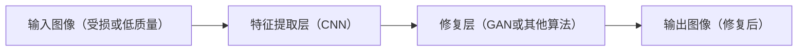

# 基于深度学习的AI图像修复技术进展

> 关键词：深度学习、AI图像修复、卷积神经网络、生成对抗网络、图像补全、图像去噪、图像超分辨率

> 摘要：本文深入探讨了基于深度学习的AI图像修复技术的进展。首先介绍了该技术的背景，包括目的、预期读者、文档结构和相关术语。接着阐述了核心概念与联系，包括图像修复的原理和架构，并通过Mermaid流程图进行展示。详细讲解了核心算法原理，使用Python源代码进行说明。介绍了相关的数学模型和公式，并举例说明。通过项目实战给出代码实际案例和详细解释。分析了实际应用场景，推荐了相关的学习资源、开发工具框架和论文著作。最后总结了未来发展趋势与挑战，并提供了常见问题与解答以及扩展阅读和参考资料，旨在为读者全面呈现基于深度学习的AI图像修复技术的全貌。

## 1. 背景介绍 
### 1.1 目的和范围
图像在现代社会中无处不在，从日常生活中的照片到医学影像、卫星遥感图像等专业领域的图像，都可能因为各种原因出现损坏或质量不佳的情况。基于深度学习的AI图像修复技术的目的就是利用深度学习的强大能力，自动修复这些受损或低质量的图像，恢复图像的原始信息或提升图像的质量。

本技术的范围涵盖了多种图像修复任务，如去除图像中的噪声、填补图像中的缺失部分、提高图像的分辨率等。它可以应用于多个领域，包括计算机视觉、医学图像处理、遥感图像处理、数字娱乐等。

### 1.2 预期读者
本文预期读者包括计算机科学、图像处理、人工智能等相关专业的学生、研究人员，以及对图像修复技术感兴趣的工程师和开发者。对于想要了解深度学习在图像修复领域应用的初学者，本文可以提供基础的知识和技术介绍；对于有一定经验的专业人士，本文可以作为技术参考和研究思路的启发。

### 1.3 文档结构概述
本文将按照以下结构进行组织：首先介绍基于深度学习的AI图像修复技术的背景知识，包括目的、预期读者和相关术语；然后详细阐述核心概念与联系，通过文本示意图和Mermaid流程图展示图像修复的原理和架构；接着讲解核心算法原理，并使用Python源代码进行说明；介绍相关的数学模型和公式，并举例说明；通过项目实战给出代码实际案例和详细解释；分析实际应用场景；推荐相关的学习资源、开发工具框架和论文著作；最后总结未来发展趋势与挑战，并提供常见问题与解答以及扩展阅读和参考资料。

### 1.4 术语表
#### 1.4.1 核心术语定义
- **深度学习（Deep Learning）**：一种基于人工神经网络的机器学习方法，通过构建多层神经网络来学习数据的复杂模式和特征。
- **AI图像修复（AI Image Inpainting）**：利用人工智能技术，特别是深度学习算法，对受损或低质量的图像进行修复和增强的过程。
- **卷积神经网络（Convolutional Neural Network, CNN）**：一种专门用于处理具有网格结构数据（如图像）的深度学习模型，通过卷积层、池化层等组件提取图像的特征。
- **生成对抗网络（Generative Adversarial Network, GAN）**：由生成器和判别器组成的深度学习模型，通过两者的对抗训练来生成逼真的数据，在图像修复中常用于生成缺失部分的图像内容。
- **图像去噪（Image Denoising）**：去除图像中噪声的过程，噪声可能是由于图像采集设备、传输过程等原因引入的。
- **图像补全（Image Completion）**：填补图像中缺失部分的过程，缺失部分可能是由于遮挡、损坏等原因造成的。
- **图像超分辨率（Image Super-Resolution）**：提高图像分辨率的过程，通过从低分辨率图像中恢复出高分辨率图像的细节。

#### 1.4.2 相关概念解释
- **特征提取**：从原始图像中提取出具有代表性的特征，以便后续的处理和分析。在深度学习中，卷积神经网络通过卷积层和池化层自动学习图像的特征。
- **损失函数**：用于衡量模型预测结果与真实结果之间的差异，在图像修复中，常用的损失函数包括均方误差（Mean Squared Error, MSE）、感知损失（Perceptual Loss）等。
- **训练过程**：通过大量的训练数据，调整模型的参数，使得模型的损失函数最小化，从而提高模型的性能。
- **推理过程**：在模型训练完成后，使用训练好的模型对新的图像进行修复的过程。

#### 1.4.3 缩略词列表
- **CNN**：Convolutional Neural Network（卷积神经网络）
- **GAN**：Generative Adversarial Network（生成对抗网络）
- **MSE**：Mean Squared Error（均方误差）
- **PSNR**：Peak Signal-to-Noise Ratio（峰值信噪比）
- **SSIM**：Structural Similarity Index（结构相似性指数）

## 2. 核心概念与联系 

### 图像修复的原理
基于深度学习的AI图像修复技术的核心原理是利用深度学习模型学习大量图像的统计特征和模式，从而能够根据图像的上下文信息来预测和修复受损或缺失的部分。

深度学习模型通常采用卷积神经网络（CNN）或生成对抗网络（GAN）。CNN通过卷积层提取图像的局部特征，池化层对特征进行降维，全连接层对特征进行分类或回归。在图像修复中，CNN可以学习到图像的纹理、边缘等特征，从而根据这些特征来修复图像。

GAN由生成器和判别器组成。生成器的任务是生成逼真的图像，判别器的任务是区分生成的图像和真实的图像。通过两者的对抗训练，生成器能够学习到图像的分布，从而生成高质量的图像。在图像修复中，生成器可以根据图像的上下文信息生成缺失部分的图像内容，判别器则用于判断生成的内容是否逼真。

### 图像修复的架构
图像修复的架构通常包括输入层、特征提取层、修复层和输出层。

- **输入层**：接收受损或低质量的图像作为输入。
- **特征提取层**：使用卷积神经网络提取图像的特征。
- **修复层**：根据提取的特征，使用生成器或其他修复算法生成修复后的图像。
- **输出层**：输出修复后的图像。

### 文本示意图
```plaintext
输入图像（受损或低质量） -> 特征提取层（CNN） -> 修复层（GAN或其他算法） -> 输出图像（修复后）
```

### Mermaid流程图


## 3. 核心算法原理 & 具体操作步骤 

### 卷积神经网络（CNN）
卷积神经网络是一种专门用于处理具有网格结构数据（如图像）的深度学习模型。它通过卷积层、池化层和全连接层来提取图像的特征。

#### 卷积层
卷积层是CNN的核心组件，它通过卷积操作提取图像的局部特征。卷积操作是将一个卷积核（也称为滤波器）在图像上滑动，计算卷积核与图像局部区域的点积，得到一个特征图。

以下是一个简单的Python代码示例，使用PyTorch实现一个卷积层：
```python
import torch
import torch.nn as nn

# 定义一个卷积层
conv_layer = nn.Conv2d(in_channels=3, out_channels=16, kernel_size=3, stride=1, padding=1)

# 输入图像
input_image = torch.randn(1, 3, 32, 32)

# 进行卷积操作
output_feature_map = conv_layer(input_image)

print("输入图像形状:", input_image.shape)
print("输出特征图形状:", output_feature_map.shape)
```

#### 池化层
池化层用于对特征图进行降维，减少计算量和参数数量。常用的池化操作包括最大池化和平均池化。

以下是一个简单的Python代码示例，使用PyTorch实现一个最大池化层：
```python
import torch
import torch.nn as nn

# 定义一个最大池化层
max_pool_layer = nn.MaxPool2d(kernel_size=2, stride=2)

# 输入特征图
input_feature_map = torch.randn(1, 16, 32, 32)

# 进行最大池化操作
output_pooled_feature_map = max_pool_layer(input_feature_map)

print("输入特征图形状:", input_feature_map.shape)
print("输出池化特征图形状:", output_pooled_feature_map.shape)
```

#### 全连接层
全连接层用于对特征进行分类或回归。它将特征图展平成一维向量，然后通过线性变换得到输出。

以下是一个简单的Python代码示例，使用PyTorch实现一个全连接层：
```python
import torch
import torch.nn as nn

# 定义一个全连接层
fc_layer = nn.Linear(in_features=16 * 16 * 16, out_features=10)

# 输入特征图
input_feature_map = torch.randn(1, 16, 16, 16)

# 展平特征图
flattened_feature_map = input_feature_map.view(1, -1)

# 进行全连接操作
output = fc_layer(flattened_feature_map)

print("输入特征图形状:", input_feature_map.shape)
print("展平后特征图形状:", flattened_feature_map.shape)
print("输出形状:", output.shape)
```

### 生成对抗网络（GAN）
生成对抗网络由生成器和判别器组成。生成器的任务是生成逼真的图像，判别器的任务是区分生成的图像和真实的图像。

以下是一个简单的Python代码示例，使用PyTorch实现一个简单的GAN：
```python
import torch
import torch.nn as nn
import torch.optim as optim
import numpy as np
import matplotlib.pyplot as plt

# 定义生成器
class Generator(nn.Module):
    def __init__(self):
        super(Generator, self).__init__()
        self.fc1 = nn.Linear(100, 128)
        self.fc2 = nn.Linear(128, 784)
        self.relu = nn.ReLU()
        self.sigmoid = nn.Sigmoid()

    def forward(self, x):
        x = self.relu(self.fc1(x))
        x = self.sigmoid(self.fc2(x))
        return x

# 定义判别器
class Discriminator(nn.Module):
    def __init__(self):
        super(Discriminator, self).__init__()
        self.fc1 = nn.Linear(784, 128)
        self.fc2 = nn.Linear(128, 1)
        self.relu = nn.ReLU()
        self.sigmoid = nn.Sigmoid()

    def forward(self, x):
        x = self.relu(self.fc1(x))
        x = self.sigmoid(self.fc2(x))
        return x

# 初始化生成器和判别器
generator = Generator()
discriminator = Discriminator()

# 定义损失函数和优化器
criterion = nn.BCELoss()
g_optimizer = optim.Adam(generator.parameters(), lr=0.001)
d_optimizer = optim.Adam(discriminator.parameters(), lr=0.001)

# 训练GAN
num_epochs = 1000
for epoch in range(num_epochs):
    # 生成随机噪声
    noise = torch.randn(1, 100)

    # 生成假图像
    fake_image = generator(noise)

    # 训练判别器
    d_optimizer.zero_grad()
    real_labels = torch.ones(1, 1)
    fake_labels = torch.zeros(1, 1)

    # 计算判别器对真实图像的损失
    real_image = torch.randn(1, 784)
    real_output = discriminator(real_image)
    d_loss_real = criterion(real_output, real_labels)

    # 计算判别器对假图像的损失
    fake_output = discriminator(fake_image.detach())
    d_loss_fake = criterion(fake_output, fake_labels)

    # 总判别器损失
    d_loss = d_loss_real + d_loss_fake
    d_loss.backward()
    d_optimizer.step()

    # 训练生成器
    g_optimizer.zero_grad()
    fake_output = discriminator(fake_image)
    g_loss = criterion(fake_output, real_labels)
    g_loss.backward()
    g_optimizer.step()

    if epoch % 100 == 0:
        print(f'Epoch {epoch}, D Loss: {d_loss.item()}, G Loss: {g_loss.item()}')

# 生成一些假图像进行可视化
num_samples = 16
noise = torch.randn(num_samples, 100)
fake_images = generator(noise).detach().numpy().reshape(num_samples, 28, 28)

fig, axes = plt.subplots(4, 4, figsize=(4, 4))
for i in range(4):
    for j in range(4):
        axes[i, j].imshow(fake_images[i * 4 + j], cmap='gray')
        axes[i, j].axis('off')
plt.show()
```

### 具体操作步骤
1. **数据准备**：收集大量的图像数据，并将其分为训练集、验证集和测试集。对图像数据进行预处理，如归一化、裁剪等。
2. **模型选择**：根据具体的图像修复任务，选择合适的深度学习模型，如CNN、GAN等。
3. **模型训练**：使用训练集对模型进行训练，调整模型的参数，使得模型的损失函数最小化。在训练过程中，可以使用验证集来监控模型的性能，防止过拟合。
4. **模型评估**：使用测试集对训练好的模型进行评估，计算模型的性能指标，如峰值信噪比（PSNR）、结构相似性指数（SSIM）等。
5. **模型应用**：将训练好的模型应用于实际的图像修复任务中，对受损或低质量的图像进行修复。

## 4. 数学模型和公式 & 详细讲解 & 举例说明 

### 均方误差（MSE）
均方误差是一种常用的损失函数，用于衡量模型预测结果与真实结果之间的差异。其数学公式为：
$$MSE = \frac{1}{n} \sum_{i=1}^{n} (y_i - \hat{y}_i)^2$$
其中，$n$ 是样本数量，$y_i$ 是真实值，$\hat{y}_i$ 是预测值。

在图像修复中，均方误差可以用于衡量修复后的图像与原始图像之间的差异。

以下是一个简单的Python代码示例，计算均方误差：
```python
import numpy as np

# 真实图像
y = np.array([1, 2, 3, 4, 5])

# 预测图像
y_hat = np.array([1.1, 2.1, 3.1, 4.1, 5.1])

# 计算均方误差
mse = np.mean((y - y_hat) ** 2)

print("均方误差:", mse)
```

### 峰值信噪比（PSNR）
峰值信噪比是一种用于衡量图像质量的指标，其数学公式为：
$$PSNR = 10 \log_{10} \left( \frac{MAX_I^2}{MSE} \right)$$
其中，$MAX_I$ 是图像的最大像素值，$MSE$ 是均方误差。

PSNR值越高，说明图像质量越好。

以下是一个简单的Python代码示例，计算峰值信噪比：
```python
import numpy as np

# 真实图像
y = np.array([1, 2, 3, 4, 5])

# 预测图像
y_hat = np.array([1.1, 2.1, 3.1, 4.1, 5.1])

# 计算均方误差
mse = np.mean((y - y_hat) ** 2)

# 图像的最大像素值
MAX_I = 255

# 计算峰值信噪比
psnr = 10 * np.log10(MAX_I ** 2 / mse)

print("峰值信噪比:", psnr)
```

### 结构相似性指数（SSIM）
结构相似性指数是一种用于衡量图像结构相似性的指标，其数学公式为：
$$SSIM(x, y) = \frac{(2\mu_x\mu_y + c_1)(2\sigma_{xy} + c_2)}{(\mu_x^2 + \mu_y^2 + c_1)(\sigma_x^2 + \sigma_y^2 + c_2)}$$
其中，$\mu_x$ 和 $\mu_y$ 分别是图像 $x$ 和 $y$ 的均值，$\sigma_x^2$ 和 $\sigma_y^2$ 分别是图像 $x$ 和 $y$ 的方差，$\sigma_{xy}$ 是图像 $x$ 和 $y$ 的协方差，$c_1$ 和 $c_2$ 是常数，用于保持稳定性。

SSIM值越接近1，说明图像结构越相似。

以下是一个简单的Python代码示例，使用`skimage`库计算结构相似性指数：
```python
from skimage.metrics import structural_similarity as ssim
import numpy as np
import cv2

# 读取图像
image1 = cv2.imread('image1.jpg', 0)
image2 = cv2.imread('image2.jpg', 0)

# 计算结构相似性指数
ssim_value = ssim(image1, image2)

print("结构相似性指数:", ssim_value)
```

## 5. 项目实战：代码实际案例和详细解释说明 

### 5.1  开发环境搭建
#### 安装Python
首先，确保你已经安装了Python 3.x版本。你可以从Python官方网站（https://www.python.org/downloads/）下载并安装Python。

#### 安装深度学习框架
本文使用PyTorch作为深度学习框架。你可以使用以下命令安装PyTorch：
```sh
pip install torch torchvision
```

#### 安装其他依赖库
还需要安装一些其他的依赖库，如`numpy`、`matplotlib`、`opencv-python`等。你可以使用以下命令安装：
```sh
pip install numpy matplotlib opencv-python
```

### 5.2  源代码详细实现和代码解读
以下是一个使用PyTorch实现的简单图像去噪项目的代码示例：
```python
import torch
import torch.nn as nn
import torch.optim as optim
import numpy as np
import cv2
import matplotlib.pyplot as plt

# 定义一个简单的卷积去噪网络
class DenoisingNet(nn.Module):
    def __init__(self):
        super(DenoisingNet, self).__init__()
        self.conv1 = nn.Conv2d(in_channels=1, out_channels=16, kernel_size=3, stride=1, padding=1)
        self.relu1 = nn.ReLU()
        self.conv2 = nn.Conv2d(in_channels=16, out_channels=1, kernel_size=3, stride=1, padding=1)
        self.sigmoid = nn.Sigmoid()

    def forward(self, x):
        x = self.relu1(self.conv1(x))
        x = self.sigmoid(self.conv2(x))
        return x

# 读取图像
image = cv2.imread('image.jpg', 0)
image = cv2.resize(image, (256, 256))
image = image / 255.0
image = np.expand_dims(image, axis=0)
image = np.expand_dims(image, axis=0)
image = torch.from_numpy(image).float()

# 添加噪声
noise = torch.randn_like(image) * 0.1
noisy_image = image + noise

# 初始化模型、损失函数和优化器
model = DenoisingNet()
criterion = nn.MSELoss()
optimizer = optim.Adam(model.parameters(), lr=0.001)

# 训练模型
num_epochs = 100
for epoch in range(num_epochs):
    optimizer.zero_grad()
    output = model(noisy_image)
    loss = criterion(output, image)
    loss.backward()
    optimizer.step()

    if epoch % 10 == 0:
        print(f'Epoch {epoch}, Loss: {loss.item()}')

# 去噪后的图像
denoised_image = model(noisy_image).detach().numpy()[0, 0]

# 可视化结果
fig, axes = plt.subplots(1, 3, figsize=(15, 5))
axes[0].imshow(image.numpy()[0, 0], cmap='gray')
axes[0].set_title('Original Image')
axes[1].imshow(noisy_image.numpy()[0, 0], cmap='gray')
axes[1].set_title('Noisy Image')
axes[2].imshow(denoised_image, cmap='gray')
axes[2].set_title('Denoised Image')
plt.show()
```

### 5.3  代码解读与分析
1. **定义卷积去噪网络**：`DenoisingNet`类定义了一个简单的卷积去噪网络，包含一个卷积层、一个ReLU激活函数、另一个卷积层和一个Sigmoid激活函数。
2. **读取图像并添加噪声**：使用`cv2.imread`函数读取图像，并将其调整为256x256的大小。将图像归一化到[0, 1]范围，并添加高斯噪声。
3. **初始化模型、损失函数和优化器**：使用`DenoisingNet`类初始化模型，使用均方误差损失函数（MSE）和Adam优化器。
4. **训练模型**：在每个训练周期中，前向传播计算输出，计算损失，反向传播更新模型参数。
5. **可视化结果**：使用`matplotlib`库将原始图像、噪声图像和去噪后的图像进行可视化。

## 6. 实际应用场景 
### 数字图像修复
在数字图像领域，基于深度学习的AI图像修复技术可以用于修复老照片、去除图像中的水印、填补图像中的缺失部分等。例如，对于一些珍贵的老照片，由于时间的原因可能会出现褪色、划痕等问题，使用图像修复技术可以恢复照片的原始风貌。

### 医学图像处理
在医学图像处理中，图像修复技术可以用于去除医学影像中的噪声、填补影像中的缺失部分等。例如，在X光、CT、MRI等医学影像中，由于设备噪声、患者运动等原因可能会导致影像质量不佳，使用图像修复技术可以提高医学影像的质量，帮助医生更准确地进行诊断。

### 遥感图像处理
在遥感图像处理中，图像修复技术可以用于去除遥感图像中的云、雾等遮挡物，填补图像中的缺失部分等。例如，卫星遥感图像可能会受到云层的遮挡，导致部分区域的信息缺失，使用图像修复技术可以恢复这些缺失的信息，提高遥感图像的可用性。

### 数字娱乐
在数字娱乐领域，图像修复技术可以用于游戏、电影等的特效制作。例如，在游戏中，可以使用图像修复技术对角色模型、场景等进行修复和增强，提高游戏的视觉效果。在电影中，可以使用图像修复技术对一些老旧电影进行修复和高清化处理，提高电影的观赏体验。

## 7. 工具和资源推荐
### 7.1 学习资源推荐
#### 7.1.1 书籍推荐
- 《深度学习》（Deep Learning）：由Ian Goodfellow、Yoshua Bengio和Aaron Courville所著，是深度学习领域的经典教材，涵盖了深度学习的基本概念、算法和应用。
- 《Python深度学习》（Deep Learning with Python）：由Francois Chollet所著，通过Python和Keras框架介绍深度学习的基本概念和实践应用。
- 《计算机视觉：算法与应用》（Computer Vision: Algorithms and Applications）：由Richard Szeliski所著，全面介绍了计算机视觉的基本概念、算法和应用，包括图像修复技术。

#### 7.1.2 在线课程
- Coursera上的“深度学习专项课程”（Deep Learning Specialization）：由Andrew Ng教授讲授，包括深度学习的基础、卷积神经网络、循环神经网络等内容。
- edX上的“人工智能基础”（Introduction to Artificial Intelligence）：介绍了人工智能的基本概念、算法和应用，包括深度学习和图像修复技术。
- 哔哩哔哩上的一些计算机视觉和深度学习相关的视频教程，如“李宏毅机器学习”等。

#### 7.1.3 技术博客和网站
- Medium：一个技术博客平台，有很多关于深度学习和图像修复技术的文章。
- arXiv：一个预印本平台，有很多最新的深度学习和计算机视觉相关的研究论文。
- 知乎：一个知识问答社区，有很多关于深度学习和图像修复技术的讨论和分享。

### 7.2 开发工具框架推荐
#### 7.2.1 IDE和编辑器
- PyCharm：一款专门用于Python开发的集成开发环境，提供了丰富的功能，如代码编辑、调试、版本控制等。
- Jupyter Notebook：一个交互式的开发环境，适合进行数据分析、模型训练和可视化等工作。
- Visual Studio Code：一款轻量级的代码编辑器，支持多种编程语言和插件，可用于Python开发。

#### 7.2.2 调试和性能分析工具
- PyTorch Profiler：PyTorch提供的性能分析工具，可以帮助开发者分析模型的性能瓶颈。
- TensorBoard：TensorFlow提供的可视化工具，也可以用于PyTorch模型的可视化和性能分析。
- NVIDIA Nsight Systems：一款用于GPU性能分析的工具，可以帮助开发者优化GPU代码。

#### 7.2.3 相关框架和库
- PyTorch：一个开源的深度学习框架，提供了丰富的深度学习模型和工具，支持GPU加速。
- TensorFlow：一个开源的深度学习框架，由Google开发，广泛应用于工业界和学术界。
- OpenCV：一个开源的计算机视觉库，提供了丰富的图像处理和计算机视觉算法。

### 7.3 相关论文著作推荐
#### 7.3.1 经典论文
- “Generative Adversarial Nets”：Ian Goodfellow等人提出了生成对抗网络（GAN）的概念。
- “ImageNet Classification with Deep Convolutional Neural Networks”：Alex Krizhevsky等人提出了AlexNet，开创了深度学习在图像分类领域的先河。
- “Very Deep Convolutional Networks for Large-Scale Image Recognition”：Karen Simonyan和Andrew Zisserman提出了VGGNet，证明了深度卷积神经网络的有效性。

#### 7.3.2 最新研究成果
- 在arXiv和各大计算机视觉会议（如CVPR、ICCV、ECCV等）上可以找到关于基于深度学习的AI图像修复技术的最新研究成果。

#### 7.3.3 应用案例分析
- 在一些学术期刊和会议论文中，可以找到基于深度学习的AI图像修复技术在医学图像处理、遥感图像处理等领域的应用案例分析。

## 8. 总结：未来发展趋势与挑战
### 未来发展趋势
- **多模态融合**：将图像修复技术与其他模态的数据（如文本、音频等）进行融合，实现更复杂的图像修复任务。例如，结合文本描述来修复图像中的缺失部分。
- **实时性提升**：随着硬件技术的不断发展，图像修复技术的实时性将得到进一步提升，使其能够应用于更多的实时场景，如视频监控、自动驾驶等。
- **个性化修复**：根据用户的需求和偏好，实现个性化的图像修复。例如，用户可以选择不同的修复风格和效果。
- **跨领域应用**：图像修复技术将在更多的领域得到应用，如文化遗产保护、生物医学、智能安防等。

### 挑战
- **数据不足**：深度学习模型需要大量的训练数据，但是在某些领域，如医学图像处理、文化遗产保护等，数据的获取比较困难，这可能会影响模型的性能。
- **计算资源需求大**：深度学习模型的训练和推理需要大量的计算资源，这对于一些小型企业和个人开发者来说可能是一个挑战。
- **模型可解释性差**：深度学习模型通常是黑盒模型，其决策过程难以解释，这在一些对安全性和可靠性要求较高的领域（如医学诊断、自动驾驶等）可能会受到限制。
- **伦理和法律问题**：图像修复技术可能会被用于伪造图像、篡改证据等非法活动，这需要建立相应的伦理和法律规范来进行约束。

## 9. 附录：常见问题与解答
### 问题1：如何选择合适的深度学习模型进行图像修复？
答：选择合适的深度学习模型需要考虑具体的图像修复任务和数据特点。如果是简单的图像去噪任务，可以选择简单的卷积神经网络；如果是复杂的图像补全任务，可以选择生成对抗网络。同时，还需要考虑数据的规模和质量，以及计算资源的限制。

### 问题2：图像修复技术的性能指标有哪些？
答：常见的图像修复技术的性能指标包括均方误差（MSE）、峰值信噪比（PSNR）、结构相似性指数（SSIM）等。MSE衡量修复后的图像与原始图像之间的差异，PSNR衡量图像的质量，SSIM衡量图像的结构相似性。

### 问题3：如何提高图像修复模型的性能？
答：可以从以下几个方面提高图像修复模型的性能：增加训练数据的数量和多样性、选择合适的模型结构和超参数、使用数据增强技术、采用多模型融合等方法。

### 问题4：图像修复技术在实际应用中存在哪些局限性？
答：图像修复技术在实际应用中存在一些局限性，如对于严重损坏的图像，修复效果可能不理想；模型的泛化能力有限，对于不同风格和场景的图像，修复效果可能会有所差异；模型的计算资源需求大，实时性较差等。

## 10. 扩展阅读 & 参考资料
- Goodfellow, I. J., Bengio, Y., & Courville, A. (2016). Deep Learning. MIT Press.
- Chollet, F. (2017). Deep Learning with Python. Manning Publications.
- Szeliski, R. (2010). Computer Vision: Algorithms and Applications. Springer.
- Goodfellow, I. J., et al. (2014). Generative Adversarial Nets. Advances in Neural Information Processing Systems.
- Krizhevsky, A., Sutskever, I., & Hinton, G. E. (2012). ImageNet Classification with Deep Convolutional Neural Networks. Advances in Neural Information Processing Systems.
- Simonyan, K., & Zisserman, A. (2014). Very Deep Convolutional Networks for Large-Scale Image Recognition. arXiv preprint arXiv:1409.1556.
- 相关的学术期刊和会议论文，如IEEE Transactions on Pattern Analysis and Machine Intelligence、CVPR、ICCV、ECCV等。
- 相关的技术博客和网站，如Medium、arXiv、知乎等。