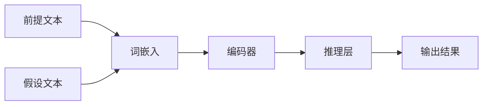
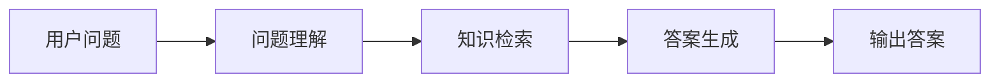

# 基于深度学习的AI自然语言推理与常识问答系统

> 关键词：深度学习、自然语言推理、常识问答系统、预训练模型、Transformer架构

> 摘要：本文围绕基于深度学习的AI自然语言推理与常识问答系统展开深入探讨。首先介绍了该领域的背景，包括目的、预期读者、文档结构和相关术语。接着阐述了核心概念，如自然语言推理和常识问答的原理与架构，并给出了相应的文本示意图和Mermaid流程图。详细讲解了核心算法原理，结合Python代码进行具体操作步骤的说明。同时，给出了相关的数学模型和公式，并举例说明。通过项目实战，展示了开发环境搭建、源代码实现及代码解读。分析了实际应用场景，推荐了学习资源、开发工具框架和相关论文著作。最后总结了未来发展趋势与挑战，还提供了常见问题解答和扩展阅读参考资料，旨在为读者全面呈现基于深度学习的自然语言推理与常识问答系统的技术全貌。

## 1. 背景介绍 
### 1.1 目的和范围
自然语言处理（NLP）作为人工智能领域的重要分支，旨在让计算机能够理解和处理人类语言。基于深度学习的AI自然语言推理与常识问答系统是NLP中的关键研究方向。其目的在于使计算机能够像人类一样，对自然语言文本进行推理，并根据常识回答各种问题。

本文章的范围涵盖了从核心概念的介绍，到算法原理的详细阐述，再到项目实战的具体实现，以及实际应用场景的分析和相关资源的推荐。通过全面的介绍，帮助读者深入理解基于深度学习的自然语言推理与常识问答系统的技术细节和应用前景。

### 1.2 预期读者
本文的预期读者包括对自然语言处理、深度学习感兴趣的研究人员、工程师和学生。对于初学者，文章将提供系统的基础知识和学习路径；对于有一定经验的专业人士，文章将深入探讨技术细节和最新研究成果，为他们的研究和开发工作提供参考。

### 1.3 文档结构概述
本文将按照以下结构进行组织：
- 核心概念与联系：介绍自然语言推理和常识问答系统的核心概念，以及它们之间的联系，并给出相应的原理和架构示意图。
- 核心算法原理 & 具体操作步骤：详细讲解基于深度学习的核心算法原理，并结合Python代码给出具体的操作步骤。
- 数学模型和公式 & 详细讲解 & 举例说明：介绍相关的数学模型和公式，并通过具体例子进行详细讲解。
- 项目实战：通过一个实际项目，展示开发环境搭建、源代码实现和代码解读。
- 实际应用场景：分析自然语言推理与常识问答系统在不同领域的实际应用场景。
- 工具和资源推荐：推荐学习资源、开发工具框架和相关论文著作。
- 总结：总结未来发展趋势与挑战。
- 附录：提供常见问题与解答。
- 扩展阅读 & 参考资料：提供相关的扩展阅读和参考资料。

### 1.4 术语表
#### 1.4.1 核心术语定义
- **自然语言推理（Natural Language Inference, NLI）**：是指计算机根据给定的前提文本和假设文本，判断假设文本与前提文本之间的逻辑关系，如蕴含、矛盾或中立。
- **常识问答系统（Commonsense Question Answering System）**：是一种能够根据常识知识回答用户问题的系统，常识知识包括人类日常生活中的各种事实、经验和规则。
- **深度学习（Deep Learning）**：是一种基于人工神经网络的机器学习方法，通过多层神经网络对数据进行学习和表示。
- **预训练模型（Pretrained Model）**：是指在大规模语料库上进行无监督学习得到的模型，这些模型可以作为初始化模型，在特定任务上进行微调。
- **Transformer架构（Transformer Architecture）**：是一种基于注意力机制的神经网络架构，在自然语言处理领域取得了巨大成功。

#### 1.4.2 相关概念解释
- **注意力机制（Attention Mechanism）**：是一种让模型能够聚焦于输入序列中重要部分的机制，通过计算输入序列中每个元素的权重，来确定模型对不同元素的关注程度。
- **微调（Fine-tuning）**：是指在预训练模型的基础上，使用特定任务的数据集对模型进行进一步训练，以适应特定任务的需求。
- **词嵌入（Word Embedding）**：是将单词转换为向量表示的方法，使得语义相近的单词在向量空间中距离较近。

#### 1.4.3 缩略词列表
- **NLI**：Natural Language Inference
- **QA**：Question Answering
- **BERT**：Bidirectional Encoder Representations from Transformers
- **GPT**：Generative Pretrained Transformer

## 2. 核心概念与联系 

### 自然语言推理的原理和架构
自然语言推理的目标是判断前提文本和假设文本之间的逻辑关系。常见的逻辑关系包括蕴含（前提文本蕴含假设文本）、矛盾（前提文本与假设文本矛盾）和中立（前提文本与假设文本没有明显的逻辑关系）。

其基本架构通常包括以下几个部分：
1. **输入层**：将前提文本和假设文本转换为模型能够处理的输入格式，通常使用词嵌入将文本中的单词转换为向量表示。
2. **编码器**：对输入的文本进行编码，提取文本的特征表示。常用的编码器包括循环神经网络（RNN）、长短时记忆网络（LSTM）和Transformer架构。
3. **推理层**：根据编码器输出的特征表示，判断前提文本和假设文本之间的逻辑关系。通常使用全连接层进行分类。
4. **输出层**：输出判断结果，即蕴含、矛盾或中立。

以下是自然语言推理的文本示意图：

```plaintext
前提文本 ---> 词嵌入 ---> 编码器 ---> 推理层 ---> 输出结果
假设文本 ---> 词嵌入 ---> 编码器
```

### Mermaid流程图


### 常识问答系统的原理和架构
常识问答系统的目标是根据用户的问题，从常识知识中找到答案。其基本架构通常包括以下几个部分：
1. **问题理解**：对用户提出的问题进行理解，提取问题的关键信息。
2. **知识检索**：根据问题的关键信息，从常识知识库中检索相关的知识。
3. **答案生成**：根据检索到的知识，生成问题的答案。

以下是常识问答系统的文本示意图：

```plaintext
用户问题 ---> 问题理解 ---> 知识检索 ---> 答案生成 ---> 输出答案
```

### Mermaid流程图


### 自然语言推理与常识问答系统的联系
自然语言推理和常识问答系统之间存在密切的联系。在常识问答系统中，问题理解和答案生成过程都可能涉及到自然语言推理。例如，在问题理解阶段，需要判断问题与知识库中知识的逻辑关系；在答案生成阶段，需要根据知识库中的知识进行推理，生成合理的答案。

## 3. 核心算法原理 & 具体操作步骤 

### 基于Transformer架构的自然语言推理算法原理
Transformer架构是一种基于注意力机制的神经网络架构，它在自然语言处理领域取得了巨大成功。基于Transformer架构的自然语言推理算法通常使用预训练模型，如BERT，在特定的自然语言推理数据集上进行微调。

以下是基于Transformer架构的自然语言推理算法的具体步骤：
1. **预训练模型**：使用大规模语料库对Transformer架构进行无监督学习，得到预训练模型。
2. **数据预处理**：将自然语言推理数据集进行预处理，包括分词、词嵌入等操作。
3. **微调模型**：在预处理后的数据集上对预训练模型进行微调，调整模型的参数以适应自然语言推理任务。
4. **模型评估**：使用测试数据集对微调后的模型进行评估，计算模型的准确率、召回率等指标。

### Python代码实现
以下是一个使用Hugging Face的Transformers库实现基于BERT的自然语言推理的示例代码：

```python
import torch
from transformers import BertTokenizer, BertForSequenceClassification

# 加载预训练模型和分词器
tokenizer = BertTokenizer.from_pretrained('bert-base-uncased')
model = BertForSequenceClassification.from_pretrained('bert-base-uncased', num_labels=3)

# 定义前提文本和假设文本
premise = "The dog is running in the park."
hypothesis = "The dog is playing in the park."

# 对文本进行分词和编码
inputs = tokenizer(premise, hypothesis, return_tensors='pt')

# 进行推理
with torch.no_grad():
    outputs = model(**inputs)
    logits = outputs.logits
    predicted_class_id = logits.argmax().item()

# 定义逻辑关系标签
labels = ["entailment", "contradiction", "neutral"]
predicted_label = labels[predicted_class_id]

print(f"Predicted label: {predicted_label}")
```

### 代码解释
1. **加载预训练模型和分词器**：使用`BertTokenizer`和`BertForSequenceClassification`从Hugging Face的模型库中加载预训练的BERT模型和分词器。
2. **定义前提文本和假设文本**：定义需要进行推理的前提文本和假设文本。
3. **对文本进行分词和编码**：使用分词器对文本进行分词，并将分词结果转换为模型能够处理的输入格式。
4. **进行推理**：使用`torch.no_grad()`上下文管理器，避免在推理过程中计算梯度。调用模型的`__call__`方法进行推理，得到模型的输出。
5. **获取预测结果**：从模型的输出中获取预测的类别ID，并根据类别ID获取对应的逻辑关系标签。

## 4. 数学模型和公式 & 详细讲解 & 举例说明 

### 词嵌入的数学模型
词嵌入是将单词转换为向量表示的方法，常用的词嵌入方法包括Word2Vec和GloVe。以Word2Vec为例，其数学模型基于神经网络，通过预测单词的上下文来学习单词的向量表示。

Word2Vec有两种模型架构：连续词袋模型（CBOW）和跳字模型（Skip-gram）。

#### 连续词袋模型（CBOW）
CBOW模型的目标是根据上下文单词预测中心单词。假设输入的上下文单词为 $w_{c-m}, \cdots, w_{c-1}, w_{c+1}, \cdots, w_{c+m}$，中心单词为 $w_c$，其中 $m$ 是上下文窗口的大小。

CBOW模型的数学公式如下：
1. **输入层到隐藏层**：
   设输入的上下文单词的词向量为 $\mathbf{v}_{w_{c-m}}, \cdots, \mathbf{v}_{w_{c-1}}, \mathbf{v}_{w_{c+1}}, \cdots, \mathbf{v}_{w_{c+m}}$，隐藏层的输出为 $\mathbf{h}$，则有：
   $$\mathbf{h} = \frac{1}{2m} \sum_{i=1, i\neq c}^{c+m} \mathbf{v}_{w_i}$$
2. **隐藏层到输出层**：
   设输出层的输出为 $\mathbf{u}$，则有：
   $$\mathbf{u} = \mathbf{W}' \mathbf{h}$$
   其中 $\mathbf{W}'$ 是隐藏层到输出层的权重矩阵。
3. **输出层的概率分布**：
   设输出层的概率分布为 $\mathbf{y}$，则有：
   $$\mathbf{y} = \text{softmax}(\mathbf{u})$$
   其中 $\text{softmax}$ 是softmax函数，用于将输出转换为概率分布。

#### 跳字模型（Skip-gram）
Skip-gram模型的目标是根据中心单词预测上下文单词。假设输入的中心单词为 $w_c$，上下文单词为 $w_{c-m}, \cdots, w_{c-1}, w_{c+1}, \cdots, w_{c+m}$。

Skip-gram模型的数学公式如下：
1. **输入层到隐藏层**：
   设输入的中心单词的词向量为 $\mathbf{v}_{w_c}$，隐藏层的输出为 $\mathbf{h}$，则有：
   $$\mathbf{h} = \mathbf{v}_{w_c}$$
2. **隐藏层到输出层**：
   设输出层的输出为 $\mathbf{u}$，则有：
   $$\mathbf{u} = \mathbf{W}' \mathbf{h}$$
   其中 $\mathbf{W}'$ 是隐藏层到输出层的权重矩阵。
3. **输出层的概率分布**：
   设输出层的概率分布为 $\mathbf{y}$，则有：
   $$\mathbf{y} = \text{softmax}(\mathbf{u})$$

### 举例说明
假设我们有一个包含以下句子的语料库：
```plaintext
"The dog is running in the park."
```

我们使用CBOW模型，上下文窗口大小 $m = 1$ 来学习单词的词向量。对于中心单词 "is"，其上下文单词为 "The" 和 "dog"。

假设 "The" 的词向量为 $\mathbf{v}_{The} = [0.1, 0.2]$，"dog" 的词向量为 $\mathbf{v}_{dog} = [0.3, 0.4]$，则隐藏层的输出为：
$$\mathbf{h} = \frac{1}{2} (\mathbf{v}_{The} + \mathbf{v}_{dog}) = \frac{1}{2} ([0.1, 0.2] + [0.3, 0.4]) = [0.2, 0.3]$$

假设隐藏层到输出层的权重矩阵为 $\mathbf{W}' = \begin{bmatrix} 0.1 & 0.2 \\ 0.3 & 0.4 \end{bmatrix}$，则输出层的输出为：
$$\mathbf{u} = \mathbf{W}' \mathbf{h} = \begin{bmatrix} 0.1 & 0.2 \\ 0.3 & 0.4 \end{bmatrix} \begin{bmatrix} 0.2 \\ 0.3 \end{bmatrix} = \begin{bmatrix} 0.08 \\ 0.18 \end{bmatrix}$$

最后，通过softmax函数将输出转换为概率分布：
$$\mathbf{y} = \text{softmax}(\mathbf{u}) = \left[ \frac{e^{0.08}}{e^{0.08} + e^{0.18}}, \frac{e^{0.18}}{e^{0.08} + e^{0.18}} \right]$$

### Transformer架构的数学模型
Transformer架构主要由多头注意力机制和前馈神经网络组成。

#### 多头注意力机制
多头注意力机制允许模型在不同的表示子空间中关注输入序列的不同部分。其数学公式如下：
1. **注意力计算**：
   设输入的查询向量 $\mathbf{Q}$、键向量 $\mathbf{K}$ 和值向量 $\mathbf{V}$，则注意力分数为：
   $$\text{Attention}(\mathbf{Q}, \mathbf{K}, \mathbf{V}) = \text{softmax} \left( \frac{\mathbf{Q} \mathbf{K}^T}{\sqrt{d_k}} \right) \mathbf{V}$$
   其中 $d_k$ 是键向量的维度。
2. **多头注意力**：
   设头的数量为 $h$，则多头注意力的输出为：
   $$\text{MultiHead}(\mathbf{Q}, \mathbf{K}, \mathbf{V}) = \text{Concat}(\text{head}_1, \cdots, \text{head}_h) \mathbf{W}^O$$
   其中 $\text{head}_i = \text{Attention}(\mathbf{Q} \mathbf{W}_i^Q, \mathbf{K} \mathbf{W}_i^K, \mathbf{V} \mathbf{W}_i^V)$，$\mathbf{W}_i^Q$、$\mathbf{W}_i^K$、$\mathbf{W}_i^V$ 和 $\mathbf{W}^O$ 是可学习的权重矩阵。

#### 前馈神经网络
前馈神经网络由两个线性层和一个激活函数组成。其数学公式如下：
$$\text{FFN}(\mathbf{x}) = \text{max}(0, \mathbf{x} \mathbf{W}_1 + \mathbf{b}_1) \mathbf{W}_2 + \mathbf{b}_2$$
其中 $\mathbf{W}_1$、$\mathbf{W}_2$ 是权重矩阵，$\mathbf{b}_1$、$\mathbf{b}_2$ 是偏置向量。

## 5. 项目实战：代码实际案例和详细解释说明 

### 5.1  开发环境搭建
#### 安装Python和虚拟环境
首先，确保你已经安装了Python 3.6或更高版本。然后，使用`venv`模块创建一个虚拟环境：
```bash
python -m venv nli_qa_env
source nli_qa_env/bin/activate  # 对于Linux/Mac
nli_qa_env\Scripts\activate  # 对于Windows
```

#### 安装必要的库
在虚拟环境中，安装Hugging Face的Transformers库、PyTorch和其他必要的库：
```bash
pip install transformers torch datasets
```

### 5.2  源代码详细实现和代码解读
以下是一个基于Hugging Face的Transformers库实现的自然语言推理和常识问答系统的完整代码示例：

```python
import torch
from transformers import AutoTokenizer, AutoModelForSequenceClassification, AutoModelForQuestionAnswering
from datasets import load_dataset

# 加载自然语言推理数据集
nli_dataset = load_dataset('glue', 'mnli')

# 加载预训练的自然语言推理模型和分词器
nli_tokenizer = AutoTokenizer.from_pretrained('bert-base-uncased')
nli_model = AutoModelForSequenceClassification.from_pretrained('bert-base-uncased', num_labels=3)

# 定义自然语言推理的数据预处理函数
def nli_preprocess_function(examples):
    return nli_tokenizer(examples["premise"], examples["hypothesis"], truncation=True, padding="max_length")

# 对自然语言推理数据集进行预处理
nli_tokenized_dataset = nli_dataset.map(nli_preprocess_function, batched=True)

# 定义训练参数
training_args = {
    "num_train_epochs": 3,
    "per_device_train_batch_size": 16,
    "per_device_eval_batch_size": 64,
    "warmup_steps": 500,
    "weight_decay": 0.01,
    "evaluation_strategy": "steps",
    "eval_steps": 500,
    "logging_steps": 500,
    "save_steps": 500,
    "output_dir": "./nli_results"
}

# 加载训练器
from transformers import TrainingArguments, Trainer
nli_training_args = TrainingArguments(**training_args)
nli_trainer = Trainer(
    model=nli_model,
    args=nli_training_args,
    train_dataset=nli_tokenized_dataset["train"],
    eval_dataset=nli_tokenized_dataset["validation_matched"]
)

# 训练自然语言推理模型
nli_trainer.train()

# 加载常识问答数据集
qa_dataset = load_dataset('squad')

# 加载预训练的常识问答模型和分词器
qa_tokenizer = AutoTokenizer.from_pretrained('bert-large-uncased-whole-word-masking-finetuned-squad')
qa_model = AutoModelForQuestionAnswering.from_pretrained('bert-large-uncased-whole-word-masking-finetuned-squad')

# 定义常识问答的数据预处理函数
def qa_preprocess_function(examples):
    questions = [q.strip() for q in examples["question"]]
    inputs = qa_tokenizer(
        questions,
        examples["context"],
        max_length=384,
        truncation="only_second",
        return_offsets_mapping=True,
        padding="max_length"
    )

    offset_mapping = inputs.pop("offset_mapping")
    answers = examples["answers"]
    start_positions = []
    end_positions = []

    for i, offset in enumerate(offset_mapping):
        answer = answers[i]
        start_char = answer["answer_start"][0]
        end_char = start_char + len(answer["text"][0])
        sequence_ids = inputs.sequence_ids(i)

        # Find the start and end of the context
        idx = 0
        while sequence_ids[idx] != 1:
            idx += 1
        context_start = idx
        while sequence_ids[idx] == 1:
            idx += 1
        context_end = idx - 1

        # If the answer is not fully inside the context, label it (0, 0)
        if offset[context_start][0] > end_char or offset[context_end][1] < start_char:
            start_positions.append(0)
            end_positions.append(0)
        else:
            # Otherwise it's the start and end token positions
            idx = context_start
            while idx <= context_end and offset[idx][0] <= start_char:
                idx += 1
            start_positions.append(idx - 1)

            idx = context_end
            while idx >= context_start and offset[idx][1] >= end_char:
                idx -= 1
            end_positions.append(idx + 1)

    inputs["start_positions"] = start_positions
    inputs["end_positions"] = end_positions
    return inputs

# 对常识问答数据集进行预处理
qa_tokenized_dataset = qa_dataset.map(qa_preprocess_function, batched=True)

# 定义训练参数
qa_training_args = {
    "num_train_epochs": 3,
    "per_device_train_batch_size": 16,
    "per_device_eval_batch_size": 64,
    "warmup_steps": 500,
    "weight_decay": 0.01,
    "evaluation_strategy": "steps",
    "eval_steps": 500,
    "logging_steps": 500,
    "save_steps": 500,
    "output_dir": "./qa_results"
}

# 加载训练器
qa_training_args = TrainingArguments(**qa_training_args)
qa_trainer = Trainer(
    model=qa_model,
    args=qa_training_args,
    train_dataset=qa_tokenized_dataset["train"],
    eval_dataset=qa_tokenized_dataset["validation"]
)

# 训练常识问答模型
qa_trainer.train()
```

### 5.3  代码解读与分析
#### 自然语言推理部分
1. **加载数据集**：使用`datasets`库加载GLUE数据集中的MNLI数据集，该数据集用于自然语言推理任务。
2. **加载预训练模型和分词器**：使用`AutoTokenizer`和`AutoModelForSequenceClassification`从Hugging Face的模型库中加载预训练的BERT模型和分词器。
3. **数据预处理**：定义`nli_preprocess_function`函数，对数据集进行分词和编码处理。
4. **定义训练参数**：使用`TrainingArguments`定义训练参数，如训练轮数、批次大小等。
5. **加载训练器**：使用`Trainer`加载训练器，并指定模型、训练参数、训练数据集和评估数据集。
6. **训练模型**：调用`trainer.train()`方法训练自然语言推理模型。

#### 常识问答部分
1. **加载数据集**：使用`datasets`库加载SQuAD数据集，该数据集用于常识问答任务。
2. **加载预训练模型和分词器**：使用`AutoTokenizer`和`AutoModelForQuestionAnswering`从Hugging Face的模型库中加载预训练的BERT模型和分词器。
3. **数据预处理**：定义`qa_preprocess_function`函数，对数据集进行分词、编码和标注处理，确定答案的起始和结束位置。
4. **定义训练参数**：使用`TrainingArguments`定义训练参数。
5. **加载训练器**：使用`Trainer`加载训练器，并指定模型、训练参数、训练数据集和评估数据集。
6. **训练模型**：调用`trainer.train()`方法训练常识问答模型。

## 6. 实际应用场景 
### 智能客服
基于深度学习的自然语言推理与常识问答系统可以应用于智能客服领域。当用户向客服提出问题时，系统可以通过自然语言推理理解用户问题的意图，并根据常识知识提供准确的答案。例如，在电商客服中，用户询问商品的尺寸、颜色、发货时间等问题，系统可以快速回答。

### 智能助手
智能助手如Siri、小爱同学等也可以利用自然语言推理与常识问答系统。用户可以通过语音或文字向智能助手提出各种问题，系统可以根据常识知识进行推理和回答。例如，用户询问“明天的天气如何”，系统可以通过与气象数据源的接口获取信息并回答。

### 教育领域
在教育领域，自然语言推理与常识问答系统可以用于智能辅导。学生可以向系统提出学习相关的问题，系统可以根据常识知识和教学内容进行解答。例如，在数学学习中，学生询问“如何求解一元二次方程”，系统可以提供详细的解答步骤。

### 信息检索
在信息检索领域，自然语言推理与常识问答系统可以帮助用户更准确地获取信息。用户可以用自然语言提出问题，系统可以根据问题进行推理和检索，找到最相关的信息。例如，在搜索引擎中，用户询问“世界上最高的山峰是哪座”，系统可以直接给出答案。

## 7. 工具和资源推荐
### 7.1 学习资源推荐
#### 7.1.1 书籍推荐
- 《深度学习》（Deep Learning）：由Ian Goodfellow、Yoshua Bengio和Aaron Courville撰写，是深度学习领域的经典教材，涵盖了深度学习的基本概念、算法和应用。
- 《自然语言处理入门》：由何晗撰写，适合初学者，介绍了自然语言处理的基本概念和常用技术。
- 《Python自然语言处理》（Natural Language Processing with Python）：由Steven Bird、Ewan Klein和Edward Loper撰写，通过Python代码介绍了自然语言处理的各种技术。

#### 7.1.2 在线课程
- Coursera上的“深度学习专项课程”（Deep Learning Specialization）：由Andrew Ng教授授课，涵盖了深度学习的各个方面，包括神经网络、卷积神经网络、循环神经网络等。
- edX上的“自然语言处理基础”（Foundations of Natural Language Processing）：介绍了自然语言处理的基本概念和技术。
- 哔哩哔哩上有很多关于自然语言处理和深度学习的教程，如李沐的《动手学深度学习》课程。

#### 7.1.3 技术博客和网站
- Hugging Face博客：提供了关于自然语言处理和深度学习的最新研究成果和技术文章。
- Medium上的Towards Data Science：有很多关于自然语言处理和深度学习的优质文章。
- 机器之心：关注人工智能领域的最新动态和技术进展。

### 7.2 开发工具框架推荐
#### 7.2.1 IDE和编辑器
- PyCharm：是一款专门为Python开发设计的集成开发环境，具有强大的代码编辑、调试和项目管理功能。
- Visual Studio Code：是一款轻量级的代码编辑器，支持多种编程语言，有丰富的插件可以扩展功能。

#### 7.2.2 调试和性能分析工具
- TensorBoard：是TensorFlow的可视化工具，可以用于监控模型的训练过程、查看模型的结构和性能指标。
- PyTorch Profiler：可以用于分析PyTorch模型的性能瓶颈，帮助优化模型的运行速度。

#### 7.2.3 相关框架和库
- Hugging Face Transformers：提供了大量的预训练模型和工具，方便快速开发自然语言处理应用。
- PyTorch：是一个开源的深度学习框架，具有动态图的特点，易于使用和调试。
- TensorFlow：是另一个流行的深度学习框架，具有强大的分布式训练和部署能力。

### 7.3 相关论文著作推荐
#### 7.3.1 经典论文
- “Attention Is All You Need”：提出了Transformer架构，是自然语言处理领域的重要突破。
- “BERT: Pre-training of Deep Bidirectional Transformers for Language Understanding”：介绍了BERT预训练模型，在自然语言处理任务中取得了优异的成绩。
- “GloVe: Global Vectors for Word Representation”：提出了GloVe词嵌入方法，用于学习单词的向量表示。

#### 7.3.2 最新研究成果
- 关注ACL（Association for Computational Linguistics）、EMNLP（Conference on Empirical Methods in Natural Language Processing）等自然语言处理领域的顶级会议，了解最新的研究成果。
- 可以在arXiv上搜索自然语言推理和常识问答相关的论文，获取最新的研究动态。

#### 7.3.3 应用案例分析
- 一些科技公司的博客会分享自然语言推理和常识问答系统的应用案例，如Google、Microsoft等公司的博客。
- 研究机构的报告和论文也会包含相关的应用案例分析，可以从中学习实际应用中的经验和技巧。

## 8. 总结：未来发展趋势与挑战
### 未来发展趋势
- **多模态融合**：将自然语言推理与视觉、音频等多模态信息融合，实现更加智能的交互和理解。例如，在智能客服中，结合图片和视频信息更好地回答用户的问题。
- **常识知识的整合与利用**：进一步整合和利用大规模的常识知识库，提高常识问答系统的准确性和全面性。例如，构建更加完善的常识图谱，为系统提供更丰富的知识支持。
- **个性化和自适应**：根据用户的历史交互记录和偏好，实现个性化的自然语言推理和常识问答。例如，智能助手可以根据用户的习惯和兴趣，提供更符合用户需求的答案。
- **低资源语言处理**：关注低资源语言的自然语言推理和常识问答，提高系统在不同语言环境下的通用性。

### 挑战
- **常识知识的表示和推理**：常识知识具有多样性和不确定性，如何有效地表示和推理常识知识是一个挑战。例如，常识知识可能存在模糊性和歧义性，需要更复杂的模型和算法来处理。
- **数据质量和标注**：高质量的数据是训练模型的关键，但自然语言处理数据的标注成本较高，且存在标注不一致的问题。如何提高数据质量和标注效率是一个亟待解决的问题。
- **模型的可解释性**：深度学习模型通常是黑盒模型，缺乏可解释性。在一些重要的应用场景中，如医疗和金融领域，需要模型能够解释其决策过程。如何提高模型的可解释性是一个重要的挑战。
- **计算资源和效率**：基于深度学习的自然语言推理和常识问答系统通常需要大量的计算资源和时间进行训练和推理。如何提高模型的效率，减少计算资源的消耗是一个实际问题。

## 9. 附录：常见问题与解答
### 1. 如何选择合适的预训练模型？
选择合适的预训练模型需要考虑以下因素：
- **任务类型**：不同的预训练模型在不同的任务上表现不同。例如，BERT在自然语言推理任务上表现较好，而GPT在文本生成任务上表现较好。
- **数据规模**：如果数据规模较小，可以选择较小的预训练模型；如果数据规模较大，可以选择较大的预训练模型。
- **计算资源**：较大的预训练模型需要更多的计算资源，因此需要根据自己的计算资源选择合适的模型。

### 2. 如何处理数据不平衡问题？
数据不平衡问题是指数据集中不同类别的样本数量差异较大。可以采用以下方法处理数据不平衡问题：
- **数据重采样**：包括过采样（如SMOTE算法）和欠采样，通过增加少数类样本或减少多数类样本的数量来平衡数据集。
- **调整损失函数**：可以通过调整损失函数的权重，使得少数类样本的损失在总损失中占比更大。
- **集成学习**：使用多个模型进行训练，并将它们的结果进行融合。

### 3. 如何评估自然语言推理和常识问答系统的性能？
可以使用以下指标评估自然语言推理和常识问答系统的性能：
- **准确率（Accuracy）**：预测正确的样本数占总样本数的比例。
- **召回率（Recall）**：预测正确的正样本数占实际正样本数的比例。
- **F1值（F1-score）**：是准确率和召回率的调和平均数，综合考虑了准确率和召回率。
- **平均精度均值（Mean Average Precision, MAP）**：用于评估信息检索系统的性能，在常识问答系统中也可以使用。

### 4. 如何提高模型的泛化能力？
可以采用以下方法提高模型的泛化能力：
- **增加数据量**：使用更多的数据进行训练，使得模型能够学习到更广泛的特征。
- **数据增强**：对训练数据进行增强，如随机替换、插入、删除单词等，增加数据的多样性。
- **正则化**：使用L1和L2正则化、Dropout等方法，防止模型过拟合。
- **模型融合**：使用多个不同的模型进行训练，并将它们的结果进行融合。

## 10. 扩展阅读 & 参考资料
### 扩展阅读
- 《自然语言处理实战》：通过实际案例介绍了自然语言处理的各种技术和应用。
- 《深度学习进阶：自然语言处理》：深入介绍了自然语言处理中的深度学习技术。

### 参考资料
- Hugging Face官方文档：https://huggingface.co/docs
- PyTorch官方文档：https://pytorch.org/docs/stable/index.html
- TensorFlow官方文档：https://www.tensorflow.org/api_docs
- ACL Anthology：https://aclanthology.org/ ，包含了自然语言处理领域的大量学术论文。