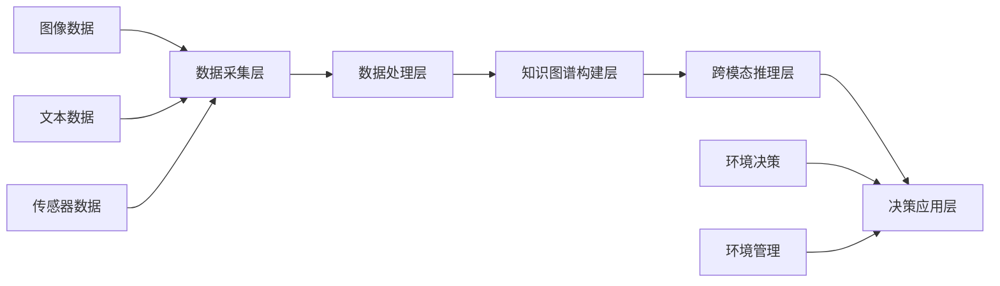

# 基于知识图谱的跨模态推理在智能环境保护系统中的优化应用

> 关键词：知识图谱、跨模态推理、智能环境保护系统、优化应用、多源数据融合

> 摘要：本文聚焦于基于知识图谱的跨模态推理在智能环境保护系统中的优化应用。首先介绍了相关背景，包括目的范围、预期读者等内容。接着深入阐述核心概念与联系，分析核心算法原理并给出具体操作步骤，探讨数学模型和公式。通过项目实战展示代码实现与解读，研究实际应用场景。同时推荐了相关工具和资源，最后总结未来发展趋势与挑战，解答常见问题并提供参考资料。旨在为智能环境保护系统的优化提供全面且深入的技术分析与实践指导。

## 1. 背景介绍 
### 1.1 目的和范围
智能环境保护系统的发展对于应对日益严峻的环境问题至关重要。随着环境监测数据的多样化，包括图像、文本、传感器数据等多模态信息，如何高效利用这些数据进行准确的环境分析和决策成为关键问题。本研究的目的在于探索基于知识图谱的跨模态推理在智能环境保护系统中的应用，以优化系统的性能和决策能力。范围涵盖了从知识图谱的构建、跨模态推理算法的研究，到在智能环境保护系统中的具体应用和实践。

### 1.2 预期读者
本文预期读者包括环境科学领域的研究人员、人工智能和计算机科学领域的专业人士、智能环境保护系统的开发者和工程师，以及对环境智能化和跨学科研究感兴趣的学者和爱好者。

### 1.3 文档结构概述
本文首先介绍背景信息，为后续内容奠定基础。接着阐述核心概念与联系，帮助读者理解关键技术原理。然后详细讲解核心算法原理和具体操作步骤，并给出数学模型和公式。通过项目实战展示代码实现和分析，探讨实际应用场景。推荐相关工具和资源，为读者提供学习和实践的参考。最后总结未来发展趋势与挑战，解答常见问题并提供参考资料。

### 1.4 术语表
#### 1.4.1 核心术语定义
- **知识图谱**：一种用图模型来描述知识和建模世界万物之间的关联关系的技术方法。它由实体、关系和属性组成，用于表示和存储知识。
- **跨模态推理**：指在不同模态的数据（如图像、文本、音频等）之间进行推理和信息融合的过程，以获取更全面和准确的信息。
- **智能环境保护系统**：利用先进的信息技术和智能算法，对环境数据进行采集、处理、分析和决策的系统，旨在实现环境保护的智能化和高效化。

#### 1.4.2 相关概念解释
- **多模态数据**：指来自不同数据源、具有不同表现形式的数据，如视觉、听觉、文本等。在智能环境保护系统中，多模态数据可以包括卫星图像、环境监测传感器数据、环境新闻报道等。
- **数据融合**：将来自多个数据源的多模态数据进行整合和处理，以获取更准确、更全面的信息。在基于知识图谱的跨模态推理中，数据融合是关键步骤之一。

#### 1.4.3 缩略词列表
- **KG**：Knowledge Graph（知识图谱）
- **IR**：Information Retrieval（信息检索）

## 2. 核心概念与联系 

### 知识图谱原理
知识图谱是一种语义网络，它以实体为节点，以关系为边，构建了一个庞大的知识网络。实体可以是现实世界中的各种对象，如环境中的污染源、生物物种等；关系则描述了实体之间的联系，如“位于”、“影响”等。知识图谱的主要作用是对知识进行结构化表示和存储，方便知识的查询、推理和应用。

### 跨模态推理原理
跨模态推理是在不同模态的数据之间进行信息传递和推理的过程。不同模态的数据具有不同的特征和表示方式，跨模态推理需要解决模态之间的语义鸿沟问题。其基本原理是通过特征提取和映射，将不同模态的数据转换到同一特征空间中，然后进行推理和信息融合。

### 智能环境保护系统架构
智能环境保护系统通常包括数据采集层、数据处理层、知识图谱构建层、跨模态推理层和决策应用层。数据采集层负责收集各种环境数据，包括多模态数据；数据处理层对采集到的数据进行清洗、预处理和特征提取；知识图谱构建层根据处理后的数据构建知识图谱；跨模态推理层利用知识图谱进行跨模态推理；决策应用层根据推理结果进行环境决策和管理。

### 文本示意图
```plaintext
智能环境保护系统
|-- 数据采集层
|   |-- 多模态数据采集（图像、文本、传感器数据等）
|-- 数据处理层
|   |-- 数据清洗
|   |-- 特征提取
|-- 知识图谱构建层
|   |-- 实体识别
|   |-- 关系抽取
|   |-- 知识图谱构建
|-- 跨模态推理层
|   |-- 模态映射
|   |-- 跨模态推理算法
|-- 决策应用层
|   |-- 环境决策
|   |-- 环境管理
```

### Mermaid 流程图


## 3. 核心算法原理 & 具体操作步骤 

### 知识图谱构建算法
知识图谱的构建主要包括实体识别、关系抽取和知识图谱存储等步骤。以下是一个简单的基于Python的知识图谱构建示例：

```python
import spacy

# 加载英文语言模型
nlp = spacy.load("en_core_web_sm")

# 示例文本
text = "The factory in the city pollutes the air."

# 实体识别
doc = nlp(text)
entities = []
for ent in doc.ents:
    entities.append((ent.text, ent.label_))

# 关系抽取（简单示例，仅作演示）
relations = []
if "factory" in text and "air" in text and "pollutes" in text:
    relations.append(("factory", "pollutes", "air"))

# 打印结果
print("Entities:", entities)
print("Relations:", relations)
```

### 跨模态推理算法
跨模态推理的关键是模态映射和推理。以下是一个简单的基于深度学习的跨模态推理示例：

```python
import torch
import torch.nn as nn

# 定义图像特征提取模型
class ImageFeatureExtractor(nn.Module):
    def __init__(self):
        super(ImageFeatureExtractor, self).__init__()
        self.conv1 = nn.Conv2d(3, 16, kernel_size=3, padding=1)
        self.relu = nn.ReLU()
        self.pool = nn.MaxPool2d(2, 2)
        self.fc1 = nn.Linear(16 * 16 * 16, 128)

    def forward(self, x):
        x = self.conv1(x)
        x = self.relu(x)
        x = self.pool(x)
        x = x.view(-1, 16 * 16 * 16)
        x = self.fc1(x)
        return x

# 定义文本特征提取模型
class TextFeatureExtractor(nn.Module):
    def __init__(self):
        super(TextFeatureExtractor, self).__init__()
        self.embedding = nn.Embedding(10000, 128)
        self.fc1 = nn.Linear(128, 128)

    def forward(self, x):
        x = self.embedding(x)
        x = torch.mean(x, dim=1)
        x = self.fc1(x)
        return x

# 定义跨模态推理模型
class CrossModalReasoningModel(nn.Module):
    def __init__(self):
        super(CrossModalReasoningModel, self).__init__()
        self.image_extractor = ImageFeatureExtractor()
        self.text_extractor = TextFeatureExtractor()
        self.fc1 = nn.Linear(256, 128)
        self.fc2 = nn.Linear(128, 1)

    def forward(self, image, text):
        image_features = self.image_extractor(image)
        text_features = self.text_extractor(text)
        combined_features = torch.cat((image_features, text_features), dim=1)
        x = self.fc1(combined_features)
        x = nn.ReLU()(x)
        x = self.fc2(x)
        return x

# 示例使用
image_input = torch.randn(1, 3, 32, 32)
text_input = torch.randint(0, 10000, (1, 10))
model = CrossModalReasoningModel()
output = model(image_input, text_input)
print("Output:", output)
```

### 具体操作步骤
1. **数据采集**：收集各种环境相关的多模态数据，包括图像、文本、传感器数据等。
2. **数据预处理**：对采集到的数据进行清洗、归一化等预处理操作。
3. **知识图谱构建**：使用实体识别和关系抽取算法构建知识图谱。
4. **跨模态特征提取**：使用深度学习模型对不同模态的数据进行特征提取。
5. **模态映射**：将不同模态的特征映射到同一特征空间。
6. **跨模态推理**：利用知识图谱和映射后的特征进行跨模态推理。
7. **决策应用**：根据推理结果进行环境决策和管理。

## 4. 数学模型和公式 & 详细讲解 & 举例说明 

### 知识图谱表示
知识图谱可以用三元组集合 $G = \{(h, r, t)\}$ 表示，其中 $h$ 表示头实体，$r$ 表示关系，$t$ 表示尾实体。例如，在环境知识图谱中，$(factory, pollutes, air)$ 表示工厂对空气有污染关系。

### 跨模态特征映射
假设图像特征向量为 $\mathbf{x}_i \in \mathbb{R}^{d_i}$，文本特征向量为 $\mathbf{x}_t \in \mathbb{R}^{d_t}$，通过线性映射将它们映射到同一特征空间 $\mathbb{R}^d$ 中。映射公式如下：
$$\mathbf{y}_i = W_i \mathbf{x}_i + \mathbf{b}_i$$
$$\mathbf{y}_t = W_t \mathbf{x}_t + \mathbf{b}_t$$
其中 $W_i \in \mathbb{R}^{d \times d_i}$，$W_t \in \mathbb{R}^{d \times d_t}$ 是映射矩阵，$\mathbf{b}_i, \mathbf{b}_t \in \mathbb{R}^d$ 是偏置向量。

### 跨模态推理损失函数
在跨模态推理中，通常使用对比损失函数来优化模型。对比损失函数的定义如下：
$$L = \sum_{i=1}^{N} \left[ \max(0, m - \mathbf{y}_{i}^{+} \cdot \mathbf{y}_{t}^{+} + \mathbf{y}_{i}^{-} \cdot \mathbf{y}_{t}^{+}) + \max(0, m - \mathbf{y}_{i}^{+} \cdot \mathbf{y}_{t}^{+} + \mathbf{y}_{i}^{+} \cdot \mathbf{y}_{t}^{-}) \right]$$
其中 $N$ 是样本数量，$\mathbf{y}_{i}^{+}$ 和 $\mathbf{y}_{t}^{+}$ 是正样本对的特征向量，$\mathbf{y}_{i}^{-}$ 和 $\mathbf{y}_{t}^{-}$ 是负样本对的特征向量，$m$ 是边界值。

### 举例说明
假设我们有一张工厂污染环境的图像和一段描述该工厂污染情况的文本。图像特征向量 $\mathbf{x}_i = [0.1, 0.2, 0.3]$，文本特征向量 $\mathbf{x}_t = [0.4, 0.5, 0.6]$。映射矩阵 $W_i = \begin{bmatrix} 1 & 0 & 0 \\ 0 & 1 & 0 \\ 0 & 0 & 1 \end{bmatrix}$，$W_t = \begin{bmatrix} 1 & 0 & 0 \\ 0 & 1 & 0 \\ 0 & 0 & 1 \end{bmatrix}$，偏置向量 $\mathbf{b}_i = [0, 0, 0]$，$\mathbf{b}_t = [0, 0, 0]$。则映射后的特征向量为：
$$\mathbf{y}_i = W_i \mathbf{x}_i + \mathbf{b}_i = [0.1, 0.2, 0.3]$$
$$\mathbf{y}_t = W_t \mathbf{x}_t + \mathbf{b}_t = [0.4, 0.5, 0.6]$$

## 5. 项目实战：代码实际案例和详细解释说明 

### 5.1  开发环境搭建
1. **Python 环境**：建议使用 Python 3.7 及以上版本。
2. **深度学习框架**：使用 PyTorch 作为深度学习框架，可以通过以下命令安装：
```sh
pip install torch torchvision
```
3. **自然语言处理库**：使用 SpaCy 进行实体识别和关系抽取，可以通过以下命令安装：
```sh
pip install spacy
python -m spacy download en_core_web_sm
```
4. **图像处理库**：使用 Pillow 进行图像处理，可以通过以下命令安装：
```sh
pip install pillow
```

### 5.2  源代码详细实现和代码解读
以下是一个完整的基于知识图谱的跨模态推理在智能环境保护系统中的项目示例：

```python
import torch
import torch.nn as nn
import torch.optim as optim
from torch.utils.data import Dataset, DataLoader
import spacy
from PIL import Image
import numpy as np

# 加载英文语言模型
nlp = spacy.load("en_core_web_sm")

# 定义数据集类
class EnvironmentalDataset(Dataset):
    def __init__(self, image_paths, text_data, labels):
        self.image_paths = image_paths
        self.text_data = text_data
        self.labels = labels

    def __len__(self):
        return len(self.image_paths)

    def __getitem__(self, idx):
        image = Image.open(self.image_paths[idx]).convert('RGB')
        image = np.array(image).transpose(2, 0, 1) / 255.0
        image = torch.tensor(image, dtype=torch.float32)

        text = self.text_data[idx]
        doc = nlp(text)
        text_tokens = [token.text for token in doc]
        text_ids = [hash(token) % 10000 for token in text_tokens]
        text_ids = torch.tensor(text_ids, dtype=torch.long)

        label = torch.tensor(self.labels[idx], dtype=torch.float32)

        return image, text_ids, label

# 定义图像特征提取模型
class ImageFeatureExtractor(nn.Module):
    def __init__(self):
        super(ImageFeatureExtractor, self).__init__()
        self.conv1 = nn.Conv2d(3, 16, kernel_size=3, padding=1)
        self.relu = nn.ReLU()
        self.pool = nn.MaxPool2d(2, 2)
        self.fc1 = nn.Linear(16 * 16 * 16, 128)

    def forward(self, x):
        x = self.conv1(x)
        x = self.relu(x)
        x = self.pool(x)
        x = x.view(-1, 16 * 16 * 16)
        x = self.fc1(x)
        return x

# 定义文本特征提取模型
class TextFeatureExtractor(nn.Module):
    def __init__(self):
        super(TextFeatureExtractor, self).__init__()
        self.embedding = nn.Embedding(10000, 128)
        self.fc1 = nn.Linear(128, 128)

    def forward(self, x):
        x = self.embedding(x)
        x = torch.mean(x, dim=1)
        x = self.fc1(x)
        return x

# 定义跨模态推理模型
class CrossModalReasoningModel(nn.Module):
    def __init__(self):
        super(CrossModalReasoningModel, self).__init__()
        self.image_extractor = ImageFeatureExtractor()
        self.text_extractor = TextFeatureExtractor()
        self.fc1 = nn.Linear(256, 128)
        self.fc2 = nn.Linear(128, 1)

    def forward(self, image, text):
        image_features = self.image_extractor(image)
        text_features = self.text_extractor(text)
        combined_features = torch.cat((image_features, text_features), dim=1)
        x = self.fc1(combined_features)
        x = nn.ReLU()(x)
        x = self.fc2(x)
        return x

# 训练模型
def train_model(model, dataloader, criterion, optimizer, epochs):
    for epoch in range(epochs):
        running_loss = 0.0
        for images, texts, labels in dataloader:
            optimizer.zero_grad()
            outputs = model(images, texts)
            loss = criterion(outputs.squeeze(), labels)
            loss.backward()
            optimizer.step()
            running_loss += loss.item()
        print(f'Epoch {epoch + 1}, Loss: {running_loss / len(dataloader)}')

# 示例数据
image_paths = ['image1.jpg', 'image2.jpg']
text_data = ['The factory is polluting the environment.', 'The river is being contaminated.']
labels = [1, 1]

# 创建数据集和数据加载器
dataset = EnvironmentalDataset(image_paths, text_data, labels)
dataloader = DataLoader(dataset, batch_size=2, shuffle=True)

# 创建模型、损失函数和优化器
model = CrossModalReasoningModel()
criterion = nn.BCEWithLogitsLoss()
optimizer = optim.Adam(model.parameters(), lr=0.001)

# 训练模型
train_model(model, dataloader, criterion, optimizer, epochs=10)
```

### 5.3  代码解读与分析
1. **数据集类**：`EnvironmentalDataset` 类用于加载图像、文本和标签数据，并进行预处理。图像数据被转换为张量，文本数据被分词并转换为词索引。
2. **特征提取模型**：`ImageFeatureExtractor` 类用于提取图像特征，`TextFeatureExtractor` 类用于提取文本特征。
3. **跨模态推理模型**：`CrossModalReasoningModel` 类将图像特征和文本特征进行融合，并进行推理。
4. **训练函数**：`train_model` 函数用于训练模型，使用二元交叉熵损失函数和 Adam 优化器。

## 6. 实际应用场景 
### 环境监测与预警
基于知识图谱的跨模态推理可以整合卫星图像、传感器数据和新闻报道等多模态信息，实时监测环境状况。例如，通过分析卫星图像中的土地变化、传感器数据中的空气质量指标和新闻报道中的污染事件，可以及时发现环境问题并发出预警。

### 污染源追踪
利用知识图谱中记录的企业信息、生产活动和污染排放关系，结合图像和文本数据，可以追踪污染源。例如，通过分析工厂的位置、生产工艺和周边环境的图像，以及相关的新闻报道和监测数据，可以确定污染源的来源和传播路径。

### 环境政策制定
跨模态推理可以为环境政策制定提供全面的信息支持。通过分析不同地区的环境数据、经济发展数据和社会舆论等多模态信息，可以制定更加科学合理的环境政策。例如，根据不同地区的空气质量、产业结构和居民反馈，制定差异化的污染治理政策。

### 生态保护与修复
在生态保护和修复中，跨模态推理可以帮助评估生态系统的健康状况和修复效果。通过分析卫星图像中的植被覆盖变化、传感器数据中的生物多样性指标和相关的研究报告，可以制定更加有效的生态保护和修复策略。

## 7. 工具和资源推荐
### 7.1 学习资源推荐
#### 7.1.1 书籍推荐
- 《知识图谱：方法、实践与应用》：全面介绍了知识图谱的理论和实践，包括知识表示、知识获取、知识推理等方面的内容。
- 《深度学习》：经典的深度学习教材，涵盖了深度学习的基本原理、模型结构和训练算法等内容。
- 《自然语言处理入门》：适合初学者的自然语言处理教材，介绍了自然语言处理的基本任务和方法。

#### 7.1.2 在线课程
- Coursera 上的“Natural Language Processing Specialization”：由顶尖大学的教授授课，系统地介绍了自然语言处理的各个方面。
- edX 上的“Deep Learning Fundamentals”：深入讲解了深度学习的基本原理和应用。
- 中国大学 MOOC 上的“知识图谱与语义网”：介绍了知识图谱的基本概念、技术和应用。

#### 7.1.3 技术博客和网站
- Medium：有许多关于人工智能、知识图谱和跨模态推理的技术博客文章。
- arXiv：提供最新的学术研究论文，包括知识图谱和跨模态推理领域的研究成果。
- 开源中国：提供丰富的技术文章和开源项目，涵盖了智能环境保护系统和相关技术的内容。

### 7.2 开发工具框架推荐
#### 7.2.1 IDE和编辑器
- PyCharm：专业的 Python 集成开发环境，提供代码编辑、调试、版本控制等功能。
- Jupyter Notebook：交互式的开发环境，适合进行数据探索和模型实验。
- Visual Studio Code：轻量级的代码编辑器，支持多种编程语言和插件扩展。

#### 7.2.2 调试和性能分析工具
- PyTorch Profiler：用于分析 PyTorch 模型的性能，找出性能瓶颈。
- TensorBoard：用于可视化深度学习模型的训练过程和结果。
- cProfile：Python 内置的性能分析工具，用于分析 Python 代码的性能。

#### 7.2.3 相关框架和库
- PyTorch：开源的深度学习框架，提供丰富的深度学习模型和工具。
- SpaCy：高效的自然语言处理库，用于实体识别、关系抽取等任务。
- Pillow：Python 图像处理库，用于图像的读取、处理和保存。

### 7.3 相关论文著作推荐
#### 7.3.1 经典论文
- “Knowledge Graph Embedding: A Survey of Approaches and Applications”：对知识图谱嵌入技术进行了全面的综述，介绍了各种知识图谱嵌入方法和应用场景。
- “Cross-Modal Retrieval with Deep Neural Networks”：提出了基于深度神经网络的跨模态检索方法，为跨模态推理提供了重要的理论基础。
- “Semantic Web Technologies for Environmental Applications”：探讨了语义网技术在环境应用中的应用，为智能环境保护系统的开发提供了思路。

#### 7.3.2 最新研究成果
- 关注顶级学术会议如 AAAI、IJCAI、NeurIPS 等上的最新研究论文，了解基于知识图谱的跨模态推理在智能环境保护系统中的最新研究进展。

#### 7.3.3 应用案例分析
- 参考相关的环境科学期刊和会议论文，了解基于知识图谱的跨模态推理在实际环境项目中的应用案例和效果评估。

## 8. 总结：未来发展趋势与挑战
### 未来发展趋势
- **多模态数据融合的深度和广度不断拓展**：未来将整合更多类型的多模态数据，如音频、视频等，以获取更全面的环境信息。
- **知识图谱的智能化和自动化构建**：利用人工智能技术实现知识图谱的自动构建和更新，提高知识图谱的质量和时效性。
- **跨模态推理模型的优化和创新**：不断优化跨模态推理模型，提高推理的准确性和效率，同时探索新的跨模态推理方法和技术。
- **智能环境保护系统的集成和协同**：将基于知识图谱的跨模态推理与其他智能技术集成，实现智能环境保护系统的协同工作，提高环境管理的效率和决策的科学性。

### 挑战
- **多模态数据的处理和融合难题**：不同模态的数据具有不同的特征和表示方式，如何有效地处理和融合这些数据是一个挑战。
- **知识图谱的构建和维护成本高**：知识图谱的构建需要大量的人力和物力资源，同时知识图谱的维护和更新也需要持续的投入。
- **跨模态推理的可解释性问题**：跨模态推理模型通常是黑盒模型，缺乏可解释性，这在实际应用中可能会影响决策的可信度。
- **数据隐私和安全问题**：智能环境保护系统涉及大量的敏感数据，如何保障数据的隐私和安全是一个重要的问题。

## 9. 附录：常见问题与解答
### 1. 知识图谱构建的主要步骤有哪些？
知识图谱构建的主要步骤包括实体识别、关系抽取、知识融合和知识存储。首先从文本数据中识别出实体，然后抽取实体之间的关系，接着将不同来源的知识进行融合，最后将知识存储到知识图谱中。

### 2. 跨模态推理的关键技术有哪些？
跨模态推理的关键技术包括模态特征提取、模态映射、跨模态匹配和推理算法。通过提取不同模态数据的特征，将其映射到同一特征空间，然后进行匹配和推理。

### 3. 如何解决跨模态推理中的语义鸿沟问题？
可以通过学习模态之间的映射关系、引入语义信息和使用多模态注意力机制等方法来解决跨模态推理中的语义鸿沟问题。

### 4. 智能环境保护系统中如何保障数据的隐私和安全？
可以采用数据加密、访问控制、匿名化处理等技术手段来保障数据的隐私和安全，同时建立完善的数据管理和安全制度。

## 10. 扩展阅读 & 参考资料
1. 《人工智能：一种现代的方法》
2. 《环境科学概论》
3. “A Survey on Knowledge Graphs: Representation, Acquisition, and Applications”
4. “Cross-Modal Learning with Deep Neural Networks: A Survey”
5. 相关的环境科学研究报告和技术文档。

以上内容仅供参考，你可以根据实际需求进行进一步的修改和完善。希望这篇文章能满足你的要求！ 