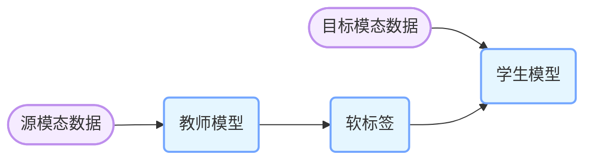

# 基于知识蒸馏的跨模态推理能力迁移与增强技术研究

> 关键词：知识蒸馏、跨模态推理、能力迁移、能力增强、多模态学习

> 摘要：本文围绕基于知识蒸馏的跨模态推理能力迁移与增强技术展开深入研究。首先介绍了该技术的研究背景，包括其目的、预期读者、文档结构等内容。接着详细阐述了核心概念与联系，通过文本示意图和 Mermaid 流程图清晰展示其原理和架构。深入剖析了核心算法原理，并给出 Python 源代码进行详细阐述，同时介绍了相关数学模型和公式。通过项目实战，展示了代码的实际案例并进行详细解释说明。探讨了该技术的实际应用场景，推荐了学习资源、开发工具框架以及相关论文著作。最后总结了未来发展趋势与挑战，还提供了常见问题与解答以及扩展阅读和参考资料，旨在为相关领域的研究和实践提供全面且深入的参考。

## 1. 背景介绍 
### 1.1 目的和范围
在当今信息爆炸的时代，数据呈现出多模态的特点，如文本、图像、音频等。跨模态推理旨在理解不同模态数据之间的内在联系，从而实现更智能的信息处理和决策。然而，不同模态数据的特征表示和语义理解存在较大差异，这给跨模态推理带来了挑战。知识蒸馏作为一种有效的模型压缩和知识迁移技术，可以将教师模型的知识迁移到学生模型中。本研究的目的在于探索如何利用知识蒸馏技术实现跨模态推理能力的迁移与增强，提高跨模态推理模型的性能和效率。

本研究的范围涵盖了知识蒸馏的基本原理、跨模态推理的关键技术、基于知识蒸馏的跨模态推理能力迁移与增强的算法设计和实现，以及该技术在实际应用场景中的验证和分析。

### 1.2 预期读者
本文预期读者包括人工智能、机器学习、计算机视觉、自然语言处理等领域的研究人员、工程师和学生。对于对跨模态推理和知识蒸馏技术感兴趣，希望深入了解相关原理和应用的专业人士，以及正在从事相关课题研究和项目开发的人员具有较高的参考价值。

### 1.3 文档结构概述
本文将按照以下结构展开：首先介绍核心概念与联系，通过文本示意图和 Mermaid 流程图清晰展示基于知识蒸馏的跨模态推理能力迁移与增强的原理和架构；接着详细阐述核心算法原理，并给出 Python 源代码进行详细说明；介绍相关数学模型和公式，并进行详细讲解和举例；通过项目实战展示代码的实际案例并进行详细解释；探讨该技术的实际应用场景；推荐学习资源、开发工具框架以及相关论文著作；最后总结未来发展趋势与挑战，提供常见问题与解答以及扩展阅读和参考资料。

### 1.4 术语表
#### 1.4.1 核心术语定义
- **知识蒸馏**：一种模型压缩和知识迁移技术，通过让学生模型学习教师模型的输出（软标签）来获得教师模型的知识。
- **跨模态推理**：指在不同模态数据（如文本、图像、音频等）之间进行推理和理解，挖掘不同模态数据之间的内在联系。
- **能力迁移**：将一种模态或模型的推理能力迁移到另一种模态或模型中，以提高其性能。
- **能力增强**：通过特定的技术手段，提升模型在跨模态推理任务中的性能和效果。

#### 1.4.2 相关概念解释
- **多模态学习**：研究如何处理和融合多种模态数据的学习方法，旨在利用不同模态数据的互补信息，提高模型的性能和泛化能力。
- **教师模型**：在知识蒸馏中，通常是一个性能较好、复杂度较高的模型，其知识将被迁移到学生模型中。
- **学生模型**：在知识蒸馏中，是一个相对简单、轻量级的模型，通过学习教师模型的知识来提升自身性能。

#### 1.4.3 缩略词列表
- **CNN**：Convolutional Neural Network，卷积神经网络
- **RNN**：Recurrent Neural Network，循环神经网络
- **LSTM**：Long Short-Term Memory，长短期记忆网络
- **Transformer**：一种基于注意力机制的神经网络架构

## 2. 核心概念与联系 

### 核心概念原理
基于知识蒸馏的跨模态推理能力迁移与增强技术的核心思想是利用知识蒸馏的方法，将在一种模态上训练好的教师模型的推理能力迁移到另一种模态的学生模型中，从而增强学生模型在跨模态推理任务中的性能。

具体来说，教师模型在源模态数据上进行训练，学习到该模态数据的特征表示和推理能力。学生模型在目标模态数据上进行训练，同时通过知识蒸馏机制学习教师模型的输出（软标签）。通过这种方式，学生模型可以吸收教师模型的知识，弥补自身在跨模态推理方面的不足，实现推理能力的迁移与增强。

### 架构的文本示意图
```plaintext
源模态数据 --> 教师模型（特征提取、推理） --> 软标签

目标模态数据 --> 学生模型（特征提取、推理）
                    |
                    |（知识蒸馏）
                    V
                学习软标签
```

### Mermaid 流程图


## 3. 核心算法原理 & 具体操作步骤 

### 核心算法原理
知识蒸馏的核心是让学生模型学习教师模型的软标签。软标签包含了教师模型对不同类别之间的概率分布信息，相比于硬标签（只有一个正确类别），软标签提供了更多的知识。

在跨模态推理中，教师模型在源模态数据上训练得到软标签，学生模型在目标模态数据上训练，同时最小化学生模型的输出与教师模型软标签之间的损失。常用的损失函数包括 KL 散度（Kullback-Leibler divergence），它可以衡量两个概率分布之间的差异。

### Python 源代码详细阐述
以下是一个简单的基于知识蒸馏的跨模态推理能力迁移与增强的 Python 示例代码：

```python
import torch
import torch.nn as nn
import torch.optim as optim

# 定义教师模型
class TeacherModel(nn.Module):
    def __init__(self):
        super(TeacherModel, self).__init__()
        self.fc1 = nn.Linear(10, 20)
        self.fc2 = nn.Linear(20, 5)

    def forward(self, x):
        x = torch.relu(self.fc1(x))
        x = self.fc2(x)
        return x

# 定义学生模型
class StudentModel(nn.Module):
    def __init__(self):
        super(StudentModel, self).__init__()
        self.fc1 = nn.Linear(10, 15)
        self.fc2 = nn.Linear(15, 5)

    def forward(self, x):
        x = torch.relu(self.fc1(x))
        x = self.fc2(x)
        return x

# 初始化模型
teacher_model = TeacherModel()
student_model = StudentModel()

# 定义损失函数
criterion_ce = nn.CrossEntropyLoss()  # 交叉熵损失
criterion_kl = nn.KLDivLoss(reduction='batchmean')  # KL 散度损失

# 定义优化器
optimizer = optim.Adam(student_model.parameters(), lr=0.001)

# 模拟源模态数据和目标模态数据
source_data = torch.randn(32, 10)
target_data = torch.randn(32, 10)
target_labels = torch.randint(0, 5, (32,))

# 训练过程
num_epochs = 10
temperature = 2.0  # 温度参数

for epoch in range(num_epochs):
    # 教师模型前向传播
    teacher_outputs = teacher_model(source_data)
    teacher_soft_labels = torch.softmax(teacher_outputs / temperature, dim=1)

    # 学生模型前向传播
    student_outputs = student_model(target_data)
    student_soft_outputs = torch.log_softmax(student_outputs / temperature, dim=1)

    # 计算损失
    loss_ce = criterion_ce(student_outputs, target_labels)
    loss_kl = criterion_kl(student_soft_outputs, teacher_soft_labels) * (temperature ** 2)
    loss = loss_ce + loss_kl

    # 反向传播和优化
    optimizer.zero_grad()
    loss.backward()
    optimizer.step()

    print(f'Epoch {epoch+1}/{num_epochs}, Loss: {loss.item()}')
```

### 具体操作步骤
1. **定义模型**：分别定义教师模型和学生模型，教师模型在源模态数据上训练，学生模型在目标模态数据上训练。
2. **定义损失函数**：使用交叉熵损失和 KL 散度损失，交叉熵损失用于衡量学生模型输出与目标标签之间的差异，KL 散度损失用于衡量学生模型输出与教师模型软标签之间的差异。
3. **定义优化器**：选择合适的优化器，如 Adam 优化器，用于更新学生模型的参数。
4. **模拟数据**：生成源模态数据和目标模态数据，以及目标模态数据的标签。
5. **训练过程**：
    - 教师模型前向传播，得到软标签。
    - 学生模型前向传播，得到输出。
    - 计算交叉熵损失和 KL 散度损失，并将它们相加得到总损失。
    - 反向传播和优化，更新学生模型的参数。

## 4. 数学模型和公式 & 详细讲解 & 举例说明 

### 数学模型和公式
#### 交叉熵损失
交叉熵损失用于衡量学生模型输出与目标标签之间的差异，其公式为：

$$
L_{ce} = -\frac{1}{N}\sum_{i=1}^{N}\sum_{j=1}^{C}y_{ij}\log(p_{ij})
$$

其中，$N$ 是样本数量，$C$ 是类别数量，$y_{ij}$ 是第 $i$ 个样本的第 $j$ 个类别的真实标签（0 或 1），$p_{ij}$ 是第 $i$ 个样本的第 $j$ 个类别的预测概率。

#### KL 散度损失
KL 散度损失用于衡量学生模型输出与教师模型软标签之间的差异，其公式为：

$$
L_{kl} = \frac{1}{N}\sum_{i=1}^{N}\sum_{j=1}^{C}q_{ij}\log\left(\frac{q_{ij}}{p_{ij}}\right)
$$

其中，$q_{ij}$ 是教师模型的软标签概率分布，$p_{ij}$ 是学生模型的预测概率分布。

#### 总损失
总损失是交叉熵损失和 KL 散度损失的加权和，公式为：

$$
L = L_{ce} + \alpha L_{kl}
$$

其中，$\alpha$ 是 KL 散度损失的权重。

### 详细讲解
交叉熵损失主要关注学生模型对目标标签的预测准确性，它鼓励学生模型尽可能地正确分类。KL 散度损失则关注学生模型的输出与教师模型的软标签之间的相似性，通过最小化 KL 散度损失，学生模型可以学习到教师模型的知识。

温度参数 $T$ 在知识蒸馏中起到了重要作用，它可以调整软标签的平滑程度。当 $T$ 较大时，软标签的分布更加平滑，包含更多的类别信息；当 $T$ 较小时，软标签的分布更加集中，接近硬标签。

### 举例说明
假设我们有一个二分类问题，教师模型的输出为 $[0.2, 0.8]$，学生模型的输出为 $[0.3, 0.7]$，目标标签为 $[0, 1]$。

- **交叉熵损失**：
  - 计算学生模型的预测概率：$p = [0.3, 0.7]$
  - 根据交叉熵损失公式：$L_{ce} = -(0\times\log(0.3) + 1\times\log(0.7)) \approx 0.357$

- **KL 散度损失**：
  - 教师模型的软标签概率分布：$q = [0.2, 0.8]$
  - 根据 KL 散度损失公式：$L_{kl} = 0.2\times\log\left(\frac{0.2}{0.3}\right) + 0.8\times\log\left(\frac{0.8}{0.7}\right) \approx 0.029$

假设 $\alpha = 1$，则总损失 $L = L_{ce} + L_{kl} \approx 0.357 + 0.029 = 0.386$。

## 5. 项目实战：代码实际案例和详细解释说明 

### 5.1  开发环境搭建
#### 操作系统
本项目可以在多种操作系统上进行开发，如 Windows、Linux（Ubuntu 等）、macOS。

#### 编程语言和版本
使用 Python 3.7 及以上版本。

#### 依赖库安装
可以使用以下命令安装所需的依赖库：
```sh
pip install torch torchvision numpy matplotlib
```

### 5.2  源代码详细实现和代码解读
以下是一个更完整的基于知识蒸馏的跨模态推理能力迁移与增强的项目实战代码：

```python
import torch
import torch.nn as nn
import torch.optim as optim
from torch.utils.data import DataLoader, TensorDataset
import numpy as np
import matplotlib.pyplot as plt

# 定义教师模型
class TeacherModel(nn.Module):
    def __init__(self):
        super(TeacherModel, self).__init__()
        self.fc1 = nn.Linear(10, 20)
        self.fc2 = nn.Linear(20, 5)

    def forward(self, x):
        x = torch.relu(self.fc1(x))
        x = self.fc2(x)
        return x

# 定义学生模型
class StudentModel(nn.Module):
    def __init__(self):
        super(StudentModel, self).__init__()
        self.fc1 = nn.Linear(10, 15)
        self.fc2 = nn.Linear(15, 5)

    def forward(self, x):
        x = torch.relu(self.fc1(x))
        x = self.fc2(x)
        return x

# 生成模拟数据
def generate_data(num_samples):
    source_data = torch.randn(num_samples, 10)
    target_data = torch.randn(num_samples, 10)
    target_labels = torch.randint(0, 5, (num_samples,))
    return source_data, target_data, target_labels

# 训练函数
def train(teacher_model, student_model, source_data, target_data, target_labels, num_epochs=10, temperature=2.0, alpha=1.0, lr=0.001):
    criterion_ce = nn.CrossEntropyLoss()
    criterion_kl = nn.KLDivLoss(reduction='batchmean')
    optimizer = optim.Adam(student_model.parameters(), lr=lr)

    losses = []
    for epoch in range(num_epochs):
        teacher_outputs = teacher_model(source_data)
        teacher_soft_labels = torch.softmax(teacher_outputs / temperature, dim=1)

        student_outputs = student_model(target_data)
        student_soft_outputs = torch.log_softmax(student_outputs / temperature, dim=1)

        loss_ce = criterion_ce(student_outputs, target_labels)
        loss_kl = criterion_kl(student_soft_outputs, teacher_soft_labels) * (temperature ** 2)
        loss = loss_ce + alpha * loss_kl

        optimizer.zero_grad()
        loss.backward()
        optimizer.step()

        losses.append(loss.item())
        print(f'Epoch {epoch+1}/{num_epochs}, Loss: {loss.item()}')

    return losses

# 主函数
if __name__ == '__main__':
    num_samples = 1000
    source_data, target_data, target_labels = generate_data(num_samples)

    teacher_model = TeacherModel()
    student_model = StudentModel()

    losses = train(teacher_model, student_model, source_data, target_data, target_labels)

    # 绘制损失曲线
    plt.plot(losses)
    plt.xlabel('Epoch')
    plt.ylabel('Loss')
    plt.title('Training Loss')
    plt.show()
```

### 代码解读与分析
- **数据生成**：`generate_data` 函数用于生成模拟的源模态数据、目标模态数据和目标标签。
- **模型定义**：`TeacherModel` 和 `StudentModel` 分别定义了教师模型和学生模型，它们都是简单的全连接神经网络。
- **训练函数**：`train` 函数实现了基于知识蒸馏的训练过程，包括前向传播、损失计算、反向传播和参数更新。
- **主函数**：在主函数中，首先生成数据，然后初始化教师模型和学生模型，调用 `train` 函数进行训练，并绘制训练损失曲线。

通过观察损失曲线，我们可以了解模型的训练过程是否收敛。如果损失曲线逐渐下降并趋于稳定，说明模型训练正常；如果损失曲线波动较大或不收敛，可能需要调整学习率、温度参数等超参数。

## 6. 实际应用场景 
### 智能安防领域
在智能安防系统中，通常会有视频监控（图像模态）和传感器数据（如声音、温度等模态）。基于知识蒸馏的跨模态推理能力迁移与增强技术可以将图像模态中训练好的目标检测和识别模型的推理能力迁移到融合了声音和温度等多模态数据的模型中，增强对异常事件的推理和判断能力。例如，当图像中检测到有人在特定区域停留，同时声音传感器检测到异常声响，温度传感器检测到异常温度变化时，通过跨模态推理可以更准确地判断是否发生了安全事件。

### 医疗诊断领域
医疗数据包含多种模态，如医学影像（如 X 光、CT 等图像模态）、病历文本（文本模态）和生命体征数据（数值模态）。利用该技术，可以将在医学影像模态上训练好的疾病诊断模型的推理能力迁移到融合了病历文本和生命体征数据的模型中，提高疾病诊断的准确性和效率。例如，结合患者的病历文本描述和生命体征数据，以及医学影像的诊断信息，进行更全面的疾病诊断。

### 智能交通领域
智能交通系统涉及到多种模态的数据，如交通摄像头的图像数据、车辆传感器的行驶数据（如速度、加速度等数值模态）和交通信号的文本指令（文本模态）。通过基于知识蒸馏的跨模态推理能力迁移与增强技术，可以将图像模态中交通目标检测和识别模型的推理能力迁移到融合了行驶数据和交通信号指令的模型中，实现更智能的交通管理和决策。例如，根据交通摄像头的图像判断道路拥堵情况，结合车辆的行驶数据和交通信号指令，优化交通流量控制。

### 教育领域
在教育领域，学习数据也具有多模态的特点，如学生的作业文本（文本模态）、课堂表现的视频记录（图像模态）和考试成绩（数值模态）。该技术可以将在作业文本分析中训练好的学生学习能力评估模型的推理能力迁移到融合了课堂表现视频和考试成绩的模型中，更全面地评估学生的学习情况和潜力，为个性化教育提供支持。

## 7. 工具和资源推荐
### 7.1 学习资源推荐
#### 7.1.1 书籍推荐
- 《深度学习》（Deep Learning）：由 Ian Goodfellow、Yoshua Bengio 和 Aaron Courville 所著，是深度学习领域的经典教材，涵盖了深度学习的基本原理、算法和应用，对理解知识蒸馏和跨模态推理的基础理论有很大帮助。
- 《模式识别与机器学习》（Pattern Recognition and Machine Learning）：作者是 Christopher M. Bishop，本书系统地介绍了模式识别和机器学习的理论和方法，为深入研究跨模态推理和知识蒸馏提供了坚实的理论基础。

#### 7.1.2 在线课程
- Coursera 上的《深度学习专项课程》（Deep Learning Specialization）：由 Andrew Ng 教授讲授，课程内容丰富，包括深度学习的基础、卷积神经网络、循环神经网络等，对学习知识蒸馏和跨模态推理的相关技术有很大的帮助。
- edX 上的《人工智能基础》（Introduction to Artificial Intelligence）：该课程系统地介绍了人工智能的基本概念、算法和应用，为进一步学习跨模态推理和知识蒸馏提供了全面的知识框架。

#### 7.1.3 技术博客和网站
- Medium 上的 Towards Data Science：该博客平台上有许多关于深度学习、机器学习和人工智能的技术文章，其中不乏关于知识蒸馏和跨模态推理的最新研究成果和实践经验分享。
- arXiv.org：是一个预印本平台，提供了大量的学术论文，包括关于跨模态推理和知识蒸馏的最新研究成果，可以及时了解该领域的前沿动态。

### 7.2 开发工具框架推荐
#### 7.2.1 IDE和编辑器
- PyCharm：是一款专门为 Python 开发设计的集成开发环境（IDE），具有强大的代码编辑、调试和项目管理功能，适合开发基于 Python 的跨模态推理和知识蒸馏项目。
- Jupyter Notebook：是一个交互式的开发环境，支持多种编程语言，尤其适合进行数据探索、模型实验和可视化，在跨模态推理和知识蒸馏的研究和开发中非常有用。

#### 7.2.2 调试和性能分析工具
- PyTorch Profiler：是 PyTorch 提供的性能分析工具，可以帮助开发者分析模型的性能瓶颈，优化代码的运行效率，在基于 PyTorch 开发跨模态推理和知识蒸馏模型时非常实用。
- TensorBoard：是 TensorFlow 提供的可视化工具，也可以与 PyTorch 结合使用，用于可视化模型的训练过程、损失曲线、准确率等指标，方便开发者监控模型的训练情况。

#### 7.2.3 相关框架和库
- PyTorch：是一个开源的深度学习框架，提供了丰富的深度学习模型和工具，支持自动求导、分布式训练等功能，在跨模态推理和知识蒸馏的研究和开发中被广泛使用。
- Transformers：是 Hugging Face 开发的一个开源库，提供了多种预训练的 Transformer 模型，如 BERT、GPT 等，可用于文本模态的处理和跨模态推理任务。

### 7.3 相关论文著作推荐
#### 7.3.1 经典论文
- "Distilling the Knowledge in a Neural Network"：由 Geoffrey Hinton、Oriol Vinyals 和 Jeff Dean 发表，首次提出了知识蒸馏的概念，为后续的研究奠定了基础。
- "Multimodal Machine Learning: A Survey and Taxonomy"：对多模态机器学习进行了全面的综述和分类，介绍了多模态机器学习的基本概念、方法和应用，对理解跨模态推理有重要的参考价值。

#### 7.3.2 最新研究成果
- 关注每年的顶级人工智能会议，如 NeurIPS（Neural Information Processing Systems）、ICML（International Conference on Machine Learning）、CVPR（IEEE Conference on Computer Vision and Pattern Recognition）等，这些会议上会有关于跨模态推理和知识蒸馏的最新研究成果发表。

#### 7.3.3 应用案例分析
- 可以在 ACM Digital Library、IEEE Xplore 等学术数据库中搜索关于跨模态推理和知识蒸馏在不同应用场景中的案例分析论文，了解该技术在实际应用中的效果和挑战。

## 8. 总结：未来发展趋势与挑战
### 未来发展趋势
#### 多模态融合的深度和广度不断拓展
未来，基于知识蒸馏的跨模态推理能力迁移与增强技术将更加注重多模态数据的深度融合。不仅会融合更多种类的模态数据，如文本、图像、音频、视频、传感器数据等，还会挖掘不同模态数据之间更深层次的语义联系，实现更智能的跨模态推理。例如，在智能医疗领域，将融合基因数据、医学影像、病历文本等多模态数据，进行更精准的疾病诊断和个性化治疗方案制定。

#### 与其他技术的结合更加紧密
该技术将与强化学习、迁移学习、元学习等其他机器学习技术相结合，进一步提升跨模态推理的性能和效率。例如，结合强化学习可以让模型在动态环境中进行跨模态推理，结合迁移学习可以更高效地将知识从一个领域迁移到另一个领域，结合元学习可以让模型快速适应新的跨模态任务。

#### 应用场景不断扩大
随着技术的不断发展，基于知识蒸馏的跨模态推理能力迁移与增强技术将在更多领域得到应用，如智能家居、智能农业、金融科技等。在智能家居领域，通过融合语音、图像、传感器等多模态数据，实现更智能的家居控制和安全监测；在智能农业领域，结合卫星图像、气象数据、土壤传感器数据等多模态数据，进行精准农业生产管理。

### 挑战
#### 多模态数据的异质性和复杂性
不同模态数据的特征表示和语义理解存在较大差异，如何有效地处理和融合这些异质性的数据是一个挑战。例如，图像数据通常是高维的像素矩阵，文本数据是离散的符号序列，如何将它们统一到一个特征空间中进行跨模态推理是一个亟待解决的问题。

#### 知识蒸馏的有效性和可解释性
虽然知识蒸馏可以将教师模型的知识迁移到学生模型中，但如何确保知识蒸馏的有效性，即学生模型能够真正学习到教师模型的有用知识，是一个挑战。此外，知识蒸馏的过程通常是黑盒的，缺乏可解释性，如何解释学生模型从教师模型中学习到的知识也是一个重要问题。

#### 计算资源和时间成本
跨模态推理和知识蒸馏通常需要处理大量的多模态数据，并且模型的训练和推理过程也比较复杂，这导致计算资源和时间成本较高。如何在有限的计算资源和时间内实现高效的跨模态推理和知识蒸馏是一个实际应用中需要解决的问题。

## 9. 附录：常见问题与解答
### 1. 知识蒸馏中温度参数的作用是什么？
温度参数 $T$ 用于调整软标签的平滑程度。当 $T$ 较大时，软标签的分布更加平滑，包含更多的类别信息，这有助于学生模型学习到教师模型的更多知识；当 $T$ 较小时，软标签的分布更加集中，接近硬标签，学生模型更注重正确分类。

### 2. 如何选择 KL 散度损失的权重 $\alpha$？
$\alpha$ 的选择需要根据具体的任务和数据集进行调整。一般来说，可以通过实验的方法，尝试不同的 $\alpha$ 值，观察模型的性能变化，选择使得模型性能最优的 $\alpha$ 值。

### 3. 基于知识蒸馏的跨模态推理能力迁移与增强技术在处理大规模数据时性能如何？
在处理大规模数据时，该技术的性能可能会受到计算资源和时间成本的限制。可以采用一些优化方法，如分布式训练、模型压缩等，来提高模型的训练和推理效率，从而提升在大规模数据上的性能。

### 4. 该技术对不同模态数据的质量有什么要求？
不同模态数据的质量对跨模态推理的性能有重要影响。数据中存在噪声、缺失值等问题可能会影响模型的训练和推理效果。因此，在使用该技术之前，需要对数据进行预处理，如去噪、填充缺失值等，以提高数据的质量。

## 10. 扩展阅读 & 参考资料
### 扩展阅读
- "Deep Learning for Multimodal Data Fusion: A Survey"：对深度学习在多模态数据融合中的应用进行了全面的综述，介绍了多种多模态数据融合的方法和技术。
- "Transfer Learning in Multimodal Machine Learning"：探讨了迁移学习在多模态机器学习中的应用，介绍了如何将知识从一个模态或领域迁移到另一个模态或领域。

### 参考资料
- Goodfellow, I., Bengio, Y., & Courville, A. (2016). Deep Learning. MIT Press.
- Bishop, C. M. (2006). Pattern Recognition and Machine Learning. Springer.
- Hinton, G., Vinyals, O., & Dean, J. (2015). Distilling the Knowledge in a Neural Network. arXiv preprint arXiv:1503.02531.
- Baltrušaitis, T., Ahuja, C., & Morency, L.-P. (2018). Multimodal Machine Learning: A Survey and Taxonomy. IEEE Transactions on Pattern Analysis and Machine Intelligence, 41(2), 423-443.