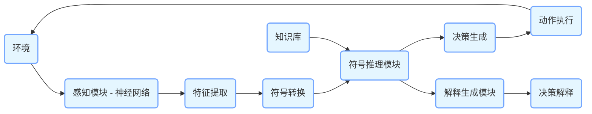

# 基于神经符号AI的可解释Agent设计

> 关键词：神经符号AI、可解释Agent、人工智能、符号推理、神经网络

> 摘要：本文聚焦于基于神经符号AI的可解释Agent设计。首先介绍了该研究的背景，包括目的、预期读者、文档结构和相关术语。接着阐述了神经符号AI与可解释Agent的核心概念及它们之间的联系，并给出了相应的原理和架构示意图。详细讲解了核心算法原理，通过Python代码进行了具体操作步骤的说明，同时给出了相关的数学模型和公式并举例。在项目实战部分，从开发环境搭建、源代码实现到代码解读进行了全面分析。探讨了其实际应用场景，推荐了学习、开发相关的工具和资源，最后总结了未来发展趋势与挑战，解答了常见问题并提供了扩展阅读和参考资料，旨在为该领域的研究和实践提供全面且深入的指导。

## 1. 背景介绍 
### 1.1 目的和范围
在当今人工智能领域，Agent技术广泛应用于各种复杂系统中，如智能机器人、自动化决策系统等。然而，传统的基于神经网络的Agent往往缺乏可解释性，这使得它们在一些对透明度和可信赖性要求较高的场景中应用受限。基于神经符号AI的可解释Agent设计旨在结合神经网络强大的感知和学习能力与符号推理的可解释性，构建能够在完成任务的同时，为其决策过程提供清晰解释的智能Agent。

本文章的范围涵盖了神经符号AI和可解释Agent的核心概念、算法原理、数学模型、项目实战、应用场景以及相关的工具和资源推荐等方面，旨在为研究者和开发者提供全面且深入的指导，帮助他们理解和实践基于神经符号AI的可解释Agent设计。

### 1.2 预期读者
本文预期读者包括人工智能领域的研究者、机器学习和深度学习相关专业的学生、从事智能Agent开发的工程师以及对可解释人工智能感兴趣的技术爱好者。对于有一定编程基础和机器学习知识的读者，本文将有助于他们深入理解神经符号AI和可解释Agent的设计原理和实现方法；对于初学者，本文也提供了丰富的基础知识和学习资源，帮助他们逐步进入该领域。

### 1.3 文档结构概述
本文共分为十个部分。第一部分为背景介绍，阐述了研究的目的、预期读者、文档结构和相关术语。第二部分讲解核心概念与联系，包括神经符号AI和可解释Agent的原理、架构以及它们之间的关系，并给出相应的示意图和流程图。第三部分详细介绍核心算法原理和具体操作步骤，通过Python代码进行说明。第四部分给出数学模型和公式，并进行详细讲解和举例。第五部分是项目实战，包括开发环境搭建、源代码实现和代码解读。第六部分探讨实际应用场景。第七部分推荐学习、开发相关的工具和资源。第八部分总结未来发展趋势与挑战。第九部分为附录，解答常见问题。第十部分提供扩展阅读和参考资料。

### 1.4 术语表
#### 1.4.1 核心术语定义
- **神经符号AI（Neural-Symbolic AI）**：一种将神经网络和符号推理相结合的人工智能范式。神经网络用于处理感知和学习任务，符号推理则用于进行逻辑推理和知识表示，旨在充分发挥两者的优势。
- **可解释Agent（Explainable Agent）**：一种智能Agent，它不仅能够完成特定的任务，还能对其决策过程和行为提供清晰、易懂的解释，以增强其透明度和可信赖性。
- **符号推理（Symbolic Reasoning）**：基于符号和规则进行逻辑推理的方法，通过对符号的操作和演绎来得出结论，具有明确的语义和可解释性。
- **神经网络（Neural Network）**：一种模仿人类神经系统的计算模型，由大量的神经元组成，通过对数据的学习和训练来实现模式识别、预测等任务。

#### 1.4.2 相关概念解释
- **知识表示（Knowledge Representation）**：将人类的知识以计算机能够理解和处理的方式进行表示，以便于进行推理和决策。在神经符号AI中，知识可以用符号、逻辑规则或神经网络的参数来表示。
- **决策解释（Decision Explanation）**：对Agent做出的决策过程进行解释，说明决策的依据和推理步骤，帮助用户理解Agent的行为。
- **感知与推理融合（Perception and Reasoning Fusion）**：将神经网络的感知能力和符号推理的能力相结合，使Agent能够在感知环境信息的基础上进行逻辑推理，从而做出更合理的决策。

#### 1.4.3 缩略词列表
- **AI**：Artificial Intelligence，人工智能
- **ML**：Machine Learning，机器学习
- **DL**：Deep Learning，深度学习
- **NN**：Neural Network，神经网络
- **XAI**：Explainable Artificial Intelligence，可解释人工智能

## 2. 核心概念与联系 

### 核心概念原理
#### 神经符号AI原理
神经符号AI的核心思想是将神经网络和符号推理有机结合。神经网络具有强大的感知和学习能力，能够从大量的数据中自动提取特征和模式。例如，在图像识别任务中，卷积神经网络（CNN）可以通过对大量图像的学习，准确地识别出图像中的物体。而符号推理则基于符号和规则进行逻辑推理，具有明确的语义和可解释性。例如，在专家系统中，通过预定义的规则和事实进行推理，得出结论。

在神经符号AI中，神经网络可以作为感知模块，负责从环境中获取信息并进行特征提取；符号推理模块则利用神经网络提取的特征和预定义的知识进行逻辑推理，做出决策。两者之间通过信息交互和协同工作，实现更强大的智能。

#### 可解释Agent原理
可解释Agent的设计目标是在完成任务的同时，能够对其决策过程和行为提供清晰的解释。为了实现这一目标，可解释Agent通常采用以下方法：
- **基于规则的解释**：Agent的决策过程基于预定义的规则，通过展示这些规则和推理步骤来解释决策。例如，在一个基于规则的诊断系统中，Agent可以根据患者的症状和预定义的诊断规则，给出诊断结果并解释推理过程。
- **特征重要性解释**：通过分析神经网络中特征的重要性，解释Agent的决策依据。例如，在图像分类任务中，Agent可以指出哪些特征对分类结果影响最大，从而解释为什么将图像分类为某个类别。
- **因果关系解释**：通过建立因果模型，解释Agent的决策与环境因素之间的因果关系。例如，在一个自动驾驶系统中，Agent可以解释为什么在某个时刻做出刹车的决策，是因为检测到前方有障碍物。

### 架构示意图
以下是基于神经符号AI的可解释Agent的架构示意图：



### 核心概念联系
神经符号AI为可解释Agent的设计提供了有效的方法和技术支持。通过将神经网络和符号推理相结合，可解释Agent能够充分利用神经网络的感知和学习能力，同时利用符号推理的可解释性，实现对决策过程的清晰解释。

具体来说，神经网络负责从环境中感知信息并进行特征提取，将感知到的信息转换为符号表示，为符号推理模块提供输入。符号推理模块则基于预定义的知识和规则，对输入的符号进行逻辑推理，做出决策。解释生成模块根据符号推理的过程和结果，生成决策解释。因此，神经符号AI的各个组件相互协作，共同实现了可解释Agent的功能。

## 3. 核心算法原理 & 具体操作步骤 

### 核心算法原理
#### 神经网络与符号转换算法
在神经符号AI中，首先需要将神经网络提取的特征转换为符号表示。一种常见的方法是使用聚类算法将特征空间划分为不同的类别，每个类别对应一个符号。例如，在图像分类任务中，可以使用K-Means聚类算法将图像特征划分为不同的类别，每个类别代表一个物体类别，如猫、狗等。

以下是使用Python实现K-Means聚类算法进行特征符号转换的示例代码：

```python
import numpy as np
from sklearn.cluster import KMeans

# 假设我们有一组特征向量
features = np.array([[1, 2], [2, 3], [8, 9], [9, 10]])

# 定义聚类的数量
n_clusters = 2

# 创建K-Means模型
kmeans = KMeans(n_clusters=n_clusters)

# 训练模型
kmeans.fit(features)

# 获取每个特征向量所属的类别
labels = kmeans.labels_

# 将类别转换为符号
symbols = []
for label in labels:
    symbols.append(f'Symbol_{label}')

print(symbols)
```

#### 符号推理算法
符号推理通常基于逻辑规则进行。一种常见的符号推理算法是前向链推理（Forward Chaining），它从已知的事实出发，根据规则逐步推导出新的事实。

以下是一个简单的前向链推理的Python实现示例：

```python
# 定义规则
rules = [
    {'conditions': ['A', 'B'], 'conclusion': 'C'},
    {'conditions': ['C', 'D'], 'conclusion': 'E'}
]

# 定义已知事实
facts = ['A', 'B', 'D']

# 前向链推理函数
def forward_chaining(rules, facts):
    new_facts = set(facts)
    while True:
        old_facts = set(new_facts)
        for rule in rules:
            conditions = rule['conditions']
            conclusion = rule['conclusion']
            if all(condition in new_facts for condition in conditions) and conclusion not in new_facts:
                new_facts.add(conclusion)
        if new_facts == old_facts:
            break
    return new_facts

# 执行推理
result = forward_chaining(rules, facts)
print(result)
```

### 具体操作步骤
1. **数据收集与预处理**：收集与任务相关的数据，并进行预处理，如归一化、特征提取等。
2. **神经网络训练**：使用预处理后的数据训练神经网络，使其能够从环境中感知信息并提取特征。
3. **特征符号转换**：使用聚类算法等方法将神经网络提取的特征转换为符号表示。
4. **符号推理**：基于预定义的规则和已知事实，使用符号推理算法进行逻辑推理，做出决策。
5. **解释生成**：根据符号推理的过程和结果，生成决策解释。

## 4. 数学模型和公式 & 详细讲解 & 举例说明 

### 神经网络的数学模型
神经网络可以看作是一个由多个神经元组成的非线性函数。以多层感知机（MLP）为例，其数学模型可以表示为：

$$
\mathbf{y} = f_L(W_L f_{L - 1}(W_{L - 1} \cdots f_1(W_1 \mathbf{x} + \mathbf{b}_1) + \mathbf{b}_{L - 1}) + \mathbf{b}_L)
$$

其中，$\mathbf{x}$ 是输入向量，$\mathbf{y}$ 是输出向量，$W_i$ 是第 $i$ 层的权重矩阵，$\mathbf{b}_i$ 是第 $i$ 层的偏置向量，$f_i$ 是第 $i$ 层的激活函数。

### 符号推理的逻辑规则表示
符号推理通常基于逻辑规则进行，逻辑规则可以用一阶逻辑表示。例如，一个简单的规则可以表示为：

$$
P(x) \land Q(x) \rightarrow R(x)
$$

其中，$P(x)$、$Q(x)$ 和 $R(x)$ 是谓词，$\land$ 表示逻辑与，$\rightarrow$ 表示逻辑蕴含。这个规则表示如果 $P(x)$ 和 $Q(x)$ 都为真，则 $R(x)$ 为真。

### 举例说明
假设我们有一个简单的图像分类任务，输入是一张图像，输出是图像所属的类别。我们可以使用一个卷积神经网络（CNN）进行图像特征提取，然后使用K-Means聚类算法将提取的特征转换为符号表示。假设我们有以下规则：

- 如果图像特征属于符号 $S_1$ 且图像中有猫的特征，则图像类别为猫。
- 如果图像特征属于符号 $S_2$ 且图像中有狗的特征，则图像类别为狗。

我们可以使用前向链推理算法根据这些规则和已知事实（如图像特征的符号表示和是否检测到猫或狗的特征）来推断图像的类别，并给出决策解释。

例如，已知图像特征属于符号 $S_1$ 且检测到猫的特征，根据规则可以推断出图像类别为猫。解释可以是：“因为图像特征属于符号 $S_1$ 且检测到猫的特征，根据规则‘如果图像特征属于符号 $S_1$ 且图像中有猫的特征，则图像类别为猫’，所以图像类别为猫。”

## 5. 项目实战：代码实际案例和详细解释说明 

### 5.1  开发环境搭建
#### 安装Python
首先，需要安装Python。建议使用Python 3.7及以上版本。可以从Python官方网站（https://www.python.org/downloads/）下载并安装。

#### 安装必要的库
使用以下命令安装必要的Python库：
```sh
pip install numpy scikit-learn tensorflow
```
- `numpy`：用于数值计算。
- `scikit-learn`：提供了机器学习的工具和算法，如K-Means聚类。
- `tensorflow`：用于构建和训练神经网络。

### 5.2  源代码详细实现和代码解读
#### 数据准备
假设我们有一个简单的图像分类数据集，包含猫和狗的图像。以下是数据准备的代码：

```python
import numpy as np
from tensorflow.keras.datasets import cifar10
from sklearn.model_selection import train_test_split

# 加载CIFAR-10数据集
(x_train, y_train), (x_test, y_test) = cifar10.load_data()

# 筛选出猫（3）和狗（5）的图像
cat_dog_indices_train = np.logical_or(y_train == 3, y_train == 5).flatten()
x_train_cat_dog = x_train[cat_dog_indices_train]
y_train_cat_dog = y_train[cat_dog_indices_train]

cat_dog_indices_test = np.logical_or(y_test == 3, y_test == 5).flatten()
x_test_cat_dog = x_test[cat_dog_indices_test]
y_test_cat_dog = y_test[cat_dog_indices_test]

# 将标签转换为0（猫）和1（狗）
y_train_cat_dog = np.where(y_train_cat_dog == 3, 0, 1)
y_test_cat_dog = np.where(y_test_cat_dog == 3, 0, 1)

# 划分训练集和验证集
x_train, x_val, y_train, y_val = train_test_split(x_train_cat_dog, y_train_cat_dog, test_size=0.2, random_state=42)
```

#### 神经网络模型构建与训练
使用TensorFlow构建一个简单的卷积神经网络模型，并进行训练：

```python
from tensorflow.keras.models import Sequential
from tensorflow.keras.layers import Conv2D, MaxPooling2D, Flatten, Dense

# 构建模型
model = Sequential([
    Conv2D(32, (3, 3), activation='relu', input_shape=(32, 32, 3)),
    MaxPooling2D((2, 2)),
    Conv2D(64, (3, 3), activation='relu'),
    MaxPooling2D((2, 2)),
    Flatten(),
    Dense(64, activation='relu'),
    Dense(1, activation='sigmoid')
])

# 编译模型
model.compile(optimizer='adam',
              loss='binary_crossentropy',
              metrics=['accuracy'])

# 训练模型
model.fit(x_train, y_train, epochs=10, validation_data=(x_val, y_val))
```

#### 特征符号转换
使用K-Means聚类算法将神经网络提取的特征转换为符号表示：

```python
from sklearn.cluster import KMeans

# 提取中间层的特征
from tensorflow.keras.models import Model
intermediate_layer_model = Model(inputs=model.input,
                                 outputs=model.get_layer('flatten').output)
features = intermediate_layer_model.predict(x_train)

# 定义聚类的数量
n_clusters = 2

# 创建K-Means模型
kmeans = KMeans(n_clusters=n_clusters)

# 训练模型
kmeans.fit(features)

# 获取每个特征向量所属的类别
labels = kmeans.labels_

# 将类别转换为符号
symbols = []
for label in labels:
    symbols.append(f'Symbol_{label}')
```

#### 符号推理
定义规则并进行符号推理：

```python
# 定义规则
rules = [
    {'conditions': ['Symbol_0', 'Cat_Feature'], 'conclusion': 'Cat'},
    {'conditions': ['Symbol_1', 'Dog_Feature'], 'conclusion': 'Dog'}
]

# 假设已知某些图像有猫或狗的特征
cat_features = [True, False, True, ...]  # 假设的猫特征列表
dog_features = [False, True, False, ...]  # 假设的狗特征列表

# 进行推理
results = []
for i in range(len(symbols)):
    facts = [symbols[i]]
    if cat_features[i]:
        facts.append('Cat_Feature')
    if dog_features[i]:
        facts.append('Dog_Feature')
    result = forward_chaining(rules, facts)
    results.append(result)
```

### 5.3  代码解读与分析
- **数据准备**：从CIFAR-10数据集中筛选出猫和狗的图像，并将标签转换为0（猫）和1（狗）。划分训练集、验证集和测试集，为模型训练做准备。
- **神经网络模型构建与训练**：使用TensorFlow构建一个简单的卷积神经网络模型，包括卷积层、池化层和全连接层。使用二元交叉熵损失函数和Adam优化器进行模型训练。
- **特征符号转换**：通过提取神经网络中间层的特征，使用K-Means聚类算法将特征划分为不同的类别，每个类别对应一个符号。
- **符号推理**：定义规则并根据已知事实（符号和特征信息）进行前向链推理，得出图像的类别。

通过这个项目实战，我们可以看到如何将神经网络和符号推理相结合，实现基于神经符号AI的可解释Agent。

## 6. 实际应用场景 
### 医疗诊断领域
在医疗诊断中，可解释Agent可以帮助医生更准确地做出诊断决策。神经网络可以对患者的病历、影像数据等进行分析和特征提取，然后将提取的特征转换为符号表示。符号推理模块可以根据医学知识和规则，对这些符号进行推理，得出诊断结果。同时，可解释Agent可以为诊断结果提供详细的解释，说明诊断的依据和推理过程，帮助医生理解和验证诊断结果，提高诊断的准确性和可信赖性。

### 自动驾驶领域
在自动驾驶中，可解释Agent可以对车辆的决策过程进行解释。神经网络可以感知车辆周围的环境信息，如障碍物、交通标志等，并提取特征。符号推理模块可以根据交通规则和安全原则，对这些特征进行推理，做出驾驶决策。可解释Agent可以向乘客和监管部门解释为什么车辆在某个时刻做出特定的决策，如刹车、转弯等，增强自动驾驶系统的透明度和可接受性。

### 金融风险评估领域
在金融风险评估中，可解释Agent可以对贷款申请人的信用风险进行评估。神经网络可以分析申请人的财务数据、信用记录等信息，提取特征。符号推理模块可以根据金融规则和风险模型，对这些特征进行推理，评估申请人的信用风险。可解释Agent可以为评估结果提供解释，说明评估的依据和推理过程，帮助金融机构更好地管理风险，同时也可以让申请人了解评估结果的原因。

### 智能教育领域
在智能教育中，可解释Agent可以为学生提供个性化的学习建议。神经网络可以分析学生的学习行为、成绩数据等信息，提取特征。符号推理模块可以根据教育规则和学习模型，对这些特征进行推理，为学生制定学习计划和提供建议。可解释Agent可以向学生解释为什么推荐某个学习资源或学习方法，帮助学生更好地理解和接受建议，提高学习效果。

## 7. 工具和资源推荐
### 7.1 学习资源推荐
#### 7.1.1 书籍推荐
- 《人工智能：一种现代的方法》（Artificial Intelligence: A Modern Approach）：这是一本经典的人工智能教材，涵盖了人工智能的各个方面，包括符号推理、神经网络等内容，对理解神经符号AI的基础概念有很大帮助。
- 《深度学习》（Deep Learning）：由Ian Goodfellow、Yoshua Bengio和Aaron Courville所著，详细介绍了深度学习的原理、算法和应用，是学习神经网络的重要参考书籍。
- 《知识表示与推理》（Knowledge Representation and Reasoning）：专注于知识表示和符号推理的理论和方法，对于深入理解神经符号AI中的符号推理部分非常有价值。

#### 7.1.2 在线课程
- Coursera上的“人工智能基础”（Foundations of Artificial Intelligence）课程：由知名教授授课，系统地介绍了人工智能的基本概念和方法，包括符号推理和机器学习。
- edX上的“深度学习专项课程”（Deep Learning Specialization）：由Andrew Ng教授主讲，深入讲解了深度学习的各个方面，包括卷积神经网络、循环神经网络等。
- Udemy上的“可解释人工智能”（Explainable Artificial Intelligence）课程：专门介绍了可解释人工智能的技术和方法，对于学习基于神经符号AI的可解释Agent设计有很大帮助。

#### 7.1.3 技术博客和网站
- Towards Data Science：一个专注于数据科学和人工智能的技术博客平台，上面有很多关于神经符号AI和可解释人工智能的文章和教程。
- Medium上的AI社区：汇聚了众多人工智能领域的专家和爱好者，分享了大量的技术文章和研究成果。
- arXiv：一个预印本平台，提供了最新的人工智能研究论文，包括神经符号AI和可解释Agent方面的研究。

### 7.2 开发工具框架推荐
#### 7.2.1 IDE和编辑器
- PyCharm：一款功能强大的Python集成开发环境，提供了代码编辑、调试、版本控制等功能，适合开发基于Python的神经符号AI项目。
- Jupyter Notebook：一种交互式的开发环境，允许用户在浏览器中编写和运行代码，同时可以添加文本说明和可视化结果，非常适合进行数据分析和模型实验。
- Visual Studio Code：一款轻量级的代码编辑器，支持多种编程语言和插件，具有丰富的扩展功能，可用于开发各种类型的人工智能项目。

#### 7.2.2 调试和性能分析工具
- TensorBoard：TensorFlow提供的可视化工具，可以帮助用户监控模型的训练过程，分析模型的性能指标，如损失函数、准确率等。
- PyTorch Profiler：PyTorch提供的性能分析工具，可以帮助用户分析模型的运行时间和内存使用情况，找出性能瓶颈并进行优化。
- Scikit-learn中的模型评估工具：提供了各种模型评估指标和工具，如准确率、召回率、F1值等，可用于评估神经符号AI模型的性能。

#### 7.2.3 相关框架和库
- TensorFlow：一个开源的机器学习框架，提供了丰富的工具和库，可用于构建和训练神经网络模型。
- PyTorch：另一个流行的深度学习框架，具有动态图机制，适合快速开发和实验。
- scikit-learn：一个简单易用的机器学习库，提供了各种机器学习算法和工具，如聚类、分类、回归等，可用于神经符号AI中的特征处理和符号推理。

### 7.3 相关论文著作推荐
#### 7.3.1 经典论文
- “Neural-Symbolic Learning and Reasoning: Contributions and Challenges”：该论文系统地介绍了神经符号AI的发展历程、主要方法和面临的挑战，是神经符号AI领域的经典论文之一。
- “Explainable Artificial Intelligence: A Review of the State of the Art”：对可解释人工智能的研究现状进行了全面的综述，包括可解释性的定义、方法和应用等方面。
- “Towards Explainable Reinforcement Learning through Visualization”：提出了通过可视化方法实现可解释强化学习的思路和方法，对于可解释Agent的设计有一定的参考价值。

#### 7.3.2 最新研究成果
- 关注arXiv上关于神经符号AI和可解释人工智能的最新论文，了解该领域的最新研究动态和技术进展。
- 参加人工智能领域的顶级会议，如NeurIPS、ICML、AAAI等，获取最新的研究成果和学术交流机会。

#### 7.3.3 应用案例分析
- 一些知名的科技公司和研究机构会发布基于神经符号AI和可解释Agent的应用案例，如Google、Microsoft等。可以通过它们的官方博客和研究报告了解这些应用案例的实现方法和效果。

## 8. 总结：未来发展趋势与挑战
### 未来发展趋势
- **更深度的融合**：未来，神经符号AI和可解释Agent将实现更深度的融合，神经网络和符号推理之间的交互将更加紧密和高效。例如，符号推理的结果可以反馈给神经网络，指导其学习和决策，从而提高Agent的智能水平和可解释性。
- **跨领域应用拓展**：基于神经符号AI的可解释Agent将在更多领域得到应用，如能源管理、环境监测、农业等。这些领域对决策的可解释性和透明度有较高的要求，可解释Agent可以为这些领域的决策提供有力支持。
- **与其他技术的结合**：可解释Agent将与其他新兴技术，如区块链、物联网等相结合，实现更复杂的应用场景。例如，在物联网中，可解释Agent可以对大量的传感器数据进行分析和决策，并为决策提供解释，同时利用区块链的特性保证数据的安全性和可信度。

### 挑战
- **理论基础的完善**：目前，神经符号AI和可解释Agent的理论基础还不够完善，需要进一步研究和发展。例如，如何建立更有效的神经网络和符号推理的融合机制，如何衡量和评估Agent的可解释性等问题还需要深入探讨。
- **计算资源的需求**：神经符号AI和可解释Agent的实现通常需要大量的计算资源，尤其是在处理大规模数据和复杂任务时。如何优化算法和模型，降低计算资源的需求，是一个亟待解决的问题。
- **数据质量和标注问题**：高质量的数据和准确的标注是训练神经网络和进行符号推理的基础。然而，在实际应用中，数据质量和标注往往存在问题，如数据缺失、标注错误等。如何处理这些问题，提高数据的质量和可用性，是保证可解释Agent性能的关键。

## 9. 附录：常见问题与解答
### 问题1：神经符号AI和传统的神经网络有什么区别？
传统的神经网络主要侧重于数据的学习和模式识别，通过大量的数据训练来优化模型的参数。而神经符号AI则将神经网络和符号推理相结合，不仅能够进行数据学习，还能进行逻辑推理和知识表示。神经符号AI可以利用符号推理的可解释性，为神经网络的决策提供解释，提高模型的透明度和可信赖性。

### 问题2：可解释Agent的解释是否总是准确的？
可解释Agent的解释是基于其内部的推理过程和规则生成的，在大多数情况下是准确的。然而，由于模型的局限性和数据的不确定性，解释可能存在一定的误差。例如，神经网络提取的特征可能存在偏差，符号推理的规则可能不够完善，这些都可能导致解释的不准确。因此，在使用可解释Agent的解释时，需要结合实际情况进行评估和验证。

### 问题3：如何衡量可解释Agent的可解释性？
目前，衡量可解释Agent的可解释性还没有统一的标准和方法。一些常用的指标包括解释的清晰度、可理解性、完整性等。例如，可以通过用户调查来评估解释的可理解性，通过对比解释和实际决策过程来评估解释的完整性。此外，还可以从信息论、因果关系等角度来研究可解释性的衡量方法。

### 问题4：神经符号AI和可解释Agent的实现难度大吗？
神经符号AI和可解释Agent的实现难度相对较大，需要掌握神经网络、符号推理、知识表示等多方面的知识和技术。同时，还需要处理数据、模型训练、算法优化等一系列问题。然而，随着相关技术的不断发展和开源工具的不断丰富，实现难度正在逐渐降低。对于有一定机器学习和编程基础的开发者来说，通过学习和实践，可以逐步掌握相关技术，实现基于神经符号AI的可解释Agent。

## 10. 扩展阅读 & 参考资料
### 扩展阅读
- 《可解释人工智能的理论与实践》：深入探讨了可解释人工智能的理论和方法，包括模型解释、特征重要性分析等内容。
- 《符号计算与人工智能》：介绍了符号计算在人工智能中的应用，对于理解神经符号AI中的符号推理部分有很大帮助。
- 《智能Agent技术》：系统地介绍了智能Agent的设计原理、算法和应用，对于学习可解释Agent的设计有一定的参考价值。

### 参考资料
- 相关的学术论文和研究报告，如在IEEE、ACM等学术数据库中搜索关于神经符号AI和可解释Agent的论文。
- 开源项目和代码库，如GitHub上的相关项目，可以参考他人的实现方法和代码示例。
- 官方文档和教程，如TensorFlow、PyTorch等框架的官方文档，提供了详细的使用说明和示例代码。