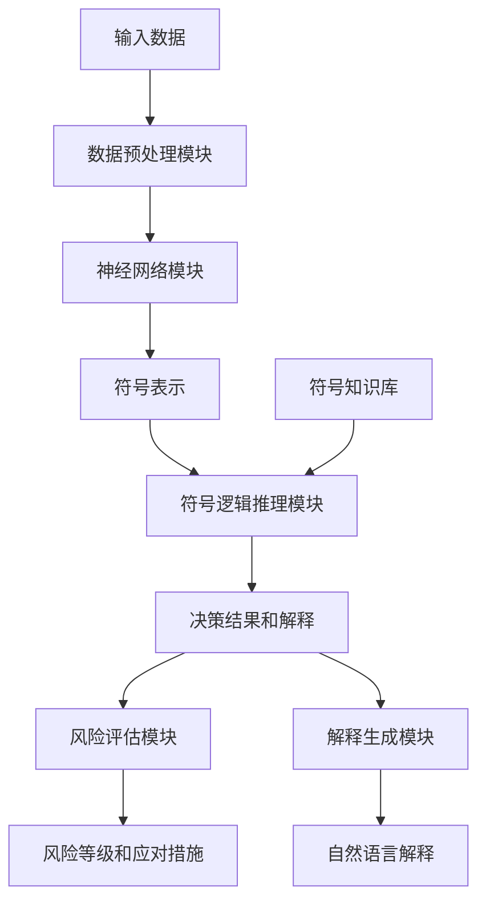

# 基于神经符号推理的可解释AI风险评估系统

> 关键词：神经符号推理、可解释AI、风险评估系统、人工智能、符号逻辑、深度学习

> 摘要：本文聚焦于基于神经符号推理的可解释AI风险评估系统。在人工智能广泛应用的当下，其黑盒特性带来的风险评估难题日益凸显。本系统结合神经符号推理的优势，旨在实现可解释的AI风险评估。文章首先介绍相关背景知识，包括目的范围、预期读者等；接着阐述核心概念与联系，给出原理和架构示意图；详细讲解核心算法原理与操作步骤，通过Python代码进行说明；介绍数学模型和公式并举例；进行项目实战，给出代码案例与详细解释；探讨实际应用场景；推荐相关工具和资源；最后总结未来发展趋势与挑战，解答常见问题并提供扩展阅读和参考资料，为可解释AI风险评估系统的研究与应用提供全面的技术支持和理论指导。

## 1. 背景介绍 
### 1.1 目的和范围
随着人工智能技术的飞速发展，其在金融、医疗、交通等关键领域的应用越来越广泛。然而，现有的AI模型大多是基于深度学习的黑盒模型，其决策过程难以理解和解释，这给模型的可靠性和安全性带来了巨大挑战。例如，在医疗诊断中，医生可能无法信任一个无法解释其诊断依据的AI系统；在金融风险评估中，监管机构也需要了解AI模型的决策逻辑以确保合规性。

基于神经符号推理的可解释AI风险评估系统的目的在于构建一个能够对AI模型的决策过程进行解释，并对其可能带来的风险进行评估的系统。本系统的范围涵盖了多种AI模型，包括但不限于神经网络、决策树等，旨在为不同领域的AI应用提供通用的风险评估和解释方案。

### 1.2 预期读者
本文的预期读者包括人工智能领域的研究人员、开发者、数据科学家、风险评估专家以及对可解释AI感兴趣的相关从业人员。对于研究人员，本文可以为其提供新的研究思路和方法；对于开发者，有助于他们将可解释性和风险评估功能集成到自己的AI系统中；对于风险评估专家，能为其提供更科学、准确的风险评估工具；对于普通从业者，可帮助他们更好地理解和应用AI技术。

### 1.3 文档结构概述
本文将按照以下结构进行阐述：首先介绍基于神经符号推理的可解释AI风险评估系统的背景知识，包括目的、范围、预期读者等；接着深入探讨核心概念与联系，给出系统的原理和架构示意图；详细讲解核心算法原理与具体操作步骤，并使用Python代码进行说明；介绍系统所涉及的数学模型和公式，并通过举例进行详细讲解；进行项目实战，给出代码实际案例并进行详细解释；探讨系统的实际应用场景；推荐相关的工具和资源，包括学习资源、开发工具框架、相关论文著作等；最后总结系统的未来发展趋势与挑战，解答常见问题并提供扩展阅读和参考资料。

### 1.4 术语表
#### 1.4.1 核心术语定义
- **神经符号推理**：将神经网络的感知能力与符号逻辑推理相结合的一种推理方法。神经网络用于从数据中提取特征和模式，符号逻辑推理则用于对这些特征和模式进行逻辑推理和解释。
- **可解释AI**：指那些能够以人类可理解的方式解释其决策过程和输出结果的人工智能系统。可解释AI有助于提高模型的透明度、可信度和安全性。
- **风险评估系统**：用于评估AI系统在运行过程中可能面临的各种风险，如模型偏差、数据泄露、决策失误等，并给出相应的风险等级和应对措施的系统。
- **符号逻辑**：一种基于符号和规则的逻辑推理方法，通过定义符号和规则来表示和处理知识和信息。
- **深度学习**：一种基于神经网络的机器学习方法，通过多层神经网络自动从数据中学习特征和模式。

#### 1.4.2 相关概念解释
- **黑盒模型**：指那些内部结构和决策过程难以理解和解释的模型，如传统的深度学习模型。黑盒模型虽然在很多任务中表现出色，但由于其不可解释性，在一些对安全性和可靠性要求较高的领域应用受到限制。
- **白盒模型**：与黑盒模型相对，白盒模型的内部结构和决策过程是透明的，易于理解和解释。例如，决策树模型就是一种典型的白盒模型。
- **知识图谱**：一种用于表示和存储知识的图结构，由实体、关系和属性组成。知识图谱可以为神经符号推理提供丰富的背景知识和语义信息。

#### 1.4.3 缩略词列表
- **AI**：Artificial Intelligence，人工智能
- **ML**：Machine Learning，机器学习
- **DL**：Deep Learning，深度学习
- **XAI**：Explainable Artificial Intelligence，可解释人工智能

## 2. 核心概念与联系 
### 核心概念原理
神经符号推理的核心思想是将神经网络的感知能力与符号逻辑推理相结合。神经网络具有强大的模式识别和特征提取能力，能够从大量的数据中自动学习到复杂的特征和模式。然而，神经网络的决策过程是基于数值计算的，难以用人类可理解的方式进行解释。符号逻辑推理则是基于符号和规则的推理方法，能够以逻辑规则的形式表示和处理知识和信息，具有良好的可解释性。

在基于神经符号推理的可解释AI风险评估系统中，神经网络用于对输入数据进行特征提取和模式识别，将输入数据转换为符号表示。符号逻辑推理则基于这些符号表示进行逻辑推理和解释，从而得到可解释的决策结果和风险评估信息。

### 架构的文本示意图
基于神经符号推理的可解释AI风险评估系统主要由以下几个部分组成：
1. **数据预处理模块**：负责对输入数据进行清洗、归一化、特征选择等预处理操作，以提高数据的质量和可用性。
2. **神经网络模块**：采用深度学习模型，如卷积神经网络（CNN）、循环神经网络（RNN）等，对预处理后的数据进行特征提取和模式识别，将输入数据转换为符号表示。
3. **符号知识库**：存储领域知识和逻辑规则，为符号逻辑推理提供背景知识和语义信息。符号知识库可以是手工构建的，也可以是从数据中自动学习得到的。
4. **符号逻辑推理模块**：基于符号表示和符号知识库中的知识和规则进行逻辑推理和解释，得到可解释的决策结果和风险评估信息。
5. **风险评估模块**：根据符号逻辑推理的结果，对AI系统的风险进行评估，给出相应的风险等级和应对措施。
6. **解释生成模块**：将符号逻辑推理的结果转换为自然语言解释，以便用户理解和接受。

### Mermaid流程图


## 3. 核心算法原理 & 具体操作步骤 
### 核心算法原理
基于神经符号推理的可解释AI风险评估系统的核心算法主要包括神经网络的训练和符号逻辑推理两个部分。

#### 神经网络训练
神经网络的训练过程是通过最小化损失函数来调整网络的参数，使得网络能够对输入数据进行准确的特征提取和模式识别。常用的损失函数包括交叉熵损失函数、均方误差损失函数等。

以下是一个使用Python和PyTorch实现的简单神经网络训练示例：
```python
import torch
import torch.nn as nn
import torch.optim as optim

# 定义一个简单的神经网络模型
class SimpleNet(nn.Module):
    def __init__(self, input_size, hidden_size, output_size):
        super(SimpleNet, self).__init__()
        self.fc1 = nn.Linear(input_size, hidden_size)
        self.relu = nn.ReLU()
        self.fc2 = nn.Linear(hidden_size, output_size)

    def forward(self, x):
        out = self.fc1(x)
        out = self.relu(out)
        out = self.fc2(out)
        return out

# 定义训练数据
input_size = 10
hidden_size = 20
output_size = 2
num_samples = 100
x = torch.randn(num_samples, input_size)
y = torch.randint(0, output_size, (num_samples,))

# 初始化模型、损失函数和优化器
model = SimpleNet(input_size, hidden_size, output_size)
criterion = nn.CrossEntropyLoss()
optimizer = optim.SGD(model.parameters(), lr=0.01)

# 训练模型
num_epochs = 100
for epoch in range(num_epochs):
    # 前向传播
    outputs = model(x)
    loss = criterion(outputs, y)

    # 反向传播和优化
    optimizer.zero_grad()
    loss.backward()
    optimizer.step()

    if (epoch + 1) % 10 == 0:
        print(f'Epoch [{epoch+1}/{num_epochs}], Loss: {loss.item():.4f}')
```

#### 符号逻辑推理
符号逻辑推理是基于符号表示和符号知识库中的知识和规则进行的。常用的符号逻辑推理方法包括归结推理、自然演绎推理等。

以下是一个简单的符号逻辑推理示例：
```python
# 定义符号知识库
knowledge_base = {
    "A": True,
    "B": False,
    "A and B": lambda: knowledge_base["A"] and knowledge_base["B"],
    "A or B": lambda: knowledge_base["A"] or knowledge_base["B"]
}

# 进行逻辑推理
print(knowledge_base["A and B"]())  # 输出 False
print(knowledge_base["A or B"]())   # 输出 True
```

### 具体操作步骤
1. **数据准备**：收集和整理相关的数据集，并进行数据预处理，包括数据清洗、归一化、特征选择等操作。
2. **神经网络训练**：选择合适的神经网络模型，如CNN、RNN等，并使用预处理后的数据进行训练。
3. **符号表示生成**：将训练好的神经网络的输出转换为符号表示。
4. **符号知识库构建**：手工构建或从数据中自动学习符号知识库，存储领域知识和逻辑规则。
5. **符号逻辑推理**：基于符号表示和符号知识库中的知识和规则进行逻辑推理，得到可解释的决策结果和风险评估信息。
6. **风险评估和解释生成**：根据符号逻辑推理的结果，对AI系统的风险进行评估，并生成自然语言解释。

## 4. 数学模型和公式 & 详细讲解 & 举例说明 
### 神经网络模型
#### 前向传播
神经网络的前向传播过程可以用以下公式表示：
$$
z^{[l]} = W^{[l]}a^{[l-1]} + b^{[l]}
$$
$$
a^{[l]} = g(z^{[l]})
$$
其中，$z^{[l]}$ 表示第 $l$ 层的线性组合输出，$W^{[l]}$ 表示第 $l$ 层的权重矩阵，$a^{[l-1]}$ 表示第 $l-1$ 层的激活输出，$b^{[l]}$ 表示第 $l$ 层的偏置向量，$g$ 表示激活函数。

#### 损失函数
常用的交叉熵损失函数可以表示为：
$$
L(\hat{y}, y) = -\frac{1}{m}\sum_{i=1}^{m}\left[y^{(i)}\log(\hat{y}^{(i)}) + (1 - y^{(i)})\log(1 - \hat{y}^{(i)})\right]
$$
其中，$m$ 表示样本数量，$y^{(i)}$ 表示第 $i$ 个样本的真实标签，$\hat{y}^{(i)}$ 表示第 $i$ 个样本的预测标签。

#### 反向传播
反向传播的目的是计算损失函数对权重和偏置的梯度，以便进行参数更新。以简单的两层神经网络为例，损失函数对权重和偏置的梯度可以表示为：
$$
\frac{\partial L}{\partial W^{[2]}} = \frac{1}{m}(a^{[2]} - y)a^{[1]T}
$$
$$
\frac{\partial L}{\partial b^{[2]}} = \frac{1}{m}\sum_{i=1}^{m}(a^{[2](i)} - y^{(i)})
$$
$$
\frac{\partial L}{\partial W^{[1]}} = \frac{1}{m}W^{[2]T}(a^{[2]} - y)g'(z^{[1]})x^{T}
$$
$$
\frac{\partial L}{\partial b^{[1]}} = \frac{1}{m}\sum_{i=1}^{m}W^{[2]T}(a^{[2](i)} - y^{(i)})g'(z^{[1](i)})
$$
其中，$g'$ 表示激活函数的导数。

### 符号逻辑推理
#### 逻辑运算规则
逻辑与运算可以表示为：
$$
A \land B = \begin{cases}
True, & \text{if } A = True \text{ and } B = True \\
False, & \text{otherwise}
\end{cases}
$$
逻辑或运算可以表示为：
$$
A \lor B = \begin{cases}
True, & \text{if } A = True \text{ or } B = True \\
False, & \text{otherwise}
\end{cases}
$$
逻辑非运算可以表示为：
$$
\neg A = \begin{cases}
True, & \text{if } A = False \\
False, & \text{if } A = True
\end{cases}
$$

#### 举例说明
假设我们有以下符号知识库：
$$
\begin{cases}
A = True \\
B = False \\
C = A \land B
\end{cases}
$$
根据逻辑与运算规则，我们可以计算出 $C$ 的值为：
$$
C = A \land B = True \land False = False
$$

## 5. 项目实战：代码实际案例和详细解释说明 
### 5.1  开发环境搭建
#### 安装Python
首先，需要安装Python环境。可以从Python官方网站（https://www.python.org/downloads/） 下载并安装适合自己操作系统的Python版本。建议安装Python 3.6及以上版本。

#### 安装依赖库
使用以下命令安装项目所需的依赖库：
```sh
pip install torch numpy pandas matplotlib
```
其中，`torch` 是PyTorch深度学习框架，`numpy` 用于数值计算，`pandas` 用于数据处理，`matplotlib` 用于数据可视化。

### 5.2  源代码详细实现和代码解读
以下是一个基于神经符号推理的可解释AI风险评估系统的完整代码示例：
```python
import torch
import torch.nn as nn
import torch.optim as optim
import numpy as np

# 定义一个简单的神经网络模型
class SimpleNet(nn.Module):
    def __init__(self, input_size, hidden_size, output_size):
        super(SimpleNet, self).__init__()
        self.fc1 = nn.Linear(input_size, hidden_size)
        self.relu = nn.ReLU()
        self.fc2 = nn.Linear(hidden_size, output_size)

    def forward(self, x):
        out = self.fc1(x)
        out = self.relu(out)
        out = self.fc2(out)
        return out

# 定义训练数据
input_size = 10
hidden_size = 20
output_size = 2
num_samples = 100
x = torch.randn(num_samples, input_size)
y = torch.randint(0, output_size, (num_samples,))

# 初始化模型、损失函数和优化器
model = SimpleNet(input_size, hidden_size, output_size)
criterion = nn.CrossEntropyLoss()
optimizer = optim.SGD(model.parameters(), lr=0.01)

# 训练模型
num_epochs = 100
for epoch in range(num_epochs):
    # 前向传播
    outputs = model(x)
    loss = criterion(outputs, y)

    # 反向传播和优化
    optimizer.zero_grad()
    loss.backward()
    optimizer.step()

    if (epoch + 1) % 10 == 0:
        print(f'Epoch [{epoch+1}/{num_epochs}], Loss: {loss.item():.4f}')

# 生成符号表示
with torch.no_grad():
    symbol_representation = model(x)

# 定义符号知识库
knowledge_base = {
    "high_risk": lambda x: x[:, 0] > 0.8,
    "low_risk": lambda x: x[:, 0] < 0.2
}

# 进行符号逻辑推理
high_risk_indices = np.where(knowledge_base["high_risk"](symbol_representation).numpy())[0]
low_risk_indices = np.where(knowledge_base["low_risk"](symbol_representation).numpy())[0]

print(f'High risk indices: {high_risk_indices}')
print(f'Low risk indices: {low_risk_indices}')
```

### 5.3  代码解读与分析
1. **神经网络模型定义**：定义了一个简单的两层神经网络模型 `SimpleNet`，包括一个全连接层、一个ReLU激活函数和另一个全连接层。
2. **数据准备**：生成了随机的输入数据 `x` 和标签数据 `y`。
3. **模型训练**：使用交叉熵损失函数和随机梯度下降优化器对模型进行训练。
4. **符号表示生成**：使用训练好的模型对输入数据进行前向传播，得到符号表示 `symbol_representation`。
5. **符号知识库定义**：定义了一个符号知识库，包含两个逻辑规则：`high_risk` 和 `low_risk`。
6. **符号逻辑推理**：根据符号知识库中的逻辑规则，对符号表示进行推理，得到高风险和低风险的样本索引。

## 6. 实际应用场景 
### 金融领域
在金融领域，基于神经符号推理的可解释AI风险评估系统可以用于信用风险评估、市场风险评估等。例如，在信用风险评估中，系统可以对客户的信用数据进行分析，通过神经网络提取特征，然后使用符号逻辑推理对客户的信用风险进行评估，并给出可解释的评估结果。这样，金融机构可以更好地理解客户的信用状况，做出更合理的决策。

### 医疗领域
在医疗领域，该系统可以用于疾病诊断、治疗方案推荐等。例如，在疾病诊断中，系统可以对患者的病历数据、检查结果等进行分析，通过神经网络提取特征，然后使用符号逻辑推理对患者的疾病进行诊断，并给出可解释的诊断依据。这样，医生可以更好地理解诊断结果，提高诊断的准确性和可靠性。

### 交通领域
在交通领域，系统可以用于自动驾驶汽车的风险评估、交通流量预测等。例如，在自动驾驶汽车的风险评估中，系统可以对车辆的传感器数据、环境信息等进行分析，通过神经网络提取特征，然后使用符号逻辑推理对车辆的行驶风险进行评估，并给出可解释的风险评估结果。这样，自动驾驶汽车可以更好地应对各种复杂的路况，提高行驶的安全性。

## 7. 工具和资源推荐
### 7.1 学习资源推荐
#### 7.1.1 书籍推荐
- 《深度学习》（Deep Learning）：由Ian Goodfellow、Yoshua Bengio和Aaron Courville所著，是深度学习领域的经典教材，涵盖了深度学习的基本概念、算法和应用。
- 《人工智能：一种现代的方法》（Artificial Intelligence: A Modern Approach）：由Stuart Russell和Peter Norvig所著，是人工智能领域的权威教材，介绍了人工智能的各个方面，包括知识表示、推理、机器学习等。
- 《可解释人工智能》（Explainable Artificial Intelligence）：由Xudong He、Dacheng Tao和Chen Gong所著，专门介绍了可解释人工智能的相关理论和方法。

#### 7.1.2 在线课程
- Coursera上的“深度学习专项课程”（Deep Learning Specialization）：由Andrew Ng教授授课，系统地介绍了深度学习的基本概念、算法和应用。
- edX上的“人工智能基础”（Fundamentals of Artificial Intelligence）：由麻省理工学院（MIT）的教授授课，介绍了人工智能的基本概念、知识表示、推理等内容。
- 哔哩哔哩（Bilibili）上的相关人工智能和深度学习教程：有许多优秀的UP主分享了人工智能和深度学习的教学视频，内容丰富、通俗易懂。

#### 7.1.3 技术博客和网站
- Medium上的人工智能和深度学习相关博客：有许多专业的技术博主分享了最新的研究成果和实践经验。
- arXiv.org：是一个预印本服务器，提供了大量的人工智能和深度学习领域的研究论文。
- Towards Data Science：是一个专注于数据科学和人工智能的技术博客，有许多高质量的文章和教程。

### 7.2 开发工具框架推荐
#### 7.2.1 IDE和编辑器
- PyCharm：是一款专门为Python开发设计的集成开发环境（IDE），提供了丰富的功能和工具，如代码自动补全、调试、版本控制等。
- Jupyter Notebook：是一个交互式的开发环境，支持Python、R等多种编程语言，适合进行数据探索、模型训练和可视化等工作。
- Visual Studio Code：是一款轻量级的代码编辑器，支持多种编程语言和插件，具有良好的扩展性和性能。

#### 7.2.2 调试和性能分析工具
- PyTorch Profiler：是PyTorch自带的性能分析工具，可以帮助开发者分析模型的性能瓶颈，优化代码。
- TensorBoard：是TensorFlow的可视化工具，也可以与PyTorch结合使用，用于可视化模型的训练过程、性能指标等。
- cProfile：是Python自带的性能分析工具，可以帮助开发者分析代码的运行时间和内存使用情况。

#### 7.2.3 相关框架和库
- PyTorch：是一个开源的深度学习框架，具有动态计算图、易于使用等优点，广泛应用于学术界和工业界。
- TensorFlow：是另一个开源的深度学习框架，具有强大的分布式计算能力和丰富的工具集。
- Scikit-learn：是一个用于机器学习的Python库，提供了各种机器学习算法和工具，如分类、回归、聚类等。

### 7.3 相关论文著作推荐
#### 7.3.1 经典论文
- “Deep Learning” by Yann LeCun, Yoshua Bengio, and Geoffrey Hinton：发表于Nature杂志，是深度学习领域的经典论文，介绍了深度学习的基本概念和发展历程。
- “Explaining and Harnessing Adversarial Examples” by Ian J. Goodfellow, Jonathon Shlens, and Christian Szegedy：提出了对抗样本的概念，并介绍了对抗样本的生成和防御方法。
- “Why Should I Trust You?” Explaining the Predictions of Any Classifier by Marco Tulio Ribeiro, Sameer Singh, and Carlos Guestrin：提出了LIME（Local Interpretable Model-agnostic Explanations）方法，用于解释任何分类器的预测结果。

#### 7.3.2 最新研究成果
- 关注NeurIPS（神经信息处理系统大会）、ICML（国际机器学习会议）、CVPR（计算机视觉与模式识别会议）等顶级学术会议的最新论文，了解基于神经符号推理的可解释AI风险评估系统的最新研究进展。
- 关注相关领域的顶级学术期刊，如Journal of Artificial Intelligence Research（JAIR）、Artificial Intelligence等，获取最新的研究成果。

#### 7.3.3 应用案例分析
- 可以参考一些实际应用案例的研究报告和论文，了解基于神经符号推理的可解释AI风险评估系统在不同领域的应用情况和效果。例如，一些金融机构、医疗企业等发布的关于AI风险评估的案例研究。

## 8. 总结：未来发展趋势与挑战
### 未来发展趋势
- **融合多模态信息**：未来的基于神经符号推理的可解释AI风险评估系统将融合多模态信息，如文本、图像、音频等，以提高系统的准确性和鲁棒性。例如，在医疗诊断中，结合患者的病历文本、医学影像等多模态信息进行综合分析。
- **强化学习与神经符号推理的结合**：强化学习可以让AI系统在动态环境中进行学习和决策，将强化学习与神经符号推理相结合，可以提高系统的适应性和智能水平。例如，在自动驾驶汽车中，通过强化学习不断优化行驶策略，同时使用神经符号推理对决策过程进行解释和风险评估。
- **跨领域应用拓展**：随着技术的不断发展，基于神经符号推理的可解释AI风险评估系统将在更多领域得到应用，如教育、能源、环保等。例如，在教育领域，评估学生的学习风险，提供个性化的学习建议。

### 挑战
- **知识表示和推理的复杂性**：符号知识库的构建和符号逻辑推理的实现面临着知识表示和推理的复杂性问题。如何有效地表示和处理领域知识，以及如何高效地进行逻辑推理，是需要解决的关键问题。
- **神经网络与符号逻辑推理的融合**：神经网络和符号逻辑推理是两种不同的计算范式，如何将它们有机地融合在一起，实现高效的信息传递和协同工作，是一个具有挑战性的问题。
- **计算资源和时间成本**：基于神经符号推理的可解释AI风险评估系统通常需要大量的计算资源和时间，如何优化算法和模型，降低计算资源和时间成本，是提高系统实用性的关键。

## 9. 附录：常见问题与解答
### 问题1：神经符号推理与传统的神经网络有什么区别？
神经符号推理将神经网络的感知能力与符号逻辑推理相结合，既能够从数据中自动学习特征和模式，又能够以逻辑规则的形式对决策过程进行解释。而传统的神经网络是基于数值计算的黑盒模型，其决策过程难以理解和解释。

### 问题2：如何构建符号知识库？
符号知识库可以通过手工构建或从数据中自动学习得到。手工构建需要领域专家的知识和经验，将领域知识和逻辑规则以符号的形式表示出来。从数据中自动学习可以使用知识图谱构建技术、规则挖掘算法等，从大量的数据中提取知识和规则。

### 问题3：基于神经符号推理的可解释AI风险评估系统的准确性如何保证？
可以通过以下几个方面来保证系统的准确性：
- **数据质量**：确保输入数据的准确性、完整性和一致性。
- **模型选择和训练**：选择合适的神经网络模型，并使用足够的训练数据进行训练，以提高模型的准确性。
- **符号知识库的完善**：不断完善符号知识库，确保其中的知识和规则的准确性和完整性。
- **模型评估和优化**：使用合适的评估指标对系统进行评估，并根据评估结果对模型和规则进行优化。

### 问题4：该系统的计算资源需求大吗？
基于神经符号推理的可解释AI风险评估系统通常需要一定的计算资源，特别是在神经网络训练和符号逻辑推理过程中。可以通过优化算法、使用高效的计算设备（如GPU）等方式来降低计算资源需求。

## 10. 扩展阅读 & 参考资料
### 扩展阅读
- 可以进一步阅读关于知识图谱、逻辑推理、可解释人工智能等方面的书籍和论文，深入了解相关的理论和方法。
- 关注相关领域的学术会议和技术论坛，了解最新的研究动态和实践经验。

### 参考资料
- 本文中引用的所有书籍、论文、在线课程等资料的详细信息，包括作者、标题、出版年份、出版社等。
- 相关的开源代码库和数据集的链接，方便读者进行实践和研究。