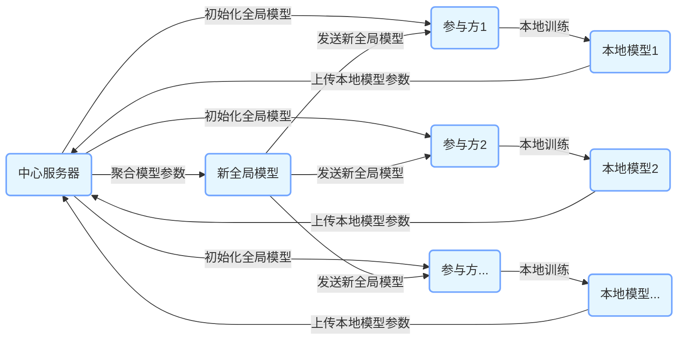

# 基于联邦学习的隐私保护AI系统设计

> 关键词：联邦学习、隐私保护、AI系统、数据安全、协同训练

> 摘要：本文聚焦于基于联邦学习的隐私保护AI系统设计。随着人工智能的快速发展，数据隐私问题日益凸显，联邦学习作为一种新兴的技术，为解决这一问题提供了有效途径。文章详细介绍了联邦学习的核心概念、算法原理、数学模型，通过实际项目案例展示了系统的开发与实现过程，探讨了其实际应用场景，并推荐了相关的学习资源、开发工具和研究论文。最后，对基于联邦学习的隐私保护AI系统的未来发展趋势与挑战进行了总结。

## 1. 背景介绍 
### 1.1 目的和范围
随着数字化时代的到来，大量的数据被收集和使用，人工智能技术在各个领域得到了广泛应用。然而，数据隐私问题成为了制约人工智能发展的重要因素。传统的AI训练方式需要将数据集中到一个中心节点，这可能会导致数据泄露和隐私侵犯。联邦学习作为一种新兴的技术，允许在不共享原始数据的情况下进行模型训练，从而有效保护了数据隐私。本文的目的是深入探讨基于联邦学习的隐私保护AI系统的设计，包括核心概念、算法原理、实际应用等方面，为相关领域的研究和开发提供参考。

### 1.2 预期读者
本文主要面向人工智能、机器学习、数据隐私保护等领域的研究人员、开发人员和技术爱好者。对于希望了解联邦学习技术和隐私保护AI系统设计的读者，本文将提供系统而深入的知识和实践指导。

### 1.3 文档结构概述
本文将按照以下结构进行组织：首先介绍联邦学习和隐私保护AI系统的核心概念与联系；接着详细阐述核心算法原理和具体操作步骤，并给出Python源代码示例；然后介绍相关的数学模型和公式，并通过举例进行说明；之后通过实际项目案例展示系统的开发与实现过程；再探讨基于联邦学习的隐私保护AI系统的实际应用场景；推荐相关的学习资源、开发工具和研究论文；最后对未来发展趋势与挑战进行总结，并提供常见问题解答和扩展阅读参考资料。

### 1.4 术语表
#### 1.4.1 核心术语定义
- **联邦学习（Federated Learning）**：一种分布式机器学习技术，允许在多个参与方之间进行模型训练，而无需共享原始数据。参与方在本地进行模型训练，并将模型参数上传到中心服务器进行聚合，从而得到全局模型。
- **隐私保护（Privacy Preservation）**：指在数据处理和使用过程中，采取一系列技术和措施，确保数据的机密性、完整性和可用性，防止数据泄露和隐私侵犯。
- **AI系统（Artificial Intelligence System）**：基于人工智能技术构建的系统，能够模拟人类的智能行为，如学习、推理、决策等。
- **模型参数（Model Parameters）**：在机器学习模型中，用于描述模型结构和性能的一组变量。通过调整模型参数，可以优化模型的性能。
- **全局模型（Global Model）**：在联邦学习中，通过聚合各个参与方的本地模型参数得到的模型。全局模型代表了所有参与方的数据特征和模式。

#### 1.4.2 相关概念解释
- **数据孤岛（Data Silos）**：指各个组织或个人拥有的数据相互隔离，无法共享和协同使用的现象。数据孤岛限制了数据的价值挖掘和应用，联邦学习可以有效打破数据孤岛，实现数据的协同利用。
- **差分隐私（Differential Privacy）**：一种严格的隐私保护技术，通过在数据中添加噪声来保护数据的隐私。在联邦学习中，差分隐私可以用于保护模型参数的隐私。
- **同态加密（Homomorphic Encryption）**：一种特殊的加密技术，允许在加密数据上进行计算，而无需解密数据。同态加密可以用于保护数据在传输和计算过程中的隐私。

#### 1.4.3 缩略词列表
- **FL**：Federated Learning（联邦学习）
- **DP**：Differential Privacy（差分隐私）
- **HE**：Homomorphic Encryption（同态加密）
- **SGD**：Stochastic Gradient Descent（随机梯度下降）

## 2. 核心概念与联系 
### 2.1 联邦学习的原理
联邦学习的核心思想是在不共享原始数据的情况下，通过多个参与方之间的协作来训练一个全局模型。具体来说，联邦学习的过程可以分为以下几个步骤：
1. **初始化**：中心服务器初始化一个全局模型，并将其发送给各个参与方。
2. **本地训练**：各个参与方在本地使用自己的数据集对全局模型进行训练，得到本地模型。
3. **参数上传**：各个参与方将本地模型的参数上传到中心服务器。
4. **参数聚合**：中心服务器对各个参与方上传的本地模型参数进行聚合，得到新的全局模型。
5. **模型更新**：中心服务器将新的全局模型发送给各个参与方，各个参与方使用新的全局模型进行下一轮的本地训练。

重复以上步骤，直到全局模型的性能达到满意的程度。

### 2.2 隐私保护的重要性
在人工智能应用中，数据隐私保护至关重要。传统的AI训练方式需要将数据集中到一个中心节点，这可能会导致数据泄露和隐私侵犯。例如，医疗数据、金融数据等敏感数据包含了大量的个人隐私信息，如果这些数据被泄露，可能会给个人带来严重的损失。联邦学习通过在本地进行模型训练，避免了原始数据的共享，从而有效保护了数据隐私。

### 2.3 联邦学习与隐私保护的联系
联邦学习和隐私保护是相辅相成的。联邦学习为隐私保护提供了一种有效的技术手段，通过在本地进行模型训练，避免了原始数据的共享，从而保护了数据隐私。同时，隐私保护技术可以进一步增强联邦学习的安全性和可靠性。例如，差分隐私可以用于保护模型参数的隐私，同态加密可以用于保护数据在传输和计算过程中的隐私。

### 2.4 核心概念原理和架构的文本示意图
```plaintext
+---------------------+
| 中心服务器          |
| 1. 初始化全局模型    |
| 2. 接收本地模型参数  |
| 3. 聚合模型参数      |
| 4. 发送全局模型      |
+---------------------+
          |
          | 全局模型
          |
+---------------------+
| 参与方1            |
| 1. 接收全局模型    |
| 2. 本地训练        |
| 3. 上传本地模型参数|
+---------------------+
          |
          | 本地模型参数
          |
+---------------------+
| 参与方2            |
| 1. 接收全局模型    |
| 2. 本地训练        |
| 3. 上传本地模型参数|
+---------------------+
          |
          | 本地模型参数
          |
...
```

### 2.5 Mermaid流程图


## 3. 核心算法原理 & 具体操作步骤 
### 3.1 联邦平均算法（Federated Averaging, FedAvg）原理
联邦平均算法是联邦学习中最常用的算法之一，其核心思想是通过多次迭代，让各个参与方在本地进行模型训练，并将本地模型的参数上传到中心服务器进行平均，从而得到全局模型。具体步骤如下：
1. **初始化**：中心服务器初始化一个全局模型 $W_0$，并将其发送给各个参与方。
2. **本地训练**：对于每一轮迭代 $t$，各个参与方 $i$ 在本地使用自己的数据集 $D_i$ 对全局模型 $W_t$ 进行 $E$ 个 epoch 的训练，得到本地模型 $W_{t+1}^i$。
3. **参数上传**：各个参与方 $i$ 将本地模型 $W_{t+1}^i$ 的参数上传到中心服务器。
4. **参数聚合**：中心服务器对各个参与方上传的本地模型参数进行加权平均，得到新的全局模型 $W_{t+1}$：
   $$W_{t+1}=\sum_{i=1}^{n}\frac{n_i}{N}W_{t+1}^i$$
   其中，$n_i$ 是参与方 $i$ 的数据集大小，$N=\sum_{i=1}^{n}n_i$ 是所有参与方的数据集大小之和。
5. **模型更新**：中心服务器将新的全局模型 $W_{t+1}$ 发送给各个参与方，各个参与方使用新的全局模型进行下一轮的本地训练。

重复以上步骤，直到全局模型的性能达到满意的程度。

### 3.2 Python源代码实现
```python
import torch
import torch.nn as nn
import torch.optim as optim
from torch.utils.data import DataLoader, Dataset

# 定义一个简单的神经网络模型
class SimpleNet(nn.Module):
    def __init__(self):
        super(SimpleNet, self).__init__()
        self.fc1 = nn.Linear(10, 20)
        self.fc2 = nn.Linear(20, 1)

    def forward(self, x):
        x = torch.relu(self.fc1(x))
        x = self.fc2(x)
        return x

# 模拟参与方
class Participant:
    def __init__(self, dataset, model):
        self.dataset = dataset
        self.model = model
        self.optimizer = optim.SGD(self.model.parameters(), lr=0.01)
        self.criterion = nn.MSELoss()

    def local_train(self, epochs):
        dataloader = DataLoader(self.dataset, batch_size=32, shuffle=True)
        for epoch in range(epochs):
            for data, target in dataloader:
                self.optimizer.zero_grad()
                output = self.model(data)
                loss = self.criterion(output, target)
                loss.backward()
                self.optimizer.step()
        return self.model.state_dict()

# 模拟中心服务器
class Server:
    def __init__(self, model):
        self.model = model

    def aggregate(self, client_states, client_sizes):
        total_size = sum(client_sizes)
        new_state = {}
        for key in self.model.state_dict().keys():
            new_state[key] = torch.zeros_like(self.model.state_dict()[key])
            for i, state in enumerate(client_states):
                new_state[key] += (client_sizes[i] / total_size) * state[key]
        self.model.load_state_dict(new_state)
        return self.model.state_dict()

# 模拟数据集
class MockDataset(Dataset):
    def __init__(self, num_samples):
        self.data = torch.randn(num_samples, 10)
        self.target = torch.randn(num_samples, 1)

    def __len__(self):
        return len(self.data)

    def __getitem__(self, idx):
        return self.data[idx], self.target[idx]

# 初始化模型
global_model = SimpleNet()
server = Server(global_model)

# 初始化参与方
num_participants = 3
participants = []
client_sizes = []
for i in range(num_participants):
    dataset = MockDataset(100)
    client_sizes.append(len(dataset))
    participant = Participant(dataset, SimpleNet())
    participants.append(participant)

# 联邦学习训练过程
num_rounds = 10
local_epochs = 5
for round in range(num_rounds):
    client_states = []
    for participant in participants:
        participant.model.load_state_dict(server.model.state_dict())
        state = participant.local_train(local_epochs)
        client_states.append(state)
    new_global_state = server.aggregate(client_states, client_sizes)
    print(f"Round {round + 1} completed.")
```

### 3.3 代码解释
1. **模型定义**：定义了一个简单的神经网络模型 `SimpleNet`，包含两个全连接层。
2. **参与方类**：`Participant` 类表示一个参与方，包含本地数据集、本地模型、优化器和损失函数。`local_train` 方法用于在本地进行模型训练，并返回本地模型的参数。
3. **中心服务器类**：`Server` 类表示中心服务器，包含全局模型。`aggregate` 方法用于对各个参与方上传的本地模型参数进行加权平均，得到新的全局模型。
4. **数据集类**：`MockDataset` 类用于模拟数据集，生成随机的数据和标签。
5. **训练过程**：在主程序中，初始化全局模型、中心服务器和参与方，然后进行多轮的联邦学习训练。每一轮中，各个参与方在本地进行模型训练，将本地模型参数上传到中心服务器，中心服务器进行参数聚合，得到新的全局模型。

## 4. 数学模型和公式 & 详细讲解 & 举例说明 
### 4.1 损失函数
在联邦学习中，常用的损失函数是均方误差损失（Mean Squared Error, MSE）和交叉熵损失（Cross Entropy Loss）。

#### 均方误差损失
均方误差损失用于回归问题，其公式为：
$$L(y, \hat{y})=\frac{1}{n}\sum_{i=1}^{n}(y_i - \hat{y}_i)^2$$
其中，$y$ 是真实标签，$\hat{y}$ 是模型预测值，$n$ 是样本数量。

#### 交叉熵损失
交叉熵损失用于分类问题，其公式为：
$$L(y, \hat{y})=-\frac{1}{n}\sum_{i=1}^{n}\sum_{c=1}^{C}y_{i,c}\log(\hat{y}_{i,c})$$
其中，$y$ 是真实标签的 one-hot 编码，$\hat{y}$ 是模型预测的概率分布，$n$ 是样本数量，$C$ 是类别数量。

### 4.2 优化算法
在联邦学习中，常用的优化算法是随机梯度下降（Stochastic Gradient Descent, SGD）及其变种，如 Adam、Adagrad 等。

#### 随机梯度下降
随机梯度下降的更新公式为：
$$\theta_{t+1}=\theta_t - \eta\nabla L(\theta_t; x_i, y_i)$$
其中，$\theta$ 是模型参数，$\eta$ 是学习率，$\nabla L(\theta_t; x_i, y_i)$ 是损失函数关于模型参数的梯度，$(x_i, y_i)$ 是随机选择的一个样本。

### 4.3 联邦平均算法的数学推导
联邦平均算法的核心是参数聚合，其数学推导如下：

假设参与方 $i$ 的本地数据集为 $D_i$，本地模型为 $W^i$，全局模型为 $W$。在每一轮迭代中，参与方 $i$ 在本地使用数据集 $D_i$ 对全局模型 $W$ 进行训练，得到本地模型 $W^i$。

本地模型 $W^i$ 的更新公式为：
$$W^i = W - \eta\nabla L(W; D_i)$$
其中，$\eta$ 是学习率，$\nabla L(W; D_i)$ 是损失函数关于全局模型 $W$ 在数据集 $D_i$ 上的梯度。

中心服务器对各个参与方上传的本地模型参数进行加权平均，得到新的全局模型 $W'$：
$$W'=\sum_{i=1}^{n}\frac{n_i}{N}W^i$$
其中，$n_i$ 是参与方 $i$ 的数据集大小，$N=\sum_{i=1}^{n}n_i$ 是所有参与方的数据集大小之和。

将 $W^i = W - \eta\nabla L(W; D_i)$ 代入上式，得到：
$$W'=\sum_{i=1}^{n}\frac{n_i}{N}(W - \eta\nabla L(W; D_i))$$
$$W'=W - \eta\sum_{i=1}^{n}\frac{n_i}{N}\nabla L(W; D_i)$$

可以看出，联邦平均算法通过对各个参与方的本地梯度进行加权平均，得到全局梯度，然后使用全局梯度更新全局模型。

### 4.4 举例说明
假设我们有两个参与方，参与方 1 的数据集大小为 $n_1 = 100$，参与方 2 的数据集大小为 $n_2 = 200$，总数据集大小为 $N = n_1 + n_2 = 300$。

在某一轮迭代中，参与方 1 的本地模型参数为 $W_1$，参与方 2 的本地模型参数为 $W_2$。中心服务器对这两个本地模型参数进行加权平均，得到新的全局模型参数 $W'$：
$$W'=\frac{n_1}{N}W_1+\frac{n_2}{N}W_2=\frac{100}{300}W_1+\frac{200}{300}W_2$$

这样，新的全局模型参数就综合了两个参与方的本地模型信息。

## 5. 项目实战：代码实际案例和详细解释说明 
### 5.1  开发环境搭建
#### 操作系统
推荐使用 Linux 或 macOS 操作系统，因为它们对 Python 和深度学习框架的支持更好。

#### Python 环境
建议使用 Python 3.7 及以上版本。可以使用 Anaconda 或 Miniconda 来管理 Python 环境，具体安装步骤如下：
1. 下载 Anaconda 或 Miniconda 安装包：可以从官方网站（https://www.anaconda.com/products/individual 或 https://docs.conda.io/en/latest/miniconda.html）下载适合自己操作系统的安装包。
2. 安装 Anaconda 或 Miniconda：按照安装向导的提示进行安装。
3. 创建虚拟环境：打开终端，运行以下命令创建一个新的虚拟环境：
```bash
conda create -n federated_learning python=3.8
```
4. 激活虚拟环境：运行以下命令激活虚拟环境：
```bash
conda activate federated_learning
```

#### 深度学习框架
本文使用 PyTorch 作为深度学习框架，可以使用以下命令安装 PyTorch：
```bash
pip install torch torchvision
```

### 5.2  源代码详细实现和代码解读
以下是一个完整的基于联邦学习的手写数字识别项目的代码示例：

```python
import torch
import torch.nn as nn
import torch.optim as optim
from torchvision import datasets, transforms
from torch.utils.data import DataLoader

# 定义一个简单的卷积神经网络模型
class SimpleCNN(nn.Module):
    def __init__(self):
        super(SimpleCNN, self).__init__()
        self.conv1 = nn.Conv2d(1, 10, kernel_size=5)
        self.conv2 = nn.Conv2d(10, 20, kernel_size=5)
        self.fc1 = nn.Linear(320, 50)
        self.fc2 = nn.Linear(50, 10)

    def forward(self, x):
        x = torch.relu(torch.max_pool2d(self.conv1(x), 2))
        x = torch.relu(torch.max_pool2d(self.conv2(x), 2))
        x = x.view(-1, 320)
        x = torch.relu(self.fc1(x))
        x = self.fc2(x)
        return x

# 模拟参与方
class Participant:
    def __init__(self, dataset, model):
        self.dataset = dataset
        self.model = model
        self.optimizer = optim.SGD(self.model.parameters(), lr=0.01)
        self.criterion = nn.CrossEntropyLoss()

    def local_train(self, epochs):
        dataloader = DataLoader(self.dataset, batch_size=32, shuffle=True)
        for epoch in range(epochs):
            for data, target in dataloader:
                self.optimizer.zero_grad()
                output = self.model(data)
                loss = self.criterion(output, target)
                loss.backward()
                self.optimizer.step()
        return self.model.state_dict()

# 模拟中心服务器
class Server:
    def __init__(self, model):
        self.model = model

    def aggregate(self, client_states, client_sizes):
        total_size = sum(client_sizes)
        new_state = {}
        for key in self.model.state_dict().keys():
            new_state[key] = torch.zeros_like(self.model.state_dict()[key])
            for i, state in enumerate(client_states):
                new_state[key] += (client_sizes[i] / total_size) * state[key]
        self.model.load_state_dict(new_state)
        return self.model.state_dict()

# 加载数据集
transform = transforms.Compose([
    transforms.ToTensor(),
    transforms.Normalize((0.1307,), (0.3081,))
])
train_dataset = datasets.MNIST(root='./data', train=True,
                               download=True, transform=transform)
test_dataset = datasets.MNIST(root='./data', train=False,
                              download=True, transform=transform)

# 划分数据集给不同的参与方
num_participants = 3
participant_datasets = []
participant_sizes = []
partition_size = len(train_dataset) // num_participants
for i in range(num_participants):
    start_idx = i * partition_size
    end_idx = (i + 1) * partition_size if i < num_participants - 1 else len(train_dataset)
    participant_dataset = torch.utils.data.Subset(train_dataset, range(start_idx, end_idx))
    participant_datasets.append(participant_dataset)
    participant_sizes.append(len(participant_dataset))

# 初始化模型
global_model = SimpleCNN()
server = Server(global_model)

# 初始化参与方
participants = []
for i in range(num_participants):
    participant = Participant(participant_datasets[i], SimpleCNN())
    participants.append(participant)

# 联邦学习训练过程
num_rounds = 10
local_epochs = 5
for round in range(num_rounds):
    client_states = []
    for participant in participants:
        participant.model.load_state_dict(server.model.state_dict())
        state = participant.local_train(local_epochs)
        client_states.append(state)
    new_global_state = server.aggregate(client_states, participant_sizes)
    print(f"Round {round + 1} completed.")

# 测试全局模型
test_dataloader = DataLoader(test_dataset, batch_size=32, shuffle=False)
correct = 0
total = 0
with torch.no_grad():
    for data, target in test_dataloader:
        output = global_model(data)
        _, predicted = torch.max(output.data, 1)
        total += target.size(0)
        correct += (predicted == target).sum().item()
print(f"Test accuracy: {100 * correct / total}%")
```

### 5.3  代码解读与分析
1. **模型定义**：定义了一个简单的卷积神经网络模型 `SimpleCNN`，用于手写数字识别。
2. **参与方类**：`Participant` 类表示一个参与方，包含本地数据集、本地模型、优化器和损失函数。`local_train` 方法用于在本地进行模型训练，并返回本地模型的参数。
3. **中心服务器类**：`Server` 类表示中心服务器，包含全局模型。`aggregate` 方法用于对各个参与方上传的本地模型参数进行加权平均，得到新的全局模型。
4. **数据集加载和划分**：使用 `torchvision` 库加载 MNIST 手写数字数据集，并将数据集划分为多个子集，分别分配给不同的参与方。
5. **训练过程**：在主程序中，初始化全局模型、中心服务器和参与方，然后进行多轮的联邦学习训练。每一轮中，各个参与方在本地进行模型训练，将本地模型参数上传到中心服务器，中心服务器进行参数聚合，得到新的全局模型。
6. **测试过程**：训练完成后，使用测试数据集对全局模型进行测试，计算模型的准确率。

通过这个项目案例，我们可以看到如何使用联邦学习技术在不共享原始数据的情况下进行模型训练，同时保护了数据隐私。

## 6. 实际应用场景 
### 6.1 医疗领域
在医疗领域，各个医院拥有大量的患者数据，但由于数据隐私和安全问题，这些数据往往无法共享。联邦学习可以在不共享患者原始数据的情况下，让各个医院之间进行模型训练，从而提高医疗诊断的准确性和效率。例如，通过联邦学习可以训练一个疾病预测模型，各个医院在本地使用自己的患者数据进行模型训练，然后将模型参数上传到中心服务器进行聚合，得到一个全局的疾病预测模型。

### 6.2 金融领域
在金融领域，银行、证券等机构拥有大量的客户数据，这些数据包含了客户的个人隐私信息和金融交易信息。联邦学习可以在保护客户数据隐私的情况下，让各个金融机构之间进行模型训练，从而提高金融风险评估和欺诈检测的准确性。例如，通过联邦学习可以训练一个信用评分模型，各个金融机构在本地使用自己的客户数据进行模型训练，然后将模型参数上传到中心服务器进行聚合，得到一个全局的信用评分模型。

### 6.3 智能交通领域
在智能交通领域，各个交通管理部门和企业拥有大量的交通数据，如车辆行驶轨迹、交通流量等。联邦学习可以在不共享原始交通数据的情况下，让各个部门和企业之间进行模型训练，从而提高交通流量预测和智能交通控制的准确性。例如，通过联邦学习可以训练一个交通流量预测模型，各个交通管理部门和企业在本地使用自己的交通数据进行模型训练，然后将模型参数上传到中心服务器进行聚合，得到一个全局的交通流量预测模型。

### 6.4 物联网领域
在物联网领域，各个设备拥有大量的传感器数据，这些数据包含了设备的运行状态和环境信息。联邦学习可以在保护设备数据隐私的情况下，让各个设备之间进行模型训练，从而提高设备的智能化水平和故障预测的准确性。例如，通过联邦学习可以训练一个设备故障预测模型，各个设备在本地使用自己的传感器数据进行模型训练，然后将模型参数上传到中心服务器进行聚合，得到一个全局的设备故障预测模型。

## 7. 工具和资源推荐
### 7.1 学习资源推荐
#### 7.1.1 书籍推荐
- 《深度学习》（Deep Learning）：由 Ian Goodfellow、Yoshua Bengio 和 Aaron Courville 所著，是深度学习领域的经典教材，涵盖了深度学习的基本概念、算法和应用。
- 《联邦学习》（Federated Learning）：由杨强、刘洋、程勇等所著，是联邦学习领域的权威书籍，详细介绍了联邦学习的原理、算法和应用。
- 《Python 深度学习》（Deep Learning with Python）：由 Francois Chollet 所著，介绍了如何使用 Python 和 Keras 进行深度学习开发，适合初学者入门。

#### 7.1.2 在线课程
- Coursera 上的“深度学习专项课程”（Deep Learning Specialization）：由 Andrew Ng 教授授课，涵盖了深度学习的各个方面，包括神经网络、卷积神经网络、循环神经网络等。
- edX 上的“联邦学习基础”（Foundations of Federated Learning）：介绍了联邦学习的基本概念、算法和应用，适合初学者学习。
- 中国大学 MOOC 上的“人工智能基础”（Fundamentals of Artificial Intelligence）：由清华大学的朱军教授授课，介绍了人工智能的基本概念、算法和应用，包括机器学习、深度学习等。

#### 7.1.3 技术博客和网站
- 机器之心（https://www.alizila.com/）：提供人工智能领域的最新技术和研究成果，包括联邦学习、深度学习等。
- 开源中国（https://www.oschina.net/）：提供开源技术的相关资讯和教程，包括 Python、深度学习框架等。
- 深度学习前沿（https://www.deeplearningfrontier.com/）：专注于深度学习领域的前沿技术和研究成果，包括联邦学习、强化学习等。

### 7.2 开发工具框架推荐
#### 7.2.1 IDE和编辑器
- PyCharm：是一款专门为 Python 开发设计的集成开发环境（IDE），提供了丰富的功能和插件，适合开发大型 Python 项目。
- Jupyter Notebook：是一个交互式的开发环境，适合进行数据探索、模型训练和可视化等工作。
- Visual Studio Code：是一款轻量级的代码编辑器，支持多种编程语言和插件，适合快速开发和调试代码。

#### 7.2.2 调试和性能分析工具
- PyTorch Profiler：是 PyTorch 提供的性能分析工具，可以帮助开发者分析模型的运行时间、内存使用等情况。
- TensorBoard：是 TensorFlow 提供的可视化工具，可以帮助开发者可视化模型的训练过程、性能指标等。
- cProfile：是 Python 内置的性能分析工具，可以帮助开发者分析 Python 代码的运行时间和函数调用情况。

#### 7.2.3 相关框架和库
- PyTorch：是一个开源的深度学习框架，提供了丰富的深度学习模型和工具，支持 GPU 加速。
- TensorFlow：是一个开源的深度学习框架，由 Google 开发，提供了丰富的深度学习模型和工具，支持分布式训练。
- Flower：是一个开源的联邦学习框架，提供了简单易用的 API，支持多种深度学习框架。

### 7.3 相关论文著作推荐
#### 7.3.1 经典论文
- 《Communication-Efficient Learning of Deep Networks from Decentralized Data》：提出了联邦平均算法（Federated Averaging, FedAvg），是联邦学习领域的经典论文。
- 《Differential Privacy: A Survey of Results》：介绍了差分隐私的基本概念和算法，是差分隐私领域的经典论文。
- 《Homomorphic Encryption for Machine Learning: A Survey》：介绍了同态加密在机器学习中的应用，是同态加密领域的经典论文。

#### 7.3.2 最新研究成果
- 《Federated Learning with Non-IID Data: A Survey》：对非独立同分布（Non-IID）数据下的联邦学习进行了综述，介绍了最新的研究成果和挑战。
- 《Privacy-Preserving Machine Learning with Homomorphic Encryption》：介绍了如何使用同态加密技术实现隐私保护的机器学习，是最新的研究成果。
- 《Federated Learning in Healthcare: A Survey》：对医疗领域的联邦学习进行了综述，介绍了最新的应用案例和挑战。

#### 7.3.3 应用案例分析
- 《Federated Learning for Mobile Keyboard Prediction》：介绍了如何使用联邦学习技术训练移动键盘预测模型，是联邦学习在移动应用中的应用案例。
- 《Federated Learning for Credit Scoring in the Banking Industry》：介绍了如何使用联邦学习技术训练银行信用评分模型，是联邦学习在金融领域的应用案例。
- 《Federated Learning for Traffic Flow Prediction in Smart Cities》：介绍了如何使用联邦学习技术训练智能城市交通流量预测模型，是联邦学习在智能交通领域的应用案例。

## 8. 总结：未来发展趋势与挑战
### 8.1 未来发展趋势
#### 多模态联邦学习
随着人工智能技术的发展，多模态数据（如图像、语音、文本等）的处理和分析变得越来越重要。未来，联邦学习将与多模态技术相结合，实现多模态数据的隐私保护学习。例如，在医疗领域，可以同时使用患者的图像数据、病历文本数据和生命体征数据进行模型训练，提高医疗诊断的准确性。

#### 联邦学习与区块链结合
区块链技术具有去中心化、不可篡改等特点，可以为联邦学习提供更加安全和可信的环境。未来，联邦学习将与区块链技术相结合，实现数据的安全共享和模型的可信训练。例如，通过区块链技术可以记录数据的来源和使用情况，确保数据的隐私和安全。

#### 联邦学习在边缘计算中的应用
边缘计算是一种将计算和数据存储靠近数据源的计算模式，可以减少数据传输延迟和带宽消耗。未来，联邦学习将在边缘计算中得到广泛应用，实现边缘设备之间的模型训练和数据共享。例如，在物联网领域，各个边缘设备可以在本地进行模型训练，然后将模型参数上传到边缘服务器进行聚合，提高物联网设备的智能化水平。

### 8.2 挑战
#### 数据异构性问题
在联邦学习中，各个参与方的数据可能具有不同的分布和特征，即数据异构性问题。数据异构性会导致模型训练的收敛速度变慢和性能下降。未来，需要研究更加有效的算法和方法来解决数据异构性问题。

#### 通信开销问题
在联邦学习中，各个参与方需要频繁地与中心服务器进行通信，上传和下载模型参数，这会导致较大的通信开销。未来，需要研究更加高效的通信协议和算法来减少通信开销。

#### 安全和隐私问题
虽然联邦学习可以在一定程度上保护数据隐私，但仍然存在一些安全和隐私问题。例如，攻击者可以通过分析模型参数来推断出原始数据的一些信息。未来，需要研究更加安全和隐私保护的技术和方法，如差分隐私、同态加密等。

## 9. 附录：常见问题与解答
### 9.1 联邦学习与传统机器学习有什么区别？
传统机器学习需要将所有数据集中到一个中心节点进行模型训练，而联邦学习允许在多个参与方之间进行模型训练，无需共享原始数据。联邦学习可以有效保护数据隐私，解决数据孤岛问题。

### 9.2 联邦学习的性能如何？
联邦学习的性能受到多种因素的影响，如数据异构性、通信开销、模型复杂度等。在数据分布较为均匀、通信开销较小的情况下，联邦学习可以达到与传统机器学习相近的性能。

### 9.3 联邦学习需要哪些技术支持？
联邦学习需要深度学习框架、通信协议、安全和隐私保护技术等支持。常用的深度学习框架有 PyTorch、TensorFlow 等，常用的安全和隐私保护技术有差分隐私、同态加密等。

### 9.4 如何选择合适的联邦学习算法？
选择合适的联邦学习算法需要考虑多个因素，如数据分布、模型复杂度、通信开销等。对于数据分布较为均匀的情况，可以选择联邦平均算法；对于数据分布较为复杂的情况，可以选择一些改进的联邦学习算法。

### 9.5 联邦学习在实际应用中存在哪些挑战？
联邦学习在实际应用中存在数据异构性、通信开销、安全和隐私等挑战。需要研究更加有效的算法和方法来解决这些问题。

## 10. 扩展阅读 & 参考资料
### 10.1 扩展阅读
- 《隐私计算技术与应用》：介绍了隐私计算的各种技术和应用场景，包括联邦学习、差分隐私、同态加密等。
- 《人工智能安全》：介绍了人工智能领域的安全问题和解决方案，包括数据隐私保护、模型安全等。
- 《智能医疗大数据》：介绍了智能医疗领域的大数据处理和分析技术，包括医疗数据的隐私保护和联邦学习应用。

### 10.2 参考资料
- 《Federated Learning: Challenges, Methods, and Future Directions》：https://arxiv.org/abs/1908.07873
- 《Advances and Open Problems in Federated Learning》：https://arxiv.org/abs/1912.04977
- 《PyTorch官方文档》：https://pytorch.org/docs/stable/index.html
- 《TensorFlow官方文档》：https://www.tensorflow.org/api_docs
- 《Flower官方文档》：https://flower.dev/docs/