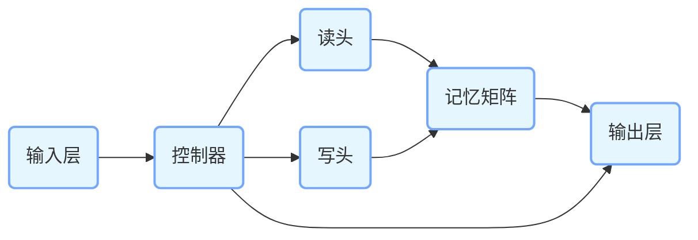

# 基于记忆增强网络的长期依赖推理在地质年代预测中的创新

> 关键词：记忆增强网络；长期依赖推理；地质年代预测；深度学习；数据挖掘

> 摘要：本文聚焦于基于记忆增强网络的长期依赖推理在地质年代预测中的创新应用。首先介绍了地质年代预测的背景和重要性，阐述了传统方法在处理长期依赖关系时的局限性。然后详细解释了记忆增强网络的核心概念和架构，包括其如何实现长期依赖推理。接着探讨了核心算法原理，并用Python代码进行了详细阐述。通过数学模型和公式进一步分析其原理，并结合实际案例说明。在项目实战部分，搭建了开发环境，给出源代码实现和详细解读。同时，分析了该技术在地质年代预测中的实际应用场景，推荐了相关的学习资源、开发工具框架和论文著作。最后总结了未来发展趋势与挑战，解答了常见问题，并提供了扩展阅读和参考资料。

## 1. 背景介绍 

### 1.1 目的和范围
地质年代预测是地质学研究中的关键问题，准确的地质年代信息对于理解地球的演化历史、矿产资源勘探等具有重要意义。传统的地质年代预测方法主要基于化石记录、放射性测年等技术，但这些方法存在一定的局限性，如数据获取困难、对长期地质过程的依赖关系处理能力不足等。本文旨在探讨记忆增强网络在地质年代预测中的应用，通过长期依赖推理来提高地质年代预测的准确性和可靠性。

本文的范围涵盖了记忆增强网络的基本原理、核心算法、数学模型，以及在地质年代预测中的实际应用。通过理论分析和项目实战，展示了该技术在地质年代预测领域的创新之处。

### 1.2 预期读者
本文的预期读者包括地质学研究人员、计算机科学领域的研究者、对深度学习在地质学中应用感兴趣的学生和专业人士。对于地质学研究人员，本文可以为他们提供新的技术思路和方法，帮助他们更准确地进行地质年代预测；对于计算机科学领域的研究者，本文可以展示深度学习技术在地质学中的具体应用场景，促进跨学科研究的发展；对于学生和专业人士，本文可以作为学习和了解相关领域知识的参考资料。

### 1.3 文档结构概述
本文共分为十个部分。第一部分为背景介绍，包括目的和范围、预期读者、文档结构概述和术语表。第二部分介绍核心概念与联系，阐述记忆增强网络的原理和架构，并给出文本示意图和Mermaid流程图。第三部分讲解核心算法原理和具体操作步骤，使用Python源代码进行详细阐述。第四部分介绍数学模型和公式，并进行详细讲解和举例说明。第五部分为项目实战，包括开发环境搭建、源代码详细实现和代码解读。第六部分分析实际应用场景。第七部分推荐相关的工具和资源，包括学习资源、开发工具框架和论文著作。第八部分总结未来发展趋势与挑战。第九部分为附录，解答常见问题。第十部分提供扩展阅读和参考资料。

### 1.4 术语表
#### 1.4.1 核心术语定义
- **记忆增强网络（Memory Augmented Neural Network, MANN）**：一种结合了神经网络和外部记忆模块的深度学习模型，能够有效地处理长期依赖关系。
- **长期依赖推理**：指的是在处理序列数据时，能够捕捉到数据中相隔较远的元素之间的依赖关系。
- **地质年代预测**：根据地质数据（如岩石样本、化石记录等）来推断地质事件发生的年代。

#### 1.4.2 相关概念解释
- **深度学习**：一种基于人工神经网络的机器学习方法，通过多层神经网络来学习数据的特征和模式。
- **序列数据**：按照时间或其他顺序排列的数据，如地质数据中的地层序列。
- **外部记忆模块**：在记忆增强网络中，用于存储和检索信息的模块，能够帮助网络处理长期依赖关系。

#### 1.4.3 缩略词列表
- **MANN**：Memory Augmented Neural Network（记忆增强网络）
- **LSTM**：Long Short-Term Memory（长短期记忆网络）
- **GRU**：Gated Recurrent Unit（门控循环单元）

## 2. 核心概念与联系 

### 2.1 记忆增强网络的原理
记忆增强网络（MANN）是一种结合了神经网络和外部记忆模块的深度学习模型。传统的神经网络在处理长期依赖关系时存在一定的局限性，因为它们的记忆能力有限。MANN通过引入外部记忆模块，使得网络能够存储和检索历史信息，从而更好地处理长期依赖关系。

MANN的基本原理是在传统神经网络的基础上，增加一个外部记忆矩阵 $M$ 和一组读写头。读写头用于对记忆矩阵进行读写操作，网络可以根据当前输入和历史信息来选择读写头的操作，从而实现对记忆矩阵的动态更新和信息检索。

### 2.2 记忆增强网络的架构
记忆增强网络的架构主要包括以下几个部分：
- **输入层**：接收原始的输入数据，如地质数据中的地层特征、化石信息等。
- **控制器**：通常由一个神经网络组成，用于处理输入数据，并生成读写头的控制信号。
- **读写头**：包括读头和写头，读头用于从记忆矩阵中读取信息，写头用于向记忆矩阵中写入信息。
- **记忆矩阵**：用于存储历史信息，是MANN的核心组件之一。
- **输出层**：根据控制器的输出和从记忆矩阵中读取的信息，生成最终的输出结果，如地质年代预测值。

### 2.3 文本示意图
下面是记忆增强网络的文本示意图：

```plaintext
输入层 --> 控制器 --> 读写头 --> 记忆矩阵
                            |
                            v
                          输出层
```

### 2.4 Mermaid流程图


## 3. 核心算法原理 & 具体操作步骤 

### 3.1 核心算法原理
记忆增强网络的核心算法主要包括读写头的操作和记忆矩阵的更新。下面分别介绍读头和写头的操作原理。

#### 读头操作
读头用于从记忆矩阵中读取信息。读头的操作可以分为以下几个步骤：
1. 计算读权重 $w_r$：读权重表示读头对记忆矩阵中每个位置的关注程度。读权重的计算通常基于控制器的输出和记忆矩阵的内容，可以使用注意力机制来实现。
2. 根据读权重从记忆矩阵中读取信息：读头根据读权重对记忆矩阵中的每个位置进行加权求和，得到读取的信息 $r$。

读权重的计算公式如下：
$$w_{r,i} = \frac{\exp(\text{sim}(k_r, M_i))}{\sum_{j=1}^N \exp(\text{sim}(k_r, M_j))}$$
其中，$w_{r,i}$ 表示读头对记忆矩阵中第 $i$ 个位置的读权重，$k_r$ 是读头的查询向量，$M_i$ 是记忆矩阵中第 $i$ 个位置的向量，$\text{sim}$ 是相似度函数，通常使用余弦相似度。

读取的信息 $r$ 的计算公式如下：
$$r = \sum_{i=1}^N w_{r,i} M_i$$

#### 写头操作
写头用于向记忆矩阵中写入信息。写头的操作可以分为以下几个步骤：
1. 计算写权重 $w_w$：写权重表示写头对记忆矩阵中每个位置的更新程度。写权重的计算方法与读权重类似，也可以使用注意力机制。
2. 计算擦除向量 $e$ 和添加向量 $a$：擦除向量用于擦除记忆矩阵中某些位置的信息，添加向量用于向记忆矩阵中添加新的信息。
3. 根据写权重、擦除向量和添加向量更新记忆矩阵：写头根据写权重对记忆矩阵中的每个位置进行更新，先使用擦除向量擦除部分信息，再使用添加向量添加新的信息。

写权重的计算公式与读权重类似：
$$w_{w,i} = \frac{\exp(\text{sim}(k_w, M_i))}{\sum_{j=1}^N \exp(\text{sim}(k_w, M_j))}$$
其中，$w_{w,i}$ 表示写头对记忆矩阵中第 $i$ 个位置的写权重，$k_w$ 是写头的查询向量。

擦除向量 $e$ 和添加向量 $a$ 的计算公式如下：
$$e = \sigma(g_e)$$
$$a = g_a$$
其中，$g_e$ 和 $g_a$ 是控制器的输出，$\sigma$ 是 sigmoid 函数。

记忆矩阵的更新公式如下：
$$M_{i} \leftarrow M_{i} \odot (1 - w_{w,i} e) + w_{w,i} a$$
其中，$\odot$ 表示逐元素相乘。

### 3.2 具体操作步骤
下面是使用记忆增强网络进行地质年代预测的具体操作步骤：
1. **数据预处理**：对地质数据进行清洗、归一化等预处理操作，将数据转换为适合网络输入的格式。
2. **模型初始化**：初始化记忆增强网络的参数，包括控制器的权重、记忆矩阵的初始值等。
3. **训练模型**：使用训练数据对记忆增强网络进行训练，通过反向传播算法更新网络的参数，使得网络的输出尽可能接近真实的地质年代标签。
4. **模型评估**：使用测试数据对训练好的模型进行评估，计算模型的预测准确率、误差等指标。
5. **预测地质年代**：使用训练好的模型对新的地质数据进行预测，得到地质年代的预测值。

### 3.3 Python源代码实现
下面是一个使用Python和PyTorch实现的简单记忆增强网络的示例代码：

```python
import torch
import torch.nn as nn
import torch.nn.functional as F

# 定义记忆增强网络
class MemoryAugmentedNeuralNetwork(nn.Module):
    def __init__(self, input_size, hidden_size, memory_size, memory_dim):
        super(MemoryAugmentedNeuralNetwork, self).__init__()
        self.controller = nn.LSTM(input_size, hidden_size)
        self.read_head = nn.Linear(hidden_size, memory_dim)
        self.write_head = nn.Linear(hidden_size, memory_dim * 2)
        self.memory = torch.randn(memory_size, memory_dim)
        self.output_layer = nn.Linear(hidden_size + memory_dim, 1)

    def forward(self, x):
        # 控制器处理输入
        output, _ = self.controller(x)
        last_output = output[-1]

        # 读头操作
        read_key = self.read_head(last_output)
        read_weights = F.softmax(torch.matmul(read_key, self.memory.t()), dim=1)
        read_info = torch.matmul(read_weights, self.memory)

        # 写头操作
        write_output = self.write_head(last_output)
        erase_vector = torch.sigmoid(write_output[:, :self.memory.size(1)])
        add_vector = write_output[:, self.memory.size(1):]
        write_weights = F.softmax(torch.matmul(read_key, self.memory.t()), dim=1)
        self.memory = self.memory * (1 - write_weights.unsqueeze(2) * erase_vector.unsqueeze(1)) + write_weights.unsqueeze(2) * add_vector.unsqueeze(1)

        # 输出层
        combined_output = torch.cat((last_output, read_info), dim=1)
        final_output = self.output_layer(combined_output)
        return final_output

# 示例使用
input_size = 10
hidden_size = 20
memory_size = 30
memory_dim = 15
model = MemoryAugmentedNeuralNetwork(input_size, hidden_size, memory_size, memory_dim)
input_data = torch.randn(5, 1, input_size)  # 输入序列长度为5，批量大小为1
output = model(input_data)
print(output)
```

## 4. 数学模型和公式 & 详细讲解 & 举例说明 

### 4.1 数学模型和公式
#### 控制器模型
控制器通常使用循环神经网络（如LSTM或GRU）来处理输入序列。LSTM的数学模型如下：

输入门：
$$i_t = \sigma(W_{ii} x_t + W_{hi} h_{t-1} + b_i)$$

遗忘门：
$$f_t = \sigma(W_{if} x_t + W_{hf} h_{t-1} + b_f)$$

细胞状态更新：
$$C_t = f_t \odot C_{t-1} + i_t \odot \tanh(W_{ic} x_t + W_{hc} h_{t-1} + b_c)$$

输出门：
$$o_t = \sigma(W_{io} x_t + W_{ho} h_{t-1} + b_o)$$

隐藏状态更新：
$$h_t = o_t \odot \tanh(C_t)$$

其中，$x_t$ 是当前时刻的输入，$h_{t-1}$ 是上一时刻的隐藏状态，$C_{t-1}$ 是上一时刻的细胞状态，$W$ 是权重矩阵，$b$ 是偏置向量，$\sigma$ 是 sigmoid 函数，$\tanh$ 是双曲正切函数。

#### 读写头模型
读头和写头的操作已经在前面介绍过，其数学公式如下：

读权重：
$$w_{r,i} = \frac{\exp(\text{sim}(k_r, M_i))}{\sum_{j=1}^N \exp(\text{sim}(k_r, M_j))}$$

读取的信息：
$$r = \sum_{i=1}^N w_{r,i} M_i$$

写权重：
$$w_{w,i} = \frac{\exp(\text{sim}(k_w, M_i))}{\sum_{j=1}^N \exp(\text{sim}(k_w, M_j))}$$

擦除向量：
$$e = \sigma(g_e)$$

添加向量：
$$a = g_a$$

记忆矩阵更新：
$$M_{i} \leftarrow M_{i} \odot (1 - w_{w,i} e) + w_{w,i} a$$

### 4.2 详细讲解
#### 控制器模型
控制器的作用是处理输入序列，并生成读写头的控制信号。LSTM通过输入门、遗忘门、细胞状态更新和输出门来控制信息的流动，能够有效地处理长期依赖关系。输入门决定了当前输入信息的多少，遗忘门决定了上一时刻细胞状态的保留程度，细胞状态更新将输入信息和上一时刻的细胞状态进行融合，输出门决定了当前时刻的隐藏状态。

#### 读写头模型
读头通过计算读权重来选择从记忆矩阵中读取哪些信息，读权重表示读头对记忆矩阵中每个位置的关注程度。写头通过计算写权重、擦除向量和添加向量来更新记忆矩阵，擦除向量用于擦除记忆矩阵中某些位置的信息，添加向量用于向记忆矩阵中添加新的信息。

### 4.3 举例说明
假设我们有一个地质数据序列，每个数据点包含10个特征。我们使用一个记忆增强网络来预测地质年代。控制器使用LSTM，隐藏层大小为20，记忆矩阵的大小为30，每个记忆单元的维度为15。

在某一时刻，输入数据 $x_t$ 的维度为 $1 \times 10$，上一时刻的隐藏状态 $h_{t-1}$ 的维度为 $1 \times 20$。控制器通过LSTM计算得到当前时刻的隐藏状态 $h_t$。

读头根据 $h_t$ 生成查询向量 $k_r$，并计算读权重 $w_r$。假设记忆矩阵 $M$ 的维度为 $30 \times 15$，则读权重 $w_r$ 的维度为 $1 \times 30$。读头根据读权重从记忆矩阵中读取信息 $r$，$r$ 的维度为 $1 \times 15$。

写头根据 $h_t$ 生成查询向量 $k_w$，并计算写权重 $w_w$。同时，写头生成擦除向量 $e$ 和添加向量 $a$，它们的维度都为 $1 \times 15$。写头根据写权重、擦除向量和添加向量更新记忆矩阵 $M$。

最后，控制器的输出 $h_t$ 和读取的信息 $r$ 被拼接在一起，输入到输出层，得到地质年代的预测值。

## 5. 项目实战：代码实际案例和详细解释说明 

### 5.1 开发环境搭建
#### 安装Python和PyTorch
首先，确保你已经安装了Python 3.x。可以从Python官方网站（https://www.python.org/downloads/）下载并安装Python。

然后，安装PyTorch。根据你的操作系统和CUDA版本，选择合适的安装命令。可以参考PyTorch官方网站（https://pytorch.org/get-started/locally/）的安装指南。

#### 安装其他依赖库
除了PyTorch，还需要安装一些其他的依赖库，如NumPy、Pandas、Scikit-learn等。可以使用以下命令进行安装：
```sh
pip install numpy pandas scikit-learn
```

### 5.2 源代码详细实现和代码解读
下面是一个完整的基于记忆增强网络的地质年代预测项目的源代码：

```python
import torch
import torch.nn as nn
import torch.optim as optim
import numpy as np
import pandas as pd
from sklearn.model_selection import train_test_split
from sklearn.preprocessing import StandardScaler

# 定义记忆增强网络
class MemoryAugmentedNeuralNetwork(nn.Module):
    def __init__(self, input_size, hidden_size, memory_size, memory_dim):
        super(MemoryAugmentedNeuralNetwork, self).__init__()
        self.controller = nn.LSTM(input_size, hidden_size)
        self.read_head = nn.Linear(hidden_size, memory_dim)
        self.write_head = nn.Linear(hidden_size, memory_dim * 2)
        self.memory = torch.randn(memory_size, memory_dim)
        self.output_layer = nn.Linear(hidden_size + memory_dim, 1)

    def forward(self, x):
        # 控制器处理输入
        output, _ = self.controller(x)
        last_output = output[-1]

        # 读头操作
        read_key = self.read_head(last_output)
        read_weights = torch.softmax(torch.matmul(read_key, self.memory.t()), dim=1)
        read_info = torch.matmul(read_weights, self.memory)

        # 写头操作
        write_output = self.write_head(last_output)
        erase_vector = torch.sigmoid(write_output[:, :self.memory.size(1)])
        add_vector = write_output[:, self.memory.size(1):]
        write_weights = torch.softmax(torch.matmul(read_key, self.memory.t()), dim=1)
        self.memory = self.memory * (1 - write_weights.unsqueeze(2) * erase_vector.unsqueeze(1)) + write_weights.unsqueeze(2) * add_vector.unsqueeze(1)

        # 输出层
        combined_output = torch.cat((last_output, read_info), dim=1)
        final_output = self.output_layer(combined_output)
        return final_output

# 数据加载和预处理
def load_data(file_path):
    data = pd.read_csv(file_path)
    X = data.drop('age', axis=1).values
    y = data['age'].values
    X_train, X_test, y_train, y_test = train_test_split(X, y, test_size=0.2, random_state=42)
    scaler = StandardScaler()
    X_train = scaler.fit_transform(X_train)
    X_test = scaler.transform(X_test)
    X_train = torch.tensor(X_train, dtype=torch.float32).unsqueeze(1)
    X_test = torch.tensor(X_test, dtype=torch.float32).unsqueeze(1)
    y_train = torch.tensor(y_train, dtype=torch.float32).unsqueeze(1)
    y_test = torch.tensor(y_test, dtype=torch.float32).unsqueeze(1)
    return X_train, X_test, y_train, y_test

# 训练模型
def train_model(model, X_train, y_train, epochs, lr):
    criterion = nn.MSELoss()
    optimizer = optim.Adam(model.parameters(), lr=lr)
    for epoch in range(epochs):
        optimizer.zero_grad()
        outputs = model(X_train)
        loss = criterion(outputs, y_train)
        loss.backward()
        optimizer.step()
        if (epoch + 1) % 10 == 0:
            print(f'Epoch [{epoch+1}/{epochs}], Loss: {loss.item():.4f}')
    return model

# 评估模型
def evaluate_model(model, X_test, y_test):
    model.eval()
    with torch.no_grad():
        outputs = model(X_test)
        loss = nn.MSELoss()(outputs, y_test)
        print(f'Test Loss: {loss.item():.4f}')

# 主函数
def main():
    file_path = 'geological_data.csv'
    X_train, X_test, y_train, y_test = load_data(file_path)
    input_size = X_train.size(2)
    hidden_size = 20
    memory_size = 30
    memory_dim = 15
    model = MemoryAugmentedNeuralNetwork(input_size, hidden_size, memory_size, memory_dim)
    epochs = 100
    lr = 0.001
    model = train_model(model, X_train, y_train, epochs, lr)
    evaluate_model(model, X_test, y_test)

if __name__ == '__main__':
    main()
```

### 5.3 代码解读与分析
#### 数据加载和预处理
`load_data` 函数用于加载地质数据，并进行预处理。首先，使用Pandas读取CSV文件，然后将数据分为特征和标签。接着，使用 `train_test_split` 函数将数据分为训练集和测试集。最后，使用 `StandardScaler` 对数据进行归一化处理，并将数据转换为PyTorch张量。

#### 记忆增强网络定义
`MemoryAugmentedNeuralNetwork` 类定义了记忆增强网络的结构。控制器使用LSTM，读头和写头分别使用线性层，记忆矩阵初始化为随机张量，输出层使用线性层将控制器的输出和读取的信息拼接在一起，得到最终的输出。

#### 训练模型
`train_model` 函数用于训练记忆增强网络。使用均方误差损失函数（MSE）和Adam优化器进行训练。在每个epoch中，计算模型的输出和损失，然后进行反向传播和参数更新。

#### 评估模型
`evaluate_model` 函数用于评估训练好的模型。在评估过程中，使用测试数据计算模型的损失。

#### 主函数
`main` 函数是程序的入口点，调用上述函数完成数据加载、模型训练和评估的整个过程。

## 6. 实际应用场景 
### 6.1 地质勘探
在地质勘探中，准确的地质年代信息对于确定矿产资源的分布和储量具有重要意义。基于记忆增强网络的长期依赖推理可以处理地质数据中的长期依赖关系，提高地质年代预测的准确性，从而为地质勘探提供更可靠的依据。

### 6.2 地球演化研究
地球的演化是一个漫长的过程，涉及到多个地质年代的变化。通过对地质年代的准确预测，可以更好地理解地球的演化历史，研究地球的构造运动、气候变化等问题。

### 6.3 古生物学研究
古生物学研究依赖于准确的地质年代信息来确定化石的年代和演化关系。记忆增强网络可以帮助古生物学家更准确地预测地质年代，从而更好地研究生物的演化过程。

## 7. 工具和资源推荐

### 7.1 学习资源推荐
#### 7.1.1 书籍推荐
- 《深度学习》（Deep Learning）：由Ian Goodfellow、Yoshua Bengio和Aaron Courville编写，是深度学习领域的经典教材，涵盖了深度学习的基本原理、算法和应用。
- 《Python深度学习》（Deep Learning with Python）：由Francois Chollet编写，介绍了如何使用Python和Keras进行深度学习开发，适合初学者。
- 《神经网络与深度学习》（Neural Networks and Deep Learning）：由Michael Nielsen编写，免费在线书籍，详细介绍了神经网络和深度学习的基本概念和算法。

#### 7.1.2 在线课程
- Coursera上的“深度学习专项课程”（Deep Learning Specialization）：由Andrew Ng教授讲授，包括五门课程，涵盖了深度学习的各个方面。
- edX上的“使用Python进行深度学习”（Deep Learning with Python）：介绍了如何使用Python和TensorFlow进行深度学习开发。
- Udemy上的“完整的深度学习课程”（The Complete Deep Learning Course）：提供了丰富的深度学习实践案例和项目。

#### 7.1.3 技术博客和网站
- Medium：有许多深度学习领域的优秀博客文章，如Towards Data Science、Machine Learning Mastery等。
- arXiv：提供了最新的学术论文和研究成果，是了解深度学习前沿技术的重要渠道。
- Kaggle：是一个数据科学竞赛平台，有许多关于深度学习的数据集和竞赛项目，可以通过参与竞赛来提高自己的实践能力。

### 7.2 开发工具框架推荐
#### 7.2.1 IDE和编辑器
- PyCharm：是一款专门为Python开发设计的集成开发环境，具有强大的代码编辑、调试和代码分析功能。
- Jupyter Notebook：是一个交互式的开发环境，适合进行数据探索和模型实验。
- Visual Studio Code：是一款轻量级的代码编辑器，支持多种编程语言和插件，可用于深度学习开发。

#### 7.2.2 调试和性能分析工具
- PyTorch Profiler：是PyTorch自带的性能分析工具，可以帮助开发者分析模型的运行时间和内存使用情况。
- TensorBoard：是TensorFlow的可视化工具，也可以用于PyTorch模型的可视化和调试。
- NVIDIA Nsight Systems：是NVIDIA提供的性能分析工具，可用于GPU加速的深度学习模型的性能优化。

#### 7.2.3 相关框架和库
- PyTorch：是一个开源的深度学习框架，具有动态图、易于使用等优点，广泛应用于学术界和工业界。
- TensorFlow：是另一个流行的深度学习框架，具有强大的分布式训练和部署能力。
- Scikit-learn：是一个用于机器学习的Python库，提供了丰富的机器学习算法和工具，可用于数据预处理、模型评估等。

### 7.3 相关论文著作推荐
#### 7.3.1 经典论文
- "Memory Networks"（2014）：介绍了记忆网络的基本概念和架构，是记忆增强网络的先驱。
- "Neural Turing Machines"（2014）：提出了神经图灵机的概念，将外部记忆模块引入神经网络。
- "Show, Attend and Tell: Neural Image Caption Generation with Visual Attention"（2015）：介绍了注意力机制在图像描述生成中的应用，对记忆增强网络的发展有重要影响。

#### 7.3.2 最新研究成果
- 关注顶级学术会议如NeurIPS、ICML、CVPR等的论文，了解记忆增强网络在地质年代预测等领域的最新研究进展。
- 查阅相关的学术期刊如Journal of Artificial Intelligence Research、Artificial Intelligence等，获取最新的研究成果。

#### 7.3.3 应用案例分析
- 一些地质学期刊如Geology、Journal of Geophysical Research等可能会发表关于地质年代预测的应用案例，可从中学习记忆增强网络在实际地质研究中的应用。

## 8. 总结：未来发展趋势与挑战
### 8.1 未来发展趋势
#### 多模态数据融合
未来，基于记忆增强网络的地质年代预测可能会融合更多的多模态数据，如地质图像、地球物理数据等。通过融合不同类型的数据，可以获取更全面的地质信息，提高地质年代预测的准确性。

#### 与其他技术的结合
记忆增强网络可能会与其他技术如强化学习、迁移学习等结合，进一步提高模型的性能和泛化能力。例如，使用强化学习来优化记忆增强网络的读写头操作，使用迁移学习来利用其他领域的知识。

#### 智能化地质勘探系统
随着技术的发展，可能会出现智能化的地质勘探系统，将记忆增强网络集成到其中。该系统可以自动采集地质数据、进行地质年代预测，并提供勘探建议，提高地质勘探的效率和准确性。

### 8.2 挑战
#### 数据质量和数量
地质数据的质量和数量对记忆增强网络的性能有重要影响。地质数据的采集和标注往往比较困难，数据质量参差不齐，且数据量有限。如何获取高质量、大规模的地质数据是一个挑战。

#### 模型复杂度和计算资源
记忆增强网络的模型复杂度较高，需要大量的计算资源进行训练和推理。在实际应用中，如何优化模型结构，减少计算资源的需求，是一个需要解决的问题。

#### 解释性和可信赖性
深度学习模型往往缺乏解释性，记忆增强网络也不例外。在地质年代预测等领域，模型的解释性和可信赖性非常重要。如何提高记忆增强网络的解释性，让地质学家能够理解模型的决策过程，是一个挑战。

## 9. 附录：常见问题与解答
### 9.1 记忆增强网络与传统神经网络有什么区别？
传统神经网络在处理长期依赖关系时存在一定的局限性，因为它们的记忆能力有限。记忆增强网络通过引入外部记忆模块，使得网络能够存储和检索历史信息，从而更好地处理长期依赖关系。

### 9.2 如何选择记忆增强网络的参数？
记忆增强网络的参数包括控制器的隐藏层大小、记忆矩阵的大小和维度等。这些参数的选择通常需要通过实验来确定。可以使用交叉验证等方法来选择最优的参数组合。

### 9.3 记忆增强网络在地质年代预测中的准确性如何？
记忆增强网络在地质年代预测中的准确性取决于多种因素，如数据质量、模型结构和参数等。通过合理选择数据和模型，以及进行适当的训练和调优，记忆增强网络可以取得较好的预测效果。

### 9.4 如何处理地质数据中的噪声和缺失值？
可以使用数据预处理技术来处理地质数据中的噪声和缺失值。例如，使用滤波算法去除噪声，使用插值方法填充缺失值。此外，也可以在模型训练过程中使用正则化技术来提高模型的鲁棒性。

## 10. 扩展阅读 & 参考资料
### 10.1 扩展阅读
- 《人工智能：现代方法》（Artificial Intelligence: A Modern Approach）：全面介绍了人工智能的各个领域，包括机器学习、深度学习等。
- 《深度学习实战》（Deep Learning in Practice）：提供了大量的深度学习实践案例和代码实现。
- 《地质年代学原理》（Principles of Geochronology）：详细介绍了地质年代学的基本原理和方法。

### 10.2 参考资料
- Goodfellow, I., Bengio, Y., & Courville, A. (2016). Deep Learning. MIT Press.
- Chollet, F. (2017). Deep Learning with Python. Manning Publications.
- Nielsen, M. A. (2015). Neural Networks and Deep Learning. Determination Press.
- Weston, J., Chopra, S., & Bordes, A. (2014). Memory Networks. arXiv preprint arXiv:1410.3916.
- Graves, A., Wayne, G., & Danihelka, I. (2014). Neural Turing Machines. arXiv preprint arXiv:1410.5401.
- Xu, K., Ba, J. L., Kiros, R., Cho, K., Courville, A., Salakhutdinov, R., ... & Bengio, Y. (2015). Show, Attend and Tell: Neural Image Caption Generation with Visual Attention. arXiv preprint arXiv:1502.03044.