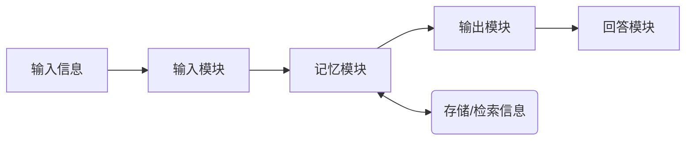

# 基于记忆网络的长期战略规划推理能力增强

> 关键词：记忆网络、长期战略规划、推理能力、人工智能、知识表示、深度强化学习、认知计算

> 摘要：本文聚焦于基于记忆网络的长期战略规划推理能力增强这一核心主题。在当今复杂多变的环境中，无论是在智能机器人决策、企业战略制定还是军事作战规划等领域，长期战略规划推理能力都至关重要。记忆网络作为一种强大的工具，能够有效地存储和利用历史信息，为推理过程提供丰富的知识支持。文章深入探讨了记忆网络的核心概念与原理，详细阐述了相关算法的实现步骤，并通过数学模型进行了理论分析。同时，结合实际项目案例展示了如何运用记忆网络来增强长期战略规划推理能力，还讨论了其实际应用场景。最后，对未来的发展趋势和面临的挑战进行了总结与展望，旨在为相关领域的研究和实践提供全面且深入的参考。

## 1. 背景介绍 
### 1.1 目的和范围
在众多实际应用场景中，如智能交通系统的路线规划、金融投资策略的制定以及复杂工业系统的调度等，都需要进行长期战略规划。然而，传统的推理方法往往难以有效地处理大量的历史信息和复杂的环境变化，导致规划的准确性和适应性不足。本文的目的在于研究如何利用记忆网络来增强长期战略规划的推理能力，通过对记忆网络的原理、算法和应用进行深入探讨，为提高长期战略规划的质量提供理论和实践指导。本文的范围涵盖了记忆网络的基本概念、核心算法、数学模型、实际应用案例以及相关的工具和资源推荐等方面。

### 1.2 预期读者
本文预期读者包括人工智能、机器学习、控制科学与工程等领域的研究人员和学生，他们希望深入了解记忆网络在长期战略规划推理中的应用原理和方法；也包括企业的技术研发人员和战略规划师，他们希望借鉴记忆网络的相关技术来优化企业的决策和规划过程；此外，对智能系统和认知计算感兴趣的爱好者也可以从本文中获取相关的知识和启发。

### 1.3 文档结构概述
本文将按照以下结构进行组织：首先介绍记忆网络和长期战略规划推理的背景知识，包括术语表和相关概念的解释；接着详细阐述记忆网络的核心概念与联系，通过文本示意图和 Mermaid 流程图进行说明；然后介绍核心算法原理和具体操作步骤，并使用 Python 源代码进行详细阐述；之后给出数学模型和公式，并进行详细讲解和举例说明；再通过项目实战展示代码实际案例和详细解释；接着讨论记忆网络在长期战略规划推理中的实际应用场景；随后推荐相关的工具和资源；最后总结未来发展趋势与挑战，并提供常见问题与解答以及扩展阅读和参考资料。

### 1.4 术语表
#### 1.4.1 核心术语定义
- **记忆网络**：一种具有记忆组件的神经网络模型，能够存储和检索历史信息，为推理过程提供知识支持。
- **长期战略规划**：在较长时间跨度内，对目标、资源和行动方案进行全面规划和决策的过程。
- **推理能力**：根据已知信息和知识，推导出新的结论和决策的能力。
- **知识表示**：将现实世界中的知识以计算机能够理解和处理的方式进行表示的方法。
- **深度强化学习**：结合深度学习和强化学习的方法，通过智能体与环境的交互来学习最优策略。

#### 1.4.2 相关概念解释
- **认知计算**：模拟人类的认知过程，包括感知、学习、推理和决策等，以实现智能行为的计算方法。
- **图神经网络**：用于处理图结构数据的神经网络模型，能够捕捉数据中的关系和结构信息。
- **注意力机制**：一种能够自动关注输入数据中重要部分的机制，提高模型的学习效率和性能。

#### 1.4.3 缩略词列表
- **DNN**：深度神经网络（Deep Neural Network）
- **RNN**：循环神经网络（Recurrent Neural Network）
- **LSTM**：长短期记忆网络（Long Short - Term Memory Network）
- **DRL**：深度强化学习（Deep Reinforcement Learning）
- **GNN**：图神经网络（Graph Neural Network）

## 2. 核心概念与联系 
### 2.1 记忆网络的原理
记忆网络的核心思想是引入外部记忆组件，用于存储历史信息和知识。传统的神经网络在处理长序列数据时，往往存在信息遗忘和梯度消失的问题，而记忆网络通过记忆组件可以有效地解决这些问题。记忆网络通常由输入模块、记忆模块、输出模块和回答模块组成。输入模块将输入信息进行预处理，转换为适合记忆模块处理的格式；记忆模块负责存储和检索信息；输出模块根据记忆模块中的信息生成中间表示；回答模块根据输出模块的表示生成最终的回答或决策。

### 2.2 长期战略规划推理的本质
长期战略规划推理是一个复杂的决策过程，需要综合考虑多个因素，包括目标、资源、环境变化等。其本质是在不确定的环境中，通过对历史信息和当前状态的分析，预测未来的发展趋势，并制定出最优的行动方案。推理过程涉及到知识的获取、表示、存储和利用，以及对不同方案的评估和选择。

### 2.3 记忆网络与长期战略规划推理的联系
记忆网络为长期战略规划推理提供了强大的知识支持。通过记忆模块，记忆网络可以存储大量的历史信息，包括过去的决策、环境变化和结果等。在推理过程中，记忆网络可以根据当前的状态和目标，从记忆模块中检索相关的信息，为决策提供依据。同时，记忆网络还可以通过学习和更新记忆模块中的信息，不断提高推理的准确性和适应性。

### 2.4 文本示意图
记忆网络的基本架构可以用以下文本示意图表示：

输入信息 -> 输入模块 -> 记忆模块（存储和检索信息） -> 输出模块（生成中间表示） -> 回答模块（生成最终决策）

### 2.5 Mermaid 流程图


## 3. 核心算法原理 & 具体操作步骤 
### 3.1 记忆网络的基本算法
记忆网络的基本算法包括信息存储、信息检索和推理三个主要步骤。以下是使用 Python 实现的简单示例：

```python
import numpy as np

# 定义记忆模块
class MemoryModule:
    def __init__(self, capacity):
        self.capacity = capacity
        self.memory = []

    def store(self, information):
        if len(self.memory) >= self.capacity:
            self.memory.pop(0)  # 移除最早的信息
        self.memory.append(information)

    def retrieve(self, query):
        # 简单的检索方法，这里使用相似度匹配
        similarities = []
        for info in self.memory:
            similarity = np.dot(query, info) / (np.linalg.norm(query) * np.linalg.norm(info))
            similarities.append(similarity)
        max_index = np.argmax(similarities)
        return self.memory[max_index]

# 定义输入模块
class InputModule:
    def preprocess(self, input_info):
        # 简单的预处理，这里将输入信息转换为向量
        return np.array(input_info)

# 定义输出模块
class OutputModule:
    def generate_representation(self, retrieved_info):
        # 简单的生成中间表示，这里直接返回检索到的信息
        return retrieved_info

# 定义回答模块
class AnswerModule:
    def generate_answer(self, representation):
        # 简单的生成最终回答，这里直接返回中间表示
        return representation

# 示例使用
memory = MemoryModule(capacity=3)
input_module = InputModule()
output_module = OutputModule()
answer_module = AnswerModule()

# 存储信息
info1 = [1, 2, 3]
info2 = [4, 5, 6]
info3 = [7, 8, 9]
memory.store(input_module.preprocess(info1))
memory.store(input_module.preprocess(info2))
memory.store(input_module.preprocess(info3))

# 查询信息
query = [2, 3, 4]
retrieved_info = memory.retrieve(input_module.preprocess(query))
representation = output_module.generate_representation(retrieved_info)
answer = answer_module.generate_answer(representation)

print("Answer:", answer)
```

### 3.2 具体操作步骤
1. **信息存储**：将输入信息经过输入模块的预处理后，存储到记忆模块中。如果记忆模块已满，则移除最早的信息。
2. **信息检索**：当需要进行推理时，将查询信息经过输入模块的预处理后，与记忆模块中的信息进行相似度匹配，检索出最相关的信息。
3. **推理过程**：将检索到的信息经过输出模块生成中间表示，再由回答模块根据中间表示生成最终的回答或决策。

### 3.3 算法优化
为了提高记忆网络的性能，可以采用以下优化方法：
- **改进检索算法**：使用更复杂的相似度度量方法，如余弦相似度、欧几里得距离等，提高检索的准确性。
- **引入注意力机制**：在检索过程中，通过注意力机制自动关注记忆模块中重要的信息，提高推理效率。
- **记忆更新策略**：定期更新记忆模块中的信息，删除过时的信息，添加新的信息，保持记忆的时效性。

## 4. 数学模型和公式 & 详细讲解 & 举例说明 
### 4.1 信息存储模型
假设记忆模块中存储的信息可以表示为一个向量集合 $\mathcal{M}=\{m_1, m_2, \cdots, m_N\}$，其中 $m_i\in\mathbb{R}^d$ 表示第 $i$ 条信息的向量表示，$d$ 表示向量的维度。输入信息 $x\in\mathbb{R}^d$ 经过输入模块的预处理后，存储到记忆模块中。如果记忆模块已满，即 $N\geq C$（$C$ 为记忆模块的容量），则移除最早的信息。

### 4.2 信息检索模型
信息检索过程可以通过相似度度量来实现。常用的相似度度量方法包括余弦相似度和欧几里得距离。

- **余弦相似度**：对于查询信息 $q\in\mathbb{R}^d$ 和记忆模块中的信息 $m_i\in\mathbb{R}^d$，余弦相似度定义为：
$$\text{sim}(q, m_i)=\frac{q\cdot m_i}{\|q\|\|m_i\|}$$
其中 $\cdot$ 表示向量的点积，$\|\cdot\|$ 表示向量的模。

- **欧几里得距离**：欧几里得距离定义为：
$$\text{dist}(q, m_i)=\sqrt{\sum_{j = 1}^{d}(q_j - m_{ij})^2}$$
其中 $q_j$ 和 $m_{ij}$ 分别表示 $q$ 和 $m_i$ 的第 $j$ 个分量。

### 4.3 推理模型
推理过程可以表示为一个函数 $f:\mathbb{R}^d\rightarrow\mathbb{R}^k$，其中 $k$ 表示输出的维度。假设检索到的信息为 $m_{retrieved}\in\mathbb{R}^d$，则推理结果 $y\in\mathbb{R}^k$ 可以表示为：
$$y = f(m_{retrieved})$$

### 4.4 举例说明
假设记忆模块中存储了以下三条信息：
$$m_1=[1, 2, 3], m_2=[4, 5, 6], m_3=[7, 8, 9]$$
查询信息为 $q=[2, 3, 4]$。

- **余弦相似度计算**：
$$\text{sim}(q, m_1)=\frac{[2, 3, 4]\cdot[1, 2, 3]}{\|[2, 3, 4]\|\|[1, 2, 3]\|}=\frac{2\times1 + 3\times2+4\times3}{\sqrt{2^2 + 3^2+4^2}\sqrt{1^2 + 2^2+3^2}}\approx0.99$$
$$\text{sim}(q, m_2)=\frac{[2, 3, 4]\cdot[4, 5, 6]}{\|[2, 3, 4]\|\|[4, 5, 6]\|}\approx0.98$$
$$\text{sim}(q, m_3)=\frac{[2, 3, 4]\cdot[7, 8, 9]}{\|[2, 3, 4]\|\|[7, 8, 9]\|}\approx0.97$$

由于 $\text{sim}(q, m_1)$ 最大，所以检索到的信息为 $m_1$。

- **推理过程**：假设推理函数 $f(x)=2x$，则推理结果为 $y = f(m_1)=[2, 4, 6]$。

## 5. 项目实战：代码实际案例和详细解释说明 
### 5.1  开发环境搭建
在进行基于记忆网络的长期战略规划推理项目实战之前，需要搭建相应的开发环境。以下是具体的步骤：

- **安装 Python**：建议使用 Python 3.7 及以上版本，可以从 Python 官方网站（https://www.python.org/downloads/）下载并安装。
- **安装必要的库**：使用 `pip` 安装以下库：
```bash
pip install numpy torch matplotlib
```
其中 `numpy` 用于数值计算，`torch` 用于深度学习开发，`matplotlib` 用于数据可视化。

### 5.2  源代码详细实现和代码解读
以下是一个基于 PyTorch 实现的简单记忆网络用于长期战略规划推理的代码示例：

```python
import torch
import torch.nn as nn
import numpy as np
import matplotlib.pyplot as plt

# 定义记忆模块
class MemoryModule(nn.Module):
    def __init__(self, input_dim, memory_size, embedding_dim):
        super(MemoryModule, self).__init__()
        self.input_dim = input_dim
        self.memory_size = memory_size
        self.embedding_dim = embedding_dim
        self.memory = nn.Parameter(torch.randn(memory_size, embedding_dim), requires_grad=False)
        self.input_embedding = nn.Linear(input_dim, embedding_dim)

    def store(self, input_info):
        embedded_info = self.input_embedding(input_info)
        if len(self.memory) >= self.memory_size:
            self.memory.data = torch.cat((self.memory.data[1:], embedded_info.unsqueeze(0)), dim=0)
        else:
            self.memory.data = torch.cat((self.memory.data, embedded_info.unsqueeze(0)), dim=0)

    def retrieve(self, query):
        embedded_query = self.input_embedding(query)
        similarities = torch.matmul(embedded_query, self.memory.t())
        max_index = torch.argmax(similarities)
        return self.memory[max_index]

# 定义推理模块
class ReasoningModule(nn.Module):
    def __init__(self, embedding_dim, output_dim):
        super(ReasoningModule, self).__init__()
        self.fc = nn.Linear(embedding_dim, output_dim)

    def forward(self, retrieved_info):
        output = self.fc(retrieved_info)
        return output

# 定义训练函数
def train(model_memory, model_reasoning, data, target, epochs, lr):
    optimizer = torch.optim.Adam(list(model_memory.parameters()) + list(model_reasoning.parameters()), lr=lr)
    criterion = nn.MSELoss()
    losses = []

    for epoch in range(epochs):
        total_loss = 0
        for i in range(len(data)):
            input_info = torch.tensor(data[i], dtype=torch.float32)
            target_info = torch.tensor(target[i], dtype=torch.float32)

            model_memory.store(input_info)
            retrieved_info = model_memory.retrieve(input_info)
            output = model_reasoning(retrieved_info)

            loss = criterion(output, target_info)
            optimizer.zero_grad()
            loss.backward()
            optimizer.step()

            total_loss += loss.item()

        average_loss = total_loss / len(data)
        losses.append(average_loss)
        print(f'Epoch {epoch + 1}/{epochs}, Loss: {average_loss:.4f}')

    plt.plot(losses)
    plt.xlabel('Epoch')
    plt.ylabel('Loss')
    plt.show()

# 示例数据
data = np.random.randn(100, 5)
target = np.random.randn(100, 3)

# 初始化模型
input_dim = 5
memory_size = 10
embedding_dim = 10
output_dim = 3

model_memory = MemoryModule(input_dim, memory_size, embedding_dim)
model_reasoning = ReasoningModule(embedding_dim, output_dim)

# 训练模型
train(model_memory, model_reasoning, data, target, epochs=100, lr=0.001)
```

### 5.3  代码解读与分析
- **记忆模块（`MemoryModule`）**：该模块负责存储和检索信息。`input_embedding` 层将输入信息转换为嵌入向量，`memory` 是一个可存储信息的张量。`store` 方法将输入信息的嵌入向量存储到记忆中，如果记忆已满，则移除最早的信息。`retrieve` 方法通过计算查询信息的嵌入向量与记忆中信息的相似度，检索出最相关的信息。
- **推理模块（`ReasoningModule`）**：该模块根据检索到的信息进行推理，通过一个全连接层将检索到的信息映射到输出空间。
- **训练函数（`train`）**：该函数使用 Adam 优化器和均方误差损失函数进行训练。在每个 epoch 中，将输入信息存储到记忆中，检索相关信息，进行推理，并计算损失。然后进行反向传播和参数更新。最后绘制训练损失曲线。

## 6. 实际应用场景 
### 6.1 智能机器人决策
在智能机器人的应用中，长期战略规划推理能力至关重要。例如，在机器人的自主导航任务中，机器人需要根据当前的环境信息和目标位置，制定出长期的导航策略。记忆网络可以存储机器人过去的导航经验，包括不同环境下的路径规划、障碍物的分布等信息。在推理过程中，机器人可以根据当前的环境信息从记忆网络中检索相关的经验，从而制定出更合理的导航策略。

### 6.2 企业战略规划
企业在制定长期战略规划时，需要考虑市场趋势、竞争对手的动态、自身的资源和能力等多个因素。记忆网络可以存储企业过去的战略决策及其执行结果，以及市场环境的变化信息。在制定新的战略规划时，企业可以通过记忆网络检索相关的信息，分析不同决策的优缺点，从而制定出更科学、更合理的战略规划。

### 6.3 军事作战规划
在军事作战中，长期战略规划推理能力直接关系到作战的胜负。记忆网络可以存储过去的战争经验、战场环境信息、敌方的战术和策略等。在制定作战计划时，军事指挥官可以通过记忆网络检索相关的信息，预测敌方的行动，制定出更有效的作战策略。

### 6.4 医疗决策支持
在医疗领域，医生在制定治疗方案时需要考虑患者的病史、症状、检查结果等多个因素。记忆网络可以存储大量的病例信息和治疗经验，医生在诊断和治疗过程中可以通过记忆网络检索相关的信息，为治疗方案的制定提供参考，提高治疗的准确性和有效性。

## 7. 工具和资源推荐
### 7.1 学习资源推荐
#### 7.1.1 书籍推荐
- 《深度学习》（Deep Learning）：由 Ian Goodfellow、Yoshua Bengio 和 Aaron Courville 所著，是深度学习领域的经典教材，全面介绍了深度学习的基本原理、算法和应用。
- 《强化学习：原理与Python实现》：详细介绍了强化学习的基本概念、算法和实现方法，通过 Python 代码示例帮助读者更好地理解和应用强化学习。
- 《人工智能：一种现代的方法》（Artificial Intelligence: A Modern Approach）：是人工智能领域的权威教材，涵盖了人工智能的各个方面，包括搜索、知识表示、推理、机器学习等。

#### 7.1.2 在线课程
- Coursera 上的“深度学习专项课程”（Deep Learning Specialization）：由 Andrew Ng 教授授课，系统地介绍了深度学习的理论和实践，包括神经网络、卷积神经网络、循环神经网络等。
- edX 上的“强化学习基础”（Foundations of Reinforcement Learning）：深入讲解了强化学习的基本概念、算法和应用，适合对强化学习感兴趣的读者。
- 哔哩哔哩（B 站）上有许多关于人工智能和深度学习的教学视频，如“李宏毅机器学习”系列课程，讲解生动有趣，易于理解。

#### 7.1.3 技术博客和网站
- Medium：是一个技术博客平台，有许多关于人工智能、机器学习和深度学习的优质文章，作者来自世界各地的技术专家和研究人员。
- arXiv：是一个预印本数据库，提供了大量的最新研究论文，涵盖了人工智能、机器学习、计算机科学等多个领域。
- 机器之心：是一个专注于人工智能领域的科技媒体，提供了丰富的行业资讯、技术文章和研究报告。

### 7.2 开发工具框架推荐
#### 7.2.1 IDE和编辑器
- PyCharm：是一款专门为 Python 开发设计的集成开发环境（IDE），具有代码编辑、调试、版本控制等功能，非常适合开发基于 Python 的人工智能项目。
- Jupyter Notebook：是一个交互式的开发环境，支持多种编程语言，如 Python、R 等。它可以将代码、文本、图表等内容整合在一起，方便进行数据分析和模型开发。
- Visual Studio Code：是一款轻量级的代码编辑器，支持多种编程语言和插件扩展。它具有丰富的代码编辑功能和调试工具，适合快速开发和调试人工智能项目。

#### 7.2.2 调试和性能分析工具
- TensorBoard：是 TensorFlow 提供的一个可视化工具，可以帮助用户可视化模型的训练过程、损失曲线、模型结构等信息，方便进行调试和性能分析。
- PyTorch Profiler：是 PyTorch 提供的一个性能分析工具，可以帮助用户分析模型的性能瓶颈，如计算时间、内存使用等，从而优化模型的性能。
- cProfile：是 Python 标准库中的一个性能分析工具，可以帮助用户分析 Python 代码的性能瓶颈，找出运行时间较长的函数和代码段。

#### 7.2.3 相关框架和库
- PyTorch：是一个开源的深度学习框架，具有动态图和静态图两种模式，支持 GPU 加速，易于使用和扩展。
- TensorFlow：是一个广泛使用的深度学习框架，具有丰富的工具和库，支持分布式训练和模型部署。
- Scikit - learn：是一个用于机器学习的 Python 库，提供了各种机器学习算法和工具，如分类、回归、聚类等，方便进行数据预处理和模型训练。

### 7.3 相关论文著作推荐
#### 7.3.1 经典论文
- “Memory Networks”：由 Jason Weston、Sumit Chopra 和 Antoine Bordes 等人发表，首次提出了记忆网络的概念，为后续的研究奠定了基础。
- “Neural Turing Machines”：由 Alex Graves、Greg Wayne 和 Ivo Danihelka 等人发表，提出了神经图灵机的模型，将记忆机制引入到神经网络中。
- “Attention Is All You Need”：由 Ashish Vaswani 等人发表，提出了 Transformer 模型，引入了注意力机制，在自然语言处理领域取得了巨大的成功。

#### 7.3.2 最新研究成果
- 关注 arXiv 上关于记忆网络、长期战略规划推理和人工智能的最新研究论文，了解该领域的最新进展和研究方向。
- 参加相关的学术会议，如 NeurIPS（神经信息处理系统大会）、ICML（国际机器学习会议）等，获取最新的研究成果和前沿技术。

#### 7.3.3 应用案例分析
- 研究一些实际应用中基于记忆网络的长期战略规划推理的案例，如智能机器人、企业战略规划、军事作战规划等领域的应用案例，了解如何将理论知识应用到实际问题中。

## 8. 总结：未来发展趋势与挑战
### 8.1 未来发展趋势
- **多模态融合**：未来的记忆网络将不仅仅局限于处理文本信息，还将融合图像、语音、视频等多模态信息，以提供更全面、更丰富的知识支持，从而进一步增强长期战略规划推理能力。
- **与其他技术的结合**：记忆网络将与图神经网络、强化学习、认知计算等技术相结合，形成更强大的智能系统。例如，与图神经网络结合可以更好地处理复杂的关系和结构信息，与强化学习结合可以实现更智能的决策和规划。
- **可解释性增强**：随着人工智能技术的广泛应用，模型的可解释性变得越来越重要。未来的记忆网络将更加注重可解释性，通过引入知识图谱、规则推理等方法，使推理过程更加透明和可解释。

### 8.2 面临的挑战
- **大规模数据处理**：随着数据量的不断增加，如何高效地存储和处理大规模的数据是记忆网络面临的一个重要挑战。需要研究更高效的数据存储和检索算法，以提高记忆网络的性能。
- **知识表示和更新**：如何准确地表示现实世界中的知识，并及时更新记忆模块中的信息，是提高记忆网络推理能力的关键。需要研究更有效的知识表示方法和记忆更新策略。
- **计算资源需求**：记忆网络的训练和推理过程通常需要大量的计算资源，尤其是在处理大规模数据和复杂模型时。如何降低计算资源的需求，提高模型的效率，是需要解决的问题之一。

## 9. 附录：常见问题与解答
### 9.1 记忆网络与传统神经网络有什么区别？
传统神经网络在处理长序列数据时，往往存在信息遗忘和梯度消失的问题，而记忆网络通过引入外部记忆组件，可以有效地存储和检索历史信息，为推理过程提供知识支持，从而解决这些问题。

### 9.2 如何选择合适的相似度度量方法？
选择合适的相似度度量方法需要根据具体的应用场景和数据特点来决定。余弦相似度适用于比较向量的方向，常用于文本相似度计算；欧几里得距离适用于比较向量的空间距离，常用于图像和数值数据的相似度计算。

### 9.3 记忆网络的训练过程中需要注意什么？
在记忆网络的训练过程中，需要注意以下几点：
- 合理设置记忆模块的容量，避免记忆过载或信息丢失。
- 选择合适的学习率和优化器，以保证模型的收敛性和稳定性。
- 定期更新记忆模块中的信息，保持记忆的时效性。

### 9.4 如何评估记忆网络的性能？
可以使用以下指标来评估记忆网络的性能：
- **准确率**：衡量模型预测结果与真实结果的一致性程度。
- **召回率**：衡量模型检索到的相关信息的比例。
- **F1 值**：综合考虑准确率和召回率的指标。
- **损失函数值**：衡量模型的训练误差，损失函数值越小，模型的性能越好。

## 10. 扩展阅读 & 参考资料
### 10.1 扩展阅读
- 阅读相关的学术论文和研究报告，深入了解记忆网络和长期战略规划推理的最新研究进展和技术趋势。
- 学习其他相关领域的知识，如知识表示、机器学习、控制理论等，以拓宽自己的知识面和视野。

### 10.2 参考资料
- Weston, J., Chopra, S., & Bordes, A. (2014). Memory Networks. arXiv preprint arXiv:1410.3916.
- Graves, A., Wayne, G., & Danihelka, I. (2014). Neural Turing Machines. arXiv preprint arXiv:1410.5401.
- Vaswani, A., Shazeer, N., Parmar, N., Uszkoreit, J., Jones, L., Gomez, A. N., ... & Polosukhin, I. (2017). Attention Is All You Need. Advances in neural information processing systems, 5998 - 6008.
- Goodfellow, I., Bengio, Y., & Courville, A. (2016). Deep Learning. MIT press.