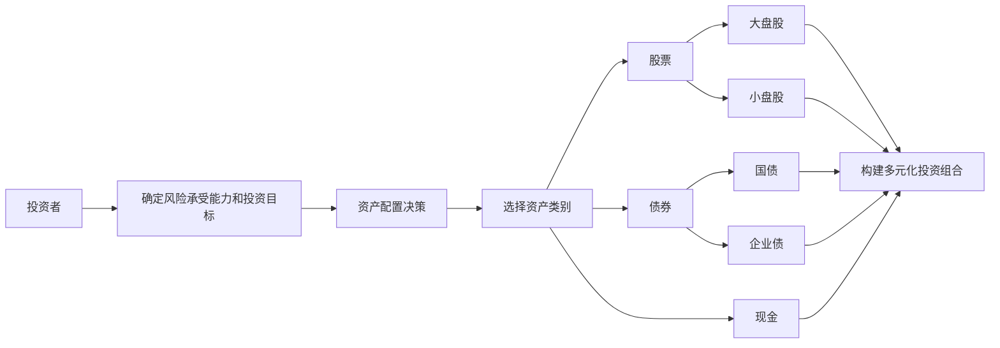

# 多元化投资组合在市场波动中的作用

> 关键词：多元化投资组合、市场波动、风险分散、资产配置、投资回报、相关性、投资策略

> 摘要：本文旨在深入探讨多元化投资组合在市场波动中的重要作用。通过对核心概念、算法原理、数学模型等方面的详细分析，结合实际案例和应用场景，阐述了多元化投资组合如何实现风险分散和优化投资回报。同时，为投资者提供了相关的工具、资源和应对市场波动的策略建议，最后对未来多元化投资组合的发展趋势与挑战进行了总结。

## 1. 背景介绍 
### 1.1 目的和范围
在金融市场中，市场波动是一个常态，其不确定性给投资者带来了诸多挑战。本文章的目的是全面分析多元化投资组合在市场波动环境下的作用机制，帮助投资者理解如何通过合理构建多元化投资组合来降低风险、提高收益。范围涵盖了多元化投资组合的基本概念、理论基础、构建方法、实际应用以及未来发展趋势等方面。

### 1.2 预期读者
本文预期读者包括个人投资者、金融从业者、投资研究人员以及对金融投资领域感兴趣的学生和学者。无论是初涉投资领域的新手，还是经验丰富的专业人士，都能从本文中获取关于多元化投资组合在市场波动中作用的深入见解。

### 1.3 文档结构概述
本文共分为十个部分。第一部分为背景介绍，阐述文章的目的、预期读者和文档结构；第二部分介绍核心概念与联系，包括多元化投资组合、市场波动等概念及其相互关系；第三部分讲解核心算法原理及具体操作步骤，通过 Python 代码展示投资组合优化的算法；第四部分给出数学模型和公式，并详细讲解和举例说明；第五部分是项目实战，包括开发环境搭建、源代码实现和代码解读；第六部分探讨实际应用场景；第七部分推荐相关的工具和资源；第八部分总结未来发展趋势与挑战；第九部分为附录，解答常见问题；第十部分提供扩展阅读和参考资料。

### 1.4 术语表
#### 1.4.1 核心术语定义
- **多元化投资组合**：是指投资者将资金分散投资于不同类型的资产，如股票、债券、基金、房地产等，以降低单一资产波动对整体投资组合的影响。
- **市场波动**：指金融市场中资产价格随时间的上下变动，通常用波动率来衡量。
- **风险分散**：通过投资多种不同的资产，使投资组合的风险低于单个资产风险的加权平均值。
- **资产配置**：根据投资者的风险承受能力、投资目标和市场情况，将资金分配到不同资产类别中的过程。
- **投资回报**：投资者在一定时期内从投资中获得的收益，包括资本利得和股息、利息等收入。

#### 1.4.2 相关概念解释
- **相关性**：衡量两种资产价格变动之间的关联程度。正相关表示两种资产价格变动方向相同，负相关表示变动方向相反，零相关表示两者之间没有明显的关联。
- **有效前沿**：在给定风险水平下，能够提供最高预期回报的投资组合的集合。
- **夏普比率**：衡量投资组合每承担一单位风险所获得的超过无风险收益的额外收益。

#### 1.4.3 缩略词列表
- **CAPM**：资本资产定价模型（Capital Asset Pricing Model）
- **ETF**：交易型开放式指数基金（Exchange-Traded Fund）
- **VAR**：风险价值（Value at Risk）

## 2. 核心概念与联系 

### 核心概念原理
多元化投资组合的核心原理基于现代投资组合理论，该理论由哈里·马科维茨（Harry Markowitz）于 1952 年提出。其基本思想是，通过将资金分散投资于不同资产，利用资产之间的相关性，在不降低预期回报的情况下降低投资组合的风险。

假设投资者有两种资产 $A$ 和 $B$，它们的预期收益率分别为 $E(R_A)$ 和 $E(R_B)$，收益率的方差分别为 $\sigma_A^2$ 和 $\sigma_B^2$，两种资产收益率的协方差为 $\sigma_{AB}$。投资组合的预期收益率 $E(R_p)$ 和方差 $\sigma_p^2$ 可以通过以下公式计算：

设投资于资产 $A$ 的比例为 $w_A$，投资于资产 $B$ 的比例为 $w_B$，且 $w_A + w_B = 1$。

投资组合的预期收益率：
$$E(R_p) = w_A E(R_A) + w_B E(R_B)$$

投资组合的方差：
$$\sigma_p^2 = w_A^2 \sigma_A^2 + w_B^2 \sigma_B^2 + 2 w_A w_B \sigma_{AB}$$

从上述公式可以看出，投资组合的风险不仅取决于单个资产的风险，还取决于资产之间的协方差。当资产之间的协方差为负时，投资组合的风险可以得到有效降低。

### 架构的文本示意图
多元化投资组合的架构可以用以下方式描述：
投资者根据自身的风险承受能力和投资目标，确定资产配置的比例。资产配置涉及多个资产类别，如股票、债券、现金等。每个资产类别又可以进一步细分，例如股票可以分为大盘股、小盘股、成长股、价值股等；债券可以分为国债、企业债、地方债等。通过合理选择不同资产类别和细分资产，并确定它们在投资组合中的权重，构建出多元化投资组合。

### Mermaid 流程图


## 3. 核心算法原理 & 具体操作步骤 

### 核心算法原理
在构建多元化投资组合时，一个重要的目标是在给定风险水平下最大化预期回报，或者在给定预期回报下最小化风险。这可以通过求解投资组合优化问题来实现。常用的方法是使用均值 - 方差优化模型，该模型的目标是最小化投资组合的方差，同时满足预期收益率的约束条件。

设投资组合中有 $n$ 种资产，投资于第 $i$ 种资产的比例为 $w_i$，$i = 1, 2, \cdots, n$，且 $\sum_{i=1}^{n} w_i = 1$。资产的预期收益率向量为 $\mathbf{E}(R) = [E(R_1), E(R_2), \cdots, E(R_n)]^T$，资产收益率的协方差矩阵为 $\mathbf{\Sigma}$。

投资组合的预期收益率为：
$$E(R_p) = \mathbf{w}^T \mathbf{E}(R)$$

投资组合的方差为：
$$\sigma_p^2 = \mathbf{w}^T \mathbf{\Sigma} \mathbf{w}$$

均值 - 方差优化问题可以表述为以下约束优化问题：

$$\min_{\mathbf{w}} \mathbf{w}^T \mathbf{\Sigma} \mathbf{w}$$
$$\text{s.t.} \quad \mathbf{w}^T \mathbf{E}(R) = E(R_{target})$$
$$\sum_{i=1}^{n} w_i = 1$$
$$w_i \geq 0, \quad i = 1, 2, \cdots, n$$

其中，$E(R_{target})$ 是投资者设定的目标预期收益率。

### 具体操作步骤
以下是使用 Python 实现均值 - 方差优化的具体步骤和代码：

```python
import numpy as np
import pandas as pd
from scipy.optimize import minimize

# 示例数据：假设我们有三种资产，其预期收益率和协方差矩阵如下
expected_returns = np.array([0.1, 0.15, 0.2])
cov_matrix = np.array([[0.04, 0.01, 0.02],
                       [0.01, 0.09, 0.03],
                       [0.02, 0.03, 0.16]])

# 目标预期收益率
target_return = 0.12

# 定义目标函数：最小化投资组合的方差
def portfolio_variance(weights, cov_matrix):
    return np.dot(weights.T, np.dot(cov_matrix, weights))

# 定义约束条件
constraints = [{'type': 'eq', 'fun': lambda x: np.sum(x) - 1},  # 权重之和为 1
               {'type': 'eq', 'fun': lambda x: np.dot(x, expected_returns) - target_return}]  # 达到目标预期收益率

# 定义边界条件：权重在 0 到 1 之间
bounds = [(0, 1) for _ in range(len(expected_returns))]

# 初始权重猜测
initial_weights = np.ones(len(expected_returns)) / len(expected_returns)

# 使用 scipy.optimize.minimize 求解优化问题
result = minimize(portfolio_variance, initial_weights, args=(cov_matrix,),
                  method='SLSQP', constraints=constraints, bounds=bounds)

# 最优权重
optimal_weights = result.x

print("最优权重:", optimal_weights)
print("最优投资组合的方差:", portfolio_variance(optimal_weights, cov_matrix))
```

### 代码解释
1. **数据准备**：定义了三种资产的预期收益率 `expected_returns` 和协方差矩阵 `cov_matrix`，以及目标预期收益率 `target_return`。
2. **目标函数**：`portfolio_variance` 函数用于计算投资组合的方差，它接受权重向量和协方差矩阵作为输入。
3. **约束条件**：使用 `constraints` 列表定义了两个约束条件，一个是权重之和为 1，另一个是投资组合的预期收益率达到目标预期收益率。
4. **边界条件**：使用 `bounds` 列表定义了每个资产权重的取值范围在 0 到 1 之间。
5. **初始权重猜测**：`initial_weights` 是初始的权重猜测值，这里将其初始化为等权重。
6. **求解优化问题**：使用 `scipy.optimize.minimize` 函数求解均值 - 方差优化问题，采用 SLSQP 方法。
7. **输出结果**：打印出最优权重和最优投资组合的方差。

## 4. 数学模型和公式 & 详细讲解 & 举例说明 

### 数学模型和公式
#### 投资组合的预期收益率
如前文所述，投资组合的预期收益率是各资产预期收益率的加权平均值。设投资组合中有 $n$ 种资产，投资于第 $i$ 种资产的比例为 $w_i$，第 $i$ 种资产的预期收益率为 $E(R_i)$，则投资组合的预期收益率 $E(R_p)$ 为：
$$E(R_p) = \sum_{i=1}^{n} w_i E(R_i)$$

#### 投资组合的方差
投资组合的方差衡量了投资组合收益率的波动程度，它不仅取决于单个资产的方差，还取决于资产之间的协方差。投资组合的方差 $\sigma_p^2$ 为：
$$\sigma_p^2 = \sum_{i=1}^{n} \sum_{j=1}^{n} w_i w_j \sigma_{ij}$$
其中，$\sigma_{ij}$ 是资产 $i$ 和资产 $j$ 收益率的协方差。当 $i = j$ 时，$\sigma_{ii} = \sigma_i^2$，即资产 $i$ 的方差。

#### 夏普比率
夏普比率是衡量投资组合绩效的一个重要指标，它表示投资组合每承担一单位风险所获得的超过无风险收益的额外收益。夏普比率 $S_p$ 的计算公式为：
$$S_p = \frac{E(R_p) - R_f}{\sigma_p}$$
其中，$E(R_p)$ 是投资组合的预期收益率，$R_f$ 是无风险收益率，$\sigma_p$ 是投资组合的标准差。

### 详细讲解
#### 投资组合的预期收益率
投资组合的预期收益率反映了投资者对投资组合未来收益的预期。通过合理调整各资产的权重，可以实现不同的预期收益率。例如，如果投资者希望提高投资组合的预期收益率，可以增加预期收益率较高的资产的权重，但同时也可能增加投资组合的风险。

#### 投资组合的方差
投资组合的方差是衡量投资组合风险的重要指标。方差越小，投资组合的风险越低。通过选择相关性较低的资产进行组合，可以降低投资组合的方差。例如，当两种资产的收益率呈负相关时，一种资产价格上涨，另一种资产价格下跌，这样可以相互抵消部分波动，从而降低投资组合的整体风险。

#### 夏普比率
夏普比率可以帮助投资者评估投资组合的绩效。夏普比率越高，说明投资组合在承担相同风险的情况下获得的额外收益越高，投资组合的绩效越好。投资者可以通过比较不同投资组合的夏普比率，选择绩效最优的投资组合。

### 举例说明
假设投资者有两种资产 $A$ 和 $B$，资产 $A$ 的预期收益率为 $E(R_A) = 0.1$，标准差为 $\sigma_A = 0.2$；资产 $B$ 的预期收益率为 $E(R_B) = 0.15$，标准差为 $\sigma_B = 0.3$。两种资产收益率的协方差为 $\sigma_{AB} = 0.01$。投资者将资金的 60% 投资于资产 $A$，40% 投资于资产 $B$。

#### 计算投资组合的预期收益率
$$E(R_p) = w_A E(R_A) + w_B E(R_B) = 0.6 \times 0.1 + 0.4 \times 0.15 = 0.12$$

#### 计算投资组合的方差
$$\sigma_p^2 = w_A^2 \sigma_A^2 + w_B^2 \sigma_B^2 + 2 w_A w_B \sigma_{AB}$$
$$= 0.6^2 \times 0.2^2 + 0.4^2 \times 0.3^2 + 2 \times 0.6 \times 0.4 \times 0.01$$
$$= 0.0144 + 0.0144 + 0.0048 = 0.0336$$

投资组合的标准差 $\sigma_p = \sqrt{0.0336} \approx 0.183$。

#### 假设无风险收益率 $R_f = 0.02$，计算夏普比率
$$S_p = \frac{E(R_p) - R_f}{\sigma_p} = \frac{0.12 - 0.02}{0.183} \approx 0.546$$

通过以上计算，我们可以得到该投资组合的预期收益率、方差和夏普比率，从而评估该投资组合的绩效。

## 5. 项目实战：代码实际案例和详细解释说明 

### 5.1  开发环境搭建
#### 安装 Python
首先，需要安装 Python 环境。可以从 Python 官方网站（https://www.python.org/downloads/）下载适合自己操作系统的 Python 安装包，并按照安装向导进行安装。建议安装 Python 3.7 及以上版本。

#### 安装必要的库
在项目中，我们需要使用一些 Python 库，如 `numpy`、`pandas`、`scipy` 等。可以使用 `pip` 命令进行安装：
```sh
pip install numpy pandas scipy
```

### 5.2  源代码详细实现和代码解读
以下是一个更完整的示例，展示如何使用历史数据构建多元化投资组合并进行优化：

```python
import numpy as np
import pandas as pd
import yfinance as yf
from scipy.optimize import minimize

# 定义资产列表
assets = ['AAPL', 'MSFT', 'GOOG', 'AMZN']

# 下载历史数据
start_date = '2020-01-01'
end_date = '2023-01-01'
data = yf.download(assets, start=start_date, end=end_date)['AdjClose']

# 计算每日收益率
returns = data.pct_change().dropna()

# 计算预期收益率和协方差矩阵
expected_returns = returns.mean() * 252  # 年化预期收益率
cov_matrix = returns.cov() * 252  # 年化协方差矩阵

# 目标预期收益率
target_return = 0.15

# 定义目标函数：最小化投资组合的方差
def portfolio_variance(weights, cov_matrix):
    return np.dot(weights.T, np.dot(cov_matrix, weights))

# 定义约束条件
constraints = [{'type': 'eq', 'fun': lambda x: np.sum(x) - 1},  # 权重之和为 1
               {'type': 'eq', 'fun': lambda x: np.dot(x, expected_returns) - target_return}]  # 达到目标预期收益率

# 定义边界条件：权重在 0 到 1 之间
bounds = [(0, 1) for _ in range(len(assets))]

# 初始权重猜测
initial_weights = np.ones(len(assets)) / len(assets)

# 使用 scipy.optimize.minimize 求解优化问题
result = minimize(portfolio_variance, initial_weights, args=(cov_matrix,),
                  method='SLSQP', constraints=constraints, bounds=bounds)

# 最优权重
optimal_weights = result.x

# 打印结果
print("最优权重:")
for i in range(len(assets)):
    print(f"{assets[i]}: {optimal_weights[i]:.4f}")

print("最优投资组合的方差:", portfolio_variance(optimal_weights, cov_matrix))
```

### 代码解读与分析
1. **数据下载**：使用 `yfinance` 库下载指定资产（苹果、微软、谷歌、亚马逊）在指定日期范围内的调整后收盘价数据。
2. **收益率计算**：计算每日收益率，并去除缺失值。然后计算年化预期收益率和年化协方差矩阵。
3. **目标函数和约束条件**：定义目标函数 `portfolio_variance` 用于最小化投资组合的方差，同时定义了权重之和为 1 和达到目标预期收益率的约束条件。
4. **边界条件和初始权重**：定义了每个资产权重的取值范围在 0 到 1 之间，并将初始权重猜测为等权重。
5. **求解优化问题**：使用 `scipy.optimize.minimize` 函数求解均值 - 方差优化问题，采用 SLSQP 方法。
6. **输出结果**：打印出每种资产的最优权重和最优投资组合的方差。

通过这个示例，我们可以看到如何使用历史数据构建多元化投资组合并进行优化，以实现给定目标预期收益率下的最小风险。

## 6. 实际应用场景 
### 个人投资者
对于个人投资者来说，多元化投资组合可以帮助他们降低投资风险，实现资产的稳健增值。例如，一位退休人员可能将资金一部分投资于债券，以获取稳定的利息收入；一部分投资于大盘蓝筹股，以分享股票市场的长期增长；还可以投资一些黄金等避险资产，以应对市场的不确定性。通过这种多元化的投资组合，退休人员可以在保证一定收益的同时，降低投资组合的整体风险。

### 机构投资者
机构投资者，如养老基金、保险公司等，通常管理着大量的资金，对资产的安全性和稳定性要求较高。他们会采用多元化投资策略，将资金分散投资于不同国家、不同行业、不同资产类别的资产。例如，养老基金可能会投资于国内和国际股票市场、债券市场、房地产市场等，以实现资产的长期保值增值。同时，机构投资者还会根据市场情况和经济形势的变化，动态调整投资组合的资产配置，以适应市场波动。

### 基金管理公司
基金管理公司通过发行各种基金产品，为投资者提供多元化的投资选择。例如，混合型基金可以同时投资于股票和债券，根据市场情况调整股票和债券的比例，以实现风险和收益的平衡。指数基金则通过跟踪特定的市场指数，投资于指数成分股，实现广泛的市场覆盖和多元化投资。基金管理公司还会通过深入的研究和分析，选择具有潜力的资产纳入基金组合，以提高基金的绩效。

## 7. 工具和资源推荐
### 7.1 学习资源推荐
#### 7.1.1 书籍推荐
- 《漫步华尔街》（A Random Walk Down Wall Street）：作者是 Burton G. Malkiel，这本书介绍了投资的基本原理和策略，包括多元化投资、资产配置等内容，是投资领域的经典之作。
- 《聪明的投资者》（The Intelligent Investor）：作者是 Benjamin Graham，被誉为价值投资的圣经。书中强调了投资者的理性和风险控制，对多元化投资组合的构建也有重要的指导意义。
- 《投资组合管理：理论与应用》（Portfolio Management: Theory and Application）：作者是 Frank J. Fabozzi 等，该书系统地介绍了投资组合管理的理论和方法，包括均值 - 方差分析、资本资产定价模型等。

#### 7.1.2 在线课程
- Coursera 上的“投资学原理”（Principles of Investing）：该课程由哥伦比亚大学教授授课，介绍了投资的基本概念、资产定价模型和投资组合管理等内容。
- edX 上的“金融市场”（Financial Markets）：由耶鲁大学教授 Robert Shiller 授课，课程涵盖了金融市场的各个方面，包括投资组合理论和风险管理。

#### 7.1.3 技术博客和网站
- 雪球（https://xueqiu.com/）：是国内知名的投资社区，提供股票、基金等投资产品的信息和分析，用户可以在上面交流投资经验和观点。
- Seeking Alpha（https://seekingalpha.com/）：是一个全球知名的金融分析网站，提供大量的股票分析、投资策略和市场评论。

### 7.2 开发工具框架推荐
#### 7.2.1 IDE和编辑器
- PyCharm：是一款专业的 Python 集成开发环境，提供了丰富的代码编辑、调试和分析功能，适合开发投资组合优化等 Python 项目。
- Jupyter Notebook：是一个交互式的开发环境，适合进行数据探索和分析，在投资组合分析中可以方便地进行数据可视化和模型验证。

#### 7.2.2 调试和性能分析工具
- pdb：是 Python 内置的调试器，可以帮助开发者定位和解决代码中的问题。
- cProfile：是 Python 的性能分析工具，可以分析代码的运行时间和函数调用情况，帮助开发者优化代码性能。

#### 7.2.3 相关框架和库
- `numpy`：是 Python 中用于科学计算的基础库，提供了高效的数组操作和数学函数，在投资组合优化中用于处理矩阵和向量运算。
- `pandas`：是 Python 中用于数据处理和分析的库，提供了灵活的数据结构和数据操作方法，在投资组合分析中用于处理历史数据。
- `scipy`：是 Python 中用于科学计算和优化的库，提供了各种优化算法，在投资组合优化中用于求解约束优化问题。

### 7.3 相关论文著作推荐
#### 7.3.1 经典论文
- Markowitz, H. M. (1952). Portfolio Selection. The Journal of Finance, 7(1), 77 - 91. 这篇论文提出了现代投资组合理论，奠定了多元化投资组合的理论基础。
- Sharpe, W. F. (1964). Capital Asset Prices: A Theory of Market Equilibrium under Conditions of Risk. The Journal of Finance, 19(3), 425 - 442. 该论文提出了资本资产定价模型（CAPM），用于解释资产的预期收益率与风险之间的关系。

#### 7.3.2 最新研究成果
- 近年来，随着人工智能和机器学习技术的发展，一些研究开始将这些技术应用于投资组合管理。例如，使用深度学习模型预测资产价格和优化投资组合。可以关注一些顶级金融学术期刊，如 The Journal of Financial Economics、The Review of Financial Studies 等，获取最新的研究成果。

#### 7.3.3 应用案例分析
- 许多金融机构和研究机构会发布投资组合管理的应用案例分析报告。例如，一些大型基金公司会公布其投资策略和投资组合的构建方法，以及在不同市场环境下的绩效表现。可以通过金融机构的官方网站、行业研究报告等渠道获取这些案例分析资料。

## 8. 总结：未来发展趋势与挑战
### 未来发展趋势
#### 智能化投资组合管理
随着人工智能和机器学习技术的不断发展，智能化投资组合管理将成为未来的发展趋势。通过使用深度学习、强化学习等技术，可以更准确地预测资产价格和市场趋势，优化投资组合的构建和调整。例如，一些智能投顾平台已经开始应用这些技术，为投资者提供个性化的投资建议和投资组合管理服务。

#### 绿色投资和可持续投资
随着全球对环境保护和可持续发展的关注度不断提高，绿色投资和可持续投资将成为投资领域的重要方向。投资者越来越倾向于将资金投入到具有良好环境、社会和治理（ESG）表现的企业和项目中。未来，多元化投资组合中绿色资产和可持续资产的比重可能会逐渐增加。

#### 跨境投资和全球资产配置
随着全球经济一体化的发展，跨境投资和全球资产配置将变得更加普遍。投资者可以通过投资不同国家和地区的资产，进一步分散风险，提高投资回报。同时，金融科技的发展也为跨境投资提供了更加便捷的渠道和工具。

### 挑战
#### 数据质量和可靠性
在智能化投资组合管理中，数据是关键。然而，数据质量和可靠性可能会受到多种因素的影响，如数据缺失、数据错误、数据延迟等。如何获取高质量、可靠的数据，并对数据进行有效的清洗和预处理，是智能化投资组合管理面临的一个挑战。

#### 模型的可解释性
人工智能和机器学习模型通常具有较高的复杂度，其决策过程往往难以解释。在投资组合管理中，投资者需要了解模型的决策依据和风险特征。因此，如何提高模型的可解释性，是智能化投资组合管理需要解决的一个重要问题。

#### 市场不确定性和黑天鹅事件
金融市场充满了不确定性，黑天鹅事件（如金融危机、重大自然灾害等）可能会对投资组合造成巨大的冲击。尽管多元化投资组合可以降低风险，但在极端市场情况下，资产之间的相关性可能会发生变化，导致风险分散效果减弱。如何应对市场不确定性和黑天鹅事件，是多元化投资组合管理面临的一个长期挑战。

## 9. 附录：常见问题与解答
### 问题 1：多元化投资组合是否可以完全消除风险？
解答：多元化投资组合不能完全消除风险。它可以通过分散投资降低非系统性风险，即与特定资产或行业相关的风险。但系统性风险，如宏观经济波动、利率变动、政策变化等，是无法通过多元化投资组合消除的。

### 问题 2：如何确定投资组合中各资产的权重？
解答：确定投资组合中各资产的权重可以采用多种方法。常见的方法包括均值 - 方差优化模型，该模型通过求解在给定预期收益率下最小化投资组合方差的问题，得到最优权重。此外，还可以根据投资者的风险承受能力、投资目标和市场情况，采用经验法、风险平价法等方法确定资产权重。

### 问题 3：多元化投资组合的资产数量是否越多越好？
解答：并非资产数量越多越好。当资产数量增加到一定程度时，风险分散的效果会逐渐减弱，同时还会增加管理成本和交易成本。一般来说，选择一定数量的相关性较低的资产进行组合，就可以达到较好的风险分散效果。

### 问题 4：如何评估多元化投资组合的绩效？
解答：可以使用多种指标评估多元化投资组合的绩效，如夏普比率、特雷诺比率、詹森阿尔法等。夏普比率衡量投资组合每承担一单位风险所获得的超过无风险收益的额外收益；特雷诺比率考虑了系统风险；詹森阿尔法衡量投资组合的超额收益。此外，还可以比较投资组合的实际收益率与基准收益率的差异。

## 10. 扩展阅读 & 参考资料
### 扩展阅读
- 《金融炼金术》（The Alchemy of Finance）：作者是 George Soros，书中介绍了作者的投资哲学和交易策略，对理解金融市场的波动和投资组合管理有一定的启示。
- 《非理性繁荣》（Irrational Exuberance）：作者是 Robert J. Shiller，该书探讨了金融市场中的非理性行为和泡沫现象，有助于投资者更好地认识市场风险。

### 参考资料
- Markowitz, H. M. (1952). Portfolio Selection. The Journal of Finance, 7(1), 77 - 91.
- Sharpe, W. F. (1964). Capital Asset Prices: A Theory of Market Equilibrium under Conditions of Risk. The Journal of Finance, 19(3), 425 - 442.
- Fabozzi, F. J., et al. (2007). Portfolio Management: Theory and Application. Wiley.
- 雪球（https://xueqiu.com/）
- Seeking Alpha（https://seekingalpha.com/）