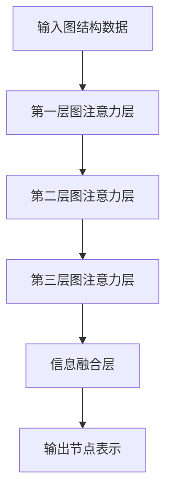

# 多尺度推理中层次图注意力模型的创新设计

> 关键词：多尺度推理、层次图注意力模型、图神经网络、注意力机制、深度学习

> 摘要：本文聚焦于多尺度推理中层次图注意力模型的创新设计。首先介绍了多尺度推理和图注意力模型的背景知识，阐述了该研究的目的和重要性。接着详细讲解了层次图注意力模型的核心概念、原理及架构，通过Python代码深入剖析其核心算法。同时，给出相关数学模型和公式并举例说明。在项目实战部分，展示了开发环境搭建、源代码实现及代码解读。还探讨了该模型的实际应用场景，推荐了相关学习资源、开发工具框架和论文著作。最后总结了其未来发展趋势与挑战，并给出常见问题解答和扩展阅读参考资料，旨在为相关领域的研究和实践提供全面而深入的指导。

## 1. 背景介绍 
### 1.1 目的和范围
在当今复杂的数据处理和分析任务中，多尺度推理变得越来越重要。多尺度推理能够从不同的粒度和层次上对数据进行理解和分析，从而挖掘出更丰富、更准确的信息。而图结构数据在现实世界中广泛存在，如社交网络、知识图谱、分子结构等。图注意力模型作为处理图结构数据的有效方法，能够自动学习节点之间的重要性关系。然而，现有的图注意力模型在多尺度推理方面存在一定的局限性，不能很好地捕捉不同尺度下的信息。

本研究的目的在于设计一种创新的层次图注意力模型，以更好地适应多尺度推理的需求。该模型将能够在不同层次上对图结构数据进行处理，充分挖掘不同尺度下的信息，提高模型的性能和泛化能力。研究范围主要包括模型的设计、算法实现、性能评估以及在实际应用场景中的验证。

### 1.2 预期读者
本文的预期读者包括从事深度学习、图神经网络、人工智能等领域的研究人员、学者和工程师。对于对多尺度推理和图注意力模型感兴趣的学生和爱好者也具有一定的参考价值。读者需要具备一定的机器学习和深度学习基础知识，熟悉Python编程语言和相关的深度学习框架。

### 1.3 文档结构概述
本文将按照以下结构进行组织：
1. 背景介绍：介绍研究的目的、范围、预期读者和文档结构，以及相关术语的定义。
2. 核心概念与联系：详细讲解多尺度推理、图注意力模型和层次图注意力模型的核心概念，给出其原理和架构的文本示意图和Mermaid流程图。
3. 核心算法原理 & 具体操作步骤：使用Python源代码详细阐述层次图注意力模型的核心算法和具体操作步骤。
4. 数学模型和公式 & 详细讲解 & 举例说明：给出层次图注意力模型的数学模型和公式，并进行详细讲解和举例说明。
5. 项目实战：代码实际案例和详细解释说明：展示在实际项目中如何搭建开发环境，实现层次图注意力模型的源代码，并对代码进行解读和分析。
6. 实际应用场景：探讨层次图注意力模型在不同领域的实际应用场景。
7. 工具和资源推荐：推荐相关的学习资源、开发工具框架和论文著作。
8. 总结：未来发展趋势与挑战：总结层次图注意力模型的发展趋势和面临的挑战。
9. 附录：常见问题与解答：解答读者在阅读和实践过程中可能遇到的常见问题。
10. 扩展阅读 & 参考资料：提供相关的扩展阅读材料和参考资料。

### 1.4 术语表
#### 1.4.1 核心术语定义
- **多尺度推理**：指在不同的尺度或粒度上对数据进行推理和分析的过程。例如，在图像分析中，可以从像素级、区域级和全局级等不同尺度上进行推理。
- **图注意力模型**：一种基于图结构数据的深度学习模型，通过注意力机制自动学习节点之间的重要性关系，从而对图结构数据进行处理和分析。
- **层次图注意力模型**：一种创新的图注意力模型，能够在不同层次上对图结构数据进行处理，充分挖掘不同尺度下的信息。
- **图神经网络（GNN）**：一类专门处理图结构数据的神经网络模型，包括图卷积网络（GCN）、图注意力网络（GAT）等。
- **注意力机制**：一种在深度学习中广泛应用的机制，能够自动学习输入数据中不同部分的重要性，从而对重要部分给予更多的关注。

#### 1.4.2 相关概念解释
- **图结构数据**：由节点和边组成的数据结构，节点表示实体，边表示实体之间的关系。例如，社交网络中的用户可以表示为节点，用户之间的关注关系可以表示为边。
- **节点特征**：描述图中节点属性的向量。例如，在社交网络中，用户的年龄、性别、兴趣爱好等信息可以作为节点特征。
- **边特征**：描述图中边属性的向量。例如，在社交网络中，用户之间的关注强度、互动频率等信息可以作为边特征。
- **图嵌入**：将图结构数据映射到低维向量空间的过程，以便于后续的分析和处理。

#### 1.4.3 缩略词列表
- **GNN**：Graph Neural Network（图神经网络）
- **GCN**：Graph Convolutional Network（图卷积网络）
- **GAT**：Graph Attention Network（图注意力网络）
- **MLP**：Multi - Layer Perceptron（多层感知机）

## 2. 核心概念与联系 

### 2.1 多尺度推理
多尺度推理的核心思想是从不同的尺度或粒度上对数据进行分析和理解。在实际应用中，不同尺度的信息往往具有不同的特点和价值。例如，在图像分析中，像素级的信息可以提供细节，而区域级和全局级的信息可以提供更宏观的语义。通过多尺度推理，可以综合利用不同尺度的信息，提高模型的性能和泛化能力。

### 2.2 图注意力模型
图注意力模型是一种基于图结构数据的深度学习模型，其核心是注意力机制。注意力机制能够自动学习节点之间的重要性关系，从而对图结构数据进行处理和分析。具体来说，图注意力模型通过计算节点之间的注意力系数，对节点的邻居信息进行加权聚合，从而更新节点的特征表示。

### 2.3 层次图注意力模型
层次图注意力模型是在图注意力模型的基础上进行扩展和创新的。它通过构建层次结构，能够在不同层次上对图结构数据进行处理。在每个层次中，使用图注意力机制对节点信息进行聚合和更新。不同层次之间通过信息传递和融合，实现多尺度信息的挖掘。

### 2.4 核心概念原理和架构的文本示意图
层次图注意力模型的基本架构可以分为多个层次，每个层次包含多个图注意力层。输入的图结构数据首先进入最低层的图注意力层，在该层中对节点信息进行初步的聚合和更新。然后，将该层的输出作为下一层的输入，继续进行处理。通过这种方式，逐步挖掘不同尺度的信息。最后，将各层的输出进行融合，得到最终的节点表示。

### 2.5 Mermaid流程图


## 3. 核心算法原理 & 具体操作步骤 

### 3.1 图注意力机制原理
图注意力机制的核心是计算节点之间的注意力系数。给定一个图 $G=(V, E)$，其中 $V$ 是节点集合，$E$ 是边集合。对于节点 $i$ 和其邻居节点 $j$，注意力系数 $\alpha_{ij}$ 可以通过以下公式计算：
$$\alpha_{ij}=\frac{\exp(\text{LeakyReLU}(a^T[W\mathbf{h}_i||W\mathbf{h}_j]))}{\sum_{k\in\mathcal{N}_i}\exp(\text{LeakyReLU}(a^T[W\mathbf{h}_i||W\mathbf{h}_k]))}$$
其中，$\mathbf{h}_i$ 和 $\mathbf{h}_j$ 分别是节点 $i$ 和 $j$ 的特征向量，$W$ 是可学习的权重矩阵，$a$ 是可学习的注意力向量，$\mathcal{N}_i$ 是节点 $i$ 的邻居节点集合。

### 3.2 层次图注意力模型算法步骤
1. **初始化**：初始化图中所有节点的特征向量 $\mathbf{h}_i$，以及各层的权重矩阵 $W$ 和注意力向量 $a$。
2. **层次处理**：
    - 对于每一层 $l$：
        - 对于每个节点 $i$：
            - 计算其邻居节点集合 $\mathcal{N}_i$。
            - 计算注意力系数 $\alpha_{ij}$。
            - 根据注意力系数对邻居节点的特征进行加权聚合：
$$\mathbf{h}_i^{l + 1}=\sigma\left(\sum_{j\in\mathcal{N}_i}\alpha_{ij}W^l\mathbf{h}_j^l\right)$$
其中，$\sigma$ 是激活函数，$W^l$ 是第 $l$ 层的权重矩阵。
3. **信息融合**：将各层的节点特征进行融合，得到最终的节点表示。可以采用简单的拼接或加权平均等方法。

### 3.3 Python源代码实现
```python
import torch
import torch.nn as nn
import torch.nn.functional as F

class GraphAttentionLayer(nn.Module):
    def __init__(self, in_features, out_features, dropout, alpha, concat=True):
        super(GraphAttentionLayer, self).__init__()
        self.dropout = dropout
        self.in_features = in_features
        self.out_features = out_features
        self.alpha = alpha
        self.concat = concat

        self.W = nn.Parameter(torch.empty(size=(in_features, out_features)))
        nn.init.xavier_uniform_(self.W.data, gain=1.414)
        self.a = nn.Parameter(torch.empty(size=(2*out_features, 1)))
        nn.init.xavier_uniform_(self.a.data, gain=1.414)

        self.leakyrelu = nn.LeakyReLU(self.alpha)

    def forward(self, h, adj):
        Wh = torch.mm(h, self.W) # h.shape: (N, in_features), Wh.shape: (N, out_features)
        e = self._prepare_attentional_mechanism_input(Wh)

        zero_vec = -9e15*torch.ones_like(e)
        attention = torch.where(adj > 0, e, zero_vec)
        attention = F.softmax(attention, dim=1)
        attention = F.dropout(attention, self.dropout, training=self.training)
        h_prime = torch.matmul(attention, Wh)

        if self.concat:
            return F.elu(h_prime)
        else:
            return h_prime

    def _prepare_attentional_mechanism_input(self, Wh):
        # Wh.shape (N, out_feature)
        # self.a.shape (2 * out_feature, 1)
        # Wh1&2.shape (N, 1)
        # e.shape (N, N)
        Wh1 = torch.matmul(Wh, self.a[:self.out_features, :])
        Wh2 = torch.matmul(Wh, self.a[self.out_features:, :])
        # broadcast add
        e = Wh1 + Wh2.T
        return self.leakyrelu(e)

class HierarchicalGraphAttentionModel(nn.Module):
    def __init__(self, nfeat, nhid, nclass, dropout, alpha, nheads):
        super(HierarchicalGraphAttentionModel, self).__init__()
        self.dropout = dropout

        self.attentions = [GraphAttentionLayer(nfeat, nhid, dropout=dropout, alpha=alpha, concat=True) for _ in range(nheads)]
        for i, attention in enumerate(self.attentions):
            self.add_module('attention_{}'.format(i), attention)

        self.out_att = GraphAttentionLayer(nhid * nheads, nclass, dropout=dropout, alpha=alpha, concat=False)

    def forward(self, x, adj):
        x = F.dropout(x, self.dropout, training=self.training)
        x = torch.cat([att(x, adj) for att in self.attentions], dim=1)
        x = F.dropout(x, self.dropout, training=self.training)
        x = F.elu(self.out_att(x, adj))
        return F.log_softmax(x, dim=1)
```

## 4. 数学模型和公式 & 详细讲解 & 举例说明 

### 4.1 图注意力机制数学模型
图注意力机制的数学模型主要基于注意力系数的计算和节点特征的聚合。如前面所述，注意力系数 $\alpha_{ij}$ 的计算公式为：
$$\alpha_{ij}=\frac{\exp(\text{LeakyReLU}(a^T[W\mathbf{h}_i||W\mathbf{h}_j]))}{\sum_{k\in\mathcal{N}_i}\exp(\text{LeakyReLU}(a^T[W\mathbf{h}_i||W\mathbf{h}_k]))}$$
这个公式的含义是，通过一个线性变换 $W$ 将节点特征 $\mathbf{h}_i$ 和 $\mathbf{h}_j$ 映射到一个新的空间，然后将它们拼接起来，再通过一个可学习的向量 $a$ 进行线性变换，最后通过 $\text{LeakyReLU}$ 激活函数得到一个得分。通过对这个得分进行指数化和归一化，得到注意力系数 $\alpha_{ij}$，表示节点 $j$ 对节点 $i$ 的重要性。

节点特征的聚合公式为：
$$\mathbf{h}_i^{l + 1}=\sigma\left(\sum_{j\in\mathcal{N}_i}\alpha_{ij}W^l\mathbf{h}_j^l\right)$$
这个公式表示，在第 $l + 1$ 层，节点 $i$ 的特征 $\mathbf{h}_i^{l + 1}$ 是通过对其邻居节点的特征 $\mathbf{h}_j^l$ 进行加权聚合得到的，权重为注意力系数 $\alpha_{ij}$，然后通过一个激活函数 $\sigma$ 进行非线性变换。

### 4.2 层次图注意力模型数学模型
层次图注意力模型在多个层次上进行节点特征的更新和信息的挖掘。假设模型有 $L$ 层，对于第 $l$ 层，节点特征的更新公式与上述图注意力机制的公式相同。在信息融合阶段，假设采用简单的拼接方法，最终的节点表示 $\mathbf{h}_i^{final}$ 可以表示为：
$$\mathbf{h}_i^{final}=[\mathbf{h}_i^1||\mathbf{h}_i^2||\cdots||\mathbf{h}_i^L]$$
其中，$\mathbf{h}_i^l$ 是第 $l$ 层节点 $i$ 的特征向量。

### 4.3 举例说明
假设有一个简单的图，包含 4 个节点，节点特征维度为 2。邻接矩阵 $A$ 如下：
$$A=\begin{bmatrix}
0 & 1 & 1 & 0\\
1 & 0 & 1 & 0\\
1 & 1 & 0 & 1\\
0 & 0 & 1 & 0
\end{bmatrix}$$
节点特征矩阵 $X$ 如下：
$$X=\begin{bmatrix}
1 & 2\\
3 & 4\\
5 & 6\\
7 & 8
\end{bmatrix}$$
首先，初始化权重矩阵 $W$ 和注意力向量 $a$。然后，按照图注意力机制的公式计算注意力系数和更新节点特征。对于第一层，计算过程如下：
1. 计算 $Wh$：
$$Wh = XW$$
2. 计算注意力得分 $e$：
$$e_{ij}=\text{LeakyReLU}(a^T[W\mathbf{h}_i||W\mathbf{h}_j])$$
3. 计算注意力系数 $\alpha$：
$$\alpha_{ij}=\frac{\exp(e_{ij})}{\sum_{k\in\mathcal{N}_i}\exp(e_{ik})}$$
4. 聚合邻居节点特征：
$$\mathbf{h}_i^{1}=\sigma\left(\sum_{j\in\mathcal{N}_i}\alpha_{ij}W\mathbf{h}_j\right)$$
重复上述过程，直到完成所有层次的计算，最后进行信息融合得到最终的节点表示。

## 5. 项目实战：代码实际案例和详细解释说明 

### 5.1  开发环境搭建
1. **安装Python**：推荐使用Python 3.7及以上版本。可以从Python官方网站（https://www.python.org/downloads/）下载并安装。
2. **安装深度学习框架**：本文使用PyTorch作为深度学习框架。可以根据自己的CUDA版本和操作系统，从PyTorch官方网站（https://pytorch.org/get-started/locally/）选择合适的安装命令进行安装。例如，对于CPU版本的PyTorch，可以使用以下命令：
```bash
pip install torch torchvision
```
3. **安装其他依赖库**：还需要安装一些其他的依赖库，如`numpy`、`scipy`等。可以使用以下命令进行安装：
```bash
pip install numpy scipy
```

### 5.2  源代码详细实现和代码解读
以下是一个完整的项目实战代码示例，用于训练和测试层次图注意力模型：
```python
import torch
import torch.nn.functional as F
from torch_geometric.datasets import Planetoid
import torch_geometric.transforms as T
from hierarchical_graph_attention_model import HierarchicalGraphAttentionModel

# 加载数据集
dataset = Planetoid(root='data/Planetoid', name='Cora', transform=T.NormalizeFeatures())
data = dataset[0]

# 定义模型参数
nfeat = dataset.num_node_features
nhid = 8
nclass = dataset.num_classes
dropout = 0.6
alpha = 0.2
nheads = 8

# 初始化模型
model = HierarchicalGraphAttentionModel(nfeat, nhid, nclass, dropout, alpha, nheads)
optimizer = torch.optim.Adam(model.parameters(), lr=0.005, weight_decay=5e-4)

# 训练模型
def train():
    model.train()
    optimizer.zero_grad()
    out = model(data.x, data.edge_index)
    loss = F.nll_loss(out[data.train_mask], data.y[data.train_mask])
    loss.backward()
    optimizer.step()
    return loss.item()

# 测试模型
def test():
    model.eval()
    out = model(data.x, data.edge_index)
    pred = out.argmax(dim=1)  # Use the class with highest probability.
    test_correct = pred[data.test_mask] == data.y[data.test_mask]
    test_acc = int(test_correct.sum()) / int(data.test_mask.sum())
    return test_acc

# 训练和测试
for epoch in range(200):
    loss = train()
    if epoch % 10 == 0:
        test_acc = test()
        print(f'Epoch: {epoch:03d}, Loss: {loss:.4f}, Test Acc: {test_acc:.4f}')
```
### 5.3  代码解读与分析
1. **数据集加载**：使用`torch_geometric.datasets.Planetoid`加载Cora数据集，该数据集是一个经典的图结构数据集，用于节点分类任务。
2. **模型初始化**：根据数据集的特征维度、类别数等信息，初始化层次图注意力模型的参数，并创建模型实例。
3. **训练过程**：在每个训练 epoch 中，将模型设置为训练模式，计算模型的输出，根据训练集的标签计算损失，然后进行反向传播和参数更新。
4. **测试过程**：在每个测试阶段，将模型设置为评估模式，计算模型的输出，根据测试集的标签计算准确率。
5. **结果输出**：每隔10个 epoch 输出一次训练损失和测试准确率，以便观察模型的训练效果。

## 6. 实际应用场景 
### 6.1 社交网络分析
在社交网络中，用户之间的关系可以用图结构表示。层次图注意力模型可以用于社交网络的节点分类、社区发现等任务。例如，通过分析用户的社交关系和个人特征，将用户分类为不同的群体，或者发现社交网络中的社区结构。

### 6.2 知识图谱推理
知识图谱是一种大规模的语义网络，包含实体和实体之间的关系。层次图注意力模型可以用于知识图谱的推理任务，如实体链接、关系预测等。通过挖掘不同尺度下的知识图谱信息，提高推理的准确性和效率。

### 6.3 分子结构预测
在化学领域，分子结构可以用图结构表示，节点表示原子，边表示化学键。层次图注意力模型可以用于分子结构的预测任务，如分子性质预测、药物发现等。通过对分子图的多尺度分析，挖掘分子的内在结构和性质。

### 6.4 交通网络优化
在交通网络中，道路和路口可以用图结构表示。层次图注意力模型可以用于交通网络的优化任务，如交通流量预测、路径规划等。通过分析不同尺度下的交通网络信息，提高交通系统的运行效率。

## 7. 工具和资源推荐
### 7.1 学习资源推荐
#### 7.1.1 书籍推荐
- 《深度学习》（Deep Learning）：由Ian Goodfellow、Yoshua Bengio和Aaron Courville合著，是深度学习领域的经典教材，涵盖了深度学习的基本概念、算法和应用。
- 《图神经网络：基础、前沿与应用》：系统介绍了图神经网络的基本原理、算法和应用，对图注意力模型有详细的讲解。
#### 7.1.2 在线课程
- Coursera上的“Deep Learning Specialization”：由Andrew Ng教授授课，是深度学习领域的经典在线课程，涵盖了深度学习的各个方面。
- edX上的“Graph Neural Networks”：专门介绍图神经网络的在线课程，对图注意力模型有深入的讲解。
#### 7.1.3 技术博客和网站
- Medium：上面有很多关于深度学习和图神经网络的技术博客文章，涵盖了最新的研究成果和实践经验。
- arXiv：一个预印本平台，上面可以找到很多关于图注意力模型和多尺度推理的最新研究论文。

### 7.2 开发工具框架推荐
#### 7.2.1 IDE和编辑器
- PyCharm：一款专业的Python集成开发环境，提供了丰富的代码编辑、调试和项目管理功能。
- Jupyter Notebook：一种交互式的开发环境，适合进行代码实验和数据分析。
#### 7.2.2 调试和性能分析工具
- PyTorch Profiler：PyTorch提供的性能分析工具，可以帮助用户分析模型的性能瓶颈。
- TensorBoard：一个可视化工具，可以用于可视化模型的训练过程和性能指标。
#### 7.2.3 相关框架和库
- PyTorch Geometric：一个基于PyTorch的图神经网络框架，提供了丰富的图数据处理和图神经网络模型实现。
- DGL（Deep Graph Library）：另一个流行的图神经网络框架，支持多种深度学习框架，提供了高效的图计算和模型训练功能。

### 7.3 相关论文著作推荐
#### 7.3.1 经典论文
- “Graph Attention Networks”：图注意力网络的经典论文，首次提出了图注意力机制。
- “Hierarchical Graph Representation Learning with Differentiable Pooling”：介绍了一种层次图表示学习的方法，对层次图注意力模型的设计有一定的启发。
#### 7.3.2 最新研究成果
- 关注arXiv和顶级学术会议（如NeurIPS、ICML、CVPR等）上的最新研究论文，了解层次图注意力模型和多尺度推理的最新发展。
#### 7.3.3 应用案例分析
- 一些实际应用案例的论文可以帮助读者更好地理解层次图注意力模型在不同领域的应用，如在社交网络、知识图谱等领域的应用案例。

## 8. 总结：未来发展趋势与挑战
### 8.1 未来发展趋势
1. **多模态融合**：将层次图注意力模型与其他模态的数据（如图像、文本、音频等）进行融合，实现更强大的多模态推理能力。
2. **可解释性研究**：提高层次图注意力模型的可解释性，使其决策过程更加透明，便于在医疗、金融等领域的应用。
3. **大规模图处理**：开发更高效的算法和框架，以处理大规模的图结构数据，提高模型的可扩展性。
4. **强化学习结合**：将层次图注意力模型与强化学习相结合，用于解决复杂的决策问题，如机器人控制、自动驾驶等。

### 8.2 挑战
1. **计算资源需求**：层次图注意力模型的计算复杂度较高，对计算资源的需求较大，如何在有限的资源下提高模型的效率是一个挑战。
2. **数据质量和规模**：图结构数据的质量和规模对模型的性能有很大影响，如何获取高质量、大规模的图结构数据是一个难题。
3. **模型训练稳定性**：由于图注意力机制的复杂性，模型训练过程中可能会出现不稳定的情况，如何提高模型训练的稳定性是一个需要解决的问题。
4. **跨领域应用适配**：不同领域的图结构数据具有不同的特点，如何将层次图注意力模型适配到不同领域的应用中是一个挑战。

## 9. 附录：常见问题与解答
### 9.1 图注意力模型和图卷积模型有什么区别？
图卷积模型（GCN）通过卷积操作对节点的邻居信息进行聚合，邻居节点的贡献是固定的。而图注意力模型（GAT）通过注意力机制自动学习节点之间的重要性关系，邻居节点的贡献是动态的，能够更好地捕捉节点之间的关系。

### 9.2 层次图注意力模型的训练时间为什么比较长？
层次图注意力模型的计算复杂度较高，尤其是在处理大规模图结构数据时，需要进行多次的节点特征更新和信息融合操作。此外，模型的参数较多，训练过程中需要进行大量的计算和优化，因此训练时间比较长。

### 9.3 如何选择层次图注意力模型的超参数？
层次图注意力模型的超参数包括层数、每层的节点数、注意力头数、学习率等。可以通过网格搜索、随机搜索等方法进行超参数调优，也可以参考相关的研究论文和实践经验进行选择。

### 9.4 层次图注意力模型在处理有向图和无向图时有什么不同？
在处理有向图时，需要考虑边的方向信息，注意力系数的计算和节点特征的聚合需要根据边的方向进行调整。而在处理无向图时，边的方向信息可以忽略，注意力系数和节点特征的聚合相对简单。

## 10. 扩展阅读 & 参考资料
### 10.1 扩展阅读
- 阅读更多关于图神经网络、注意力机制和深度学习的相关书籍和论文，深入了解其理论和实践。
- 关注相关的学术会议和研讨会，了解最新的研究成果和发展趋势。

### 10.2 参考资料
- Goodfellow, I., Bengio, Y., & Courville, A. (2016). Deep Learning. MIT Press.
- Veličković, P., Cucurull, G., Casanova, A., Romero, A., Lio, P., & Bengio, Y. (2017). Graph Attention Networks. arXiv preprint arXiv:1710.10903.
- Ying, R., You, J., Morris, C., Ren, X., Hamilton, W. L., & Leskovec, J. (2018). Hierarchical Graph Representation Learning with Differentiable Pooling. Advances in Neural Information Processing Systems.