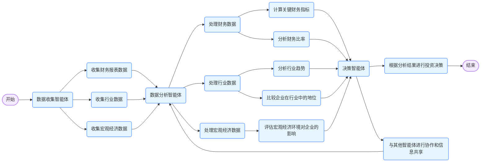

# 多智能体AI如何改进巴菲特的财报分析方法

> 关键词：多智能体AI、巴菲特财报分析方法、财务报表分析、人工智能应用、金融投资决策

> 摘要：本文聚焦于探讨多智能体AI如何改进巴菲特的财报分析方法。首先介绍了研究的背景、目的、预期读者等信息。接着阐述了多智能体AI和巴菲特财报分析方法的核心概念及联系，详细讲解了相关算法原理和具体操作步骤，并给出了数学模型和公式。通过项目实战展示了多智能体AI在财报分析中的实际应用，分析了实际应用场景。同时推荐了学习多智能体AI和财报分析的工具和资源，最后总结了未来发展趋势与挑战，解答了常见问题并提供了扩展阅读和参考资料。旨在为金融投资领域利用多智能体AI改进传统财报分析方法提供深入的见解和实用的指导。

## 1. 背景介绍 
### 1.1 目的和范围
在当今复杂多变的金融市场环境下，财务报表分析对于投资者做出明智的投资决策至关重要。巴菲特作为全球知名的投资大师，其独特的财报分析方法一直被众多投资者所推崇和学习。然而，随着金融市场的不断发展和数据量的急剧增加，传统的财报分析方法面临着诸多挑战，如分析效率低下、难以处理海量复杂数据等。多智能体AI作为人工智能领域的前沿技术，具有强大的信息处理和决策能力，为改进巴菲特的财报分析方法提供了新的思路和途径。

本文章的目的在于深入探讨多智能体AI如何应用于巴菲特的财报分析方法，以提高分析的准确性、效率和全面性。具体范围包括多智能体AI和巴菲特财报分析方法的核心概念、算法原理、数学模型，以及通过实际项目案例展示如何利用多智能体AI改进财报分析过程，并分析其在不同金融场景中的应用。

### 1.2 预期读者
本文预期读者主要包括金融投资领域的专业人士，如投资经理、分析师、交易员等，他们希望通过引入多智能体AI技术来优化现有的财报分析方法，提高投资决策的质量。同时，对于对人工智能在金融领域应用感兴趣的研究人员、学者，以及希望学习如何利用先进技术进行财务分析的学生和业余投资者也具有一定的参考价值。

### 1.3 文档结构概述
本文将按照以下结构进行阐述：
- 核心概念与联系：介绍多智能体AI和巴菲特财报分析方法的核心概念，以及它们之间的联系，并通过文本示意图和Mermaid流程图进行展示。
- 核心算法原理 & 具体操作步骤：详细讲解多智能体AI应用于财报分析的核心算法原理，并给出具体的操作步骤，同时使用Python源代码进行详细阐述。
- 数学模型和公式 & 详细讲解 & 举例说明：建立多智能体AI在财报分析中的数学模型，给出相关公式，并进行详细讲解和举例说明。
- 项目实战：代码实际案例和详细解释说明：通过实际项目案例，展示如何搭建开发环境、实现源代码，并对代码进行详细解读和分析。
- 实际应用场景：分析多智能体AI改进巴菲特财报分析方法在不同金融场景中的实际应用。
- 工具和资源推荐：推荐学习多智能体AI和财报分析的相关工具、资源和论文著作。
- 总结：未来发展趋势与挑战：总结多智能体AI在改进财报分析方法方面的未来发展趋势和面临的挑战。
- 附录：常见问题与解答：解答读者在阅读过程中可能遇到的常见问题。
- 扩展阅读 & 参考资料：提供相关的扩展阅读材料和参考资料，方便读者进一步深入学习。

### 1.4 术语表
#### 1.4.1 核心术语定义
- **多智能体AI（Multi - Agent AI）**：是指由多个智能体组成的人工智能系统，每个智能体具有一定的自主性和智能，能够感知环境、与其他智能体进行交互，并根据自身的目标和规则做出决策。
- **巴菲特财报分析方法**：是指股神巴菲特在长期投资实践中形成的一套独特的财务报表分析方法，主要关注公司的盈利能力、资产质量、现金流状况等关键财务指标，以评估公司的内在价值和投资潜力。
- **财务报表**：是企业对外提供的反映企业某一特定日期财务状况和某一会计期间经营成果、现金流量的文件，主要包括资产负债表、利润表和现金流量表。

#### 1.4.2 相关概念解释
- **智能体（Agent）**：是一个具有感知、决策和行动能力的实体，能够在特定的环境中自主地执行任务。在多智能体AI系统中，智能体可以是软件程序、机器人等。
- **内在价值（Intrinsic Value）**：是指企业在其剩余寿命内所能产生的现金流量的现值，是巴菲特投资分析的核心概念之一。
- **现金流折现模型（Discounted Cash Flow Model, DCF）**：是一种用于评估企业内在价值的方法，通过预测企业未来的现金流量，并将其折现到当前时刻，来计算企业的内在价值。

#### 1.4.3 缩略词列表
- **AI**：Artificial Intelligence，人工智能
- **DCF**：Discounted Cash Flow，现金流折现
- **ROE**：Return on Equity，净资产收益率
- **EPS**：Earnings Per Share，每股收益

## 2. 核心概念与联系 
### 核心概念原理
#### 多智能体AI原理
多智能体AI系统由多个智能体组成，每个智能体具有独立的决策能力和学习能力。智能体之间通过通信和协作来完成共同的任务。在多智能体AI中，智能体可以根据自身的感知信息和与其他智能体的交互结果，不断调整自己的行为策略，以适应环境的变化。例如，在一个多智能体的财务分析系统中，不同的智能体可以负责处理不同类型的财务数据，如收入、成本、资产等，然后通过协作和信息共享来完成对企业财务状况的全面分析。

#### 巴菲特财报分析方法原理
巴菲特的财报分析方法基于价值投资理念，强调通过对企业财务报表的深入分析来评估企业的内在价值。他主要关注以下几个关键财务指标：
- **净资产收益率（ROE）**：反映了企业运用自有资本的效率，是衡量企业盈利能力的重要指标。巴菲特认为，长期保持较高ROE的企业通常具有较强的竞争力和盈利能力。
- **每股收益（EPS）**：表示普通股股东每持有一股所能享有的企业净利润，是衡量企业盈利能力和股东回报的重要指标。
- **现金流状况**：巴菲特非常重视企业的现金流，认为现金流是企业生存和发展的基础。他关注企业的经营活动现金流是否充足，以及自由现金流的增长情况。

### 架构的文本示意图
```plaintext
多智能体AI财报分析系统
|-- 数据收集智能体
|   |-- 收集财务报表数据
|   |-- 收集行业数据
|   |-- 收集宏观经济数据
|-- 数据分析智能体
|   |-- 处理财务数据
|   |   |-- 计算关键财务指标
|   |   |-- 分析财务比率
|   |-- 处理行业数据
|   |   |-- 分析行业趋势
|   |   |-- 比较企业在行业中的地位
|   |-- 处理宏观经济数据
|   |   |-- 评估宏观经济环境对企业的影响
|-- 决策智能体
|   |-- 根据分析结果进行投资决策
|   |-- 与其他智能体进行协作和信息共享
```

### Mermaid流程图


## 3. 核心算法原理 & 具体操作步骤 
### 核心算法原理
#### 多智能体协作算法
多智能体协作算法是多智能体AI系统的核心，它决定了智能体之间如何进行通信、协作和协调。常见的多智能体协作算法包括合同网协议（Contract Net Protocol）、分布式约束满足问题（Distributed Constraint Satisfaction Problem, DCSP）等。

以合同网协议为例，其基本原理如下：
- **任务发布**：当一个智能体有任务需要完成时，它会向其他智能体发布任务招标信息。
- **投标**：其他智能体根据自身的能力和资源，对任务进行评估，并向发布者提交投标信息。
- **中标选择**：任务发布者根据投标信息，选择最合适的智能体作为中标者，并向其分配任务。
- **任务执行**：中标者执行任务，并将执行结果反馈给任务发布者。

#### 财务指标计算算法
在财报分析中，需要计算各种关键财务指标，如ROE、EPS等。以下是这些指标的计算方法：
- **净资产收益率（ROE）**：$ROE = \frac{净利润}{净资产} \times 100\%$
- **每股收益（EPS）**：$EPS = \frac{净利润}{发行在外普通股股数}$

### 具体操作步骤
#### 数据收集阶段
- 数据收集智能体通过网络爬虫、API接口等方式收集企业的财务报表数据、行业数据和宏观经济数据。
- 对收集到的数据进行清洗和预处理，去除噪声数据和缺失值。

#### 数据分析阶段
- 数据分析智能体根据收集到的数据，计算各种关键财务指标和财务比率。
- 利用机器学习算法，如聚类分析、回归分析等，对财务数据进行挖掘和分析，以发现潜在的规律和趋势。
- 分析行业数据和宏观经济数据，评估企业在行业中的地位和宏观经济环境对企业的影响。

#### 决策阶段
- 决策智能体根据数据分析结果，利用多智能体协作算法进行投资决策。
- 与其他智能体进行协作和信息共享，不断优化投资决策。

### Python源代码详细阐述
```python
import pandas as pd
import numpy as np

# 模拟财务报表数据
data = {
    '净利润': [1000, 1200, 1500],
    '净资产': [5000, 6000, 7000],
    '发行在外普通股股数': [1000, 1200, 1500]
}
df = pd.DataFrame(data)

# 计算ROE
df['ROE'] = df['净利润'] / df['净资产'] * 100

# 计算EPS
df['EPS'] = df['净利润'] / df['发行在外普通股股数']

print(df)
```
在上述代码中，我们首先模拟了一个财务报表数据集，然后使用Python的pandas库计算了ROE和EPS指标。最后，将计算结果打印输出。

## 4. 数学模型和公式 & 详细讲解 & 举例说明 
### 现金流折现模型（DCF）
现金流折现模型是评估企业内在价值的常用方法，其基本公式为：
$$V = \sum_{t=1}^{n} \frac{CF_t}{(1 + r)^t} + \frac{TV}{(1 + r)^n}$$
其中：
- $V$ 表示企业的内在价值
- $CF_t$ 表示第 $t$ 期的现金流量
- $r$ 表示折现率
- $n$ 表示预测期数
- $TV$ 表示终值

### 详细讲解
现金流折现模型的核心思想是将企业未来的现金流量折现到当前时刻，以反映其真实的价值。在实际应用中，需要进行以下步骤：
- **预测现金流量**：根据企业的历史财务数据和行业发展趋势，预测企业未来的现金流量。
- **确定折现率**：折现率反映了投资的风险和机会成本，通常可以使用加权平均资本成本（WACC）作为折现率。
- **计算终值**：终值是指预测期结束后企业的价值，可以使用永续增长模型或退出倍数法进行计算。

### 举例说明
假设某企业未来5年的现金流量分别为100万元、120万元、150万元、180万元和200万元，折现率为10%，预测期结束后企业的终值为2000万元。则该企业的内在价值计算如下：
$$V = \frac{100}{(1 + 0.1)^1} + \frac{120}{(1 + 0.1)^2} + \frac{150}{(1 + 0.1)^3} + \frac{180}{(1 + 0.1)^4} + \frac{200}{(1 + 0.1)^5} + \frac{2000}{(1 + 0.1)^5}$$
```python
import numpy as np

# 现金流量
cf = [100, 120, 150, 180, 200]
# 折现率
r = 0.1
# 终值
tv = 2000
# 预测期数
n = 5

# 计算各期现金流量的现值
pv_cf = [cf[i] / (1 + r)**(i + 1) for i in range(n)]
# 计算终值的现值
pv_tv = tv / (1 + r)**n
# 计算企业的内在价值
v = np.sum(pv_cf) + pv_tv

print(f"企业的内在价值为: {v} 万元")
```
通过上述计算，我们可以得到该企业的内在价值。

## 5. 项目实战：代码实际案例和详细解释说明 
### 5.1  开发环境搭建
#### 操作系统
建议使用Linux或Windows操作系统，确保系统具有良好的稳定性和兼容性。

#### 编程语言和开发环境
- **Python**：作为主要的编程语言，Python具有丰富的库和工具，适合进行数据处理、机器学习和算法实现。
- **Anaconda**：是一个开源的Python发行版本，包含了许多常用的科学计算库和工具，如NumPy、pandas、Scikit-learn等。可以从Anaconda官方网站下载并安装。

#### 数据库
- **MySQL**：用于存储企业的财务报表数据、行业数据和宏观经济数据。可以从MySQL官方网站下载并安装。

### 5.2  源代码详细实现和代码解读
#### 数据收集模块
```python
import requests
import pandas as pd

# 定义获取财务报表数据的函数
def get_financial_data(stock_code):
    url = f"https://example.com/api/financial_data?stock_code={stock_code}"
    response = requests.get(url)
    if response.status_code == 200:
        data = response.json()
        df = pd.DataFrame(data)
        return df
    else:
        print(f"请求失败，状态码: {response.status_code}")
        return None

# 示例调用
stock_code = "000001"
financial_data = get_financial_data(stock_code)
print(financial_data)
```
代码解读：
- 该函数通过发送HTTP请求获取指定股票代码的财务报表数据。
- 如果请求成功，将返回的数据转换为pandas DataFrame格式并返回；否则，打印错误信息并返回None。

#### 数据分析模块
```python
import pandas as pd

# 定义计算ROE和EPS的函数
def calculate_financial_metrics(df):
    df['ROE'] = df['净利润'] / df['净资产'] * 100
    df['EPS'] = df['净利润'] / df['发行在外普通股股数']
    return df

# 示例调用
financial_metrics = calculate_financial_metrics(financial_data)
print(financial_metrics)
```
代码解读：
- 该函数接收一个包含财务数据的DataFrame作为输入，计算ROE和EPS指标，并将计算结果添加到DataFrame中返回。

#### 决策模块
```python
# 简单的投资决策函数
def investment_decision(roe, eps):
    if roe > 15 and eps > 1:
        return "买入"
    else:
        return "卖出"

# 示例调用
for index, row in financial_metrics.iterrows():
    decision = investment_decision(row['ROE'], row['EPS'])
    print(f"第 {index + 1} 期决策: {decision}")
```
代码解读：
- 该函数根据ROE和EPS指标进行简单的投资决策，如果ROE大于15且EPS大于1，则建议买入；否则，建议卖出。

### 5.3  代码解读与分析
#### 数据收集模块
- 该模块通过网络请求获取财务报表数据，确保数据的实时性和准确性。
- 使用pandas库对数据进行处理和分析，方便后续的计算和操作。

#### 数据分析模块
- 计算关键财务指标ROE和EPS，为投资决策提供重要依据。
- 可以根据需要扩展计算其他财务指标和比率，如毛利率、净利率等。

#### 决策模块
- 简单的投资决策函数根据ROE和EPS指标进行决策，实际应用中可以结合更多的因素和算法进行优化。
- 可以通过多智能体协作算法，结合其他智能体的分析结果进行更准确的投资决策。

## 6. 实际应用场景 
### 股票投资决策
在股票投资中，多智能体AI可以帮助投资者更准确地评估企业的内在价值和投资潜力。通过分析企业的财务报表数据、行业数据和宏观经济数据，多智能体AI可以发现潜在的投资机会，并根据市场变化及时调整投资策略。例如，当某个企业的ROE和EPS指标持续增长，且在行业中处于领先地位时，多智能体AI可以建议投资者买入该股票。

### 风险管理
多智能体AI可以帮助金融机构和投资者进行风险管理。通过对企业的财务状况和市场风险进行实时监测和分析，多智能体AI可以及时发现潜在的风险因素，并采取相应的措施进行风险控制。例如，当某个企业的负债率过高，且现金流状况不佳时，多智能体AI可以提醒投资者注意风险，并建议减少对该企业的投资。

### 企业并购与重组
在企业并购与重组过程中，多智能体AI可以帮助企业评估目标企业的价值和风险。通过分析目标企业的财务报表数据、业务模式和市场竞争力，多智能体AI可以为企业提供决策支持，帮助企业制定合理的并购和重组方案。例如，在并购目标企业之前，多智能体AI可以对目标企业的财务状况进行全面分析，评估其潜在的协同效应和整合难度。

## 7. 工具和资源推荐
### 7.1 学习资源推荐
#### 7.1.1 书籍推荐
- 《聪明的投资者》（The Intelligent Investor）：作者是本杰明·格雷厄姆（Benjamin Graham），被誉为价值投资的圣经，对巴菲特的投资理念产生了深远影响。
- 《巴菲特致股东的信：股份公司教程》（The Essays of Warren Buffett: Lessons for Corporate America）：本书收集了巴菲特历年致股东的信，详细阐述了他的投资哲学和财报分析方法。
- 《Python数据分析实战》（Python for Data Analysis）：作者是韦斯·麦金尼（Wes McKinney），介绍了如何使用Python进行数据处理、分析和可视化，是学习Python数据分析的经典书籍。

#### 7.1.2 在线课程
- Coursera上的“Machine Learning”：由斯坦福大学教授安德鲁·吴（Andrew Ng）授课，是学习机器学习的经典课程，涵盖了机器学习的基本算法和应用。
- edX上的“Financial Engineering and Risk Management”：由哥伦比亚大学教授授课，介绍了金融工程和风险管理的基本原理和方法。
- 网易云课堂上的“Python金融数据分析实战”：该课程结合实际案例，介绍了如何使用Python进行金融数据分析和投资决策。

#### 7.1.3 技术博客和网站
- Towards Data Science：是一个专注于数据科学和机器学习的技术博客，提供了大量的技术文章和案例分析。
- Seeking Alpha：是一个金融投资领域的知名网站，提供了丰富的财经新闻、分析报告和投资建议。
- 雪球网：是国内知名的财经社区，提供了股票、基金等金融产品的行情数据、分析报告和投资者交流平台。

### 7.2 开发工具框架推荐
#### 7.2.1 IDE和编辑器
- PyCharm：是一款专业的Python集成开发环境，具有代码编辑、调试、版本控制等功能，适合开发大型Python项目。
- Jupyter Notebook：是一个交互式的开发环境，支持Python、R等多种编程语言，适合进行数据探索和分析。
- Visual Studio Code：是一款轻量级的代码编辑器，支持多种编程语言和插件扩展，具有良好的用户体验和开发效率。

#### 7.2.2 调试和性能分析工具
- pdb：是Python自带的调试工具，可以帮助开发者定位和解决代码中的问题。
- cProfile：是Python的性能分析工具，可以分析代码的运行时间和内存使用情况，帮助开发者优化代码性能。
- TensorBoard：是TensorFlow的可视化工具，可以帮助开发者可视化模型的训练过程和性能指标。

#### 7.2.3 相关框架和库
- NumPy：是Python的科学计算库，提供了高效的数组操作和数学函数，是其他数据分析库的基础。
- pandas：是Python的数据分析库，提供了灵活的数据结构和数据处理功能，适合进行财务报表数据的处理和分析。
- Scikit-learn：是Python的机器学习库，提供了丰富的机器学习算法和工具，适合进行数据挖掘和预测分析。

### 7.3 相关论文著作推荐
#### 7.3.1 经典论文
- Fama, E. F., & French, K. R. (1992). The cross - section of expected stock returns. The Journal of Finance, 47(2), 427 - 465. 该论文提出了著名的Fama - French三因子模型，对股票收益率的影响因素进行了深入研究。
- Sharpe, W. F. (1964). Capital asset prices: A theory of market equilibrium under conditions of risk. The Journal of Finance, 19(3), 425 - 442. 该论文提出了资本资产定价模型（CAPM），为金融资产的定价提供了理论基础。

#### 7.3.2 最新研究成果
- 近年来，关于多智能体AI在金融领域的应用研究不断涌现，如使用多智能体强化学习进行投资组合优化、使用多智能体系统进行金融市场预测等。可以通过IEEE Xplore、ACM Digital Library等学术数据库查找相关的最新研究论文。

#### 7.3.3 应用案例分析
- 一些金融机构和研究机构会发布多智能体AI在财报分析和投资决策中的应用案例，可以通过相关的行业报告、研究机构网站等获取这些案例，了解实际应用中的经验和教训。

## 8. 总结：未来发展趋势与挑战
### 未来发展趋势
#### 智能化程度不断提高
随着人工智能技术的不断发展，多智能体AI在财报分析中的智能化程度将不断提高。智能体将具备更强的学习能力和推理能力，能够自动发现数据中的潜在规律和模式，为投资者提供更准确的投资建议。

#### 与其他技术深度融合
多智能体AI将与区块链、物联网等技术深度融合，实现数据的安全共享和实时交互。例如，通过区块链技术可以确保财务报表数据的真实性和不可篡改，通过物联网技术可以实时获取企业的生产经营数据，为财报分析提供更全面的信息。

#### 应用场景不断拓展
多智能体AI在财报分析中的应用场景将不断拓展，除了股票投资决策、风险管理和企业并购重组等领域，还将应用于债券投资、基金投资、保险精算等领域，为金融行业的发展带来新的机遇。

### 面临的挑战
#### 数据质量和安全问题
多智能体AI的应用依赖于大量的高质量数据，但财务报表数据可能存在不准确、不完整等问题，影响分析结果的准确性。此外，数据安全也是一个重要的问题，需要采取有效的措施保护企业和投资者的敏感信息。

#### 算法复杂度和可解释性问题
多智能体AI的算法复杂度较高，难以理解和解释。在实际应用中，投资者需要了解算法的决策过程和依据，以便做出合理的投资决策。因此，如何提高算法的可解释性是一个亟待解决的问题。

#### 法律法规和监管问题
随着多智能体AI在金融领域的广泛应用，相关的法律法规和监管政策也需要不断完善。例如，如何规范智能体的行为和责任，如何保障投资者的合法权益等，都是需要解决的问题。

## 9. 附录：常见问题与解答
### 多智能体AI与传统AI有什么区别？
传统AI通常是单个智能体系统，而多智能体AI由多个智能体组成，每个智能体具有一定的自主性和智能，能够与其他智能体进行交互和协作。多智能体AI可以处理更复杂的任务，具有更强的适应性和灵活性。

### 多智能体AI在财报分析中的应用是否会取代人类分析师？
多智能体AI在财报分析中可以提供更高效、准确的分析结果，但它不能完全取代人类分析师。人类分析师具有丰富的经验和判断力，能够考虑到更多的非量化因素，如企业的管理团队、企业文化等。因此，多智能体AI和人类分析师应该相互结合，共同为投资者提供更优质的服务。

### 如何评估多智能体AI在财报分析中的性能？
可以从以下几个方面评估多智能体AI在财报分析中的性能：
- **准确性**：分析结果与实际情况的符合程度。
- **效率**：分析所需的时间和资源。
- **稳定性**：在不同的数据集和环境下，分析结果的一致性。
- **可解释性**：算法的决策过程和依据是否容易理解。

## 10. 扩展阅读 & 参考资料
### 扩展阅读
- 《金融炼金术》（The Alchemy of Finance）：作者是乔治·索罗斯（George Soros），介绍了他的反身性理论和投资哲学。
- 《黑天鹅》（The Black Swan）：作者是纳西姆·尼古拉斯·塔勒布（Nassim Nicholas Taleb），探讨了不可预测的重大事件对金融市场的影响。
- 《人工智能：现代方法》（Artificial Intelligence: A Modern Approach）：作者是斯图尔特·罗素（Stuart Russell）和彼得·诺维格（Peter Norvig），是人工智能领域的经典教材。

### 参考资料
- 相关企业的财务报表和年报
- 金融行业的研究报告和统计数据
- 学术期刊和会议论文，如《Journal of Financial Economics》、《Review of Financial Studies》等
- 相关的技术文档和开源代码，如NumPy、pandas、Scikit-learn等库的官方文档