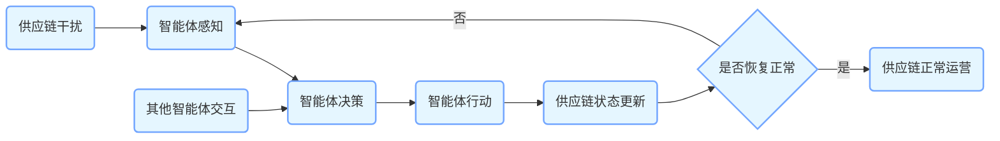

# 多智能体协同分析供应链韧性

> 关键词：多智能体系统、供应链韧性、协同分析、智能决策、复杂网络

> 摘要：本文聚焦于运用多智能体协同方法来分析供应链韧性。首先介绍了研究的背景、目的、预期读者以及文档结构等内容。详细阐述了多智能体系统和供应链韧性的核心概念及二者的联系，给出了相关的文本示意图和 Mermaid 流程图。深入讲解了用于分析的核心算法原理，并以 Python 代码展示具体操作步骤。同时，给出了相关的数学模型和公式，并举例说明。通过项目实战，从开发环境搭建到源代码的详细实现与解读，全面展示了如何运用多智能体协同进行供应链韧性分析。探讨了该方法在实际中的应用场景，推荐了学习资源、开发工具框架以及相关论文著作。最后总结了未来发展趋势与挑战，并提供了常见问题解答和扩展阅读参考资料，旨在为供应链韧性分析提供一种创新且有效的方法。

## 1. 背景介绍 
### 1.1 目的和范围
在当今全球化的经济环境下，供应链面临着各种内外部的不确定性和风险，如自然灾害、贸易摩擦、市场需求波动等。供应链韧性作为衡量供应链在遭受干扰后恢复到正常状态或适应新环境能力的重要指标，对于企业的生存和发展至关重要。本研究的目的是利用多智能体协同的方法，深入分析供应链韧性，揭示供应链在不同干扰场景下的动态行为和恢复能力。

研究范围涵盖了不同类型的供应链网络，包括制造业供应链、零售业供应链等。考虑了多种干扰因素，如供应商中断、运输延误、需求突变等。通过多智能体系统模拟供应链中各个节点的行为和交互，评估供应链在不同场景下的韧性水平，并提出相应的提升策略。

### 1.2 预期读者
本文的预期读者包括供应链管理领域的专业人士，如供应链经理、物流专家等，他们可以通过本文了解如何运用多智能体协同方法来优化供应链韧性管理。同时，也适合计算机科学和人工智能领域的研究者和开发者，为他们在多智能体系统应用于供应链领域提供参考。此外，高校相关专业的师生也可以将本文作为学习和研究的资料。

### 1.3 文档结构概述
本文共分为十个部分。第一部分为背景介绍，阐述了研究的目的、范围、预期读者和文档结构。第二部分详细介绍多智能体系统和供应链韧性的核心概念以及它们之间的联系，并给出相应的示意图和流程图。第三部分讲解用于分析的核心算法原理，并以 Python 代码展示具体操作步骤。第四部分给出相关的数学模型和公式，并进行详细讲解和举例说明。第五部分通过项目实战，介绍开发环境搭建、源代码实现和代码解读。第六部分探讨多智能体协同分析供应链韧性在实际中的应用场景。第七部分推荐学习资源、开发工具框架以及相关论文著作。第八部分总结未来发展趋势与挑战。第九部分为附录，提供常见问题解答。第十部分列出扩展阅读和参考资料。

### 1.4 术语表
#### 1.4.1 核心术语定义
- **多智能体系统（Multi - Agent System, MAS）**：由多个自主智能体组成的系统，这些智能体可以感知环境、进行决策并与其他智能体进行交互，以实现共同或各自的目标。
- **供应链韧性（Supply Chain Resilience）**：供应链在遭受干扰后，能够快速恢复到正常运营状态或适应新环境，保持或恢复其功能和绩效的能力。
- **智能体（Agent）**：具有自主性、反应性、社会性和主动性的实体，能够在一定环境中独立完成任务或与其他智能体协作。
- **供应链网络（Supply Chain Network）**：由供应商、制造商、分销商、零售商等节点以及它们之间的物流、信息流和资金流构成的复杂网络。

#### 1.4.2 相关概念解释
- **自主性**：智能体能够独立地感知环境、进行决策和采取行动，不受外部直接控制。
- **反应性**：智能体能够对环境中的变化做出及时的响应。
- **社会性**：智能体能够与其他智能体进行通信和协作，以实现共同的目标。
- **主动性**：智能体能够主动地发起行动，以追求自身的目标。

#### 1.4.3 缩略词列表
- MAS：Multi - Agent System（多智能体系统）
- SCR：Supply Chain Resilience（供应链韧性）

## 2. 核心概念与联系 
### 核心概念原理
#### 多智能体系统原理
多智能体系统基于分布式人工智能的思想，将复杂的任务分解为多个子任务，并分配给不同的智能体来完成。每个智能体具有自己的知识、能力和目标，通过与其他智能体的交互和协作，实现整个系统的目标。智能体的决策过程通常基于其内部的规则、模型或学习算法，根据感知到的环境信息和其他智能体的状态来选择合适的行动。

#### 供应链韧性原理
供应链韧性强调供应链在面对各种干扰时的适应性和恢复能力。它涉及到供应链的多个方面，如供应链的结构、流程、信息共享、合作伙伴关系等。一个具有高韧性的供应链能够在遭受干扰后，通过调整生产计划、重新分配资源、寻找替代供应商等方式，快速恢复到正常运营状态或适应新的市场环境。

### 核心概念架构
#### 文本示意图
多智能体系统与供应链韧性分析的架构可以描述为：在供应链网络中，每个节点（如供应商、制造商、分销商等）可以看作一个智能体。这些智能体具有不同的属性和能力，如生产能力、库存水平、运输能力等。智能体之间通过通信和协作来交换信息，共同应对供应链中的干扰。例如，当一个供应商发生中断时，与其相连的制造商智能体可以通过与其他供应商智能体的通信，寻找替代供应商，以维持生产的连续性。整个供应链网络可以看作一个复杂的多智能体系统，通过智能体之间的协同作用来实现供应链的韧性。

#### Mermaid 流程图

该流程图展示了在供应链遭受干扰时，智能体的工作流程。首先，智能体感知到干扰信息，然后进行决策，根据决策采取相应的行动。行动后更新供应链状态，判断是否恢复正常。如果未恢复正常，则继续感知和决策。同时，智能体在决策过程中还会与其他智能体进行交互。

## 3. 核心算法原理 & 具体操作步骤 
### 核心算法原理
我们采用基于强化学习的多智能体协同算法来分析供应链韧性。强化学习是一种通过智能体与环境进行交互，根据环境反馈的奖励信号来学习最优策略的机器学习方法。在多智能体协同的场景中，每个智能体都有自己的目标和奖励函数，但它们需要通过协作来实现整个供应链的最优性能。

具体来说，每个智能体根据当前的供应链状态和其他智能体的状态，选择一个行动。环境根据智能体的行动给出一个奖励信号，智能体根据奖励信号更新自己的策略。通过不断的交互和学习，智能体逐渐找到最优的行动策略，以提高供应链的韧性。

### 具体操作步骤（Python 代码实现）
```python
import numpy as np
import random

# 定义智能体类
class Agent:
    def __init__(self, num_actions, learning_rate=0.1, discount_factor=0.9):
        self.num_actions = num_actions
        self.learning_rate = learning_rate
        self.discount_factor = discount_factor
        self.q_table = {}

    def get_action(self, state):
        if state not in self.q_table:
            self.q_table[state] = [0] * self.num_actions
        if random.uniform(0, 1) < 0.1:  # 探索率
            return random.randint(0, self.num_actions - 1)
        else:
            return np.argmax(self.q_table[state])

    def update_q_table(self, state, action, reward, next_state):
        if state not in self.q_table:
            self.q_table[state] = [0] * self.num_actions
        if next_state not in self.q_table:
            self.q_table[next_state] = [0] * self.num_actions
        max_q_next = np.max(self.q_table[next_state])
        self.q_table[state][action] += self.learning_rate * (
            reward + self.discount_factor * max_q_next - self.q_table[state][action]
        )

# 定义供应链环境类
class SupplyChainEnv:
    def __init__(self):
        self.states = [(0, 0), (0, 1), (1, 0), (1, 1)]  # 简单示例状态
        self.actions = [0, 1]  # 简单示例行动
        self.current_state = random.choice(self.states)

    def step(self, action):
        # 简单示例的状态转移和奖励计算
        if action == 0:
            next_state = (self.current_state[0], 0)
        else:
            next_state = (self.current_state[0], 1)
        reward = 1 if next_state[1] == 1 else -1
        self.current_state = next_state
        return next_state, reward

# 初始化智能体和环境
agent = Agent(num_actions=2)
env = SupplyChainEnv()

# 训练过程
num_episodes = 1000
for episode in range(num_episodes):
    state = env.current_state
    for step in range(10):
        action = agent.get_action(str(state))
        next_state, reward = env.step(action)
        agent.update_q_table(str(state), action, reward, str(next_state))
        state = next_state

print("训练完成，最终 Q 表：", agent.q_table)
```
### 代码解释
- `Agent` 类：表示一个智能体，包含 Q 表、学习率和折扣因子等属性。`get_action` 方法用于根据当前状态选择一个行动，采用了探索 - 利用策略。`update_q_table` 方法用于根据奖励信号更新 Q 表。
- `SupplyChainEnv` 类：表示供应链环境，包含状态集合、行动集合和当前状态。`step` 方法用于执行一个行动，返回下一个状态和奖励。
- 训练过程：通过多次迭代，智能体与环境进行交互，根据奖励信号更新 Q 表，逐渐学习到最优策略。

## 4. 数学模型和公式 & 详细讲解 & 举例说明 
### 数学模型
我们采用 Q - learning 算法作为核心算法，其数学模型基于贝尔曼方程。Q - learning 的目标是学习一个最优的动作价值函数 $Q(s, a)$，表示在状态 $s$ 下采取动作 $a$ 的期望累积奖励。

### 数学公式
贝尔曼方程为：
$$Q(s, a) = Q(s, a) + \alpha \left[ r + \gamma \max_{a'} Q(s', a') - Q(s, a) \right]$$
其中：
- $Q(s, a)$ 是状态 $s$ 下采取动作 $a$ 的当前估计值。
- $\alpha$ 是学习率，控制每次更新的步长。
- $r$ 是执行动作 $a$ 后从环境中获得的即时奖励。
- $\gamma$ 是折扣因子，取值范围为 $[0, 1]$，用于权衡即时奖励和未来奖励。
- $s'$ 是执行动作 $a$ 后转移到的下一个状态。
- $\max_{a'} Q(s', a')$ 是在下一个状态 $s'$ 下所有可能动作的最大 Q 值。

### 详细讲解
Q - learning 算法通过不断地与环境进行交互，根据贝尔曼方程更新 Q 值。在每个时间步，智能体根据当前的 Q 表选择一个动作，执行该动作后从环境中获得一个奖励和下一个状态。然后，根据贝尔曼方程更新当前状态和动作的 Q 值。随着迭代次数的增加，Q 值逐渐收敛到最优值，智能体也学习到了最优策略。

### 举例说明
假设我们有一个简单的供应链场景，状态 $s$ 表示库存水平（高或低），动作 $a$ 表示是否补货（补货或不补货）。即时奖励 $r$ 根据库存水平和是否补货来确定。例如，如果库存低且补货，则奖励为 1；如果库存低且不补货，则奖励为 -1。

初始时，Q 表中的所有值都为 0。假设当前状态 $s$ 为库存低，智能体选择了补货动作 $a$，执行该动作后，从环境中获得奖励 $r = 1$，转移到下一个状态 $s'$（库存高）。假设学习率 $\alpha = 0.1$，折扣因子 $\gamma = 0.9$。

根据贝尔曼方程，更新 Q 值：
$$Q(s, a) = 0 + 0.1 \left[ 1 + 0.9 \max_{a'} Q(s', a') - 0 \right]$$
假设在下一个状态 $s'$ 下，所有动作的 Q 值都为 0，则：
$$Q(s, a) = 0 + 0.1 \times (1 + 0.9 \times 0 - 0) = 0.1$$
这样，Q 表中的 $Q(s, a)$ 值就更新为 0.1。随着不断的交互和更新，Q 表中的值会逐渐收敛到最优值。

## 5. 项目实战：代码实际案例和详细解释说明 
### 5.1  开发环境搭建
#### 安装 Python
首先，需要安装 Python 环境。可以从 Python 官方网站（https://www.python.org/downloads/）下载适合自己操作系统的 Python 版本，并按照安装向导进行安装。

#### 安装必要的库
在项目中，我们使用了 `numpy` 库进行数值计算。可以使用以下命令来安装：
```sh
pip install numpy
```

### 5.2  源代码详细实现和代码解读
#### 完整代码
```python
import numpy as np
import random

# 定义智能体类
class Agent:
    def __init__(self, num_actions, learning_rate=0.1, discount_factor=0.9):
        self.num_actions = num_actions
        self.learning_rate = learning_rate
        self.discount_factor = discount_factor
        self.q_table = {}

    def get_action(self, state):
        if state not in self.q_table:
            self.q_table[state] = [0] * self.num_actions
        if random.uniform(0, 1) < 0.1:  # 探索率
            return random.randint(0, self.num_actions - 1)
        else:
            return np.argmax(self.q_table[state])

    def update_q_table(self, state, action, reward, next_state):
        if state not in self.q_table:
            self.q_table[state] = [0] * self.num_actions
        if next_state not in self.q_table:
            self.q_table[next_state] = [0] * self.num_actions
        max_q_next = np.max(self.q_table[next_state])
        self.q_table[state][action] += self.learning_rate * (
            reward + self.discount_factor * max_q_next - self.q_table[state][action]
        )

# 定义供应链环境类
class SupplyChainEnv:
    def __init__(self):
        self.states = [(0, 0), (0, 1), (1, 0), (1, 1)]  # 简单示例状态
        self.actions = [0, 1]  # 简单示例行动
        self.current_state = random.choice(self.states)

    def step(self, action):
        # 简单示例的状态转移和奖励计算
        if action == 0:
            next_state = (self.current_state[0], 0)
        else:
            next_state = (self.current_state[0], 1)
        reward = 1 if next_state[1] == 1 else -1
        self.current_state = next_state
        return next_state, reward

# 初始化智能体和环境
agent = Agent(num_actions=2)
env = SupplyChainEnv()

# 训练过程
num_episodes = 1000
for episode in range(num_episodes):
    state = env.current_state
    for step in range(10):
        action = agent.get_action(str(state))
        next_state, reward = env.step(action)
        agent.update_q_table(str(state), action, reward, str(next_state))
        state = next_state

print("训练完成，最终 Q 表：", agent.q_table)
```

#### 代码解读
- **智能体类（`Agent`）**：
    - `__init__` 方法：初始化智能体的属性，包括动作数量、学习率、折扣因子和 Q 表。
    - `get_action` 方法：根据当前状态选择一个动作。如果当前状态不在 Q 表中，则初始化该状态的 Q 值。采用探索 - 利用策略，以一定的概率随机选择动作，否则选择 Q 值最大的动作。
    - `update_q_table` 方法：根据贝尔曼方程更新 Q 表。如果当前状态或下一个状态不在 Q 表中，则初始化相应的 Q 值。

- **供应链环境类（`SupplyChainEnv`）**：
    - `__init__` 方法：初始化供应链环境的状态集合、动作集合和当前状态。
    - `step` 方法：执行一个动作，根据动作更新状态，并计算奖励。返回下一个状态和奖励。

- **训练过程**：
    - 初始化智能体和环境。
    - 进行多次迭代（`num_episodes`），每次迭代中，智能体与环境进行多次交互（`step`）。
    - 在每次交互中，智能体选择一个动作，执行该动作后从环境中获得奖励和下一个状态，然后更新 Q 表。

### 5.3  代码解读与分析
#### 代码优点
- **简单易懂**：代码结构清晰，使用了简单的示例来演示多智能体协同分析供应链韧性的基本原理，便于初学者理解。
- **可扩展性**：代码可以很容易地扩展到更复杂的供应链场景，例如增加状态数量、动作数量和智能体数量。

#### 代码局限性
- **简单示例**：当前代码只是一个简单的示例，实际的供应链场景要复杂得多，需要考虑更多的因素，如多个智能体的协作、更复杂的状态转移和奖励计算等。
- **缺乏验证**：代码没有对训练结果进行验证，无法确定训练得到的策略是否最优。

## 6. 实际应用场景 
### 供应商中断应对
在供应链中，供应商可能会因为各种原因（如自然灾害、设备故障等）发生中断。通过多智能体协同分析，可以实时监测供应商的状态。当一个供应商发生中断时，与其相连的制造商智能体可以与其他供应商智能体进行通信，寻找替代供应商。同时，运输智能体可以调整运输路线，确保原材料能够及时供应。通过这种方式，提高供应链在供应商中断情况下的韧性。

### 需求突变应对
市场需求可能会突然发生变化，如某个产品的需求量大幅增加或减少。多智能体协同分析可以实时感知市场需求的变化。制造商智能体可以根据需求变化调整生产计划，增加或减少产量。分销商智能体可以调整库存策略，确保产品能够及时供应到市场。通过智能体之间的协同作用，使供应链能够快速适应需求的突变。

### 运输延误应对
运输过程中可能会出现延误，如交通堵塞、天气原因等。运输智能体可以实时监测运输状态，当发生延误时，与其他智能体进行沟通。制造商智能体可以调整生产进度，避免因原材料供应不及时而导致生产停滞。仓库智能体可以调整库存管理策略，确保有足够的库存来应对运输延误。通过多智能体协同，降低运输延误对供应链的影响。

## 7. 工具和资源推荐
### 7.1 学习资源推荐
#### 7.1.1 书籍推荐
- 《多智能体系统导论》：这本书系统地介绍了多智能体系统的基本概念、理论和方法，是学习多智能体系统的经典教材。
- 《供应链管理：战略、规划与运营》：全面阐述了供应链管理的各个方面，包括供应链的设计、运营和优化，对于理解供应链韧性有很大的帮助。
- 《强化学习：原理与Python实现》：详细讲解了强化学习的原理和算法，并通过 Python 代码进行实现，适合学习基于强化学习的多智能体协同算法。

#### 7.1.2 在线课程
- Coursera 上的“Multi - Agent Systems”课程：由知名高校的教授授课，深入讲解多智能体系统的理论和应用。
- edX 上的“Supply Chain Analytics”课程：介绍了供应链分析的方法和技术，包括如何运用数据分析来提高供应链韧性。
- 网易云课堂上的“Python 强化学习实战”课程：通过实际项目，教授如何使用 Python 实现强化学习算法。

#### 7.1.3 技术博客和网站
- AI 社区（https://www.ai - community.com/）：提供了多智能体系统和人工智能领域的最新技术文章和研究成果。
- Supply Chain Dive（https://www.supplychaindive.com/）：专注于供应链领域的新闻和分析，对于了解供应链韧性的实际应用有很大的帮助。
- Towards Data Science（https://towardsdatascience.com/）：有很多关于机器学习和人工智能的技术博客，包括强化学习和多智能体系统的相关内容。

### 7.2 开发工具框架推荐
#### 7.2.1 IDE和编辑器
- PyCharm：一款专业的 Python 集成开发环境，具有代码编辑、调试、版本控制等功能，适合开发基于 Python 的多智能体系统。
- Visual Studio Code：一款轻量级的代码编辑器，支持多种编程语言和插件，可用于快速开发和调试多智能体系统代码。

#### 7.2.2 调试和性能分析工具
- PDB：Python 自带的调试工具，可以帮助开发者逐行调试代码，查找问题。
- cProfile：Python 的性能分析工具，可以分析代码的运行时间和函数调用次数，帮助优化代码性能。

#### 7.2.3 相关框架和库
- Mesa：一个用于构建基于智能体的模型的 Python 框架，提供了丰富的工具和接口，方便开发多智能体系统。
- Stable - Baselines3：一个用于强化学习的 Python 库，实现了多种强化学习算法，可用于训练多智能体系统中的智能体。

### 7.3 相关论文著作推荐
#### 7.3.1 经典论文
- “Multi - Agent Systems: A Modern Approach to Distributed Artificial Intelligence”：这篇论文是多智能体系统领域的经典之作，系统地介绍了多智能体系统的理论和方法。
- “Supply Chain Resilience: Definition, Review, and Research Agenda”：对供应链韧性的定义、研究现状和未来研究方向进行了全面的综述。

#### 7.3.2 最新研究成果
- 在顶级学术会议（如 AAAI、IJCAI 等）和期刊（如 Journal of Artificial Intelligence Research、Supply Chain Management: An International Journal 等）上搜索关于多智能体协同分析供应链韧性的最新研究论文。

#### 7.3.3 应用案例分析
- 一些行业报告和案例研究，如麦肯锡、波士顿咨询集团等发布的关于供应链韧性的研究报告，包含了实际企业的应用案例和经验分享。

## 8. 总结：未来发展趋势与挑战
### 未来发展趋势
#### 与新兴技术的融合
多智能体协同分析供应链韧性将与物联网、大数据、区块链等新兴技术深度融合。物联网可以提供实时的供应链数据，使智能体能够更准确地感知环境。大数据分析可以帮助智能体挖掘数据中的潜在信息，优化决策。区块链技术可以保证供应链数据的安全性和不可篡改，提高智能体之间的信任度。

#### 智能化和自主化程度提高
未来的多智能体系统将具有更高的智能化和自主化程度。智能体将能够自动学习和适应复杂的供应链环境，不需要人工过多干预。同时，智能体之间的协作将更加高效和智能，能够更好地应对各种复杂的干扰。

#### 跨行业应用拓展
多智能体协同分析供应链韧性的应用将不再局限于传统的制造业和零售业，还将拓展到医疗、能源、金融等多个行业。不同行业的供应链具有不同的特点和需求，多智能体系统可以根据具体情况进行定制化开发，提高各行业供应链的韧性。

### 挑战
#### 复杂环境建模
实际的供应链环境非常复杂，包含大量的不确定性和动态变化。如何准确地建模供应链环境，使智能体能够真实地感知和应对环境变化，是一个巨大的挑战。

#### 多智能体协作协调
在多智能体系统中，多个智能体之间需要进行协作和协调。但是，由于智能体的目标和利益可能存在冲突，如何实现智能体之间的有效协作和协调，避免出现冲突和矛盾，是需要解决的问题。

#### 数据安全和隐私保护
在多智能体协同分析供应链韧性的过程中，需要处理大量的供应链数据。这些数据包含了企业的敏感信息，如生产计划、库存水平等。如何保证数据的安全和隐私，防止数据泄露和滥用，是一个重要的挑战。

## 9. 附录：常见问题与解答
### 问题 1：多智能体系统中的智能体是如何通信的？
智能体之间的通信可以通过多种方式实现，如消息传递、共享内存等。在基于 Python 的实现中，可以使用类的方法和属性来模拟智能体之间的通信。例如，一个智能体可以调用另一个智能体的方法来获取信息或发送指令。

### 问题 2：如何确定强化学习中的学习率和折扣因子？
学习率和折扣因子是强化学习中的重要超参数。学习率控制每次更新 Q 值的步长，折扣因子权衡即时奖励和未来奖励。通常可以通过实验的方法来确定合适的学习率和折扣因子。可以尝试不同的值，观察智能体的学习效果和收敛速度，选择最优的值。

### 问题 3：多智能体协同分析供应链韧性的计算复杂度高吗？
计算复杂度取决于供应链的规模和复杂度以及多智能体系统的设计。在大规模的供应链场景中，计算复杂度可能会较高。可以通过优化算法、并行计算等方法来降低计算复杂度。

### 问题 4：如何验证多智能体协同分析供应链韧性的效果？
可以通过多种方式来验证效果，如模拟实验、实际应用案例分析等。在模拟实验中，可以设置不同的干扰场景，观察供应链在多智能体协同下的恢复能力和性能指标。在实际应用案例中，可以对比实施多智能体协同前后供应链的运营情况。

## 10. 扩展阅读 & 参考资料
### 扩展阅读
- 《人工智能：一种现代的方法》：全面介绍了人工智能的各个领域，包括多智能体系统和强化学习，适合进一步深入学习。
- 《复杂网络》：讲解了复杂网络的理论和应用，对于理解供应链网络的结构和特性有很大的帮助。

### 参考资料
- [1] Wooldridge, M. (2009). An Introduction to Multi - Agent Systems. John Wiley & Sons.
- [2] Chopra, S., & Meindl, P. (2016). Supply Chain Management: Strategy, Planning, and Operation. Pearson.
- [3] Sutton, R. S., & Barto, A. G. (2018). Reinforcement Learning: An Introduction. MIT Press.