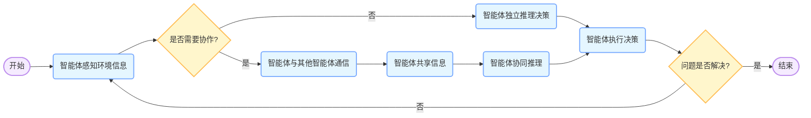

# 多智能体协同推理在复杂问题求解中的应用

> 关键词：多智能体系统、协同推理、复杂问题求解、分布式计算、人工智能

> 摘要：本文深入探讨了多智能体协同推理在复杂问题求解中的应用。首先介绍了多智能体协同推理的背景知识，包括其目的、预期读者、文档结构和相关术语。接着阐述了核心概念与联系，通过文本示意图和 Mermaid 流程图展示了其原理和架构。详细讲解了核心算法原理及具体操作步骤，并使用 Python 源代码进行了说明。分析了相关的数学模型和公式，给出了举例。通过项目实战，展示了代码实际案例并进行详细解释。探讨了多智能体协同推理在不同场景下的实际应用，推荐了学习资源、开发工具框架和相关论文著作。最后总结了未来发展趋势与挑战，提供了常见问题的解答和扩展阅读的参考资料。

## 1. 背景介绍 
### 1.1 目的和范围
在当今的科技和社会环境中，复杂问题无处不在，如交通流量管理、供应链优化、智能电网调度等。这些问题往往具有高度的复杂性、动态性和不确定性，单一智能体由于其知识、能力和资源的局限性，难以独立有效地解决这些问题。多智能体协同推理作为一种新兴的技术手段，通过多个智能体之间的协作和信息共享，能够充分发挥各个智能体的优势，提高问题求解的效率和质量。

本文的目的在于全面深入地探讨多智能体协同推理在复杂问题求解中的应用，涵盖从基本概念、算法原理到实际应用案例的各个方面，为读者提供一个系统的知识体系和实践指导。

### 1.2 预期读者
本文预期读者包括人工智能领域的研究人员、计算机科学专业的学生、软件开发者以及对多智能体系统和复杂问题求解感兴趣的技术爱好者。对于研究人员，本文可以提供新的研究思路和方法；对于学生，有助于他们深入理解相关的理论知识和实践应用；对于开发者，能够为他们在实际项目中应用多智能体协同推理提供参考和借鉴。

### 1.3 文档结构概述
本文将按照以下结构进行组织：
1. 背景介绍：介绍多智能体协同推理的目的、预期读者、文档结构和相关术语。
2. 核心概念与联系：阐述多智能体协同推理的核心概念、原理和架构，通过文本示意图和 Mermaid 流程图进行展示。
3. 核心算法原理 & 具体操作步骤：详细讲解多智能体协同推理的核心算法原理，并使用 Python 源代码进行具体说明。
4. 数学模型和公式 & 详细讲解 & 举例说明：分析多智能体协同推理的数学模型和公式，并给出实际的举例。
5. 项目实战：代码实际案例和详细解释说明：通过一个具体的项目实例，展示多智能体协同推理的代码实现和详细解读。
6. 实际应用场景：探讨多智能体协同推理在不同领域的实际应用。
7. 工具和资源推荐：推荐学习资源、开发工具框架和相关论文著作。
8. 总结：未来发展趋势与挑战：总结多智能体协同推理的发展趋势和面临的挑战。
9. 附录：常见问题与解答：解答读者可能遇到的常见问题。
10. 扩展阅读 & 参考资料：提供扩展阅读的建议和参考资料。

### 1.4 术语表
#### 1.4.1 核心术语定义
- **多智能体系统（Multi - Agent System，MAS）**：由多个智能体组成的系统，这些智能体可以自主地感知环境、做出决策并执行动作，通过相互协作来完成共同的任务。
- **智能体（Agent）**：具有自主性、反应性、社会性和主动性的实体，能够感知环境信息，根据自身的知识和目标进行推理和决策，并采取相应的行动。
- **协同推理（Collaborative Reasoning）**：多个智能体通过信息共享、交互和协作，共同进行推理和问题求解的过程。
- **复杂问题求解（Complex Problem Solving）**：针对具有高度复杂性、动态性和不确定性的问题，采用合适的方法和策略进行求解的过程。

#### 1.4.2 相关概念解释
- **分布式计算（Distributed Computing）**：将一个大型的计算任务分解为多个子任务，分布在不同的计算节点上进行并行计算，以提高计算效率和处理能力。多智能体系统可以看作是一种分布式计算系统，各个智能体在不同的节点上运行，通过网络进行通信和协作。
- **知识表示（Knowledge Representation）**：将知识以计算机能够理解和处理的形式进行表示的方法。在多智能体协同推理中，知识表示是智能体进行推理和决策的基础，常见的知识表示方法包括逻辑表示、语义网络、框架等。
- **通信协议（Communication Protocol）**：规定了智能体之间进行信息交换的格式、规则和流程。合理的通信协议可以确保智能体之间的信息传递准确、高效，避免信息冲突和误解。

#### 1.4.3 缩略词列表
- MAS：Multi - Agent System（多智能体系统）
- AI：Artificial Intelligence（人工智能）

## 2. 核心概念与联系 
### 核心概念原理
多智能体协同推理的核心原理在于多个智能体通过协作和信息共享，充分发挥各自的优势，共同解决复杂问题。每个智能体都具有一定的知识、能力和目标，它们可以自主地感知环境信息，根据自身的知识和目标进行推理和决策。在协同推理过程中，智能体之间通过通信协议进行信息交换，共享各自的知识和推理结果，从而实现对问题的更全面、更深入的理解和求解。

例如，在一个交通流量管理系统中，每个交通路口的智能体可以感知该路口的交通流量信息，如车辆数量、车速等。各个智能体通过通信协议将这些信息共享给其他智能体，然后共同分析和推理，制定出最优的交通信号控制策略，以缓解交通拥堵。

### 架构的文本示意图
```plaintext
多智能体协同推理系统
|
|-- 智能体 1
|   |-- 感知模块
|   |-- 推理模块
|   |-- 决策模块
|   |-- 通信模块
|
|-- 智能体 2
|   |-- 感知模块
|   |-- 推理模块
|   |-- 决策模块
|   |-- 通信模块
|
|-- ...
|
|-- 智能体 n
|   |-- 感知模块
|   |-- 推理模块
|   |-- 决策模块
|   |-- 通信模块
|
|-- 通信网络
```

在这个架构中，每个智能体都包含感知模块、推理模块、决策模块和通信模块。感知模块用于感知环境信息，推理模块根据感知到的信息和自身的知识进行推理，决策模块根据推理结果做出决策，通信模块用于与其他智能体进行信息交换。各个智能体通过通信网络连接在一起，实现信息的共享和协作。

### Mermaid 流程图


该流程图展示了多智能体协同推理的基本流程。首先，智能体感知环境信息，然后判断是否需要与其他智能体协作。如果不需要协作，智能体独立进行推理和决策；如果需要协作，智能体与其他智能体进行通信，共享信息并进行协同推理。最后，智能体执行决策，并判断问题是否解决。如果问题未解决，则继续循环执行上述过程。

## 3. 核心算法原理 & 具体操作步骤 
### 核心算法原理
多智能体协同推理的核心算法有多种，这里以基于合同网协议（Contract Net Protocol，CNP）的协同推理算法为例进行介绍。合同网协议是一种常用的多智能体任务分配和协同算法，其基本思想是通过招标、投标和中标三个阶段，实现任务的合理分配和智能体之间的协作。

#### 招标阶段
任务发起者（招标者）将任务信息发布给其他智能体（投标者），任务信息包括任务的描述、要求、截止时间等。

#### 投标阶段
投标者收到招标信息后，根据自身的能力和资源评估是否能够完成该任务。如果可以完成，投标者向招标者发送投标信息，包括投标价格、完成时间等。

#### 中标阶段
招标者收到所有投标信息后，根据一定的评估标准（如投标价格最低、完成时间最短等）选择最合适的投标者作为中标者，并向中标者发送中标通知。中标者收到通知后，开始执行任务。

### 具体操作步骤及 Python 源代码实现
```python
import random

# 定义智能体类
class Agent:
    def __init__(self, id):
        self.id = id
        self.capability = random.randint(1, 10)  # 随机初始化智能体的能力
        self.busy = False

    # 接收招标信息并投标
    def receive_bid(self, task):
        if not self.busy and self.capability >= task['requirement']:
            bid_price = random.randint(1, 20)  # 随机生成投标价格
            return {'agent_id': self.id, 'price': bid_price}
        return None

    # 接收中标通知并执行任务
    def receive_award(self):
        self.busy = True
        print(f"Agent {self.id} is working on the task.")

# 定义任务类
class Task:
    def __init__(self, requirement):
        self.requirement = requirement

# 定义招标者类
class Tenderer:
    def __init__(self):
        self.agents = []

    # 添加智能体
    def add_agent(self, agent):
        self.agents.append(agent)

    # 发布招标信息
    def publish_bid(self, task):
        bids = []
        for agent in self.agents:
            bid = agent.receive_bid(task)
            if bid:
                bids.append(bid)
        return bids

    # 选择中标者
    def select_winner(self, bids):
        if not bids:
            return None
        winner = min(bids, key=lambda x: x['price'])
        return winner['agent_id']

    # 发送中标通知
    def send_award(self, winner_id):
        for agent in self.agents:
            if agent.id == winner_id:
                agent.receive_award()

# 主程序
if __name__ == "__main__":
    # 创建智能体
    agent1 = Agent(1)
    agent2 = Agent(2)
    agent3 = Agent(3)

    # 创建招标者
    tenderer = Tenderer()
    tenderer.add_agent(agent1)
    tenderer.add_agent(agent2)
    tenderer.add_agent(agent3)

    # 创建任务
    task = Task(requirement=5)

    # 发布招标信息
    bids = tenderer.publish_bid(task)

    # 选择中标者
    winner_id = tenderer.select_winner(bids)

    # 发送中标通知
    if winner_id:
        tenderer.send_award(winner_id)
    else:
        print("No agent can handle the task.")
```

### 代码解释
1. **Agent 类**：表示智能体，包含智能体的基本属性（如 ID、能力和忙碌状态）和方法（如接收招标信息并投标、接收中标通知并执行任务）。
2. **Task 类**：表示任务，包含任务的要求。
3. **Tenderer 类**：表示招标者，包含添加智能体、发布招标信息、选择中标者和发送中标通知等方法。
4. **主程序**：创建智能体、招标者和任务，发布招标信息，选择中标者并发送中标通知。

通过上述代码，我们实现了基于合同网协议的多智能体协同推理的基本流程。

## 4. 数学模型和公式 & 详细讲解 & 举例说明 
### 数学模型
在多智能体协同推理中，我们可以使用效用函数来描述智能体的决策行为。效用函数是一个将智能体的行动和环境状态映射到一个实数值的函数，该实数值表示智能体采取该行动在该环境状态下的效用。

假设存在 $n$ 个智能体 $A_1, A_2, \cdots, A_n$，每个智能体 $A_i$ 有一组可能的行动 $A_{i1}, A_{i2}, \cdots, A_{im}$，环境状态为 $S$。智能体 $A_i$ 的效用函数可以表示为 $U_i(A_{ij}, S)$，其中 $A_{ij}$ 是智能体 $A_i$ 的第 $j$ 个行动。

### 公式
智能体 $A_i$ 在环境状态 $S$ 下的最优行动 $A_{i}^*$ 可以通过最大化其效用函数来确定，即：

$$A_{i}^* = \arg\max_{A_{ij}} U_i(A_{ij}, S)$$

在多智能体协同推理中，智能体之间的协作可以通过联合效用函数来描述。假设智能体 $A_1$ 和 $A_2$ 进行协作，它们的联合效用函数可以表示为 $U(A_{1j}, A_{2k}, S)$，其中 $A_{1j}$ 是智能体 $A_1$ 的第 $j$ 个行动，$A_{2k}$ 是智能体 $A_2$ 的第 $k$ 个行动。

智能体 $A_1$ 和 $A_2$ 的最优联合行动 $(A_{1}^*, A_{2}^*)$ 可以通过最大化联合效用函数来确定，即：

$$(A_{1}^*, A_{2}^*) = \arg\max_{A_{1j}, A_{2k}} U(A_{1j}, A_{2k}, S)$$

### 详细讲解
效用函数的设计需要考虑多个因素，如任务的目标、智能体的能力、资源限制等。例如，在一个资源分配问题中，效用函数可以表示为智能体完成任务所获得的收益减去消耗的资源成本。

联合效用函数的设计则需要考虑智能体之间的协作关系和相互影响。例如，在一个团队合作任务中，联合效用函数可以表示为团队完成任务的总收益，需要考虑各个智能体的贡献和协作效果。

### 举例说明
假设存在两个智能体 $A_1$ 和 $A_2$，它们需要协作完成一个任务。每个智能体有两个可能的行动：$A_{11}, A_{12}$ 和 $A_{21}, A_{22}$。环境状态 $S$ 是固定的。联合效用函数 $U(A_{1j}, A_{2k}, S)$ 如下表所示：

|  | $A_{21}$ | $A_{22}$ |
| --- | --- | --- |
| $A_{11}$ | 5 | 3 |
| $A_{12}$ | 2 | 4 |

为了找到最优联合行动，我们需要比较所有可能的行动组合的联合效用值：
- $U(A_{11}, A_{21}) = 5$
- $U(A_{11}, A_{22}) = 3$
- $U(A_{12}, A_{21}) = 2$
- $U(A_{12}, A_{22}) = 4$

通过比较，我们可以发现最优联合行动是 $(A_{11}, A_{21})$，因为它的联合效用值最大。

## 5. 项目实战：代码实际案例和详细解释说明 
### 5.1  开发环境搭建
#### 开发语言和版本
本项目使用 Python 3.8 进行开发，Python 是一种功能强大、易于学习和使用的编程语言，具有丰富的库和工具，适合用于多智能体系统的开发。

#### 开发环境
可以使用 Anaconda 来管理 Python 环境，Anaconda 是一个开源的 Python 发行版本，包含了许多常用的科学计算和数据分析库。

#### 安装必要的库
在项目中，我们需要使用一些基本的 Python 库，如 `random` 库用于生成随机数。这些库通常是 Python 标准库的一部分，不需要额外安装。

### 5.2  源代码详细实现和代码解读
```python
import random

# 定义智能体类
class Agent:
    def __init__(self, id, knowledge):
        self.id = id
        self.knowledge = knowledge  # 智能体的知识
        self.belief = {}  # 智能体的信念

    # 感知环境信息
    def perceive(self, environment):
        # 简单模拟感知过程，随机获取一些环境信息
        perceived_info = random.choice(environment)
        return perceived_info

    # 推理过程
    def reason(self, perceived_info):
        # 简单的推理规则：如果感知到的信息在知识中，则更新信念
        if perceived_info in self.knowledge:
            self.belief[perceived_info] = True
        return self.belief

    # 与其他智能体通信
    def communicate(self, other_agent):
        # 简单模拟通信过程，交换信念
        self.belief.update(other_agent.belief)
        other_agent.belief.update(self.belief)
        return self.belief

# 定义环境类
class Environment:
    def __init__(self):
        self.info = ['info1', 'info2', 'info3', 'info4']

    def get_info(self):
        return self.info

# 主程序
if __name__ == "__main__":
    # 创建环境
    environment = Environment()

    # 创建智能体
    agent1 = Agent(id=1, knowledge=['info1', 'info2'])
    agent2 = Agent(id=2, knowledge=['info3', 'info4'])

    # 智能体感知环境信息
    perceived_info1 = agent1.perceive(environment.get_info())
    perceived_info2 = agent2.perceive(environment.get_info())

    # 智能体进行推理
    belief1 = agent1.reason(perceived_info1)
    belief2 = agent2.reason(perceived_info2)

    # 智能体进行通信
    new_belief1 = agent1.communicate(agent2)

    print(f"Agent 1's final belief: {new_belief1}")
    print(f"Agent 2's final belief: {agent2.belief}")
```

### 5.3  代码解读与分析
#### 代码结构
- **Agent 类**：表示智能体，包含智能体的基本属性（如 ID、知识和信念）和方法（如感知环境信息、推理和通信）。
- **Environment 类**：表示环境，包含环境的信息和获取信息的方法。
- **主程序**：创建环境和智能体，让智能体感知环境信息、进行推理和通信，并输出最终的信念。

#### 详细解读
1. **感知环境信息**：智能体通过 `perceive` 方法从环境中随机获取一些信息。
2. **推理过程**：智能体根据感知到的信息和自身的知识，使用 `reason` 方法进行推理，更新自己的信念。
3. **通信过程**：智能体通过 `communicate` 方法与其他智能体进行通信，交换彼此的信念。

#### 分析
通过这个项目实例，我们可以看到多智能体协同推理的基本过程。智能体通过感知环境信息、推理和通信，不断更新自己的信念，从而实现对环境的更全面、更深入的理解。这种协同推理的方式可以提高智能体的问题求解能力，特别是在处理复杂问题时，多个智能体的协作可以充分发挥各自的优势，提高问题求解的效率和质量。

## 6. 实际应用场景 
### 交通流量管理
在交通流量管理中，多智能体协同推理可以用于优化交通信号控制和车辆路径规划。每个交通路口的智能体可以感知该路口的交通流量信息，如车辆数量、车速等。各个智能体通过通信协议将这些信息共享给其他智能体，然后共同分析和推理，制定出最优的交通信号控制策略，以缓解交通拥堵。同时，车辆也可以作为智能体，根据实时的交通信息规划自己的行驶路径，避免拥堵路段。

### 供应链优化
在供应链管理中，多智能体协同推理可以用于优化供应链的各个环节，如采购、生产、配送等。供应商、生产商、分销商和零售商可以作为智能体，通过信息共享和协同推理，实现供应链的高效运作。例如，生产商可以根据供应商的库存信息和零售商的需求信息，合理安排生产计划；分销商可以根据生产商的生产进度和零售商的订单信息，优化配送路线。

### 智能电网调度
在智能电网中，多智能体协同推理可以用于优化电力的生产、传输和分配。发电站、变电站、用户等可以作为智能体，通过实时监测电力的生产和消费情况，进行协同推理和决策。例如，发电站可以根据用户的用电需求和电网的负荷情况，合理调整发电功率；用户可以根据电价信息和自身的用电需求，合理安排用电时间。

### 灾害救援
在灾害救援中，多智能体协同推理可以用于协调救援力量和资源分配。救援人员、救援设备、受灾群众等可以作为智能体，通过通信和协作，实现救援工作的高效进行。例如，救援人员可以根据受灾群众的位置和需求信息，合理分配救援资源；救援设备可以根据救援人员的指令，自动执行救援任务。

## 7. 工具和资源推荐
### 7.1 学习资源推荐
#### 7.1.1 书籍推荐
- 《多智能体系统：原理与编程》：这本书系统地介绍了多智能体系统的基本概念、理论和方法，包括智能体的建模、通信、协作和学习等方面，是学习多智能体系统的经典教材。
- 《人工智能：一种现代的方法》：该书全面涵盖了人工智能的各个领域，包括多智能体系统，对多智能体协同推理的原理和算法进行了详细的讲解。

#### 7.1.2 在线课程
- Coursera 上的“Multi - Agent Systems”课程：由知名高校的教授授课，课程内容丰富，包括多智能体系统的基础理论、算法和应用等方面。
- edX 上的“Artificial Intelligence”课程：该课程涵盖了人工智能的多个领域，其中包括多智能体协同推理的相关内容，通过视频讲解、作业和实验等方式，帮助学习者深入理解相关知识。

#### 7.1.3 技术博客和网站
- Multi - Agent Systems Journal：这是一个专门发表多智能体系统研究成果的学术期刊，上面有很多关于多智能体协同推理的最新研究论文和技术报告。
- AI Stack Exchange：这是一个人工智能领域的问答社区，用户可以在上面提问和回答关于多智能体协同推理的问题，与其他技术爱好者交流和分享经验。

### 7.2 开发工具框架推荐
#### 7.2.1 IDE和编辑器
- PyCharm：是一款专门为 Python 开发设计的集成开发环境，具有强大的代码编辑、调试和项目管理功能，适合用于多智能体系统的开发。
- Visual Studio Code：是一款轻量级的代码编辑器，支持多种编程语言，具有丰富的插件和扩展功能，可以方便地进行 Python 代码的开发和调试。

#### 7.2.2 调试和性能分析工具
- PDB：是 Python 标准库中的调试工具，可以帮助开发者在代码中设置断点、单步执行代码和查看变量值等，方便进行代码调试。
- cProfile：是 Python 标准库中的性能分析工具，可以分析代码的运行时间和函数调用次数，帮助开发者找出代码中的性能瓶颈。

#### 7.2.3 相关框架和库
- Mesa：是一个用于构建基于智能体的模型的 Python 框架，提供了丰富的工具和接口，方便开发者快速搭建多智能体系统。
- JADE：是一个基于 Java 的多智能体开发框架，具有良好的跨平台性和可扩展性，广泛应用于多智能体系统的开发。

### 7.3 相关论文著作推荐
#### 7.3.1 经典论文
- “The Contract Net Protocol: High - Level Communication and Control in a Distributed Problem Solver”：该论文介绍了合同网协议的基本原理和实现方法，是多智能体任务分配和协同领域的经典论文。
- “Multi - Agent Systems: A Modern Approach to Distributed Artificial Intelligence”：这篇论文对多智能体系统的基本概念、理论和方法进行了全面的阐述，是多智能体系统领域的重要文献。

#### 7.3.2 最新研究成果
- 近年来，多智能体协同推理在深度学习、强化学习等领域取得了很多新的研究成果。例如，一些研究将深度学习技术应用于多智能体的感知和推理过程，提高了智能体的学习能力和决策能力；另一些研究将强化学习算法用于多智能体的协作和竞争问题，实现了智能体的自主学习和优化。

#### 7.3.3 应用案例分析
- 一些实际应用案例的分析论文可以帮助我们更好地理解多智能体协同推理在不同领域的应用。例如，关于交通流量管理、供应链优化、智能电网调度等领域的应用案例分析论文，详细介绍了多智能体协同推理在这些领域的具体实现方法和效果评估。

## 8. 总结：未来发展趋势与挑战
### 未来发展趋势
#### 与深度学习和强化学习的融合
多智能体协同推理与深度学习和强化学习的融合将是未来的一个重要发展趋势。深度学习可以用于智能体的感知和特征提取，强化学习可以用于智能体的决策和学习，通过将这些技术与多智能体协同推理相结合，可以提高智能体的学习能力和决策能力，实现更高效的协同推理。

#### 大规模多智能体系统的研究
随着技术的发展，多智能体系统的规模将越来越大，涉及的智能体数量将越来越多。大规模多智能体系统的研究将面临新的挑战和机遇，如通信效率、协作机制、分布式计算等方面的问题。未来的研究将致力于解决这些问题，提高大规模多智能体系统的性能和可靠性。

#### 跨领域应用的拓展
多智能体协同推理将在更多的领域得到应用，如医疗、教育、金融等。在医疗领域，多智能体协同推理可以用于医疗诊断、治疗方案制定等方面；在教育领域，可以用于个性化学习、教学资源分配等方面；在金融领域，可以用于风险评估、投资决策等方面。

### 挑战
#### 通信和协调问题
在多智能体系统中，智能体之间的通信和协调是一个关键问题。由于智能体数量众多、分布广泛，通信延迟、信息冲突等问题可能会影响协同推理的效率和质量。如何设计高效的通信协议和协调机制，是多智能体协同推理面临的一个重要挑战。

#### 知识表示和共享问题
智能体的知识表示和共享是多智能体协同推理的基础。不同的智能体可能使用不同的知识表示方法和语言，如何实现知识的统一表示和有效共享，是一个需要解决的问题。此外，知识的更新和维护也是一个挑战，需要保证智能体的知识始终是最新和准确的。

#### 安全性和可靠性问题
多智能体系统通常运行在开放的网络环境中，面临着各种安全威胁，如网络攻击、数据泄露等。如何保证多智能体系统的安全性和可靠性，是一个重要的研究课题。此外，智能体的故障处理和容错机制也是需要考虑的问题，以确保系统在部分智能体出现故障时仍能正常运行。

## 9. 附录：常见问题与解答
### 问题 1：多智能体协同推理与传统的人工智能方法有什么区别？
解答：传统的人工智能方法通常是基于单个智能体的，其知识和能力相对有限。而多智能体协同推理通过多个智能体之间的协作和信息共享，能够充分发挥各个智能体的优势，提高问题求解的效率和质量。多智能体协同推理更适合处理复杂、动态和不确定性的问题，因为多个智能体可以从不同的角度对问题进行分析和求解。

### 问题 2：如何选择合适的多智能体协同推理算法？
解答：选择合适的多智能体协同推理算法需要考虑多个因素，如问题的性质、智能体的数量和类型、通信成本等。例如，如果问题是任务分配问题，可以选择合同网协议等算法；如果问题是优化问题，可以选择遗传算法、蚁群算法等智能优化算法。此外，还需要根据实际情况对算法进行调整和优化，以提高算法的性能和适应性。

### 问题 3：多智能体系统的开发难度大吗？
解答：多智能体系统的开发难度相对较大，因为它涉及到多个智能体的设计、通信和协作等方面。需要掌握人工智能、分布式计算、通信协议等多方面的知识。但是，随着相关技术的发展和开发工具的不断完善，开发难度也在逐渐降低。可以使用一些成熟的开发框架和工具，如 Mesa、JADE 等，来快速搭建多智能体系统。

### 问题 4：多智能体协同推理在实际应用中可能会遇到哪些问题？
解答：在实际应用中，多智能体协同推理可能会遇到通信和协调问题、知识表示和共享问题、安全性和可靠性问题等。例如，智能体之间的通信延迟可能会影响协同推理的效率；不同智能体的知识表示方法不一致可能会导致信息共享困难；网络攻击可能会威胁到系统的安全性。需要针对这些问题采取相应的解决措施，如设计高效的通信协议、统一知识表示方法、加强安全防护等。

## 10. 扩展阅读 & 参考资料
### 扩展阅读
- 《智能体系统与多智能体系统：理论与应用》：进一步深入探讨了多智能体系统的理论和应用，包括智能体的认知模型、多智能体的学习和进化等方面的内容。
- 《基于多智能体的复杂系统建模与仿真》：介绍了如何使用多智能体系统对复杂系统进行建模和仿真，通过实际案例展示了多智能体系统在复杂系统研究中的应用。

### 参考资料
- Wooldridge, M. (2009). An Introduction to Multi - Agent Systems. John Wiley & Sons.
- Shoham, Y., & Leyton - Brown, K. (2009). Multiagent Systems: Algorithmic, Game - Theoretic, and Logical Foundations. Cambridge University Press.
- Ferber, J. (1999). Multi - Agent Systems: An Introduction to Distributed Artificial Intelligence. Addison - Wesley.