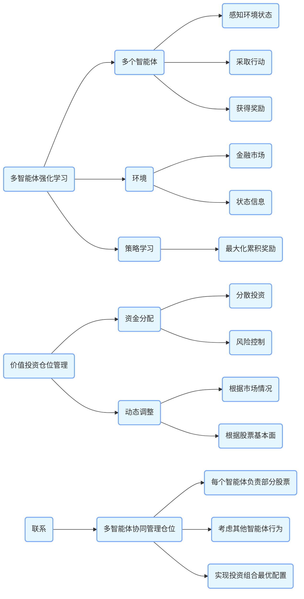

# 多智能体强化学习在优化价值投资的仓位管理中的应用

> 关键词：多智能体强化学习、价值投资、仓位管理、优化策略、金融市场

> 摘要：本文聚焦于多智能体强化学习在价值投资仓位管理中的应用。首先介绍了研究的背景、目的、预期读者等基础信息，阐述了多智能体强化学习和价值投资仓位管理的核心概念及联系。详细讲解了核心算法原理，通过 Python 代码展示具体操作步骤，并给出了相关数学模型和公式。以实际项目为例，进行开发环境搭建、源代码实现与解读。探讨了该技术在金融市场中的实际应用场景，推荐了学习、开发工具以及相关论文著作。最后总结了未来发展趋势与挑战，还提供了常见问题解答和扩展阅读参考资料，旨在为投资者和研究者提供全面且深入的技术视角，助力优化价值投资的仓位管理。

## 1. 背景介绍 
### 1.1 目的和范围
在价值投资领域，仓位管理是决定投资成败的关键因素之一。合理的仓位管理能够有效控制风险，提高投资回报率。传统的仓位管理方法往往依赖于经验和简单的规则，难以适应复杂多变的金融市场。多智能体强化学习作为一种新兴的技术，具有自适应、自主学习和协同决策的能力，为优化价值投资的仓位管理提供了新的思路和方法。

本文的目的在于深入探讨多智能体强化学习在价值投资仓位管理中的应用，分析其原理、算法和实际操作步骤，通过实际案例验证其有效性，并展望其未来发展趋势。研究范围涵盖了多智能体强化学习的基本理论、价值投资的仓位管理原则、核心算法的实现以及在金融市场中的实际应用。

### 1.2 预期读者
本文主要面向以下几类读者：
- 金融投资者：希望通过新技术优化投资策略，提高投资回报率的个人和机构投资者。
- 金融科技从业者：从事金融数据分析、算法交易等领域的专业人士，对多智能体强化学习在金融领域的应用感兴趣。
- 学术研究者：专注于强化学习、金融工程等领域的学者和学生，希望深入了解多智能体强化学习在价值投资中的应用。

### 1.3 文档结构概述
本文将按照以下结构进行组织：
- 核心概念与联系：介绍多智能体强化学习和价值投资仓位管理的核心概念，以及它们之间的联系。
- 核心算法原理 & 具体操作步骤：详细讲解多智能体强化学习的核心算法原理，并通过 Python 代码展示具体操作步骤。
- 数学模型和公式 & 详细讲解 & 举例说明：给出多智能体强化学习在仓位管理中的数学模型和公式，并进行详细讲解和举例说明。
- 项目实战：代码实际案例和详细解释说明：通过实际项目案例，介绍开发环境搭建、源代码实现和代码解读。
- 实际应用场景：探讨多智能体强化学习在价值投资仓位管理中的实际应用场景。
- 工具和资源推荐：推荐学习、开发工具以及相关论文著作。
- 总结：未来发展趋势与挑战：总结多智能体强化学习在价值投资仓位管理中的应用现状，展望未来发展趋势，并分析面临的挑战。
- 附录：常见问题与解答：解答读者在阅读过程中可能遇到的常见问题。
- 扩展阅读 & 参考资料：提供相关的扩展阅读资料和参考文献。

### 1.4 术语表
#### 1.4.1 核心术语定义
- **多智能体强化学习（Multi-Agent Reinforcement Learning, MARL）**：是指多个智能体在同一个环境中通过与环境交互学习最优策略的过程。每个智能体根据自身的观察和奖励信号，独立地学习和决策，同时也会考虑其他智能体的行为。
- **价值投资（Value Investing）**：是一种投资策略，投资者通过分析公司的基本面，寻找被低估的股票进行投资，以期在长期获得高于市场平均水平的回报。
- **仓位管理（Position Management）**：是指投资者根据自身的风险承受能力、投资目标和市场情况，合理分配资金到不同的投资标的上的过程。

#### 1.4.2 相关概念解释
- **智能体（Agent）**：在强化学习中，智能体是指能够感知环境状态、采取行动并获得奖励的实体。在多智能体强化学习中，有多个智能体同时存在于一个环境中。
- **环境（Environment）**：是智能体所处的外部世界，智能体通过与环境交互获取状态信息，并根据状态信息采取行动。在价值投资的仓位管理中，环境可以看作是金融市场。
- **状态（State）**：是指环境在某一时刻的特征描述，智能体根据状态信息选择合适的行动。在仓位管理中，状态可以包括股票价格、成交量、市场指数等。
- **行动（Action）**：是指智能体在某一状态下采取的操作。在仓位管理中，行动可以包括买入、卖出、持有等。
- **奖励（Reward）**：是环境对智能体采取行动的反馈，用于指导智能体学习最优策略。在仓位管理中，奖励可以是投资回报率、风险调整后的回报率等。

#### 1.4.3 缩略词列表
- **MARL**：Multi-Agent Reinforcement Learning（多智能体强化学习）
- **DQN**：Deep Q-Network（深度 Q 网络）
- **A2C**：Advantage Actor-Critic（优势行动者 - 评判者算法）
- **PPO**：Proximal Policy Optimization（近端策略优化算法）

## 2. 核心概念与联系 
### 2.1 多智能体强化学习原理
多智能体强化学习是强化学习的一个扩展，它涉及多个智能体在同一个环境中进行交互和学习。每个智能体都有自己的目标和策略，通过与环境和其他智能体的交互来最大化自己的累积奖励。

在多智能体强化学习中，智能体的决策过程可以用马尔可夫决策过程（MDP）的扩展 - 多智能体马尔可夫决策过程（MMDP）来描述。MMDP 可以表示为一个元组 $(S, A_1, A_2, \cdots, A_n, P, R_1, R_2, \cdots, R_n, \gamma)$，其中：
- $S$ 是环境的状态空间。
- $A_i$ 是第 $i$ 个智能体的行动空间。
- $P(s'|s, a_1, a_2, \cdots, a_n)$ 是状态转移概率，表示在状态 $s$ 下，所有智能体采取行动 $(a_1, a_2, \cdots, a_n)$ 后转移到状态 $s'$ 的概率。
- $R_i(s, a_1, a_2, \cdots, a_n, s')$ 是第 $i$ 个智能体的奖励函数，表示在状态 $s$ 下，所有智能体采取行动 $(a_1, a_2, \cdots, a_n)$ 后转移到状态 $s'$ 时，第 $i$ 个智能体获得的奖励。
- $\gamma$ 是折扣因子，用于衡量未来奖励的重要性。

智能体的目标是学习一个策略 $\pi_i(a_i|s)$，使得在每个状态 $s$ 下，选择行动 $a_i$ 的概率最大化自己的累积折扣奖励：
$$G_i = \sum_{t=0}^{\infty} \gamma^t R_i(s_t, a_{1t}, a_{2t}, \cdots, a_{nt}, s_{t+1})$$

### 2.2 价值投资仓位管理原则
价值投资的仓位管理旨在通过合理分配资金到不同的股票上，实现风险控制和收益最大化。以下是一些常见的仓位管理原则：
- **分散投资**：将资金分散到不同的行业、不同的公司，以降低单一股票的风险。
- **风险控制**：根据自身的风险承受能力，合理控制仓位，避免过度投资。
- **动态调整**：根据市场情况和股票的基本面变化，动态调整仓位。

### 2.3 多智能体强化学习与价值投资仓位管理的联系
多智能体强化学习可以应用于价值投资的仓位管理，通过多个智能体协同工作，实现更优化的仓位管理策略。具体来说，每个智能体可以负责管理一个或多个股票的仓位，根据市场情况和其他智能体的行为，动态调整自己的仓位。

例如，一个智能体可以负责管理科技行业的股票仓位，另一个智能体可以负责管理金融行业的股票仓位。每个智能体通过与市场环境交互，学习最优的仓位管理策略，同时也会考虑其他智能体的行为，以实现整个投资组合的最优配置。

### 2.4 核心概念的文本示意图
```plaintext
多智能体强化学习
    |
    |-- 多个智能体
    |   |-- 感知环境状态
    |   |-- 采取行动
    |   |-- 获得奖励
    |
    |-- 环境
    |   |-- 金融市场
    |   |-- 状态信息（股票价格、成交量等）
    |
    |-- 策略学习
    |   |-- 最大化累积奖励

价值投资仓位管理
    |
    |-- 资金分配
    |   |-- 分散投资
    |   |-- 风险控制
    |
    |-- 动态调整
    |   |-- 根据市场情况
    |   |-- 根据股票基本面

联系
    |
    |-- 多智能体协同管理仓位
    |   |-- 每个智能体负责部分股票
    |   |-- 考虑其他智能体行为
    |   |-- 实现投资组合最优配置
```

### 2.5 Mermaid 流程图


## 3. 核心算法原理 & 具体操作步骤 
### 3.1 核心算法原理
在多智能体强化学习中，有多种算法可以用于学习最优策略。这里我们介绍一种常用的算法 - 深度 Q 网络（DQN）的扩展 - 多智能体深度 Q 网络（Multi-Agent Deep Q-Network, MADQN）。

DQN 是一种基于价值的强化学习算法，它使用神经网络来近似动作价值函数 $Q(s, a)$。MADQN 是将 DQN 扩展到多智能体环境中，每个智能体都有自己的 Q 网络。

智能体的目标是学习一个 Q 网络 $\hat{Q}_i(s, a_i; \theta_i)$，使得 $Q(s, a_i)$ 的估计值尽可能接近真实值。在每个时间步 $t$，智能体根据当前状态 $s_t$ 选择行动 $a_{it}$，并获得奖励 $R_{it}$ 和下一个状态 $s_{t+1}$。然后，智能体使用以下损失函数来更新 Q 网络的参数 $\theta_i$：
$$L(\theta_i) = \mathbb{E}[(y_{it} - \hat{Q}_i(s_t, a_{it}; \theta_i))^2]$$
其中，$y_{it} = R_{it} + \gamma \max_{a_{i}} \hat{Q}_i(s_{t+1}, a_{i}; \theta_i^-)$ 是目标值，$\theta_i^-$ 是目标网络的参数，目标网络的参数定期从主网络复制。

### 3.2 具体操作步骤
以下是使用 MADQN 进行价值投资仓位管理的具体操作步骤：

#### 步骤 1：初始化
- 初始化环境，包括金融市场数据和投资组合。
- 初始化每个智能体的 Q 网络和目标网络，随机初始化网络参数。
- 初始化经验回放缓冲区 $D$，用于存储智能体的经验 $(s_t, a_{1t}, a_{2t}, \cdots, a_{nt}, R_{1t}, R_{2t}, \cdots, R_{nt}, s_{t+1})$。

#### 步骤 2：与环境交互
- 在每个时间步 $t$，每个智能体根据当前状态 $s_t$ 和自己的 Q 网络选择行动 $a_{it}$。
- 所有智能体同时采取行动，环境根据行动更新状态 $s_{t+1}$，并返回每个智能体的奖励 $R_{it}$。
- 将经验 $(s_t, a_{1t}, a_{2t}, \cdots, a_{nt}, R_{1t}, R_{2t}, \cdots, R_{nt}, s_{t+1})$ 存储到经验回放缓冲区 $D$ 中。

#### 步骤 3：训练 Q 网络
- 从经验回放缓冲区 $D$ 中随机采样一批经验。
- 对于每个智能体 $i$，计算目标值 $y_{it}$。
- 计算损失函数 $L(\theta_i)$，并使用梯度下降法更新 Q 网络的参数 $\theta_i$。

#### 步骤 4：更新目标网络
- 定期将主网络的参数复制到目标网络，即 $\theta_i^- = \theta_i$。

#### 步骤 5：重复步骤 2 - 4
- 重复步骤 2 - 4，直到达到最大训练步数或收敛。

### 3.3 Python 代码实现
```python
import numpy as np
import torch
import torch.nn as nn
import torch.optim as optim
import random
from collections import deque

# 定义 Q 网络
class QNetwork(nn.Module):
    def __init__(self, state_size, action_size):
        super(QNetwork, self).__init__()
        self.fc1 = nn.Linear(state_size, 64)
        self.fc2 = nn.Linear(64, 64)
        self.fc3 = nn.Linear(64, action_size)

    def forward(self, x):
        x = torch.relu(self.fc1(x))
        x = torch.relu(self.fc2(x))
        return self.fc3(x)

# 定义智能体类
class Agent:
    def __init__(self, state_size, action_size, learning_rate=0.001, gamma=0.99, epsilon=1.0, epsilon_decay=0.995, epsilon_min=0.01):
        self.state_size = state_size
        self.action_size = action_size
        self.learning_rate = learning_rate
        self.gamma = gamma
        self.epsilon = epsilon
        self.epsilon_decay = epsilon_decay
        self.epsilon_min = epsilon_min
        self.memory = deque(maxlen=2000)

        self.q_network = QNetwork(state_size, action_size)
        self.target_network = QNetwork(state_size, action_size)
        self.target_network.load_state_dict(self.q_network.state_dict())
        self.optimizer = optim.Adam(self.q_network.parameters(), lr=learning_rate)

    def remember(self, state, action, reward, next_state, done):
        self.memory.append((state, action, reward, next_state, done))

    def act(self, state):
        if np.random.rand() <= self.epsilon:
            return random.randrange(self.action_size)
        state = torch.FloatTensor(state).unsqueeze(0)
        q_values = self.q_network(state)
        action = torch.argmax(q_values).item()
        return action

    def replay(self, batch_size):
        minibatch = random.sample(self.memory, batch_size)
        for state, action, reward, next_state, done in minibatch:
            state = torch.FloatTensor(state).unsqueeze(0)
            next_state = torch.FloatTensor(next_state).unsqueeze(0)
            target = reward
            if not done:
                target = (reward + self.gamma * torch.max(self.target_network(next_state)).item())
            target_f = self.q_network(state)
            target_f[0][action] = target
            self.optimizer.zero_grad()
            loss = nn.MSELoss()(self.q_network(state), target_f)
            loss.backward()
            self.optimizer.step()
        if self.epsilon > self.epsilon_min:
            self.epsilon *= self.epsilon_decay

    def update_target_network(self):
        self.target_network.load_state_dict(self.q_network.state_dict())

# 模拟环境
class Environment:
    def __init__(self):
        self.state_size = 10
        self.action_size = 3

    def reset(self):
        state = np.random.rand(self.state_size)
        return state

    def step(self, action):
        next_state = np.random.rand(self.state_size)
        reward = np.random.rand()
        done = False
        return next_state, reward, done

# 主训练函数
def train():
    env = Environment()
    num_agents = 2
    agents = [Agent(env.state_size, env.action_size) for _ in range(num_agents)]
    batch_size = 32
    episodes = 1000

    for episode in range(episodes):
        state = env.reset()
        done = False
        while not done:
            actions = [agent.act(state) for agent in agents]
            next_state, rewards, done = env.step(actions)
            for i, agent in enumerate(agents):
                agent.remember(state, actions[i], rewards, next_state, done)
            for agent in agents:
                if len(agent.memory) > batch_size:
                    agent.replay(batch_size)
            state = next_state
        for agent in agents:
            agent.update_target_network()
        print(f"Episode: {episode + 1}")

if __name__ == "__main__":
    train()
```

### 3.4 代码解释
- `QNetwork` 类：定义了 Q 网络的结构，使用三层全连接神经网络。
- `Agent` 类：实现了智能体的主要功能，包括经验存储、行动选择、经验回放和目标网络更新。
- `Environment` 类：模拟了金融市场环境，包括状态重置和状态转移。
- `train` 函数：主训练函数，初始化环境和智能体，进行多轮训练。

## 4. 数学模型和公式 & 详细讲解 & 举例说明 
### 4.1 多智能体马尔可夫决策过程（MMDP）
多智能体马尔可夫决策过程（MMDP）可以用元组 $(S, A_1, A_2, \cdots, A_n, P, R_1, R_2, \cdots, R_n, \gamma)$ 来描述，其中：
- $S$ 是环境的状态空间，表示金融市场在某一时刻的状态，例如股票价格、成交量、市场指数等。
- $A_i$ 是第 $i$ 个智能体的行动空间，表示第 $i$ 个智能体可以采取的行动，例如买入、卖出、持有等。
- $P(s'|s, a_1, a_2, \cdots, a_n)$ 是状态转移概率，表示在状态 $s$ 下，所有智能体采取行动 $(a_1, a_2, \cdots, a_n)$ 后转移到状态 $s'$ 的概率。在金融市场中，状态转移概率通常是未知的，需要通过数据进行估计。
- $R_i(s, a_1, a_2, \cdots, a_n, s')$ 是第 $i$ 个智能体的奖励函数，表示在状态 $s$ 下，所有智能体采取行动 $(a_1, a_2, \cdots, a_n)$ 后转移到状态 $s'$ 时，第 $i$ 个智能体获得的奖励。奖励函数可以根据投资回报率、风险调整后的回报率等指标来定义。
- $\gamma$ 是折扣因子，用于衡量未来奖励的重要性，取值范围为 $[0, 1]$。

### 4.2 多智能体深度 Q 网络（MADQN）
#### 动作价值函数
在多智能体环境中，每个智能体的动作价值函数 $Q_i(s, a_i)$ 表示在状态 $s$ 下，第 $i$ 个智能体采取行动 $a_i$ 并遵循最优策略时的期望累积折扣奖励：
$$Q_i(s, a_i) = \mathbb{E}\left[\sum_{t=0}^{\infty} \gamma^t R_i(s_t, a_{1t}, a_{2t}, \cdots, a_{nt}, s_{t+1}) \big| s_0 = s, a_{i0} = a_i\right]$$

#### 目标值计算
在 MADQN 中，每个智能体的目标值 $y_{it}$ 计算如下：
$$y_{it} = R_{it} + \gamma \max_{a_{i}} \hat{Q}_i(s_{t+1}, a_{i}; \theta_i^-)$$
其中，$R_{it}$ 是第 $i$ 个智能体在时间步 $t$ 获得的奖励，$\hat{Q}_i(s_{t+1}, a_{i}; \theta_i^-)$ 是目标网络对状态 $s_{t+1}$ 和行动 $a_{i}$ 的 Q 值估计。

#### 损失函数
每个智能体的损失函数 $L(\theta_i)$ 定义为目标值 $y_{it}$ 与 Q 网络估计值 $\hat{Q}_i(s_t, a_{it}; \theta_i)$ 之间的均方误差：
$$L(\theta_i) = \mathbb{E}[(y_{it} - \hat{Q}_i(s_t, a_{it}; \theta_i))^2]$$

### 4.3 举例说明
假设我们有两个智能体 $A$ 和 $B$，分别负责管理两只股票的仓位。环境的状态 $s$ 包括两只股票的价格和成交量，每个智能体的行动空间 $A = \{买入, 卖出, 持有\}$。

在某一时刻 $t$，状态 $s_t$ 为 $(P_1, V_1, P_2, V_2)$，其中 $P_1$ 和 $P_2$ 分别是两只股票的价格，$V_1$ 和 $V_2$ 分别是两只股票的成交量。智能体 $A$ 选择行动 $a_{At} = 买入$，智能体 $B$ 选择行动 $a_{Bt} = 持有$。

环境根据行动更新状态，得到下一个状态 $s_{t+1}$，并返回奖励 $R_{At}$ 和 $R_{Bt}$。假设 $R_{At} = 0.1$，$R_{Bt} = 0.05$。

智能体 $A$ 的目标值 $y_{At}$ 计算如下：
$$y_{At} = R_{At} + \gamma \max_{a_{A}} \hat{Q}_A(s_{t+1}, a_{A}; \theta_A^-)$$
假设 $\gamma = 0.99$，$\max_{a_{A}} \hat{Q}_A(s_{t+1}, a_{A}; \theta_A^-) = 0.2$，则 $y_{At} = 0.1 + 0.99 \times 0.2 = 0.298$。

智能体 $A$ 的 Q 网络估计值 $\hat{Q}_A(s_t, a_{At}; \theta_A)$ 假设为 $0.25$，则损失函数 $L(\theta_A)$ 为：
$$L(\theta_A) = (y_{At} - \hat{Q}_A(s_t, a_{At}; \theta_A))^2 = (0.298 - 0.25)^2 = 0.002304$$

然后，智能体 $A$ 使用梯度下降法更新 Q 网络的参数 $\theta_A$，以最小化损失函数 $L(\theta_A)$。

## 5. 项目实战：代码实际案例和详细解释说明 
### 5.1 开发环境搭建
#### 操作系统
本项目可以在 Windows、Linux 或 macOS 操作系统上进行开发。建议使用 Linux 系统，因为它在机器学习和深度学习开发中具有更好的稳定性和性能。

#### 编程语言和版本
使用 Python 3.7 及以上版本。Python 是一种广泛使用的编程语言，具有丰富的机器学习和深度学习库。

#### 依赖库安装
- **PyTorch**：用于构建和训练神经网络。可以使用以下命令安装：
```bash
pip install torch torchvision
```
- **NumPy**：用于进行数值计算。可以使用以下命令安装：
```bash
pip install numpy
```
- **Matplotlib**：用于可视化训练结果。可以使用以下命令安装：
```bash
pip install matplotlib
```

### 5.2 源代码详细实现和代码解读
以下是一个完整的多智能体强化学习在价值投资仓位管理中的项目代码：

```python
import numpy as np
import torch
import torch.nn as nn
import torch.optim as optim
import random
from collections import deque
import matplotlib.pyplot as plt

# 定义 Q 网络
class QNetwork(nn.Module):
    def __init__(self, state_size, action_size):
        super(QNetwork, self).__init__()
        self.fc1 = nn.Linear(state_size, 64)
        self.fc2 = nn.Linear(64, 64)
        self.fc3 = nn.Linear(64, action_size)

    def forward(self, x):
        x = torch.relu(self.fc1(x))
        x = torch.relu(self.fc2(x))
        return self.fc3(x)

# 定义智能体类
class Agent:
    def __init__(self, state_size, action_size, learning_rate=0.001, gamma=0.99, epsilon=1.0, epsilon_decay=0.995, epsilon_min=0.01):
        self.state_size = state_size
        self.action_size = action_size
        self.learning_rate = learning_rate
        self.gamma = gamma
        self.epsilon = epsilon
        self.epsilon_decay = epsilon_decay
        self.epsilon_min = epsilon_min
        self.memory = deque(maxlen=2000)

        self.q_network = QNetwork(state_size, action_size)
        self.target_network = QNetwork(state_size, action_size)
        self.target_network.load_state_dict(self.q_network.state_dict())
        self.optimizer = optim.Adam(self.q_network.parameters(), lr=learning_rate)

    def remember(self, state, action, reward, next_state, done):
        self.memory.append((state, action, reward, next_state, done))

    def act(self, state):
        if np.random.rand() <= self.epsilon:
            return random.randrange(self.action_size)
        state = torch.FloatTensor(state).unsqueeze(0)
        q_values = self.q_network(state)
        action = torch.argmax(q_values).item()
        return action

    def replay(self, batch_size):
        minibatch = random.sample(self.memory, batch_size)
        for state, action, reward, next_state, done in minibatch:
            state = torch.FloatTensor(state).unsqueeze(0)
            next_state = torch.FloatTensor(next_state).unsqueeze(0)
            target = reward
            if not done:
                target = (reward + self.gamma * torch.max(self.target_network(next_state)).item())
            target_f = self.q_network(state)
            target_f[0][action] = target
            self.optimizer.zero_grad()
            loss = nn.MSELoss()(self.q_network(state), target_f)
            loss.backward()
            self.optimizer.step()
        if self.epsilon > self.epsilon_min:
            self.epsilon *= self.epsilon_decay

    def update_target_network(self):
        self.target_network.load_state_dict(self.q_network.state_dict())

# 模拟金融市场环境
class FinancialMarketEnv:
    def __init__(self, num_stocks, initial_funds):
        self.num_stocks = num_stocks
        self.initial_funds = initial_funds
        self.state_size = num_stocks * 2 + 1  # 每只股票的价格和持仓量，加上可用资金
        self.action_size = 3 ** num_stocks  # 每个股票有 3 个动作（买入、卖出、持有）

    def reset(self):
        self.stock_prices = np.random.rand(self.num_stocks) * 100
        self.stock_holdings = np.zeros(self.num_stocks)
        self.available_funds = self.initial_funds
        state = np.concatenate([self.stock_prices, self.stock_holdings, [self.available_funds]])
        return state

    def step(self, action):
        actions = []
        for i in range(self.num_stocks):
            actions.append(action % 3)
            action //= 3

        for i in range(self.num_stocks):
            if actions[i] == 0:  # 买入
                if self.available_funds > self.stock_prices[i]:
                    self.stock_holdings[i] += 1
                    self.available_funds -= self.stock_prices[i]
            elif actions[i] == 1:  # 卖出
                if self.stock_holdings[i] > 0:
                    self.stock_holdings[i] -= 1
                    self.available_funds += self.stock_prices[i]

        # 更新股票价格
        self.stock_prices += np.random.randn(self.num_stocks) * 1

        portfolio_value = np.sum(self.stock_holdings * self.stock_prices) + self.available_funds
        reward = portfolio_value - self.initial_funds

        next_state = np.concatenate([self.stock_prices, self.stock_holdings, [self.available_funds]])
        done = False
        return next_state, reward, done

# 主训练函数
def train():
    num_stocks = 2
    initial_funds = 1000
    env = FinancialMarketEnv(num_stocks, initial_funds)
    num_agents = num_stocks
    agents = [Agent(env.state_size, env.action_size) for _ in range(num_agents)]
    batch_size = 32
    episodes = 1000
    rewards_history = []

    for episode in range(episodes):
        state = env.reset()
        total_reward = 0
        done = False
        while not done:
            actions = [agent.act(state) for agent in agents]
            combined_action = sum([action * (3 ** i) for i, action in enumerate(actions)])
            next_state, reward, done = env.step(combined_action)
            for i, agent in enumerate(agents):
                agent.remember(state, actions[i], reward, next_state, done)
            for agent in agents:
                if len(agent.memory) > batch_size:
                    agent.replay(batch_size)
            state = next_state
            total_reward += reward
        for agent in agents:
            agent.update_target_network()
        rewards_history.append(total_reward)
        print(f"Episode: {episode + 1}, Total Reward: {total_reward}")

    # 绘制奖励曲线
    plt.plot(rewards_history)
    plt.xlabel('Episode')
    plt.ylabel('Total Reward')
    plt.title('Training Rewards')
    plt.show()

if __name__ == "__main__":
    train()
```

### 5.3 代码解读与分析
#### 代码结构
- `QNetwork` 类：定义了 Q 网络的结构，使用三层全连接神经网络。输入层的大小为 `state_size`，输出层的大小为 `action_size`。
- `Agent` 类：实现了智能体的主要功能，包括经验存储、行动选择、经验回放和目标网络更新。
- `FinancialMarketEnv` 类：模拟了金融市场环境，包括状态重置、状态转移和奖励计算。
- `train` 函数：主训练函数，初始化环境和智能体，进行多轮训练，并绘制奖励曲线。

#### 核心逻辑
- **环境初始化**：在 `train` 函数中，首先初始化金融市场环境和智能体。每个智能体负责管理一只股票的仓位。
- **与环境交互**：在每个时间步，每个智能体根据当前状态选择行动，将所有智能体的行动组合成一个综合行动，然后与环境交互，获取下一个状态和奖励。
- **经验回放**：将每个智能体的经验存储到经验回放缓冲区中，当缓冲区中的经验数量达到一定阈值时，进行经验回放，更新 Q 网络的参数。
- **目标网络更新**：定期将主网络的参数复制到目标网络，以提高训练的稳定性。
- **奖励曲线绘制**：在训练过程中，记录每一轮的总奖励，并绘制奖励曲线，以便观察训练效果。

#### 注意事项
- **行动组合**：由于每个智能体的行动空间是独立的，需要将所有智能体的行动组合成一个综合行动，才能与环境交互。
- **奖励计算**：奖励函数的设计非常重要，直接影响智能体的学习效果。在本项目中，奖励定义为投资组合的价值变化。

## 6. 实际应用场景 
### 6.1 股票投资组合管理
在股票投资中，投资者通常会构建一个包含多只股票的投资组合。多智能体强化学习可以应用于股票投资组合的仓位管理，每个智能体负责管理一只或一组股票的仓位。通过多个智能体的协同工作，可以实现投资组合的最优配置，提高投资回报率，降低风险。

例如，一个智能体可以负责管理科技行业的股票仓位，另一个智能体可以负责管理金融行业的股票仓位。每个智能体根据市场情况和其他智能体的行为，动态调整自己的仓位，以实现整个投资组合的最优配置。

### 6.2 基金投资
基金投资是一种常见的投资方式，投资者可以通过购买基金份额间接投资于股票、债券等资产。多智能体强化学习可以应用于基金投资的仓位管理，帮助投资者选择最优的基金组合和仓位分配。

例如，一个智能体可以负责管理股票型基金的仓位，另一个智能体可以负责管理债券型基金的仓位。每个智能体根据市场情况和基金的业绩表现，动态调整自己的仓位，以实现投资组合的最优配置。

### 6.3 期货交易
期货交易是一种高风险高收益的投资方式，投资者需要根据市场情况和自己的风险承受能力，合理控制仓位。多智能体强化学习可以应用于期货交易的仓位管理，帮助投资者制定最优的交易策略。

例如，一个智能体可以负责管理股指期货的仓位，另一个智能体可以负责管理商品期货的仓位。每个智能体根据市场情况和其他智能体的行为，动态调整自己的仓位，以实现投资组合的最优配置。

### 6.4 量化投资策略优化
量化投资是一种基于数学模型和计算机算法的投资方式，投资者通过分析大量的历史数据，制定投资策略。多智能体强化学习可以应用于量化投资策略的优化，通过多个智能体的协同工作，不断调整投资策略的参数，提高投资策略的性能。

例如，一个智能体可以负责优化趋势跟踪策略的参数，另一个智能体可以负责优化均值回归策略的参数。每个智能体根据市场情况和其他智能体的行为，动态调整自己的策略参数，以实现投资策略的最优配置。

## 7. 工具和资源推荐
### 7.1 学习资源推荐
#### 7.1.1 书籍推荐
- 《强化学习：原理与Python实现》：本书系统地介绍了强化学习的基本原理和算法，并通过Python代码实现了多个实际案例，适合初学者入门。
- 《多智能体系统：算法、博弈论和机器学习基础》：本书深入介绍了多智能体系统的理论和算法，包括多智能体强化学习、博弈论等，适合有一定基础的读者深入学习。
- 《价值投资：从格雷厄姆到巴菲特》：本书介绍了价值投资的基本原理和方法，包括基本面分析、估值模型等，是价值投资领域的经典著作。

#### 7.1.2 在线课程
- Coursera上的“强化学习专项课程”：由DeepMind的研究人员授课，系统地介绍了强化学习的基本原理和算法，包括Q学习、策略梯度算法等。
- edX上的“多智能体系统”：由麻省理工学院的教授授课，深入介绍了多智能体系统的理论和算法，包括多智能体强化学习、博弈论等。
- Udemy上的“价值投资实战课程”：由资深投资者授课，介绍了价值投资的基本原理和方法，并通过实际案例进行讲解。

#### 7.1.3 技术博客和网站
- OpenAI官方博客：OpenAI是人工智能领域的领先研究机构，其官方博客经常发布关于强化学习、多智能体系统等领域的最新研究成果和技术文章。
- Medium上的“强化学习社区”：Medium是一个技术博客平台，“强化学习社区”汇集了众多强化学习领域的专家和爱好者，分享了大量的技术文章和实践经验。
- 雪球网：雪球网是一个专注于金融投资的社区，提供了丰富的股票、基金等投资信息和分析工具，同时也有很多投资者分享自己的投资经验和策略。

### 7.2 开发工具框架推荐
#### 7.2.1 IDE和编辑器
- PyCharm：是一款专门为Python开发设计的集成开发环境（IDE），具有强大的代码编辑、调试、版本控制等功能，适合开发大规模的Python项目。
- Jupyter Notebook：是一种交互式的开发环境，支持Python、R等多种编程语言，适合进行数据分析和模型开发。
- Visual Studio Code：是一款轻量级的代码编辑器，支持多种编程语言和插件扩展，具有良好的用户体验和性能。

#### 7.2.2 调试和性能分析工具
- PyTorch Profiler：是PyTorch官方提供的性能分析工具，可以帮助开发者分析模型的训练时间、内存使用等性能指标，优化模型的性能。
- TensorBoard：是TensorFlow官方提供的可视化工具，也可以用于PyTorch模型的可视化。可以帮助开发者观察模型的训练过程、损失函数的变化等。
- PDB：是Python自带的调试器，可以帮助开发者调试Python代码，定位和解决代码中的问题。

#### 7.2.3 相关框架和库
- PyTorch：是一个开源的深度学习框架，具有动态图、易于使用等优点，广泛应用于强化学习、多智能体系统等领域。
- Stable Baselines3：是一个基于PyTorch的强化学习库，提供了多种强化学习算法的实现，如DQN、A2C、PPO等，方便开发者快速实现强化学习算法。
- Gym：是OpenAI开发的一个开源的强化学习环境库，提供了多种模拟环境，如CartPole、MountainCar等，方便开发者测试和验证强化学习算法。

### 7.3 相关论文著作推荐
#### 7.3.1 经典论文
- “Playing Atari with Deep Reinforcement Learning”：这篇论文提出了深度 Q 网络（DQN）算法，是强化学习领域的经典论文之一，为后来的深度强化学习研究奠定了基础。
- “Multi-Agent Actor-Critic for Mixed Cooperative-Competitive Environments”：这篇论文提出了多智能体演员 - 评判者（MADDPG）算法，用于解决多智能体环境中的合作和竞争问题。
- “Value Investing: The Use of Historical Financial Statement Information to Separate Winners from Losers”：这篇论文介绍了价值投资的基本原理和方法，通过实证研究证明了价值投资策略的有效性。

#### 7.3.2 最新研究成果
- “Mastering the Game of Go without Human Knowledge”：这篇论文介绍了AlphaGo Zero算法，通过无监督学习的方式，在围棋游戏中取得了超越人类的表现，展示了强化学习的强大能力。
- “Emergent Complexity via Multi-Agent Competition”：这篇论文研究了多智能体竞争环境中的涌现复杂性，发现多个智能体在竞争中可以自发地形成复杂的行为模式。
- “Deep Reinforcement Learning for Automated Stock Trading: An Ensemble Strategy”：这篇论文提出了一种基于深度强化学习的自动化股票交易策略，通过集成多个智能体的决策，提高了交易策略的性能。

#### 7.3.3 应用案例分析
- “Applying Reinforcement Learning to Algorithmic Trading”：这篇论文介绍了强化学习在算法交易中的应用案例，通过实际数据验证了强化学习算法在股票交易中的有效性。
- “Multi-Agent Reinforcement Learning for Portfolio Optimization”：这篇论文研究了多智能体强化学习在投资组合优化中的应用，通过多个智能体的协同工作，实现了投资组合的最优配置。
- “Using Reinforcement Learning to Optimize Asset Allocation in Retirement Savings Plans”：这篇论文介绍了强化学习在退休储蓄计划资产配置中的应用，通过优化资产配置，提高了退休储蓄计划的收益率。

## 8. 总结：未来发展趋势与挑战
### 8.1 未来发展趋势
#### 算法创新
随着人工智能技术的不断发展，多智能体强化学习的算法也将不断创新。例如，结合深度学习、图神经网络等技术，开发更加高效、智能的多智能体强化学习算法，提高算法的性能和适应性。

#### 跨领域应用
多智能体强化学习在金融领域的应用只是一个开始，未来它将在更多领域得到应用，如交通物流、能源管理、医疗保健等。通过多智能体的协同工作，可以解决这些领域中的复杂问题，提高系统的效率和性能。

#### 与其他技术融合
多智能体强化学习将与其他技术，如区块链、物联网等融合，创造出更加智能、高效的系统。例如，在金融领域，结合区块链技术可以实现更加安全、透明的交易；结合物联网技术可以实时获取市场数据，提高决策的准确性。

### 8.2 挑战
#### 数据质量和可用性
在金融市场中，数据的质量和可用性是影响多智能体强化学习性能的重要因素。数据可能存在噪声、缺失值等问题，需要进行预处理和清洗。此外，金融市场的数据通常是有限的，如何在有限的数据上训练出高效的模型是一个挑战。

#### 模型可解释性
多智能体强化学习模型通常是黑盒模型，难以解释模型的决策过程和结果。在金融领域，模型的可解释性非常重要，因为投资者需要了解模型的决策依据，才能做出合理的投资决策。如何提高多智能体强化学习模型的可解释性是一个亟待解决的问题。

#### 多智能体协作和通信
在多智能体强化学习中，多个智能体需要进行协作和通信，以实现共同的目标。然而，智能体之间的协作和通信是一个复杂的问题，需要解决智能体之间的利益冲突、信息共享等问题。如何设计高效的多智能体协作和通信机制是一个挑战。

## 9. 附录：常见问题与解答
### 9.1 多智能体强化学习与单智能体强化学习有什么区别？
单智能体强化学习只涉及一个智能体与环境交互，而多智能体强化学习涉及多个智能体在同一个环境中交互。在多智能体强化学习中，每个智能体的决策不仅受到环境的影响，还受到其他智能体的影响，因此需要考虑