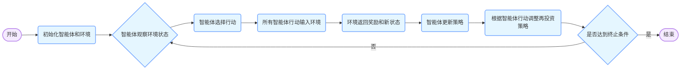

# 多智能体强化学习在优化再投资策略中的应用

> 关键词：多智能体强化学习、再投资策略、优化、马尔可夫决策过程、智能体协作

> 摘要：本文深入探讨了多智能体强化学习在优化再投资策略中的应用。首先介绍了多智能体强化学习和再投资策略的背景知识，包括目的、预期读者、文档结构和相关术语。接着阐述了核心概念及其联系，给出了原理和架构的文本示意图与 Mermaid 流程图。详细讲解了核心算法原理，并用 Python 代码进行了阐述。通过数学模型和公式进一步分析了该应用的原理，并举例说明。在项目实战部分，搭建了开发环境，给出了源代码实现及详细解读。探讨了实际应用场景，推荐了学习资源、开发工具框架和相关论文著作。最后总结了未来发展趋势与挑战，提供了常见问题解答和扩展阅读参考资料，旨在为相关领域的研究者和从业者提供全面且深入的技术指导。

## 1. 背景介绍 
### 1.1 目的和范围
在金融投资领域，再投资策略的优化一直是投资者和研究人员关注的重点。传统的再投资策略往往基于固定的规则和模型，难以适应复杂多变的市场环境。多智能体强化学习作为一种新兴的技术，能够让多个智能体在动态环境中通过与环境的交互学习最优策略。本文的目的是研究如何将多智能体强化学习应用于再投资策略的优化，探索其在提高投资收益、降低风险等方面的潜力。

本文的范围涵盖了多智能体强化学习的基本概念、核心算法原理、数学模型，以及在再投资策略优化中的具体应用。通过实际案例和代码实现，详细展示了如何利用多智能体强化学习来设计和优化再投资策略。

### 1.2 预期读者
本文预期读者包括金融领域的投资分析师、量化交易员、研究人员，以及对强化学习和人工智能在金融领域应用感兴趣的程序员和技术爱好者。这些读者应具备一定的数学基础和编程知识，熟悉基本的机器学习和强化学习概念。

### 1.3 文档结构概述
本文将按照以下结构进行组织：
- 核心概念与联系：介绍多智能体强化学习和再投资策略的核心概念，以及它们之间的联系。
- 核心算法原理 & 具体操作步骤：详细讲解多智能体强化学习的核心算法，并用 Python 代码实现。
- 数学模型和公式 & 详细讲解 & 举例说明：通过数学模型和公式深入分析多智能体强化学习在再投资策略优化中的原理，并举例说明。
- 项目实战：代码实际案例和详细解释说明：搭建开发环境，给出源代码实现，并对代码进行详细解读。
- 实际应用场景：探讨多智能体强化学习在再投资策略优化中的实际应用场景。
- 工具和资源推荐：推荐学习资源、开发工具框架和相关论文著作。
- 总结：未来发展趋势与挑战：总结多智能体强化学习在再投资策略优化中的应用现状，分析未来发展趋势和面临的挑战。
- 附录：常见问题与解答：提供常见问题的解答。
- 扩展阅读 & 参考资料：列出扩展阅读的资料和参考文献。

### 1.4 术语表
#### 1.4.1 核心术语定义
- **多智能体强化学习（Multi - Agent Reinforcement Learning，MARL）**：是强化学习的一个分支，涉及多个智能体在一个环境中进行交互和学习，每个智能体通过与环境和其他智能体的交互来最大化自己的累积奖励。
- **再投资策略（Reinvestment Strategy）**：指投资者在获得投资收益后，将收益重新投入到投资组合中的策略。
- **智能体（Agent）**：在强化学习中，智能体是能够感知环境状态并采取行动的实体。
- **环境（Environment）**：智能体所处的外部世界，智能体与环境进行交互，环境根据智能体的行动返回奖励和新的状态。
- **奖励（Reward）**：环境给予智能体的反馈信号，用于衡量智能体行动的好坏。

#### 1.4.2 相关概念解释
- **马尔可夫决策过程（Markov Decision Process，MDP）**：是一种用于描述智能体在环境中决策过程的数学模型，满足马尔可夫性质，即智能体的下一个状态只取决于当前状态和当前行动。
- **策略（Policy）**：是智能体在每个状态下选择行动的规则。
- **价值函数（Value Function）**：用于评估智能体在某个状态或状态 - 行动对下的价值，是强化学习中重要的概念。

#### 1.4.3 缩略词列表
- MARL：Multi - Agent Reinforcement Learning
- MDP：Markov Decision Process
- Q - learning：Q 学习算法

## 2. 核心概念与联系 

### 多智能体强化学习原理
多智能体强化学习是在传统强化学习基础上发展而来的。在单智能体强化学习中，一个智能体与环境进行交互，通过不断尝试不同的行动来最大化累积奖励。而在多智能体强化学习中，存在多个智能体，它们之间可能存在合作、竞争或混合的关系。

每个智能体都有自己的目标和策略，并且需要考虑其他智能体的行动对自己的影响。智能体通过观察环境状态和其他智能体的行动，选择自己的行动，环境根据所有智能体的行动返回奖励和新的状态。智能体根据奖励不断调整自己的策略，以实现自身目标的最大化。

### 再投资策略概述
再投资策略是投资管理中的重要环节。投资者在获得投资收益后，需要决定如何将这些收益重新投入到投资组合中。常见的再投资策略包括固定比例再投资、动态调整再投资等。

固定比例再投资是指按照固定的比例将收益分配到不同的资产中。动态调整再投资则根据市场情况、资产表现等因素动态调整再投资的比例。

### 两者联系
多智能体强化学习可以应用于再投资策略的优化。可以将每个投资资产看作一个智能体，这些智能体通过与市场环境（即投资环境）进行交互，学习如何调整再投资比例以最大化投资收益。

智能体之间可以进行协作，共同应对市场变化。例如，当某个资产表现不佳时，其他资产智能体可以调整自己的再投资策略，以降低整个投资组合的风险。

### 文本示意图
```plaintext
多智能体强化学习系统
|-- 智能体 1
|   |-- 策略 1
|   |-- 观察环境
|   |-- 选择行动
|-- 智能体 2
|   |-- 策略 2
|   |-- 观察环境
|   |-- 选择行动
|...
|-- 环境
|   |-- 接收所有智能体行动
|   |-- 返回奖励和新状态
|-- 再投资策略
|   |-- 根据智能体行动调整再投资比例
```

### Mermaid 流程图


## 3. 核心算法原理 & 具体操作步骤 

### 核心算法原理 - Q - learning 算法在多智能体中的扩展
Q - learning 是一种经典的强化学习算法，用于学习最优策略。在单智能体中，Q - learning 通过更新 Q 表来逼近最优动作价值函数。在多智能体环境中，每个智能体都有自己的 Q 表。

设第 $i$ 个智能体的 Q 表为 $Q_i(s_i, a_i)$，其中 $s_i$ 是该智能体观察到的状态，$a_i$ 是该智能体选择的行动。智能体的目标是最大化自己的累积奖励。

Q - learning 的更新公式为：
$$Q_i(s_i, a_i) \leftarrow Q_i(s_i, a_i) + \alpha \left[ r_i + \gamma \max_{a_i'} Q_i(s_i', a_i') - Q_i(s_i, a_i) \right]$$
其中，$\alpha$ 是学习率，$\gamma$ 是折扣因子，$r_i$ 是第 $i$ 个智能体获得的奖励，$s_i'$ 是下一个状态。

### 具体操作步骤
1. **初始化**：初始化每个智能体的 Q 表 $Q_i$，将所有值设为 0。设置学习率 $\alpha$、折扣因子 $\gamma$ 和最大迭代次数 $T$。
2. **循环迭代**：
    - 每个智能体观察当前环境状态 $s_i$。
    - 每个智能体根据自己的 Q 表和探索策略（如 $\epsilon$ - 贪心策略）选择行动 $a_i$。
    - 所有智能体的行动输入环境，环境返回奖励 $r_i$ 和新状态 $s_i'$。
    - 每个智能体根据 Q - learning 更新公式更新自己的 Q 表。
    - 根据智能体的行动调整再投资策略。
3. **终止条件**：达到最大迭代次数 $T$ 或满足其他终止条件。

### Python 源代码实现
```python
import numpy as np

# 定义智能体类
class Agent:
    def __init__(self, state_size, action_size, alpha=0.1, gamma=0.9):
        self.state_size = state_size
        self.action_size = action_size
        self.alpha = alpha
        self.gamma = gamma
        self.Q = np.zeros((state_size, action_size))

    def choose_action(self, state, epsilon=0.1):
        if np.random.uniform(0, 1) < epsilon:
            return np.random.choice(self.action_size)
        else:
            return np.argmax(self.Q[state, :])

    def update_Q(self, state, action, reward, next_state):
        target = reward + self.gamma * np.max(self.Q[next_state, :])
        self.Q[state, action] = (1 - self.alpha) * self.Q[state, action] + self.alpha * target

# 定义环境类
class Environment:
    def __init__(self, num_agents):
        self.num_agents = num_agents

    def step(self, actions):
        # 这里简单模拟环境返回奖励和新状态
        rewards = [np.random.rand() for _ in range(self.num_agents)]
        next_states = [np.random.randint(0, 10) for _ in range(self.num_agents)]
        return rewards, next_states

# 主函数
def main():
    num_agents = 3
    state_size = 10
    action_size = 5
    max_iterations = 1000

    agents = [Agent(state_size, action_size) for _ in range(num_agents)]
    env = Environment(num_agents)

    for iteration in range(max_iterations):
        states = [np.random.randint(0, state_size) for _ in range(num_agents)]
        actions = [agent.choose_action(state) for agent, state in zip(agents, states)]
        rewards, next_states = env.step(actions)

        for i in range(num_agents):
            agents[i].update_Q(states[i], actions[i], rewards[i], next_states[i])

        # 这里可以添加根据智能体行动调整再投资策略的代码

    print("训练完成")

if __name__ == "__main__":
    main()
```

## 4. 数学模型和公式 & 详细讲解 & 举例说明 

### 马尔可夫决策过程（MDP）在多智能体中的扩展
在多智能体环境中，每个智能体的决策过程可以用扩展的马尔可夫决策过程来描述。

设多智能体系统中有 $N$ 个智能体，第 $i$ 个智能体的状态空间为 $S_i$，行动空间为 $A_i$。整个系统的状态空间为 $S = S_1 \times S_2 \times \cdots \times S_N$，行动空间为 $A = A_1 \times A_2 \times \cdots \times A_N$。

状态转移概率 $P(s' | s, a)$ 表示在状态 $s$ 下采取行动 $a$ 后转移到状态 $s'$ 的概率，其中 $s \in S$，$a \in A$，$s' \in S$。

奖励函数 $R_i(s, a)$ 表示第 $i$ 个智能体在状态 $s$ 下采取行动 $a$ 获得的奖励。

### 价值函数
- **状态价值函数**：第 $i$ 个智能体的状态价值函数 $V_i^{\pi_i}(s_i)$ 表示在策略 $\pi_i$ 下，从状态 $s_i$ 开始的期望累积奖励，定义为：
$$V_i^{\pi_i}(s_i) = \mathbb{E}_{\pi_i} \left[ \sum_{t = 0}^{\infty} \gamma^t r_{i, t} | s_{i, 0} = s_i \right]$$
其中，$\gamma$ 是折扣因子，$r_{i, t}$ 是第 $i$ 个智能体在时间步 $t$ 获得的奖励。

- **动作价值函数**：第 $i$ 个智能体的动作价值函数 $Q_i^{\pi_i}(s_i, a_i)$ 表示在策略 $\pi_i$ 下，从状态 $s_i$ 采取行动 $a_i$ 开始的期望累积奖励，定义为：
$$Q_i^{\pi_i}(s_i, a_i) = \mathbb{E}_{\pi_i} \left[ \sum_{t = 0}^{\infty} \gamma^t r_{i, t} | s_{i, 0} = s_i, a_{i, 0} = a_i \right]$$

### 最优策略
最优策略 $\pi_i^*$ 是使得价值函数最大的策略，即：
$$\pi_i^*(s_i) = \arg \max_{a_i} Q_i^*(s_i, a_i)$$
其中，$Q_i^*(s_i, a_i)$ 是最优动作价值函数。

### 举例说明
假设有两个智能体，每个智能体有 2 个状态和 2 个行动。状态空间 $S_1 = \{s_{11}, s_{12}\}$，$S_2 = \{s_{21}, s_{22}\}$，行动空间 $A_1 = \{a_{11}, a_{12}\}$，$A_2 = \{a_{21}, a_{22}\}$。

状态转移概率和奖励函数可以用表格形式表示。例如，状态转移概率 $P(s_{11}', s_{21}' | s_{11}, s_{21}, a_{11}, a_{21}) = 0.8$，表示在状态 $(s_{11}, s_{21})$ 下采取行动 $(a_{11}, a_{21})$ 后转移到状态 $(s_{11}', s_{21}')$ 的概率为 0.8。

奖励函数 $R_1(s_{11}, s_{21}, a_{11}, a_{21}) = 1$，表示智能体 1 在状态 $(s_{11}, s_{21})$ 下采取行动 $(a_{11}, a_{21})$ 获得的奖励为 1。

智能体通过不断更新自己的 Q 表，学习最优策略。例如，智能体 1 观察到状态 $s_{11}$，根据 $\epsilon$ - 贪心策略选择行动 $a_{11}$，与智能体 2 的行动一起输入环境，环境返回奖励和新状态，智能体 1 然后根据 Q - learning 更新公式更新自己的 Q 表。

## 5. 项目实战：代码实际案例和详细解释说明 

### 5.1  开发环境搭建
#### 操作系统
可以选择常见的操作系统，如 Windows、Linux（如 Ubuntu）或 macOS。

#### Python 环境
安装 Python 3.7 及以上版本。可以从 Python 官方网站（https://www.python.org/downloads/）下载并安装。

#### 依赖库
安装以下必要的 Python 库：
- `numpy`：用于数值计算。可以使用以下命令安装：
```sh
pip install numpy
```

### 5.2  源代码详细实现和代码解读
```python
import numpy as np

# 定义智能体类
class Agent:
    def __init__(self, state_size, action_size, alpha=0.1, gamma=0.9):
        """
        初始化智能体
        :param state_size: 状态空间大小
        :param action_size: 行动空间大小
        :param alpha: 学习率
        :param gamma: 折扣因子
        """
        self.state_size = state_size
        self.action_size = action_size
        self.alpha = alpha
        self.gamma = gamma
        # 初始化 Q 表
        self.Q = np.zeros((state_size, action_size))

    def choose_action(self, state, epsilon=0.1):
        """
        根据 epsilon - 贪心策略选择行动
        :param state: 当前状态
        :param epsilon: 探索率
        :return: 选择的行动
        """
        if np.random.uniform(0, 1) < epsilon:
            # 探索：随机选择行动
            return np.random.choice(self.action_size)
        else:
            # 利用：选择 Q 值最大的行动
            return np.argmax(self.Q[state, :])

    def update_Q(self, state, action, reward, next_state):
        """
        根据 Q - learning 更新公式更新 Q 表
        :param state: 当前状态
        :param action: 选择的行动
        :param reward: 获得的奖励
        :param next_state: 下一个状态
        """
        target = reward + self.gamma * np.max(self.Q[next_state, :])
        self.Q[state, action] = (1 - self.alpha) * self.Q[state, action] + self.alpha * target

# 定义环境类
class Environment:
    def __init__(self, num_agents):
        """
        初始化环境
        :param num_agents: 智能体数量
        """
        self.num_agents = num_agents

    def step(self, actions):
        """
        执行一步行动，返回奖励和新状态
        :param actions: 所有智能体的行动
        :return: 奖励列表和新状态列表
        """
        # 这里简单模拟环境返回奖励和新状态
        rewards = [np.random.rand() for _ in range(self.num_agents)]
        next_states = [np.random.randint(0, 10) for _ in range(self.num_agents)]
        return rewards, next_states

# 主函数
def main():
    num_agents = 3
    state_size = 10
    action_size = 5
    max_iterations = 1000

    # 初始化智能体
    agents = [Agent(state_size, action_size) for _ in range(num_agents)]
    # 初始化环境
    env = Environment(num_agents)

    for iteration in range(max_iterations):
        # 随机初始化状态
        states = [np.random.randint(0, state_size) for _ in range(num_agents)]
        # 每个智能体选择行动
        actions = [agent.choose_action(state) for agent, state in zip(agents, states)]
        # 执行行动，获取奖励和新状态
        rewards, next_states = env.step(actions)

        # 每个智能体更新 Q 表
        for i in range(num_agents):
            agents[i].update_Q(states[i], actions[i], rewards[i], next_states[i])

        # 这里可以添加根据智能体行动调整再投资策略的代码

    print("训练完成")

if __name__ == "__main__":
    main()
```

### 5.3  代码解读与分析
- **智能体类（Agent）**：
  - `__init__` 方法：初始化智能体的状态空间大小、行动空间大小、学习率、折扣因子和 Q 表。
  - `choose_action` 方法：根据 $\epsilon$ - 贪心策略选择行动。当随机数小于 $\epsilon$ 时，随机选择行动进行探索；否则，选择 Q 值最大的行动进行利用。
  - `update_Q` 方法：根据 Q - learning 更新公式更新 Q 表。

- **环境类（Environment）**：
  - `__init__` 方法：初始化环境的智能体数量。
  - `step` 方法：模拟环境执行一步行动，返回奖励和新状态。这里简单地使用随机数生成奖励和新状态。

- **主函数（main）**：
  - 初始化智能体和环境。
  - 进行多次迭代，每次迭代中，每个智能体选择行动，执行行动后获取奖励和新状态，然后更新 Q 表。
  - 可以在迭代过程中添加根据智能体行动调整再投资策略的代码。

## 6. 实际应用场景 
### 投资组合管理
在投资组合管理中，多智能体强化学习可以用于优化再投资策略。每个资产可以看作一个智能体，智能体通过学习市场环境的变化，动态调整再投资比例，以实现投资组合的收益最大化和风险最小化。

例如，在股票投资组合中，不同的股票智能体可以根据股票的价格走势、财务指标等因素，决定将多少收益再投资到该股票中。当某只股票表现良好时，对应的智能体可以增加再投资比例；当某只股票表现不佳时，智能体可以减少再投资比例。

### 基金再投资
对于基金投资者来说，多智能体强化学习可以帮助优化基金的再投资策略。不同类型的基金（如股票型基金、债券型基金、混合型基金）可以看作不同的智能体。

智能体可以根据市场利率、宏观经济指标、基金的历史表现等因素，调整基金分红的再投资比例。例如，在市场利率较低时，股票型基金智能体可以增加再投资比例，以获取更高的收益；在市场利率较高时，债券型基金智能体可以增加再投资比例。

### 保险资金再投资
保险资金的再投资需要考虑安全性、收益性和流动性。多智能体强化学习可以应用于保险资金的再投资策略优化。

不同的投资资产（如债券、股票、不动产等）可以看作智能体。智能体根据保险资金的负债特性、市场风险等因素，调整再投资比例。例如，对于长期负债的保险资金，不动产智能体可以适当增加再投资比例，以获取长期稳定的收益。

## 7. 工具和资源推荐
### 7.1 学习资源推荐
#### 7.1.1 书籍推荐
- 《强化学习：原理与Python实现》：这本书详细介绍了强化学习的基本原理和算法，包括 Q - learning、策略梯度算法等，并给出了 Python 代码实现。
- 《多智能体系统：算法、博弈论和逻辑基础》：全面介绍了多智能体系统的理论和应用，包括多智能体强化学习的相关内容。
- 《金融数学》：涵盖了金融领域的数学模型和方法，对于理解再投资策略的数学原理有很大帮助。

#### 7.1.2 在线课程
- Coursera 上的“强化学习专项课程”：由 DeepMind 的研究人员授课，系统地介绍了强化学习的理论和实践。
- edX 上的“多智能体系统”课程：深入讲解了多智能体系统的核心概念和算法。
- Udemy 上的“量化交易与机器学习”课程：结合了金融投资和机器学习的知识，介绍了如何使用机器学习算法优化投资策略。

#### 7.1.3 技术博客和网站
- OpenAI 博客：提供了最新的人工智能和强化学习研究成果和技术文章。
- Towards Data Science：有很多关于强化学习和金融领域应用的高质量文章。
- arXiv：可以查找最新的学术论文，了解多智能体强化学习在金融领域的研究进展。

### 7.2 开发工具框架推荐
#### 7.2.1 IDE和编辑器
- PyCharm：是一款专业的 Python 集成开发环境，具有代码自动补全、调试、版本控制等功能，适合开发复杂的 Python 项目。
- Jupyter Notebook：可以将代码、文本、图像等内容整合在一起，方便进行代码测试和数据分析，适合快速验证算法和模型。

#### 7.2.2 调试和性能分析工具
- pdb：Python 内置的调试器，可以帮助开发者定位代码中的问题。
- cProfile：用于分析 Python 代码的性能，找出代码中的性能瓶颈。

#### 7.2.3 相关框架和库
- Stable Baselines：是一个用于强化学习的开源库，提供了多种强化学习算法的实现，方便开发者快速搭建强化学习模型。
- PettingZoo：是一个用于多智能体强化学习的环境库，提供了多种多智能体环境，如多人游戏、机器人协作等。

### 7.3 相关论文著作推荐
#### 7.3.1 经典论文
- “Q - learning”：首次提出了 Q - learning 算法，是强化学习领域的经典论文。
- “Multi - Agent Reinforcement Learning: A Critical Survey”：对多智能体强化学习的研究进行了全面的综述。

#### 7.3.2 最新研究成果
- 在 arXiv 上搜索“Multi - Agent Reinforcement Learning in Finance”可以找到最新的关于多智能体强化学习在金融领域应用的研究成果。

#### 7.3.3 应用案例分析
- 一些金融科技公司的研究报告和案例分析，介绍了如何使用多智能体强化学习优化投资策略和风险管理。

## 8. 总结：未来发展趋势与挑战
### 未来发展趋势
- **与深度学习的融合**：多智能体强化学习与深度学习的结合将是未来的发展趋势。深度学习可以用于处理复杂的环境状态和行动空间，提高智能体的学习能力和决策能力。
- **跨领域应用**：多智能体强化学习在金融领域的应用将不断拓展到其他领域，如物流、交通、医疗等。在这些领域中，多智能体强化学习可以用于优化资源分配、调度和决策。
- **智能体协作与竞争机制的优化**：研究更加高效的智能体协作和竞争机制，提高多智能体系统的整体性能。例如，设计更加合理的奖励机制，促进智能体之间的合作。

### 挑战
- **环境建模的复杂性**：在实际应用中，环境往往非常复杂，难以准确建模。例如，金融市场受到多种因素的影响，如宏观经济指标、政策变化、投资者情绪等，如何准确地描述这些因素对投资环境的影响是一个挑战。
- **智能体之间的通信和协调**：在多智能体系统中，智能体之间的通信和协调是一个关键问题。如何设计高效的通信协议和协调机制，确保智能体之间能够有效地合作和竞争，是需要解决的难题。
- **数据隐私和安全**：在金融领域应用多智能体强化学习时，涉及大量的敏感数据，如投资者的资产信息、交易记录等。如何保护数据的隐私和安全，防止数据泄露和滥用，是一个重要的挑战。

## 9. 附录：常见问题与解答
### Q1：多智能体强化学习与单智能体强化学习有什么区别？
A1：单智能体强化学习只有一个智能体与环境进行交互，而多智能体强化学习有多个智能体，这些智能体之间可能存在合作、竞争或混合的关系。多智能体强化学习需要考虑其他智能体的行动对自己的影响，学习过程更加复杂。

### Q2：如何选择合适的学习率和折扣因子？
A2：学习率 $\alpha$ 控制了智能体更新 Q 表的速度，折扣因子 $\gamma$ 控制了未来奖励的重要性。一般来说，学习率可以在 0.1 - 0.5 之间选择，折扣因子可以在 0.9 - 0.99 之间选择。可以通过实验来调整这些参数，找到最优的值。

### Q3：在实际应用中，如何获取环境的奖励和状态？
A3：在金融领域，环境的奖励可以根据投资收益、风险指标等因素来定义。例如，奖励可以是投资组合的收益率减去风险成本。环境的状态可以包括市场价格、成交量、财务指标等信息。可以通过金融数据提供商获取这些数据。

### Q4：多智能体强化学习在再投资策略优化中的效果如何评估？
A4：可以使用多种指标来评估多智能体强化学习在再投资策略优化中的效果，如投资收益率、夏普比率、最大回撤等。可以将优化后的再投资策略与传统的再投资策略进行对比，评估其性能提升。

## 10. 扩展阅读 & 参考资料
### 扩展阅读
- 《人工智能：一种现代方法》：全面介绍了人工智能的各个领域，包括强化学习和多智能体系统。
- 《机器学习》：对机器学习的基本概念、算法和应用进行了系统的阐述。
- 《金融风险管理》：介绍了金融领域的风险管理方法和技术，对于理解再投资策略中的风险控制有帮助。

### 参考资料
- Sutton, R. S., & Barto, A. G. (2018). Reinforcement learning: An introduction. MIT press.
- Shoham, Y., & Leyton - Brown, K. (2008). Multiagent systems: Algorithmic, game - theoretic, and logical foundations. Cambridge University Press.
- 相关金融数据提供商的官方网站，如 Wind、Bloomberg 等。