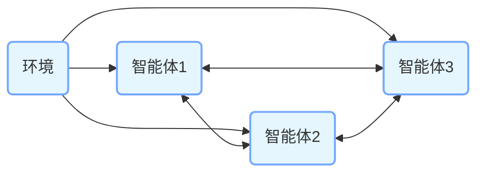

# 多智能体系统优化价值投资的现金流折现模型

> 关键词：多智能体系统、价值投资、现金流折现模型、优化、金融分析

> 摘要：本文聚焦于利用多智能体系统对价值投资中的现金流折现模型进行优化。首先介绍了研究的背景、目的和范围，明确预期读者和文档结构。接着阐述了多智能体系统、价值投资和现金流折现模型的核心概念及其联系，给出了相应的原理和架构示意图。详细讲解了用于优化的核心算法原理，通过Python源代码进行了具体操作步骤的展示。对现金流折现模型的数学公式进行了深入分析和举例说明。通过项目实战，展示了开发环境搭建、源代码实现及解读。探讨了该优化模型在实际金融市场中的应用场景，推荐了相关的学习资源、开发工具框架和论文著作。最后总结了未来发展趋势与挑战，并给出常见问题解答和扩展阅读参考资料。

## 1. 背景介绍 
### 1.1 目的和范围
在价值投资领域，现金流折现模型（DCF）是一种广泛应用的估值方法，它通过预测企业未来的现金流并将其折现到当前来评估企业的内在价值。然而，传统的现金流折现模型存在一些局限性，如对未来现金流预测的准确性不足、难以考虑复杂的市场动态和不确定性等。本研究的目的是引入多智能体系统（MAS）来优化现金流折现模型，提高估值的准确性和可靠性。

本研究的范围主要包括多智能体系统的原理和应用、现金流折现模型的基本理论和改进、利用多智能体系统对现金流折现模型进行优化的算法和实现，以及该优化模型在实际价值投资中的应用案例分析。

### 1.2 预期读者
本文的预期读者包括金融分析师、投资经理、量化投资爱好者、计算机科学领域中对人工智能在金融领域应用感兴趣的研究人员和开发者，以及相关专业的学生。

### 1.3 文档结构概述
本文将按照以下结构进行组织：
- 核心概念与联系：介绍多智能体系统、价值投资和现金流折现模型的核心概念，并阐述它们之间的联系。
- 核心算法原理 & 具体操作步骤：详细讲解利用多智能体系统优化现金流折现模型的核心算法，并给出Python源代码示例。
- 数学模型和公式 & 详细讲解 & 举例说明：对现金流折现模型的数学公式进行深入分析，并通过具体例子说明优化后的模型如何应用。
- 项目实战：代码实际案例和详细解释说明：通过一个实际的项目案例，展示开发环境搭建、源代码实现和代码解读。
- 实际应用场景：探讨优化后的现金流折现模型在实际金融市场中的应用场景。
- 工具和资源推荐：推荐相关的学习资源、开发工具框架和论文著作。
- 总结：未来发展趋势与挑战：总结本研究的主要成果，分析未来的发展趋势和面临的挑战。
- 附录：常见问题与解答：对常见问题进行解答。
- 扩展阅读 & 参考资料：提供扩展阅读的建议和参考资料。

### 1.4 术语表
#### 1.4.1 核心术语定义
- **多智能体系统（Multi - Agent System，MAS）**：由多个智能体组成的系统，这些智能体可以相互通信、协作和竞争，以实现共同或各自的目标。
- **价值投资（Value Investing）**：一种投资策略，通过分析企业的内在价值，寻找被低估的股票进行投资。
- **现金流折现模型（Discounted Cash Flow Model，DCF）**：一种估值方法，通过预测企业未来的现金流并将其折现到当前来评估企业的内在价值。
- **智能体（Agent）**：具有自主性、反应性、社会性和主动性的实体，能够感知环境并采取行动以实现自身目标。

#### 1.4.2 相关概念解释
- **自主性**：智能体能够在没有外部干预的情况下自主地做出决策和行动。
- **反应性**：智能体能够感知环境的变化并及时做出反应。
- **社会性**：智能体能够与其他智能体进行通信和协作。
- **主动性**：智能体能够主动地寻找机会和解决问题。

#### 1.4.3 缩略词列表
- MAS：Multi - Agent System
- DCF：Discounted Cash Flow Model

## 2. 核心概念与联系 

### 2.1 多智能体系统原理
多智能体系统由多个智能体组成，每个智能体都有自己的目标、知识和能力。智能体之间通过通信机制进行信息交换和协作，以实现共同或各自的目标。多智能体系统的架构可以分为集中式、分布式和混合式三种类型。

集中式架构中，有一个中央控制器负责协调所有智能体的行动；分布式架构中，智能体之间通过对等的通信方式进行协作，没有中央控制器；混合式架构则结合了集中式和分布式的特点。

下面是多智能体系统的架构示意图：



### 2.2 价值投资与现金流折现模型
价值投资的核心思想是寻找被市场低估的股票，通过长期持有来获得超额收益。现金流折现模型是价值投资中常用的估值方法，其基本原理是将企业未来的现金流折现到当前，得到企业的内在价值。

现金流折现模型的公式为：

$$V = \sum_{t = 1}^{n}\frac{CF_t}{(1 + r)^t}+\frac{TV}{(1 + r)^n}$$

其中，$V$ 是企业的内在价值，$CF_t$ 是第 $t$ 期的现金流，$r$ 是折现率，$n$ 是预测期数，$TV$ 是终值。

### 2.3 多智能体系统与现金流折现模型的联系
多智能体系统可以用于优化现金流折现模型。在传统的现金流折现模型中，未来现金流的预测和折现率的确定往往依赖于主观判断和经验估计，存在一定的误差。多智能体系统可以通过多个智能体的协作和信息共享，更准确地预测未来现金流和确定折现率。

例如，一些智能体可以负责收集和分析宏观经济数据，预测市场趋势；另一些智能体可以负责分析企业的财务报表，评估企业的盈利能力和风险水平。通过智能体之间的协作，可以提高现金流折现模型的准确性和可靠性。

## 3. 核心算法原理 & 具体操作步骤 

### 3.1 核心算法原理
本研究采用的核心算法是基于多智能体系统的强化学习算法。强化学习是一种机器学习方法，智能体通过与环境进行交互，根据环境反馈的奖励信号来学习最优的行动策略。

在多智能体系统优化现金流折现模型中，每个智能体代表一个决策单元，负责预测未来现金流的某个方面或确定折现率的某个因素。智能体之间通过通信机制进行信息共享和协作，以实现整体的优化目标。

### 3.2 具体操作步骤
下面是利用多智能体系统优化现金流折现模型的具体操作步骤：

#### 步骤1：初始化智能体
初始化多个智能体，每个智能体具有不同的目标和能力。例如，一些智能体负责预测宏观经济指标，如GDP增长率、通货膨胀率等；另一些智能体负责分析企业的财务数据，如营业收入、净利润等。

#### 步骤2：智能体与环境交互
每个智能体与环境进行交互，收集相关信息。例如，负责预测宏观经济指标的智能体可以从经济数据库中获取数据，负责分析企业财务数据的智能体可以从企业的财务报表中获取数据。

#### 步骤3：智能体之间通信和协作
智能体之间通过通信机制进行信息共享和协作。例如，负责预测宏观经济指标的智能体可以将预测结果发送给负责分析企业财务数据的智能体，后者可以根据宏观经济指标的预测结果调整对企业未来现金流的预测。

#### 步骤4：更新智能体的策略
每个智能体根据环境反馈的奖励信号和其他智能体提供的信息，更新自己的行动策略。奖励信号可以根据预测的准确性和优化目标来设计。

#### 步骤5：计算优化后的现金流折现模型
根据智能体的预测结果和确定的折现率，计算优化后的现金流折现模型。

### 3.3 Python源代码示例
```python
import numpy as np

# 定义智能体类
class Agent:
    def __init__(self, id):
        self.id = id
        self.strategy = np.random.rand()  # 初始化策略

    def interact_with_environment(self):
        # 模拟与环境交互，获取信息
        return np.random.rand()

    def communicate_with_agents(self, other_agents):
        # 模拟与其他智能体通信，共享信息
        information = []
        for agent in other_agents:
            if agent.id != self.id:
                information.append(agent.strategy)
        return information

    def update_strategy(self, reward, information):
        # 根据奖励和其他智能体的信息更新策略
        self.strategy = self.strategy + 0.1 * (reward - np.mean(information))

# 定义多智能体系统类
class MultiAgentSystem:
    def __init__(self, num_agents):
        self.agents = [Agent(i) for i in range(num_agents)]

    def run(self, num_steps):
        for step in range(num_steps):
            for agent in self.agents:
                # 与环境交互
                observation = agent.interact_with_environment()
                # 与其他智能体通信
                information = agent.communicate_with_agents(self.agents)
                # 计算奖励
                reward = np.random.rand()
                # 更新策略
                agent.update_strategy(reward, information)

# 定义现金流折现模型类
class DCFModel:
    def __init__(self, cash_flows, discount_rate):
        self.cash_flows = cash_flows
        self.discount_rate = discount_rate

    def calculate_value(self):
        n = len(self.cash_flows)
        value = 0
        for t in range(n):
            value += self.cash_flows[t] / ((1 + self.discount_rate) ** t)
        return value

# 主程序
if __name__ == "__main__":
    # 初始化多智能体系统
    mas = MultiAgentSystem(num_agents=5)
    mas.run(num_steps=10)

    # 初始化现金流折现模型
    cash_flows = [100, 120, 150, 180, 200]
    discount_rate = 0.1
    dcf_model = DCFModel(cash_flows, discount_rate)

    # 计算企业价值
    value = dcf_model.calculate_value()
    print("企业的内在价值为:", value)
```

## 4. 数学模型和公式 & 详细讲解 & 举例说明 

### 4.1 现金流折现模型的数学公式
现金流折现模型的基本公式为：

$$V = \sum_{t = 1}^{n}\frac{CF_t}{(1 + r)^t}+\frac{TV}{(1 + r)^n}$$

其中：
- $V$ 是企业的内在价值。
- $CF_t$ 是第 $t$ 期的现金流，它可以是企业的自由现金流、股权现金流等。
- $r$ 是折现率，通常采用加权平均资本成本（WACC）。
- $n$ 是预测期数。
- $TV$ 是终值，用于估计预测期之后的现金流价值。终值的计算方法有多种，常见的是使用永续增长模型：

$$TV=\frac{CF_{n + 1}}{r - g}$$

其中，$CF_{n + 1}$ 是预测期结束后下一期的现金流，$g$ 是永续增长率。

### 4.2 详细讲解
- **现金流的预测**：现金流的预测是现金流折现模型的关键步骤。预测现金流需要考虑企业的历史业绩、行业发展趋势、宏观经济环境等因素。可以采用时间序列分析、回归分析等方法进行预测。
- **折现率的确定**：折现率反映了投资者对投资风险的要求。加权平均资本成本（WACC）是常用的折现率计算方法，其公式为：

$$WACC = w_e\times r_e+w_d\times r_d\times(1 - T)$$

其中，$w_e$ 和 $w_d$ 分别是股权资本和债务资本的权重，$r_e$ 是股权资本成本，$r_d$ 是债务资本成本，$T$ 是企业所得税税率。

- **终值的计算**：终值的计算对企业的内在价值有较大影响。永续增长模型假设企业在预测期之后以固定的增长率持续增长。永续增长率的选择需要谨慎，一般根据行业的长期增长率和企业的竞争优势来确定。

### 4.3 举例说明
假设一家企业未来5年的自由现金流预测如下：

| 年份 | 自由现金流（万元） |
|------|--------------------|
| 1    | 100                |
| 2    | 120                |
| 3    | 150                |
| 4    | 180                |
| 5    | 200                |

预测期结束后，企业的自由现金流预计以3%的增长率永续增长。折现率为10%。

首先，计算预测期内现金流的现值：

$$PV_{1 - 5}=\frac{100}{(1 + 0.1)^1}+\frac{120}{(1 + 0.1)^2}+\frac{150}{(1 + 0.1)^3}+\frac{180}{(1 + 0.1)^4}+\frac{200}{(1 + 0.1)^5}$$

```python
import numpy as np

cash_flows = [100, 120, 150, 180, 200]
discount_rate = 0.1
n = len(cash_flows)

pv_1_5 = 0
for t in range(n):
    pv_1_5 += cash_flows[t] / ((1 + discount_rate) ** (t + 1))

print("预测期内现金流的现值:", pv_1_5)
```

然后，计算终值：

$$CF_6 = 200\times(1 + 0.03)=206$$

$$TV=\frac{206}{0.1 - 0.03}\approx2942.86$$

终值的现值为：

$$PV_{TV}=\frac{2942.86}{(1 + 0.1)^5}$$

```python
cf_6 = 200 * (1 + 0.03)
g = 0.03
tv = cf_6 / (discount_rate - g)
pv_tv = tv / ((1 + discount_rate) ** 5)

print("终值的现值:", pv_tv)
```

最后，计算企业的内在价值：

$$V = PV_{1 - 5}+PV_{TV}$$

```python
value = pv_1_5 + pv_tv
print("企业的内在价值:", value)
```

通过上述计算，我们可以得到该企业的内在价值。

## 5. 项目实战：代码实际案例和详细解释说明 

### 5.1  开发环境搭建
为了实现多智能体系统优化现金流折现模型的项目，我们需要搭建以下开发环境：

#### 操作系统
可以选择Windows、Linux或macOS等主流操作系统。

#### 编程语言
使用Python作为主要编程语言，因为Python具有丰富的科学计算库和机器学习库，适合进行数据处理和模型开发。

#### 开发工具
推荐使用Anaconda作为Python的发行版，它包含了许多常用的科学计算库和工具。可以使用Jupyter Notebook或PyCharm等集成开发环境进行代码编写和调试。

#### 相关库的安装
需要安装以下Python库：
- `numpy`：用于数值计算。
- `pandas`：用于数据处理和分析。
- `scikit - learn`：用于机器学习算法的实现。
- `matplotlib`：用于数据可视化。

可以使用以下命令进行安装：

```sh
pip install numpy pandas scikit-learn matplotlib
```

### 5.2  源代码详细实现和代码解读
下面是一个完整的项目代码示例，实现了多智能体系统优化现金流折现模型的功能：

```python
import numpy as np
import pandas as pd
from sklearn.linear_model import LinearRegression
import matplotlib.pyplot as plt

# 定义智能体类
class Agent:
    def __init__(self, id, data):
        self.id = id
        self.data = data
        self.model = LinearRegression()
        self.strategy = np.random.rand()

    def train_model(self, X, y):
        self.model.fit(X, y)

    def predict(self, X):
        return self.model.predict(X)

    def interact_with_environment(self):
        # 模拟与环境交互，获取数据
        return self.data.sample(1)

    def communicate_with_agents(self, other_agents):
        # 模拟与其他智能体通信，共享信息
        information = []
        for agent in other_agents:
            if agent.id != self.id:
                information.append(agent.strategy)
        return information

    def update_strategy(self, reward, information):
        # 根据奖励和其他智能体的信息更新策略
        self.strategy = self.strategy + 0.1 * (reward - np.mean(information))

# 定义多智能体系统类
class MultiAgentSystem:
    def __init__(self, agents):
        self.agents = agents

    def run(self, num_steps):
        for step in range(num_steps):
            for agent in self.agents:
                # 与环境交互
                observation = agent.interact_with_environment()
                X = observation.drop('cash_flow', axis=1)
                y = observation['cash_flow']
                agent.train_model(X, y)
                # 与其他智能体通信
                information = agent.communicate_with_agents(self.agents)
                # 计算奖励
                reward = np.random.rand()
                # 更新策略
                agent.update_strategy(reward, information)

# 定义现金流折现模型类
class DCFModel:
    def __init__(self, cash_flows, discount_rate):
        self.cash_flows = cash_flows
        self.discount_rate = discount_rate

    def calculate_value(self):
        n = len(self.cash_flows)
        value = 0
        for t in range(n):
            value += self.cash_flows[t] / ((1 + self.discount_rate) ** t)
        return value

# 主程序
if __name__ == "__main__":
    # 生成模拟数据
    data = pd.DataFrame({
        'gdp_growth': np.random.rand(100),
        'inflation': np.random.rand(100),
        'cash_flow': np.random.rand(100)
    })

    # 初始化智能体
    agent1 = Agent(1, data)
    agent2 = Agent(2, data)
    agents = [agent1, agent2]

    # 初始化多智能体系统
    mas = MultiAgentSystem(agents)
    mas.run(num_steps=10)

    # 预测现金流
    cash_flows = []
    for agent in agents:
        X = data.drop('cash_flow', axis=1)
        cash_flows.extend(agent.predict(X))

    # 初始化现金流折现模型
    discount_rate = 0.1
    dcf_model = DCFModel(cash_flows, discount_rate)

    # 计算企业价值
    value = dcf_model.calculate_value()
    print("企业的内在价值为:", value)

    # 数据可视化
    plt.plot(cash_flows)
    plt.xlabel('Period')
    plt.ylabel('Cash Flow')
    plt.title('Predicted Cash Flows')
    plt.show()
```

### 5.3  代码解读与分析
#### 智能体类（`Agent`）
- `__init__` 方法：初始化智能体的ID、数据、线性回归模型和策略。
- `train_model` 方法：使用线性回归模型对数据进行训练。
- `predict` 方法：使用训练好的模型进行预测。
- `interact_with_environment` 方法：模拟与环境交互，从数据中随机抽取一个样本。
- `communicate_with_agents` 方法：模拟与其他智能体通信，共享策略信息。
- `update_strategy` 方法：根据奖励和其他智能体的信息更新策略。

#### 多智能体系统类（`MultiAgentSystem`）
- `__init__` 方法：初始化多智能体系统，接收智能体列表作为参数。
- `run` 方法：运行多智能体系统，每个智能体与环境交互、训练模型、与其他智能体通信、更新策略。

#### 现金流折现模型类（`DCFModel`）
- `__init__` 方法：初始化现金流折现模型，接收现金流列表和折现率作为参数。
- `calculate_value` 方法：计算企业的内在价值。

#### 主程序
- 生成模拟数据，包含GDP增长率、通货膨胀率和现金流。
- 初始化两个智能体，并将它们添加到多智能体系统中。
- 运行多智能体系统，进行10步迭代。
- 每个智能体对数据进行预测，得到现金流列表。
- 初始化现金流折现模型，计算企业的内在价值。
- 使用 `matplotlib` 库对预测的现金流进行可视化。

通过这个项目实战，我们可以看到如何使用多智能体系统优化现金流折现模型，提高现金流预测的准确性，从而更准确地评估企业的内在价值。

## 6. 实际应用场景 
### 6.1 股票投资
在股票投资中，投资者可以使用多智能体系统优化的现金流折现模型来评估股票的内在价值。通过准确预测企业的未来现金流和确定合理的折现率，投资者可以找到被低估的股票进行投资。例如，投资者可以使用宏观经济智能体预测宏观经济趋势，使用财务分析智能体分析企业的财务状况，然后综合考虑这些因素来优化现金流折现模型，从而做出更明智的投资决策。

### 6.2 企业并购
在企业并购中，收购方需要评估目标企业的价值。多智能体系统优化的现金流折现模型可以帮助收购方更准确地预测目标企业的未来现金流，考虑各种不确定性因素，从而确定合理的收购价格。例如，在评估目标企业的市场竞争力时，可以使用市场分析智能体；在评估目标企业的技术创新能力时，可以使用技术分析智能体。通过多智能体的协作，可以提高估值的准确性和可靠性。

### 6.3 项目投资评估
对于企业的项目投资决策，多智能体系统优化的现金流折现模型可以用于评估项目的可行性和盈利能力。企业可以使用不同的智能体来预测项目的市场需求、成本结构、技术风险等因素，然后将这些信息整合到现金流折现模型中，计算项目的净现值和内部收益率等指标，从而决定是否投资该项目。

### 6.4 风险管理
在金融风险管理中，多智能体系统优化的现金流折现模型可以用于评估资产的价值和风险。通过准确预测资产的未来现金流和考虑市场波动等因素，金融机构可以更好地管理资产组合的风险。例如，银行可以使用信用风险智能体评估借款人的信用状况，使用市场风险智能体预测市场利率和汇率的变化，然后将这些信息应用到现金流折现模型中，评估贷款和投资的风险。

## 7. 工具和资源推荐
### 7.1 学习资源推荐
#### 7.1.1 书籍推荐
- 《多智能体系统：原理与编程》：全面介绍了多智能体系统的基本原理、算法和编程实现，适合初学者和有一定基础的读者。
- 《价值投资：从格雷厄姆到巴菲特》：深入阐述了价值投资的理论和实践，包括现金流折现模型的应用，是价值投资领域的经典著作。
- 《Python数据分析实战》：介绍了Python在数据分析中的应用，包括数据处理、模型建立和可视化等方面的内容，对于使用Python实现多智能体系统和现金流折现模型非常有帮助。

#### 7.1.2 在线课程
- Coursera上的“Multi - Agent Systems”课程：由知名教授授课，系统讲解了多智能体系统的理论和应用。
- edX上的“Value Investing: Principles into Practice”课程：提供了价值投资的实践指导，包括现金流折现模型的实际应用案例。
- 慕课网上的“Python数据分析与挖掘实战”课程：详细介绍了Python在数据分析和挖掘中的应用，适合学习如何使用Python进行金融数据分析。

#### 7.1.3 技术博客和网站
- Towards Data Science：一个专注于数据科学和机器学习的博客平台，有许多关于多智能体系统和金融数据分析的文章。
- QuantNet：一个量化投资社区，提供了丰富的量化投资知识和技术资源，包括现金流折现模型的讨论和应用案例。
- 知乎：有许多关于多智能体系统、价值投资和金融分析的问题和解答，可以从中获取不同的观点和经验。

### 7.2 开发工具框架推荐
#### 7.2.1 IDE和编辑器
- PyCharm：一款功能强大的Python集成开发环境，提供了代码编辑、调试、版本控制等功能，适合大型项目的开发。
- Jupyter Notebook：一个交互式的开发环境，支持代码、文本、图表等多种元素的混合展示，适合进行数据分析和模型实验。
- Visual Studio Code：一款轻量级的代码编辑器，支持多种编程语言和插件扩展，对于快速开发和调试Python代码非常方便。

#### 7.2.2 调试和性能分析工具
- PDB：Python自带的调试器，可以帮助开发者定位和解决代码中的问题。
- cProfile：Python的性能分析工具，可以分析代码的运行时间和函数调用情况，帮助优化代码性能。
- Spyder：一个集成了调试和性能分析功能的Python开发环境，适合进行科学计算和数据分析。

#### 7.2.3 相关框架和库
- Mesa：一个用于构建多智能体系统的Python框架，提供了丰富的智能体类和仿真工具，方便开发者快速实现多智能体系统。
- Scikit - learn：一个常用的机器学习库，提供了多种机器学习算法和工具，对于构建智能体的预测模型非常有用。
- Pandas：一个强大的数据处理和分析库，支持数据的读取、清洗、转换和分析，是进行金融数据分析的必备工具。

### 7.3 相关论文著作推荐
#### 7.3.1 经典论文
- “Multi - Agent Systems: A Survey from a Machine Learning Perspective”：从机器学习的角度对多智能体系统进行了全面的综述，介绍了多智能体系统的基本概念、算法和应用。
- “The Theory of Investment Value”：由约翰·伯尔·威廉姆斯（John Burr Williams）撰写，首次提出了现金流折现模型的理论，是价值投资领域的经典论文。
- “Efficient Capital Markets: A Review of Theory and Empirical Work”：由尤金·法玛（Eugene F. Fama）撰写，提出了有效市场假说，对金融市场的定价和投资决策产生了深远影响。

#### 7.3.2 最新研究成果
- 关注顶级金融和计算机科学期刊，如《Journal of Financial Economics》、《Artificial Intelligence》等，这些期刊经常发表关于多智能体系统在金融领域应用和现金流折现模型优化的最新研究成果。
- 参加国际学术会议，如IJCAI（国际人工智能联合会议）、AAAI（美国人工智能协会会议）等，了解最新的学术动态和研究进展。

#### 7.3.3 应用案例分析
- 阅读金融机构和投资公司的研究报告，了解他们如何使用多智能体系统和现金流折现模型进行投资决策和风险管理。
- 分析上市公司的年报和财务报表，了解企业如何评估自身的价值和进行项目投资决策，从中学习现金流折现模型的实际应用方法。

## 8. 总结：未来发展趋势与挑战
### 8.1 未来发展趋势
#### 智能化程度不断提高
随着人工智能技术的不断发展，多智能体系统将变得更加智能化。智能体将具备更强的学习能力、推理能力和决策能力，能够更好地适应复杂多变的市场环境。例如，智能体可以自动学习市场规律，根据不同的市场情况调整预测模型和策略。

#### 与其他技术的融合
多智能体系统将与区块链、物联网等技术进行深度融合。区块链技术可以提供安全可靠的信息共享和交易平台，物联网技术可以提供更丰富的市场数据和环境信息。通过融合这些技术，多智能体系统可以更好地优化现金流折现模型，提高估值的准确性和可靠性。

#### 应用领域不断拓展
多智能体系统优化的现金流折现模型将在更多的领域得到应用，如房地产投资、能源项目评估、供应链金融等。随着应用领域的拓展，该模型将不断适应不同领域的特点和需求，为各行业的投资决策和风险管理提供有力支持。

### 8.2 挑战
#### 数据质量和可用性
多智能体系统的性能和优化效果很大程度上依赖于数据的质量和可用性。在实际应用中，获取准确、完整、及时的数据往往是一个挑战。例如，宏观经济数据可能存在统计误差，企业财务数据可能存在造假等问题。此外，数据的隐私和安全问题也需要得到重视。

#### 模型的复杂性和可解释性
多智能体系统和现金流折现模型本身就具有一定的复杂性，当两者结合时，模型的复杂性会进一步增加。复杂的模型可能导致计算成本高、训练时间长等问题。同时，模型的可解释性也是一个挑战，投资者和决策者需要理解模型的决策过程和结果，以便做出合理的决策。

#### 市场的不确定性和动态性
金融市场具有高度的不确定性和动态性，市场情况随时可能发生变化。多智能体系统需要能够及时感知市场变化，并快速调整策略和模型。然而，预测市场的不确定性是非常困难的，如何提高模型对市场变化的适应性是一个亟待解决的问题。

## 9. 附录：常见问题与解答
### 9.1 多智能体系统的智能体数量如何确定？
智能体的数量需要根据具体的应用场景和问题的复杂程度来确定。一般来说，如果问题比较复杂，需要考虑更多的因素和信息，那么可以增加智能体的数量。但是，智能体数量过多也会导致系统的复杂性增加，通信和协作成本提高。因此，需要在系统性能和复杂性之间进行平衡。

### 9.2 现金流折现模型中的折现率如何确定才更合理？
折现率的确定需要综合考虑多种因素，如市场利率、企业的风险水平、行业的平均收益率等。常用的方法是使用加权平均资本成本（WACC），它考虑了股权资本和债务资本的成本。此外，还可以根据企业的具体情况和市场环境进行适当的调整。例如，如果企业的风险较高，可以适当提高折现率；如果市场利率较低，可以适当降低折现率。

### 9.3 多智能体系统在实际应用中如何保证智能体之间的协作效果？
为了保证智能体之间的协作效果，需要设计合理的通信机制和协作策略。通信机制可以采用消息传递、共享内存等方式，确保智能体之间能够及时、准确地共享信息。协作策略可以根据智能体的目标和任务进行设计，例如采用合作博弈、协商机制等方法，使智能体能够在实现自身目标的同时，实现整体的优化目标。

### 9.4 如何评估多智能体系统优化的现金流折现模型的性能？
可以从多个方面评估该模型的性能，如预测的准确性、估值的可靠性、计算效率等。预测的准确性可以通过比较预测值和实际值的误差来评估，常用的指标有均方误差（MSE）、平均绝对误差（MAE）等。估值的可靠性可以通过与市场价格的比较来评估，如果模型估值与市场价格的偏差较小，说明模型的可靠性较高。计算效率可以通过测量模型的运行时间和资源消耗来评估。

## 10. 扩展阅读 & 参考资料
### 扩展阅读
- 《人工智能：现代方法》：全面介绍了人工智能的基本概念、算法和应用，对于深入理解多智能体系统的原理和技术有很大帮助。
- 《金融炼金术》：由乔治·索罗斯（George Soros）撰写，探讨了金融市场的不确定性和反身性原理，对于理解金融市场的动态和投资决策有重要启示。
- 《算法交易：策略、分析与应用》：介绍了算法交易的基本原理和策略，对于将多智能体系统应用于金融交易有一定的参考价值。

### 参考资料
- Russell, S. J., & Norvig, P. (2016). Artificial Intelligence: A Modern Approach. Pearson.
- Graham, B., & Dodd, D. L. (1934). Security Analysis. McGraw - Hill.
- Williams, J. B. (1938). The Theory of Investment Value. Harvard University Press.
- Fama, E. F. (1970). Efficient Capital Markets: A Review of Theory and Empirical Work. The Journal of Finance, 25(2), 383 - 417.