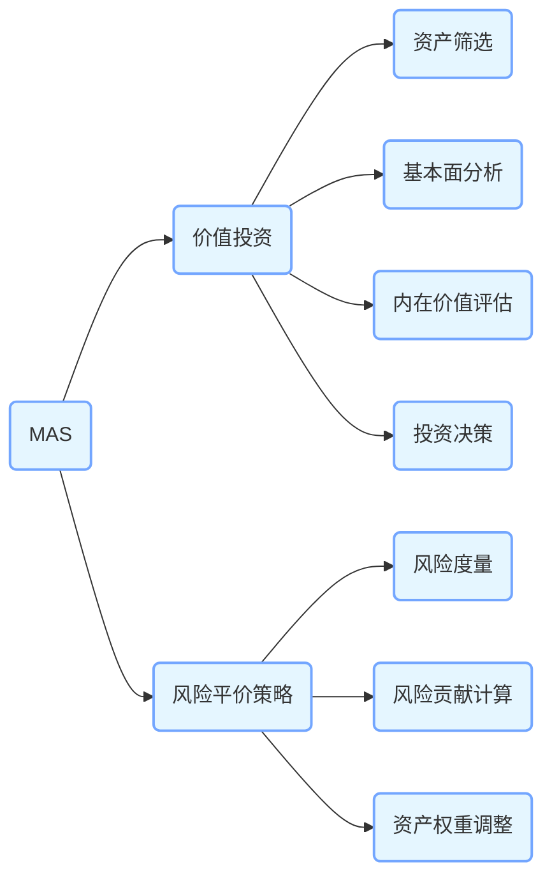

# 多智能体系统优化价值投资的风险平价策略

> 关键词：多智能体系统、价值投资、风险平价策略、优化、投资组合

> 摘要：本文聚焦于利用多智能体系统来优化价值投资中的风险平价策略。首先介绍了研究的背景，包括目的、预期读者、文档结构和相关术语。接着阐述了多智能体系统、价值投资和风险平价策略的核心概念及其联系，并给出了相应的示意图和流程图。详细讲解了核心算法原理，用 Python 代码进行了具体实现。同时，给出了相关的数学模型和公式，并举例说明。通过项目实战，展示了如何搭建开发环境、实现源代码并进行代码解读与分析。探讨了该策略的实际应用场景，推荐了学习资源、开发工具框架以及相关论文著作。最后总结了未来发展趋势与挑战，还提供了常见问题解答和扩展阅读参考资料，旨在为投资者和研究人员提供全面深入的关于多智能体系统优化价值投资风险平价策略的知识。

## 1. 背景介绍 
### 1.1 目的和范围
在当今复杂多变的金融市场环境下，投资者面临着众多的投资选择和风险。价值投资作为一种经典的投资理念，强调寻找被低估的资产以获取长期回报。然而，市场的不确定性使得单纯的价值投资难以完全抵御风险。风险平价策略作为一种资产配置方法，旨在平衡不同资产的风险贡献，降低投资组合的整体风险。本研究的目的在于探索如何利用多智能体系统来优化价值投资中的风险平价策略，提高投资组合的风险调整后收益。

本研究的范围涵盖了多智能体系统的基本原理、价值投资和风险平价策略的理论基础，以及如何将多智能体系统应用于风险平价策略的优化过程。通过理论分析、算法实现和实际案例验证，全面深入地探讨这一优化策略的可行性和有效性。

### 1.2 预期读者
本文的预期读者包括金融投资者、金融分析师、人工智能和计算机科学领域的研究人员、金融科技从业者以及对价值投资和风险平价策略感兴趣的学者。对于投资者来说，本文提供了一种新的投资策略优化思路，有助于提高投资决策的科学性和准确性；对于研究人员和从业者而言，本文涉及的多智能体系统和金融策略的交叉研究，为相关领域的进一步研究和实践提供了参考。

### 1.3 文档结构概述
本文共分为十个部分。第一部分为背景介绍，阐述了研究的目的、预期读者、文档结构和相关术语；第二部分介绍核心概念与联系，包括多智能体系统、价值投资和风险平价策略的原理及它们之间的关系，并给出相应的示意图和流程图；第三部分讲解核心算法原理和具体操作步骤，用 Python 代码详细阐述算法实现；第四部分给出数学模型和公式，进行详细讲解并举例说明；第五部分是项目实战，包括开发环境搭建、源代码实现和代码解读与分析；第六部分探讨实际应用场景；第七部分推荐学习资源、开发工具框架和相关论文著作；第八部分总结未来发展趋势与挑战；第九部分为附录，提供常见问题与解答；第十部分是扩展阅读和参考资料。

### 1.4 术语表
#### 1.4.1 核心术语定义
- **多智能体系统（Multi - Agent System, MAS）**：由多个自主的智能体组成的系统，这些智能体能够感知环境、进行决策并采取行动，通过相互协作和交互来实现系统的整体目标。
- **价值投资（Value Investing）**：一种投资策略，基于对资产内在价值的评估，寻找被市场低估的资产进行投资，期望在资产价值回归时获得收益。
- **风险平价策略（Risk Parity Strategy）**：一种资产配置策略，旨在使投资组合中各资产的风险贡献相等，从而降低投资组合对单一资产或资产类别的过度依赖，实现风险的平衡。
- **投资组合（Investment Portfolio）**：由多种资产组成的集合，投资者通过合理配置不同资产来实现投资目标。

#### 1.4.2 相关概念解释
- **智能体（Agent）**：在多智能体系统中，智能体是具有自主性、反应性、社会性和能动性的实体。它能够感知周围环境的信息，根据自身的目标和知识进行决策，并采取相应的行动。
- **内在价值（Intrinsic Value）**：资产的真实价值，通常基于资产的基本面因素，如盈利能力、现金流、资产质量等进行评估。内在价值与市场价格可能存在差异，价值投资就是利用这种差异进行投资决策。
- **风险贡献（Risk Contribution）**：指投资组合中某一资产对整个投资组合风险的贡献程度。通常用资产的波动率、相关性等因素来衡量。

#### 1.4.3 缩略词列表
- **MAS**：Multi - Agent System（多智能体系统）
- **VAR**：Value at Risk（风险价值）

## 2. 核心概念与联系 
### 2.1 多智能体系统原理
多智能体系统由多个智能体组成，每个智能体具有一定的自主性和智能性。智能体可以感知环境信息，根据自身的规则和目标进行决策，并与其他智能体进行交互。智能体的决策过程通常基于其内部的知识库和推理机制。

多智能体系统的架构通常包括智能体层、通信层和协调层。智能体层负责具体的决策和行动；通信层实现智能体之间的信息传递；协调层负责协调智能体之间的行为，以实现系统的整体目标。

以下是多智能体系统架构的文本示意图：

```plaintext
+---------------------+
|  协调层             |
|  （协调智能体行为） |
+---------------------+
|  通信层             |
|  （信息传递）       |
+---------------------+
|  智能体层           |
|  （决策与行动）     |
+---------------------+
```

### 2.2 价值投资原理
价值投资的核心思想是寻找被市场低估的资产。投资者通过对资产的基本面分析，评估其内在价值。如果市场价格低于内在价值，投资者认为该资产被低估，具有投资价值。

价值投资的关键步骤包括：资产筛选、基本面分析、内在价值评估和投资决策。投资者需要收集大量的财务数据、行业信息等，运用各种估值方法，如市盈率法、市净率法、现金流折现法等，来确定资产的内在价值。

### 2.3 风险平价策略原理
风险平价策略的目标是使投资组合中各资产的风险贡献相等。传统的资产配置策略可能会过度依赖某些资产，导致投资组合的风险集中。风险平价策略通过调整资产的权重，使得各资产对投资组合的风险贡献达到平衡。

风险平价策略的实现步骤包括：风险度量、风险贡献计算和资产权重调整。常用的风险度量指标包括波动率、风险价值（VAR）等。通过计算各资产的风险贡献，然后根据目标风险贡献调整资产的权重。

### 2.4 核心概念联系
多智能体系统可以应用于价值投资和风险平价策略的优化过程。在价值投资中，智能体可以收集和分析大量的市场信息，帮助投资者更准确地评估资产的内在价值。在风险平价策略中，智能体可以实时监测市场变化，动态调整资产的权重，以实现风险的平衡。

以下是核心概念联系的 Mermaid 流程图：



## 3. 核心算法原理 & 具体操作步骤 
### 3.1 核心算法原理
本研究的核心算法是利用多智能体系统来优化风险平价策略。多智能体系统中的智能体可以分为信息收集智能体、分析智能体和决策智能体。信息收集智能体负责收集市场信息，包括资产价格、财务数据等；分析智能体对收集到的信息进行分析，计算资产的风险度量和风险贡献；决策智能体根据分析结果，动态调整投资组合的资产权重。

### 3.2 具体操作步骤
1. **初始化智能体**：创建信息收集智能体、分析智能体和决策智能体，并初始化它们的参数。
2. **信息收集**：信息收集智能体从市场数据源收集资产价格、财务数据等信息。
3. **信息分析**：分析智能体对收集到的信息进行处理，计算资产的波动率、相关性等风险度量指标，以及各资产的风险贡献。
4. **决策制定**：决策智能体根据风险贡献计算结果，调整投资组合的资产权重，使得各资产的风险贡献相等。
5. **更新投资组合**：根据决策智能体的决策，更新投资组合的资产配置。
6. **重复步骤 2 - 5**：不断循环执行上述步骤，以适应市场的变化。

### 3.3 Python 代码实现

```python
import numpy as np

# 信息收集智能体类
class InformationCollector:
    def __init__(self, num_assets):
        self.num_assets = num_assets

    def collect_data(self):
        # 模拟收集资产价格数据
        prices = np.random.rand(self.num_assets, 100)
        return prices

# 分析智能体类
class Analyzer:
    def __init__(self):
        pass

    def calculate_volatility(self, prices):
        # 计算资产的波动率
        returns = np.diff(prices, axis=1) / prices[:, :-1]
        volatility = np.std(returns, axis=1)
        return volatility

    def calculate_correlation(self, prices):
        # 计算资产之间的相关性
        returns = np.diff(prices, axis=1) / prices[:, :-1]
        correlation = np.corrcoef(returns)
        return correlation

    def calculate_risk_contribution(self, weights, volatility, correlation):
        # 计算各资产的风险贡献
        portfolio_volatility = np.sqrt(np.dot(weights.T, np.dot(correlation, weights)))
        risk_contribution = weights * (np.dot(correlation, weights) / portfolio_volatility)
        return risk_contribution

# 决策智能体类
class DecisionMaker:
    def __init__(self, target_risk_contribution):
        self.target_risk_contribution = target_risk_contribution

    def adjust_weights(self, risk_contribution, weights):
        # 调整资产权重以实现风险平价
        error = risk_contribution - self.target_risk_contribution
        learning_rate = 0.01
        new_weights = weights - learning_rate * error
        new_weights = new_weights / np.sum(new_weights)  # 归一化权重
        return new_weights

# 主程序
if __name__ == "__main__":
    num_assets = 5
    initial_weights = np.ones(num_assets) / num_assets  # 初始权重
    target_risk_contribution = np.ones(num_assets) / num_assets  # 目标风险贡献

    collector = InformationCollector(num_assets)
    analyzer = Analyzer()
    decision_maker = DecisionMaker(target_risk_contribution)

    for _ in range(10):
        prices = collector.collect_data()
        volatility = analyzer.calculate_volatility(prices)
        correlation = analyzer.calculate_correlation(prices)
        risk_contribution = analyzer.calculate_risk_contribution(initial_weights, volatility, correlation)
        new_weights = decision_maker.adjust_weights(risk_contribution, initial_weights)
        initial_weights = new_weights

    print("最终资产权重:", initial_weights)
```

## 4. 数学模型和公式 & 详细讲解 & 举例说明 
### 4.1 风险度量指标
#### 4.1.1 波动率
波动率是衡量资产价格波动程度的指标。对于资产 $i$，其历史波动率 $\sigma_i$ 可以通过以下公式计算：

$$\sigma_i = \sqrt{\frac{1}{T - 1} \sum_{t = 1}^{T} (r_{i,t} - \bar{r}_i)^2}$$

其中，$r_{i,t}$ 是资产 $i$ 在时间 $t$ 的收益率，$\bar{r}_i$ 是资产 $i$ 的平均收益率，$T$ 是样本数量。

#### 4.1.2 风险价值（VAR）
风险价值（VAR）是指在一定的置信水平下，投资组合在未来一段时间内可能遭受的最大损失。对于投资组合 $P$，其 VAR 可以通过以下公式计算：

$$VAR_P = z_{\alpha} \sigma_P V_0$$

其中，$z_{\alpha}$ 是对应置信水平 $\alpha$ 的标准正态分布分位数，$\sigma_P$ 是投资组合的波动率，$V_0$ 是投资组合的初始价值。

### 4.2 风险贡献计算
投资组合中资产 $i$ 的风险贡献 $RC_i$ 可以通过以下公式计算：

$$RC_i = w_i \frac{\partial \sigma_P}{\partial w_i}$$

其中，$w_i$ 是资产 $i$ 的权重，$\sigma_P$ 是投资组合的波动率。

### 4.3 风险平价策略的优化目标
风险平价策略的优化目标是使各资产的风险贡献相等，即：

$$RC_1 = RC_2 = \cdots = RC_n$$

其中，$n$ 是资产的数量。

### 4.4 举例说明
假设有一个投资组合，包含三种资产 $A$、$B$、$C$，初始权重分别为 $w_A = 0.3$，$w_B = 0.4$，$w_C = 0.3$。通过历史数据计算得到三种资产的波动率分别为 $\sigma_A = 0.2$，$\sigma_B = 0.3$，$\sigma_C = 0.1$，资产之间的相关性矩阵为：

$$
\rho = 
\begin{bmatrix}
1 & 0.5 & 0.3 \\
0.5 & 1 & 0.2 \\
0.3 & 0.2 & 1
\end{bmatrix}
$$

首先，计算投资组合的波动率 $\sigma_P$：

$$\sigma_P = \sqrt{w_A^2 \sigma_A^2 + w_B^2 \sigma_B^2 + w_C^2 \sigma_C^2 + 2 w_A w_B \rho_{AB} \sigma_A \sigma_B + 2 w_A w_C \rho_{AC} \sigma_A \sigma_C + 2 w_B w_C \rho_{BC} \sigma_B \sigma_C}$$

将数值代入公式可得：

$$\sigma_P = \sqrt{0.3^2 \times 0.2^2 + 0.4^2 \times 0.3^2 + 0.3^2 \times 0.1^2 + 2 \times 0.3 \times 0.4 \times 0.5 \times 0.2 \times 0.3 + 2 \times 0.3 \times 0.3 \times 0.3 \times 0.2 \times 0.1 + 2 \times 0.4 \times 0.3 \times 0.2 \times 0.3 \times 0.1} \approx 0.21$$

然后，计算各资产的风险贡献：

$$RC_A = w_A \frac{\partial \sigma_P}{\partial w_A}$$

$$RC_B = w_B \frac{\partial \sigma_P}{\partial w_B}$$

$$RC_C = w_C \frac{\partial \sigma_P}{\partial w_C}$$

通过数值计算可得 $RC_A \approx 0.06$，$RC_B \approx 0.12$，$RC_C \approx 0.03$。可以看出，各资产的风险贡献不相等。为了实现风险平价，需要调整资产的权重，使得 $RC_A = RC_B = RC_C$。

## 5. 项目实战：代码实际案例和详细解释说明 
### 5.1  开发环境搭建
#### 5.1.1 操作系统
本项目可以在 Windows、Linux 或 macOS 操作系统上进行开发。建议使用 Linux 或 macOS 系统，因为它们在数据处理和科学计算方面具有更好的性能和兼容性。

#### 5.1.2 Python 环境
安装 Python 3.7 或更高版本。可以从 Python 官方网站（https://www.python.org/downloads/） 下载并安装。

#### 5.1.3 依赖库安装
本项目需要安装以下 Python 库：
- `numpy`：用于数值计算。
- `pandas`：用于数据处理和分析。
- `matplotlib`：用于数据可视化。

可以使用以下命令安装这些库：

```sh
pip install numpy pandas matplotlib
```

### 5.2  源代码详细实现和代码解读
```python
import numpy as np
import pandas as pd
import matplotlib.pyplot as plt

# 信息收集智能体类
class InformationCollector:
    def __init__(self, asset_names):
        self.asset_names = asset_names

    def collect_data(self, start_date, end_date):
        # 模拟从数据源收集资产价格数据
        data = {}
        for asset in self.asset_names:
            prices = np.random.rand(100) * 100  # 模拟价格数据
            dates = pd.date_range(start=start_date, periods=100, freq='D')
            data[asset] = pd.Series(prices, index=dates)
        df = pd.DataFrame(data)
        return df

# 分析智能体类
class Analyzer:
    def __init__(self):
        pass

    def calculate_returns(self, prices):
        # 计算资产收益率
        returns = prices.pct_change().dropna()
        return returns

    def calculate_volatility(self, returns):
        # 计算资产的波动率
        volatility = returns.std()
        return volatility

    def calculate_correlation(self, returns):
        # 计算资产之间的相关性
        correlation = returns.corr()
        return correlation

    def calculate_risk_contribution(self, weights, volatility, correlation):
        # 计算各资产的风险贡献
        portfolio_volatility = np.sqrt(np.dot(weights.T, np.dot(correlation, weights)))
        risk_contribution = weights * (np.dot(correlation, weights) / portfolio_volatility)
        return risk_contribution

# 决策智能体类
class DecisionMaker:
    def __init__(self, target_risk_contribution):
        self.target_risk_contribution = target_risk_contribution

    def adjust_weights(self, risk_contribution, weights):
        # 调整资产权重以实现风险平价
        error = risk_contribution - self.target_risk_contribution
        learning_rate = 0.01
        new_weights = weights - learning_rate * error
        new_weights = new_weights / np.sum(new_weights)  # 归一化权重
        return new_weights

# 主程序
if __name__ == "__main__":
    asset_names = ['A', 'B', 'C', 'D', 'E']
    initial_weights = np.ones(len(asset_names)) / len(asset_names)  # 初始权重
    target_risk_contribution = np.ones(len(asset_names)) / len(asset_names)  # 目标风险贡献

    collector = InformationCollector(asset_names)
    analyzer = Analyzer()
    decision_maker = DecisionMaker(target_risk_contribution)

    start_date = '2020-01-01'
    end_date = '2020-04-10'
    prices = collector.collect_data(start_date, end_date)
    returns = analyzer.calculate_returns(prices)
    volatility = analyzer.calculate_volatility(returns)
    correlation = analyzer.calculate_correlation(returns)

    weights_history = [initial_weights]
    for _ in range(100):
        risk_contribution = analyzer.calculate_risk_contribution(initial_weights, volatility, correlation)
        new_weights = decision_maker.adjust_weights(risk_contribution, initial_weights)
        initial_weights = new_weights
        weights_history.append(new_weights)

    weights_history = np.array(weights_history)

    # 绘制权重变化曲线
    plt.figure(figsize=(10, 6))
    for i in range(len(asset_names)):
        plt.plot(weights_history[:, i], label=asset_names[i])
    plt.xlabel('迭代次数')
    plt.ylabel('资产权重')
    plt.title('资产权重随迭代次数的变化')
    plt.legend()
    plt.show()
```

### 5.3  代码解读与分析
#### 5.3.1 信息收集智能体类（`InformationCollector`）
- `__init__` 方法：初始化信息收集智能体，接收资产名称列表作为参数。
- `collect_data` 方法：模拟从数据源收集资产价格数据，返回一个 `pandas` 数据框，包含不同资产的价格信息。

#### 5.3.2 分析智能体类（`Analyzer`）
- `calculate_returns` 方法：计算资产的收益率，使用 `pandas` 的 `pct_change` 方法。
- `calculate_volatility` 方法：计算资产的波动率，使用 `pandas` 的 `std` 方法。
- `calculate_correlation` 方法：计算资产之间的相关性，使用 `pandas` 的 `corr` 方法。
- `calculate_risk_contribution` 方法：计算各资产的风险贡献，根据风险贡献的计算公式进行计算。

#### 5.3.3 决策智能体类（`DecisionMaker`）
- `__init__` 方法：初始化决策智能体，接收目标风险贡献作为参数。
- `adjust_weights` 方法：根据当前的风险贡献和目标风险贡献，调整资产的权重，使用梯度下降的思想进行权重调整。

#### 5.3.4 主程序
- 初始化资产名称、初始权重和目标风险贡献。
- 创建信息收集智能体、分析智能体和决策智能体。
- 收集资产价格数据，计算收益率、波动率和相关性。
- 迭代更新资产权重，记录每次迭代的权重。
- 绘制资产权重随迭代次数的变化曲线，直观展示权重的调整过程。

## 6. 实际应用场景 
### 6.1 机构投资者的资产配置
对于机构投资者，如养老基金、保险公司等，他们通常管理着大规模的资产，需要在保证资产安全的前提下实现一定的收益。多智能体系统优化的风险平价策略可以帮助他们更合理地配置资产，降低投资组合的风险。通过智能体实时监测市场变化，动态调整资产权重，确保投资组合的风险始终处于可控范围内。

### 6.2 个人投资者的投资决策
个人投资者在进行投资时，往往面临着信息不足和专业知识有限的问题。多智能体系统优化的风险平价策略可以为个人投资者提供一种科学的投资决策方法。智能体可以帮助个人投资者收集和分析市场信息，计算资产的风险和收益，根据个人的风险偏好调整投资组合的资产配置，提高投资的成功率。

### 6.3 量化投资策略的开发
在量化投资领域，多智能体系统优化的风险平价策略可以作为一种重要的投资策略进行开发和应用。通过编写算法实现智能体的功能，结合历史数据进行回测和优化，可以开发出具有较高盈利能力和风险控制能力的量化投资策略。

## 7. 工具和资源推荐
### 7.1 学习资源推荐
#### 7.1.1 书籍推荐
- 《智能体系统与多智能体系统》：介绍了多智能体系统的基本原理、算法和应用，是学习多智能体系统的经典教材。
- 《价值投资：从格雷厄姆到巴菲特》：深入阐述了价值投资的理论和实践，是价值投资领域的权威著作。
- 《资产配置的艺术》：详细讲解了资产配置的方法和策略，包括风险平价策略等，对投资者和金融从业者具有重要的参考价值。

#### 7.1.2 在线课程
- Coursera 上的“Artificial Intelligence for Robotics”：该课程介绍了人工智能在机器人领域的应用，其中涉及到多智能体系统的相关知识。
- edX 上的“Financial Markets”：由耶鲁大学教授罗伯特·席勒（Robert Shiller）授课，讲解了金融市场的基本原理和投资策略，对理解价值投资和风险平价策略有很大帮助。

#### 7.1.3 技术博客和网站
- Medium：上面有很多关于人工智能、金融科技等领域的技术文章，其中不乏关于多智能体系统和投资策略的优秀博客。
- Seeking Alpha：是一个金融投资领域的专业网站，提供了大量的股票分析、投资策略等内容，对价值投资和风险平价策略的研究有参考价值。

### 7.2 开发工具框架推荐
#### 7.2.1 IDE和编辑器
- PyCharm：是一款专业的 Python 集成开发环境，具有代码自动补全、调试、版本控制等功能，适合开发多智能体系统和金融投资相关的 Python 代码。
- Visual Studio Code：是一款轻量级的代码编辑器，支持多种编程语言，通过安装相关插件可以方便地进行 Python 开发。

#### 7.2.2 调试和性能分析工具
- PDB：是 Python 自带的调试器，可以帮助开发者调试 Python 代码，定位问题。
- cProfile：是 Python 的性能分析工具，可以分析代码的运行时间和函数调用情况，帮助开发者优化代码性能。

#### 7.2.3 相关框架和库
- Mesa：是一个用于开发多智能体系统的 Python 框架，提供了丰富的智能体模型和仿真工具，方便开发者快速搭建多智能体系统。
- Zipline：是一个用于量化投资的 Python 框架，可以帮助开发者进行回测和实盘交易，实现投资策略的开发和优化。

### 7.3 相关论文著作推荐
#### 7.3.1 经典论文
- “Multi - Agent Systems: A Modern Approach to Distributed Artificial Intelligence”：该论文全面介绍了多智能体系统的理论和方法，是多智能体系统领域的经典之作。
- “The Intelligent Investor”：由本杰明·格雷厄姆（Benjamin Graham）撰写，是价值投资领域的奠基性论文，阐述了价值投资的基本理念和方法。

#### 7.3.2 最新研究成果
- 关注顶级学术期刊，如《Journal of Financial Economics》、《Artificial Intelligence》等，这些期刊上发表了很多关于金融投资和人工智能的最新研究成果。
- 参加相关的学术会议，如 ACM SIGKDD、NeurIPS 等，了解多智能体系统和金融科技领域的最新研究动态。

#### 7.3.3 应用案例分析
- 一些金融机构和研究机构会发布关于投资策略应用案例的报告，可以通过他们的官方网站或相关数据库获取这些案例，学习多智能体系统优化风险平价策略在实际应用中的经验和方法。

## 8. 总结：未来发展趋势与挑战
### 8.1 未来发展趋势
#### 8.1.1 与其他技术的融合
多智能体系统优化的风险平价策略将与其他技术，如区块链、云计算、大数据等深度融合。区块链技术可以提高金融数据的安全性和透明度，云计算可以提供强大的计算能力，大数据技术可以帮助智能体收集和分析更多的市场信息，从而进一步提升投资策略的性能。

#### 8.1.2 智能化和自动化程度的提高
随着人工智能技术的不断发展，多智能体系统的智能化和自动化程度将不断提高。智能体将能够更加自主地进行决策和行动，减少人工干预，提高投资决策的效率和准确性。

#### 8.1.3 应用领域的拓展
该策略不仅将在金融投资领域得到更广泛的应用，还将拓展到其他领域，如供应链管理、能源管理等。在这些领域中，多智能体系统可以帮助优化资源配置，降低风险，提高系统的整体性能。

### 8.2 挑战
#### 8.2.1 数据质量和安全性
多智能体系统需要大量的市场数据来进行决策，数据的质量和安全性直接影响到投资策略的效果。如何保证数据的准确性、完整性和及时性，以及如何防止数据泄露和恶意攻击，是需要解决的重要问题。

#### 8.2.2 模型的复杂性和可解释性
多智能体系统和风险平价策略的模型往往比较复杂，难以理解和解释。在实际应用中，投资者和监管机构需要了解模型的工作原理和决策依据，以确保投资策略的合理性和合规性。如何提高模型的可解释性是一个挑战。

#### 8.2.3 市场的不确定性
金融市场具有高度的不确定性，市场的变化往往难以预测。多智能体系统优化的风险平价策略需要能够适应市场的变化，及时调整投资组合的资产配置。如何提高策略的适应性和鲁棒性，是未来需要研究的方向。

## 9. 附录：常见问题与解答
### 9.1 多智能体系统的智能体是如何进行决策的？
智能体的决策过程通常基于其内部的知识库和推理机制。智能体首先感知环境信息，然后根据自身的目标和知识进行推理和判断，最后做出决策并采取相应的行动。在多智能体系统中，智能体还可以与其他智能体进行交互和协作，共同完成系统的目标。

### 9.2 风险平价策略是否能完全消除投资风险？
风险平价策略不能完全消除投资风险。它只是通过平衡各资产的风险贡献，降低投资组合对单一资产或资产类别的过度依赖，从而降低投资组合的整体风险。市场的不确定性和其他因素仍然可能导致投资组合遭受损失。

### 9.3 如何评估多智能体系统优化的风险平价策略的效果？
可以通过以下几个指标来评估该策略的效果：
- **风险调整后收益**：如夏普比率、索提诺比率等，这些指标可以衡量投资组合在承担一定风险的情况下所获得的收益。
- **波动率**：投资组合的波动率反映了其价格波动的程度，波动率越低，风险越小。
- **最大回撤**：最大回撤衡量了投资组合在一段时间内的最大损失，最大回撤越小，说明投资组合的抗风险能力越强。

## 10. 扩展阅读 & 参考资料
### 10.1 扩展阅读
- 《Machine Learning for Algorithmic Trading》：这本书介绍了机器学习在算法交易中的应用，与多智能体系统优化的风险平价策略有一定的关联，可以进一步扩展读者的知识面。
- 《Complex Adaptive Systems: An Introduction to Computational Models of Social Life》：讲解了复杂自适应系统的理论和应用，多智能体系统是复杂自适应系统的一种重要形式，阅读这本书可以帮助读者更好地理解多智能体系统的原理和机制。

### 10.2 参考资料
- 相关学术论文和研究报告，如《Journal of Financial Economics》、《Artificial Intelligence》等期刊上发表的论文。
- 金融数据提供商的网站，如雅虎财经、彭博社等，这些网站提供了大量的金融市场数据，可用于研究和实践。
- 开源代码库，如 GitHub 上的相关项目，可参考其中的代码实现和算法思路。