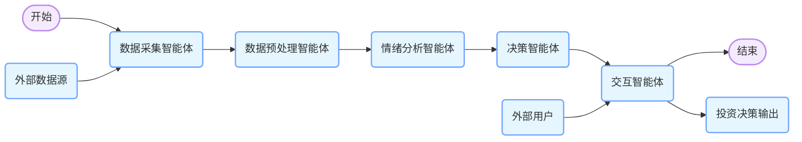

# 多智能体系统在全球投资者情绪分析中的应用：把握市场脉搏

> 关键词：多智能体系统、全球投资者情绪分析、市场脉搏、人工智能、金融市场、情绪建模、数据挖掘

> 摘要：本文深入探讨了多智能体系统在全球投资者情绪分析中的应用，旨在帮助金融从业者和研究者更好地把握市场脉搏。首先介绍了多智能体系统和投资者情绪分析的背景知识，详细阐述了核心概念及其联系，包括多智能体系统的架构和投资者情绪的形成机制。接着讲解了核心算法原理和具体操作步骤，通过Python代码进行了详细说明。还给出了相关的数学模型和公式，并结合实例进行讲解。通过项目实战展示了如何利用多智能体系统进行投资者情绪分析的具体实现过程。分析了其实际应用场景，推荐了相关的工具和资源。最后总结了未来发展趋势与挑战，解答了常见问题，并提供了扩展阅读和参考资料，为多智能体系统在投资者情绪分析领域的进一步研究和应用提供全面的指导。

## 1. 背景介绍 
### 1.1 目的和范围
在全球金融市场中，投资者情绪对资产价格的波动、市场的稳定性以及投资决策的制定都有着至关重要的影响。传统的金融分析方法往往侧重于对基本面数据的研究，而忽略了投资者情绪这一重要的市场驱动因素。多智能体系统作为一种强大的人工智能技术，能够模拟复杂的社会和经济系统，为投资者情绪分析提供了新的视角和方法。

本文的目的在于全面探讨多智能体系统在全球投资者情绪分析中的应用，包括其原理、算法、数学模型以及实际应用等方面。范围涵盖了多智能体系统的基本概念、投资者情绪的量化和建模、基于多智能体系统的情绪分析算法实现，以及在不同金融市场场景下的应用案例。

### 1.2 预期读者
本文预期读者包括金融领域的从业者，如投资经理、分析师、交易员等，他们可以通过了解多智能体系统在投资者情绪分析中的应用，更好地把握市场动态，优化投资决策。同时，也适合计算机科学和人工智能领域的研究者和开发者，为他们在金融领域的应用研究提供参考。此外，对金融市场和人工智能技术感兴趣的学生和爱好者也可以从本文中获取相关的知识和信息。

### 1.3 文档结构概述
本文共分为十个部分。第一部分为背景介绍，阐述了研究的目的、范围、预期读者和文档结构，并对相关术语进行了定义和解释。第二部分介绍了多智能体系统和投资者情绪分析的核心概念及其联系，通过文本示意图和Mermaid流程图进行了直观展示。第三部分详细讲解了核心算法原理和具体操作步骤，并给出了Python源代码。第四部分介绍了相关的数学模型和公式，并结合实例进行了详细讲解。第五部分通过项目实战，展示了如何搭建开发环境、实现源代码以及对代码进行解读和分析。第六部分分析了多智能体系统在全球投资者情绪分析中的实际应用场景。第七部分推荐了相关的学习资源、开发工具框架和论文著作。第八部分总结了未来发展趋势与挑战。第九部分解答了常见问题。第十部分提供了扩展阅读和参考资料。

### 1.4 术语表
#### 1.4.1 核心术语定义
- **多智能体系统（Multi - Agent System，MAS）**：由多个自主的智能体组成的系统，这些智能体可以感知环境、进行决策并采取行动，通过相互协作和交互来完成共同的任务。
- **投资者情绪（Investor Sentiment）**：投资者对金融市场的整体看法、预期和情绪状态，反映了投资者的乐观或悲观程度，会影响他们的投资决策。
- **情绪量化（Sentiment Quantification）**：将投资者的情绪状态转化为可以度量的数值或指标的过程。
- **智能体（Agent）**：具有自主性、反应性、社会性和适应性的实体，能够在一定的环境中独立运行并与其他智能体进行交互。

#### 1.4.2 相关概念解释
- **自主性**：智能体能够独立地感知环境、进行决策和采取行动，不受外部的直接控制。
- **反应性**：智能体能够对环境中的变化做出及时的反应，调整自己的行为。
- **社会性**：智能体能够与其他智能体进行通信和协作，共同完成任务。
- **适应性**：智能体能够根据环境的变化和自身的经验，调整自己的行为和策略。

#### 1.4.3 缩略词列表
- **MAS**：Multi - Agent System（多智能体系统）
- **AI**：Artificial Intelligence（人工智能）
- **NLP**：Natural Language Processing（自然语言处理）
- **ML**：Machine Learning（机器学习）

## 2. 核心概念与联系 
### 核心概念原理
#### 多智能体系统原理
多智能体系统是一种分布式人工智能系统，其核心思想是将一个复杂的任务分解为多个子任务，由多个智能体分别承担这些子任务，并通过智能体之间的交互和协作来完成整个任务。每个智能体都有自己的目标、知识和能力，能够根据环境的变化自主地调整自己的行为。

智能体的基本结构包括感知模块、决策模块和执行模块。感知模块负责感知环境中的信息，决策模块根据感知到的信息和自身的知识进行决策，执行模块根据决策结果采取相应的行动。智能体之间可以通过消息传递、协商等方式进行交互和协作。

#### 投资者情绪分析原理
投资者情绪分析是通过对各种数据源的分析，来推断投资者的情绪状态。常见的数据源包括社交媒体数据、新闻报道、分析师评级等。情绪分析的过程通常包括数据收集、数据预处理、特征提取和情绪分类等步骤。

数据收集是指从各种数据源中获取与投资者情绪相关的数据。数据预处理包括数据清洗、分词、去除停用词等操作，以提高数据的质量。特征提取是从预处理后的数据中提取能够反映投资者情绪的特征，如关键词、情感极性等。情绪分类是根据提取的特征将数据分为不同的情绪类别，如积极、消极、中性等。

### 架构的文本示意图
多智能体系统在投资者情绪分析中的架构可以描述如下：

系统主要由数据采集智能体、数据预处理智能体、情绪分析智能体、决策智能体和交互智能体组成。数据采集智能体负责从各种数据源（如社交媒体平台、新闻网站等）收集与投资者情绪相关的数据。数据预处理智能体对采集到的数据进行清洗、分词等预处理操作。情绪分析智能体利用自然语言处理和机器学习算法对预处理后的数据进行情绪分类和量化。决策智能体根据情绪分析的结果，结合市场数据和其他因素，制定投资决策。交互智能体负责智能体之间的通信和协作，以及与外部用户的交互。

### Mermaid流程图


## 3. 核心算法原理 & 具体操作步骤 
### 核心算法原理
在多智能体系统中进行投资者情绪分析，常用的算法包括自然语言处理算法和机器学习算法。

#### 自然语言处理算法
自然语言处理算法主要用于对文本数据进行处理和分析，以提取其中的语义信息和情感信息。常见的自然语言处理算法包括词法分析、句法分析、语义分析和情感分析等。

词法分析是将文本数据分解为单词或词块的过程，常用的方法有基于规则的方法和基于统计的方法。句法分析是分析句子的语法结构，确定句子中各个成分之间的关系。语义分析是理解文本的语义含义，常用的方法有语义角色标注、命名实体识别等。情感分析是判断文本的情感极性，常用的方法有基于词典的方法和基于机器学习的方法。

#### 机器学习算法
机器学习算法主要用于对情绪分析模型进行训练和优化，以提高情绪分类的准确性。常见的机器学习算法包括朴素贝叶斯算法、支持向量机算法、神经网络算法等。

朴素贝叶斯算法是一种基于贝叶斯定理的分类算法，它假设特征之间相互独立，通过计算每个类别的概率来进行分类。支持向量机算法是一种基于统计学习理论的分类算法，它通过寻找最优的超平面来进行分类。神经网络算法是一种模仿人类神经系统的算法，它通过多层神经元的计算来进行分类和预测。

### 具体操作步骤
#### 数据采集
使用网络爬虫技术从社交媒体平台、新闻网站等数据源中采集与投资者情绪相关的文本数据。例如，可以使用Python的`requests`库和`BeautifulSoup`库来实现网络爬虫。

```python
import requests
from bs4 import BeautifulSoup

def get_news_content(url):
    try:
        response = requests.get(url)
        response.raise_for_status()
        soup = BeautifulSoup(response.text, 'html.parser')
        # 假设新闻内容在<p>标签中
        paragraphs = soup.find_all('p')
        content = ' '.join([p.get_text() for p in paragraphs])
        return content
    except Exception as e:
        print(f"Error: {e}")
        return None
```

#### 数据预处理
对采集到的文本数据进行清洗、分词、去除停用词等预处理操作。可以使用Python的`jieba`库进行中文分词，使用`nltk`库进行英文分词和停用词去除。

```python
import jieba
import nltk
from nltk.corpus import stopwords

nltk.download('stopwords')

def preprocess_text(text, lang='zh'):
    if lang == 'zh':
        # 中文分词
        words = jieba.lcut(text)
    else:
        # 英文分词
        words = nltk.word_tokenize(text)
    # 去除停用词
    stop_words = set(stopwords.words('chinese' if lang == 'zh' else 'english'))
    filtered_words = [word for word in words if word not in stop_words]
    return ' '.join(filtered_words)
```

#### 特征提取
从预处理后的文本数据中提取能够反映投资者情绪的特征，如关键词、情感极性等。可以使用词袋模型、TF - IDF模型等方法进行特征提取。

```python
from sklearn.feature_extraction.text import CountVectorizer, TfidfVectorizer

def extract_features(texts, method='bow'):
    if method == 'bow':
        vectorizer = CountVectorizer()
    else:
        vectorizer = TfidfVectorizer()
    features = vectorizer.fit_transform(texts)
    return features, vectorizer
```

#### 情绪分类
使用机器学习算法对提取的特征进行情绪分类。以朴素贝叶斯算法为例：

```python
from sklearn.naive_bayes import MultinomialNB
from sklearn.model_selection import train_test_split
from sklearn.metrics import accuracy_score

def sentiment_classification(features, labels):
    X_train, X_test, y_train, y_test = train_test_split(features, labels, test_size=0.2, random_state=42)
    clf = MultinomialNB()
    clf.fit(X_train, y_train)
    y_pred = clf.predict(X_test)
    accuracy = accuracy_score(y_test, y_pred)
    print(f"Accuracy: {accuracy}")
    return clf
```

## 4. 数学模型和公式 & 详细讲解 & 举例说明 
### 朴素贝叶斯算法数学模型和公式
#### 数学模型
朴素贝叶斯算法基于贝叶斯定理，通过计算每个类别的后验概率来进行分类。假设一个文本数据 $x$ 由多个特征 $x_1, x_2, \cdots, x_n$ 组成，有 $k$ 个类别 $c_1, c_2, \cdots, c_k$，则朴素贝叶斯算法的目标是找到后验概率最大的类别：

$$\hat{c} = \arg\max_{c_j} P(c_j|x)$$

#### 贝叶斯定理
根据贝叶斯定理，后验概率 $P(c_j|x)$ 可以表示为：

$$P(c_j|x) = \frac{P(x|c_j)P(c_j)}{P(x)}$$

其中，$P(c_j)$ 是类别 $c_j$ 的先验概率，$P(x|c_j)$ 是在类别 $c_j$ 下特征 $x$ 出现的条件概率，$P(x)$ 是特征 $x$ 出现的概率。

#### 朴素贝叶斯假设
朴素贝叶斯算法假设特征之间相互独立，即：

$$P(x|c_j) = \prod_{i = 1}^{n} P(x_i|c_j)$$

#### 最终分类公式
由于 $P(x)$ 对于所有类别都是相同的，因此可以忽略不计，最终的分类公式为：

$$\hat{c} = \arg\max_{c_j} P(c_j)\prod_{i = 1}^{n} P(x_i|c_j)$$

### 详细讲解
- **先验概率 $P(c_j)$**：先验概率 $P(c_j)$ 表示类别 $c_j$ 在训练数据中出现的概率，可以通过统计训练数据中每个类别的样本数来计算：

$$P(c_j) = \frac{N_{c_j}}{N}$$

其中，$N_{c_j}$ 是类别 $c_j$ 的样本数，$N$ 是训练数据的总样本数。

- **条件概率 $P(x_i|c_j)$**：条件概率 $P(x_i|c_j)$ 表示在类别 $c_j$ 下特征 $x_i$ 出现的概率，可以通过统计训练数据中类别 $c_j$ 下特征 $x_i$ 出现的次数来计算：

$$P(x_i|c_j) = \frac{N_{x_i, c_j} + \alpha}{N_{c_j} + \alpha V}$$

其中，$N_{x_i, c_j}$ 是类别 $c_j$ 下特征 $x_i$ 出现的次数，$N_{c_j}$ 是类别 $c_j$ 的样本数，$V$ 是特征的总数，$\alpha$ 是平滑参数，通常取 1。

### 举例说明
假设有一个文本分类任务，训练数据如下：

| 文本 | 类别 |
| ---- | ---- |
| 这个股票前景很好 | 积极 |
| 那个股票要跌了 | 消极 |
| 市场形势乐观 | 积极 |
| 市场可能下跌 | 消极 |

我们要对新的文本“股票走势不错”进行分类。

#### 步骤1：计算先验概率
积极类别的样本数 $N_{积极} = 2$，消极类别的样本数 $N_{消极} = 2$，总样本数 $N = 4$。

$$P(积极) = \frac{2}{4} = 0.5$$
$$P(消极) = \frac{2}{4} = 0.5$$

#### 步骤2：计算条件概率
假设我们使用词袋模型，特征为“股票”、“前景”、“很好”、“要跌了”、“市场”、“形势”、“乐观”、“可能”、“下跌”、“走势”、“不错”。

在积极类别中，“股票”出现的次数 $N_{股票, 积极} = 1$，积极类别的样本数 $N_{积极} = 2$，特征总数 $V = 11$，平滑参数 $\alpha = 1$。

$$P(股票|积极) = \frac{1 + 1}{2 + 1\times11} = \frac{2}{13}$$

同理，可以计算其他特征的条件概率。

#### 步骤3：计算后验概率
对于新文本“股票走势不错”，其特征为“股票”、“走势”、“不错”。

$$P(积极|股票走势不错) \propto P(积极)P(股票|积极)P(走势|积极)P(不错|积极)$$
$$P(消极|股票走势不错) \propto P(消极)P(股票|消极)P(走势|消极)P(不错|消极)$$

比较两个后验概率的大小，选择后验概率大的类别作为最终的分类结果。

## 5. 项目实战：代码实际案例和详细解释说明 
### 5.1  开发环境搭建
#### 操作系统
可以选择Windows、Linux或macOS等操作系统。建议使用Linux系统，如Ubuntu，因为它对Python开发和数据处理有较好的支持。

#### Python环境
安装Python 3.7及以上版本。可以从Python官方网站（https://www.python.org/downloads/）下载安装包进行安装。

#### 虚拟环境
为了避免不同项目之间的依赖冲突，建议使用虚拟环境。可以使用`venv`或`conda`来创建虚拟环境。

使用`venv`创建虚拟环境的命令如下：

```bash
python -m venv myenv
```

激活虚拟环境：

- 在Windows上：

```bash
myenv\Scripts\activate
```

- 在Linux和macOS上：

```bash
source myenv/bin/activate
```

#### 安装依赖库
安装项目所需的依赖库，如`requests`、`beautifulsoup4`、`jieba`、`nltk`、`scikit - learn`等。可以使用`pip`进行安装：

```bash
pip install requests beautifulsoup4 jieba nltk scikit-learn
```

### 5.2  源代码详细实现和代码解读
#### 完整代码
```python
import requests
from bs4 import BeautifulSoup
import jieba
import nltk
from nltk.corpus import stopwords
from sklearn.feature_extraction.text import CountVectorizer
from sklearn.naive_bayes import MultinomialNB
from sklearn.model_selection import train_test_split
from sklearn.metrics import accuracy_score

# 数据采集
def get_news_content(url):
    try:
        response = requests.get(url)
        response.raise_for_status()
        soup = BeautifulSoup(response.text, 'html.parser')
        paragraphs = soup.find_all('p')
        content = ' '.join([p.get_text() for p in paragraphs])
        return content
    except Exception as e:
        print(f"Error: {e}")
        return None

# 数据预处理
nltk.download('stopwords')
def preprocess_text(text, lang='zh'):
    if lang == 'zh':
        words = jieba.lcut(text)
    else:
        words = nltk.word_tokenize(text)
    stop_words = set(stopwords.words('chinese' if lang == 'zh' else 'english'))
    filtered_words = [word for word in words if word not in stop_words]
    return ' '.join(filtered_words)

# 特征提取
def extract_features(texts, method='bow'):
    if method == 'bow':
        vectorizer = CountVectorizer()
    else:
        vectorizer = TfidfVectorizer()
    features = vectorizer.fit_transform(texts)
    return features, vectorizer

# 情绪分类
def sentiment_classification(features, labels):
    X_train, X_test, y_train, y_test = train_test_split(features, labels, test_size=0.2, random_state=42)
    clf = MultinomialNB()
    clf.fit(X_train, y_train)
    y_pred = clf.predict(X_test)
    accuracy = accuracy_score(y_test, y_pred)
    print(f"Accuracy: {accuracy}")
    return clf

# 主函数
if __name__ == "__main__":
    # 示例数据
    texts = [
        "这个股票前景很好",
        "那个股票要跌了",
        "市场形势乐观",
        "市场可能下跌"
    ]
    labels = ["积极", "消极", "积极", "消极"]

    # 数据预处理
    preprocessed_texts = [preprocess_text(text) for text in texts]

    # 特征提取
    features, vectorizer = extract_features(preprocessed_texts)

    # 情绪分类
    clf = sentiment_classification(features, labels)

    # 预测新文本
    new_text = "股票走势不错"
    preprocessed_new_text = preprocess_text(new_text)
    new_features = vectorizer.transform([preprocessed_new_text])
    prediction = clf.predict(new_features)
    print(f"Prediction: {prediction[0]}")
```

#### 代码解读
1. **数据采集**：`get_news_content`函数使用`requests`库和`BeautifulSoup`库从指定的URL中获取新闻内容。
2. **数据预处理**：`preprocess_text`函数对文本数据进行分词和去除停用词操作。对于中文文本，使用`jieba`库进行分词；对于英文文本，使用`nltk`库进行分词和停用词去除。
3. **特征提取**：`extract_features`函数使用`CountVectorizer`或`TfidfVectorizer`进行特征提取。这里使用词袋模型（`bow`）作为示例。
4. **情绪分类**：`sentiment_classification`函数使用朴素贝叶斯算法进行情绪分类。将数据集划分为训练集和测试集，训练模型并计算准确率。
5. **主函数**：定义示例数据和标签，进行数据预处理、特征提取和情绪分类。最后，对新文本进行预测并输出预测结果。

### 5.3  代码解读与分析
#### 优点
- **简单易懂**：代码结构清晰，使用了常见的Python库和机器学习算法，易于理解和实现。
- **可扩展性**：可以通过替换不同的自然语言处理算法和机器学习算法，对代码进行扩展和优化。
- **灵活性**：可以根据不同的数据源和任务需求，调整数据采集、预处理和特征提取的方法。

#### 缺点
- **数据局限性**：示例数据较少，可能无法准确反映真实的投资者情绪。在实际应用中，需要使用大量的真实数据进行训练和测试。
- **特征工程不足**：仅使用了词袋模型进行特征提取，可能无法充分捕捉文本的语义信息。可以考虑使用更复杂的特征工程方法，如词嵌入、深度学习模型等。
- **算法局限性**：朴素贝叶斯算法假设特征之间相互独立，在实际应用中可能存在一定的局限性。可以尝试使用其他机器学习算法，如支持向量机、神经网络等。

## 6. 实际应用场景 
### 投资决策支持
多智能体系统在投资者情绪分析中的应用可以为投资决策提供支持。通过对全球投资者情绪的实时监测和分析，投资者可以更好地了解市场的情绪状态，判断市场的走势和趋势。例如，当投资者情绪普遍乐观时，市场可能会上涨，此时投资者可以适当增加投资；当投资者情绪普遍悲观时，市场可能会下跌，此时投资者可以适当减少投资或采取避险措施。

### 风险管理
投资者情绪的波动会对金融市场的稳定性产生影响，因此对投资者情绪的分析可以帮助金融机构和投资者进行风险管理。通过对投资者情绪的量化和建模，金融机构可以评估市场的风险水平，制定相应的风险控制策略。例如，当投资者情绪过度乐观时，金融机构可以加强对市场泡沫的监测和预警；当投资者情绪过度悲观时，金融机构可以采取措施稳定市场信心。

### 市场趋势预测
投资者情绪是市场趋势的重要驱动因素之一，因此对投资者情绪的分析可以帮助预测市场的趋势。通过对历史数据的分析和挖掘，建立投资者情绪与市场走势之间的关系模型，从而对未来的市场趋势进行预测。例如，通过分析社交媒体上投资者的情绪变化，可以预测股票市场的短期波动；通过分析分析师的评级和报告，可以预测行业的长期发展趋势。

### 产品设计和营销
金融机构可以根据投资者情绪分析的结果，设计和推广符合投资者需求和偏好的金融产品。例如，当投资者情绪乐观时，金融机构可以推出一些高风险、高收益的投资产品；当投资者情绪悲观时，金融机构可以推出一些低风险、稳健的投资产品。同时，金融机构可以根据投资者情绪的变化，调整营销策略，提高营销效果。

## 7. 工具和资源推荐
### 7.1 学习资源推荐
#### 7.1.1 书籍推荐
- 《人工智能：一种现代的方法》（Artificial Intelligence: A Modern Approach）：这是一本经典的人工智能教材，全面介绍了人工智能的基本概念、算法和应用，包括多智能体系统、自然语言处理等内容。
- 《Python自然语言处理》（Natural Language Processing with Python）：本书详细介绍了使用Python进行自然语言处理的方法和技术，包括文本处理、情感分析、信息提取等内容。
- 《机器学习》（Machine Learning）：这是一本关于机器学习的经典教材，介绍了机器学习的基本概念、算法和应用，包括朴素贝叶斯算法、支持向量机算法、神经网络算法等内容。

#### 7.1.2 在线课程
- Coursera上的“人工智能基础”（Foundations of Artificial Intelligence）课程：该课程由知名教授授课，系统介绍了人工智能的基本概念、算法和应用。
- edX上的“自然语言处理”（Natural Language Processing）课程：该课程详细介绍了自然语言处理的方法和技术，包括文本分类、情感分析、机器翻译等内容。
- 吴恩达的“机器学习”（Machine Learning）课程：这是一门非常受欢迎的机器学习课程，通过大量的实例和练习，帮助学习者掌握机器学习的基本概念和算法。

#### 7.1.3 技术博客和网站
- Medium：这是一个技术博客平台，有很多关于人工智能、自然语言处理、机器学习等领域的优秀文章。
- Towards Data Science：这是一个专注于数据科学和机器学习的技术博客，提供了很多实用的技术教程和案例分析。
- 开源中国（https://www.oschina.net/）：这是一个国内的开源技术社区，提供了很多关于人工智能、自然语言处理等领域的技术文章和开源项目。

### 7.2 开发工具框架推荐
#### 7.2.1 IDE和编辑器
- PyCharm：这是一款专业的Python集成开发环境，提供了丰富的代码编辑、调试、版本控制等功能，适合开发Python项目。
- Visual Studio Code：这是一款轻量级的代码编辑器，支持多种编程语言和插件，具有良好的扩展性和灵活性。
- Jupyter Notebook：这是一个交互式的开发环境，适合进行数据探索、模型训练和可视化等工作。

#### 7.2.2 调试和性能分析工具
- PDB：这是Python自带的调试工具，可以帮助开发者调试Python代码，定位和解决问题。
- cProfile：这是Python的性能分析工具，可以帮助开发者分析代码的性能瓶颈，优化代码。
- TensorBoard：这是TensorFlow的可视化工具，可以帮助开发者可视化模型的训练过程和性能指标。

#### 7.2.3 相关框架和库
- NLTK：这是一个Python的自然语言处理库，提供了丰富的自然语言处理工具和数据集，如分词、词性标注、命名实体识别等。
- SpaCy：这是一个快速、高效的自然语言处理库，提供了先进的自然语言处理算法和模型，如词嵌入、依存句法分析等。
- Scikit - learn：这是一个Python的机器学习库，提供了丰富的机器学习算法和工具，如分类、回归、聚类等。
- PyTorch：这是一个深度学习框架，提供了丰富的深度学习模型和工具，如神经网络、卷积神经网络、循环神经网络等。

### 7.3 相关论文著作推荐
#### 7.3.1 经典论文
- “A Survey of Multi - Agent System Applications”：该论文全面介绍了多智能体系统的应用领域和研究现状，为多智能体系统的研究和应用提供了重要的参考。
- “Sentiment Analysis: A Computational Approach”：该论文详细介绍了情感分析的方法和技术，包括基于词典的方法、基于机器学习的方法等。
- “Machine Learning for Text Classification: A Survey”：该论文对文本分类的机器学习算法进行了全面的综述，为文本分类的研究和应用提供了重要的参考。

#### 7.3.2 最新研究成果
- 可以通过IEEE Xplore、ACM Digital Library、ScienceDirect等学术数据库，搜索关于多智能体系统、投资者情绪分析、自然语言处理、机器学习等领域的最新研究成果。

#### 7.3.3 应用案例分析
- 可以通过金融机构的官方网站、研究报告、新闻媒体等渠道，了解多智能体系统在投资者情绪分析中的实际应用案例，学习和借鉴其经验和方法。

## 8. 总结：未来发展趋势与挑战
### 未来发展趋势
#### 多模态数据融合
未来的投资者情绪分析将不仅仅局限于文本数据，还将融合图像、音频、视频等多模态数据。通过对多模态数据的综合分析，可以更全面、准确地了解投资者的情绪状态。例如，通过分析投资者的面部表情、语音语调等信息，可以更深入地了解他们的情绪变化。

#### 深度学习的应用
深度学习技术在自然语言处理和图像识别等领域取得了显著的成果，未来将在投资者情绪分析中得到更广泛的应用。深度学习模型可以自动学习文本和图像的特征，提高情绪分析的准确性和效率。例如，使用卷积神经网络（CNN）对图像进行情绪分析，使用循环神经网络（RNN）或长短期记忆网络（LSTM）对文本进行情绪分析。

#### 跨领域融合
多智能体系统在投资者情绪分析中的应用将与其他领域进行更深入的融合，如经济学、心理学、社会学等。通过跨领域的研究和合作，可以更好地理解投资者的行为和决策机制，提高情绪分析的准确性和实用性。例如，结合心理学的理论和方法，分析投资者的认知偏差和情绪波动对投资决策的影响。

#### 实时监测和预警
随着金融市场的快速变化，对投资者情绪的实时监测和预警将变得越来越重要。未来的多智能体系统将具备实时数据采集、处理和分析的能力，能够及时发现投资者情绪的异常变化，为投资者和金融机构提供实时的预警信息。

### 挑战
#### 数据质量和隐私问题
投资者情绪分析需要大量的高质量数据，但数据的质量和隐私问题是一个挑战。数据可能存在噪声、错误和偏差，影响情绪分析的准确性。同时，数据的隐私保护也是一个重要的问题，需要遵守相关的法律法规，保护投资者的隐私。

#### 算法复杂度和效率问题
随着数据量的增加和模型的复杂化，算法的复杂度和效率问题将变得越来越突出。深度学习模型通常需要大量的计算资源和时间进行训练和推理，如何提高算法的效率和性能是一个挑战。

#### 模型解释性问题
深度学习模型通常是黑盒模型，难以解释其决策过程和结果。在投资者情绪分析中，模型的解释性非常重要，投资者和金融机构需要了解模型的决策依据，以便做出合理的投资决策。如何提高模型的解释性是一个挑战。

#### 市场不确定性问题
金融市场具有高度的不确定性，投资者情绪也会受到多种因素的影响，如宏观经济环境、政策变化、突发事件等。如何在复杂的市场环境中准确地分析投资者情绪，是一个挑战。

## 9. 附录：常见问题与解答
### 1. 多智能体系统在投资者情绪分析中的优势是什么？
多智能体系统具有分布式、自主性、协作性等特点，能够模拟复杂的金融市场环境和投资者行为。通过多智能体之间的交互和协作，可以更全面、准确地分析投资者情绪，发现市场的潜在趋势和风险。同时，多智能体系统可以实时处理大量的数据，提高情绪分析的效率和及时性。

### 2. 如何选择合适的机器学习算法进行投资者情绪分析？
选择合适的机器学习算法需要考虑多个因素，如数据的特点、任务的需求、算法的复杂度和性能等。对于小规模的文本数据，可以选择朴素贝叶斯算法、支持向量机算法等简单的机器学习算法；对于大规模的文本数据和复杂的任务，可以选择深度学习算法，如卷积神经网络、循环神经网络等。同时，还可以通过交叉验证等方法对不同的算法进行评估和比较，选择最优的算法。

### 3. 如何解决数据不足的问题？
当数据不足时，可以采取以下方法：
- **数据增强**：通过对现有数据进行变换、扰动等操作，生成更多的数据。例如，对文本数据进行同义词替换、句子重组等操作。
- **迁移学习**：利用在其他领域或任务中训练好的模型，将其知识迁移到投资者情绪分析任务中。例如，使用预训练的语言模型，如BERT、GPT等。
- **主动学习**：通过主动选择有代表性的数据进行标注，提高数据的利用效率。例如，选择不确定性高的数据进行标注。

### 4. 如何评估投资者情绪分析模型的性能？
可以使用以下指标来评估投资者情绪分析模型的性能：
- **准确率（Accuracy）**：预测正确的样本数占总样本数的比例。
- **精确率（Precision）**：预测为正类的样本中实际为正类的比例。
- **召回率（Recall）**：实际为正类的样本中被预测为正类的比例。
- **F1值（F1 - Score）**：精确率和召回率的调和平均数。

同时，还可以使用混淆矩阵、ROC曲线等工具来直观地展示模型的性能。

### 5. 多智能体系统在投资者情绪分析中的应用有哪些局限性？
多智能体系统在投资者情绪分析中的应用存在以下局限性：
- **模型假设的局限性**：多智能体系统的模型通常基于一定的假设，这些假设可能与实际情况存在偏差，影响情绪分析的准确性。
- **数据的局限性**：投资者情绪分析需要大量的高质量数据，但数据可能存在噪声、错误和偏差，影响情绪分析的结果。
- **算法的局限性**：现有的机器学习算法和自然语言处理算法可能无法完全捕捉投资者情绪的复杂性和多样性。
- **市场的不确定性**：金融市场具有高度的不确定性，投资者情绪也会受到多种因素的影响，难以准确预测和分析。

## 10. 扩展阅读 & 参考资料
### 扩展阅读
- 《行为金融学》：这本书介绍了行为金融学的基本理论和方法，探讨了投资者的心理和行为对金融市场的影响，与投资者情绪分析密切相关。
- 《复杂系统与金融市场》：本书介绍了复杂系统的理论和方法，以及如何应用这些方法来研究金融市场的复杂性和不确定性。
- 《人工智能与金融》：这本书探讨了人工智能技术在金融领域的应用，包括投资决策、风险管理、市场预测等方面。

### 参考资料
- 相关的学术论文和研究报告，可以通过学术数据库（如IEEE Xplore、ACM Digital Library、ScienceDirect等）进行搜索和获取。
- 金融机构的官方网站和研究报告，如证券公司的研究报告、银行的金融市场分析报告等。
- 相关的技术博客和开源项目，如GitHub上的自然语言处理和机器学习项目。