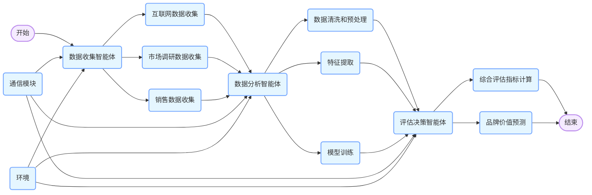

# 多智能体系统在品牌价值评估中的应用：量化无形资产

> 关键词：多智能体系统、品牌价值评估、量化无形资产、人工智能、数据分析

> 摘要：本文深入探讨了多智能体系统在品牌价值评估中量化无形资产的应用。首先介绍了相关背景，包括目的范围、预期读者等。接着阐述了核心概念与联系，剖析了多智能体系统和品牌价值评估的原理及架构，并给出示意图和流程图。详细讲解了核心算法原理及具体操作步骤，结合 Python 代码进行说明。通过数学模型和公式对品牌价值量化进行深入分析，并举例说明。在项目实战部分，给出了开发环境搭建、源代码实现及解读。还探讨了实际应用场景，推荐了学习资源、开发工具框架和相关论文著作。最后总结了未来发展趋势与挑战，提供了常见问题解答和扩展阅读参考资料，旨在为利用多智能体系统进行品牌价值评估提供全面的技术指导和理论支持。

## 1. 背景介绍 

### 1.1 目的和范围
在当今竞争激烈的商业环境中，品牌作为企业的重要无形资产，其价值的准确评估对于企业的战略决策、市场竞争和投资者的判断都具有至关重要的意义。传统的品牌价值评估方法往往存在一定的局限性，难以全面、准确地量化品牌所蕴含的无形资产。本文章的目的在于深入研究多智能体系统在品牌价值评估中的应用，通过引入多智能体系统的先进技术，实现对品牌无形资产的更精确量化。

本文章的范围涵盖了多智能体系统的基本原理、品牌价值评估的相关理论、核心算法的实现、数学模型的构建、实际项目的案例分析以及未来发展趋势的探讨等方面。旨在为相关领域的研究人员、企业管理者和技术开发者提供一个全面、系统的参考。

### 1.2 预期读者
本文的预期读者主要包括以下几类人群：
- **学术研究人员**：对多智能体系统、品牌价值评估、人工智能等领域感兴趣的学者和研究生，希望通过本文了解最新的研究动态和技术应用。
- **企业管理者**：负责企业品牌战略规划和管理的人员，期望借助多智能体系统的方法更准确地评估品牌价值，为企业的决策提供依据。
- **技术开发者**：从事软件开发、数据分析、人工智能等相关领域的专业人员，有意将多智能体系统应用于品牌价值评估项目中，提升自身的技术能力和项目经验。
- **投资者**：关注企业品牌价值和无形资产的投资者，希望通过本文了解如何利用多智能体系统评估品牌价值，做出更明智的投资决策。

### 1.3 文档结构概述
本文的文档结构如下：
- **核心概念与联系**：介绍多智能体系统和品牌价值评估的核心概念，分析它们之间的联系，并给出原理和架构的文本示意图及 Mermaid 流程图。
- **核心算法原理 & 具体操作步骤**：详细讲解多智能体系统在品牌价值评估中所使用的核心算法原理，并给出具体的操作步骤，同时结合 Python 代码进行说明。
- **数学模型和公式 & 详细讲解 & 举例说明**：构建用于品牌价值评估的数学模型，给出相关公式，并进行详细讲解和举例说明。
- **项目实战：代码实际案例和详细解释说明**：通过一个实际的项目案例，介绍开发环境的搭建、源代码的实现和解读，以及对代码的分析。
- **实际应用场景**：探讨多智能体系统在品牌价值评估中的实际应用场景，分析其优势和局限性。
- **工具和资源推荐**：推荐相关的学习资源、开发工具框架和论文著作，帮助读者进一步深入学习和研究。
- **总结：未来发展趋势与挑战**：总结多智能体系统在品牌价值评估中的应用现状，分析未来的发展趋势和面临的挑战。
- **附录：常见问题与解答**：解答读者在阅读本文过程中可能遇到的常见问题。
- **扩展阅读 & 参考资料**：提供相关的扩展阅读材料和参考资料，方便读者进一步深入研究。

### 1.4 术语表

#### 1.4.1 核心术语定义
- **多智能体系统（Multi - Agent System，MAS）**：由多个智能体组成的系统，这些智能体能够感知环境、进行决策并与其他智能体和环境进行交互，以实现共同或各自的目标。
- **品牌价值评估**：对品牌所具有的经济价值进行评估的过程，包括对品牌的知名度、美誉度、忠诚度等无形资产的量化。
- **无形资产**：企业拥有或控制的没有实物形态的可辨认非货币性资产，如品牌、专利、商标等。
- **智能体（Agent）**：具有自主性、反应性、社会性和主动性等特征的实体，能够在一定的环境中独立地完成特定的任务。

#### 1.4.2 相关概念解释
- **自主性**：智能体能够在没有外界直接干预的情况下，独立地做出决策和采取行动。
- **反应性**：智能体能够感知环境的变化，并根据环境的变化及时调整自己的行为。
- **社会性**：智能体能够与其他智能体进行交互和协作，以实现共同的目标。
- **主动性**：智能体能够主动地发起行动，追求自己的目标。

#### 1.4.3 缩略词列表
- **MAS**：Multi - Agent System（多智能体系统）
- **AI**：Artificial Intelligence（人工智能）
- **ML**：Machine Learning（机器学习）
- **NLP**：Natural Language Processing（自然语言处理）

## 2. 核心概念与联系 

### 2.1 多智能体系统原理
多智能体系统是一种分布式人工智能系统，由多个智能体组成。每个智能体都具有一定的知识和能力，能够感知环境中的信息，并根据这些信息做出决策和采取行动。智能体之间通过通信和协作来实现共同的目标。

多智能体系统的核心原理包括以下几个方面：
- **智能体的自主性**：每个智能体都可以独立地进行决策和行动，不受其他智能体的直接控制。
- **智能体的交互性**：智能体之间可以通过消息传递等方式进行交互，共享信息和协调行动。
- **智能体的适应性**：智能体能够根据环境的变化和其他智能体的行为调整自己的策略。

### 2.2 品牌价值评估原理
品牌价值评估是一个复杂的过程，旨在确定品牌在市场中的经济价值。品牌价值的来源主要包括品牌的知名度、美誉度、忠诚度、市场份额等因素。

常见的品牌价值评估方法包括：
- **成本法**：基于品牌的创建和维护成本来评估品牌价值。
- **市场法**：通过比较类似品牌的市场交易价格来评估品牌价值。
- **收益法**：根据品牌未来的预期收益来评估品牌价值。

### 2.3 多智能体系统与品牌价值评估的联系
多智能体系统可以为品牌价值评估提供一种新的思路和方法。通过将品牌价值评估过程分解为多个子任务，并由不同的智能体来完成这些任务，可以提高评估的准确性和效率。

例如，可以设计不同的智能体来负责收集品牌相关的数据、分析市场趋势、评估消费者态度等。这些智能体之间通过协作和信息共享，最终实现对品牌价值的综合评估。

### 2.4 原理和架构的文本示意图
以下是多智能体系统在品牌价值评估中的原理和架构的文本示意图：

```plaintext
品牌价值评估系统
|
|-- 数据收集智能体
|   |-- 互联网数据收集
|   |-- 市场调研数据收集
|   |-- 销售数据收集
|
|-- 数据分析智能体
|   |-- 数据清洗和预处理
|   |-- 特征提取
|   |-- 模型训练
|
|-- 评估决策智能体
|   |-- 综合评估指标计算
|   |-- 品牌价值预测
|
|-- 通信模块
|   |-- 智能体之间的消息传递
|
|-- 环境
|   |-- 市场环境
|   |-- 消费者环境
```

### 2.5 Mermaid 流程图


## 3. 核心算法原理 & 具体操作步骤 

### 3.1 核心算法原理
在多智能体系统用于品牌价值评估中，核心算法主要涉及数据处理、特征提取和价值预测等方面。以下是几个常用的算法：

#### 3.1.1 数据处理算法
数据处理算法主要用于对收集到的原始数据进行清洗和预处理，以提高数据的质量和可用性。常见的数据处理算法包括：
- **数据清洗**：去除数据中的噪声、重复值和缺失值。
- **数据标准化**：将数据转换为统一的尺度，以便进行比较和分析。

#### 3.1.2 特征提取算法
特征提取算法用于从原始数据中提取与品牌价值相关的特征。常见的特征提取算法包括：
- **主成分分析（PCA）**：通过线性变换将原始数据转换为一组互不相关的主成分，从而减少数据的维度。
- **词袋模型（Bag of Words）**：用于处理文本数据，将文本表示为词汇的向量。

#### 3.1.3 价值预测算法
价值预测算法用于根据提取的特征预测品牌的价值。常见的价值预测算法包括：
- **线性回归**：通过建立线性模型来预测品牌价值。
- **神经网络**：利用神经网络的强大非线性拟合能力来预测品牌价值。

### 3.2 具体操作步骤

#### 3.2.1 数据收集
- 互联网数据收集：使用网络爬虫技术从社交媒体、新闻网站等收集与品牌相关的文本数据。
- 市场调研数据收集：通过问卷调查、访谈等方式收集消费者对品牌的态度和认知数据。
- 销售数据收集：从企业的销售系统中收集品牌的销售数据。

#### 3.2.2 数据处理
以下是使用 Python 进行数据清洗和标准化的示例代码：
```python
import pandas as pd
from sklearn.preprocessing import StandardScaler

# 读取数据
data = pd.read_csv('brand_data.csv')

# 数据清洗：去除缺失值
data = data.dropna()

# 数据标准化
scaler = StandardScaler()
numerical_columns = data.select_dtypes(include=['number']).columns
data[numerical_columns] = scaler.fit_transform(data[numerical_columns])

print(data.head())
```

#### 3.2.3 特征提取
以下是使用主成分分析（PCA）进行特征提取的示例代码：
```python
from sklearn.decomposition import PCA

# 提取数值特征
numerical_features = data[numerical_columns]

# 使用 PCA 进行特征提取
pca = PCA(n_components=2)
pca_features = pca.fit_transform(numerical_features)

print(pca_features[:5])
```

#### 3.2.4 价值预测
以下是使用线性回归进行品牌价值预测的示例代码：
```python
from sklearn.model_selection import train_test_split
from sklearn.linear_model import LinearRegression
from sklearn.metrics import mean_squared_error

# 划分训练集和测试集
X = pca_features
y = data['brand_value']
X_train, X_test, y_train, y_test = train_test_split(X, y, test_size=0.2, random_state=42)

# 训练线性回归模型
model = LinearRegression()
model.fit(X_train, y_train)

# 预测品牌价值
y_pred = model.predict(X_test)

# 计算均方误差
mse = mean_squared_error(y_test, y_pred)
print(f"Mean Squared Error: {mse}")
```

## 4. 数学模型和公式 & 详细讲解 & 举例说明 

### 4.1 线性回归模型
线性回归是一种广泛应用于预测问题的统计模型。其基本形式为：
$$y = \beta_0 + \beta_1x_1 + \beta_2x_2 + \cdots + \beta_nx_n + \epsilon$$
其中，$y$ 是因变量（品牌价值），$x_1, x_2, \cdots, x_n$ 是自变量（特征），$\beta_0, \beta_1, \cdots, \beta_n$ 是模型的系数，$\epsilon$ 是误差项。

### 4.2 模型参数估计
线性回归模型的参数可以通过最小二乘法进行估计。最小二乘法的目标是使预测值与实际值之间的误差平方和最小，即：
$$\min_{\beta_0, \beta_1, \cdots, \beta_n} \sum_{i=1}^{m} (y_i - (\beta_0 + \beta_1x_{i1} + \beta_2x_{i2} + \cdots + \beta_nx_{in}))^2$$
其中，$m$ 是样本数量，$y_i$ 是第 $i$ 个样本的实际值，$x_{i1}, x_{i2}, \cdots, x_{in}$ 是第 $i$ 个样本的自变量值。

### 4.3 举例说明
假设我们有一个包含品牌的知名度、美誉度和市场份额三个特征的数据集，我们可以使用线性回归模型来预测品牌价值。

设知名度为 $x_1$，美誉度为 $x_2$，市场份额为 $x_3$，品牌价值为 $y$。则线性回归模型可以表示为：
$$y = \beta_0 + \beta_1x_1 + \beta_2x_2 + \beta_3x_3 + \epsilon$$

通过最小二乘法估计模型的参数 $\beta_0, \beta_1, \beta_2, \beta_3$，得到具体的模型。然后，对于一个新的品牌，我们可以根据其知名度、美誉度和市场份额的值，代入模型中预测其品牌价值。

### 4.4 模型评估
线性回归模型的评估可以使用均方误差（MSE）、均方根误差（RMSE）和决定系数（$R^2$）等指标。

- 均方误差（MSE）：
$$MSE = \frac{1}{m} \sum_{i=1}^{m} (y_i - \hat{y}_i)^2$$
其中，$\hat{y}_i$ 是第 $i$ 个样本的预测值。

- 均方根误差（RMSE）：
$$RMSE = \sqrt{\frac{1}{m} \sum_{i=1}^{m} (y_i - \hat{y}_i)^2}$$

- 决定系数（$R^2$）：
$$R^2 = 1 - \frac{\sum_{i=1}^{m} (y_i - \hat{y}_i)^2}{\sum_{i=1}^{m} (y_i - \bar{y})^2}$$
其中，$\bar{y}$ 是 $y$ 的平均值。

## 5. 项目实战：代码实际案例和详细解释说明 

### 5.1  开发环境搭建
在进行多智能体系统在品牌价值评估的项目实战之前，需要搭建相应的开发环境。以下是具体的步骤：

#### 5.1.1 安装 Python
Python 是一种广泛使用的编程语言，在数据分析和人工智能领域有很多强大的库。可以从 Python 官方网站（https://www.python.org/downloads/）下载并安装 Python。

#### 5.1.2 安装必要的库
在命令行中使用以下命令安装必要的库：
```sh
pip install pandas numpy scikit-learn matplotlib
```
- **pandas**：用于数据处理和分析。
- **numpy**：用于数值计算。
- **scikit-learn**：提供了各种机器学习算法和工具。
- **matplotlib**：用于数据可视化。

### 5.2  源代码详细实现和代码解读
以下是一个完整的多智能体系统在品牌价值评估中的项目实战代码：
```python
import pandas as pd
import numpy as np
from sklearn.model_selection import train_test_split
from sklearn.preprocessing import StandardScaler
from sklearn.decomposition import PCA
from sklearn.linear_model import LinearRegression
from sklearn.metrics import mean_squared_error
import matplotlib.pyplot as plt

# 1. 数据加载
data = pd.read_csv('brand_data.csv')

# 2. 数据预处理
# 去除缺失值
data = data.dropna()

# 提取特征和目标变量
X = data.drop('brand_value', axis=1)
y = data['brand_value']

# 数据标准化
scaler = StandardScaler()
X_scaled = scaler.fit_transform(X)

# 3. 特征提取
pca = PCA(n_components=2)
X_pca = pca.fit_transform(X_scaled)

# 4. 划分训练集和测试集
X_train, X_test, y_train, y_test = train_test_split(X_pca, y, test_size=0.2, random_state=42)

# 5. 模型训练
model = LinearRegression()
model.fit(X_train, y_train)

# 6. 模型预测
y_pred = model.predict(X_test)

# 7. 模型评估
mse = mean_squared_error(y_test, y_pred)
print(f"Mean Squared Error: {mse}")

# 8. 数据可视化
plt.scatter(y_test, y_pred)
plt.xlabel('Actual Brand Value')
plt.ylabel('Predicted Brand Value')
plt.title('Actual vs Predicted Brand Value')
plt.show()
```

### 5.3  代码解读与分析
- **数据加载**：使用 `pandas` 库的 `read_csv` 函数读取品牌数据文件。
- **数据预处理**：去除数据中的缺失值，提取特征和目标变量，并使用 `StandardScaler` 对特征进行标准化处理。
- **特征提取**：使用 `PCA` 对标准化后的特征进行降维，提取主要特征。
- **划分训练集和测试集**：使用 `train_test_split` 函数将数据集划分为训练集和测试集。
- **模型训练**：使用 `LinearRegression` 模型对训练集进行训练。
- **模型预测**：使用训练好的模型对测试集进行预测。
- **模型评估**：使用 `mean_squared_error` 函数计算预测值与实际值之间的均方误差。
- **数据可视化**：使用 `matplotlib` 库绘制实际品牌价值与预测品牌价值的散点图，直观展示模型的预测效果。

## 6. 实际应用场景 
### 6.1 企业战略决策
企业在制定战略决策时，需要准确了解自身品牌的价值。通过多智能体系统对品牌价值进行量化评估，企业可以更好地了解品牌在市场中的地位和竞争力，从而制定出更合理的战略决策。例如，企业可以根据品牌价值评估结果决定是否进行品牌扩张、品牌升级或品牌转型等。

### 6.2 品牌营销活动评估
在开展品牌营销活动后，企业需要评估活动的效果。多智能体系统可以通过收集和分析相关数据，对品牌营销活动前后的品牌价值进行评估，从而判断活动是否达到了预期的效果。例如，通过比较活动前后品牌的知名度、美誉度和忠诚度等指标的变化，评估营销活动对品牌价值的提升作用。

### 6.3 企业并购和重组
在企业并购和重组过程中，品牌价值是一个重要的考虑因素。多智能体系统可以对被并购或重组企业的品牌价值进行准确评估，为并购和重组交易提供参考依据。例如，在并购谈判中，双方可以根据品牌价值评估结果确定合理的交易价格。

### 6.4 投资者决策
投资者在进行投资决策时，会关注企业的品牌价值。多智能体系统可以为投资者提供客观、准确的品牌价值评估信息，帮助投资者做出更明智的投资决策。例如，投资者可以根据品牌价值评估结果选择具有较高品牌价值和增长潜力的企业进行投资。

## 7. 工具和资源推荐
### 7.1 学习资源推荐
#### 7.1.1 书籍推荐
- 《多智能体系统：原理与编程》：全面介绍了多智能体系统的基本原理、设计方法和编程实现。
- 《品牌管理》：深入探讨了品牌价值评估的理论和方法，以及品牌管理的策略和实践。
- 《Python 数据分析实战》：详细介绍了 Python 在数据分析领域的应用，包括数据处理、特征提取和模型训练等方面。

#### 7.1.2 在线课程
- Coursera 上的“多智能体系统”课程：由知名高校的教授授课，系统地介绍了多智能体系统的相关知识。
- edX 上的“品牌战略与管理”课程：帮助学习者了解品牌价值评估和品牌管理的核心概念和方法。
- 网易云课堂上的“Python 数据分析入门”课程：适合初学者学习 Python 数据分析的基础知识和技能。

#### 7.1.3 技术博客和网站
- Medium：有很多关于多智能体系统、品牌价值评估和数据分析的优质文章。
- 开源中国：提供了丰富的技术资源和社区讨论，有助于了解最新的技术动态。
- Kaggle：一个数据科学竞赛平台，有很多关于品牌价值评估和数据分析的数据集和代码示例。

### 7.2 开发工具框架推荐
#### 7.2.1 IDE和编辑器
- PyCharm：一款功能强大的 Python 集成开发环境，提供了代码编辑、调试、版本控制等丰富的功能。
- Jupyter Notebook：一种交互式的开发环境，适合进行数据分析和模型实验。
- Visual Studio Code：一款轻量级的代码编辑器，支持多种编程语言和插件扩展。

#### 7.2.2 调试和性能分析工具
- pdb：Python 内置的调试器，可以帮助开发者定位和解决代码中的问题。
- cProfile：Python 的性能分析工具，可以分析代码的运行时间和内存使用情况。
- TensorBoard：用于可视化深度学习模型的训练过程和性能指标。

#### 7.2.3 相关框架和库
- Mesa：一个用于构建多智能体系统的 Python 框架，提供了丰富的智能体模型和交互机制。
- scikit-learn：一个广泛使用的机器学习库，提供了各种机器学习算法和工具。
- NLTK：自然语言处理工具包，用于处理和分析文本数据。

### 7.3 相关论文著作推荐
#### 7.3.1 经典论文
- “Multi - Agent Systems: A Modern Approach to Distributed Artificial Intelligence”：对多智能体系统的基本概念和理论进行了系统的阐述。
- “Brand Equity and Its Creation: A Review of the Literature”：对品牌价值评估和品牌权益的相关理论进行了综述。
- “A Machine Learning Approach to Brand Value Prediction”：介绍了使用机器学习方法进行品牌价值预测的研究成果。

#### 7.3.2 最新研究成果
- 每年在国际人工智能会议（如 IJCAI、AAAI）和营销学术会议（如 AMA、EMAC）上发表的关于多智能体系统和品牌价值评估的研究论文。
- 相关学术期刊（如《Artificial Intelligence》、《Journal of Marketing》）上的最新研究成果。

#### 7.3.3 应用案例分析
- 一些知名企业（如可口可乐、苹果）的品牌价值评估案例分析，这些案例可以帮助我们了解多智能体系统在实际应用中的效果和经验。

## 8. 总结：未来发展趋势与挑战
### 8.1 未来发展趋势
- **智能化和自动化**：随着人工智能技术的不断发展，多智能体系统在品牌价值评估中的应用将更加智能化和自动化。智能体将能够自动收集、分析和处理数据，实时更新品牌价值评估结果。
- **多模态数据融合**：未来的品牌价值评估将不仅仅依赖于传统的文本和数值数据，还将融合图像、音频、视频等多模态数据。多智能体系统可以更好地处理和分析这些多模态数据，提高品牌价值评估的准确性。
- **跨领域应用**：多智能体系统在品牌价值评估中的应用将与其他领域（如市场营销、金融、社会学等）进行更深入的融合。通过跨领域的应用，可以从多个角度全面评估品牌价值。

### 8.2 挑战
- **数据质量和安全**：多智能体系统在品牌价值评估中需要大量的数据支持，数据的质量和安全是一个重要的挑战。如何确保数据的准确性、完整性和安全性，是需要解决的问题。
- **模型可解释性**：一些复杂的人工智能模型（如神经网络）在品牌价值评估中具有较高的预测精度，但模型的可解释性较差。如何提高模型的可解释性，让企业管理者和投资者更好地理解品牌价值评估结果，是一个亟待解决的问题。
- **智能体协作和协调**：在多智能体系统中，智能体之间的协作和协调是一个关键问题。如何设计有效的智能体协作机制，确保智能体之间能够高效地进行信息共享和任务分配，是提高品牌价值评估效率和准确性的关键。

## 9. 附录：常见问题与解答
### 9.1 多智能体系统在品牌价值评估中的优势是什么？
多智能体系统在品牌价值评估中的优势主要包括：
- 提高评估的准确性：通过多个智能体的协作和信息共享，可以从多个角度全面评估品牌价值，提高评估的准确性。
- 增强评估的效率：智能体可以并行处理任务，提高数据处理和分析的效率。
- 适应复杂环境：多智能体系统具有较强的适应性，可以根据环境的变化及时调整评估策略。

### 9.2 如何选择适合的智能体模型？
选择适合的智能体模型需要考虑以下因素：
- 任务需求：根据品牌价值评估的具体任务需求，选择具有相应功能的智能体模型。
- 数据特点：根据数据的类型、规模和特点，选择适合的数据处理和分析智能体模型。
- 计算资源：考虑计算资源的限制，选择计算复杂度适中的智能体模型。

### 9.3 多智能体系统在品牌价值评估中的应用前景如何？
多智能体系统在品牌价值评估中的应用前景广阔。随着人工智能技术的不断发展和企业对品牌价值重视程度的提高，多智能体系统将在品牌价值评估中发挥越来越重要的作用。未来，多智能体系统将与其他技术（如区块链、物联网）相结合，为品牌价值评估提供更加全面、准确和高效的解决方案。

## 10. 扩展阅读 & 参考资料
### 10.1 扩展阅读
- 《人工智能：一种现代方法》：全面介绍了人工智能的基本概念、方法和技术，有助于深入理解多智能体系统的理论基础。
- 《营销管理》：系统阐述了市场营销的理论和实践，对品牌价值评估和品牌管理有更深入的认识。
- 《大数据时代：生活、工作与思维的大变革》：探讨了大数据在各个领域的应用，包括品牌价值评估中的数据收集和分析。

### 10.2 参考资料
- 《多智能体系统原理与应用》
- 《品牌价值评估方法研究》
- 相关学术论文和研究报告

以上文章通过详细的阐述和分析，全面介绍了多智能体系统在品牌价值评估中量化无形资产的应用，为相关领域的研究和实践提供了有价值的参考。