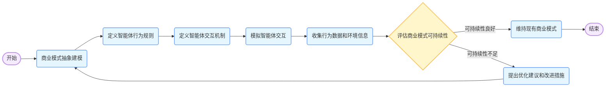

# 多智能体系统在商业模式可持续性分析中的应用

> 关键词：多智能体系统、商业模式、可持续性分析、复杂系统、智能决策

> 摘要：本文聚焦于多智能体系统在商业模式可持续性分析中的应用。首先介绍了多智能体系统及商业模式可持续性分析的背景知识，包括目的、预期读者、文档结构等。接着阐述了多智能体系统与商业模式可持续性分析的核心概念及联系，给出了原理和架构的文本示意图与 Mermaid 流程图。详细讲解了核心算法原理并结合 Python 代码进行阐述，同时介绍了相关数学模型和公式。通过项目实战，展示了代码实际案例并进行详细解释说明。探讨了多智能体系统在商业模式可持续性分析中的实际应用场景，推荐了学习、开发工具及相关论文著作。最后总结了未来发展趋势与挑战，提供了常见问题解答及扩展阅读参考资料，旨在全面深入地探讨多智能体系统在该领域的应用。

## 1. 背景介绍 
### 1.1 目的和范围
在当今复杂多变的商业环境中，商业模式的可持续性成为企业关注的核心问题之一。多智能体系统作为一种强大的建模和分析工具，能够模拟复杂系统中多个智能体之间的交互行为，为商业模式的可持续性分析提供了新的视角和方法。本文的目的在于深入探讨多智能体系统在商业模式可持续性分析中的应用，详细介绍相关的理论、算法、实践案例等内容，范围涵盖从多智能体系统的基本概念到实际应用的各个方面，旨在为研究人员、企业管理者和从业者提供全面且深入的参考。

### 1.2 预期读者
本文预期读者包括但不限于以下几类人群：
- **学术研究人员**：对多智能体系统、商业模式创新、可持续发展等领域感兴趣的学者和研究人员，希望通过本文了解多智能体系统在商业模式可持续性分析中的前沿研究成果和应用方法。
- **企业管理者**：关注企业商业模式的可持续性，希望借助多智能体系统的方法来评估和优化企业的商业模式，以提高企业的竞争力和可持续发展能力。
- **技术开发者**：对多智能体系统的编程实现、算法优化等技术细节感兴趣的程序员和软件工程师，希望通过本文学习如何使用多智能体系统进行商业模式分析的具体技术和方法。
- **学生**：学习管理科学、计算机科学、系统工程等相关专业的学生，希望通过本文拓宽知识面，了解跨学科领域的研究和应用。

### 1.3 文档结构概述
本文的结构如下：
- **核心概念与联系**：介绍多智能体系统和商业模式可持续性分析的核心概念，阐述它们之间的联系，并给出原理和架构的文本示意图与 Mermaid 流程图。
- **核心算法原理 & 具体操作步骤**：详细讲解多智能体系统在商业模式可持续性分析中使用的核心算法原理，并使用 Python 源代码进行阐述。
- **数学模型和公式 & 详细讲解 & 举例说明**：介绍相关的数学模型和公式，进行详细讲解并举例说明。
- **项目实战：代码实际案例和详细解释说明**：通过实际项目案例，展示多智能体系统在商业模式可持续性分析中的具体应用，包括开发环境搭建、源代码实现和代码解读。
- **实际应用场景**：探讨多智能体系统在商业模式可持续性分析中的实际应用场景。
- **工具和资源推荐**：推荐学习、开发工具及相关论文著作，帮助读者进一步深入学习和研究。
- **总结：未来发展趋势与挑战**：总结多智能体系统在商业模式可持续性分析中的未来发展趋势和面临的挑战。
- **附录：常见问题与解答**：提供常见问题的解答，帮助读者解决在学习和应用过程中遇到的问题。
- **扩展阅读 & 参考资料**：提供扩展阅读的建议和参考资料，方便读者进一步深入学习和研究。

### 1.4 术语表
#### 1.4.1 核心术语定义
- **多智能体系统（Multi - Agent System，MAS）**：由多个智能体组成的系统，每个智能体具有一定的自主性、智能性和交互能力，能够在一定的环境中感知信息、做出决策并采取行动，通过智能体之间的交互实现系统的整体目标。
- **商业模式**：企业为了创造价值、传递价值和获取价值而建立的一种逻辑架构和运营方式，包括客户细分、价值主张、渠道通路、客户关系、收入来源、核心资源、关键业务、重要合作和成本结构等要素。
- **商业模式可持续性**：指商业模式在长期内能够保持经济可行性、社会合法性和环境友好性，实现经济、社会和环境的协调发展。
- **智能体（Agent）**：在多智能体系统中，具有感知、决策和行动能力的实体，能够根据自身的目标和环境信息自主地做出决策并采取行动。

#### 1.4.2 相关概念解释
- **复杂系统**：由大量相互作用的组件组成的系统，其行为和性质不能简单地从组件的性质中推导出来，具有涌现性、自组织性、适应性等特点。多智能体系统是一种典型的复杂系统，通过智能体之间的交互可以涌现出复杂的系统行为。
- **可持续发展**：指既满足当代人的需求，又不损害后代人满足其需求的能力的发展。商业模式的可持续性是可持续发展理念在企业层面的具体体现。

#### 1.4.3 缩略词列表
- **MAS**：Multi - Agent System（多智能体系统）
- **AI**：Artificial Intelligence（人工智能）

## 2. 核心概念与联系 
### 2.1 多智能体系统的核心概念
多智能体系统是一种分布式人工智能系统，由多个智能体组成。每个智能体具有以下特点：
- **自主性**：智能体能够在一定程度上独立地感知环境、做出决策并采取行动，不需要外界的直接干预。
- **智能性**：智能体具有一定的知识和推理能力，能够根据环境信息和自身的目标进行推理和决策。
- **交互性**：智能体能够与其他智能体进行通信和协作，通过交互实现系统的整体目标。

多智能体系统的架构通常包括智能体层、通信层和环境层。智能体层包含多个智能体，每个智能体负责完成特定的任务；通信层负责智能体之间的信息传递和交互；环境层提供智能体活动的环境和资源。

### 2.2 商业模式可持续性分析的核心概念
商业模式可持续性分析是对商业模式在经济、社会和环境三个维度上的可持续性进行评估和分析的过程。经济可持续性关注商业模式的盈利能力和财务健康状况；社会可持续性关注商业模式对社会的影响，如就业、社会公平等；环境可持续性关注商业模式对环境的影响，如资源利用、环境污染等。

商业模式可持续性分析的目的是识别商业模式中存在的问题和风险，发现潜在的机会和改进空间，从而优化商业模式，提高其可持续性。

### 2.3 核心概念的联系
多智能体系统与商业模式可持续性分析之间存在着密切的联系。多智能体系统可以用于模拟商业模式中的各个参与者（如企业、客户、供应商等）的行为和交互，从而深入了解商业模式的运行机制和动态变化。通过多智能体系统的模拟和分析，可以评估商业模式在不同情况下的可持续性，发现潜在的问题和风险，并提出相应的改进措施。

例如，在多智能体系统中，可以将企业、客户和供应商分别建模为不同的智能体，每个智能体具有自己的目标和行为规则。通过模拟智能体之间的交互，可以分析商业模式中各个环节的运作情况，评估其对经济、社会和环境的影响，从而为商业模式的优化和可持续发展提供决策支持。

### 2.4 原理和架构的文本示意图
多智能体系统在商业模式可持续性分析中的原理和架构可以用以下文本示意图表示：

多智能体系统在商业模式可持续性分析中，首先对商业模式进行抽象和建模，将商业模式中的各个参与者和要素抽象为智能体和环境因素。然后，通过定义智能体的行为规则和交互机制，模拟智能体之间的交互和商业模式的运行过程。在模拟过程中，收集智能体的行为数据和环境信息，对商业模式的可持续性进行评估和分析。最后，根据评估结果，提出商业模式的优化建议和改进措施。

### 2.5 Mermaid 流程图


## 3. 核心算法原理 & 具体操作步骤 
### 3.1 核心算法原理
在多智能体系统中，常用的算法包括基于规则的算法、基于学习的算法和基于博弈论的算法等。以下以基于规则的算法为例，介绍其在商业模式可持续性分析中的应用原理。

基于规则的算法是一种简单而有效的智能体决策算法，它通过定义一组规则来指导智能体的行为。在商业模式可持续性分析中，每个智能体（如企业、客户、供应商等）可以根据自身的目标和环境信息，按照预先定义的规则做出决策。

例如，企业智能体的决策规则可以包括：如果市场需求增加，则增加生产规模；如果成本上升，则提高产品价格等。客户智能体的决策规则可以包括：如果产品价格降低，则增加购买量；如果产品质量提高，则更倾向于购买该产品等。

### 3.2 具体操作步骤
以下是基于规则的算法在商业模式可持续性分析中的具体操作步骤：

#### 3.2.1 定义智能体和环境
首先，需要定义商业模式中的各个参与者为智能体，并定义智能体的属性和行为。同时，需要定义智能体活动的环境，包括市场需求、资源供应、政策法规等因素。

#### 3.2.2 定义规则
根据智能体的目标和环境信息，定义一组规则来指导智能体的行为。规则可以用条件 - 动作的形式表示，例如：如果条件满足，则执行相应的动作。

#### 3.2.3 模拟智能体交互
在模拟过程中，每个智能体根据自身的规则和环境信息做出决策，并与其他智能体进行交互。交互可以包括信息传递、合作、竞争等行为。

#### 3.2.4 评估商业模式可持续性
在模拟过程中，收集智能体的行为数据和环境信息，对商业模式的可持续性进行评估。评估指标可以包括经济指标（如利润、销售额等）、社会指标（如就业人数、社会满意度等）和环境指标（如资源利用率、污染物排放量等）。

#### 3.2.5 优化商业模式
根据评估结果，提出商业模式的优化建议和改进措施。优化措施可以包括调整智能体的行为规则、改变商业模式的结构等。

### 3.3 Python 源代码阐述
以下是一个简单的基于规则的多智能体系统在商业模式可持续性分析中的 Python 代码示例：

```python
# 定义智能体类
class Agent:
    def __init__(self, name, initial_state):
        self.name = name
        self.state = initial_state

    def make_decision(self, environment):
        # 简单的决策规则示例
        if environment["market_demand"] > 100:
            self.state["production_scale"] += 10
        if environment["cost"] > 50:
            self.state["product_price"] += 5
        return self.state

# 定义环境类
class Environment:
    def __init__(self, market_demand, cost):
        self.market_demand = market_demand
        self.cost = cost

    def get_environment_info(self):
        return {"market_demand": self.market_demand, "cost": self.cost}

# 模拟过程
if __name__ == "__main__":
    # 初始化智能体和环境
    enterprise = Agent("Enterprise", {"production_scale": 100, "product_price": 100})
    environment = Environment(120, 60)

    # 智能体做出决策
    new_state = enterprise.make_decision(environment.get_environment_info())

    print(f"Enterprise new state: {new_state}")
```

在这个示例中，我们定义了一个智能体类 `Agent` 和一个环境类 `Environment`。智能体根据环境信息和预先定义的规则做出决策，模拟了企业在不同市场需求和成本情况下的决策过程。

## 4. 数学模型和公式 & 详细讲解 & 举例说明 
### 4.1 数学模型
在多智能体系统中，常用的数学模型包括马尔可夫决策过程（Markov Decision Process，MDP）、博弈论模型等。以下以马尔可夫决策过程为例，介绍其在商业模式可持续性分析中的应用。

马尔可夫决策过程是一种用于描述智能体在随机环境中决策的数学模型，它由状态集 $S$、动作集 $A$、状态转移概率 $P(s'|s,a)$、奖励函数 $R(s,a,s')$ 和折扣因子 $\gamma$ 组成。

### 4.2 数学公式
在马尔可夫决策过程中，智能体的目标是最大化长期累积奖励。长期累积奖励可以用以下公式表示：

$$G_t = \sum_{k = 0}^{\infty} \gamma^k R_{t + k + 1}$$

其中，$G_t$ 表示在时间步 $t$ 时的长期累积奖励，$R_{t + k + 1}$ 表示在时间步 $t + k + 1$ 时获得的奖励，$\gamma$ 是折扣因子，用于衡量未来奖励的重要性。

智能体的最优策略 $\pi^*$ 可以通过求解贝尔曼方程得到：

$$V^*(s) = \max_{a \in A} \sum_{s' \in S} P(s'|s,a) [R(s,a,s') + \gamma V^*(s')]$$

其中，$V^*(s)$ 表示在状态 $s$ 下的最优价值函数。

### 4.3 详细讲解
马尔可夫决策过程的核心思想是，智能体在每个时间步根据当前状态选择一个动作，执行该动作后，环境会根据状态转移概率转移到下一个状态，并给予智能体一个奖励。智能体的目标是通过选择最优的动作序列，最大化长期累积奖励。

在商业模式可持续性分析中，可以将商业模式的状态（如市场份额、利润、社会影响等）作为马尔可夫决策过程的状态，将企业的决策（如产品定价、生产规模调整等）作为动作，将商业模式的可持续性指标（如经济收益、社会满意度、环境影响等）作为奖励。通过求解马尔可夫决策过程的最优策略，可以得到使商业模式可持续性最大化的决策方案。

### 4.4 举例说明
假设一个企业面临两种市场状态：高需求和低需求，企业可以选择两种动作：扩大生产规模和维持现有生产规模。状态转移概率和奖励函数如下表所示：

| 状态 $s$ | 动作 $a$ | 下一个状态 $s'$ | 状态转移概率 $P(s'|s,a)$ | 奖励 $R(s,a,s')$ |
|---|---|---|---|---|
| 高需求 | 扩大生产规模 | 高需求 | 0.8 | 100 |
| 高需求 | 扩大生产规模 | 低需求 | 0.2 | -50 |
| 高需求 | 维持现有生产规模 | 高需求 | 0.6 | 50 |
| 高需求 | 维持现有生产规模 | 低需求 | 0.4 | 20 |
| 低需求 | 扩大生产规模 | 高需求 | 0.3 | 30 |
| 低需求 | 扩大生产规模 | 低需求 | 0.7 | -20 |
| 低需求 | 维持现有生产规模 | 高需求 | 0.2 | 10 |
| 低需求 | 维持现有生产规模 | 低需求 | 0.8 | 5 |

假设折扣因子 $\gamma = 0.9$，我们可以通过求解贝尔曼方程来得到最优策略。

首先，初始化价值函数 $V^0(s) = 0$，然后迭代更新价值函数：

$$V^{n + 1}(s) = \max_{a \in A} \sum_{s' \in S} P(s'|s,a) [R(s,a,s') + \gamma V^n(s')]$$

经过多次迭代，直到价值函数收敛，得到最优价值函数 $V^*(s)$，进而得到最优策略 $\pi^*(s)$。

在这个例子中，通过求解马尔可夫决策过程的最优策略，企业可以根据市场状态选择最优的生产规模决策，从而最大化长期累积奖励，提高商业模式的可持续性。

## 5. 项目实战：代码实际案例和详细解释说明 
### 5.1 开发环境搭建
在进行多智能体系统在商业模式可持续性分析的项目实战之前，需要搭建相应的开发环境。以下是具体的搭建步骤：

#### 5.1.1 安装 Python
Python 是一种广泛使用的编程语言，在多智能体系统开发中也非常常用。可以从 Python 官方网站（https://www.python.org/downloads/） 下载并安装 Python 3.x 版本。

#### 5.1.2 安装必要的库
在多智能体系统开发中，常用的库包括 `numpy`、`matplotlib` 等。可以使用 `pip` 命令来安装这些库：

```sh
pip install numpy matplotlib
```

#### 5.1.3 选择开发工具
可以选择使用集成开发环境（IDE）如 PyCharm、VS Code 等进行代码开发和调试。

### 5.2 源代码详细实现和代码解读
以下是一个更复杂的多智能体系统在商业模式可持续性分析中的 Python 代码示例：

```python
import numpy as np
import matplotlib.pyplot as plt

# 定义智能体类
class Agent:
    def __init__(self, name, initial_state, decision_rules):
        self.name = name
        self.state = initial_state
        self.decision_rules = decision_rules

    def make_decision(self, environment):
        for rule in self.decision_rules:
            condition = rule["condition"]
            action = rule["action"]
            if condition(environment, self.state):
                action(self.state)
        return self.state

# 定义环境类
class Environment:
    def __init__(self, initial_market_demand, initial_cost):
        self.market_demand = initial_market_demand
        self.cost = initial_cost

    def update_environment(self):
        # 简单的环境更新规则
        self.market_demand += np.random.randint(-10, 10)
        self.cost += np.random.randint(-5, 5)
        self.market_demand = max(0, self.market_demand)
        self.cost = max(0, self.cost)
        return {"market_demand": self.market_demand, "cost": self.cost}

# 定义决策规则
def condition1(environment, state):
    return environment["market_demand"] > state["production_scale"]

def action1(state):
    state["production_scale"] += 10

def condition2(environment, state):
    return environment["cost"] > 50

def action2(state):
    state["product_price"] += 5

# 模拟过程
if __name__ == "__main__":
    # 初始化智能体和环境
    enterprise = Agent("Enterprise", {"production_scale": 100, "product_price": 100}, [
        {"condition": condition1, "action": action1},
        {"condition": condition2, "action": action2}
    ])
    environment = Environment(120, 60)

    production_scales = []
    product_prices = []
    market_demands = []
    costs = []

    # 模拟 100 个时间步
    for _ in range(100):
        environment_info = environment.update_environment()
        new_state = enterprise.make_decision(environment_info)
        production_scales.append(new_state["production_scale"])
        product_prices.append(new_state["product_price"])
        market_demands.append(environment_info["market_demand"])
        costs.append(environment_info["cost"])

    # 绘制图表
    plt.figure(figsize=(12, 8))
    plt.subplot(2, 2, 1)
    plt.plot(production_scales)
    plt.title("Production Scale")
    plt.subplot(2, 2, 2)
    plt.plot(product_prices)
    plt.title("Product Price")
    plt.subplot(2, 2, 3)
    plt.plot(market_demands)
    plt.title("Market Demand")
    plt.subplot(2, 2, 4)
    plt.plot(costs)
    plt.title("Cost")
    plt.tight_layout()
    plt.show()
```

### 5.3 代码解读与分析
#### 5.3.1 智能体类 `Agent`
- `__init__` 方法：初始化智能体的名称、初始状态和决策规则。
- `make_decision` 方法：根据环境信息和决策规则，智能体做出决策并更新自身状态。

#### 5.3.2 环境类 `Environment`
- `__init__` 方法：初始化环境的初始市场需求和成本。
- `update_environment` 方法：更新环境状态，模拟市场需求和成本的随机变化。

#### 5.3.3 决策规则
定义了两个决策规则：`condition1` 和 `action1` 表示当市场需求大于生产规模时，增加生产规模；`condition2` 和 `action2` 表示当成本大于 50 时，提高产品价格。

#### 5.3.4 模拟过程
在模拟过程中，环境不断更新，智能体根据环境信息做出决策。记录每个时间步的生产规模、产品价格、市场需求和成本，并绘制图表进行可视化分析。

通过这个代码示例，我们可以模拟企业在不同市场环境下的决策过程，观察企业的生产规模、产品价格等指标的变化情况，从而评估商业模式的可持续性。

## 6. 实际应用场景 
### 6.1 供应链管理
在供应链管理中，多智能体系统可以用于模拟供应商、制造商、分销商和零售商等参与者之间的交互行为。通过多智能体系统的模拟和分析，可以优化供应链的结构和运作流程，提高供应链的效率和灵活性，降低成本，提高客户满意度，从而增强商业模式的可持续性。

例如，在供应商选择方面，多智能体系统可以模拟不同供应商的行为和性能，帮助企业选择最优的供应商组合。在库存管理方面，多智能体系统可以模拟需求的不确定性和供应的波动性，帮助企业制定合理的库存策略，减少库存积压和缺货现象。

### 6.2 市场营销
在市场营销中，多智能体系统可以用于模拟消费者的行为和偏好，以及企业的营销策略对消费者的影响。通过多智能体系统的模拟和分析，可以优化企业的市场营销策略，提高市场份额和销售额，增强商业模式的可持续性。

例如，在产品定价方面，多智能体系统可以模拟消费者对不同价格的反应，帮助企业制定合理的价格策略。在广告投放方面，多智能体系统可以模拟广告对消费者购买决策的影响，帮助企业优化广告投放策略，提高广告效果。

### 6.3 企业战略规划
在企业战略规划中，多智能体系统可以用于模拟企业与竞争对手、合作伙伴和市场环境之间的交互行为。通过多智能体系统的模拟和分析，可以评估不同战略方案的可行性和效果，帮助企业制定最优的战略规划，提高企业的竞争力和可持续发展能力。

例如，在市场进入战略方面，多智能体系统可以模拟不同市场进入方式的风险和收益，帮助企业选择最优的市场进入策略。在合作战略方面，多智能体系统可以模拟不同合作伙伴的行为和利益诉求，帮助企业选择合适的合作伙伴，制定合理的合作策略。

### 6.4 可持续发展评估
多智能体系统可以用于对商业模式的可持续性进行全面评估。通过模拟商业模式中各个参与者的行为和交互，以及商业模式对经济、社会和环境的影响，可以综合评估商业模式的可持续性水平，发现潜在的问题和风险，并提出相应的改进措施。

例如，在经济可持续性评估方面，多智能体系统可以模拟企业的盈利能力、财务状况和市场竞争力等指标。在社会可持续性评估方面，多智能体系统可以模拟企业对就业、社会公平和社会责任的影响。在环境可持续性评估方面，多智能体系统可以模拟企业对资源利用、环境污染和生态保护的影响。

## 7. 工具和资源推荐
### 7.1 学习资源推荐
#### 7.1.1 书籍推荐
- 《多智能体系统：原理与编程》：本书系统地介绍了多智能体系统的基本原理、方法和技术，包括智能体的建模、通信、协作和学习等方面，是学习多智能体系统的经典教材。
- 《商业模式新生代》：本书介绍了商业模式的创新方法和工具，包括商业模式画布、客户细分、价值主张等内容，对于理解商业模式的本质和创新具有重要的参考价值。
- 《可持续发展经济学》：本书介绍了可持续发展的基本理论和方法，包括经济、社会和环境三个维度的可持续发展，对于理解商业模式的可持续性具有重要的指导意义。

#### 7.1.2 在线课程
- Coursera 上的“Multi - Agent Systems”课程：该课程由知名高校的教授授课，系统地介绍了多智能体系统的基本原理、算法和应用，通过视频讲解、作业和讨论等方式，帮助学习者深入理解多智能体系统。
- edX 上的“Business Model Innovation”课程：该课程介绍了商业模式创新的方法和实践，通过案例分析和实践项目，帮助学习者掌握商业模式创新的技能和方法。
- Udemy 上的“Introduction to Sustainable Development”课程：该课程介绍了可持续发展的基本概念、理论和实践，通过视频讲解、案例分析和讨论等方式，帮助学习者了解可持续发展的重要性和实现途径。

#### 7.1.3 技术博客和网站
- AgentLink：一个专注于多智能体系统研究和开发的网站，提供了多智能体系统的最新研究成果、技术文章、开源代码等资源。
- Harvard Business Review：哈佛商业评论网站，提供了关于商业模式创新、企业战略、市场营销等方面的最新研究成果和案例分析，对于理解商业模式的实践和应用具有重要的参考价值。
- Sustainable Development Goals：联合国可持续发展目标网站，提供了关于可持续发展的最新政策、报告和数据，对于理解商业模式的可持续性具有重要的指导意义。

### 7.2 开发工具框架推荐
#### 7.2.1 IDE和编辑器
- PyCharm：一款功能强大的 Python 集成开发环境，提供了代码编辑、调试、版本控制等功能，适合多智能体系统的开发和调试。
- VS Code：一款轻量级的代码编辑器，支持多种编程语言，具有丰富的插件和扩展功能，适合快速开发和调试多智能体系统。

#### 7.2.2 调试和性能分析工具
- PDB：Python 自带的调试器，可以帮助开发者在代码中设置断点、单步执行、查看变量值等，方便调试多智能体系统的代码。
- cProfile：Python 自带的性能分析工具，可以帮助开发者分析代码的性能瓶颈，优化多智能体系统的性能。

#### 7.2.3 相关框架和库
- Mesa：一个基于 Python 的多智能体系统建模和仿真框架，提供了智能体建模、环境建模、交互机制等功能，方便开发者快速搭建多智能体系统。
- NetworkX：一个用于复杂网络分析的 Python 库，可以用于模拟多智能体系统中智能体之间的交互网络，分析网络的结构和特性。

### 7.3 相关论文著作推荐
#### 7.3.1 经典论文
- “Multi - Agent Systems: A Modern Approach to Distributed Artificial Intelligence”：该论文系统地介绍了多智能体系统的基本概念、理论和方法，是多智能体系统领域的经典论文。
- “Business Model Innovation: The Organization's Role in Value Creation”：该论文探讨了商业模式创新的本质和组织在价值创造中的作用，对于理解商业模式创新具有重要的参考价值。
- “Sustainable Business Models: An Emerging Field of Research”：该论文介绍了可持续商业模式的概念、特征和研究现状，对于理解商业模式的可持续性具有重要的指导意义。

#### 7.3.2 最新研究成果
- 关注 ACM Transactions on Intelligent Systems and Technology、Journal of Artificial Intelligence Research 等学术期刊，获取多智能体系统领域的最新研究成果。
- 关注 Strategic Management Journal、Journal of Business Venturing 等学术期刊，获取商业模式创新和可持续发展领域的最新研究成果。

#### 7.3.3 应用案例分析
- 分析一些知名企业的商业模式创新和可持续发展案例，如特斯拉的电动汽车商业模式、星巴克的咖啡文化商业模式等，了解多智能体系统在实际商业模式中的应用和效果。

## 8. 总结：未来发展趋势与挑战
### 8.1 未来发展趋势
#### 8.1.1 与其他技术的融合
多智能体系统将与人工智能、大数据、区块链等技术深度融合，进一步拓展其在商业模式可持续性分析中的应用范围和能力。例如，与人工智能技术结合，可以提高智能体的智能水平和决策能力；与大数据技术结合，可以利用海量的数据进行更准确的模拟和分析；与区块链技术结合，可以提高多智能体系统的安全性和可信度。

#### 8.1.2 跨学科研究和应用
多智能体系统在商业模式可持续性分析中的应用将涉及到计算机科学、管理学、经济学、社会学、环境科学等多个学科领域，跨学科研究和应用将成为未来的发展趋势。通过跨学科的合作和研究，可以更好地理解商业模式的复杂性和可持续性，提出更有效的解决方案。

#### 8.1.3 智能化和自动化
随着人工智能技术的发展，多智能体系统将越来越智能化和自动化。智能体将能够自动学习和适应环境的变化，自主地做出决策和调整行为，提高商业模式的灵活性和适应性。

### 8.2 挑战
#### 8.2.1 模型的复杂性和准确性
多智能体系统模型的复杂性和准确性是一个挑战。商业模式是一个复杂的系统，涉及到多个参与者和因素，如何准确地建模和模拟商业模式的运行机制和动态变化是一个难题。同时，模型的复杂性也会增加计算成本和分析难度。

#### 8.2.2 数据的获取和处理
多智能体系统在商业模式可持续性分析中需要大量的数据支持，如何获取准确、全面的数据，并进行有效的处理和分析是一个挑战。数据的质量和可用性将直接影响到模型的准确性和分析结果的可靠性。

#### 8.2.3 伦理和法律问题
多智能体系统的应用可能会带来一些伦理和法律问题，如智能体的行为责任、数据隐私保护、算法偏见等。如何解决这些伦理和法律问题，确保多智能体系统的应用符合社会道德和法律规范是一个挑战。

## 9. 附录：常见问题与解答
### 9.1 多智能体系统在商业模式可持续性分析中的优势是什么？
多智能体系统在商业模式可持续性分析中的优势包括：
- 能够模拟复杂系统中多个智能体之间的交互行为，更真实地反映商业模式的运行机制和动态变化。
- 可以对商业模式的可持续性进行全面评估，考虑到经济、社会和环境等多个维度的因素。
- 可以通过模拟不同的情景和策略，为商业模式的优化和决策提供支持。

### 9.2 如何选择合适的多智能体系统算法？
选择合适的多智能体系统算法需要考虑以下因素：
- 问题的性质和特点：不同的问题适合不同的算法，例如，基于规则的算法适用于简单的决策问题，基于学习的算法适用于复杂的环境和不确定的情况。
- 数据的可用性：算法的选择还需要考虑数据的可用性，例如，基于数据驱动的算法需要大量的历史数据支持。
- 计算资源和时间限制：不同的算法具有不同的计算复杂度和时间复杂度，需要根据计算资源和时间限制选择合适的算法。

### 9.3 多智能体系统模型的准确性如何保证？
保证多智能体系统模型的准确性需要从以下几个方面入手：
- 合理的建模：根据问题的特点和需求，选择合适的智能体模型和环境模型，确保模型能够准确地反映商业模式的本质和运行机制。
- 数据的准确性：使用准确、全面的数据进行模型训练和验证，确保模型的参数和规则符合实际情况。
- 模型的验证和校准：通过与实际数据的对比和分析，对模型进行验证和校准，不断优化模型的参数和规则，提高模型的准确性。

### 9.4 多智能体系统在实际应用中可能会遇到哪些问题？
多智能体系统在实际应用中可能会遇到以下问题：
- 计算资源限制：多智能体系统模型的计算复杂度较高，可能会受到计算资源的限制，导致模拟速度慢或无法运行。
- 数据质量问题：数据的质量和可用性直接影响到模型的准确性和分析结果的可靠性，如果数据存在误差或缺失，可能会导致模型的偏差和错误。
- 模型的可解释性问题：一些复杂的多智能体系统模型可能具有较高的黑盒性，难以解释模型的决策过程和结果，影响到模型的可信度和应用效果。

## 10. 扩展阅读 & 参考资料
### 10.1 扩展阅读
- 《智能系统中的多智能体建模与仿真》：深入介绍了多智能体系统的建模和仿真方法，包括智能体的行为建模、交互建模、学习建模等内容，适合对多智能体系统技术细节感兴趣的读者。
- 《创新者的窘境》：探讨了企业在创新过程中面临的挑战和机遇，对于理解商业模式创新的重要性和复杂性具有重要的启示作用。
- 《绿色经济与可持续发展》：介绍了绿色经济的概念、理论和实践，对于理解商业模式的环境可持续性具有重要的参考价值。

### 10.2 参考资料
- Wooldridge, M. (2009). An Introduction to Multi - Agent Systems. John Wiley & Sons.
- Osterwalder, A., & Pigneur, Y. (2010). Business Model Generation: A Handbook for Visionaries, Game Changers, and Challengers. John Wiley & Sons.
- Elkington, J. (1997). Cannibals with Forks: The Triple Bottom Line of 21st Century Business. Capstone Publishing.