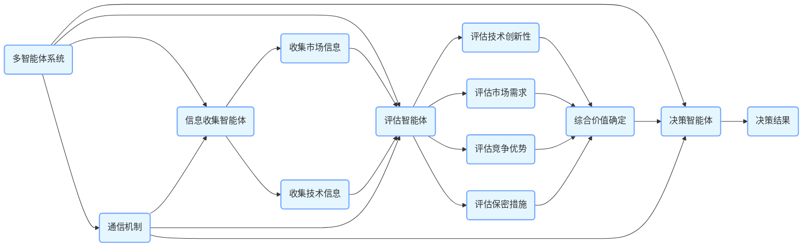

# 多智能体系统在商业秘密价值评估中的应用：挖掘隐藏资产

> 关键词：多智能体系统、商业秘密价值评估、隐藏资产挖掘、智能决策、信息交互

> 摘要：本文聚焦于多智能体系统在商业秘密价值评估中的应用，旨在探讨如何通过该系统挖掘企业隐藏资产。首先介绍了多智能体系统和商业秘密价值评估的背景知识，阐述了核心概念及其联系。详细讲解了多智能体系统应用于商业秘密价值评估的核心算法原理，并给出具体操作步骤和Python源代码示例。同时，运用数学模型和公式对评估过程进行详细说明，并举例分析。通过项目实战展示了多智能体系统在实际商业秘密价值评估中的代码实现和解读。接着探讨了该应用的实际场景，推荐了相关的学习资源、开发工具框架和论文著作。最后总结了多智能体系统在商业秘密价值评估领域的未来发展趋势与挑战，并对常见问题进行了解答。

## 1. 背景介绍 
### 1.1 目的和范围
在当今竞争激烈的商业环境中，商业秘密作为企业的重要资产，其价值评估具有至关重要的意义。准确评估商业秘密的价值有助于企业进行合理的资产配置、知识产权保护以及战略决策。然而，传统的商业秘密价值评估方法往往存在局限性，难以全面、准确地挖掘商业秘密背后隐藏的资产价值。

本文章的目的在于探讨多智能体系统在商业秘密价值评估中的应用，通过引入智能体的自主决策和交互机制，实现对商业秘密价值的更精准评估，挖掘其中的隐藏资产。文章的范围涵盖了多智能体系统的基本原理、商业秘密价值评估的核心概念、相关算法原理和操作步骤、数学模型的构建与分析、实际项目案例以及未来发展趋势等方面。

### 1.2 预期读者
本文预期读者包括从事商业秘密管理、知识产权评估、人工智能技术应用等领域的专业人士，如企业管理人员、评估师、科研人员和技术开发者等。同时，对于对商业秘密价值评估和多智能体系统感兴趣的学生和爱好者也具有一定的参考价值。

### 1.3 文档结构概述
本文共分为十个部分，具体结构如下：
1. 背景介绍：阐述文章的目的、范围、预期读者和文档结构概述，并对相关术语进行解释。
2. 核心概念与联系：介绍多智能体系统和商业秘密价值评估的核心概念，以及它们之间的联系，并通过文本示意图和Mermaid流程图进行展示。
3. 核心算法原理 & 具体操作步骤：详细讲解多智能体系统应用于商业秘密价值评估的核心算法原理，并给出具体操作步骤和Python源代码示例。
4. 数学模型和公式 & 详细讲解 & 举例说明：运用数学模型和公式对商业秘密价值评估过程进行详细说明，并举例分析。
5. 项目实战：代码实际案例和详细解释说明：通过实际项目案例展示多智能体系统在商业秘密价值评估中的代码实现和解读。
6. 实际应用场景：探讨多智能体系统在商业秘密价值评估中的实际应用场景。
7. 工具和资源推荐：推荐相关的学习资源、开发工具框架和论文著作。
8. 总结：未来发展趋势与挑战：总结多智能体系统在商业秘密价值评估领域的未来发展趋势与挑战。
9. 附录：常见问题与解答：对常见问题进行解答。
10. 扩展阅读 & 参考资料：提供扩展阅读的建议和参考资料。

### 1.4 术语表
#### 1.4.1 核心术语定义
- **多智能体系统（Multi - Agent System，MAS）**：由多个智能体组成的系统，这些智能体能够在一定的环境中自主地感知、决策和行动，并通过相互通信和协作来完成共同的任务。
- **商业秘密**：是指不为公众所知悉、具有商业价值并经权利人采取相应保密措施的技术信息、经营信息等商业信息。
- **商业秘密价值评估**：是指对商业秘密所具有的经济价值进行评估的过程，通过一定的方法和模型确定商业秘密在特定时间和市场条件下的价值。
- **智能体（Agent）**：具有自主决策能力的实体，能够感知环境信息，根据自身的目标和规则进行决策，并采取相应的行动。

#### 1.4.2 相关概念解释
- **自主决策**：智能体能够根据自身的知识和目标，独立地做出决策，而不需要外部的直接干预。
- **信息交互**：智能体之间通过某种通信机制进行信息的交换和共享，以实现协作和协调。
- **隐藏资产**：商业秘密中那些不易被直接发现和评估的价值部分，如潜在的市场竞争力、未来的收益潜力等。

#### 1.4.3 缩略词列表
- MAS：Multi - Agent System（多智能体系统）
- AI：Artificial Intelligence（人工智能）

## 2. 核心概念与联系 

### 2.1 多智能体系统核心原理
多智能体系统是人工智能领域的一个重要分支，它模拟了人类社会中多个个体之间的协作和交互行为。在多智能体系统中，每个智能体都具有一定的自主性和智能性，能够根据自身的目标和环境信息进行决策和行动。智能体之间通过通信机制进行信息交互，从而实现协作和协调，共同完成复杂的任务。

多智能体系统的架构通常包括以下几个部分：
- **智能体**：是系统的基本组成单元，具有感知、决策和行动的能力。
- **环境**：智能体所处的外部世界，提供了智能体感知的信息和行动的空间。
- **通信机制**：用于智能体之间的信息交换和共享，确保智能体能够协同工作。

### 2.2 商业秘密价值评估核心概念
商业秘密价值评估是一个复杂的过程，需要综合考虑多个因素。商业秘密的价值主要取决于其对企业的贡献，包括提高生产效率、降低成本、增强市场竞争力等方面。评估商业秘密的价值通常需要考虑以下几个因素：
- **技术创新性**：商业秘密所涉及的技术是否具有创新性和独特性。
- **市场需求**：商业秘密所对应的产品或服务在市场上的需求程度。
- **竞争优势**：商业秘密能够为企业带来的竞争优势，如降低成本、提高质量等。
- **保密措施**：企业为保护商业秘密所采取的措施的有效性。

### 2.3 两者之间的联系
多智能体系统可以为商业秘密价值评估提供更有效的方法和手段。通过将不同类型的智能体应用于商业秘密价值评估过程中，可以实现对多个评估因素的综合分析和判断。例如，可以使用信息收集智能体收集商业秘密相关的市场信息、技术信息等；使用评估智能体根据收集到的信息进行价值评估；使用决策智能体根据评估结果做出决策。

智能体之间的信息交互和协作可以提高评估的准确性和可靠性。不同智能体可以从不同的角度对商业秘密进行评估，通过信息共享和协作，可以避免单一评估方法的局限性，挖掘出商业秘密中的隐藏资产。

### 2.4 文本示意图
```plaintext
多智能体系统
├── 信息收集智能体
│   └── 收集商业秘密相关信息（市场、技术等）
├── 评估智能体
│   └── 根据收集信息评估商业秘密价值
├── 决策智能体
│   └── 根据评估结果做出决策
└── 通信机制
    └── 实现智能体之间信息交互

商业秘密价值评估
├── 技术创新性评估
├── 市场需求评估
├── 竞争优势评估
├── 保密措施评估
└── 综合价值确定

联系：多智能体系统各智能体协作完成商业秘密价值评估各环节，挖掘隐藏资产
```

### 2.5 Mermaid流程图


## 3. 核心算法原理 & 具体操作步骤 

### 3.1 核心算法原理
在多智能体系统应用于商业秘密价值评估中，核心算法主要涉及信息融合、权重分配和价值计算。

#### 3.1.1 信息融合算法
信息收集智能体收集到的信息可能来自不同的数据源，具有不同的格式和质量。信息融合算法的目的是将这些信息进行整合，消除信息之间的冲突和冗余，得到一个统一的信息表示。常用的信息融合算法有加权平均法、Dempster - Shafer证据理论等。

#### 3.1.2 权重分配算法
不同的评估因素对商业秘密价值的影响程度不同，因此需要为每个评估因素分配相应的权重。权重分配算法可以根据专家经验、历史数据等方法来确定。例如，可以使用层次分析法（AHP）来确定各评估因素的权重。

#### 3.1.3 价值计算算法
根据融合后的信息和各评估因素的权重，计算商业秘密的价值。常用的价值计算方法有成本法、市场法和收益法等。在多智能体系统中，可以综合考虑这些方法，根据不同的情况选择合适的计算方法。

### 3.2 具体操作步骤

#### 3.2.1 信息收集阶段
- 信息收集智能体通过网络爬虫、数据库查询等方式收集商业秘密相关的市场信息、技术信息、竞争信息等。
- 对收集到的信息进行预处理，包括数据清洗、格式转换等，以提高信息的质量。

#### 3.2.2 信息融合阶段
- 使用信息融合算法将预处理后的信息进行融合，得到一个统一的信息表示。
- 对融合后的信息进行质量评估，确保信息的准确性和可靠性。

#### 3.2.3 权重分配阶段
- 使用权重分配算法确定各评估因素的权重。
- 可以邀请专家对权重进行评估和调整，以确保权重的合理性。

#### 3.2.4 价值计算阶段
- 根据融合后的信息和各评估因素的权重，选择合适的价值计算方法计算商业秘密的价值。
- 对计算结果进行验证和评估，确保结果的准确性和可靠性。

#### 3.2.5 决策阶段
- 决策智能体根据计算得到的商业秘密价值，结合企业的战略目标和实际情况，做出决策，如是否继续保护商业秘密、是否进行商业秘密的转让等。

### 3.3 Python源代码示例
```python
import numpy as np

# 信息收集（模拟）
def collect_information():
    market_info = np.random.rand(10)  # 模拟市场信息
    tech_info = np.random.rand(10)    # 模拟技术信息
    return market_info, tech_info

# 信息融合（加权平均法）
def information_fusion(market_info, tech_info, market_weight=0.6, tech_weight=0.4):
    fused_info = market_weight * market_info + tech_weight * tech_info
    return fused_info

# 权重分配（简单示例，实际可使用AHP等方法）
def weight_allocation():
    market_weight = 0.6
    tech_weight = 0.4
    return market_weight, tech_weight

# 价值计算（简单线性计算示例）
def value_calculation(fused_info, weight1=0.7, weight2=0.3):
    value = weight1 * np.mean(fused_info[:5]) + weight2 * np.mean(fused_info[5:])
    return value

# 主函数
def main():
    market_info, tech_info = collect_information()
    market_weight, tech_weight = weight_allocation()
    fused_info = information_fusion(market_info, tech_info, market_weight, tech_weight)
    value = value_calculation(fused_info)
    print("商业秘密价值评估结果：", value)

if __name__ == "__main__":
    main()
```

在上述代码中，首先模拟了信息收集过程，然后使用加权平均法进行信息融合，简单地分配了权重，最后通过线性计算得到商业秘密的价值。实际应用中，需要根据具体情况对代码进行优化和扩展。

## 4. 数学模型和公式 & 详细讲解 & 举例说明 

### 4.1 信息融合数学模型
#### 4.1.1 加权平均法
假设我们有 $n$ 个信息源，每个信息源提供的信息为 $x_i$（$i = 1,2,\cdots,n$），对应的权重为 $w_i$（$\sum_{i = 1}^{n}w_i = 1$），则融合后的信息 $x_f$ 可以表示为：
$$x_f=\sum_{i = 1}^{n}w_ix_i$$

例如，有两个信息源，信息分别为 $x_1 = 0.8$ 和 $x_2 = 0.6$，权重分别为 $w_1 = 0.6$ 和 $w_2 = 0.4$，则融合后的信息为：
$$x_f=0.6\times0.8 + 0.4\times0.6=0.48 + 0.24 = 0.72$$

#### 4.1.2 Dempster - Shafer证据理论
Dempster - Shafer证据理论是一种处理不确定性信息的方法。设 $\Theta$ 为识别框架，$m$ 为基本概率分配函数，满足 $\sum_{A\subseteq\Theta}m(A)=1$。对于两个证据 $m_1$ 和 $m_2$，其融合后的基本概率分配函数 $m_{12}$ 可以通过Dempster组合规则计算：
$$m_{12}(A)=\frac{1}{1 - K}\sum_{B\cap C = A}m_1(B)m_2(C)$$
其中 $K=\sum_{B\cap C=\varnothing}m_1(B)m_2(C)$ 是冲突系数。

### 4.2 权重分配数学模型
#### 4.2.1 层次分析法（AHP）
层次分析法是一种将复杂问题分解为多个层次，通过两两比较确定各因素权重的方法。具体步骤如下：
1. **建立层次结构模型**：将问题分解为目标层、准则层和方案层。
2. **构造判断矩阵**：对同一层次的因素进行两两比较，确定相对重要性，构造判断矩阵 $A=(a_{ij})_{n\times n}$，其中 $a_{ij}$ 表示因素 $i$ 相对于因素 $j$ 的重要性。
3. **计算特征向量和特征值**：求解判断矩阵的最大特征值 $\lambda_{max}$ 及其对应的特征向量 $W$，对特征向量进行归一化处理，得到各因素的权重。
4. **一致性检验**：计算一致性指标 $CI=\frac{\lambda_{max}-n}{n - 1}$，平均随机一致性指标 $RI$（根据矩阵阶数 $n$ 查表得到），一致性比率 $CR=\frac{CI}{RI}$。当 $CR\lt0.1$ 时，认为判断矩阵具有满意的一致性。

例如，对于一个包含三个因素的判断矩阵 $A=\begin{bmatrix}1&3&5\\\frac{1}{3}&1&3\\\frac{1}{5}&\frac{1}{3}&1\end{bmatrix}$，通过计算可得 $\lambda_{max}\approx3.0385$，$CI\approx0.0192$，$RI = 0.58$，$CR\approx0.0331\lt0.1$，判断矩阵具有满意的一致性。对应的特征向量归一化后得到权重向量 $W=(0.637, 0.258, 0.105)$。

### 4.3 价值计算数学模型
#### 4.3.1 成本法
成本法是根据商业秘密的开发成本、维护成本等因素来评估其价值。设开发成本为 $C_d$，维护成本为 $C_m$，则商业秘密的价值 $V$ 可以表示为：
$$V = C_d + C_m$$

例如，某商业秘密的开发成本为 $100$ 万元，每年的维护成本为 $10$ 万元，预计使用年限为 $5$ 年，则该商业秘密的价值为 $V = 100+10\times5 = 150$ 万元。

#### 4.3.2 市场法
市场法是通过比较类似商业秘密的市场交易价格来评估目标商业秘密的价值。设类似商业秘密的市场价格为 $P_s$，调整系数为 $k$（考虑技术差异、市场差异等因素），则目标商业秘密的价值 $V$ 可以表示为：
$$V = kP_s$$

例如，市场上类似商业秘密的交易价格为 $200$ 万元，由于目标商业秘密的技术创新性更高，调整系数 $k = 1.2$，则目标商业秘密的价值为 $V = 1.2\times200 = 240$ 万元。

#### 4.3.3 收益法
收益法是根据商业秘密未来的预期收益来评估其价值。设未来 $n$ 年的预期收益为 $R_i$（$i = 1,2,\cdots,n$），折现率为 $r$，则商业秘密的价值 $V$ 可以表示为：
$$V=\sum_{i = 1}^{n}\frac{R_i}{(1 + r)^i}$$

例如，某商业秘密预计未来 $3$ 年的收益分别为 $50$ 万元、$60$ 万元和 $70$ 万元，折现率为 $10\%$，则该商业秘密的价值为：
$$V=\frac{50}{(1 + 0.1)^1}+\frac{60}{(1 + 0.1)^2}+\frac{70}{(1 + 0.1)^3}\approx45.45+49.59+52.59 = 147.63$$ 万元。

## 5. 项目实战：代码实际案例和详细解释说明 

### 5.1  开发环境搭建
#### 5.1.1 操作系统
可以选择Windows、Linux或macOS等主流操作系统。本案例以Windows 10为例进行说明。

#### 5.1.2 Python环境
安装Python 3.x版本，建议使用Python 3.7及以上版本。可以从Python官方网站（https://www.python.org/downloads/）下载安装包进行安装。

#### 5.1.3 第三方库安装
使用pip命令安装所需的第三方库，主要包括numpy、pandas等。打开命令提示符，执行以下命令：
```sh
pip install numpy pandas
```

### 5.2  源代码详细实现和代码解读

```python
import numpy as np
import pandas as pd

# 信息收集智能体类
class InformationCollector:
    def __init__(self):
        self.data_sources = ['market_info.csv', 'tech_info.csv']

    def collect(self):
        market_info = pd.read_csv(self.data_sources[0]).values.flatten()
        tech_info = pd.read_csv(self.data_sources[1]).values.flatten()
        return market_info, tech_info

# 信息融合智能体类
class InformationFuser:
    def __init__(self, market_weight=0.6, tech_weight=0.4):
        self.market_weight = market_weight
        self.tech_weight = tech_weight

    def fuse(self, market_info, tech_info):
        fused_info = self.market_weight * market_info + self.tech_weight * tech_info
        return fused_info

# 权重分配智能体类
class WeightAllocator:
    def __init__(self):
        pass

    def allocate(self):
        market_weight = 0.6
        tech_weight = 0.4
        return market_weight, tech_weight

# 价值计算智能体类
class ValueCalculator:
    def __init__(self, weight1=0.7, weight2=0.3):
        self.weight1 = weight1
        self.weight2 = weight2

    def calculate(self, fused_info):
        value = self.weight1 * np.mean(fused_info[:5]) + self.weight2 * np.mean(fused_info[5:])
        return value

# 决策智能体类
class DecisionMaker:
    def __init__(self, threshold=100):
        self.threshold = threshold

    def make_decision(self, value):
        if value > self.threshold:
            decision = "继续保护商业秘密"
        else:
            decision = "考虑商业秘密转让"
        return decision

# 主函数
def main():
    # 信息收集
    collector = InformationCollector()
    market_info, tech_info = collector.collect()

    # 权重分配
    allocator = WeightAllocator()
    market_weight, tech_weight = allocator.allocate()

    # 信息融合
    fuser = InformationFuser(market_weight, tech_weight)
    fused_info = fuser.fuse(market_info, tech_info)

    # 价值计算
    calculator = ValueCalculator()
    value = calculator.calculate(fused_info)

    # 决策
    decision_maker = DecisionMaker()
    decision = decision_maker.make_decision(value)

    print("商业秘密价值评估结果：", value)
    print("决策结果：", decision)

if __name__ == "__main__":
    main()
```

### 5.3  代码解读与分析
#### 5.3.1 信息收集智能体类（InformationCollector）
- `__init__` 方法：初始化信息源，这里假设市场信息和技术信息分别存储在 `market_info.csv` 和 `tech_info.csv` 文件中。
- `collect` 方法：从CSV文件中读取市场信息和技术信息，并将其转换为一维数组返回。

#### 5.3.2 信息融合智能体类（InformationFuser）
- `__init__` 方法：初始化市场信息和技术信息的权重。
- `fuse` 方法：使用加权平均法将市场信息和技术信息进行融合，返回融合后的信息。

#### 5.3.3 权重分配智能体类（WeightAllocator）
- `__init__` 方法：初始化权重分配器。
- `allocate` 方法：简单地分配市场信息和技术信息的权重，实际应用中可以使用更复杂的方法，如AHP。

#### 5.3.4 价值计算智能体类（ValueCalculator）
- `__init__` 方法：初始化价值计算的权重。
- `calculate` 方法：根据融合后的信息和权重，计算商业秘密的价值。

#### 5.3.5 决策智能体类（DecisionMaker）
- `__init__` 方法：初始化决策阈值。
- `make_decision` 方法：根据计算得到的商业秘密价值和阈值，做出决策。

#### 5.3.6 主函数（main）
- 依次创建信息收集、权重分配、信息融合、价值计算和决策智能体，并调用相应的方法完成商业秘密价值评估和决策过程。
- 最后输出商业秘密价值评估结果和决策结果。

## 6. 实际应用场景 
### 6.1 企业并购中的商业秘密价值评估
在企业并购过程中，准确评估被并购企业的商业秘密价值至关重要。多智能体系统可以帮助并购方全面、准确地了解被并购企业的商业秘密资产，挖掘其中的隐藏价值。信息收集智能体可以收集被并购企业的市场份额、技术专利、客户资源等信息；评估智能体根据这些信息对商业秘密的价值进行评估；决策智能体根据评估结果决定是否进行并购以及并购的价格。

### 6.2 商业秘密转让中的价值评估
当企业考虑转让商业秘密时，需要对商业秘密的价值进行合理评估。多智能体系统可以通过分析市场需求、技术创新性等因素，为商业秘密的转让提供科学的定价依据。同时，智能体之间的协作可以确保评估过程的公正性和客观性，避免转让方和受让方之间的信息不对称。

### 6.3 企业知识产权战略制定
企业在制定知识产权战略时，需要对自身的商业秘密资产进行评估。多智能体系统可以帮助企业识别核心商业秘密，评估其价值和潜在风险。根据评估结果，企业可以制定相应的保护策略，如加强保密措施、申请专利等，以提高企业的市场竞争力。

### 6.4 商业秘密侵权赔偿评估
在商业秘密侵权案件中，需要准确评估商业秘密的价值，以确定侵权赔偿金额。多智能体系统可以综合考虑商业秘密的开发成本、市场价值、侵权行为对企业造成的损失等因素，为侵权赔偿评估提供准确的依据。

## 7. 工具和资源推荐
### 7.1 学习资源推荐
#### 7.1.1 书籍推荐
- 《多智能体系统：原理、设计与应用》：本书全面介绍了多智能体系统的基本原理、设计方法和应用案例，是学习多智能体系统的经典教材。
- 《商业秘密保护与价值评估》：详细讲解了商业秘密的保护策略和价值评估方法，对于从事商业秘密管理和评估的人员具有重要的参考价值。
- 《人工智能：一种现代方法》：涵盖了人工智能的各个领域，包括多智能体系统，对人工智能的基本概念、算法和应用进行了深入的阐述。

#### 7.1.2 在线课程
- Coursera平台上的“Multi - Agent Systems”课程：由知名高校的教授授课，系统地介绍了多智能体系统的理论和实践。
- edX平台上的“Business Secrets and Intellectual Property”课程：讲解了商业秘密和知识产权的相关知识，包括商业秘密的价值评估方法。
- 中国大学MOOC平台上的“人工智能基础”课程：对人工智能的基本概念和方法进行了介绍，其中包括多智能体系统的相关内容。

#### 7.1.3 技术博客和网站
- AI Time：专注于人工智能领域的技术分享和交流，经常发布多智能体系统的最新研究成果和应用案例。
- 开源中国：提供了丰富的技术文章和开源项目，对于学习多智能体系统的开发和应用具有一定的参考价值。
- 知乎：有许多关于多智能体系统和商业秘密价值评估的讨论和分享，可以从中获取不同的观点和经验。

### 7.2 开发工具框架推荐
#### 7.2.1 IDE和编辑器
- PyCharm：是一款专门为Python开发设计的集成开发环境，具有代码自动补全、调试等功能，适合多智能体系统的开发。
- Visual Studio Code：是一款轻量级的代码编辑器，支持多种编程语言和插件扩展，可用于多智能体系统的开发和调试。

#### 7.2.2 调试和性能分析工具
- pdb：Python自带的调试工具，可以帮助开发者定位代码中的问题。
- cProfile：Python的性能分析工具，可以分析代码的运行时间和函数调用情况，帮助优化代码性能。

#### 7.2.3 相关框架和库
- Mesa：是一个用于构建基于智能体的模型的Python框架，提供了丰富的智能体和环境类，方便开发者快速搭建多智能体系统。
- PyMAS：是一个开源的多智能体系统开发框架，支持智能体的通信、协作和决策等功能。

### 7.3 相关论文著作推荐
#### 7.3.1 经典论文
- “Multi - Agent Systems: A Modern Approach to Distributed Artificial Intelligence”：该论文对多智能体系统的基本概念、架构和算法进行了系统的介绍，是多智能体系统领域的经典之作。
- “Valuation of Trade Secrets: A Review of Methods and Approaches”：对商业秘密价值评估的方法和途径进行了综述，为商业秘密价值评估提供了理论基础。

#### 7.3.2 最新研究成果
- 近年来，关于多智能体系统在商业秘密价值评估中的应用的研究逐渐增多。可以通过IEEE Xplore、ACM Digital Library等学术数据库搜索相关的最新研究论文，了解该领域的最新进展。

#### 7.3.3 应用案例分析
- 一些知名企业的商业秘密价值评估案例可以为实际应用提供参考。可以通过企业的年报、新闻报道等渠道获取相关案例，并进行分析和总结。

## 8. 总结：未来发展趋势与挑战
### 8.1 未来发展趋势
#### 8.1.1 智能化程度不断提高
随着人工智能技术的不断发展，多智能体系统的智能化程度将不断提高。智能体将具备更强的自主学习和决策能力，能够更好地适应复杂多变的商业环境，提高商业秘密价值评估的准确性和效率。

#### 8.1.2 与其他技术的融合
多智能体系统将与区块链、大数据、云计算等技术深度融合。区块链技术可以为商业秘密的存储和共享提供安全可靠的保障；大数据技术可以为多智能体系统提供更丰富的信息资源；云计算技术可以为多智能体系统的运行提供强大的计算能力支持。

#### 8.1.3 应用领域不断拓展
多智能体系统在商业秘密价值评估中的应用将不仅仅局限于企业并购、转让等传统领域，还将拓展到新兴领域，如共享经济、人工智能创业公司等。随着商业形态的不断创新，多智能体系统将在更多的场景中发挥重要作用。

### 8.2 挑战
#### 8.2.1 数据质量和安全性
多智能体系统的运行依赖于大量的数据，数据的质量和安全性直接影响评估结果的准确性和可靠性。如何确保数据的真实性、完整性和保密性是一个亟待解决的问题。

#### 8.2.2 智能体之间的协作和协调
多智能体系统中智能体之间的协作和协调是一个复杂的问题。不同智能体可能具有不同的目标和利益，如何解决智能体之间的冲突，实现有效的协作和协调是提高系统性能的关键。

#### 8.2.3 法律和伦理问题
多智能体系统在商业秘密价值评估中的应用涉及到一些法律和伦理问题，如数据隐私保护、商业秘密泄露等。如何在法律和伦理的框架内合理应用多智能体系统是一个需要关注的问题。

## 9. 附录：常见问题与解答
### 9.1 多智能体系统在商业秘密价值评估中的准确性如何保证？
多智能体系统通过信息融合、权重分配和价值计算等多个环节来保证评估的准确性。信息收集智能体从多个数据源收集信息，减少了单一信息源的局限性；信息融合算法消除了信息之间的冲突和冗余；权重分配算法根据各评估因素的重要性合理分配权重；价值计算算法综合考虑多种方法，根据实际情况选择合适的计算方法。同时，智能体之间的协作和信息交互也可以提高评估的准确性和可靠性。

### 9.2 多智能体系统的开发难度大吗？
多智能体系统的开发难度取决于系统的复杂度和功能需求。对于简单的多智能体系统，使用现有的开发框架和工具可以相对容易地实现。但对于复杂的多智能体系统，需要考虑智能体的设计、通信机制、协作策略等多个方面，开发难度会相应增加。开发者需要具备一定的人工智能、编程和算法知识。

### 9.3 多智能体系统在商业秘密价值评估中的应用是否受行业限制？
多智能体系统在商业秘密价值评估中的应用不受行业限制。无论是制造业、服务业还是高科技行业，只要存在商业秘密资产，都可以应用多智能体系统进行价值评估。不同行业的商业秘密特点和评估因素可能有所不同，但多智能体系统可以通过调整信息收集策略、评估方法和权重分配等方式适应不同行业的需求。

### 9.4 如何选择合适的信息融合算法和价值计算方法？
选择合适的信息融合算法和价值计算方法需要考虑多个因素。信息融合算法的选择取决于信息的类型、来源和质量等因素。对于确定性信息，可以使用加权平均法；对于不确定性信息，可以使用Dempster - Shafer证据理论等方法。价值计算方法的选择取决于商业秘密的特点和评估目的。对于开发成本较高的商业秘密，可以使用成本法；对于市场交易活跃的商业秘密，可以使用市场法；对于具有未来收益潜力的商业秘密，可以使用收益法。在实际应用中，也可以综合考虑多种方法，以提高评估的准确性。

## 10. 扩展阅读 & 参考资料
### 10.1 扩展阅读
- 《区块链与多智能体系统的融合应用》：深入探讨了区块链技术与多智能体系统的融合方式和应用场景，为多智能体系统的发展提供了新的思路。
- 《大数据驱动的商业秘密管理》：介绍了大数据技术在商业秘密管理中的应用，包括数据挖掘、分析和预测等方面，对于提高商业秘密价值评估的准确性具有重要的参考价值。

### 10.2 参考资料
- 相关学术论文：在IEEE Xplore、ACM Digital Library、CNKI等学术数据库中搜索多智能体系统、商业秘密价值评估等相关主题的论文，获取最新的研究成果和理论依据。
- 行业报告：关注行业协会、咨询公司发布的关于商业秘密管理和评估的行业报告，了解行业动态和发展趋势。
- 法律法规：查阅《中华人民共和国反不正当竞争法》、《中华人民共和国知识产权法》等相关法律法规，了解商业秘密保护和价值评估的法律规定。