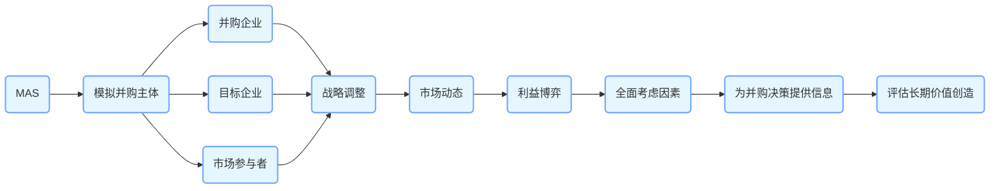

# 多智能体系统在并购分析中的应用：评估长期价值创造

> 关键词：多智能体系统、并购分析、长期价值创造、复杂系统、智能决策

> 摘要：本文聚焦于多智能体系统在并购分析中评估长期价值创造的应用。首先介绍了研究的背景和目的，阐述了多智能体系统、并购分析等核心概念及其联系。详细讲解了多智能体系统的核心算法原理，通过Python代码进行了具体实现。深入探讨了相关的数学模型和公式，并结合实际例子进行说明。通过项目实战展示了如何将多智能体系统应用于并购分析，包括开发环境搭建、源代码实现与解读。分析了多智能体系统在并购分析中的实际应用场景，推荐了相关的学习资源、开发工具和论文著作。最后总结了多智能体系统在并购分析领域的未来发展趋势与挑战，提供了常见问题解答和扩展阅读参考资料，旨在为相关领域的研究者和从业者提供全面深入的技术指导和理论支持。

## 1. 背景介绍 
### 1.1 目的和范围
在当今竞争激烈的商业环境中，并购已成为企业实现快速扩张、优化资源配置和提升竞争力的重要战略手段。然而，并购决策的复杂性和不确定性使得准确评估并购的长期价值创造变得尤为关键。传统的并购分析方法往往难以全面考虑到并购过程中涉及的众多因素及其相互作用，导致评估结果存在一定的局限性。

多智能体系统（Multi - Agent System，MAS）作为一种新兴的复杂系统建模和分析方法，能够模拟多个具有自主决策能力的智能体之间的交互行为，为并购分析提供了一种全新的视角和方法。本研究的目的在于探讨多智能体系统在并购分析中评估长期价值创造的应用，通过构建合适的多智能体模型，全面考虑并购过程中的各种因素，如市场动态、企业战略、财务状况等，以提高并购决策的科学性和准确性。

本研究的范围主要涵盖多智能体系统的基本原理、并购分析的相关理论和方法、多智能体系统在并购分析中的具体应用，包括核心算法实现、数学模型构建、项目实战以及实际应用场景分析等方面。

### 1.2 预期读者
本文的预期读者包括但不限于以下几类人群：
1. **学术研究人员**：对多智能体系统、并购理论、复杂系统建模等领域感兴趣的学者和研究人员，希望通过本文了解多智能体系统在并购分析中的最新研究进展和应用方法。
2. **企业管理人员**：负责企业并购决策和战略规划的管理人员，期望借助多智能体系统的方法和工具，提高并购决策的质量和效率，更好地评估并购的长期价值创造。
3. **金融分析师**：从事并购财务分析和估值的专业人员，希望从多智能体系统的角度获取新的分析思路和方法，提升对并购项目的评估能力。
4. **计算机科学与技术专业人员**：对多智能体系统的算法实现、软件开发等方面有研究兴趣的程序员和软件工程师，通过本文可以了解多智能体系统在商业领域的具体应用场景和开发实践。

### 1.3 文档结构概述
本文的结构安排如下：
1. **背景介绍**：阐述研究的目的和范围、预期读者、文档结构概述以及相关术语的定义和解释。
2. **核心概念与联系**：介绍多智能体系统、并购分析等核心概念的原理和架构，通过文本示意图和Mermaid流程图展示它们之间的联系。
3. **核心算法原理 & 具体操作步骤**：详细讲解多智能体系统的核心算法原理，使用Python源代码进行具体实现和说明。
4. **数学模型和公式 & 详细讲解 & 举例说明**：建立多智能体系统在并购分析中的数学模型，给出相关公式并进行详细讲解，结合实际例子进行说明。
5. **项目实战：代码实际案例和详细解释说明**：通过一个具体的项目实战，展示多智能体系统在并购分析中的应用，包括开发环境搭建、源代码实现与解读。
6. **实际应用场景**：分析多智能体系统在并购分析中的实际应用场景，如战略并购、财务并购等。
7. **工具和资源推荐**：推荐相关的学习资源、开发工具和论文著作，帮助读者进一步深入学习和研究。
8. **总结：未来发展趋势与挑战**：总结多智能体系统在并购分析领域的未来发展趋势和面临的挑战。
9. **附录：常见问题与解答**：提供常见问题的解答，帮助读者解决在学习和应用过程中遇到的问题。
10. **扩展阅读 & 参考资料**：列出相关的扩展阅读材料和参考资料，方便读者进一步查阅。

### 1.4 术语表
#### 1.4.1 核心术语定义
1. **多智能体系统（Multi - Agent System，MAS）**：由多个智能体组成的系统，每个智能体具有自主决策能力，能够感知环境并与其他智能体进行交互，以实现系统的整体目标。
2. **智能体（Agent）**：具有一定的知识和能力，能够自主地感知环境、做出决策并采取行动的实体。
3. **并购（Merger and Acquisition，M&A）**：指企业之间的合并和收购行为，是企业实现扩张、优化资源配置的重要战略手段。
4. **长期价值创造**：指企业通过并购等战略行为，在较长时间内实现的价值增长和提升，包括财务价值、市场价值、战略价值等多个方面。

#### 1.4.2 相关概念解释
1. **复杂系统**：由大量相互作用的元素组成的系统，其行为和特性难以通过简单的线性模型进行描述和预测。多智能体系统是一种典型的复杂系统。
2. **自主决策**：智能体根据自身的知识和目标，独立地做出决策并采取行动，不受其他智能体的直接控制。
3. **交互行为**：智能体之间通过某种通信机制进行信息交换和合作的行为，是多智能体系统实现整体功能的关键。

#### 1.4.3 缩略词列表
1. **MAS**：Multi - Agent System，多智能体系统
2. **M&A**：Merger and Acquisition，并购

## 2. 核心概念与联系 
### 2.1 多智能体系统原理
多智能体系统是一种分布式人工智能系统，其核心思想是将一个复杂的问题分解为多个相对独立的子问题，每个子问题由一个智能体来处理。智能体之间通过交互和协作来实现系统的整体目标。

智能体通常具有以下几个基本特性：
1. **自主性**：智能体能够独立地感知环境、做出决策并采取行动，不受其他智能体的直接控制。
2. **反应性**：智能体能够对环境中的变化做出及时的反应，调整自己的行为。
3. **社会性**：智能体能够与其他智能体进行交互和协作，共同完成系统的任务。
4. **主动性**：智能体能够主动地发起行动，追求自己的目标。

多智能体系统的架构通常包括智能体层、通信层和协调层。智能体层由多个智能体组成，每个智能体负责处理特定的任务；通信层负责智能体之间的信息交换；协调层负责协调智能体之间的行为，确保系统的整体目标得以实现。

### 2.2 并购分析原理
并购分析是指对企业并购行为进行全面评估和分析的过程，旨在确定并购的可行性、价值和风险。并购分析通常包括以下几个方面：
1. **战略分析**：评估并购是否符合企业的战略目标，是否能够提升企业的竞争力和市场地位。
2. **财务分析**：分析并购的财务可行性，包括并购价格的合理性、并购后的财务协同效应等。
3. **风险分析**：识别并购过程中可能面临的风险，如市场风险、财务风险、整合风险等，并提出相应的风险应对措施。
4. **价值评估**：对目标企业进行价值评估，确定并购的合理价格。

### 2.3 核心概念联系的文本示意图
多智能体系统与并购分析之间的联系可以通过以下文本示意图来表示：

多智能体系统可以用于模拟并购过程中涉及的各种因素和主体，如并购企业、目标企业、市场参与者等。每个智能体代表一个主体，具有自己的目标、行为规则和决策能力。智能体之间的交互可以模拟市场动态、企业战略调整、利益博弈等过程，从而全面考虑并购过程中的各种因素及其相互作用。通过多智能体系统的模拟和分析，可以为并购决策提供更加准确和全面的信息，帮助企业评估并购的长期价值创造。

### 2.4 核心概念联系的Mermaid流程图


## 3. 核心算法原理 & 具体操作步骤 
### 3.1 核心算法原理
多智能体系统的核心算法主要包括智能体决策算法和智能体交互算法。

#### 3.1.1 智能体决策算法
智能体决策算法用于智能体根据自身的知识和目标，对环境信息进行分析和处理，从而做出决策。常见的智能体决策算法包括基于规则的决策算法、基于效用的决策算法和基于机器学习的决策算法。

- **基于规则的决策算法**：智能体根据预先定义的规则来做出决策。规则通常以“如果……那么……”的形式表示，例如“如果市场需求增加，那么增加产量”。
- **基于效用的决策算法**：智能体通过计算不同行动方案的效用值，选择效用值最大的行动方案。效用值通常表示行动方案对智能体目标的满足程度。
- **基于机器学习的决策算法**：智能体通过学习环境中的数据，不断优化自己的决策模型。常见的机器学习算法包括神经网络、决策树、强化学习等。

#### 3.1.2 智能体交互算法
智能体交互算法用于智能体之间的信息交换和协作。常见的智能体交互算法包括基于消息传递的交互算法、基于合同网协议的交互算法和基于博弈论的交互算法。

- **基于消息传递的交互算法**：智能体通过发送和接收消息来进行信息交换。消息可以包含智能体的状态信息、决策信息等。
- **基于合同网协议的交互算法**：智能体通过招标和投标的方式进行任务分配和协作。一个智能体发布任务招标信息，其他智能体根据自己的能力和资源进行投标，招标智能体选择最优的投标智能体来完成任务。
- **基于博弈论的交互算法**：智能体之间通过博弈的方式进行决策和协作。博弈论可以用于分析智能体之间的利益冲突和合作关系，从而找到最优的决策策略。

### 3.2 具体操作步骤
以下是使用多智能体系统进行并购分析的具体操作步骤：

#### 3.2.1 定义智能体
首先，需要定义并购分析中涉及的智能体，如并购企业智能体、目标企业智能体、市场参与者智能体等。每个智能体需要定义自己的属性和行为规则。

#### 3.2.2 初始化智能体状态
对每个智能体的初始状态进行初始化，包括智能体的资源、能力、目标等。

#### 3.2.3 模拟智能体交互
在每个时间步，模拟智能体之间的交互行为，包括信息交换、任务分配、合作与竞争等。

#### 3.2.4 智能体决策
每个智能体根据自己的状态和接收到的信息，使用决策算法做出决策，并采取相应的行动。

#### 3.2.5 更新智能体状态
根据智能体的行动结果，更新智能体的状态，包括资源、能力、目标等。

#### 3.2.6 评估长期价值创造
在模拟过程中，记录并购过程中的各种数据，如市场份额、财务指标等，通过对这些数据的分析，评估并购的长期价值创造。

### 3.3 Python源代码实现
以下是一个简单的多智能体系统在并购分析中的Python代码示例：

```python
import random

# 定义智能体类
class Agent:
    def __init__(self, name, resources, goals):
        self.name = name
        self.resources = resources
        self.goals = goals

    def make_decision(self, environment):
        # 简单的决策算法：随机选择一个行动
        actions = ["increase investment", "decrease investment", "maintain"]
        action = random.choice(actions)
        return action

    def take_action(self, action):
        if action == "increase investment":
            self.resources -= 10
        elif action == "decrease investment":
            self.resources += 10
        else:
            pass

# 定义并购分析多智能体系统类
class MAMergersAndAcquisitionsSystem:
    def __init__(self):
        self.agents = []

    def add_agent(self, agent):
        self.agents.append(agent)

    def simulate(self, steps):
        for step in range(steps):
            print(f"Step {step + 1}:")
            for agent in self.agents:
                environment = {}  # 简化的环境信息
                action = agent.make_decision(environment)
                agent.take_action(action)
                print(f"{agent.name} takes action: {action}, remaining resources: {agent.resources}")

# 创建智能体
acquiring_agent = Agent("Acquiring Company", 100, ["increase market share"])
target_agent = Agent("Target Company", 50, ["maximize value"])
market_agent = Agent("Market Participant", 80, ["profit maximization"])

# 创建多智能体系统
mas = MAMergersAndAcquisitionsSystem()
mas.add_agent(acquiring_agent)
mas.add_agent(target_agent)
mas.add_agent(market_agent)

# 模拟并购过程
mas.simulate(5)
```

### 3.4 代码解释
1. **Agent类**：定义了智能体的基本属性和行为，包括名称、资源、目标、决策方法和行动方法。
2. **MAMergersAndAcquisitionsSystem类**：定义了并购分析多智能体系统，包括添加智能体和模拟系统运行的方法。
3. **主程序**：创建了三个智能体，分别代表并购企业、目标企业和市场参与者，将它们添加到多智能体系统中，并模拟了5个时间步的并购过程。

## 4. 数学模型和公式 & 详细讲解 & 举例说明 
### 4.1 数学模型构建
在多智能体系统在并购分析中，我们可以构建以下数学模型来描述智能体的行为和系统的演化。

#### 4.1.1 智能体状态模型
设第 $i$ 个智能体在时间 $t$ 的状态可以用一个向量 $\mathbf{s}_i(t) = [s_{i1}(t), s_{i2}(t), \cdots, s_{in}(t)]^T$ 表示，其中 $s_{ij}(t)$ 表示智能体 $i$ 在时间 $t$ 的第 $j$ 个状态变量。例如，对于并购企业智能体，状态变量可以包括财务指标、市场份额、技术能力等。

#### 4.1.2 智能体决策模型
智能体的决策可以表示为一个函数 $d_i(t) = f_i(\mathbf{s}_i(t), \mathbf{s}_{-i}(t), \mathbf{e}(t))$，其中 $d_i(t)$ 表示智能体 $i$ 在时间 $t$ 的决策，$\mathbf{s}_{-i}(t)$ 表示其他智能体在时间 $t$ 的状态向量，$\mathbf{e}(t)$ 表示环境在时间 $t$ 的状态向量。函数 $f_i$ 可以根据不同的决策算法进行定义。

#### 4.1.3 智能体行动模型
智能体的行动可以表示为一个函数 $a_i(t) = g_i(d_i(t))$，其中 $a_i(t)$ 表示智能体 $i$ 在时间 $t$ 的行动，$g_i$ 表示从决策到行动的映射函数。

#### 4.1.4 系统演化模型
系统的演化可以表示为一个差分方程 $\mathbf{s}_i(t + 1) = h_i(\mathbf{s}_i(t), a_i(t), \mathbf{s}_{-i}(t), \mathbf{e}(t))$，其中 $h_i$ 表示智能体 $i$ 的状态更新函数。

### 4.2 数学公式详细讲解
#### 4.2.1 基于效用的决策算法公式
在基于效用的决策算法中，智能体 $i$ 选择效用值最大的行动方案。设智能体 $i$ 有 $m$ 个行动方案 $a_{i1}, a_{i2}, \cdots, a_{im}$，每个行动方案的效用值可以表示为 $u_i(a_{ij}) = \sum_{k = 1}^{n} w_{ik}v_{ik}(a_{ij})$，其中 $w_{ik}$ 表示第 $k$ 个目标的权重，$v_{ik}(a_{ij})$ 表示行动方案 $a_{ij}$ 对第 $k$ 个目标的满足程度。智能体 $i$ 的最优决策为 $d_i = \arg\max_{j = 1}^{m} u_i(a_{ij})$。

#### 4.2.2 智能体交互的博弈论模型公式
在基于博弈论的智能体交互模型中，设智能体 $i$ 和智能体 $j$ 进行博弈，它们的策略集合分别为 $S_i$ 和 $S_j$。博弈的收益函数可以表示为 $r_{ij}(s_i, s_j)$，其中 $s_i \in S_i$ 和 $s_j \in S_j$ 分别表示智能体 $i$ 和智能体 $j$ 的策略。纳什均衡是指一组策略 $(s_i^*, s_j^*)$，使得对于任意的 $s_i \in S_i$ 和 $s_j \in S_j$，有 $r_{ij}(s_i^*, s_j^*) \geq r_{ij}(s_i, s_j^*)$ 和 $r_{ji}(s_j^*, s_i^*) \geq r_{ji}(s_j, s_i^*)$。

### 4.3 举例说明
假设一个并购企业智能体 $A$ 和一个目标企业智能体 $B$ 进行并购谈判。并购企业智能体 $A$ 的目标是最大化并购后的协同效应，目标企业智能体 $B$ 的目标是最大化自身的价值。

设并购企业智能体 $A$ 有两个行动方案：$a_1$（出高价并购）和 $a_2$（出低价并购）；目标企业智能体 $B$ 有两个行动方案：$b_1$（接受并购）和 $b_2$（拒绝并购）。

它们的收益矩阵如下：

|  | $b_1$ | $b_2$ |
|---|---|---|
| $a_1$ | $(10, 8)$ | $(0, 5)$ |
| $a_2$ | $(6, 3)$ | $(0, 5)$ |

其中，第一个数字表示并购企业智能体 $A$ 的收益，第二个数字表示目标企业智能体 $B$ 的收益。

通过求解纳什均衡，可以得到双方的最优策略。在这个例子中，纳什均衡为 $(a_1, b_1)$，即并购企业智能体 $A$ 出高价并购，目标企业智能体 $B$ 接受并购。

## 5. 项目实战：代码实际案例和详细解释说明 
### 5.1  开发环境搭建
#### 5.1.1 操作系统
本项目可以在多种操作系统上进行开发，如Windows、Linux和macOS。建议使用最新版本的操作系统以确保系统的稳定性和兼容性。

#### 5.1.2 编程语言和开发工具
本项目使用Python作为编程语言，推荐使用Python 3.7及以上版本。开发工具可以选择PyCharm、VS Code等集成开发环境（IDE），也可以使用Jupyter Notebook进行交互式开发。

#### 5.1.3 相关库和框架
本项目需要使用以下Python库和框架：
1. **NumPy**：用于数值计算和数组操作。
2. **Pandas**：用于数据处理和分析。
3. **Matplotlib**：用于数据可视化。
4. **NetworkX**：用于图论和网络分析，可用于模拟智能体之间的交互网络。

可以使用以下命令安装这些库：
```sh
pip install numpy pandas matplotlib networkx
```

### 5.2  源代码详细实现和代码解读
以下是一个更加完整的多智能体系统在并购分析中的Python代码示例：

```python
import numpy as np
import pandas as pd
import matplotlib.pyplot as plt
import networkx as nx

# 定义智能体类
class Agent:
    def __init__(self, agent_id, resources, goals, strategy):
        self.agent_id = agent_id
        self.resources = resources
        self.goals = goals
        self.strategy = strategy
        self.history = []

    def make_decision(self, environment):
        # 根据策略做出决策
        if self.strategy == "aggressive":
            # 激进策略：尽可能增加资源
            if self.resources > 10:
                return "invest"
            else:
                return "wait"
        elif self.strategy == "conservative":
            # 保守策略：保持资源稳定
            if self.resources < 50:
                return "save"
            else:
                return "wait"
        else:
            return "wait"

    def take_action(self, action):
        if action == "invest":
            self.resources -= 20
            self.history.append("invest")
        elif action == "save":
            self.resources += 10
            self.history.append("save")
        else:
            self.history.append("wait")

# 定义并购分析多智能体系统类
class MAMergersAndAcquisitionsSystem:
    def __init__(self, num_agents):
        self.num_agents = num_agents
        self.agents = []
        self.network = nx.erdos_renyi_graph(num_agents, 0.3)  # 随机图网络

        # 初始化智能体
        for i in range(num_agents):
            resources = np.random.randint(20, 80)
            goals = ["increase market share", "maximize profit"]
            strategy = np.random.choice(["aggressive", "conservative"])
            agent = Agent(i, resources, goals, strategy)
            self.agents.append(agent)

    def simulate(self, steps):
        resource_history = []
        for step in range(steps):
            step_resources = []
            for agent in self.agents:
                # 获取环境信息：邻居智能体的平均资源
                neighbors = list(self.network.neighbors(agent.agent_id))
                neighbor_resources = [self.agents[n].resources for n in neighbors]
                if neighbor_resources:
                    avg_neighbor_resources = np.mean(neighbor_resources)
                else:
                    avg_neighbor_resources = 0
                environment = {"avg_neighbor_resources": avg_neighbor_resources}

                action = agent.make_decision(environment)
                agent.take_action(action)
                step_resources.append(agent.resources)
            resource_history.append(step_resources)

        # 绘制资源变化曲线
        df = pd.DataFrame(resource_history)
        df.plot()
        plt.xlabel("Time Step")
        plt.ylabel("Resources")
        plt.title("Agent Resources Over Time")
        plt.show()

# 创建多智能体系统
num_agents = 10
mas = MAMergersAndAcquisitionsSystem(num_agents)

# 模拟并购过程
steps = 20
mas.simulate(steps)
```

### 5.3  代码解读与分析
1. **Agent类**：定义了智能体的基本属性和行为，包括智能体ID、资源、目标、策略、历史记录、决策方法和行动方法。决策方法根据智能体的策略做出决策，行动方法根据决策更新智能体的资源和历史记录。
2. **MAMergersAndAcquisitionsSystem类**：定义了并购分析多智能体系统，包括智能体数量、智能体列表、智能体交互网络。在初始化时，随机生成智能体的资源、目标和策略。模拟方法模拟了系统的运行过程，在每个时间步，智能体根据环境信息做出决策并采取行动，同时记录智能体的资源变化。最后，使用Matplotlib绘制智能体资源随时间的变化曲线。
3. **主程序**：创建了一个包含10个智能体的多智能体系统，并模拟了20个时间步的并购过程。

通过这个代码示例，我们可以观察到不同策略的智能体在并购过程中的资源变化情况，从而分析不同策略对并购结果的影响。

## 6. 实际应用场景 
### 6.1 战略并购
在战略并购中，企业的目标通常是实现战略协同，提升企业的核心竞争力和市场地位。多智能体系统可以用于模拟并购过程中涉及的各个利益相关者，如并购企业、目标企业、供应商、客户等，分析它们之间的交互行为和利益博弈，评估并购的战略可行性和长期价值创造。

例如，在一个高科技企业并购另一个具有先进技术的企业的案例中，多智能体系统可以模拟并购企业和目标企业的技术整合过程，分析技术协同效应的实现情况。同时，还可以模拟供应商和客户的反应，评估并购对供应链和市场份额的影响。

### 6.2 财务并购
财务并购的主要目的是获取财务收益，如通过资产剥离、重组等方式提高企业的财务绩效。多智能体系统可以用于模拟财务并购过程中的各种财务因素，如并购价格、融资成本、税收政策等，分析它们之间的相互作用，评估并购的财务可行性和长期价值创造。

例如，在一个企业通过杠杆收购另一个企业的案例中，多智能体系统可以模拟收购方的融资决策、目标企业的财务状况变化以及市场利率的波动，分析这些因素对收购方财务绩效的影响。

### 6.3 跨国并购
跨国并购涉及到不同国家和地区的法律、文化、市场等多种因素，其复杂性和不确定性更高。多智能体系统可以用于模拟跨国并购过程中的各种跨国因素，如汇率波动、政治风险、文化差异等，分析它们对并购结果的影响，评估跨国并购的长期价值创造。

例如，在一个中国企业并购一个美国企业的案例中，多智能体系统可以模拟中美两国的政策变化、汇率波动以及文化差异对并购整合过程的影响，帮助企业制定更加合理的跨国并购策略。

## 7. 工具和资源推荐
### 7.1 学习资源推荐
#### 7.1.1 书籍推荐
1. 《多智能体系统导论》：全面介绍了多智能体系统的基本概念、理论和方法，是学习多智能体系统的经典教材。
2. 《并购估值与策略》：详细讲解了并购分析的理论和方法，包括战略分析、财务分析、价值评估等方面的内容。
3. 《复杂系统科学与工程》：介绍了复杂系统的基本概念和研究方法，有助于理解多智能体系统的复杂性和应用场景。

#### 7.1.2 在线课程
1. Coursera上的“Multi - Agent Systems”课程：由知名高校的教授授课，系统地介绍了多智能体系统的理论和实践。
2. edX上的“Mergers and Acquisitions”课程：提供了并购分析的全面知识和案例分析。
3. 中国大学MOOC上的“复杂系统建模与分析”课程：介绍了复杂系统的建模方法和工具，包括多智能体系统的应用。

#### 7.1.3 技术博客和网站
1. Agent - Based Modeling (ABM) Community：一个专门讨论多智能体建模的社区，提供了丰富的资源和案例。
2. Harvard Business Review：经常发表关于并购和企业战略的文章，提供了最新的商业洞见和案例分析。
3. Medium上的“Complex Systems”专栏：分享了复杂系统领域的最新研究成果和应用案例。

### 7.2 开发工具框架推荐
#### 7.2.1 IDE和编辑器
1. PyCharm：一款功能强大的Python集成开发环境，提供了代码编辑、调试、版本控制等功能，适合开发多智能体系统的Python代码。
2. VS Code：一款轻量级的代码编辑器，支持多种编程语言和插件扩展，可用于快速开发和调试多智能体系统的代码。
3. Jupyter Notebook：一种交互式的开发环境，适合进行数据分析和可视化，可用于多智能体系统的实验和验证。

#### 7.2.2 调试和性能分析工具
1. Py-Spy：一个用于Python代码性能分析的工具，可以帮助开发者找出代码中的性能瓶颈。
2. PDB：Python自带的调试器，可用于调试多智能体系统的代码，找出程序中的错误。
3. Profiler：Python标准库中的性能分析模块，可用于分析代码的运行时间和内存使用情况。

#### 7.2.3 相关框架和库
1. Mesa：一个用于多智能体建模的Python框架，提供了丰富的工具和接口，方便开发者快速构建多智能体系统。
2. Repast Simphony：一个开源的多智能体建模平台，支持多种编程语言和可视化工具，可用于开发复杂的多智能体系统。
3. NetLogo：一个简单易用的多智能体建模工具，适合初学者学习和实践多智能体系统的建模和模拟。

### 7.3 相关论文著作推荐
#### 7.3.1 经典论文
1. “Multi - Agent Systems: A Modern Approach to Distributed Artificial Intelligence”：该论文系统地介绍了多智能体系统的基本概念和理论，是多智能体系统领域的经典文献。
2. “Valuation in Mergers and Acquisitions”：详细阐述了并购估值的理论和方法，为并购分析提供了重要的理论基础。
3. “Agent - Based Modeling and Simulation: A Tutorial”：介绍了多智能体建模和模拟的基本方法和技术，是学习多智能体建模的重要参考资料。

#### 7.3.2 最新研究成果
1. “Advances in Multi - Agent Systems for Complex Decision - Making”：该论文探讨了多智能体系统在复杂决策中的最新应用和研究进展。
2. “Machine Learning - Enabled Multi - Agent Systems for Mergers and Acquisitions Analysis”：介绍了机器学习技术在多智能体系统中的应用，以及如何利用机器学习提高并购分析的准确性和效率。
3. “Multi - Agent Modeling of International Mergers and Acquisitions”：研究了多智能体系统在跨国并购中的应用，分析了跨国并购中的各种复杂因素和相互作用。

#### 7.3.3 应用案例分析
1. “Case Studies in Mergers and Acquisitions: Applying Multi - Agent Systems for Value Creation Analysis”：通过实际案例分析，展示了多智能体系统在并购分析中的应用和价值。
2. “Agent - Based Simulation of Technology - Driven Mergers and Acquisitions”：介绍了多智能体系统在技术驱动型并购中的应用案例，分析了技术协同效应的实现过程和影响因素。
3. “Multi - Agent Modeling of Financial Mergers and Acquisitions: A Comparative Analysis”：对多智能体系统在财务并购中的应用进行了比较分析，探讨了不同建模方法和策略的优缺点。

## 8. 总结：未来发展趋势与挑战
### 8.1 未来发展趋势
1. **与机器学习的深度融合**：将机器学习技术与多智能体系统相结合，使智能体能够更好地学习和适应环境的变化，提高并购分析的准确性和效率。例如，利用深度学习算法对大量的并购数据进行分析和挖掘，为智能体的决策提供更准确的信息。
2. **考虑更多的复杂因素**：未来的多智能体系统将考虑更多的复杂因素，如社会文化因素、政策法规因素等，以更全面地模拟并购过程中的各种情况。例如，在跨国并购中，考虑不同国家和地区的文化差异对并购整合的影响。
3. **可视化和交互性的提升**：通过提升多智能体系统的可视化和交互性，使决策者能够更直观地了解并购过程中的各种信息和动态，更好地进行决策。例如，使用虚拟现实和增强现实技术，为决策者提供沉浸式的并购模拟体验。
4. **应用领域的拓展**：多智能体系统在并购分析中的应用将不断拓展到其他领域，如医疗、教育、能源等。例如，在医疗领域，多智能体系统可以用于模拟医院的并购和整合过程，优化医疗资源的配置。

### 8.2 挑战
1. **模型的复杂性和可解释性**：随着多智能体系统考虑的因素越来越多，模型的复杂性也会不断增加，这给模型的理解和解释带来了挑战。如何在保证模型准确性的前提下，提高模型的可解释性是一个亟待解决的问题。
2. **数据的获取和处理**：多智能体系统的应用需要大量的高质量数据，然而在实际应用中，数据的获取和处理往往存在困难。例如，在并购分析中，涉及到企业的财务数据、市场数据等，这些数据可能存在不完整、不准确等问题。
3. **智能体的行为建模**：准确地建模智能体的行为是多智能体系统应用的关键。然而，智能体的行为受到多种因素的影响，如心理因素、社会因素等，如何准确地建模智能体的行为是一个具有挑战性的问题。
4. **系统的验证和评估**：如何验证和评估多智能体系统的有效性和可靠性是一个重要的问题。由于多智能体系统的复杂性和不确定性，传统的验证和评估方法可能不再适用，需要开发新的验证和评估方法。

## 9. 附录：常见问题与解答
### 9.1 多智能体系统在并购分析中的优势是什么？
多智能体系统在并购分析中的优势主要包括以下几点：
1. **全面考虑因素**：能够模拟并购过程中涉及的各种因素和主体，全面考虑它们之间的相互作用，提供更准确和全面的信息。
2. **动态模拟**：可以动态地模拟并购过程的演化，考虑到时间因素和环境变化的影响，更好地评估并购的长期价值创造。
3. **智能决策支持**：智能体具有自主决策能力，能够根据环境变化做出相应的决策，为并购决策提供智能支持。
4. **复杂系统建模**：适合处理并购分析中的复杂问题，如市场动态、利益博弈等，能够更好地反映现实情况。

### 9.2 如何选择合适的智能体决策算法？
选择合适的智能体决策算法需要考虑以下几个因素：
1. **问题的复杂性**：如果问题比较简单，可以选择基于规则的决策算法；如果问题比较复杂，需要考虑使用基于效用的决策算法或基于机器学习的决策算法。
2. **数据的可用性**：如果有大量的数据可用，可以考虑使用基于机器学习的决策算法；如果数据有限，可以选择基于规则或基于效用的决策算法。
3. **决策的实时性要求**：如果决策需要实时做出，基于规则的决策算法可能更合适；如果决策时间比较充裕，可以考虑使用基于效用或基于机器学习的决策算法。

### 9.3 多智能体系统的开发难度大吗？
多智能体系统的开发难度取决于多个因素，如系统的规模、复杂性、应用场景等。对于简单的多智能体系统，开发难度相对较低，可以使用现有的框架和工具快速实现。然而，对于复杂的多智能体系统，开发难度会相应增加，需要具备较高的编程和算法能力，同时还需要对多智能体系统的理论和方法有深入的理解。

### 9.4 如何验证和评估多智能体系统的有效性？
验证和评估多智能体系统的有效性可以从以下几个方面入手：
1. **模型验证**：检查模型的结构和参数是否合理，是否符合实际情况。可以通过与实际数据进行对比、进行敏感性分析等方法来验证模型。
2. **结果验证**：检查多智能体系统的输出结果是否合理，是否与预期相符。可以通过与其他方法的结果进行对比、进行实验验证等方法来验证结果。
3. **性能评估**：评估多智能体系统的性能，如运行时间、内存使用等。可以使用性能分析工具来评估系统的性能。

## 10. 扩展阅读 & 参考资料
### 10.1 扩展阅读
1. “Complex Adaptive Systems: An Introduction to Computational Models of Social Life”：深入探讨了复杂适应系统的理论和应用，对于理解多智能体系统的复杂性和适应性有很大帮助。
2. “The Art of M&A: A Merger, Acquisition, and Buyout Guide”：提供了并购领域的实践经验和案例分析，有助于了解并购的实际操作过程。
3. “Artificial Intelligence: A Modern Approach”：全面介绍了人工智能的基本概念、理论和方法，对于学习多智能体系统的相关知识有重要的参考价值。

### 10.2 参考资料
1. Wooldridge, M. (2009). An Introduction to Multi - Agent Systems. John Wiley & Sons.
2. Bruner, R. F. (2004). Applied Mergers and Acquisitions. John Wiley & Sons.
3. Mitchell, M. (2009). Complexity: A Guided Tour. Oxford University Press.
4. Epstein, J. M., & Axtell, R. (1996). Growing Artificial Societies: Social Science from the Bottom Up. MIT Press.
5. Shapley, L. S. (1953). A value for n - person games. In Contributions to the Theory of Games (Vol. 2, pp. 307 - 317). Princeton University Press.