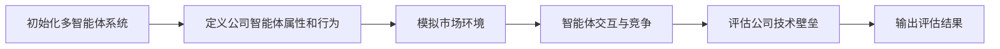

# 多智能体系统在评估公司技术壁垒中的应用

> 关键词：多智能体系统、公司技术壁垒评估、技术创新、市场竞争、数据分析

> 摘要：本文聚焦于多智能体系统在评估公司技术壁垒中的应用。首先介绍了多智能体系统和公司技术壁垒的背景知识，阐述了研究目的与范围、预期读者以及文档结构。接着深入探讨了核心概念及其联系，通过示意图和流程图直观展示。详细讲解了核心算法原理，并给出Python代码示例。运用数学模型和公式对评估过程进行了理论分析，并举例说明。通过项目实战，从开发环境搭建到源代码实现与解读，全面展示了如何利用多智能体系统进行技术壁垒评估。分析了该方法在实际中的应用场景，推荐了相关的学习资源、开发工具框架以及论文著作。最后总结了未来发展趋势与挑战，解答了常见问题，并提供了扩展阅读和参考资料，旨在为相关领域的研究者和从业者提供全面且深入的技术指导。

## 1. 背景介绍 
### 1.1 目的和范围
在当今竞争激烈的商业环境中，准确评估公司的技术壁垒对于投资者、企业管理者和行业分析师等具有至关重要的意义。技术壁垒是指企业凭借其独特的技术优势，在市场中建立起的竞争优势，能够防止竞争对手轻易进入市场并分享其利润。多智能体系统作为一种强大的建模和分析工具，可以模拟复杂的市场环境和企业行为，为评估公司技术壁垒提供一种新的视角和方法。

本文的目的是详细探讨多智能体系统在评估公司技术壁垒中的应用，包括核心概念、算法原理、数学模型、实际案例以及未来发展趋势等方面。范围涵盖了多智能体系统的基本原理、技术壁垒的评估指标和方法，以及如何利用多智能体系统构建评估模型并进行实际应用。

### 1.2 预期读者
本文预期读者包括计算机科学、管理学、经济学等相关领域的研究者和学生，以及企业管理者、投资者和行业分析师等。对于希望了解多智能体系统在商业评估中的应用，以及如何利用先进技术评估公司技术壁垒的读者来说，本文将提供有价值的参考。

### 1.3 文档结构概述
本文将按照以下结构进行组织：
- 核心概念与联系：介绍多智能体系统和公司技术壁垒的核心概念，并分析它们之间的联系。
- 核心算法原理 & 具体操作步骤：详细讲解多智能体系统用于评估技术壁垒的核心算法原理，并给出具体的操作步骤和Python代码示例。
- 数学模型和公式 & 详细讲解 & 举例说明：建立评估技术壁垒的数学模型，给出相关公式，并通过具体例子进行说明。
- 项目实战：代码实际案例和详细解释说明：通过一个实际项目案例，展示如何利用多智能体系统进行公司技术壁垒评估，包括开发环境搭建、源代码实现和代码解读。
- 实际应用场景：分析多智能体系统在评估公司技术壁垒中的实际应用场景。
- 工具和资源推荐：推荐相关的学习资源、开发工具框架和论文著作。
- 总结：未来发展趋势与挑战：总结多智能体系统在评估公司技术壁垒中的应用现状，分析未来发展趋势和面临的挑战。
- 附录：常见问题与解答：解答读者可能关心的常见问题。
- 扩展阅读 & 参考资料：提供扩展阅读的建议和相关参考资料。

### 1.4 术语表
#### 1.4.1 核心术语定义
- **多智能体系统（Multi-Agent System, MAS）**：由多个自主智能体组成的系统，这些智能体能够在一定的环境中相互作用，通过协作和竞争来完成特定的任务。
- **公司技术壁垒**：公司凭借其独特的技术优势，在市场中建立起的竞争优势，能够防止竞争对手轻易进入市场并分享其利润。
- **智能体（Agent）**：具有自主性、反应性、社会性和能动性的实体，能够感知环境并根据自身的目标和规则进行决策和行动。

#### 1.4.2 相关概念解释
- **技术创新**：企业通过研发和应用新技术，提高产品或服务的质量和效率，从而获得竞争优势。
- **市场竞争**：企业在市场中为了争夺市场份额和利润而进行的竞争。
- **数据分析**：对大量数据进行收集、整理、分析和解释，以发现有价值的信息和规律。

#### 1.4.3 缩略词列表
- **MAS**：Multi-Agent System（多智能体系统）
- **AI**：Artificial Intelligence（人工智能）

## 2. 核心概念与联系 

### 2.1 多智能体系统原理
多智能体系统是一种分布式人工智能系统，由多个智能体组成。每个智能体都具有一定的自主性和智能，能够感知环境、处理信息、做出决策并采取行动。智能体之间可以通过通信和协作来完成共同的任务。

多智能体系统的基本架构包括智能体层、通信层和环境层。智能体层由多个智能体组成，每个智能体都有自己的目标、知识和能力。通信层负责智能体之间的信息传递和交互。环境层是智能体所处的外部环境，智能体可以感知环境的变化并对其做出响应。

以下是多智能体系统架构的文本示意图：

```plaintext
+---------------------+
|       环境层        |
|  （外部环境信息）   |
+---------------------+
|       通信层        |
|  （智能体通信通道） |
+---------------------+
|       智能体层      |
|  （多个智能体）     |
+---------------------+
```

### 2.2 公司技术壁垒概念
公司技术壁垒是指公司在技术领域所拥有的独特优势，使得其他竞争对手难以模仿或超越。技术壁垒可以体现在多个方面，如专利技术、核心技术人才、研发能力、生产工艺等。

公司技术壁垒的形成通常需要长期的研发投入和技术积累。具有较高技术壁垒的公司能够在市场中获得竞争优势，提高市场份额和利润。

### 2.3 多智能体系统与公司技术壁垒的联系
多智能体系统可以用于模拟公司在市场中的竞争行为，评估公司的技术壁垒。在多智能体系统中，可以将每个公司看作一个智能体，智能体的属性和行为可以反映公司的技术实力、市场策略等。通过模拟智能体之间的交互和竞争，可以分析公司的技术壁垒对其市场竞争力的影响。

例如，在一个多智能体市场模拟系统中，每个公司智能体可以根据自身的技术水平和市场策略决定是否进入某个市场、研发新产品或进行技术创新。系统可以模拟市场的动态变化，观察不同公司智能体的市场表现，从而评估公司的技术壁垒。

以下是多智能体系统评估公司技术壁垒的Mermaid流程图：



## 3. 核心算法原理 & 具体操作步骤 

### 3.1 核心算法原理
多智能体系统评估公司技术壁垒的核心算法基于智能体的行为决策和交互机制。每个公司智能体根据自身的技术实力、市场信息和目标，决定采取何种行动，如研发新技术、扩大生产规模、降低价格等。智能体之间通过竞争和协作来影响市场的供求关系和价格水平。

在评估公司技术壁垒时，可以采用以下几个关键指标：
- **技术领先度**：反映公司在技术领域的领先程度，可以通过专利数量、研发投入等指标来衡量。
- **市场份额**：公司在市场中所占的份额，反映了公司的市场竞争力。
- **利润水平**：公司的盈利情况，反映了公司的经济效益。

通过模拟智能体的行为和交互，观察这些指标的变化，可以评估公司的技术壁垒对其市场竞争力的影响。

### 3.2 具体操作步骤
以下是利用多智能体系统评估公司技术壁垒的具体操作步骤：

#### 3.2.1 初始化多智能体系统
定义系统的基本参数，如市场规模、公司数量、时间步长等。创建公司智能体，并初始化其属性，如技术水平、资金、市场份额等。

#### 3.2.2 定义公司智能体行为规则
为每个公司智能体定义行为规则，如研发决策、生产决策、定价决策等。行为规则可以基于智能体的目标和环境信息进行制定。

#### 3.2.3 模拟市场环境
模拟市场的供求关系、价格波动等因素。市场环境的变化会影响公司智能体的决策和行为。

#### 3.2.4 智能体交互与竞争
在每个时间步长内，公司智能体根据自身的行为规则和市场环境进行决策和行动。智能体之间通过竞争和协作来影响市场的供求关系和价格水平。

#### 3.2.5 评估公司技术壁垒
在模拟过程中，记录每个公司智能体的技术领先度、市场份额、利润水平等指标。通过分析这些指标的变化，评估公司的技术壁垒对其市场竞争力的影响。

#### 3.2.6 输出评估结果
根据评估结果，输出每个公司的技术壁垒评估报告，包括技术领先度、市场竞争力、发展潜力等方面的评价。

### 3.3 Python代码示例
以下是一个简单的Python代码示例，用于模拟多智能体系统评估公司技术壁垒：

```python
import random

# 定义公司智能体类
class CompanyAgent:
    def __init__(self, id, technology_level, funds, market_share):
        self.id = id
        self.technology_level = technology_level
        self.funds = funds
        self.market_share = market_share

    def research(self):
        # 研发决策
        if self.funds > 10:
            # 有足够资金进行研发
            self.technology_level += random.randint(1, 5)
            self.funds -= 10
        return self.technology_level

    def produce(self):
        # 生产决策
        production = self.technology_level * 10
        return production

    def price(self):
        # 定价决策
        price = 100 - self.technology_level
        return price

# 初始化多智能体系统
companies = []
for i in range(5):
    technology_level = random.randint(1, 10)
    funds = random.randint(50, 100)
    market_share = random.random()
    company = CompanyAgent(i, technology_level, funds, market_share)
    companies.append(company)

# 模拟市场环境
market_demand = 1000

# 模拟多个时间步长
for t in range(10):
    print(f"Time step: {t}")
    for company in companies:
        # 研发
        technology_level = company.research()
        # 生产
        production = company.produce()
        # 定价
        price = company.price()
        print(f"Company {company.id}: Technology Level = {technology_level}, Production = {production}, Price = {price}")

    # 计算市场份额和利润
    total_production = sum([company.produce() for company in companies])
    for company in companies:
        company.market_share = company.produce() / total_production
        company.funds += company.market_share * market_demand * company.price()
        print(f"Company {company.id}: Market Share = {company.market_share}, Funds = {company.funds}")

# 评估公司技术壁垒
for company in companies:
    print(f"Company {company.id}: Technology Level = {company.technology_level}, Market Share = {company.market_share}, Funds = {company.funds}")
```

## 4. 数学模型和公式 & 详细讲解 & 举例说明 

### 4.1 数学模型
为了更准确地评估公司的技术壁垒，我们可以建立一个数学模型。假设市场中有 $n$ 个公司，每个公司 $i$ 有以下属性：
- $T_i$：公司 $i$ 的技术水平
- $F_i$：公司 $i$ 的资金
- $S_i$：公司 $i$ 的市场份额
- $P_i$：公司 $i$ 的产品价格

#### 4.1.1 技术水平更新模型
公司的技术水平会随着研发投入而提高。假设公司 $i$ 在每个时间步长内的研发投入为 $R_i$，研发成功率为 $r_i$，则公司 $i$ 的技术水平更新公式为：
$$T_{i}(t + 1)=T_{i}(t)+r_{i}R_{i}(t)$$
其中，$T_{i}(t)$ 表示公司 $i$ 在时间 $t$ 的技术水平，$R_{i}(t)$ 表示公司 $i$ 在时间 $t$ 的研发投入。

#### 4.1.2 生产模型
公司的生产能力与技术水平成正比。假设公司 $i$ 的生产效率为 $e_i$，则公司 $i$ 在时间 $t$ 的生产量 $Q_i(t)$ 为：
$$Q_{i}(t)=e_{i}T_{i}(t)$$

#### 4.1.3 定价模型
公司的产品价格与技术水平成反比。假设价格系数为 $k$，则公司 $i$ 在时间 $t$ 的产品价格 $P_i(t)$ 为：
$$P_{i}(t)=k - T_{i}(t)$$

#### 4.1.4 市场份额模型
公司的市场份额取决于其生产量和市场总需求量。假设市场总需求量为 $D$，则公司 $i$ 在时间 $t$ 的市场份额 $S_i(t)$ 为：
$$S_{i}(t)=\frac{Q_{i}(t)}{\sum_{j = 1}^{n}Q_{j}(t)}$$

#### 4.1.5 资金更新模型
公司的资金会随着销售收入和研发投入而变化。假设公司 $i$ 在时间 $t$ 的销售收入为 $I_i(t)$，则公司 $i$ 在时间 $t + 1$ 的资金 $F_i(t + 1)$ 为：
$$F_{i}(t + 1)=F_{i}(t)+I_{i}(t)-R_{i}(t)$$
其中，$I_{i}(t)=S_{i}(t)D P_{i}(t)$。

### 4.2 详细讲解
- **技术水平更新模型**：研发投入和研发成功率决定了公司技术水平的增长。研发投入越多，研发成功率越高，技术水平增长越快。
- **生产模型**：技术水平越高，生产效率越高，生产量越大。
- **定价模型**：技术水平越高，产品价格越低，这是因为技术先进的公司可以通过降低成本来提高竞争力。
- **市场份额模型**：生产量越大，市场份额越高。
- **资金更新模型**：销售收入增加资金，研发投入减少资金。

### 4.3 举例说明
假设市场中有两个公司 $A$ 和 $B$，初始参数如下：
- 公司 $A$：$T_A(0)=5$，$F_A(0)=100$，$e_A = 10$，$r_A = 0.5$
- 公司 $B$：$T_B(0)=3$，$F_B(0)=80$，$e_B = 10$，$r_B = 0.3$
- 市场总需求量 $D = 1000$，价格系数 $k = 100$

#### 4.3.1 时间步长 $t = 0$
- **研发投入**：假设公司 $A$ 投入 $R_A(0)=20$，公司 $B$ 投入 $R_B(0)=10$。
- **技术水平更新**：
  - 公司 $A$：$T_A(1)=T_A(0)+r_A R_A(0)=5 + 0.5\times20 = 15$
  - 公司 $B$：$T_B(1)=T_B(0)+r_B R_B(0)=3 + 0.3\times10 = 6$
- **生产**：
  - 公司 $A$：$Q_A(1)=e_A T_A(1)=10\times15 = 150$
  - 公司 $B$：$Q_B(1)=e_B T_B(1)=10\times6 = 60$
- **定价**：
  - 公司 $A$：$P_A(1)=k - T_A(1)=100 - 15 = 85$
  - 公司 $B$：$P_B(1)=k - T_B(1)=100 - 6 = 94$
- **市场份额**：
  - 公司 $A$：$S_A(1)=\frac{Q_A(1)}{Q_A(1)+Q_B(1)}=\frac{150}{150 + 60}\approx0.714$
  - 公司 $B$：$S_B(1)=\frac{Q_B(1)}{Q_A(1)+Q_B(1)}=\frac{60}{150 + 60}\approx0.286$
- **资金更新**：
  - 公司 $A$：$I_A(1)=S_A(1)D P_A(1)=0.714\times1000\times85 = 60690$，$F_A(1)=F_A(0)+I_A(1)-R_A(0)=100 + 60690 - 20 = 60770$
  - 公司 $B$：$I_B(1)=S_B(1)D P_B(1)=0.286\times1000\times94 = 26884$，$F_B(1)=F_B(0)+I_B(1)-R_B(0)=80 + 26884 - 10 = 26954$

通过以上计算，可以看出公司 $A$ 由于技术水平较高，在市场中获得了更高的市场份额和利润。

## 5. 项目实战：代码实际案例和详细解释说明 

### 5.1  开发环境搭建
为了实现多智能体系统评估公司技术壁垒的项目，我们需要搭建以下开发环境：
- **编程语言**：Python
- **开发工具**：可以使用任何Python集成开发环境（IDE），如PyCharm、Jupyter Notebook等。
- **依赖库**：需要安装NumPy、Matplotlib等库，用于数值计算和数据可视化。

以下是安装依赖库的命令：
```bash
pip install numpy matplotlib
```

### 5.2  源代码详细实现和代码解读
以下是一个完整的Python代码示例，用于实现多智能体系统评估公司技术壁垒的项目：

```python
import numpy as np
import matplotlib.pyplot as plt

# 定义公司智能体类
class CompanyAgent:
    def __init__(self, id, technology_level, funds, production_efficiency, research_success_rate):
        self.id = id
        self.technology_level = technology_level
        self.funds = funds
        self.production_efficiency = production_efficiency
        self.research_success_rate = research_success_rate
        self.market_share = 0
        self.history_technology_level = [technology_level]
        self.history_market_share = [0]
        self.history_funds = [funds]

    def research(self, research_investment):
        # 研发决策
        if self.funds >= research_investment:
            # 有足够资金进行研发
            self.technology_level += self.research_success_rate * research_investment
            self.funds -= research_investment
        self.history_technology_level.append(self.technology_level)
        return self.technology_level

    def produce(self):
        # 生产决策
        production = self.production_efficiency * self.technology_level
        return production

    def price(self, price_coefficient):
        # 定价决策
        price = price_coefficient - self.technology_level
        return price

    def update_market_share(self, total_production):
        # 更新市场份额
        self.market_share = self.produce() / total_production
        self.history_market_share.append(self.market_share)
        return self.market_share

    def update_funds(self, market_demand):
        # 更新资金
        revenue = self.market_share * market_demand * self.price(100)
        self.funds += revenue
        self.history_funds.append(self.funds)
        return self.funds

# 初始化多智能体系统
num_companies = 3
companies = []
for i in range(num_companies):
    technology_level = np.random.randint(1, 10)
    funds = np.random.randint(50, 100)
    production_efficiency = 10
    research_success_rate = np.random.uniform(0.1, 0.5)
    company = CompanyAgent(i, technology_level, funds, production_efficiency, research_success_rate)
    companies.append(company)

# 模拟市场环境
market_demand = 1000
price_coefficient = 100
num_time_steps = 20

# 模拟多个时间步长
for t in range(num_time_steps):
    print(f"Time step: {t}")
    total_production = 0
    for company in companies:
        # 研发
        research_investment = np.random.randint(10, 20)
        company.research(research_investment)
        # 生产
        production = company.produce()
        total_production += production

    for company in companies:
        # 更新市场份额
        company.update_market_share(total_production)
        # 更新资金
        company.update_funds(market_demand)
        print(f"Company {company.id}: Technology Level = {company.technology_level}, Market Share = {company.market_share}, Funds = {company.funds}")

# 可视化结果
plt.figure(figsize=(12, 6))
plt.subplot(1, 3, 1)
for company in companies:
    plt.plot(company.history_technology_level, label=f"Company {company.id}")
plt.xlabel('Time Step')
plt.ylabel('Technology Level')
plt.title('Technology Level over Time')
plt.legend()

plt.subplot(1, 3, 2)
for company in companies:
    plt.plot(company.history_market_share, label=f"Company {company.id}")
plt.xlabel('Time Step')
plt.ylabel('Market Share')
plt.title('Market Share over Time')
plt.legend()

plt.subplot(1, 3, 3)
for company in companies:
    plt.plot(company.history_funds, label=f"Company {company.id}")
plt.xlabel('Time Step')
plt.ylabel('Funds')
plt.title('Funds over Time')
plt.legend()

plt.tight_layout()
plt.show()
```

### 5.3  代码解读与分析
- **公司智能体类**：`CompanyAgent` 类定义了公司智能体的属性和行为。属性包括技术水平、资金、生产效率、研发成功率等。行为包括研发、生产、定价、更新市场份额和更新资金等。
- **初始化多智能体系统**：创建多个公司智能体，并初始化其属性。
- **模拟市场环境**：设置市场总需求量、价格系数和时间步长。
- **模拟多个时间步长**：在每个时间步长内，每个公司智能体进行研发、生产、定价等决策，更新市场份额和资金。
- **可视化结果**：使用Matplotlib库将每个公司的技术水平、市场份额和资金随时间的变化进行可视化。

通过这个项目实战，我们可以直观地观察到不同公司在市场竞争中的表现，以及技术壁垒对公司市场竞争力的影响。

## 6. 实际应用场景 
### 6.1 投资决策
投资者在选择投资对象时，需要评估公司的技术壁垒。多智能体系统可以模拟不同公司在市场中的竞争行为，预测公司的未来发展趋势，为投资者提供决策依据。例如，投资者可以通过模拟结果判断某个公司是否具有足够的技术优势，是否值得投资。

### 6.2 企业战略规划
企业管理者可以利用多智能体系统评估自身的技术壁垒，制定合理的战略规划。通过模拟不同的市场策略和研发投入，企业可以了解自身在市场中的竞争力，优化资源配置，提高市场份额和利润。例如，企业可以通过模拟来确定最佳的研发投入水平，以保持技术领先地位。

### 6.3 行业分析
行业分析师可以使用多智能体系统对整个行业进行分析，了解行业内公司的竞争格局和技术发展趋势。通过模拟不同公司的行为和交互，分析师可以预测行业的未来发展方向，为行业监管和政策制定提供参考。例如，分析师可以通过模拟来评估某项政策对行业内公司技术壁垒的影响。

### 6.4 技术创新评估
对于政府和科研机构来说，多智能体系统可以用于评估技术创新项目的可行性和潜在影响。通过模拟不同技术创新方案在市场中的应用，评估其对公司技术壁垒和市场竞争力的提升作用，为技术创新政策的制定和资源分配提供依据。例如，政府可以通过模拟来确定哪些技术创新领域具有较大的发展潜力，值得加大投入。

## 7. 工具和资源推荐
### 7.1 学习资源推荐
#### 7.1.1 书籍推荐
- 《多智能体系统：原理与编程》：全面介绍了多智能体系统的基本原理、算法和编程实现，是学习多智能体系统的经典教材。
- 《竞争优势：创造和保持卓越绩效》：深入探讨了企业竞争优势的来源和构建方法，对于理解公司技术壁垒具有重要的参考价值。
- 《人工智能：一种现代方法》：涵盖了人工智能的各个领域，包括多智能体系统，是人工智能领域的权威著作。

#### 7.1.2 在线课程
- Coursera上的“Multi-Agent Systems”课程：由知名高校教授授课，系统介绍了多智能体系统的理论和应用。
- edX上的“Artificial Intelligence”课程：提供了人工智能的全面学习内容，包括多智能体系统的相关知识。
- 中国大学MOOC上的“人工智能基础”课程：适合初学者入门，对多智能体系统有一定的介绍。

#### 7.1.3 技术博客和网站
- AI Stack Exchange：一个人工智能领域的问答社区，用户可以在这里提问和交流多智能体系统的相关问题。
- Towards Data Science：提供了大量关于人工智能和数据分析的技术文章，包括多智能体系统的应用案例。
- 机器之心：专注于人工智能领域的资讯和技术分享，有很多关于多智能体系统的最新研究成果和应用动态。

### 7.2 开发工具框架推荐
#### 7.2.1 IDE和编辑器
- PyCharm：一款专业的Python集成开发环境，具有强大的代码编辑、调试和项目管理功能。
- Jupyter Notebook：一个交互式的编程环境，适合进行数据探索和模型开发，方便展示代码和结果。
- Visual Studio Code：一款轻量级的代码编辑器，支持多种编程语言，具有丰富的插件扩展功能。

#### 7.2.2 调试和性能分析工具
- pdb：Python自带的调试工具，可以帮助开发者定位代码中的问题。
- cProfile：Python的性能分析工具，可以分析代码的运行时间和内存使用情况。
- Py-Spy：一个简单易用的Python性能分析工具，可以实时监控Python程序的性能。

#### 7.2.3 相关框架和库
- Mesa：一个用于构建多智能体系统的Python框架，提供了丰富的智能体和环境类，方便快速开发多智能体模型。
- NetLogo：一个专门用于模拟复杂系统的编程语言和环境，适合开发多智能体系统模型。
- NumPy：Python的数值计算库，提供了高效的数组操作和数学函数，用于多智能体系统中的数值计算。

### 7.3 相关论文著作推荐
#### 7.3.1 经典论文
- "Multiagent Systems: A Modern Approach to Distributed Artificial Intelligence"：该论文系统地介绍了多智能体系统的基本概念、模型和算法，是多智能体系统领域的经典之作。
- "Competitive Advantage in the Digital Age"：探讨了在数字化时代企业竞争优势的来源和构建方法，对于理解公司技术壁垒在数字经济中的作用具有重要意义。
- "The Dynamics of Technological Competition"：研究了技术竞争的动态过程，分析了技术创新和技术壁垒对企业市场竞争力的影响。

#### 7.3.2 最新研究成果
- 关注顶级学术会议如AAAI（Association for the Advancement of Artificial Intelligence）、IJCAI（International Joint Conference on Artificial Intelligence）上发表的关于多智能体系统和技术创新的研究论文，了解最新的研究动态和成果。
- 查阅知名学术期刊如Artificial Intelligence、Journal of Artificial Intelligence Research上的相关研究文章，获取前沿的理论和方法。

#### 7.3.3 应用案例分析
- 一些商业咨询公司和研究机构会发布关于公司技术壁垒评估和多智能体系统应用的案例分析报告，可以通过这些报告了解实际应用中的经验和教训。
- 关注行业内领先企业的技术创新实践和市场竞争策略，分析其技术壁垒的构建和维护方法。

## 8. 总结：未来发展趋势与挑战
### 8.1 未来发展趋势
#### 8.1.1 与其他技术的融合
多智能体系统将与人工智能的其他技术如机器学习、深度学习等深度融合，提高智能体的决策能力和学习能力。例如，通过强化学习算法可以让智能体在复杂的市场环境中自动学习最优的决策策略。

#### 8.1.2 应用领域的拓展
多智能体系统在评估公司技术壁垒方面的应用将不断拓展到更多领域，如医疗、能源、交通等。在这些领域中，通过模拟不同主体的行为和交互，可以更好地评估企业的技术壁垒和市场竞争力。

#### 8.1.3 大规模复杂系统模拟
随着计算机性能的不断提高，多智能体系统将能够模拟更大规模、更复杂的市场系统。可以考虑更多的因素和主体，如政策法规、消费者行为等，提高评估的准确性和可靠性。

### 8.2 挑战
#### 8.2.1 模型的准确性和可靠性
多智能体系统的模型需要准确地反映现实世界的市场环境和企业行为。然而，现实世界是复杂多变的，很难用一个模型完全准确地描述。因此，如何提高模型的准确性和可靠性是一个挑战。

#### 8.2.2 数据的获取和处理
多智能体系统的模拟需要大量的实际数据来支持。然而，在实际应用中，数据的获取和处理往往是一个难题。数据可能存在缺失、不准确等问题，需要进行有效的清洗和预处理。

#### 8.2.3 计算资源的需求
大规模复杂系统的模拟需要大量的计算资源。随着模拟规模的增大，计算时间和内存需求也会急剧增加。如何在有限的计算资源下进行高效的模拟是一个需要解决的问题。

## 9. 附录：常见问题与解答
### 9.1 多智能体系统评估公司技术壁垒的准确性如何保证？
为了保证多智能体系统评估公司技术壁垒的准确性，需要从以下几个方面入手：
- **模型的合理性**：建立合理的模型，准确反映公司的行为和市场环境。模型的参数需要根据实际情况进行调整和优化。
- **数据的准确性**：使用准确、可靠的数据来驱动模型。数据的来源需要可靠，并且需要进行有效的清洗和预处理。
- **模型的验证和校准**：对模型进行验证和校准，通过与实际数据进行对比，调整模型的参数，提高模型的准确性。

### 9.2 多智能体系统的计算复杂度高吗？
多智能体系统的计算复杂度取决于系统的规模和复杂度。一般来说，随着智能体数量的增加和环境的复杂度提高，计算复杂度会相应增加。为了降低计算复杂度，可以采用并行计算、分布式计算等技术，提高计算效率。

### 9.3 多智能体系统在实际应用中需要注意哪些问题？
在实际应用中，需要注意以下几个问题：
- **模型的适用性**：选择合适的模型，根据实际问题的特点和需求进行调整和优化。
- **数据的质量**：保证数据的质量，避免数据缺失、不准确等问题对模型的影响。
- **结果的解释**：对模型的结果进行合理的解释，结合实际情况进行分析和判断。
- **模型的更新**：随着市场环境和企业行为的变化，及时更新模型，保证模型的有效性。

## 10. 扩展阅读 & 参考资料
### 10.1 扩展阅读
- 《复杂系统科学与工程》：深入探讨了复杂系统的理论和方法，对于理解多智能体系统和公司技术壁垒评估具有重要的参考价值。
- 《创新经济学》：研究了技术创新的经济规律和影响，有助于深入理解公司技术壁垒的形成和发展。
- 《人工智能与社会》：探讨了人工智能技术对社会经济的影响，包括多智能体系统在社会经济领域的应用。

### 10.2 参考资料
- 相关学术期刊和会议论文：如Artificial Intelligence、Journal of Artificial Intelligence Research、AAAI、IJCAI等。
- 行业报告和研究机构的分析报告：如麦肯锡、波士顿咨询等公司发布的关于企业竞争和技术创新的报告。
- 相关书籍和教材：如《多智能体系统：原理与编程》、《竞争优势：创造和保持卓越绩效》等。