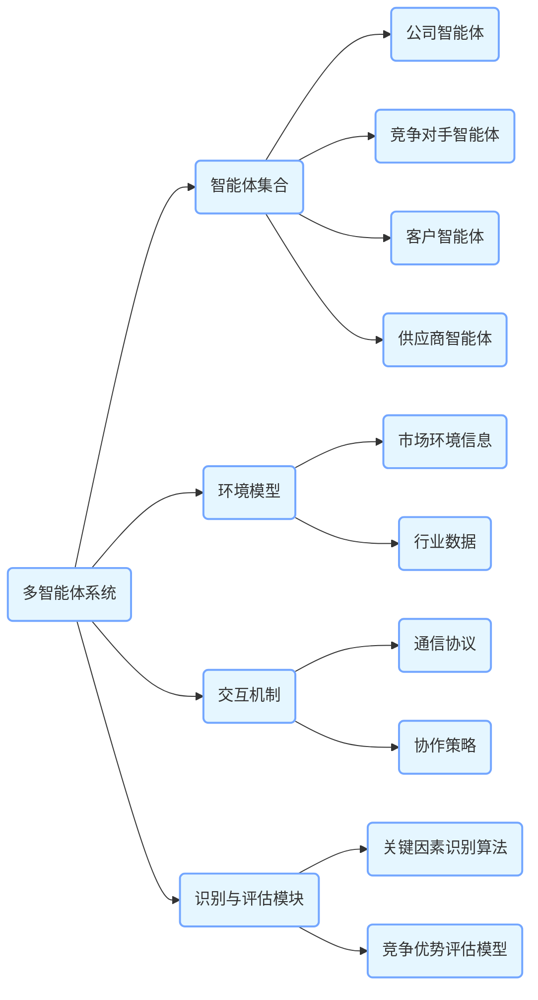

# 多智能体系统在识别和评估公司竞争优势中的作用

> 关键词：多智能体系统、公司竞争优势、识别、评估、智能决策

> 摘要：本文深入探讨了多智能体系统在识别和评估公司竞争优势方面的重要作用。首先介绍了多智能体系统及公司竞争优势的相关背景知识，包括研究目的、预期读者、文档结构和术语表等。接着阐述了核心概念及其联系，给出了原理和架构的文本示意图与 Mermaid 流程图。详细讲解了核心算法原理，并用 Python 代码进行了示例。对涉及的数学模型和公式进行了推导和举例说明。通过项目实战展示了如何运用多智能体系统进行公司竞争优势的识别和评估，包括开发环境搭建、源代码实现和代码解读。分析了多智能体系统在不同场景下的实际应用。推荐了相关的学习资源、开发工具框架和论文著作。最后总结了未来发展趋势与挑战，并对常见问题进行了解答，提供了扩展阅读和参考资料。

## 1. 背景介绍 
### 1.1 目的和范围
在当今激烈的市场竞争环境中，准确识别和评估公司的竞争优势对于企业的战略规划、资源分配和持续发展至关重要。传统的评估方法往往依赖于静态的数据和单一的分析视角，难以全面、动态地反映公司在复杂市场环境中的竞争力。多智能体系统（Multi - Agent System, MAS）作为一种分布式人工智能技术，具有自主性、交互性和适应性等特点，能够模拟市场中多个主体的行为和交互，为公司竞争优势的识别和评估提供了一种新的途径。

本文的目的是深入研究多智能体系统在识别和评估公司竞争优势中的作用，探讨其原理、方法和应用。具体范围包括多智能体系统的核心概念和架构，用于识别和评估的核心算法，相关的数学模型和公式，以及通过实际项目案例展示其应用过程。

### 1.2 预期读者
本文预期读者包括企业管理人员、战略规划师、市场分析师等对公司竞争优势评估感兴趣的商业人士，以及计算机科学、人工智能、管理学等领域的研究人员和学生。对于商业人士，本文可以提供一种新的评估工具和思路；对于研究人员和学生，本文可以作为学习多智能体系统应用和公司竞争优势评估的参考资料。

### 1.3 文档结构概述
本文将按照以下结构进行组织：
- 核心概念与联系：介绍多智能体系统和公司竞争优势的核心概念，以及它们之间的联系，给出原理和架构的文本示意图和 Mermaid 流程图。
- 核心算法原理 & 具体操作步骤：详细讲解用于识别和评估公司竞争优势的核心算法原理，并使用 Python 代码进行示例。
- 数学模型和公式 & 详细讲解 & 举例说明：推导相关的数学模型和公式，并通过具体例子进行说明。
- 项目实战：代码实际案例和详细解释说明，包括开发环境搭建、源代码实现和代码解读。
- 实际应用场景：分析多智能体系统在不同场景下的实际应用。
- 工具和资源推荐：推荐相关的学习资源、开发工具框架和论文著作。
- 总结：未来发展趋势与挑战：总结多智能体系统在识别和评估公司竞争优势方面的未来发展趋势和面临的挑战。
- 附录：常见问题与解答：对常见问题进行解答。
- 扩展阅读 & 参考资料：提供扩展阅读的建议和参考资料。

### 1.4 术语表
#### 1.4.1 核心术语定义
- **多智能体系统（Multi - Agent System, MAS）**：由多个智能体组成的系统，每个智能体具有一定的自主性、交互性和适应性，能够在一定的环境中独立地完成任务或与其他智能体协作完成任务。
- **智能体（Agent）**：具有感知、决策和行动能力的实体，能够根据自身的目标和环境信息做出决策并采取行动。
- **公司竞争优势**：公司在市场中相对于竞争对手所具有的优势，包括成本优势、差异化优势、技术优势等，能够使公司获得更高的市场份额和利润。
- **识别**：通过一定的方法和技术，从众多因素中找出能够体现公司竞争优势的关键因素。
- **评估**：对识别出的公司竞争优势进行量化或定性的评价，确定其强度和可持续性。

#### 1.4.2 相关概念解释
- **分布式人工智能（Distributed Artificial Intelligence, DAI）**：多智能体系统是分布式人工智能的一个重要分支，强调多个智能体之间的协作和交互，以解决复杂的问题。
- **市场环境**：公司所处的市场环境包括竞争对手、客户、供应商等多个主体，这些主体之间的相互作用和关系对公司的竞争优势产生影响。
- **战略规划**：企业根据自身的竞争优势和市场环境制定的长期发展规划，以实现企业的目标。

#### 1.4.3 缩略词列表
- MAS：Multi - Agent System（多智能体系统）
- DAI：Distributed Artificial Intelligence（分布式人工智能）

## 2. 核心概念与联系 

### 多智能体系统的核心概念
多智能体系统由多个智能体组成，这些智能体可以是软件程序、机器人或其他具有智能的实体。每个智能体具有以下特点：
- **自主性**：智能体能够独立地感知环境信息，根据自身的目标和知识做出决策并采取行动，不需要外部的直接控制。
- **交互性**：智能体能够与其他智能体进行通信和协作，通过交换信息和共享资源来完成共同的任务。
- **适应性**：智能体能够根据环境的变化和自身的经验调整自己的行为和策略，以更好地适应环境。

### 公司竞争优势的核心概念
公司竞争优势是公司在市场中相对于竞争对手所具有的优势，主要包括以下几种类型：
- **成本优势**：公司能够以低于竞争对手的成本生产和销售产品或服务，从而获得更高的利润。
- **差异化优势**：公司的产品或服务具有独特的特点和价值，能够满足客户的特殊需求，从而吸引更多的客户。
- **技术优势**：公司拥有先进的技术和研发能力，能够不断推出新产品和改进现有产品，提高市场竞争力。

### 两者之间的联系
多智能体系统可以通过模拟市场中多个主体的行为和交互，为公司竞争优势的识别和评估提供支持。具体来说，多智能体系统可以：
- **模拟市场环境**：通过构建多个智能体来代表市场中的不同主体，如竞争对手、客户、供应商等，模拟它们之间的相互作用和关系，从而更真实地反映市场环境。
- **识别关键因素**：通过智能体之间的交互和信息共享，找出影响公司竞争优势的关键因素，如市场份额、产品质量、价格等。
- **评估竞争优势**：根据识别出的关键因素，对公司的竞争优势进行量化或定性的评估，为公司的战略规划提供依据。

### 原理和架构的文本示意图
多智能体系统在识别和评估公司竞争优势中的原理和架构可以用以下文本示意图表示：

```plaintext
多智能体系统
|-- 智能体集合
|   |-- 公司智能体
|   |-- 竞争对手智能体
|   |-- 客户智能体
|   |-- 供应商智能体
|-- 环境模型
|   |-- 市场环境信息
|   |-- 行业数据
|-- 交互机制
|   |-- 通信协议
|   |-- 协作策略
|-- 识别与评估模块
|   |-- 关键因素识别算法
|   |-- 竞争优势评估模型
```

### Mermaid 流程图


## 3. 核心算法原理 & 具体操作步骤 

### 核心算法原理
在多智能体系统中，用于识别和评估公司竞争优势的核心算法主要包括关键因素识别算法和竞争优势评估模型。

#### 关键因素识别算法
关键因素识别算法的目的是从众多因素中找出影响公司竞争优势的关键因素。常用的方法有数据挖掘算法，如决策树、神经网络等。这里以决策树算法为例进行说明。

决策树算法是一种基于树结构进行决策的算法，它通过对数据进行划分，构建一棵决策树，每个内部节点表示一个属性上的测试，每个分支表示一个测试输出，每个叶节点表示一个类别或值。在识别公司竞争优势的关键因素时，我们可以将公司的各种属性（如市场份额、产品质量、价格等）作为输入，将公司的竞争优势水平（如高、中、低）作为输出，构建决策树模型。通过分析决策树的结构，我们可以找出对竞争优势影响最大的属性，即关键因素。

#### 竞争优势评估模型
竞争优势评估模型的目的是根据识别出的关键因素，对公司的竞争优势进行量化或定性的评估。常用的方法有层次分析法（Analytic Hierarchy Process, AHP）、模糊综合评价法等。这里以层次分析法为例进行说明。

层次分析法是一种将复杂问题分解为多个层次，通过两两比较确定各因素的相对重要性，然后综合各因素的权重进行评价的方法。在评估公司竞争优势时，我们可以将竞争优势分解为多个层次，如成本优势、差异化优势、技术优势等，每个层次又可以进一步分解为多个因素。通过两两比较各因素的相对重要性，确定各因素的权重，然后根据公司在各因素上的表现，计算出公司的综合竞争优势得分。

### 具体操作步骤

#### 数据收集与预处理
- 收集公司及其竞争对手的相关数据，包括市场份额、产品质量、价格、研发投入等。
- 对收集到的数据进行清洗、转换和归一化处理，以消除数据中的噪声和不一致性。

#### 关键因素识别
- 使用决策树算法构建关键因素识别模型。
```python
import pandas as pd
from sklearn.tree import DecisionTreeClassifier
from sklearn.model_selection import train_test_split
from sklearn.metrics import accuracy_score

# 加载数据
data = pd.read_csv('company_data.csv')
X = data.drop('competitive_advantage', axis=1)
y = data['competitive_advantage']

# 划分训练集和测试集
X_train, X_test, y_train, y_test = train_test_split(X, y, test_size=0.2, random_state=42)

# 构建决策树模型
model = DecisionTreeClassifier()
model.fit(X_train, y_train)

# 预测并评估模型
y_pred = model.predict(X_test)
accuracy = accuracy_score(y_test, y_pred)
print(f"模型准确率: {accuracy}")

# 查看特征重要性
feature_importances = pd.DataFrame(model.feature_importances_,
                                   index = X_train.columns,
                                   columns=['importance']).sort_values('importance', ascending=False)
print(feature_importances)
```
- 分析决策树模型的特征重要性，找出关键因素。

#### 竞争优势评估
- 确定竞争优势的层次结构和因素。
- 使用层次分析法确定各因素的权重。
```python
import numpy as np

# 定义判断矩阵
A = np.array([[1, 3, 5],
              [1/3, 1, 3],
              [1/5, 1/3, 1]])

# 计算特征向量和特征值
eigenvalues, eigenvectors = np.linalg.eig(A)

# 找出最大特征值及其对应的特征向量
max_eigenvalue = np.max(eigenvalues)
max_index = np.argmax(eigenvalues)
weights = eigenvectors[:, max_index].real / np.sum(eigenvectors[:, max_index].real)

print(f"最大特征值: {max_eigenvalue}")
print(f"权重: {weights}")
```
- 根据公司在各关键因素上的表现和各因素的权重，计算公司的综合竞争优势得分。

## 4. 数学模型和公式 & 详细讲解 & 举例说明 

### 决策树算法的数学模型和公式
#### 信息熵
信息熵是衡量数据不确定性的指标，其计算公式为：
$$H(X) = -\sum_{i=1}^{n}p(x_i)\log_2p(x_i)$$
其中，$X$ 是一个随机变量，$p(x_i)$ 是 $X$ 取值为 $x_i$ 的概率，$n$ 是 $X$ 的取值个数。

#### 信息增益
信息增益是衡量划分数据集前后信息不确定性减少的指标，其计算公式为：
$$IG(D, A) = H(D) - \sum_{v\in Values(A)}\frac{|D_v|}{|D|}H(D_v)$$
其中，$D$ 是数据集，$A$ 是属性，$Values(A)$ 是属性 $A$ 的取值集合，$D_v$ 是属性 $A$ 取值为 $v$ 时的子集，$|D|$ 和 $|D_v|$ 分别是数据集 $D$ 和子集 $D_v$ 的样本数量。

#### 举例说明
假设有一个数据集 $D$ 包含 10 个样本，其中正类样本 6 个，负类样本 4 个。属性 $A$ 有两个取值 $A_1$ 和 $A_2$，$A_1$ 对应的子集 $D_1$ 包含 6 个样本，其中正类样本 4 个，负类样本 2 个；$A_2$ 对应的子集 $D_2$ 包含 4 个样本，其中正类样本 2 个，负类样本 2 个。

首先计算数据集 $D$ 的信息熵：
$$H(D) = -\frac{6}{10}\log_2\frac{6}{10} - \frac{4}{10}\log_2\frac{4}{10} \approx 0.971$$

然后计算子集 $D_1$ 和 $D_2$ 的信息熵：
$$H(D_1) = -\frac{4}{6}\log_2\frac{4}{6} - \frac{2}{6}\log_2\frac{2}{6} \approx 0.918$$
$$H(D_2) = -\frac{2}{4}\log_2\frac{2}{4} - \frac{2}{4}\log_2\frac{2}{4} = 1$$

最后计算属性 $A$ 的信息增益：
$$IG(D, A) = H(D) - \frac{6}{10}H(D_1) - \frac{4}{10}H(D_2) \approx 0.971 - \frac{6}{10} \times 0.918 - \frac{4}{10} \times 1 \approx 0.022$$

### 层次分析法的数学模型和公式
#### 判断矩阵
判断矩阵是层次分析法中用于比较各因素相对重要性的矩阵，其元素 $a_{ij}$ 表示因素 $i$ 相对于因素 $j$ 的重要性程度，通常采用 1 - 9 标度法进行赋值。

#### 一致性检验
一致性检验是为了确保判断矩阵的合理性，其计算公式为：
$$CI = \frac{\lambda_{max} - n}{n - 1}$$
其中，$\lambda_{max}$ 是判断矩阵的最大特征值，$n$ 是判断矩阵的阶数。

随机一致性指标 $RI$ 是根据矩阵阶数 $n$ 确定的一个常数，其值可以通过查表得到。

一致性比率 $CR$ 的计算公式为：
$$CR = \frac{CI}{RI}$$
当 $CR < 0.1$ 时，认为判断矩阵具有满意的一致性；否则，需要对判断矩阵进行调整。

#### 举例说明
假设有一个判断矩阵 $A$：
$$A = \begin{bmatrix}
1 & 3 & 5 \\
\frac{1}{3} & 1 & 3 \\
\frac{1}{5} & \frac{1}{3} & 1
\end{bmatrix}$$

首先计算判断矩阵 $A$ 的最大特征值 $\lambda_{max}$：
通过求解特征方程 $|A - \lambda I| = 0$，得到 $\lambda_{max} \approx 3.038$。

然后计算一致性指标 $CI$：
$$CI = \frac{3.038 - 3}{3 - 1} \approx 0.019$$

当 $n = 3$ 时，查随机一致性指标表得 $RI = 0.58$。

最后计算一致性比率 $CR$：
$$CR = \frac{0.019}{0.58} \approx 0.033 < 0.1$$
因此，判断矩阵 $A$ 具有满意的一致性。

## 5. 项目实战：代码实际案例和详细解释说明 

### 5.1  开发环境搭建
#### 操作系统
可以选择 Windows、Linux 或 macOS 操作系统。

#### 编程语言
使用 Python 作为开发语言，Python 具有丰富的库和工具，适合进行数据处理、机器学习和多智能体系统开发。

#### 开发工具
推荐使用 Anaconda 作为 Python 环境管理工具，它可以方便地安装和管理各种 Python 库。同时，可以使用 PyCharm 或 Jupyter Notebook 作为开发工具。

#### 安装必要的库
使用以下命令安装必要的库：
```sh
pip install pandas numpy scikit-learn
```

### 5.2  源代码详细实现和代码解读
#### 数据收集与预处理
```python
import pandas as pd

# 加载数据
data = pd.read_csv('company_data.csv')

# 查看数据基本信息
print(data.info())

# 查看数据集行数和列数
rows, columns = data.shape

# 查看数据集行数和列数
if rows < 1000 and columns < 10:
    # 小数据集（行数少于1000且列数少于10）查看全量数据信息
    print('数据全部内容信息：')
    print(data.to_csv(sep='\t', na_rep='nan'))
else:
    # 大数据集查看数据前几行信息
    print('数据前几行内容信息：')
    print(data.head().to_csv(sep='\t', na_rep='nan'))

# 数据清洗
data = data.dropna()  # 删除包含缺失值的行

# 数据归一化
from sklearn.preprocessing import MinMaxScaler
scaler = MinMaxScaler()
numerical_columns = data.select_dtypes(include=['number']).columns
data[numerical_columns] = scaler.fit_transform(data[numerical_columns])
```
代码解读：
- 首先使用 `pandas` 库加载数据集 `company_data.csv`。
- 查看数据的基本信息和前几行内容，以便对数据有一个初步的了解。
- 进行数据清洗，删除包含缺失值的行。
- 使用 `MinMaxScaler` 对数值型数据进行归一化处理，将数据缩放到 [0, 1] 区间。

#### 关键因素识别
```python
from sklearn.tree import DecisionTreeClassifier
from sklearn.model_selection import train_test_split
from sklearn.metrics import accuracy_score

# 划分特征和目标变量
X = data.drop('competitive_advantage', axis=1)
y = data['competitive_advantage']

# 划分训练集和测试集
X_train, X_test, y_train, y_test = train_test_split(X, y, test_size=0.2, random_state=42)

# 构建决策树模型
model = DecisionTreeClassifier()
model.fit(X_train, y_train)

# 预测并评估模型
y_pred = model.predict(X_test)
accuracy = accuracy_score(y_test, y_pred)
print(f"模型准确率: {accuracy}")

# 查看特征重要性
feature_importances = pd.DataFrame(model.feature_importances_,
                                   index = X_train.columns,
                                   columns=['importance']).sort_values('importance', ascending=False)
print(feature_importances)
```
代码解读：
- 将数据集划分为特征变量 `X` 和目标变量 `y`，其中目标变量 `competitive_advantage` 表示公司的竞争优势水平。
- 使用 `train_test_split` 函数将数据集划分为训练集和测试集，测试集占比为 20%。
- 构建决策树模型，并使用训练集进行训练。
- 使用测试集进行预测，并计算模型的准确率。
- 查看决策树模型的特征重要性，找出对竞争优势影响最大的特征。

#### 竞争优势评估
```python
import numpy as np

# 定义判断矩阵
A = np.array([[1, 3, 5],
              [1/3, 1, 3],
              [1/5, 1/3, 1]])

# 计算特征向量和特征值
eigenvalues, eigenvectors = np.linalg.eig(A)

# 找出最大特征值及其对应的特征向量
max_eigenvalue = np.max(eigenvalues)
max_index = np.argmax(eigenvalues)
weights = eigenvectors[:, max_index].real / np.sum(eigenvectors[:, max_index].real)

print(f"最大特征值: {max_eigenvalue}")
print(f"权重: {weights}")

# 假设公司在各关键因素上的得分
scores = np.array([0.8, 0.6, 0.7])

# 计算综合竞争优势得分
composite_score = np.dot(scores, weights)
print(f"综合竞争优势得分: {composite_score}")
```
代码解读：
- 定义判断矩阵 `A`，用于比较各因素的相对重要性。
- 使用 `np.linalg.eig` 函数计算判断矩阵的特征值和特征向量。
- 找出最大特征值及其对应的特征向量，并将特征向量归一化得到各因素的权重。
- 假设公司在各关键因素上的得分，使用 `np.dot` 函数计算公司的综合竞争优势得分。

### 5.3  代码解读与分析
#### 数据预处理的重要性
数据预处理是数据挖掘和机器学习的重要步骤，它可以提高数据的质量和可用性，减少噪声和不一致性对模型的影响。在本项目中，我们进行了数据清洗和归一化处理，确保了数据的完整性和可比性。

#### 决策树模型的优点和局限性
决策树模型具有简单易懂、可解释性强等优点，能够直观地展示各特征对目标变量的影响。但是，决策树模型容易过拟合，尤其是在处理复杂数据集时。为了避免过拟合，可以采用剪枝、随机森林等方法。

#### 层次分析法的合理性和应用范围
层次分析法通过将复杂问题分解为多个层次，能够综合考虑各因素的相对重要性，为决策提供科学依据。它适用于处理多目标、多层次的决策问题，但在确定判断矩阵时需要专家的经验和知识，主观性较强。

## 6. 实际应用场景 
### 战略规划
多智能体系统可以帮助企业识别和评估自身的竞争优势，为企业的战略规划提供依据。通过模拟市场环境和竞争对手的行为，企业可以制定更加合理的战略，如市场定位、产品研发、价格策略等。

### 投资决策
投资者可以使用多智能体系统评估不同公司的竞争优势，从而做出更加明智的投资决策。通过分析公司的成本优势、差异化优势和技术优势等因素，投资者可以预测公司的未来发展潜力和盈利能力。

### 市场竞争分析
企业可以利用多智能体系统对市场竞争态势进行分析，了解竞争对手的优势和劣势，制定相应的竞争策略。通过模拟竞争对手的行为和市场反应，企业可以提前做好应对准备，提高市场竞争力。

### 供应链管理
在供应链管理中，多智能体系统可以帮助企业评估供应商的竞争优势，选择最合适的供应商。通过分析供应商的成本、质量、交货期等因素，企业可以优化供应链结构，降低采购成本，提高供应链的稳定性和效率。

## 7. 工具和资源推荐
### 7.1 学习资源推荐
#### 7.1.1 书籍推荐
- 《多智能体系统：原理、技术与应用》：全面介绍了多智能体系统的基本原理、技术和应用，是学习多智能体系统的经典教材。
- 《竞争战略》：由迈克尔·波特所著，深入探讨了公司竞争优势的来源和竞争战略的制定，是企业战略管理领域的经典著作。
- 《Python 机器学习》：详细介绍了 Python 在机器学习中的应用，包括数据处理、模型构建、评估和优化等方面的内容，适合初学者学习。

#### 7.1.2 在线课程
- Coursera 上的“多智能体系统”课程：由知名高校的教授授课，系统地介绍了多智能体系统的理论和实践。
- edX 上的“企业战略管理”课程：提供了企业战略规划和竞争优势评估的相关知识和方法。
- 阿里云天池的“Python 机器学习实战”课程：通过实际案例讲解 Python 在机器学习中的应用，帮助学员快速掌握机器学习的基本技能。

#### 7.1.3 技术博客和网站
- AI 研习社：提供了人工智能领域的最新技术和研究成果，包括多智能体系统的相关内容。
- 知乎：有很多关于多智能体系统和公司竞争优势的讨论和分享，可以从中获取不同的观点和经验。
- 开源中国：汇集了大量的开源项目和技术文章，对于学习多智能体系统的开发和应用有很大的帮助。

### 7.2 开发工具框架推荐
#### 7.2.1 IDE和编辑器
- PyCharm：一款专业的 Python 集成开发环境，具有代码编辑、调试、版本控制等功能，适合大规模项目的开发。
- Jupyter Notebook：一种交互式的开发环境，支持代码、文本、图像等多种格式的展示，适合数据探索和模型实验。
- Visual Studio Code：一款轻量级的代码编辑器，支持多种编程语言和插件，具有丰富的扩展功能。

#### 7.2.2 调试和性能分析工具
- PDB：Python 自带的调试器，可以帮助开发者定位代码中的错误和问题。
- cProfile：Python 标准库中的性能分析工具，可以分析代码的运行时间和资源消耗情况。
- TensorBoard：TensorFlow 提供的可视化工具，可以用于可视化模型的训练过程和性能指标。

#### 7.2.3 相关框架和库
- Mesa：一个用于构建多智能体系统的 Python 框架，提供了丰富的智能体模型和交互机制。
- PyMAS：一个开源的多智能体系统开发平台，支持分布式计算和智能体协作。
- scikit-learn：一个常用的机器学习库，提供了多种机器学习算法和工具，如决策树、神经网络等。

### 7.3 相关论文著作推荐
#### 7.3.1 经典论文
- "Multi - Agent Systems: A Modern Approach to Distributed Artificial Intelligence"：介绍了多智能体系统的基本概念、架构和应用，是多智能体系统领域的经典论文。
- "Competitive Advantage: Creating and Sustaining Superior Performance"：由迈克尔·波特所著，提出了竞争优势的理论和分析方法，对企业战略管理产生了深远的影响。

#### 7.3.2 最新研究成果
- 可以通过 IEEE Xplore、ACM Digital Library 等学术数据库搜索多智能体系统在识别和评估公司竞争优势方面的最新研究成果。

#### 7.3.3 应用案例分析
- 一些商业杂志和行业报告中会有关于企业使用多智能体系统进行竞争优势评估和战略规划的应用案例分析，可以从中学习实际应用经验。

## 8. 总结：未来发展趋势与挑战
### 未来发展趋势
#### 与其他技术的融合
多智能体系统将与大数据、云计算、物联网等技术深度融合，实现更加复杂和智能的应用。例如，通过结合大数据技术，可以获取更丰富的市场信息和企业数据，提高竞争优势识别和评估的准确性；通过云计算技术，可以实现多智能体系统的分布式计算和资源共享，提高系统的性能和可扩展性。

#### 智能化和自适应能力的提升
未来的多智能体系统将具有更强的智能化和自适应能力，能够自动感知环境变化，调整自身的行为和策略。例如，智能体可以根据市场需求的变化，自动调整产品研发方向和生产计划，提高企业的市场响应能力。

#### 应用领域的拓展
多智能体系统在识别和评估公司竞争优势方面的应用将不断拓展到更多的领域，如医疗、教育、金融等。在医疗领域，多智能体系统可以帮助医院评估自身的竞争优势，优化医疗资源配置；在教育领域，多智能体系统可以帮助学校评估教学质量和竞争力，制定合理的教育策略。

### 面临的挑战
#### 数据质量和安全问题
多智能体系统的应用依赖于大量的数据，数据的质量和安全直接影响到系统的性能和可靠性。如何获取高质量的数据，保证数据的安全性和隐私性，是需要解决的重要问题。

#### 模型的可解释性和可靠性
多智能体系统中的模型往往比较复杂，其决策过程和结果难以解释和理解。在实际应用中，需要保证模型的可解释性和可靠性，以便用户能够信任和使用系统的决策结果。

#### 智能体的协作和协调问题
在多智能体系统中，智能体之间的协作和协调是实现系统目标的关键。如何设计有效的协作机制和协调策略，解决智能体之间的冲突和矛盾，是需要研究的重要课题。

## 9. 附录：常见问题与解答
### 多智能体系统的开发难度大吗？
多智能体系统的开发难度取决于系统的复杂程度和应用场景。对于简单的多智能体系统，使用现有的框架和库可以相对容易地进行开发。但对于复杂的系统，需要考虑智能体的行为建模、交互机制设计、分布式计算等问题，开发难度较大。

### 如何保证多智能体系统的稳定性和可靠性？
可以通过以下方法保证多智能体系统的稳定性和可靠性：
- 进行充分的测试和验证，包括单元测试、集成测试和系统测试，确保系统的各个模块和功能正常工作。
- 采用容错和恢复机制，如备份、重试等，以应对系统故障和异常情况。
- 对系统进行监控和管理，实时监测系统的运行状态，及时发现和解决问题。

### 多智能体系统在实际应用中需要注意哪些问题？
在实际应用中，需要注意以下问题：
- 数据的准确性和完整性，确保系统所使用的数据真实可靠。
- 模型的适用性和有效性，根据具体的应用场景选择合适的模型和算法。
- 智能体之间的协作和协调，设计合理的协作机制和协调策略，避免智能体之间的冲突和矛盾。
- 系统的可扩展性和灵活性，考虑系统未来的发展和变化，设计具有良好扩展性和灵活性的系统架构。

## 10. 扩展阅读 & 参考资料
### 扩展阅读
- 《复杂适应系统：社会生活计算模型导论》：介绍了复杂适应系统的基本概念和方法，对于理解多智能体系统的工作原理和应用有很大的帮助。
- 《人工智能：一种现代的方法》：全面介绍了人工智能的各个领域，包括多智能体系统、机器学习、自然语言处理等，是人工智能领域的经典教材。

### 参考资料
- [1] Wooldridge, M. J. (2009). An Introduction to Multi - Agent Systems. John Wiley & Sons.
- [2] Porter, M. E. (1998). Competitive Advantage: Creating and Sustaining Superior Performance. Free Press.
- [3] Pedregal, D. J. (2018). Python for Data Science: A Hands - On Introduction. CRC Press.