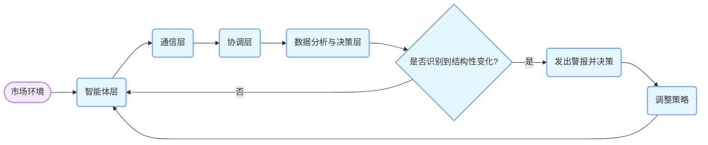

# 多智能体系统在识别市场结构性变化中的应用

> 关键词：多智能体系统、市场结构性变化、识别应用、人工智能、市场分析

> 摘要：本文聚焦于多智能体系统在识别市场结构性变化中的应用。首先介绍了相关背景，包括目的、预期读者、文档结构和术语表等。详细阐述了多智能体系统的核心概念及其与市场结构性变化识别的联系，通过原理和架构的文本示意图以及Mermaid流程图进行清晰展示。深入讲解了核心算法原理和具体操作步骤，并给出Python源代码示例。同时，运用数学模型和公式对相关原理进行解释，并举例说明。通过项目实战，展示了代码的实际案例和详细解释。探讨了多智能体系统在识别市场结构性变化中的实际应用场景，推荐了学习资源、开发工具框架和相关论文著作。最后总结了未来发展趋势与挑战，提供了常见问题解答和扩展阅读参考资料，旨在为相关领域的研究和实践提供全面且深入的指导。

## 1. 背景介绍 
### 1.1 目的和范围
在当今复杂多变的市场环境中，准确识别市场结构性变化对于企业决策、投资者战略制定以及政策制定者的宏观调控都具有至关重要的意义。市场结构性变化涉及到市场的供需关系、竞争格局、消费者行为等多个方面的重大转变，这些变化可能会带来新的机遇，也可能引发潜在的风险。

多智能体系统（Multi - Agent System，MAS）作为一种分布式人工智能技术，由多个自主的智能体组成，这些智能体可以通过相互协作、通信和交互来完成复杂的任务。本文章的目的在于深入探讨多智能体系统在识别市场结构性变化中的应用，研究如何利用多智能体系统的特性和优势，构建有效的市场监测和分析模型，以准确、及时地识别市场结构性变化。

本文的范围涵盖了多智能体系统的基本概念、核心算法原理、数学模型、实际应用案例等方面。通过理论分析和实践案例相结合的方式，全面展示多智能体系统在市场结构性变化识别中的应用潜力和价值。

### 1.2 预期读者
本文的预期读者主要包括以下几类人群：
- **学术研究人员**：对人工智能、市场分析等领域感兴趣的学者和研究人员，他们可以从本文中获取多智能体系统在市场领域应用的最新研究成果和理论方法，为进一步的学术研究提供参考。
- **企业管理者**：企业的高层管理人员、市场分析人员和战略规划人员，他们可以通过本文了解如何利用多智能体系统来识别市场结构性变化，从而制定更加科学合理的企业战略和决策，提高企业的市场竞争力。
- **投资者**：股票、基金、期货等金融市场的投资者，他们可以借助多智能体系统的分析结果，更好地把握市场趋势，识别潜在的投资机会和风险，优化投资组合。
- **政策制定者**：政府部门的经济政策制定者和监管人员，他们可以利用多智能体系统对市场结构性变化的识别结果，制定更加有效的宏观经济政策和市场监管措施，维护市场的稳定和健康发展。

### 1.3 文档结构概述
本文的文档结构如下：
- **核心概念与联系**：介绍多智能体系统和市场结构性变化的核心概念，以及它们之间的联系，通过文本示意图和Mermaid流程图进行直观展示。
- **核心算法原理 & 具体操作步骤**：详细讲解多智能体系统用于识别市场结构性变化的核心算法原理，并给出具体的操作步骤，同时提供Python源代码示例。
- **数学模型和公式 & 详细讲解 & 举例说明**：运用数学模型和公式对多智能体系统的工作原理进行深入解释，并通过具体的例子进行说明。
- **项目实战：代码实际案例和详细解释说明**：通过一个实际的项目案例，展示如何使用多智能体系统识别市场结构性变化，包括开发环境搭建、源代码实现和代码解读。
- **实际应用场景**：探讨多智能体系统在不同市场领域中识别结构性变化的实际应用场景。
- **工具和资源推荐**：推荐学习多智能体系统和市场分析的相关资源，包括书籍、在线课程、技术博客、开发工具框架和相关论文著作。
- **总结：未来发展趋势与挑战**：总结多智能体系统在识别市场结构性变化中的应用现状，分析未来的发展趋势和面临的挑战。
- **附录：常见问题与解答**：解答读者在阅读本文过程中可能遇到的常见问题。
- **扩展阅读 & 参考资料**：提供相关的扩展阅读材料和参考资料，方便读者进一步深入研究。

### 1.4 术语表
#### 1.4.1 核心术语定义
- **多智能体系统（Multi - Agent System，MAS）**：由多个自主的智能体组成的系统，这些智能体可以感知环境、进行决策和行动，并通过相互协作和交互来完成共同的任务。
- **智能体（Agent）**：具有自主性、反应性、主动性和社会性的实体，能够在一定的环境中独立地感知和行动，以实现自身的目标。
- **市场结构性变化**：指市场在供需关系、竞争格局、消费者行为、技术创新等方面发生的重大、长期的变化，这些变化会导致市场的整体结构和运行机制发生改变。
- **市场监测**：对市场的各种数据和信息进行实时收集、分析和评估，以了解市场的动态变化和发展趋势。
- **市场分析**：运用各种方法和工具，对市场的各种因素进行深入研究和分析，以揭示市场的内在规律和发展趋势，为决策提供依据。

#### 1.4.2 相关概念解释
- **分布式人工智能（Distributed Artificial Intelligence，DAI）**：研究如何将人工智能技术分布到多个处理单元或智能体上，通过它们之间的协作和交互来解决复杂的问题。多智能体系统是分布式人工智能的一个重要研究领域。
- **博弈论（Game Theory）**：研究决策主体在相互作用时的策略选择和均衡问题的理论。在多智能体系统中，博弈论可以用于分析智能体之间的交互和协作行为。
- **机器学习（Machine Learning）**：让计算机通过数据和经验自动学习和改进性能的技术。在多智能体系统中，机器学习可以用于智能体的决策和学习过程。

#### 1.4.3 缩略词列表
- **MAS**：Multi - Agent System（多智能体系统）
- **DAI**：Distributed Artificial Intelligence（分布式人工智能）

## 2. 核心概念与联系 
### 2.1 多智能体系统的核心概念
多智能体系统是一种由多个智能体组成的分布式系统，每个智能体都具有一定的自主性和智能性。智能体可以是软件程序、机器人或其他具有感知和行动能力的实体。

智能体的主要特点包括：
- **自主性**：智能体能够在没有外部干预的情况下，独立地感知环境、进行决策和行动。
- **反应性**：智能体能够对环境中的变化做出及时的反应。
- **主动性**：智能体能够主动地发起行动，以实现自身的目标。
- **社会性**：智能体能够与其他智能体进行协作和交互，共同完成任务。

多智能体系统的架构通常包括以下几个部分：
- **智能体层**：由多个智能体组成，每个智能体负责完成特定的任务。
- **通信层**：负责智能体之间的信息传递和通信。
- **协调层**：负责协调智能体之间的行为，避免冲突和重复劳动。
- **环境层**：智能体所处的外部环境，包括市场数据、竞争信息等。

### 2.2 市场结构性变化的概念
市场结构性变化是指市场在供需关系、竞争格局、消费者行为、技术创新等方面发生的重大、长期的变化。这些变化会导致市场的整体结构和运行机制发生改变，从而影响市场参与者的决策和行为。

市场结构性变化的主要表现形式包括：
- **供需关系变化**：如市场需求的增长或下降、供给的增加或减少等。
- **竞争格局变化**：如新企业的进入、现有企业的退出、市场份额的重新分配等。
- **消费者行为变化**：如消费者偏好的改变、消费习惯的变化等。
- **技术创新**：如新产品的推出、新技术的应用等。

### 2.3 多智能体系统与市场结构性变化识别的联系
多智能体系统可以用于识别市场结构性变化的原因主要有以下几点：
- **分布式感知**：多智能体系统中的每个智能体可以独立地感知市场的不同方面，如市场价格、交易量、消费者反馈等。通过多个智能体的分布式感知，可以获取更全面、准确的市场信息。
- **协作与交互**：智能体之间可以通过协作和交互来共享信息、分析数据和进行决策。这种协作和交互可以提高对市场结构性变化的识别能力和效率。
- **适应性和学习能力**：智能体可以根据市场环境的变化，不断调整自己的行为和策略，以适应新的市场情况。这种适应性和学习能力可以帮助系统更好地识别市场结构性变化。

### 2.4 原理和架构的文本示意图
多智能体系统在识别市场结构性变化中的原理和架构可以用以下文本示意图表示：

智能体层：包含多个智能体，每个智能体负责不同的市场监测任务，如价格监测智能体、交易量监测智能体、消费者行为监测智能体等。

通信层：智能体之间通过通信层进行信息传递和共享，将各自监测到的市场信息发送给其他智能体。

协调层：协调层负责协调智能体之间的行为，避免冲突和重复劳动。它可以根据市场情况和任务需求，合理分配智能体的任务。

数据分析与决策层：接收智能体传来的市场信息，运用数据分析和机器学习算法对信息进行处理和分析，识别市场结构性变化的迹象和趋势，并做出相应的决策。

环境层：市场环境，包括市场数据、竞争信息、政策法规等，是智能体感知和行动的对象。

### 2.5 Mermaid流程图


## 3. 核心算法原理 & 具体操作步骤 
### 3.1 核心算法原理
多智能体系统在识别市场结构性变化中常用的核心算法包括基于规则的推理算法、机器学习算法和博弈论算法等。

#### 3.1.1 基于规则的推理算法
基于规则的推理算法是一种基于预先定义的规则来进行决策的算法。在市场结构性变化识别中，可以定义一系列的规则，如当市场价格连续上涨超过一定幅度且交易量持续增加时，判断市场可能发生了结构性变化。

以下是一个简单的基于规则的推理算法的Python示例：
```python
def rule_based_detection(price_increase, volume_increase):
    if price_increase > 0.1 and volume_increase > 0.2:
        return True
    return False

# 示例数据
price_increase = 0.15
volume_increase = 0.25

result = rule_based_detection(price_increase, volume_increase)
print(f"是否识别到结构性变化: {result}")
```

#### 3.1.2 机器学习算法
机器学习算法可以通过对历史市场数据的学习，建立模型来预测市场结构性变化。常用的机器学习算法包括决策树、支持向量机、神经网络等。

以下是一个使用决策树算法进行市场结构性变化识别的Python示例：
```python
from sklearn.tree import DecisionTreeClassifier
from sklearn.model_selection import train_test_split
import numpy as np

# 示例数据
X = np.array([[0.1, 0.2], [0.2, 0.3], [0.3, 0.4], [0.4, 0.5]])
y = np.array([0, 0, 1, 1])

# 划分训练集和测试集
X_train, X_test, y_train, y_test = train_test_split(X, y, test_size=0.2, random_state=42)

# 创建决策树分类器
clf = DecisionTreeClassifier()

# 训练模型
clf.fit(X_train, y_train)

# 预测
y_pred = clf.predict(X_test)
print(f"预测结果: {y_pred}")
```

#### 3.1.3 博弈论算法
博弈论算法可以用于分析智能体之间的交互和竞争关系，从而识别市场结构性变化。例如，在寡头市场中，企业之间的竞争策略会影响市场的结构和价格。

### 3.2 具体操作步骤
#### 3.2.1 数据收集
首先，需要收集市场的相关数据，包括市场价格、交易量、消费者反馈、企业财务数据等。可以通过网络爬虫、数据库查询等方式获取这些数据。

#### 3.2.2 数据预处理
对收集到的数据进行预处理，包括数据清洗、缺失值处理、数据归一化等。数据预处理的目的是提高数据的质量和可用性。

#### 3.2.3 智能体设计与部署
根据市场监测的需求，设计不同类型的智能体，如价格监测智能体、交易量监测智能体等。将这些智能体部署到市场环境中，让它们开始感知和收集市场信息。

#### 3.2.4 信息传递与协作
智能体之间通过通信层进行信息传递和共享，将各自监测到的市场信息发送给其他智能体。协调层负责协调智能体之间的行为，避免冲突和重复劳动。

#### 3.2.5 数据分析与决策
数据分析与决策层接收智能体传来的市场信息，运用核心算法对信息进行处理和分析，识别市场结构性变化的迹象和趋势，并做出相应的决策。

#### 3.2.6 结果反馈与调整
根据决策结果，对智能体的行为和策略进行调整，以适应新的市场情况。同时，将识别结果反馈给市场参与者，为他们的决策提供参考。

## 4. 数学模型和公式 & 详细讲解 & 举例说明 
### 4.1 基于规则的推理模型
#### 4.1.1 数学模型和公式
基于规则的推理模型可以用以下逻辑表达式表示：

设 $P$ 表示市场价格的变化率，$V$ 表示市场交易量的变化率，$T_p$ 和 $T_v$ 分别表示价格和交易量的阈值。则识别市场结构性变化的规则可以表示为：

$$
\text{Structural Change} = 
\begin{cases}
\text{True}, & \text{if } P > T_p \text{ and } V > T_v \\
\text{False}, & \text{otherwise}
\end{cases}
$$

#### 4.1.2 详细讲解
这个规则表示，当市场价格的变化率超过阈值 $T_p$ 且市场交易量的变化率超过阈值 $T_v$ 时，认为市场发生了结构性变化。阈值 $T_p$ 和 $T_v$ 可以根据历史数据和经验进行设置。

#### 4.1.3 举例说明
假设 $T_p = 0.1$，$T_v = 0.2$，当前市场价格的变化率 $P = 0.15$，市场交易量的变化率 $V = 0.25$。则根据上述规则：

$P = 0.15 > 0.1 = T_p$ 且 $V = 0.25 > 0.2 = T_v$，所以 $\text{Structural Change} = \text{True}$，即认为市场发生了结构性变化。

### 4.2 机器学习模型
#### 4.2.1 数学模型和公式
以决策树算法为例，决策树是一种基于树结构进行决策的模型。决策树的每个内部节点表示一个特征上的测试，每个分支表示一个测试输出，每个叶节点表示一个类别或值。

决策树的训练过程是通过递归地划分数据集，使得每个子数据集尽可能地纯净。常用的划分准则包括信息增益、信息增益比、基尼指数等。

信息增益的计算公式为：

$$
\text{Gain}(D, a) = \text{Ent}(D) - \sum_{v = 1}^{V} \frac{|D^v|}{|D|} \text{Ent}(D^v)
$$

其中，$D$ 表示数据集，$a$ 表示特征，$V$ 表示特征 $a$ 的取值个数，$D^v$ 表示数据集 $D$ 中特征 $a$ 取值为 $v$ 的子集，$\text{Ent}(D)$ 表示数据集 $D$ 的信息熵，计算公式为：

$$
\text{Ent}(D) = - \sum_{k = 1}^{K} p_k \log_2 p_k
$$

其中，$K$ 表示数据集 $D$ 中类别的个数，$p_k$ 表示第 $k$ 个类别的样本在数据集 $D$ 中所占的比例。

#### 4.2.2 详细讲解
信息增益表示在使用特征 $a$ 进行划分后，数据集的信息熵减少的程度。信息增益越大，说明使用特征 $a$ 进行划分可以使数据集更加纯净，因此该特征越适合作为划分特征。

决策树的训练过程就是不断地选择信息增益最大的特征进行划分，直到满足停止条件，如所有样本属于同一类别或没有更多的特征可供选择。

#### 4.2.3 举例说明
假设有一个数据集 $D$ 包含 10 个样本，分为两类，其中一类有 6 个样本，另一类有 4 个样本。则数据集 $D$ 的信息熵为：

$$
\text{Ent}(D) = - \left( \frac{6}{10} \log_2 \frac{6}{10} + \frac{4}{10} \log_2 \frac{4}{10} \right) \approx 0.971
$$

假设特征 $a$ 有两个取值 $v_1$ 和 $v_2$，$D^{v_1}$ 包含 4 个样本，其中一类有 3 个样本，另一类有 1 个样本；$D^{v_2}$ 包含 6 个样本，其中一类有 3 个样本，另一类有 3 个样本。则：

$$
\text{Ent}(D^{v_1}) = - \left( \frac{3}{4} \log_2 \frac{3}{4} + \frac{1}{4} \log_2 \frac{1}{4} \right) \approx 0.811
$$

$$
\text{Ent}(D^{v_2}) = - \left( \frac{3}{6} \log_2 \frac{3}{6} + \frac{3}{6} \log_2 \frac{3}{6} \right) = 1
$$

$$
\text{Gain}(D, a) = 0.971 - \left( \frac{4}{10} \times 0.811 + \frac{6}{10} \times 1 \right) \approx 0.134
$$

通过计算不同特征的信息增益，选择信息增益最大的特征作为划分特征，逐步构建决策树。

## 5. 项目实战：代码实际案例和详细解释说明 
### 5.1  开发环境搭建
#### 5.1.1 安装Python
首先，需要安装Python环境。可以从Python官方网站（https://www.python.org/downloads/）下载适合自己操作系统的Python安装包，并按照安装向导进行安装。

#### 5.1.2 安装必要的库
在识别市场结构性变化的项目中，需要使用一些Python库，如`numpy`、`pandas`、`scikit-learn`等。可以使用`pip`命令进行安装：
```sh
pip install numpy pandas scikit-learn
```

### 5.2  源代码详细实现和代码解读
以下是一个使用多智能体系统和机器学习算法识别市场结构性变化的完整代码示例：

```python
import numpy as np
import pandas as pd
from sklearn.model_selection import train_test_split
from sklearn.tree import DecisionTreeClassifier
from sklearn.metrics import accuracy_score

# 模拟市场数据
def generate_market_data(num_samples):
    # 生成随机的价格变化率和交易量变化率
    price_changes = np.random.uniform(0, 0.3, num_samples)
    volume_changes = np.random.uniform(0, 0.4, num_samples)
    
    # 根据价格和交易量变化率生成标签，当价格变化率大于 0.2 且交易量变化率大于 0.3 时，认为发生了结构性变化
    labels = []
    for p, v in zip(price_changes, volume_changes):
        if p > 0.2 and v > 0.3:
            labels.append(1)
        else:
            labels.append(0)
    
    data = pd.DataFrame({
        'price_change': price_changes,
        'volume_change': volume_changes,
        'structural_change': labels
    })
    return data

# 数据预处理
def preprocess_data(data):
    X = data[['price_change', 'volume_change']].values
    y = data['structural_change'].values
    return X, y

# 训练模型
def train_model(X_train, y_train):
    clf = DecisionTreeClassifier()
    clf.fit(X_train, y_train)
    return clf

# 评估模型
def evaluate_model(clf, X_test, y_test):
    y_pred = clf.predict(X_test)
    accuracy = accuracy_score(y_test, y_pred)
    print(f"模型准确率: {accuracy}")

# 主函数
def main():
    # 生成市场数据
    num_samples = 1000
    data = generate_market_data(num_samples)
    
    # 数据预处理
    X, y = preprocess_data(data)
    
    # 划分训练集和测试集
    X_train, X_test, y_train, y_test = train_test_split(X, y, test_size=0.2, random_state=42)
    
    # 训练模型
    clf = train_model(X_train, y_train)
    
    # 评估模型
    evaluate_model(clf, X_test, y_test)

if __name__ == "__main__":
    main()
```

### 5.3  代码解读与分析
#### 5.3.1 生成市场数据
`generate_market_data`函数用于生成模拟的市场数据，包括价格变化率、交易量变化率和标签（是否发生结构性变化）。通过随机生成价格和交易量变化率，并根据一定的规则生成标签。

#### 5.3.2 数据预处理
`preprocess_data`函数用于将生成的市场数据转换为适合机器学习模型输入的格式，即特征矩阵 $X$ 和标签向量 $y$。

#### 5.3.3 训练模型
`train_model`函数使用决策树分类器对训练数据进行训练，得到训练好的模型。

#### 5.3.4 评估模型
`evaluate_model`函数使用测试数据对训练好的模型进行评估，计算模型的准确率。

#### 5.3.5 主函数
`main`函数是程序的入口，依次调用上述函数完成数据生成、预处理、模型训练和评估的整个过程。

通过这个代码示例，可以看到如何使用多智能体系统的思想（模拟不同智能体收集价格和交易量信息）和机器学习算法（决策树分类器）来识别市场结构性变化。

## 6. 实际应用场景 
### 6.1 金融市场
在金融市场中，多智能体系统可以用于识别股票市场、债券市场、期货市场等的结构性变化。例如，通过监测股票的价格、交易量、市盈率等指标，利用多智能体系统可以及时发现市场的异常波动和结构性变化，为投资者提供决策参考。同时，监管机构可以利用多智能体系统监测金融市场的系统性风险，及时采取措施防范金融风险。

### 6.2 零售市场
在零售市场中，多智能体系统可以用于识别消费者行为的结构性变化。例如，通过监测消费者的购买频率、购买金额、购买偏好等信息，利用多智能体系统可以发现消费者行为的变化趋势，如消费升级、消费降级等。零售商可以根据这些信息调整商品策略和营销策略，提高市场竞争力。

### 6.3 能源市场
在能源市场中，多智能体系统可以用于识别能源供需关系的结构性变化。例如，通过监测能源的生产、消费、价格等信息，利用多智能体系统可以预测能源市场的供需平衡情况，及时发现能源短缺或过剩的迹象。能源企业可以根据这些信息调整生产计划和销售策略，政府可以制定相应的能源政策。

### 6.4 房地产市场
在房地产市场中，多智能体系统可以用于识别房地产市场的结构性变化。例如，通过监测房价、成交量、土地供应等信息，利用多智能体系统可以分析房地产市场的供需关系和发展趋势，预测房价的走势。房地产开发商可以根据这些信息制定开发计划和销售策略，购房者可以根据市场情况做出合理的购房决策。

## 7. 工具和资源推荐
### 7.1 学习资源推荐
#### 7.1.1 书籍推荐
- 《多智能体系统：原理与编程》：全面介绍了多智能体系统的基本概念、理论和编程方法，是学习多智能体系统的经典教材。
- 《机器学习》：由周志华教授编写，系统地介绍了机器学习的基本概念、算法和应用，对于理解多智能体系统中的机器学习算法有很大帮助。
- 《博弈论》：介绍了博弈论的基本原理和应用，对于理解多智能体系统中智能体之间的交互和竞争关系有重要意义。

#### 7.1.2 在线课程
- Coursera上的“Multi - Agent Systems”课程：由知名教授授课，深入讲解多智能体系统的理论和实践。
- edX上的“Machine Learning”课程：由斯坦福大学教授授课，是学习机器学习的优质课程。
- 中国大学MOOC上的“博弈论基础”课程：系统地介绍了博弈论的基本概念和方法。

#### 7.1.3 技术博客和网站
- Medium：上面有很多关于多智能体系统、机器学习和市场分析的技术文章和案例分享。
- arXiv：提供了大量的学术论文和研究成果，对于了解多智能体系统的最新研究动态有很大帮助。
- 开源中国：有很多关于人工智能和软件开发的技术文章和代码分享。

### 7.2 开发工具框架推荐
#### 7.2.1 IDE和编辑器
- PyCharm：是一款专业的Python集成开发环境，具有强大的代码编辑、调试和项目管理功能，适合开发多智能体系统和机器学习项目。
- Jupyter Notebook：是一个交互式的开发环境，适合进行数据探索、模型训练和代码演示，对于学习和实践多智能体系统和市场分析非常方便。

#### 7.2.2 调试和性能分析工具
- PDB：Python自带的调试工具，可以帮助开发者调试代码，查找和解决问题。
- cProfile：Python的性能分析工具，可以分析代码的运行时间和内存使用情况，帮助开发者优化代码性能。

#### 7.2.3 相关框架和库
- Mesa：是一个用于构建多智能体系统的Python框架，提供了丰富的工具和接口，方便开发者快速搭建多智能体系统。
- Scikit - learn：是一个强大的机器学习库，提供了各种机器学习算法和工具，如分类、回归、聚类等，对于多智能体系统中的数据分析和决策有很大帮助。

### 7.3 相关论文著作推荐
#### 7.3.1 经典论文
- “Multi - Agent Systems: A Modern Approach to Distributed Artificial Intelligence”：该论文系统地介绍了多智能体系统的基本概念、理论和应用，是多智能体系统领域的经典之作。
- “A Mathematical Theory of Communication”：由香农提出的信息论的经典论文，对于理解机器学习中的信息增益等概念有重要意义。

#### 7.3.2 最新研究成果
- 在ACM SIGKDD、NeurIPS等顶级学术会议上发表的关于多智能体系统和市场分析的研究论文，反映了该领域的最新研究动态和成果。

#### 7.3.3 应用案例分析
- 一些知名企业和研究机构发布的关于多智能体系统在金融市场、零售市场等领域的应用案例分析报告，对于了解多智能体系统的实际应用有很大帮助。

## 8. 总结：未来发展趋势与挑战
### 8.1 未来发展趋势
#### 8.1.1 与大数据和云计算的深度融合
随着大数据和云计算技术的不断发展，多智能体系统可以利用大数据提供的丰富市场信息和云计算提供的强大计算能力，提高市场结构性变化识别的准确性和效率。

#### 8.1.2 强化学习和深度学习的应用
强化学习和深度学习在人工智能领域取得了显著的成果，未来多智能体系统可以引入强化学习和深度学习算法，使智能体能够更好地适应复杂多变的市场环境，提高决策能力和学习能力。

#### 8.1.3 跨领域应用的拓展
多智能体系统在金融、零售、能源等领域已经有了一定的应用，未来将拓展到更多的领域，如医疗、教育、交通等，为不同领域的市场结构性变化识别提供解决方案。

### 8.2 挑战
#### 8.2.1 数据质量和隐私问题
市场数据的质量和隐私是多智能体系统应用的关键问题。不准确或不完整的数据会影响市场结构性变化识别的准确性，而数据隐私问题则需要在数据收集、存储和使用过程中加以解决。

#### 8.2.2 智能体之间的协作和协调
多智能体系统中智能体之间的协作和协调是一个复杂的问题。如何确保智能体之间能够有效地共享信息、避免冲突和重复劳动，是提高系统性能的关键。

#### 8.2.3 模型的可解释性
机器学习模型在多智能体系统中得到了广泛应用，但这些模型往往缺乏可解释性。在市场结构性变化识别中，需要能够解释模型的决策过程和结果，以便市场参与者能够理解和信任模型的输出。

## 9. 附录：常见问题与解答
### 9.1 多智能体系统与传统的市场分析方法有什么区别？
传统的市场分析方法通常基于统计学和经济学原理，主要依靠专家经验和历史数据进行分析。而多智能体系统是一种分布式人工智能技术，通过多个智能体的协作和交互来完成市场监测和分析任务。多智能体系统具有更强的适应性和学习能力，能够更好地应对复杂多变的市场环境。

### 9.2 如何选择合适的核心算法？
选择合适的核心算法需要考虑多个因素，如数据特点、问题复杂度、计算资源等。如果数据具有明显的规则性，可以选择基于规则的推理算法；如果数据复杂且难以用规则描述，可以选择机器学习算法；如果需要考虑智能体之间的交互和竞争关系，可以选择博弈论算法。

### 9.3 多智能体系统在实际应用中需要注意哪些问题？
在实际应用中，需要注意以下问题：
- 数据质量：确保收集到的市场数据准确、完整。
- 智能体设计：合理设计智能体的功能和行为，确保智能体之间能够有效协作。
- 模型评估：对模型进行充分的评估和验证，确保模型的准确性和可靠性。
- 系统安全：保障多智能体系统的安全，防止数据泄露和恶意攻击。

## 10. 扩展阅读 & 参考资料
### 10.1 扩展阅读
- 《人工智能：一种现代方法》：全面介绍了人工智能的基本概念、理论和方法，对于深入理解多智能体系统有很大帮助。
- 《数据挖掘：概念与技术》：介绍了数据挖掘的基本概念、算法和应用，对于处理市场数据和进行数据分析有重要参考价值。

### 10.2 参考资料
- 相关学术论文和研究报告，如ACM SIGKDD、NeurIPS等会议上发表的论文。
- 开源项目和代码库，如Mesa、Scikit - learn等的官方文档和代码示例。
- 行业报告和市场分析资料，如金融机构、咨询公司发布的市场研究报告。