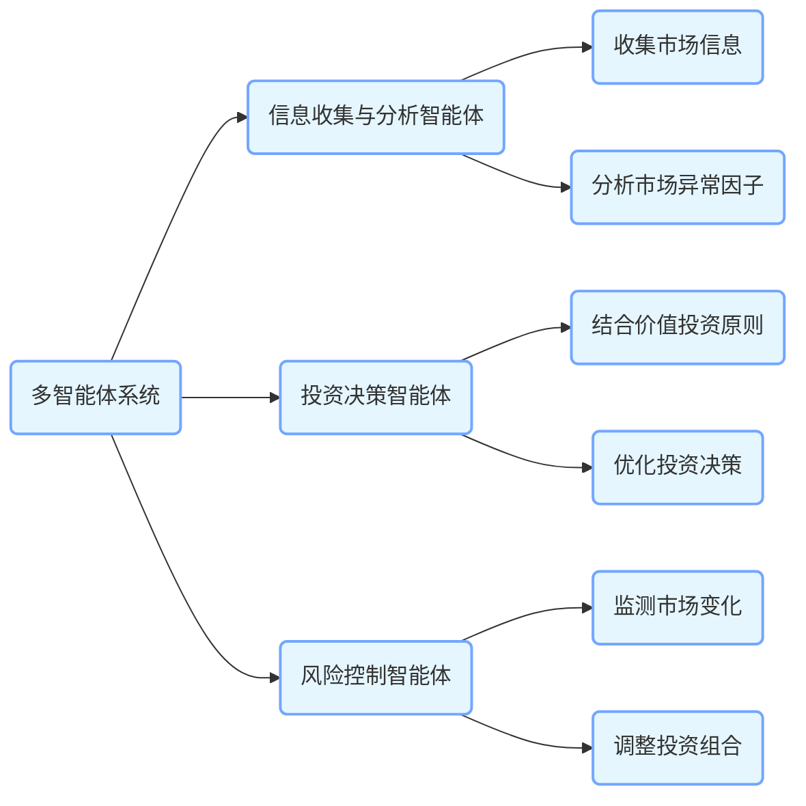

# 多智能体系统增强价值投资的市场异常因子衰减分析

> 关键词：多智能体系统；价值投资；市场异常因子；衰减分析

> 摘要：本文聚焦于多智能体系统增强价值投资中市场异常因子的衰减问题。首先介绍了研究的背景、目的、预期读者和文档结构等内容。详细阐述了多智能体系统、价值投资以及市场异常因子的核心概念及其联系，给出了相关原理和架构的文本示意图与 Mermaid 流程图。深入探讨了核心算法原理，用 Python 代码进行了详细说明，并给出了数学模型和公式。通过项目实战，展示了开发环境搭建、源代码实现及代码解读。分析了该研究在实际中的应用场景，推荐了学习资源、开发工具框架和相关论文著作。最后总结了未来发展趋势与挑战，提供了常见问题解答和扩展阅读参考资料，旨在为多智能体系统在价值投资中应对市场异常因子衰减提供全面的技术支持和理论指导。

## 1. 背景介绍 

### 1.1 目的和范围
本研究的主要目的是深入分析多智能体系统在增强价值投资过程中，市场异常因子的衰减情况。随着金融市场的日益复杂和不确定性增加，价值投资策略面临着诸多挑战，市场异常因子的存在会干扰投资决策的准确性。多智能体系统作为一种新兴的技术手段，为解决这些问题提供了新的思路。通过研究市场异常因子的衰减，我们可以更好地理解多智能体系统如何优化价值投资策略，提高投资的回报率和稳定性。

本研究的范围涵盖了多智能体系统的基本原理、价值投资的核心概念、市场异常因子的定义和分类，以及它们之间的相互关系。同时，将通过理论分析、算法实现和实际案例验证等方法，全面探讨市场异常因子在多智能体系统增强价值投资中的衰减机制。

### 1.2 预期读者
本文预期读者主要包括金融领域的投资者、投资分析师、金融科技研究者，以及对多智能体系统和价值投资感兴趣的计算机科学专业人员。对于投资者和投资分析师来说，本文可以为他们优化投资策略提供新的视角和方法；对于金融科技研究者，有助于他们深入了解多智能体系统在金融领域的应用和挑战；对于计算机科学专业人员，能为他们将多智能体技术应用于金融市场提供实际案例和理论基础。

### 1.3 文档结构概述
本文将按照以下结构进行组织：
- 核心概念与联系：介绍多智能体系统、价值投资和市场异常因子的核心概念，并分析它们之间的联系，给出原理和架构的文本示意图与 Mermaid 流程图。
- 核心算法原理 & 具体操作步骤：详细阐述用于分析市场异常因子衰减的核心算法原理，并用 Python 代码进行详细说明。
- 数学模型和公式 & 详细讲解 & 举例说明：建立数学模型和公式来描述市场异常因子的衰减过程，并通过具体例子进行说明。
- 项目实战：代码实际案例和详细解释说明：通过一个实际的项目案例，展示如何搭建开发环境、实现源代码，并对代码进行解读和分析。
- 实际应用场景：分析多智能体系统增强价值投资在实际金融市场中的应用场景。
- 工具和资源推荐：推荐学习资源、开发工具框架和相关论文著作，帮助读者进一步深入学习和研究。
- 总结：未来发展趋势与挑战：总结多智能体系统增强价值投资中市场异常因子衰减分析的未来发展趋势和面临的挑战。
- 附录：常见问题与解答：提供常见问题的解答，帮助读者更好地理解本文内容。
- 扩展阅读 & 参考资料：列出扩展阅读的资料和参考文献，方便读者进一步深入研究。

### 1.4 术语表

#### 1.4.1 核心术语定义
- **多智能体系统（Multi - Agent System，MAS）**：由多个智能体组成的系统，每个智能体具有一定的自主性、灵活性和交互能力，能够在复杂环境中通过相互协作实现共同目标。
- **价值投资（Value Investing）**：一种投资策略，投资者通过分析公司的基本面，寻找被低估的股票进行投资，期望在股票价格回归其内在价值时获得收益。
- **市场异常因子（Market Anomaly Factors）**：金融市场中偏离有效市场假说的因素，这些因素会导致股票价格偏离其合理价值，常见的市场异常因子包括规模效应、价值效应、动量效应等。
- **异常因子衰减（Anomaly Factor Decay）**：市场异常因子的影响力随着时间的推移而逐渐减弱的现象。

#### 1.4.2 相关概念解释
- **智能体（Agent）**：在多智能体系统中，智能体是一个具有感知、决策和行动能力的实体。它可以感知环境信息，根据自身的目标和规则做出决策，并采取相应的行动。
- **有效市场假说（Efficient Market Hypothesis，EMH）**：该假说认为金融市场中的资产价格已经反映了所有可用的信息，因此投资者无法通过分析历史数据或其他公开信息获得超额收益。
- **基本面分析（Fundamental Analysis）**：通过分析公司的财务报表、行业前景、管理团队等基本面因素，评估公司的内在价值，为投资决策提供依据。

#### 1.4.3 缩略词列表
- MAS：Multi - Agent System（多智能体系统）
- EMH：Efficient Market Hypothesis（有效市场假说）

## 2. 核心概念与联系 

### 2.1 多智能体系统原理
多智能体系统由多个智能体组成，每个智能体可以是一个软件程序、机器人或其他具有一定智能的实体。智能体具有以下特点：
- **自主性**：智能体能够在一定程度上独立地做出决策和行动，不受外部直接控制。
- **交互性**：智能体之间可以通过通信机制进行信息交换和协作，共同完成系统的目标。
- **适应性**：智能体可以根据环境的变化调整自己的行为和策略。

多智能体系统的架构通常包括智能体层、通信层和协调层。智能体层负责感知环境、做出决策和执行行动；通信层负责智能体之间的信息传递；协调层负责协调智能体之间的协作，避免冲突和提高效率。

### 2.2 价值投资原理
价值投资的核心思想是寻找被市场低估的股票，即股票的市场价格低于其内在价值。投资者通过对公司的基本面进行分析，评估公司的盈利能力、资产质量、现金流等因素，确定公司的内在价值。当股票价格低于其内在价值时，投资者认为该股票具有投资价值，买入该股票；当股票价格回归其内在价值时，投资者卖出股票，获得收益。

价值投资的主要步骤包括：
- **筛选股票**：根据一定的标准筛选出具有潜在投资价值的股票。
- **基本面分析**：对筛选出的股票进行深入的基本面分析，评估公司的内在价值。
- **估值**：使用各种估值方法，如市盈率法、市净率法、现金流折现法等，确定股票的合理价格。
- **投资决策**：根据股票的市场价格和合理价格的比较，做出投资决策。

### 2.3 市场异常因子原理
市场异常因子是金融市场中偏离有效市场假说的因素。这些因素的存在使得股票价格不能完全反映其内在价值，从而为投资者提供了获得超额收益的机会。常见的市场异常因子包括：
- **规模效应（Size Effect）**：小市值股票的平均收益率通常高于大市值股票。
- **价值效应（Value Effect）**：低市净率、低市盈率的股票的平均收益率通常高于高市净率、高市盈率的股票。
- **动量效应（Momentum Effect）**：过去一段时间内表现良好的股票在未来一段时间内仍有继续表现良好的趋势。

### 2.4 核心概念联系
多智能体系统可以应用于价值投资中，通过智能体之间的协作和信息共享，更好地分析市场异常因子，提高价值投资的效果。具体来说，多智能体系统可以实现以下功能：
- **信息收集和分析**：智能体可以收集各种市场信息，包括公司基本面信息、市场行情信息等，并对这些信息进行分析，识别市场异常因子。
- **投资决策优化**：智能体可以根据分析结果，结合价值投资的原则，优化投资决策，选择具有投资价值的股票。
- **风险控制**：智能体可以实时监测市场变化，及时调整投资组合，控制投资风险。

### 2.5 文本示意图
```plaintext
多智能体系统
    |
    |---信息收集与分析智能体
    |       |---收集市场信息
    |       |---分析市场异常因子
    |
    |---投资决策智能体
    |       |---结合价值投资原则
    |       |---优化投资决策
    |
    |---风险控制智能体
            |---监测市场变化
            |---调整投资组合
```

### 2.6 Mermaid 流程图


## 3. 核心算法原理 & 具体操作步骤 

### 3.1 核心算法原理
为了分析多智能体系统增强价值投资中市场异常因子的衰减情况，我们采用基于时间序列分析的方法。具体来说，我们将市场异常因子的影响力表示为一个时间序列，通过对该时间序列进行建模和分析，研究异常因子的衰减规律。

我们使用自回归积分滑动平均模型（ARIMA）来对市场异常因子的时间序列进行建模。ARIMA 模型是一种广泛应用于时间序列分析的模型，它可以捕捉时间序列的自相关性、趋势性和季节性。ARIMA 模型的一般形式为：

$$ARIMA(p, d, q)$$

其中，$p$ 表示自回归阶数，$d$ 表示差分阶数，$q$ 表示移动平均阶数。

### 3.2 具体操作步骤

#### 3.2.1 数据收集
首先，我们需要收集市场异常因子的时间序列数据。这些数据可以从金融数据库、证券交易所等渠道获取。例如，我们可以收集股票的收益率、市值、市净率等数据，计算市场异常因子的指标。

#### 3.2.2 数据预处理
对收集到的数据进行预处理，包括缺失值处理、异常值处理和数据标准化等。缺失值可以采用插值法或删除法进行处理；异常值可以采用统计方法或机器学习方法进行识别和处理；数据标准化可以采用归一化或标准化方法，使数据具有相同的尺度。

#### 3.2.3 模型识别
使用自相关函数（ACF）和偏自相关函数（PACF）来确定 ARIMA 模型的阶数 $p$、$d$ 和 $q$。自相关函数反映了时间序列与自身滞后项之间的相关性；偏自相关函数反映了在去除中间滞后项的影响后，时间序列与自身滞后项之间的相关性。

#### 3.2.4 模型估计
使用最大似然估计法对 ARIMA 模型的参数进行估计。最大似然估计法是一种常用的参数估计方法，它通过最大化似然函数来确定模型的参数。

#### 3.2.5 模型检验
使用残差分析来检验 ARIMA 模型的拟合效果。残差是模型预测值与实际值之间的差值，如果残差序列是白噪声序列，则说明模型拟合效果良好。

#### 3.2.6 衰减分析
根据估计得到的 ARIMA 模型，分析市场异常因子的衰减情况。可以通过计算异常因子的半衰期、衰减率等指标来衡量异常因子的衰减速度。

### 3.3 Python 代码实现
```python
import pandas as pd
import numpy as np
from statsmodels.tsa.arima.model import ARIMA
import matplotlib.pyplot as plt

# 数据收集和预处理
# 假设我们已经有一个包含市场异常因子时间序列的 CSV 文件
data = pd.read_csv('market_anomaly_factor.csv', index_col=0, parse_dates=True)
# 处理缺失值
data = data.dropna()
# 数据标准化
data = (data - data.mean()) / data.std()

# 模型识别
# 绘制自相关函数和偏自相关函数图
from statsmodels.graphics.tsaplots import plot_acf, plot_pacf
fig, axes = plt.subplots(2, 1, figsize=(12, 8))
plot_acf(data, lags=40, ax=axes[0])
plot_pacf(data, lags=40, ax=axes[1])
plt.show()

# 根据自相关函数和偏自相关函数图确定 p, d, q 值
p = 1
d = 1
q = 1

# 模型估计
model = ARIMA(data, order=(p, d, q))
model_fit = model.fit()

# 模型检验
residuals = pd.DataFrame(model_fit.resid)
fig, axes = plt.subplots(2, 1, figsize=(12, 8))
residuals.plot(ax=axes[0])
residuals.plot(kind='kde', ax=axes[1])
plt.show()

# 衰减分析
# 计算异常因子的半衰期
halflife = np.log(0.5) / np.log(model_fit.params['ar.L1'])
print(f"市场异常因子的半衰期: {halflife}")
```

## 4. 数学模型和公式 & 详细讲解 & 举例说明 

### 4.1 ARIMA 模型数学公式
ARIMA 模型的一般形式可以表示为：

$$\phi(B)(1 - B)^d Y_t = \theta(B) \epsilon_t$$

其中，$Y_t$ 是时间序列，$B$ 是滞后算子，即 $B Y_t = Y_{t - 1}$，$(1 - B)^d$ 表示 $d$ 阶差分，$\phi(B)$ 是自回归多项式，$\theta(B)$ 是移动平均多项式，$\epsilon_t$ 是白噪声序列。

自回归多项式 $\phi(B)$ 可以表示为：

$$\phi(B) = 1 - \phi_1 B - \phi_2 B^2 - \cdots - \phi_p B^p$$

移动平均多项式 $\theta(B)$ 可以表示为：

$$\theta(B) = 1 + \theta_1 B + \theta_2 B^2 + \cdots + \theta_q B^q$$

### 4.2 详细讲解
- **自回归部分**：自回归部分表示当前时刻的时间序列值与过去若干时刻的时间序列值之间的线性关系。自回归阶数 $p$ 表示使用过去 $p$ 个时刻的时间序列值来预测当前时刻的值。
- **差分部分**：差分部分用于消除时间序列的趋势性和季节性。差分阶数 $d$ 表示对时间序列进行 $d$ 次差分，使差分后的时间序列具有平稳性。
- **移动平均部分**：移动平均部分表示当前时刻的时间序列值与过去若干时刻的白噪声序列值之间的线性关系。移动平均阶数 $q$ 表示使用过去 $q$ 个时刻的白噪声序列值来预测当前时刻的值。

### 4.3 举例说明
假设我们有一个时间序列 $Y_t$，其 ARIMA(1, 1, 1) 模型可以表示为：

$$(1 - \phi_1 B)(1 - B) Y_t = (1 + \theta_1 B) \epsilon_t$$

展开上式可得：

$$(1 - B - \phi_1 B + \phi_1 B^2) Y_t = \epsilon_t + \theta_1 \epsilon_{t - 1}$$

即：

$$Y_t - Y_{t - 1} - \phi_1 Y_{t - 1} + \phi_1 Y_{t - 2} = \epsilon_t + \theta_1 \epsilon_{t - 1}$$

整理可得：

$$Y_t = (1 + \phi_1) Y_{t - 1} - \phi_1 Y_{t - 2} + \epsilon_t + \theta_1 \epsilon_{t - 1}$$

这表示当前时刻的时间序列值 $Y_t$ 是过去两个时刻的时间序列值 $Y_{t - 1}$ 和 $Y_{t - 2}$ 的线性组合，再加上当前时刻和过去一个时刻的白噪声序列值 $\epsilon_t$ 和 $\epsilon_{t - 1}$。

### 4.4 异常因子衰减指标计算
- **半衰期（Half - Life）**：异常因子的半衰期是指异常因子的影响力衰减到初始值的一半所需的时间。对于 ARIMA 模型，半衰期可以通过以下公式计算：

$$t_{1/2} = \frac{\ln(0.5)}{\ln(\phi_1)}$$

其中，$\phi_1$ 是 ARIMA 模型的自回归系数。

- **衰减率（Decay Rate）**：异常因子的衰减率是指异常因子的影响力在单位时间内的衰减比例。衰减率可以通过以下公式计算：

$$\lambda = 1 - \phi_1$$

## 5. 项目实战：代码实际案例和详细解释说明 

### 5.1 开发环境搭建
#### 5.1.1 安装 Python
首先，需要安装 Python 编程语言。可以从 Python 官方网站（https://www.python.org/downloads/）下载适合自己操作系统的 Python 安装包，并按照安装向导进行安装。

#### 5.1.2 安装必要的库
在安装好 Python 后，需要安装一些必要的库，包括 Pandas、Numpy、Statsmodels 和 Matplotlib。可以使用以下命令进行安装：

```sh
pip install pandas numpy statsmodels matplotlib
```

### 5.2 源代码详细实现和代码解读
```python
import pandas as pd
import numpy as np
from statsmodels.tsa.arima.model import ARIMA
import matplotlib.pyplot as plt

# 数据收集和预处理
# 假设我们已经有一个包含市场异常因子时间序列的 CSV 文件
data = pd.read_csv('market_anomaly_factor.csv', index_col=0, parse_dates=True)
# 处理缺失值
data = data.dropna()
# 数据标准化
data = (data - data.mean()) / data.std()

# 代码解读：
# 首先，使用 Pandas 的 read_csv 函数读取包含市场异常因子时间序列的 CSV 文件，并将第一列作为索引，将日期列解析为日期类型。
# 然后，使用 dropna 方法删除包含缺失值的行。
# 最后，对数据进行标准化处理，使数据具有相同的尺度。

# 模型识别
# 绘制自相关函数和偏自相关函数图
from statsmodels.graphics.tsaplots import plot_acf, plot_pacf
fig, axes = plt.subplots(2, 1, figsize=(12, 8))
plot_acf(data, lags=40, ax=axes[0])
plot_pacf(data, lags=40, ax=axes[1])
plt.show()

# 代码解读：
# 从 statsmodels 库中导入 plot_acf 和 plot_pacf 函数，用于绘制自相关函数和偏自相关函数图。
# 使用 plt.subplots 函数创建一个包含两个子图的图形，分别用于绘制自相关函数和偏自相关函数图。
# 调用 plot_acf 和 plot_pacf 函数，设置滞后阶数为 40，并将图形显示出来。

# 根据自相关函数和偏自相关函数图确定 p, d, q 值
p = 1
d = 1
q = 1

# 代码解读：
# 根据自相关函数和偏自相关函数图的形状，确定 ARIMA 模型的阶数 p, d, q。这里假设 p = 1, d = 1, q = 1。

# 模型估计
model = ARIMA(data, order=(p, d, q))
model_fit = model.fit()

# 代码解读：
# 创建一个 ARIMA 模型对象，指定阶数为 (p, d, q)。
# 调用 fit 方法对模型进行估计，得到模型的拟合结果。

# 模型检验
residuals = pd.DataFrame(model_fit.resid)
fig, axes = plt.subplots(2, 1, figsize=(12, 8))
residuals.plot(ax=axes[0])
residuals.plot(kind='kde', ax=axes[1])
plt.show()

# 代码解读：
# 将模型的残差存储在一个 Pandas 数据框中。
# 创建一个包含两个子图的图形，分别用于绘制残差序列图和残差的核密度估计图。
# 调用 plot 方法绘制残差序列图和残差的核密度估计图，并将图形显示出来。

# 衰减分析
# 计算异常因子的半衰期
halflife = np.log(0.5) / np.log(model_fit.params['ar.L1'])
print(f"市场异常因子的半衰期: {halflife}")

# 代码解读：
# 根据 ARIMA 模型的自回归系数，计算市场异常因子的半衰期。
# 使用 print 函数输出市场异常因子的半衰期。
```

### 5.3 代码解读与分析
- **数据预处理**：数据预处理是时间序列分析的重要步骤，它可以提高模型的拟合效果和预测精度。在本代码中，我们使用了缺失值处理和数据标准化两种预处理方法。
- **模型识别**：模型识别是确定 ARIMA 模型阶数的关键步骤。通过绘制自相关函数和偏自相关函数图，我们可以观察时间序列的自相关性和偏自相关性，从而确定模型的阶数。
- **模型估计**：模型估计是使用最大似然估计法对 ARIMA 模型的参数进行估计。在本代码中，我们使用了 Statsmodels 库的 ARIMA 类和 fit 方法来完成模型估计。
- **模型检验**：模型检验是评估模型拟合效果的重要步骤。通过绘制残差序列图和残差的核密度估计图，我们可以观察残差的分布情况，判断残差是否为白噪声序列。如果残差是白噪声序列，则说明模型拟合效果良好。
- **衰减分析**：衰减分析是本研究的核心内容。通过计算市场异常因子的半衰期，我们可以衡量异常因子的衰减速度，为价值投资策略的调整提供依据。

## 6. 实际应用场景 
### 6.1 投资组合优化
在投资组合优化中，多智能体系统可以通过分析市场异常因子的衰减情况，动态调整投资组合的权重。例如，当某个市场异常因子的影响力逐渐衰减时，多智能体系统可以减少对该因子相关股票的投资，增加对其他具有投资价值股票的投资，从而提高投资组合的回报率和稳定性。

### 6.2 风险控制
市场异常因子的存在会增加投资的风险。多智能体系统可以实时监测市场异常因子的衰减情况，当异常因子的影响力突然增大或衰减速度加快时，及时调整投资组合，降低投资风险。例如，当某个市场异常因子的半衰期突然缩短时，多智能体系统可以及时卖出相关股票，避免损失。

### 6.3 投资策略制定
多智能体系统可以根据市场异常因子的衰减情况，制定更加有效的投资策略。例如，在市场异常因子衰减较快的时期，可以采用短期投资策略，快速获取收益；在市场异常因子衰减较慢的时期，可以采用长期投资策略，持有优质股票等待价值回归。

### 6.4 市场预测
通过对市场异常因子衰减情况的分析，多智能体系统可以对市场走势进行预测。例如，当某个市场异常因子的影响力持续衰减时，多智能体系统可以预测该因子相关股票的价格将逐渐回归其合理价值，从而为投资者提供投资建议。

## 7. 工具和资源推荐
### 7.1 学习资源推荐
#### 7.1.1 书籍推荐
- 《多智能体系统：原理与编程》：本书系统地介绍了多智能体系统的基本原理、设计方法和编程实现，适合初学者和有一定基础的读者。
- 《价值投资：从格雷厄姆到巴菲特》：本书详细阐述了价值投资的理论和实践，通过介绍格雷厄姆、巴菲特等投资大师的投资理念和方法，为读者提供了价值投资的全面指导。
- 《金融时间序列分析》：本书深入介绍了金融时间序列分析的理论和方法，包括 ARIMA 模型、GARCH 模型等，适合对金融时间序列分析感兴趣的读者。

#### 7.1.2 在线课程
- Coursera 上的“多智能体系统”课程：该课程由知名高校的教授授课，系统地介绍了多智能体系统的基本概念、模型和算法，提供了丰富的案例和实践项目。
- edX 上的“价值投资原理”课程：该课程由投资领域的专家授课，讲解了价值投资的核心原理和方法，通过实际案例分析，帮助学员掌握价值投资的技巧。
- Udemy 上的“金融时间序列分析实战”课程：该课程通过实际案例，详细介绍了金融时间序列分析的方法和工具，包括 Python 编程实现，适合有一定编程基础的学员。

#### 7.1.3 技术博客和网站
- Towards Data Science：该网站是一个数据科学和机器学习领域的技术博客平台，提供了大量关于多智能体系统、金融数据分析等方面的文章和教程。
- Seeking Alpha：该网站是一个金融投资领域的专业网站，提供了丰富的市场分析、投资策略和股票研究报告，有助于投资者了解市场动态和投资机会。
- QuantNet：该网站是一个量化金融领域的社区，提供了关于金融建模、算法交易等方面的讨论和资源，适合对量化投资感兴趣的读者。

### 7.2 开发工具框架推荐
#### 7.2.1 IDE和编辑器
- PyCharm：是一款专业的 Python 集成开发环境，提供了丰富的代码编辑、调试和项目管理功能，适合开发 Python 项目。
- Jupyter Notebook：是一个交互式的开发环境，支持多种编程语言，尤其适合数据科学和机器学习项目的开发和演示。
- Visual Studio Code：是一款轻量级的代码编辑器，支持多种编程语言和插件扩展，具有丰富的功能和良好的用户体验。

#### 7.2.2 调试和性能分析工具
- PySnooper：是一个简单易用的 Python 调试工具，可以在不修改代码的情况下，实时输出函数的执行过程和变量的值，方便调试代码。
- cProfile：是 Python 标准库中的一个性能分析工具，可以分析代码的运行时间和函数调用次数，帮助开发者找出代码的性能瓶颈。
- Memory Profiler：是一个 Python 内存分析工具，可以分析代码的内存使用情况，帮助开发者优化代码的内存占用。

#### 7.2.3 相关框架和库
- NumPy：是 Python 中用于科学计算的基础库，提供了高效的多维数组对象和各种数学函数，是数据分析和机器学习的基础。
- Pandas：是 Python 中用于数据处理和分析的库，提供了灵活的数据结构和各种数据处理方法，方便对金融数据进行处理和分析。
- Statsmodels：是 Python 中用于统计建模和分析的库，提供了各种统计模型和方法，包括 ARIMA 模型、线性回归模型等，适合金融时间序列分析。

### 7.3 相关论文著作推荐
#### 7.3.1 经典论文
- Fama, E. F., & French, K. R. (1992). The cross - section of expected stock returns. The Journal of Finance, 47(2), 427 - 465. 该论文提出了著名的 Fama - French 三因子模型，对金融市场的资产定价理论产生了深远影响。
- Jegadeesh, N., & Titman, S. (1993). Returns to buying winners and selling losers: Implications for stock market efficiency. The Journal of Finance, 48(1), 65 - 91. 该论文发现了股票市场的动量效应，为市场异常因子的研究提供了重要的实证依据。

#### 7.3.2 最新研究成果
- Barberis, N., & Thaler, R. H. (2003). A survey of behavioral finance. Handbook of the Economics of Finance, 1, 1053 - 1128. 该论文对行为金融学的研究成果进行了全面综述，探讨了投资者的心理和行为对金融市场的影响。
- Kozak, S., Nagel, S., & Santosh, S. (2020). Dissecting characteristics - based factor models. The Journal of Financial Economics, 136(3), 619 - 647. 该论文对基于特征的因子模型进行了深入研究，提出了新的因子模型和分析方法。

#### 7.3.3 应用案例分析
- Ang, A., & Liu, J. (2004). Portfolio choice under regime switching: A multi - factor approach. Journal of Financial Economics, 72(3), 443 - 487. 该论文研究了在市场状态切换下的投资组合选择问题，提出了基于多因子模型的投资策略。
- Campbell, J. Y., & Viceira, L. M. (2002). Strategic asset allocation: Portfolio choice for long - term investors. Oxford University Press. 该书详细介绍了长期投资者的战略资产配置方法，通过实际案例分析，为投资者提供了实用的投资建议。

## 8. 总结：未来发展趋势与挑战
### 8.1 未来发展趋势
- **多智能体系统的智能化和自适应能力提升**：未来，多智能体系统将具备更强的智能化和自适应能力，能够更好地适应复杂多变的金融市场环境。智能体可以通过学习和进化，不断优化自身的决策策略，提高投资的效率和回报率。
- **与其他技术的融合应用**：多智能体系统将与人工智能、大数据、区块链等技术深度融合，为价值投资提供更加全面和深入的支持。例如，结合人工智能技术可以实现对市场信息的智能分析和预测；结合区块链技术可以提高投资交易的安全性和透明度。
- **跨市场和跨领域的应用拓展**：多智能体系统在价值投资中的应用将不再局限于股票市场，还将拓展到债券市场、期货市场、外汇市场等其他金融市场，以及实体经济领域。通过跨市场和跨领域的应用，多智能体系统可以更好地把握市场机会，降低投资风险。

### 8.2 挑战
- **数据质量和隐私问题**：多智能体系统需要大量的市场数据来进行分析和决策，数据的质量和隐私问题将成为制约其发展的重要因素。如何保证数据的准确性、完整性和安全性，以及如何在保护用户隐私的前提下合理使用数据，是需要解决的关键问题。
- **模型的复杂性和可解释性**：随着多智能体系统和金融模型的不断发展，模型的复杂性也在不断增加。复杂的模型虽然可以提高预测的准确性，但也会降低模型的可解释性。如何在保证模型准确性的前提下，提高模型的可解释性，是一个亟待解决的问题。
- **市场的不确定性和风险**：金融市场具有高度的不确定性和风险性，多智能体系统在应对市场变化和风险时可能会面临挑战。如何提高多智能体系统的鲁棒性和适应性，使其能够在复杂多变的市场环境中稳定运行，是需要进一步研究的问题。

## 9. 附录：常见问题与解答
### 9.1 多智能体系统在价值投资中的优势是什么？
多智能体系统在价值投资中的优势主要包括：
- **信息处理能力强**：多智能体系统可以同时处理大量的市场信息，通过智能体之间的协作和信息共享，提高信息处理的效率和准确性。
- **决策优化能力强**：多智能体系统可以根据市场情况和投资目标，实时调整投资决策，优化投资组合，提高投资的回报率和稳定性。
- **风险控制能力强**：多智能体系统可以实时监测市场变化和投资风险，及时采取措施进行风险控制，降低投资损失。

### 9.2 如何确定 ARIMA 模型的阶数 p, d, q？
确定 ARIMA 模型的阶数 p, d, q 通常可以采用以下方法：
- **自相关函数和偏自相关函数图**：通过绘制时间序列的自相关函数和偏自相关函数图，观察图形的形状和截尾情况，确定 p 和 q 的值。d 的值通常通过差分使时间序列具有平稳性来确定。
- **信息准则**：可以使用信息准则（如 AIC、BIC 等）来选择最优的 p, d, q 值。信息准则综合考虑了模型的拟合优度和复杂度，选择使信息准则值最小的 p, d, q 值。
- **尝试法**：可以尝试不同的 p, d, q 值，比较不同模型的拟合效果和预测精度，选择最优的模型。

### 9.3 市场异常因子衰减分析对价值投资有什么意义？
市场异常因子衰减分析对价值投资具有重要意义：
- **优化投资策略**：通过分析市场异常因子的衰减情况，投资者可以及时调整投资策略，避免过度依赖已经衰减的异常因子，提高投资的回报率。
- **降低投资风险**：市场异常因子的存在会增加投资的风险，通过监测异常因子的衰减情况，投资者可以及时发现风险信号，采取措施降低投资风险。
- **提高投资决策的准确性**：市场异常因子衰减分析可以为投资者提供更准确的市场信息，帮助投资者做出更明智的投资决策。

## 10. 扩展阅读 & 参考资料
### 10.1 扩展阅读
- 《人工智能：现代方法》：该书全面介绍了人工智能的基本概念、算法和应用，对于理解多智能体系统的技术基础有很大帮助。
- 《金融科技：重构未来金融生态》：该书探讨了金融科技的发展趋势和应用场景，为多智能体系统在金融领域的应用提供了更广阔的视野。
- 《行为金融学：理论与实践》：该书深入研究了投资者的心理和行为对金融市场的影响，有助于理解市场异常因子的产生机制。

### 10.2 参考资料
- 论文：在撰写本文过程中，参考了大量的学术论文，如 Fama 和 French 的《The cross - section of expected stock returns》、Jegadeesh 和 Titman 的《Returns to buying winners and selling losers: Implications for stock market efficiency》等。
- 书籍：参考了《多智能体系统：原理与编程》、《价值投资：从格雷厄姆到巴菲特》、《金融时间序列分析》等相关书籍。
- 网站：参考了 Towards Data Science、Seeking Alpha、QuantNet 等技术博客和网站上的相关文章和资料。