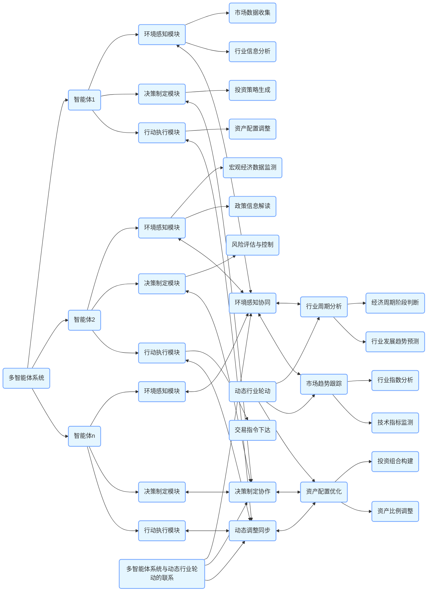

# 多智能体系统如何实现动态行业轮动

> 关键词：多智能体系统、动态行业轮动、强化学习、市场预测、资产配置

> 摘要：本文围绕多智能体系统实现动态行业轮动展开深入探讨。首先介绍了多智能体系统和动态行业轮动的背景知识，包括研究目的、适用读者群体等。接着详细阐述了核心概念，分析了多智能体系统与动态行业轮动之间的联系，并给出了原理和架构的示意图及流程图。在算法原理部分，运用Python代码解释了关键算法。通过数学模型和公式对行业轮动进行量化分析，并举例说明。结合实际项目，讲解了开发环境搭建、源代码实现及解读。探讨了多智能体系统在动态行业轮动中的实际应用场景，推荐了相关的学习资源、开发工具和论文著作。最后总结了未来发展趋势与挑战，还提供了常见问题解答和扩展阅读参考资料，旨在为读者全面深入地理解多智能体系统实现动态行业轮动提供系统的知识和实践指导。

## 1. 背景介绍 

### 1.1 目的和范围
在金融市场中，行业表现会随着宏观经济环境、政策变化、技术创新等多种因素而动态变化。动态行业轮动策略旨在通过合理配置资产，在不同行业间进行适时切换，以获取超额收益。多智能体系统是由多个自主智能体组成的系统，这些智能体能够通过相互协作、竞争和交互来完成复杂任务。本研究的目的是探索如何利用多智能体系统实现动态行业轮动，通过智能体的自主决策和交互，在金融市场中捕捉行业轮动的机会，提高资产配置的效率和收益。

研究范围涵盖了多智能体系统的基本原理、相关算法，动态行业轮动的理论基础和实际应用场景。我们将分析多智能体系统如何感知市场环境、学习行业轮动规律，并做出合理的资产配置决策。同时，会结合实际案例，验证多智能体系统在动态行业轮动中的有效性和可行性。

### 1.2 预期读者
本文预期读者包括金融领域的从业者，如投资经理、分析师等，他们可以通过了解多智能体系统在动态行业轮动中的应用，改进现有的投资策略，提高投资绩效。计算机科学和人工智能领域的研究人员和开发者也可以从本文中获得启发，将多智能体系统的技术应用到金融市场分析和决策中。此外，对金融科技和智能投资感兴趣的学生和爱好者也能通过本文学习到相关的理论知识和实践方法。

### 1.3 文档结构概述
本文首先介绍多智能体系统和动态行业轮动的背景知识，包括目的、读者群体和文档结构等。接着详细阐述核心概念，分析多智能体系统与动态行业轮动的联系，并给出原理和架构的示意图及流程图。然后讲解核心算法原理，使用Python代码进行详细说明。通过数学模型和公式对行业轮动进行量化分析，并举例说明。结合实际项目，介绍开发环境搭建、源代码实现和代码解读。探讨多智能体系统在动态行业轮动中的实际应用场景。推荐相关的学习资源、开发工具和论文著作。最后总结未来发展趋势与挑战，提供常见问题解答和扩展阅读参考资料。

### 1.4 术语表

#### 1.4.1 核心术语定义
- **多智能体系统（Multi - Agent System, MAS）**：由多个智能体组成的系统，每个智能体具有一定的自主性、智能性和交互能力，能够通过相互协作、竞争等方式完成复杂任务。
- **动态行业轮动**：根据市场环境和行业发展趋势的变化，在不同行业间动态调整资产配置，以获取更好的投资回报。
- **智能体（Agent）**：具有感知环境、决策和行动能力的个体，在多智能体系统中可以独立或与其他智能体协作完成任务。
- **强化学习（Reinforcement Learning）**：一种机器学习方法，智能体通过与环境进行交互，根据环境反馈的奖励信号来学习最优策略。

#### 1.4.2 相关概念解释
- **市场环境感知**：智能体通过收集和分析市场数据，如行业指数、宏观经济指标等，了解市场的当前状态和趋势。
- **资产配置决策**：根据市场环境感知的结果，智能体决定在不同行业间分配资产的比例，以实现投资目标。
- **智能体交互**：多个智能体之间通过信息共享、协作和竞争等方式，共同完成动态行业轮动任务。

#### 1.4.3 缩略词列表
- **MAS**：Multi - Agent System（多智能体系统）
- **RL**：Reinforcement Learning（强化学习）

## 2. 核心概念与联系 

### 2.1 多智能体系统原理
多智能体系统由多个智能体组成，每个智能体具有以下基本特征：
- **自主性**：智能体能够独立地感知环境、做出决策和执行行动，不受其他智能体的直接控制。
- **智能性**：智能体可以通过学习和推理来适应环境的变化，提高自身的决策能力。
- **交互性**：智能体之间可以进行信息交换和协作，共同完成复杂任务。

多智能体系统的工作流程通常包括以下几个步骤：
1. **感知环境**：智能体通过传感器收集环境信息，如市场数据、行业动态等。
2. **决策制定**：根据感知到的环境信息，智能体运用一定的算法和模型进行决策，确定下一步的行动。
3. **行动执行**：智能体将决策转化为具体的行动，如调整资产配置、发送信息等。
4. **反馈与学习**：智能体根据行动的结果和环境的反馈，对自身的决策和行为进行调整和优化。

### 2.2 动态行业轮动原理
动态行业轮动的核心思想是利用不同行业在不同市场环境下的表现差异，通过适时调整资产配置，实现投资收益的最大化。其基本原理基于以下几点：
- **行业周期特性**：不同行业具有不同的生命周期和发展规律，在经济周期的不同阶段，各行业的表现会有所不同。例如，在经济复苏阶段，周期性行业如钢铁、汽车等通常会率先受益；而在经济衰退阶段，防御性行业如医药、消费等则相对稳定。
- **市场趋势变化**：市场趋势的变化会影响不同行业的需求和盈利能力。例如，科技进步会推动新兴行业的发展，如人工智能、新能源等；而政策调整也会对特定行业产生重大影响，如环保政策会促进环保行业的发展。
- **资产配置优化**：通过合理配置资产，将资金投向表现较好的行业，可以提高投资组合的收益和风险调整后的回报。

### 2.3 多智能体系统与动态行业轮动的联系
多智能体系统可以为动态行业轮动提供有效的解决方案。具体联系如下：
- **环境感知**：多智能体系统中的智能体可以通过多种渠道收集市场信息，包括宏观经济数据、行业新闻、公司财报等，从而全面感知市场环境的变化。不同的智能体可以专注于不同的信息源，提高信息收集的效率和准确性。
- **决策制定**：每个智能体可以根据自身的算法和模型，对市场信息进行分析和处理，做出独立的资产配置决策。同时，智能体之间可以通过交互和协作，共享信息和经验，进一步优化决策结果。例如，一些智能体可以负责分析行业基本面，另一些智能体可以负责技术分析，通过协作可以综合考虑多种因素，提高决策的科学性。
- **动态调整**：随着市场环境的变化，多智能体系统可以实时调整资产配置策略。智能体可以根据市场反馈的信息，及时更新自己的决策模型和参数，实现动态行业轮动。例如，当某个行业的表现出现明显变化时，智能体可以迅速调整投资组合，增加或减少对该行业的投资。

### 2.4 核心概念原理和架构的文本示意图
```plaintext
多智能体系统
|-- 智能体1
|   |-- 环境感知模块
|   |   |-- 市场数据收集
|   |   |-- 行业信息分析
|   |-- 决策制定模块
|   |   |-- 投资策略生成
|   |-- 行动执行模块
|   |   |-- 资产配置调整
|-- 智能体2
|   |-- 环境感知模块
|   |   |-- 宏观经济数据监测
|   |   |-- 政策信息解读
|   |-- 决策制定模块
|   |   |-- 风险评估与控制
|   |-- 行动执行模块
|   |   |-- 交易指令下达
|-- ...
|-- 智能体交互模块
|   |-- 信息共享
|   |-- 协作与竞争

动态行业轮动
|-- 行业周期分析
|   |-- 经济周期阶段判断
|   |-- 行业发展趋势预测
|-- 市场趋势跟踪
|   |-- 行业指数分析
|   |-- 技术指标监测
|-- 资产配置优化
|   |-- 投资组合构建
|   |-- 资产比例调整

多智能体系统与动态行业轮动的联系
|-- 环境感知协同
|-- 决策制定协作
|-- 动态调整同步
```

### 2.5 Mermaid流程图


## 3. 核心算法原理 & 具体操作步骤 

### 3.1 强化学习算法在多智能体系统中的应用
强化学习是一种让智能体通过与环境进行交互，根据环境反馈的奖励信号来学习最优策略的机器学习方法。在多智能体系统实现动态行业轮动中，强化学习可以用于智能体的决策制定。

#### 3.1.1 算法原理
强化学习的基本要素包括智能体（Agent）、环境（Environment）、状态（State）、动作（Action）和奖励（Reward）。智能体在环境中感知当前状态 $s_t$，根据策略 $\pi$ 选择一个动作 $a_t$ 执行，环境会根据智能体的动作转移到下一个状态 $s_{t + 1}$，并给予智能体一个奖励 $r_t$。智能体的目标是通过不断地与环境交互，学习到一个最优策略 $\pi^*$，使得长期累积奖励最大化。

在动态行业轮动的场景中，智能体的状态可以表示为市场环境和行业信息，如行业指数、宏观经济指标等；动作可以表示为资产配置决策，如增加或减少对某个行业的投资比例；奖励可以根据投资组合的收益和风险来定义，如夏普比率等。

#### 3.1.2 Python代码实现
```python
import numpy as np

# 定义环境类
class MarketEnvironment:
    def __init__(self, num_industries):
        self.num_industries = num_industries
        self.state = np.random.rand(num_industries)  # 初始状态

    def step(self, action):
        # 根据动作更新状态
        new_state = self.state + action
        # 计算奖励，这里简单以状态的变化作为奖励
        reward = np.sum(new_state - self.state)
        self.state = new_state
        return new_state, reward

# 定义智能体类
class Agent:
    def __init__(self, num_industries):
        self.num_industries = num_industries
        self.policy = np.random.rand(num_industries)  # 初始策略

    def choose_action(self, state):
        # 根据策略选择动作
        action = self.policy * state
        return action

# 主循环
num_industries = 5
env = MarketEnvironment(num_industries)
agent = Agent(num_industries)

num_episodes = 100
for episode in range(num_episodes):
    state = env.state
    action = agent.choose_action(state)
    new_state, reward = env.step(action)
    print(f"Episode {episode}: Reward = {reward}")
```

### 3.2 具体操作步骤
#### 3.2.1 数据收集与预处理
- **数据收集**：收集市场数据，包括行业指数、宏观经济指标、公司财报等。可以从金融数据提供商、政府部门网站等渠道获取数据。
- **数据预处理**：对收集到的数据进行清洗、归一化等处理，去除噪声和异常值，确保数据的质量和一致性。

#### 3.2.2 智能体设计与训练
- **智能体设计**：根据强化学习算法，设计智能体的结构和策略。可以使用不同的神经网络架构，如多层感知机（MLP）、循环神经网络（RNN）等。
- **智能体训练**：使用历史数据对智能体进行训练，让智能体学习到最优的资产配置策略。训练过程中，不断调整智能体的策略参数，以最大化累积奖励。

#### 3.2.3 实时监测与调整
- **实时监测**：在实际应用中，实时监测市场环境的变化，及时更新智能体的状态。
- **动态调整**：根据智能体的决策，动态调整资产配置，实现动态行业轮动。

## 4. 数学模型和公式 & 详细讲解 & 举例说明 

### 4.1 强化学习中的数学模型
#### 4.1.1 马尔可夫决策过程（MDP）
马尔可夫决策过程是强化学习的基础数学模型，它可以用一个五元组 $(S, A, P, R, \gamma)$ 表示：
- $S$：状态空间，包含所有可能的状态。
- $A$：动作空间，包含所有可能的动作。
- $P(s_{t + 1}|s_t, a_t)$：状态转移概率，表示在状态 $s_t$ 执行动作 $a_t$ 后转移到状态 $s_{t + 1}$ 的概率。
- $R(s_t, a_t)$：奖励函数，表示在状态 $s_t$ 执行动作 $a_t$ 后获得的即时奖励。
- $\gamma$：折扣因子，取值范围为 $[0, 1]$，用于衡量未来奖励的重要性。

智能体的目标是找到一个最优策略 $\pi^*$，使得长期累积折扣奖励 $G_t$ 最大化：
$$G_t = \sum_{k = 0}^{\infty} \gamma^k r_{t + k}$$

#### 4.1.2 价值函数
价值函数用于评估状态或状态 - 动作对的价值。常用的价值函数包括状态价值函数 $V^{\pi}(s)$ 和动作价值函数 $Q^{\pi}(s, a)$：
- 状态价值函数 $V^{\pi}(s)$ 表示在策略 $\pi$ 下，从状态 $s$ 开始的长期累积折扣奖励的期望：
$$V^{\pi}(s) = \mathbb{E}_{\pi} [G_t | s_t = s]$$
- 动作价值函数 $Q^{\pi}(s, a)$ 表示在策略 $\pi$ 下，从状态 $s$ 执行动作 $a$ 后的长期累积折扣奖励的期望：
$$Q^{\pi}(s, a) = \mathbb{E}_{\pi} [G_t | s_t = s, a_t = a]$$

### 4.2 多智能体系统中的数学模型
在多智能体系统中，每个智能体的决策会受到其他智能体的影响。可以使用博弈论的方法来描述多智能体之间的交互。

#### 4.2.1 博弈论模型
假设多智能体系统中有 $n$ 个智能体，每个智能体 $i$ 有自己的策略空间 $\Pi_i$ 和效用函数 $u_i(\pi_1, \pi_2, \cdots, \pi_n)$，其中 $\pi_i \in \Pi_i$ 表示智能体 $i$ 的策略。博弈的目标是找到一个纳什均衡 $(\pi_1^*, \pi_2^*, \cdots, \pi_n^*)$，使得对于每个智能体 $i$，有：
$$u_i(\pi_1^*, \pi_2^*, \cdots, \pi_n^*) \geq u_i(\pi_1^*, \cdots, \pi_{i - 1}^*, \pi_i, \pi_{i + 1}^*, \cdots, \pi_n^*)$$
对于任意的 $\pi_i \in \Pi_i$ 成立。

### 4.3 举例说明
#### 4.3.1 强化学习举例
假设一个简单的动态行业轮动场景，有两个行业 $A$ 和 $B$，智能体的状态可以表示为两个行业的指数 $s = [s_A, s_B]$，动作可以表示为对两个行业的投资比例 $a = [a_A, a_B]$，其中 $a_A + a_B = 1$。奖励函数可以定义为投资组合的收益率：
$$r = a_A \frac{s_{A_{t + 1}} - s_{A_t}}{s_{A_t}} + a_B \frac{s_{B_{t + 1}} - s_{B_t}}{s_{B_t}}$$

智能体通过强化学习算法，不断调整投资比例 $a$，以最大化长期累积奖励。

#### 4.3.2 多智能体系统举例
假设有两个智能体 $Agent_1$ 和 $Agent_2$，它们都参与动态行业轮动。每个智能体有自己的策略，如 $Agent_1$ 更倾向于投资行业 $A$，$Agent_2$ 更倾向于投资行业 $B$。它们的效用函数可以根据投资组合的收益和风险来定义。通过博弈论的方法，两个智能体可以在竞争和协作中找到一个纳什均衡，实现最优的资产配置。

## 5. 项目实战：代码实际案例和详细解释说明 

### 5.1  开发环境搭建
#### 5.1.1 安装Python
首先需要安装Python环境，建议使用Python 3.7及以上版本。可以从Python官方网站（https://www.python.org/downloads/）下载安装包，按照安装向导进行安装。

#### 5.1.2 安装必要的库
在命令行中使用以下命令安装必要的库：
```bash
pip install numpy pandas matplotlib tensorflow
```
- `numpy`：用于数值计算。
- `pandas`：用于数据处理和分析。
- `matplotlib`：用于数据可视化。
- `tensorflow`：用于构建和训练神经网络。

### 5.2  源代码详细实现和代码解读
#### 5.2.1 数据加载与预处理
```python
import pandas as pd
import numpy as np

# 加载数据
data = pd.read_csv('industry_data.csv')

# 数据预处理
def preprocess_data(data):
    # 去除缺失值
    data = data.dropna()
    # 归一化处理
    for column in data.columns:
        data[column] = (data[column] - data[column].min()) / (data[column].max() - data[column].min())
    return data

processed_data = preprocess_data(data)
```
**代码解读**：首先使用 `pandas` 库的 `read_csv` 函数加载行业数据。然后定义 `preprocess_data` 函数，对数据进行预处理。去除缺失值可以保证数据的完整性，归一化处理可以将不同行业的数据缩放到相同的范围，便于后续的计算和分析。

#### 5.2.2 智能体类的实现
```python
import tensorflow as tf

class Agent:
    def __init__(self, num_industries):
        self.num_industries = num_industries
        # 构建神经网络模型
        self.model = tf.keras.Sequential([
            tf.keras.layers.Dense(64, activation='relu', input_shape=(num_industries,)),
            tf.keras.layers.Dense(32, activation='relu'),
            tf.keras.layers.Dense(num_industries, activation='softmax')
        ])
        self.model.compile(optimizer='adam', loss='mse')

    def choose_action(self, state):
        state = np.array(state).reshape(1, -1)
        action = self.model.predict(state)
        return action[0]

    def train(self, states, actions, rewards):
        states = np.array(states)
        actions = np.array(actions)
        rewards = np.array(rewards)
        target_actions = actions + 0.1 * rewards.reshape(-1, 1)
        self.model.fit(states, target_actions, epochs=10, verbose=0)
```
**代码解读**：定义了 `Agent` 类，在初始化函数中构建了一个简单的神经网络模型。该模型包含三个全连接层，输入层的维度为行业数量，输出层使用 `softmax` 激活函数，确保输出的投资比例之和为 1。`choose_action` 方法根据当前状态预测投资比例，`train` 方法根据状态、动作和奖励对模型进行训练。

#### 5.2.3 主循环实现
```python
num_industries = len(processed_data.columns)
agent = Agent(num_industries)

num_episodes = 100
states = []
actions = []
rewards = []

for episode in range(num_episodes):
    for i in range(len(processed_data) - 1):
        state = processed_data.iloc[i].values
        action = agent.choose_action(state)
        next_state = processed_data.iloc[i + 1].values
        # 计算奖励
        reward = np.dot(action, next_state - state)
        states.append(state)
        actions.append(action)
        rewards.append(reward)
    agent.train(states, actions, rewards)
    states = []
    actions = []
    rewards = []
    print(f"Episode {episode} completed.")
```
**代码解读**：在主循环中，首先初始化智能体和相关列表。然后进行多个回合的训练，每个回合中遍历数据，智能体根据当前状态选择动作，计算奖励，并将状态、动作和奖励存储在列表中。每个回合结束后，使用这些数据对智能体进行训练，并清空列表。

### 5.3  代码解读与分析
#### 5.3.1 数据处理部分
数据加载和预处理是整个项目的基础。通过去除缺失值和归一化处理，可以提高数据的质量和模型的训练效果。归一化处理可以避免不同行业数据的尺度差异对模型训练的影响。

#### 5.3.2 智能体部分
智能体使用神经网络模型来学习最优的资产配置策略。通过不断地与环境进行交互，智能体根据奖励信号调整模型的参数，以最大化长期累积奖励。`softmax` 激活函数确保输出的投资比例之和为 1，符合实际的资产配置要求。

#### 5.3.3 主循环部分
主循环模拟了智能体在市场环境中的学习过程。每个回合中，智能体根据当前状态选择动作，计算奖励，并将这些信息存储下来。回合结束后，使用这些信息对智能体进行训练，不断优化策略。这种方式可以让智能体逐渐适应市场环境的变化，实现动态行业轮动。

## 6. 实际应用场景 
### 6.1 投资组合管理
在投资组合管理中，多智能体系统可以实现动态行业轮动，帮助投资者优化资产配置。智能体可以根据市场环境的变化，实时调整投资组合中不同行业的比例，以获取更好的收益和风险控制。例如，在经济复苏阶段，增加对周期性行业的投资；在经济衰退阶段，增加对防御性行业的投资。

### 6.2 量化投资策略开发
量化投资策略需要对大量的市场数据进行分析和处理。多智能体系统可以通过分布式计算和智能决策，提高量化投资策略的效率和准确性。智能体可以根据不同的市场指标和模型，生成个性化的投资策略，并实时调整。例如，利用强化学习算法，智能体可以学习到最优的交易时机和仓位控制策略。

### 6.3 风险管理
风险管理是金融投资中的重要环节。多智能体系统可以通过对市场风险的实时监测和分析，实现动态行业轮动，降低投资组合的风险。智能体可以根据市场波动性、行业相关性等因素，调整资产配置，避免过度集中投资于某个行业。例如，当某个行业的风险指标超过阈值时，智能体可以及时减少对该行业的投资。

### 6.4 金融市场预测
多智能体系统可以通过对市场数据的学习和分析，预测不同行业的未来走势。智能体可以利用机器学习和深度学习算法，挖掘市场数据中的潜在规律和趋势。例如，通过分析宏观经济数据、行业新闻和公司财报等信息，智能体可以预测某个行业的盈利能力和发展前景，为投资者提供决策参考。

## 7. 工具和资源推荐
### 7.1 学习资源推荐
#### 7.1.1 书籍推荐
- 《多智能体系统：原理与应用》：全面介绍了多智能体系统的基本原理、算法和应用案例，适合初学者和研究人员阅读。
- 《强化学习：原理与Python实现》：详细讲解了强化学习的基本概念、算法和Python实现，对理解多智能体系统中的强化学习应用有很大帮助。
- 《金融市场技术分析》：介绍了金融市场的技术分析方法和工具，对于动态行业轮动的市场趋势分析有重要参考价值。

#### 7.1.2 在线课程
- Coursera上的“Multi - Agent Systems”课程：由知名教授授课，系统介绍了多智能体系统的理论和实践。
- edX上的“Reinforcement Learning”课程：深入讲解了强化学习的算法和应用，提供了丰富的案例和实践项目。
- 中国大学MOOC上的“金融投资学”课程：涵盖了金融投资的基本理论和方法，对理解动态行业轮动的金融背景有帮助。

#### 7.1.3 技术博客和网站
- Medium：上面有很多关于多智能体系统、强化学习和金融科技的技术博客文章，作者们分享了自己的研究成果和实践经验。
- arXiv：提供了大量的学术论文，涵盖了多智能体系统、机器学习和金融领域的最新研究成果。
- 金融界网站：提供了丰富的金融市场数据、行业新闻和分析报告，对动态行业轮动的市场研究有很大帮助。

### 7.2 开发工具框架推荐
#### 7.2.1 IDE和编辑器
- PyCharm：是一款功能强大的Python集成开发环境，提供了代码编辑、调试、版本控制等功能，适合开发多智能体系统和金融算法。
- Jupyter Notebook：是一个交互式的开发环境，支持Python代码的编写、运行和可视化，方便进行数据分析和模型训练。
- Visual Studio Code：是一款轻量级的代码编辑器，支持多种编程语言和插件，可用于快速开发和调试多智能体系统。

#### 7.2.2 调试和性能分析工具
- TensorBoard：是TensorFlow的可视化工具，可以用于监控模型的训练过程、可视化模型结构和性能指标，帮助调试和优化模型。
- Py-Spy：是一个用于Python代码性能分析的工具，可以分析代码的运行时间和内存使用情况，找出性能瓶颈。
- cProfile：是Python标准库中的性能分析工具，可以对Python程序进行详细的性能分析，帮助优化代码。

#### 7.2.3 相关框架和库
- TensorFlow：是一个开源的机器学习框架，提供了丰富的神经网络模型和工具，可用于构建和训练多智能体系统中的智能体模型。
- PyTorch：是另一个流行的深度学习框架，具有动态图机制，适合快速开发和实验多智能体系统中的算法。
- Mesa：是一个用于构建多智能体系统的Python库，提供了丰富的智能体模型和仿真工具，方便进行多智能体系统的开发和测试。

### 7.3 相关论文著作推荐
#### 7.3.1 经典论文
- “Multi - Agent Reinforcement Learning: A Critical Survey”：对多智能体强化学习的研究进行了全面的综述，分析了该领域的研究现状和挑战。
- “Markov Decision Processes: Discrete Stochastic Dynamic Programming”：介绍了马尔可夫决策过程的基本理论和算法，是强化学习领域的经典文献。
- “Efficient Market Hypothesis”：提出了有效市场假说，对金融市场的研究和投资策略的制定有重要影响。

#### 7.3.2 最新研究成果
- 关注顶级学术会议和期刊，如AAAI（Association for the Advancement of Artificial Intelligence）、IJCAI（International Joint Conference on Artificial Intelligence）、Journal of Financial Economics等，这些会议和期刊上发表了多智能体系统、强化学习和金融领域的最新研究成果。

#### 7.3.3 应用案例分析
- 可以参考一些金融机构和研究机构发布的报告和案例，了解多智能体系统在动态行业轮动中的实际应用情况和效果。例如，一些对冲基金和量化投资公司会分享他们的投资策略和实践经验。

## 8. 总结：未来发展趋势与挑战
### 8.1 未来发展趋势
#### 8.1.1 融合更多的技术
未来，多智能体系统实现动态行业轮动可能会融合更多的技术，如区块链、物联网等。区块链技术可以提供更安全、透明的交易环境，物联网技术可以提供更丰富的市场数据，从而提高多智能体系统的性能和决策的准确性。

#### 8.1.2 智能化程度不断提高
随着人工智能技术的不断发展，多智能体系统的智能化程度将不断提高。智能体可以更好地理解市场环境的变化，学习更复杂的行业轮动规律，实现更精准的资产配置决策。

#### 8.1.3 应用领域不断拓展
多智能体系统实现动态行业轮动的应用领域将不断拓展，除了金融投资领域，还可能应用于供应链管理、能源管理等领域。例如，在供应链管理中，多智能体系统可以根据市场需求和供应情况，动态调整不同产品的生产和配送策略。

### 8.2 挑战
#### 8.2.1 数据质量和安全问题
多智能体系统需要大量的市场数据来进行决策，数据的质量和安全问题至关重要。数据的不准确、不完整或泄露可能会导致智能体做出错误的决策，给投资者带来损失。因此，需要加强数据的收集、处理和保护。

#### 8.2.2 模型的可解释性
多智能体系统中的智能体模型通常是基于机器学习和深度学习算法构建的，这些模型的可解释性较差。在金融投资领域，投资者需要了解模型的决策过程和依据，以便做出合理的投资决策。因此，需要提高模型的可解释性，让投资者能够理解智能体的决策逻辑。

#### 8.2.3 市场的不确定性
金融市场具有高度的不确定性，行业轮动的规律也会随着市场环境的变化而变化。多智能体系统需要不断适应市场的变化，调整自己的策略。但是，市场的不确定性可能会导致智能体的学习和决策出现偏差，影响动态行业轮动的效果。

## 9. 附录：常见问题与解答
### 9.1 多智能体系统实现动态行业轮动需要多少计算资源？
多智能体系统实现动态行业轮动所需的计算资源取决于多个因素，如智能体的数量、模型的复杂度、数据的规模等。一般来说，使用深度学习模型的多智能体系统需要较高的计算资源，建议使用GPU进行加速计算。对于小规模的实验和研究，可以使用普通的笔记本电脑或台式机；对于大规模的应用和生产环境，可能需要使用服务器集群或云计算平台。

### 9.2 如何评估多智能体系统在动态行业轮动中的性能？
可以使用多种指标来评估多智能体系统在动态行业轮动中的性能，如投资组合的收益率、夏普比率、最大回撤等。收益率反映了投资组合的盈利情况，夏普比率衡量了投资组合的风险调整后的收益，最大回撤表示投资组合在一段时间内的最大损失。此外，还可以通过与基准指数（如沪深300指数）进行比较，评估多智能体系统的相对表现。

### 9.3 多智能体系统中的智能体之间如何进行协作？
多智能体系统中的智能体可以通过多种方式进行协作，如信息共享、联合决策等。智能体可以通过网络或通信协议交换信息，如市场数据、行业分析报告等。在联合决策方面，智能体可以根据其他智能体的意见和建议，调整自己的决策策略。例如，在资产配置决策中，智能体可以根据其他智能体对不同行业的评估结果，调整自己的投资比例。

### 9.4 多智能体系统实现动态行业轮动是否可以完全替代人类的决策？
多智能体系统实现动态行业轮动可以为投资者提供决策支持，但不能完全替代人类的决策。虽然多智能体系统可以通过学习和分析大量的数据，做出合理的决策，但市场环境是复杂多变的，还存在很多无法量化和预测的因素。人类投资者具有丰富的经验和判断力，可以综合考虑各种因素，做出更全面、更灵活的决策。因此，在实际应用中，多智能体系统和人类投资者可以相互结合，发挥各自的优势。

## 10. 扩展阅读 & 参考资料
### 10.1 扩展阅读
- 《人工智能：现代方法》：全面介绍了人工智能的基本概念、算法和应用，对理解多智能体系统的技术基础有很大帮助。
- 《金融工程学》：介绍了金融工程的基本理论和方法，包括资产定价、风险管理等，对动态行业轮动的金融原理有深入的讲解。
- 《Python数据分析实战》：通过实际案例介绍了Python在数据分析中的应用，对处理金融市场数据和进行模型训练有指导作用。

### 10.2 参考资料
- 相关学术论文和研究报告，如在IEEE Transactions on Neural Networks and Learning Systems、Journal of Artificial Intelligence Research等期刊上发表的论文。
- 金融数据提供商的网站，如Wind、Bloomberg等，提供了丰富的金融市场数据和分析工具。
- 开源代码库，如GitHub上的相关项目，可参考其中的代码实现和技术方案。