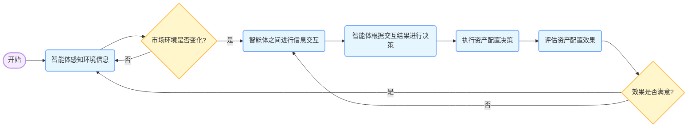

# 多智能体系统如何实现动态资产配置

> 关键词：多智能体系统、动态资产配置、智能体交互、强化学习、资产优化

> 摘要：本文聚焦于多智能体系统实现动态资产配置这一核心问题，深入探讨了多智能体系统的概念、原理及其在动态资产配置中的应用。通过对核心算法原理、数学模型和公式的详细阐述，结合实际项目案例的分析，展示了多智能体系统在动态资产配置中的具体操作和优势。同时，介绍了相关的工具和资源，探讨了未来发展趋势与挑战，旨在为相关领域的研究者和从业者提供全面且深入的参考。

## 1. 背景介绍 
### 1.1 目的和范围
在当今复杂多变的金融市场环境下，资产配置的动态性和智能化需求日益凸显。传统的资产配置方法往往难以适应市场的快速变化和不确定性，而多智能体系统以其分布式、自适应和智能交互的特点，为实现动态资产配置提供了新的思路和方法。本文的目的在于深入研究多智能体系统如何实现动态资产配置，涵盖了多智能体系统的基本原理、核心算法、数学模型以及实际应用等多个方面，旨在为读者全面呈现多智能体系统在动态资产配置中的应用机制和实践方法。

### 1.2 预期读者
本文预期读者包括金融领域的从业者，如投资经理、资产分析师等，他们希望通过引入多智能体系统提升资产配置的效率和效果；计算机科学领域的研究者和开发者，对多智能体系统的算法和应用感兴趣；以及相关专业的学生，希望深入了解多智能体系统和动态资产配置的相关知识。

### 1.3 文档结构概述
本文首先介绍多智能体系统和动态资产配置的背景知识，包括术语定义和相关概念解释。接着阐述多智能体系统的核心概念与联系，通过文本示意图和 Mermaid 流程图展示其架构。然后详细讲解核心算法原理和具体操作步骤，并给出 Python 源代码示例。之后介绍数学模型和公式，通过举例说明其应用。再通过项目实战，展示代码实际案例和详细解释。随后探讨多智能体系统在动态资产配置中的实际应用场景。接着推荐相关的工具和资源，包括学习资源、开发工具框架和论文著作。最后总结未来发展趋势与挑战，并提供常见问题与解答以及扩展阅读和参考资料。

### 1.4 术语表
#### 1.4.1 核心术语定义
- **多智能体系统（Multi - Agent System, MAS）**：由多个智能体组成的系统，每个智能体具有一定的自治能力、感知能力和决策能力，能够通过与其他智能体和环境的交互来实现系统的整体目标。
- **动态资产配置（Dynamic Asset Allocation）**：根据市场环境、投资者目标和风险偏好等因素的变化，实时调整资产组合中各类资产的比例，以实现资产的最优配置和收益最大化。
- **智能体（Agent）**：具有一定的自主性、反应性、社会性和能动性的实体，能够感知环境信息，进行决策并采取行动。
- **强化学习（Reinforcement Learning）**：一种机器学习方法，智能体通过与环境进行交互，根据环境反馈的奖励信号来学习最优策略，以最大化长期累积奖励。

#### 1.4.2 相关概念解释
- **分布式决策**：在多智能体系统中，每个智能体根据自身的局部信息和与其他智能体的交互进行决策，而不是由一个中央控制器进行统一决策。
- **资产组合优化**：通过合理选择资产种类和分配资产比例，在满足一定风险约束的前提下，使资产组合的预期收益最大化。
- **环境感知**：智能体通过各种传感器或信息渠道获取环境中的相关信息，如市场价格、经济数据等。

#### 1.4.3 缩略词列表
- **MAS**：Multi - Agent System（多智能体系统）
- **RL**：Reinforcement Learning（强化学习）
- **MDP**：Markov Decision Process（马尔可夫决策过程）

## 2. 核心概念与联系 
### 2.1 多智能体系统的基本概念
多智能体系统是一个由多个智能体组成的分布式系统。每个智能体具有独立的决策能力和行为能力，它们通过与其他智能体和环境进行交互来实现系统的整体目标。智能体可以是软件程序、机器人或其他具有智能行为的实体。在多智能体系统中，智能体之间的交互可以是合作、竞争或混合的关系，通过这种交互，系统能够适应环境的变化并实现复杂的任务。

### 2.2 动态资产配置的概念
动态资产配置是一种根据市场环境和投资者需求的变化，实时调整资产组合的投资策略。与传统的静态资产配置方法不同，动态资产配置能够更好地适应市场的不确定性和波动性，提高资产的收益率和风险管理能力。动态资产配置需要考虑多种因素，如市场趋势、宏观经济数据、投资者的风险偏好等。

### 2.3 多智能体系统与动态资产配置的联系
多智能体系统为动态资产配置提供了一种有效的实现方式。在动态资产配置中，可以将每个资产看作一个智能体，或者将不同的投资策略看作智能体。这些智能体通过感知市场环境信息，与其他智能体进行交互和协商，根据一定的决策规则来调整资产的配置比例。多智能体系统的分布式决策和自适应能力能够更好地应对市场的变化，实现动态资产配置的目标。

### 2.4 核心概念原理和架构的文本示意图
多智能体系统实现动态资产配置的架构主要包括以下几个部分：
- **智能体层**：由多个智能体组成，每个智能体代表一个资产或投资策略，具有感知、决策和行动的能力。
- **通信层**：负责智能体之间的信息传递和交互，确保智能体能够共享市场信息和决策结果。
- **环境层**：包括市场环境、宏观经济环境等，智能体通过感知环境信息来进行决策。
- **决策层**：根据智能体的感知信息和交互结果，制定资产配置决策，调整资产组合的比例。

### 2.5 Mermaid 流程图


## 3. 核心算法原理 & 具体操作步骤 
### 3.1 强化学习算法在多智能体系统中的应用
强化学习是一种适用于多智能体系统实现动态资产配置的有效算法。在强化学习中，智能体通过与环境进行交互，根据环境反馈的奖励信号来学习最优策略。在动态资产配置中，智能体的目标是最大化资产的长期累积收益，奖励信号可以定义为资产的收益率或风险调整后的收益率。

### 3.2 基于 Q - learning 的多智能体动态资产配置算法
Q - learning 是一种经典的强化学习算法，其核心思想是通过学习一个动作价值函数 $Q(s, a)$ 来确定在状态 $s$ 下采取动作 $a$ 的价值。在多智能体动态资产配置中，每个智能体都有自己的 $Q$ 表，用于存储不同状态和动作的价值。

#### 3.2.1 算法原理
- **状态表示**：状态 $s$ 可以表示为市场环境信息、资产组合的当前状态等。例如，市场价格、经济数据、资产的持有比例等。
- **动作选择**：动作 $a$ 表示智能体可以采取的资产配置决策，如买入、卖出或持有某种资产。
- **奖励函数**：奖励 $r$ 是智能体采取动作后环境反馈的信号，用于衡量动作的好坏。在动态资产配置中，奖励可以定义为资产的收益率或风险调整后的收益率。
- **Q - 值更新**：智能体根据环境反馈的奖励和下一个状态的最大 $Q$ 值来更新当前状态和动作的 $Q$ 值，更新公式为：
$Q(s, a) \leftarrow Q(s, a) + \alpha [r + \gamma \max_{a'} Q(s', a') - Q(s, a)]$
其中，$\alpha$ 是学习率，$\gamma$ 是折扣因子。

#### 3.2.2 具体操作步骤
1. **初始化**：初始化每个智能体的 $Q$ 表，设置学习率 $\alpha$、折扣因子 $\gamma$ 和探索率 $\epsilon$。
2. **环境感知**：智能体感知当前的市场环境信息，确定当前的状态 $s$。
3. **动作选择**：根据当前状态 $s$ 和 $Q$ 表，选择一个动作 $a$。可以使用 $\epsilon$ - 贪心策略，以 $\epsilon$ 的概率随机选择一个动作，以 $1 - \epsilon$ 的概率选择 $Q$ 值最大的动作。
4. **执行动作**：智能体执行选择的动作，更新资产组合的状态。
5. **环境反馈**：环境根据智能体的动作反馈奖励 $r$ 和下一个状态 $s'$。
6. **Q - 值更新**：智能体根据奖励 $r$ 和下一个状态 $s'$ 的最大 $Q$ 值更新当前状态和动作的 $Q$ 值。
7. **重复步骤 2 - 6**：直到达到终止条件，如达到最大迭代次数或资产配置效果满足要求。

### 3.3 Python 源代码实现
```python
import numpy as np

# 定义智能体类
class Agent:
    def __init__(self, num_states, num_actions, alpha=0.1, gamma=0.9, epsilon=0.1):
        self.num_states = num_states
        self.num_actions = num_actions
        self.alpha = alpha
        self.gamma = gamma
        self.epsilon = epsilon
        self.Q = np.zeros((num_states, num_actions))

    def choose_action(self, state):
        if np.random.uniform(0, 1) < self.epsilon:
            action = np.random.choice(self.num_actions)
        else:
            action = np.argmax(self.Q[state, :])
        return action

    def update_Q(self, state, action, reward, next_state):
        max_Q_next = np.max(self.Q[next_state, :])
        self.Q[state, action] += self.alpha * (reward + self.gamma * max_Q_next - self.Q[state, action])


# 定义环境类
class Environment:
    def __init__(self):
        # 初始化环境参数
        pass

    def step(self, action):
        # 执行动作，返回奖励和下一个状态
        reward = np.random.uniform(-1, 1)
        next_state = np.random.randint(0, 10)
        return reward, next_state


# 主函数
if __name__ == "__main__":
    num_states = 10
    num_actions = 3
    agent = Agent(num_states, num_actions)
    env = Environment()
    num_episodes = 1000

    for episode in range(num_episodes):
        state = np.random.randint(0, num_states)
        total_reward = 0
        done = False

        while not done:
            action = agent.choose_action(state)
            reward, next_state = env.step(action)
            agent.update_Q(state, action, reward, next_state)
            total_reward += reward
            state = next_state

            # 终止条件判断
            if episode > num_episodes - 1:
                done = True

        print(f"Episode {episode}: Total Reward = {total_reward}")
```

### 3.4 代码解释
- **Agent 类**：表示智能体，包含 $Q$ 表的初始化、动作选择和 $Q$ 值更新的方法。
- **Environment 类**：表示环境，包含执行动作并返回奖励和下一个状态的方法。
- **主函数**：创建智能体和环境对象，进行多轮训练，每轮训练中智能体与环境进行交互，更新 $Q$ 值并记录总奖励。

## 4. 数学模型和公式 & 详细讲解 & 举例说明 
### 4.1 马尔可夫决策过程（MDP）模型
马尔可夫决策过程是强化学习的理论基础，用于描述智能体与环境的交互过程。一个马尔可夫决策过程可以用一个五元组 $(S, A, P, R, \gamma)$ 表示：
- $S$：状态空间，表示环境可能处于的所有状态的集合。
- $A$：动作空间，表示智能体可以采取的所有动作的集合。
- $P$：状态转移概率函数，表示在状态 $s$ 下采取动作 $a$ 转移到状态 $s'$ 的概率，即 $P(s'|s, a)$。
- $R$：奖励函数，表示在状态 $s$ 下采取动作 $a$ 转移到状态 $s'$ 时获得的奖励，即 $R(s, a, s')$。
- $\gamma$：折扣因子，用于衡量未来奖励的重要性，取值范围为 $[0, 1]$。

### 4.2 动作价值函数和状态价值函数
- **动作价值函数 $Q(s, a)$**：表示在状态 $s$ 下采取动作 $a$ 后，遵循某个策略 $\pi$ 所能获得的长期累积奖励的期望，定义为：
$Q^{\pi}(s, a) = \mathbb{E}_{\pi} \left[ \sum_{t = 0}^{\infty} \gamma^t r_{t + 1} | s_0 = s, a_0 = a \right]$
其中，$r_{t + 1}$ 是在时间步 $t + 1$ 获得的奖励。

- **状态价值函数 $V(s)$**：表示在状态 $s$ 下，遵循某个策略 $\pi$ 所能获得的长期累积奖励的期望，定义为：
$V^{\pi}(s) = \mathbb{E}_{\pi} \left[ \sum_{t = 0}^{\infty} \gamma^t r_{t + 1} | s_0 = s \right]$

### 4.3 Q - learning 算法的收敛性证明
Q - learning 算法的收敛性可以通过证明其满足贝尔曼最优性方程来证明。贝尔曼最优性方程表示为：
$Q^*(s, a) = \mathbb{E} \left[ r + \gamma \max_{a'} Q^*(s', a') | s, a \right]$
其中，$Q^*(s, a)$ 是最优动作价值函数。

Q - learning 算法的更新公式：
$Q(s, a) \leftarrow Q(s, a) + \alpha [r + \gamma \max_{a'} Q(s', a') - Q(s, a)]$
可以看作是对贝尔曼最优性方程的迭代逼近。当学习率 $\alpha$ 满足一定条件时，$Q$ 表将收敛到最优动作价值函数 $Q^*(s, a)$。

### 4.4 举例说明
假设一个简单的动态资产配置问题，状态空间 $S = \{s_1, s_2\}$，动作空间 $A = \{a_1, a_2\}$。状态转移概率函数和奖励函数如下：
- $P(s_1|s_1, a_1) = 0.8, P(s_2|s_1, a_1) = 0.2$
- $P(s_1|s_1, a_2) = 0.3, P(s_2|s_1, a_2) = 0.7$
- $R(s_1, a_1, s_1) = 1, R(s_1, a_1, s_2) = -1$
- $R(s_1, a_2, s_1) = 2, R(s_1, a_2, s_2) = -2$

初始时，$Q(s_1, a_1) = 0, Q(s_1, a_2) = 0$。学习率 $\alpha = 0.1$，折扣因子 $\gamma = 0.9$。

假设智能体在状态 $s_1$ 下选择动作 $a_1$，转移到状态 $s_1$ 并获得奖励 $r = 1$。根据 Q - learning 更新公式：
$Q(s_1, a_1) \leftarrow Q(s_1, a_1) + 0.1 [1 + 0.9 \max_{a'} Q(s_1, a') - Q(s_1, a_1)]$
$= 0 + 0.1 [1 + 0.9 \times 0 - 0]$
$= 0.1$

通过不断迭代更新，$Q$ 表将逐渐收敛到最优动作价值函数。

## 5. 项目实战：代码实际案例和详细解释说明 
### 5.1  开发环境搭建
#### 5.1.1 操作系统
本项目可以在 Windows、Linux 或 macOS 等常见操作系统上进行开发。建议使用 Linux 系统，如 Ubuntu 18.04 及以上版本，因为 Linux 系统在开发和部署方面具有较好的稳定性和兼容性。

#### 5.1.2 Python 环境
使用 Python 3.6 及以上版本进行开发。可以通过 Anaconda 或 Miniconda 来管理 Python 环境，以下是使用 Miniconda 创建虚拟环境的步骤：
1. 下载并安装 Miniconda：从 Miniconda 官方网站（https://docs.conda.io/en/latest/miniconda.html） 下载适合自己操作系统的安装包，按照提示进行安装。
2. 创建虚拟环境：打开终端或命令提示符，执行以下命令创建一个名为 `mas_asset_allocation` 的虚拟环境：
```bash
conda create -n mas_asset_allocation python=3.8
```
3. 激活虚拟环境：
```bash
conda activate mas_asset_allocation
```

#### 5.1.3 安装依赖库
在激活的虚拟环境中，使用 `pip` 安装项目所需的依赖库，主要包括 `numpy`、`pandas`、`matplotlib` 等：
```bash
pip install numpy pandas matplotlib
```

### 5.2  源代码详细实现和代码解读
#### 5.2.1 数据准备
首先，我们需要准备市场数据，这里假设我们有一个包含多种资产价格的数据集。以下是一个简单的数据加载和预处理的代码示例：
```python
import pandas as pd

def load_data(file_path):
    data = pd.read_csv(file_path)
    # 数据预处理，如缺失值处理、标准化等
    data = data.dropna()
    return data

# 示例数据加载
file_path = 'asset_prices.csv'
data = load_data(file_path)
```
代码解释：
- `load_data` 函数用于加载 CSV 格式的市场数据文件。
- 使用 `pandas` 库的 `read_csv` 函数读取数据。
- `dropna` 方法用于删除包含缺失值的行。

#### 5.2.2 智能体类实现
```python
import numpy as np

class Agent:
    def __init__(self, num_states, num_actions, alpha=0.1, gamma=0.9, epsilon=0.1):
        self.num_states = num_states
        self.num_actions = num_actions
        self.alpha = alpha
        self.gamma = gamma
        self.epsilon = epsilon
        self.Q = np.zeros((num_states, num_actions))

    def choose_action(self, state):
        if np.random.uniform(0, 1) < self.epsilon:
            action = np.random.choice(self.num_actions)
        else:
            action = np.argmax(self.Q[state, :])
        return action

    def update_Q(self, state, action, reward, next_state):
        max_Q_next = np.max(self.Q[next_state, :])
        self.Q[state, action] += self.alpha * (reward + self.gamma * max_Q_next - self.Q[state, action])
```
代码解释：
- `Agent` 类表示智能体，包含 $Q$ 表的初始化、动作选择和 $Q$ 值更新的方法。
- `__init__` 方法初始化智能体的参数和 $Q$ 表。
- `choose_action` 方法根据 $\epsilon$ - 贪心策略选择动作。
- `update_Q` 方法根据 Q - learning 更新公式更新 $Q$ 值。

#### 5.2.3 环境类实现
```python
class Environment:
    def __init__(self, data):
        self.data = data
        self.current_step = 0
        self.num_steps = len(data)

    def step(self, action):
        # 执行动作，计算奖励
        current_price = self.data.iloc[self.current_step]
        next_price = self.data.iloc[self.current_step + 1]
        if action == 0:  # 买入
            reward = next_price - current_price
        elif action == 1:  # 卖出
            reward = current_price - next_price
        else:  # 持有
            reward = 0

        self.current_step += 1
        if self.current_step >= self.num_steps - 1:
            done = True
        else:
            done = False

        next_state = self.current_step
        return reward, next_state, done
```
代码解释：
- `Environment` 类表示环境，包含执行动作并返回奖励、下一个状态和终止标志的方法。
- `__init__` 方法初始化环境的参数，包括市场数据和当前时间步。
- `step` 方法根据智能体的动作计算奖励，更新当前时间步，并判断是否达到终止条件。

#### 5.2.4 主函数实现
```python
if __name__ == "__main__":
    num_states = len(data)
    num_actions = 3
    agent = Agent(num_states, num_actions)
    env = Environment(data)
    num_episodes = 100

    for episode in range(num_episodes):
        state = 0
        total_reward = 0
        done = False

        while not done:
            action = agent.choose_action(state)
            reward, next_state, done = env.step(action)
            agent.update_Q(state, action, reward, next_state)
            total_reward += reward
            state = next_state

        print(f"Episode {episode}: Total Reward = {total_reward}")
```
代码解释：
- 主函数创建智能体和环境对象，进行多轮训练。
- 每轮训练中，智能体与环境进行交互，更新 $Q$ 值并记录总奖励。
- 训练结束后，打印每轮的总奖励。

### 5.3  代码解读与分析
#### 5.3.1 代码整体逻辑
整个代码的逻辑是智能体在环境中进行多轮训练，每轮训练中智能体根据当前状态选择动作，环境根据动作返回奖励和下一个状态，智能体根据奖励和下一个状态更新 $Q$ 值，直到达到终止条件。

#### 5.3.2 性能分析
- **时间复杂度**：主要取决于训练的轮数和每轮中智能体与环境的交互次数，时间复杂度为 $O(num\_episodes \times num\_steps)$。
- **空间复杂度**：主要取决于 $Q$ 表的大小，空间复杂度为 $O(num\_states \times num\_actions)$。

#### 5.3.3 优化建议
- **探索策略优化**：可以采用更复杂的探索策略，如 Boltzmann 探索，来平衡探索和利用。
- **奖励函数优化**：设计更合理的奖励函数，考虑资产的风险和收益等因素。
- **并行计算**：使用并行计算技术加速训练过程，提高训练效率。

## 6. 实际应用场景 
### 6.1 金融投资领域
在金融投资领域，多智能体系统实现的动态资产配置可以帮助投资者根据市场的变化实时调整资产组合。例如，在股票市场中，智能体可以根据股票的价格走势、公司的财务状况等信息，动态调整股票的持仓比例。在基金投资中，智能体可以根据基金的业绩表现、风险水平等因素，选择最优的基金组合。

### 6.2 风险管理领域
多智能体系统可以用于风险管理，通过动态资产配置降低投资组合的风险。例如，在市场波动较大时，智能体可以增加债券等低风险资产的比例，减少股票等高风险资产的比例。在面临系统性风险时，智能体可以及时调整资产配置，降低损失。

### 6.3 量化投资领域
量化投资是利用数学模型和计算机技术进行投资决策的一种方法。多智能体系统实现的动态资产配置可以作为量化投资策略的一部分，通过智能体的交互和学习，不断优化资产配置策略，提高投资收益。

### 6.4 养老基金管理领域
养老基金的管理需要考虑长期的资产保值和增值。多智能体系统可以根据养老基金的负债情况、投资目标和市场环境等因素，动态调整资产配置，确保养老基金的安全性和收益性。

## 7. 工具和资源推荐
### 7.1 学习资源推荐
#### 7.1.1 书籍推荐
- 《多智能体系统：原理与编程》：本书全面介绍了多智能体系统的基本原理、算法和编程实现，是学习多智能体系统的经典教材。
- 《强化学习：原理与Python实现》：详细讲解了强化学习的基本概念、算法和应用，通过 Python 代码示例帮助读者理解和实践强化学习。
- 《金融市场的数学模型》：介绍了金融市场的基本数学模型和分析方法，对于理解动态资产配置的数学原理有很大帮助。

#### 7.1.2 在线课程
- Coursera 上的“Multi - Agent Systems”课程：由知名高校的教授授课，系统讲解多智能体系统的理论和实践。
- edX 上的“Reinforcement Learning”课程：深入介绍强化学习的算法和应用，提供丰富的案例和实践项目。
- 中国大学 MOOC 上的“金融工程学”课程：介绍金融工程的基本原理和方法，包括资产配置、风险管理等内容。

#### 7.1.3 技术博客和网站
- Medium 上的“Multi - Agent Systems”专栏：汇集了多智能体系统领域的最新研究成果和实践经验。
- arXiv 网站：提供了大量的学术论文，涵盖了多智能体系统、强化学习、金融工程等领域的最新研究进展。
- 知乎上的“多智能体系统”和“动态资产配置”话题：可以了解到行业内的讨论和最新动态。

### 7.2 开发工具框架推荐
#### 7.2.1 IDE和编辑器
- PyCharm：一款专业的 Python 集成开发环境，提供代码编辑、调试、版本控制等功能，适合开发多智能体系统和动态资产配置相关的 Python 代码。
- Visual Studio Code：一款轻量级的代码编辑器，支持多种编程语言和插件，具有丰富的扩展功能，方便进行代码开发和调试。

#### 7.2.2 调试和性能分析工具
- PDB：Python 自带的调试工具，可以帮助开发者定位代码中的问题和错误。
- cProfile：Python 标准库中的性能分析工具，可以分析代码的运行时间和函数调用情况，帮助优化代码性能。

#### 7.2.3 相关框架和库
- Mesa：一个用于构建多智能体系统的 Python 框架，提供了丰富的智能体和环境类，方便快速开发多智能体系统。
- Stable - Baselines3：一个用于强化学习的 Python 库，提供了多种强化学习算法的实现，方便进行强化学习实验和应用开发。
- Pandas：一个用于数据处理和分析的 Python 库，在动态资产配置中可以用于数据加载、预处理和分析。

### 7.3 相关论文著作推荐
#### 7.3.1 经典论文
- “Multi - Agent Systems: A Modern Approach to Distributed Artificial Intelligence”：介绍了多智能体系统的基本概念、理论和应用，是多智能体系统领域的经典论文。
- “Q - learning”：首次提出了 Q - learning 算法，是强化学习领域的经典论文。
- “Markowitz Portfolio Selection”：提出了现代投资组合理论，为资产配置提供了理论基础。

#### 7.3.2 最新研究成果
- 关注顶级学术会议和期刊，如 AAAI、IJCAI、Journal of Artificial Intelligence Research、Journal of Financial Economics 等，获取多智能体系统、强化学习和金融工程领域的最新研究成果。

#### 7.3.3 应用案例分析
- 一些知名金融机构和研究机构会发布关于动态资产配置的应用案例分析报告，可以参考这些报告了解多智能体系统在实际应用中的效果和经验。

## 8. 总结：未来发展趋势与挑战
### 8.1 未来发展趋势
#### 8.1.1 与其他技术的融合
多智能体系统将与区块链、物联网、大数据等技术深度融合。例如，区块链技术可以提供安全可靠的智能体交互环境，物联网技术可以提供更丰富的环境感知信息，大数据技术可以为智能体的决策提供更全面的数据分析支持。

#### 8.1.2 智能化和自适应能力的提升
未来的多智能体系统将具有更强的智能化和自适应能力，能够更好地应对复杂多变的市场环境。智能体将能够自动学习和调整决策策略，实现更高效的动态资产配置。

#### 8.1.3 应用领域的拓展
多智能体系统实现的动态资产配置将不仅应用于金融领域，还将拓展到其他领域，如能源管理、供应链管理等。在能源管理中，智能体可以根据能源需求和供应情况，动态调整能源的分配和存储；在供应链管理中，智能体可以根据市场需求和库存情况，动态调整生产和配送计划。

### 8.2 挑战
#### 8.2.1 智能体的建模和设计
如何准确地建模和设计智能体的行为和决策机制是一个挑战。智能体需要考虑多种因素，如市场环境、投资者偏好、风险约束等，并且需要在不同的场景下做出合理的决策。

#### 8.2.2 智能体之间的协调和通信
在多智能体系统中，智能体之间的协调和通信是一个关键问题。智能体需要通过有效的通信机制共享信息和协调行动，避免冲突和重复决策。

#### 8.2.3 数据质量和安全
动态资产配置需要大量的市场数据和投资者信息，数据的质量和安全至关重要。如何确保数据的准确性、完整性和安全性，以及如何防止数据泄露和恶意攻击是需要解决的问题。

#### 8.2.4 算法的可解释性和可靠性
强化学习等算法在多智能体系统中得到广泛应用，但这些算法的可解释性和可靠性是一个挑战。在实际应用中，需要能够解释智能体的决策过程和结果，并且确保算法的可靠性和稳定性。

## 9. 附录：常见问题与解答
### 9.1 多智能体系统和传统资产配置方法有什么区别？
传统资产配置方法通常基于静态的模型和假设，难以适应市场的快速变化和不确定性。多智能体系统具有分布式、自适应和智能交互的特点，能够实时感知市场环境的变化，通过智能体之间的交互和协商，动态调整资产配置策略，提高资产配置的效率和效果。

### 9.2 强化学习算法在多智能体系统中的收敛性如何保证？
强化学习算法的收敛性可以通过选择合适的学习率、折扣因子和探索策略来保证。例如，在 Q - learning 算法中，学习率 $\alpha$ 需要满足一定的衰减条件，折扣因子 $\gamma$ 需要在合适的范围内取值，探索策略可以采用 $\epsilon$ - 贪心策略或 Boltzmann 探索策略。

### 9.3 如何评估多智能体系统实现的动态资产配置的效果？
可以从多个方面评估动态资产配置的效果，如资产的收益率、风险调整后的收益率、夏普比率等。同时，还可以通过回测和模拟实验，比较不同资产配置策略的表现，评估多智能体系统的性能。

### 9.4 多智能体系统在实际应用中面临哪些困难？
多智能体系统在实际应用中面临的困难包括智能体的建模和设计、智能体之间的协调和通信、数据质量和安全、算法的可解释性和可靠性等。需要通过不断的研究和实践，解决这些问题，提高多智能体系统的实用性和可靠性。

## 10. 扩展阅读 & 参考资料
### 10.1 扩展阅读
- 《复杂系统理论与应用》：深入介绍复杂系统的基本概念、理论和方法，对于理解多智能体系统的复杂性和适应性有很大帮助。
- 《人工智能：一种现代方法》：全面介绍人工智能的基本概念、算法和应用，包括多智能体系统、强化学习等内容。
- 《金融科技前沿与趋势》：关注金融科技领域的最新发展趋势和应用案例，了解多智能体系统在金融科技中的应用前景。

### 10.2 参考资料
- 多智能体系统相关的学术论文和研究报告。
- 金融市场数据和分析工具，如 Bloomberg、Wind 等。
- 开源的多智能体系统和强化学习框架的官方文档和代码库。