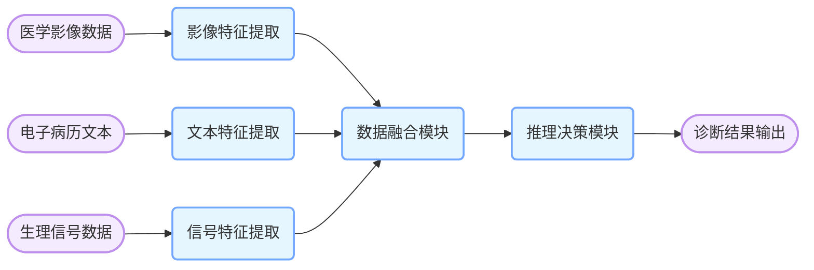

# 多模态融合推理在智能医疗诊断中的精准应用研究

> 关键词：多模态融合推理、智能医疗诊断、精准应用、医疗数据、深度学习

> 摘要：本文聚焦于多模态融合推理在智能医疗诊断中的精准应用。首先介绍了多模态融合推理在医疗领域的研究背景，包括目的、预期读者、文档结构和相关术语。接着阐述了多模态融合推理的核心概念与联系，通过文本示意图和 Mermaid 流程图进行说明。详细讲解了核心算法原理及具体操作步骤，并用 Python 代码进行阐述。同时给出了相关的数学模型和公式，并举例说明。通过项目实战展示了代码实际案例及详细解释。分析了多模态融合推理在智能医疗诊断中的实际应用场景，推荐了相关的学习资源、开发工具框架和论文著作。最后总结了未来发展趋势与挑战，解答了常见问题，并提供了扩展阅读和参考资料，旨在为推动多模态融合推理在智能医疗诊断中的精准应用提供全面的理论和实践指导。

## 1. 背景介绍 
### 1.1 目的和范围
随着医疗技术的不断发展，医疗数据呈现出多样化和复杂化的特点。单一模态的数据（如影像、文本、生理信号等）在智能医疗诊断中存在一定的局限性，难以全面准确地反映患者的病情。多模态融合推理旨在整合多种不同类型的医疗数据，充分发挥各模态数据的优势，实现更精准的医疗诊断。

本研究的范围主要涵盖多模态融合推理在智能医疗诊断中的核心概念、算法原理、数学模型、实际应用案例等方面，致力于为医疗领域的研究人员、医生和技术开发者提供全面且深入的技术参考。

### 1.2 预期读者
- **医疗研究人员**：希望通过多模态融合推理技术深入挖掘医疗数据的潜在价值，推动医学研究的发展。
- **临床医生**：借助多模态融合推理的精准诊断结果，为患者制定更科学、有效的治疗方案。
- **技术开发者**：了解多模态融合推理的技术原理和实现方法，开发相关的智能医疗诊断系统。
- **医疗行业管理人员**：把握多模态融合推理在智能医疗诊断中的应用趋势，制定合理的发展战略。

### 1.3 文档结构概述
本文将按照以下结构进行阐述：
- 核心概念与联系：介绍多模态融合推理的基本概念、原理和架构，通过文本示意图和 Mermaid 流程图进行可视化展示。
- 核心算法原理 & 具体操作步骤：详细讲解多模态融合推理的核心算法，并用 Python 代码进行实现和解释。
- 数学模型和公式 & 详细讲解 & 举例说明：给出多模态融合推理的数学模型和公式，通过具体例子进行详细讲解。
- 项目实战：通过实际项目案例，展示多模态融合推理在智能医疗诊断中的代码实现和应用效果。
- 实际应用场景：分析多模态融合推理在智能医疗诊断中的常见应用场景。
- 工具和资源推荐：推荐相关的学习资源、开发工具框架和论文著作。
- 总结：总结多模态融合推理在智能医疗诊断中的未来发展趋势与挑战。
- 附录：解答常见问题。
- 扩展阅读 & 参考资料：提供相关的扩展阅读和参考资料。

### 1.4 术语表
#### 1.4.1 核心术语定义
- **多模态数据**：指来自不同数据源、具有不同表现形式的数据，如医学影像（X光、CT、MRI 等）、电子病历文本、生理信号（心电图、脑电图等）。
- **多模态融合推理**：将多种不同模态的数据进行整合和分析，通过推理算法得出更准确、全面的诊断结果。
- **智能医疗诊断**：利用人工智能技术辅助医生进行疾病诊断，提高诊断的准确性和效率。

#### 1.4.2 相关概念解释
- **特征提取**：从原始多模态数据中提取具有代表性的特征，以便后续的融合和分析。
- **数据融合**：将不同模态的数据特征进行整合，形成统一的特征表示。
- **推理算法**：根据融合后的特征进行推理，得出疾病诊断结果。

#### 1.4.3 缩略词列表
- **CT**：Computed Tomography，计算机断层扫描
- **MRI**：Magnetic Resonance Imaging，磁共振成像
- **ECG**：Electrocardiogram，心电图
- **EEG**：Electroencephalogram，脑电图

## 2. 核心概念与联系 

### 核心概念原理
多模态融合推理的核心原理是将不同模态的医疗数据进行有机整合，充分发挥各模态数据的优势，以提高疾病诊断的准确性和可靠性。具体来说，多模态融合推理主要包括以下几个步骤：

1. **数据采集**：从不同的数据源采集多模态医疗数据，如医学影像设备、电子病历系统、生理信号监测设备等。
2. **特征提取**：对采集到的多模态数据进行预处理，提取具有代表性的特征。不同模态的数据具有不同的特征提取方法，例如，对于医学影像数据，可以使用卷积神经网络（CNN）提取图像特征；对于电子病历文本数据，可以使用自然语言处理（NLP）技术提取文本特征。
3. **数据融合**：将提取的不同模态的特征进行融合，形成统一的特征表示。数据融合的方法有很多种，常见的有早期融合、晚期融合和中间融合。
4. **推理决策**：根据融合后的特征，使用推理算法进行疾病诊断和决策。推理算法可以是基于机器学习的分类算法，如支持向量机（SVM）、随机森林（RF）等，也可以是基于深度学习的神经网络，如多层感知机（MLP）、循环神经网络（RNN）等。

### 架构的文本示意图
多模态融合推理在智能医疗诊断中的架构可以用以下文本示意图表示：

```plaintext
+-------------------+         +-------------------+         +-------------------+
|   医学影像数据   |         |   电子病历文本   |         |   生理信号数据   |
+-------------------+         +-------------------+         +-------------------+
         |                           |                           |
         |                           |                           |
         v                           v                           v
+-------------------+         +-------------------+         +-------------------+
|   影像特征提取   |         |   文本特征提取   |         |   信号特征提取   |
+-------------------+         +-------------------+         +-------------------+
         |                           |                           |
         |                           |                           |
         v                           v                           v
+---------------------------------------------------------------+
|                      数据融合模块                             |
+---------------------------------------------------------------+
                         |
                         |
                         v
+-------------------+
|   推理决策模块   |
+-------------------+
                         |
                         |
                         v
+-------------------+
|   诊断结果输出   |
+-------------------+
```

### Mermaid 流程图


## 3. 核心算法原理 & 具体操作步骤 

### 核心算法原理
多模态融合推理的核心算法主要包括特征提取算法、数据融合算法和推理决策算法。下面分别介绍这些算法的原理。

#### 特征提取算法
- **卷积神经网络（CNN）**：适用于医学影像数据的特征提取。CNN 通过卷积层、池化层和全连接层对图像进行特征提取和分类。卷积层通过卷积核在图像上滑动，提取图像的局部特征；池化层用于降低特征图的维度，减少计算量；全连接层将提取的特征进行分类。
- **自然语言处理（NLP）技术**：适用于电子病历文本数据的特征提取。常见的 NLP 技术包括词嵌入、文本分类和命名实体识别等。词嵌入将文本中的词语转换为向量表示，以便计算机进行处理；文本分类用于对文本进行分类，如疾病诊断、治疗方案等；命名实体识别用于识别文本中的实体，如疾病名称、药物名称等。
- **信号处理算法**：适用于生理信号数据的特征提取。常见的信号处理算法包括时域分析、频域分析和时频分析等。时域分析主要分析信号的时域特征，如均值、方差、峰值等；频域分析主要分析信号的频域特征，如频谱、功率谱等；时频分析结合了时域和频域的信息，如小波变换、短时傅里叶变换等。

#### 数据融合算法
- **早期融合**：在特征提取之前将不同模态的数据进行融合。早期融合的优点是简单直接，缺点是不同模态的数据可能存在较大的差异，融合效果可能不理想。
- **晚期融合**：在特征提取之后将不同模态的特征进行融合。晚期融合的优点是可以充分利用各模态数据的特征，融合效果较好，缺点是计算量较大。
- **中间融合**：在特征提取的过程中进行融合，结合了早期融合和晚期融合的优点。

#### 推理决策算法
- **支持向量机（SVM）**：一种常用的机器学习分类算法，通过寻找最优的超平面将不同类别的样本分开。
- **随机森林（RF）**：一种集成学习算法，通过构建多个决策树进行分类，然后综合多个决策树的结果得出最终的分类结果。
- **多层感知机（MLP）**：一种简单的神经网络，由输入层、隐藏层和输出层组成，通过反向传播算法进行训练。

### 具体操作步骤

#### 步骤 1：数据采集
使用医学影像设备（如 CT、MRI 等）采集医学影像数据，使用电子病历系统采集电子病历文本数据，使用生理信号监测设备（如 ECG、EEG 等）采集生理信号数据。

#### 步骤 2：特征提取
以下是使用 Python 代码实现医学影像数据的特征提取（使用 PyTorch 框架）：
```python
import torch
import torchvision.models as models
import torchvision.transforms as transforms
from PIL import Image

# 加载预训练的 ResNet 模型
model = models.resnet18(pretrained=True)
model.eval()

# 定义图像预处理函数
preprocess = transforms.Compose([
    transforms.Resize(256),
    transforms.CenterCrop(224),
    transforms.ToTensor(),
    transforms.Normalize(mean=[0.485, 0.456, 0.406], std=[0.229, 0.224, 0.225])
])

# 加载图像
image = Image.open('medical_image.jpg')
input_tensor = preprocess(image)
input_batch = input_tensor.unsqueeze(0)

# 提取特征
with torch.no_grad():
    features = model(input_batch)

print("医学影像数据特征提取结果：", features.shape)
```

#### 步骤 3：数据融合
以下是使用 Python 代码实现晚期融合的示例：
```python
import numpy as np

# 假设已经提取了影像特征、文本特征和信号特征
image_features = np.random.rand(1, 1024)
text_features = np.random.rand(1, 512)
signal_features = np.random.rand(1, 256)

# 晚期融合：拼接特征
fused_features = np.concatenate((image_features, text_features, signal_features), axis=1)

print("融合后的特征维度：", fused_features.shape)
```

#### 步骤 4：推理决策
以下是使用 Python 代码实现基于支持向量机的推理决策：
```python
from sklearn.svm import SVC
from sklearn.model_selection import train_test_split
from sklearn.metrics import accuracy_score

# 假设已经有了融合后的特征和对应的标签
X = fused_features
y = np.random.randint(0, 2, size=(1,))

# 划分训练集和测试集
X_train, X_test, y_train, y_test = train_test_split(X, y, test_size=0.2, random_state=42)

# 创建 SVM 分类器
clf = SVC(kernel='linear')

# 训练模型
clf.fit(X_train, y_train)

# 预测
y_pred = clf.predict(X_test)

# 计算准确率
accuracy = accuracy_score(y_test, y_pred)
print("推理决策准确率：", accuracy)
```

## 4. 数学模型和公式 & 详细讲解 & 举例说明 

### 特征提取的数学模型
#### 卷积神经网络（CNN）
在 CNN 中，卷积层的数学模型可以表示为：
$$
y_{i,j}^l = \sum_{m=0}^{M-1} \sum_{n=0}^{N-1} x_{i+m,j+n}^{l-1} \cdot w_{m,n}^l + b^l
$$
其中，$y_{i,j}^l$ 是第 $l$ 层卷积层的输出特征图中第 $(i,j)$ 位置的值，$x_{i+m,j+n}^{l-1}$ 是第 $l-1$ 层输入特征图中第 $(i+m,j+n)$ 位置的值，$w_{m,n}^l$ 是第 $l$ 层卷积核中第 $(m,n)$ 位置的权重，$b^l$ 是第 $l$ 层的偏置，$M$ 和 $N$ 是卷积核的大小。

#### 词嵌入
词嵌入将文本中的词语转换为向量表示，常见的词嵌入方法是 Word2Vec。Word2Vec 的目标是最大化上下文词和目标词之间的共现概率。假设 $w_t$ 是目标词，$w_{t-c}, \cdots, w_{t-1}, w_{t+1}, \cdots, w_{t+c}$ 是上下文词，其中 $c$ 是上下文窗口的大小。Word2Vec 的目标函数可以表示为：
$$
\max \prod_{t=1}^{T} \prod_{-c \leq j \leq c, j \neq 0} P(w_{t+j} | w_t)
$$
其中，$T$ 是文本的长度，$P(w_{t+j} | w_t)$ 是给定目标词 $w_t$ 时上下文词 $w_{t+j}$ 的条件概率。

### 数据融合的数学模型
#### 晚期融合
晚期融合通常采用特征拼接的方法，假设 $x_1, x_2, \cdots, x_k$ 是不同模态的特征向量，晚期融合后的特征向量 $x_f$ 可以表示为：
$$
x_f = [x_1; x_2; \cdots; x_k]
$$
其中，$[x_1; x_2; \cdots; x_k]$ 表示将 $x_1, x_2, \cdots, x_k$ 按列拼接成一个新的向量。

### 推理决策的数学模型
#### 支持向量机（SVM）
SVM 的目标是找到一个最优的超平面 $w^T x + b = 0$，使得不同类别的样本能够被最大程度地分开。SVM 的优化问题可以表示为：
$$
\min_{w,b} \frac{1}{2} \| w \|^2 + C \sum_{i=1}^{n} \xi_i
$$
$$
\text{s.t. } y_i (w^T x_i + b) \geq 1 - \xi_i, \quad \xi_i \geq 0, \quad i = 1, \cdots, n
$$
其中，$w$ 是超平面的法向量，$b$ 是偏置，$x_i$ 是第 $i$ 个样本，$y_i \in \{-1, 1\}$ 是第 $i$ 个样本的标签，$\xi_i$ 是松弛变量，$C$ 是惩罚参数。

### 举例说明
假设我们有一个医学影像数据和一个电子病历文本数据，医学影像数据的特征向量 $x_1$ 维度为 1024，电子病历文本数据的特征向量 $x_2$ 维度为 512。采用晚期融合的方法，融合后的特征向量 $x_f$ 的维度为 $1024 + 512 = 1536$。

对于推理决策，假设我们有 100 个样本，其中 50 个样本属于类别 1，50 个样本属于类别 2。使用 SVM 进行分类，设置惩罚参数 $C = 1$。经过训练和预测，我们可以得到分类的准确率。

## 5. 项目实战：代码实际案例和详细解释说明 

### 5.1  开发环境搭建
#### 安装 Python
首先，确保你已经安装了 Python 3.x 版本。可以从 Python 官方网站（https://www.python.org/downloads/）下载并安装。

#### 安装必要的库
使用以下命令安装必要的库：
```bash
pip install torch torchvision numpy scikit-learn pillow
```
- `torch` 和 `torchvision`：用于深度学习模型的构建和训练。
- `numpy`：用于数值计算。
- `scikit-learn`：用于机器学习算法的实现。
- `pillow`：用于图像处理。

### 5.2  源代码详细实现和代码解读
#### 数据准备
假设我们有一个包含医学影像数据、电子病历文本数据和生理信号数据的数据集。以下是一个简单的数据准备示例：
```python
import numpy as np
from PIL import Image

# 加载医学影像数据
image = Image.open('medical_image.jpg')
image = np.array(image)

# 加载电子病历文本数据
text = "Patient has a history of heart disease."

# 加载生理信号数据
signal = np.random.rand(1000)
```

#### 特征提取
```python
import torch
import torchvision.models as models
import torchvision.transforms as transforms
from sklearn.feature_extraction.text import TfidfVectorizer

# 医学影像特征提取
model = models.resnet18(pretrained=True)
model.eval()

preprocess = transforms.Compose([
    transforms.Resize(256),
    transforms.CenterCrop(224),
    transforms.ToTensor(),
    transforms.Normalize(mean=[0.485, 0.456, 0.406], std=[0.229, 0.224, 0.225])
])

input_tensor = preprocess(Image.fromarray(image))
input_batch = input_tensor.unsqueeze(0)

with torch.no_grad():
    image_features = model(input_batch)

# 电子病历文本特征提取
vectorizer = TfidfVectorizer()
text_features = vectorizer.fit_transform([text]).toarray()

# 生理信号特征提取
signal_features = np.mean(signal), np.std(signal)
```

#### 数据融合
```python
import numpy as np

# 晚期融合
fused_features = np.concatenate((image_features.numpy().flatten(), text_features.flatten(), signal_features), axis=0)
```

#### 推理决策
```python
from sklearn.svm import SVC
from sklearn.model_selection import train_test_split
from sklearn.metrics import accuracy_score

# 假设已经有了标签
labels = np.random.randint(0, 2, size=(1,))

# 划分训练集和测试集
X_train, X_test, y_train, y_test = train_test_split([fused_features], labels, test_size=0.2, random_state=42)

# 创建 SVM 分类器
clf = SVC(kernel='linear')

# 训练模型
clf.fit(X_train, y_train)

# 预测
y_pred = clf.predict(X_test)

# 计算准确率
accuracy = accuracy_score(y_test, y_pred)
print("推理决策准确率：", accuracy)
```

### 5.3  代码解读与分析
- **数据准备**：加载医学影像数据、电子病历文本数据和生理信号数据，将其转换为适合模型处理的格式。
- **特征提取**：
  - 医学影像特征提取：使用预训练的 ResNet 模型提取影像特征。
  - 电子病历文本特征提取：使用 TF-IDF 方法提取文本特征。
  - 生理信号特征提取：计算信号的均值和标准差作为特征。
- **数据融合**：采用晚期融合的方法，将不同模态的特征进行拼接。
- **推理决策**：使用支持向量机进行分类，计算分类的准确率。

## 6. 实际应用场景 
### 疾病诊断
多模态融合推理可以整合医学影像、电子病历文本和生理信号等多种数据，提高疾病诊断的准确性。例如，在肺癌诊断中，结合 CT 影像、患者的病史和症状描述以及生理信号（如呼吸频率、心率等），可以更全面地评估患者的病情，提高诊断的准确率。

### 治疗方案推荐
通过多模态融合推理，可以根据患者的多模态数据为其推荐个性化的治疗方案。例如，在癌症治疗中，结合患者的基因检测数据、医学影像数据和临床症状，为患者选择最适合的治疗方法，如手术、化疗、放疗等。

### 疾病预测
多模态融合推理可以对疾病的发生和发展进行预测。例如，通过分析患者的生理信号、生活习惯和家族病史等多模态数据，预测患者患心血管疾病的风险，提前采取预防措施。

### 医疗质量评估
多模态融合推理可以用于评估医疗质量。例如，通过分析电子病历文本、医学影像数据和患者的治疗效果等多模态数据，评估医生的诊断和治疗水平，发现医疗过程中存在的问题，提高医疗质量。

## 7. 工具和资源推荐
### 7.1 学习资源推荐
#### 7.1.1 书籍推荐
- 《深度学习》（Deep Learning）：由 Ian Goodfellow、Yoshua Bengio 和 Aaron Courville 所著，是深度学习领域的经典教材，涵盖了深度学习的基本原理、算法和应用。
- 《Python 机器学习》（Python Machine Learning）：由 Sebastian Raschka 所著，介绍了使用 Python 进行机器学习的方法和技术，包括数据预处理、模型选择、深度学习等。
- 《医学图像处理》（Medical Image Processing）：由 David R. Hill、João M. Silva 和 George M. T. Dullerud 所著，介绍了医学图像处理的基本原理、算法和应用，包括医学影像的采集、预处理、特征提取和分析等。

#### 7.1.2 在线课程
- Coursera 上的“深度学习专项课程”（Deep Learning Specialization）：由 Andrew Ng 教授授课，包括深度学习基础、卷积神经网络、循环神经网络等内容。
- edX 上的“人工智能基础”（Foundations of Artificial Intelligence）：介绍了人工智能的基本概念、算法和应用，包括机器学习、自然语言处理、计算机视觉等。
- Kaggle 上的“机器学习微课程”（Machine Learning Micro-Courses）：提供了一系列机器学习的微课程，包括数据预处理、模型选择、深度学习等。

#### 7.1.3 技术博客和网站
- Medium：有很多关于人工智能、机器学习和医疗技术的优质博客文章。
- Towards Data Science：专注于数据科学和机器学习的技术博客，提供了很多实用的教程和案例。
- Medical AI Today：专注于医疗人工智能的网站，提供了最新的研究成果和应用案例。

### 7.2 开发工具框架推荐
#### 7.2.1 IDE和编辑器
- PyCharm：是一款专业的 Python 集成开发环境，提供了丰富的代码编辑、调试和项目管理功能。
- Jupyter Notebook：是一个交互式的开发环境，适合进行数据探索、模型训练和可视化。
- Visual Studio Code：是一款轻量级的代码编辑器，支持多种编程语言，提供了丰富的插件和扩展。

#### 7.2.2 调试和性能分析工具
- TensorBoard：是 TensorFlow 提供的可视化工具，可以用于监控模型的训练过程、可视化模型的结构和性能指标。
- PyTorch Profiler：是 PyTorch 提供的性能分析工具，可以用于分析模型的计算复杂度、内存使用情况等。
- Scikit-learn 的 GridSearchCV：可以用于模型的超参数调优，提高模型的性能。

#### 7.2.3 相关框架和库
- PyTorch：是一个开源的深度学习框架，提供了丰富的神经网络模型和优化算法，支持 GPU 加速。
- TensorFlow：是一个广泛使用的深度学习框架，提供了高级的深度学习 API 和分布式训练功能。
- Scikit-learn：是一个简单易用的机器学习库，提供了多种机器学习算法和工具，如分类、回归、聚类等。

### 7.3 相关论文著作推荐
#### 7.3.1 经典论文
- "Deep Residual Learning for Image Recognition"：提出了残差网络（ResNet），解决了深度学习中的梯度消失问题，提高了模型的训练效率和性能。
- "Attention Is All You Need"：提出了 Transformer 模型，在自然语言处理领域取得了巨大的成功。
- "Convolutional Neural Networks for Medical Image Analysis: Full Training or Fine Tuning?"：探讨了卷积神经网络在医学图像分析中的应用，比较了全训练和微调的效果。

#### 7.3.2 最新研究成果
- 关注顶级学术会议如 NeurIPS、ICML、CVPR 等，这些会议上会有很多关于多模态融合推理和智能医疗诊断的最新研究成果。
- 关注顶级学术期刊如 Journal of Artificial Intelligence in Medicine、Medical Image Analysis 等，这些期刊会发表多模态融合推理和智能医疗诊断领域的高质量研究论文。

#### 7.3.3 应用案例分析
- 可以在 Kaggle 上找到很多关于智能医疗诊断的应用案例，通过学习这些案例可以了解多模态融合推理在实际应用中的具体实现方法和技巧。
- 一些医疗科技公司的官方网站也会分享他们在多模态融合推理和智能医疗诊断方面的应用案例和实践经验。

## 8. 总结：未来发展趋势与挑战
### 未来发展趋势
- **多模态数据的丰富性和多样性**：随着医疗技术的不断发展，将会有更多类型的多模态数据可供使用，如基因数据、蛋白质组数据等。多模态融合推理将能够整合更多的数据，提供更全面、准确的诊断结果。
- **深度学习模型的不断创新**：深度学习模型将不断发展和创新，如更强大的卷积神经网络、循环神经网络和注意力机制等。这些模型将能够更好地处理多模态数据，提高多模态融合推理的性能。
- **跨学科研究的加强**：多模态融合推理涉及到医学、计算机科学、数学等多个学科，未来跨学科研究将得到加强，促进多模态融合推理在智能医疗诊断中的应用。
- **个性化医疗的发展**：多模态融合推理将能够根据患者的个体差异，提供个性化的医疗诊断和治疗方案，实现个性化医疗的发展。

### 挑战
- **数据隐私和安全问题**：多模态医疗数据包含患者的敏感信息，如个人身份、疾病史等。如何保护患者的数据隐私和安全是一个重要的挑战。
- **数据标注和质量问题**：多模态医疗数据的标注需要专业的医学知识，标注成本高且容易出现误差。同时，数据的质量也会影响多模态融合推理的性能。
- **模型的可解释性问题**：深度学习模型通常是黑盒模型，难以解释模型的决策过程。在智能医疗诊断中，模型的可解释性非常重要，需要开发可解释的多模态融合推理模型。
- **计算资源和效率问题**：多模态融合推理需要处理大量的数据和复杂的模型，对计算资源的需求较高。如何提高计算效率，降低计算成本是一个挑战。

## 9. 附录：常见问题与解答
### 问题 1：多模态融合推理与单模态推理相比有哪些优势？
多模态融合推理能够整合多种不同类型的医疗数据，充分发挥各模态数据的优势，提供更全面、准确的诊断结果。相比单模态推理，多模态融合推理可以减少单一模态数据的局限性，提高诊断的准确性和可靠性。

### 问题 2：多模态融合推理中常用的数据融合方法有哪些？
常用的数据融合方法包括早期融合、晚期融合和中间融合。早期融合在特征提取之前将不同模态的数据进行融合；晚期融合在特征提取之后将不同模态的特征进行融合；中间融合在特征提取的过程中进行融合。

### 问题 3：如何解决多模态医疗数据的标注问题？
可以采用以下方法解决多模态医疗数据的标注问题：
- 邀请专业的医学专家进行标注。
- 利用半监督学习和无监督学习方法，减少对标注数据的依赖。
- 开发自动化的标注工具，提高标注效率。

### 问题 4：多模态融合推理模型的可解释性如何提高？
可以采用以下方法提高多模态融合推理模型的可解释性：
- 采用可解释的机器学习算法，如决策树、规则归纳等。
- 开发模型解释技术，如特征重要性分析、决策路径解释等。
- 结合医学知识，对模型的决策过程进行解释。

## 10. 扩展阅读 & 参考资料
### 扩展阅读
- 《人工智能医学应用》（Artificial Intelligence in Medicine）：介绍了人工智能在医学领域的应用，包括医疗诊断、治疗方案推荐、疾病预测等。
- 《医学数据挖掘》（Medical Data Mining）：介绍了医学数据挖掘的基本原理、算法和应用，包括数据预处理、特征提取、模型选择等。
- 《计算机辅助诊断》（Computer-Aided Diagnosis）：介绍了计算机辅助诊断的基本原理、算法和应用，包括医学影像分析、疾病诊断等。

### 参考资料
- Goodfellow, I., Bengio, Y., & Courville, A. (2016). Deep Learning. MIT Press.
- Raschka, S. (2015). Python Machine Learning. Packt Publishing.
- Hill, D. R., Silva, J. M., & Dullerud, G. M. T. (2018). Medical Image Processing. CRC Press.
- He, K., Zhang, X., Ren, S., & Sun, J. (2016). Deep Residual Learning for Image Recognition. Proceedings of the IEEE Conference on Computer Vision and Pattern Recognition (CVPR).
- Vaswani, A., Shazeer, N., Parmar, N., Uszkoreit, J., Jones, L., Gomez, A. N., ... & Polosukhin, I. (2017). Attention Is All You Need. Advances in Neural Information Processing Systems (NeurIPS).
- Rajpurkar, P., Irvin, J., Zhu, K., Yang, B., Mehta, H., Duan, T., ... & Ng, A. Y. (2017). CheXNet: Radiologist-Level Pneumonia Detection on Chest X-Rays with Deep Learning. arXiv preprint arXiv:1711.05225.